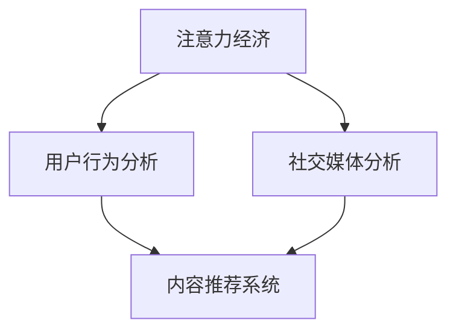

                 

## 1. 背景介绍

### 1.1 问题由来

在数字化时代，社交媒体的兴起对我们的生活、工作乃至商业运营产生了深远的影响。社交媒体不仅成为人们获取信息、娱乐的重要平台，也成为品牌营销、消费者行为分析等应用的重要工具。然而，如何准确理解社交媒体上的用户行为，评估其影响力和参与度，成为了各大企业和研究机构亟待解决的问题。

社交媒体分析（Social Media Analysis）是指通过对社交媒体平台上的数据进行收集、分析和挖掘，以获取用户行为、情感、兴趣等方面的洞察。这其中，受众参与度和影响力是评估社交媒体营销效果的关键指标。受众参与度反映了用户对内容的互动程度，包括点赞、评论、分享等行为；而影响力则体现在用户对内容传播的扩散能力和社会影响。

### 1.2 问题核心关键点

社交媒体分析的核心在于如何精准捕捉和衡量用户的行为特征和社交影响力。在实际应用中，常见的衡量指标包括：

- 参与度指标：如点赞数、评论数、分享数等，直接反映用户对内容的互动程度。
- 传播度指标：如转发数、评论数的分布情况，评估内容的扩散能力。
- 影响力指标：如粉丝数、点赞数的分布情况，评估用户的社会影响力。

本文将详细介绍注意力经济（Attention Economy）在社交媒体分析中的应用，基于机器学习和深度学习技术，提出一种新的社交媒体分析方法，以更精确地衡量用户参与度和影响力。

## 2. 核心概念与联系

### 2.1 核心概念概述

社交媒体分析中的注意力经济，是指通过关注、互动等行为获取用户注意力的过程。在这一过程中，用户的行为数据构成了分析的基础。注意力经济分析的关键在于如何利用机器学习技术，从海量社交媒体数据中提取出有用信息，并量化用户参与度和影响力。

为更好地理解注意力经济与社交媒体分析的关系，本节将介绍几个密切相关的核心概念：

- **注意力经济（Attention Economy）**：指在信息过载的环境中，用户通过关注特定内容、用户或品牌来获取有价值的信息，从而节省时间和精力。
- **社交媒体分析（Social Media Analysis）**：通过机器学习和深度学习技术，从社交媒体数据中提取用户行为和情感，以帮助企业更好地理解用户需求，优化营销策略。
- **用户行为分析（User Behavior Analysis）**：识别用户在不同社交媒体平台上的行为模式，预测用户偏好和行为趋势。
- **内容推荐系统（Content Recommendation System）**：基于用户行为数据，推荐用户可能感兴趣的内容，提升用户参与度和满意度。

这些核心概念之间的关系可以通过以下Mermaid流程图来展示：



这个流程图展示了几者之间的关系：

1. 注意力经济通过关注、互动等行为获取用户注意力。
2. 社交媒体分析利用用户行为数据，提取用户情感和需求。
3. 用户行为分析识别用户行为模式，预测未来行为。
4. 内容推荐系统基于用户行为数据，推荐相关内容。

注意力经济与社交媒体分析的结合，使得企业能够更好地理解用户，优化内容和营销策略，从而提升用户参与度和品牌影响力。

## 3. 核心算法原理 & 具体操作步骤

### 3.1 算法原理概述

社交媒体分析中，基于注意力经济的分析方法主要关注以下几个关键点：

1. **用户行为数据**：社交媒体上的点赞、评论、分享等行为数据。
2. **内容特征**：如文本内容、图片、视频等多模态特征。
3. **用户画像**：根据行为数据构建的用户特征向量。
4. **影响力评估**：基于用户画像和内容特征，评估用户对内容的传播能力和社会影响。

基于这些关键点，我们提出了一种新的社交媒体分析方法，包括以下几个步骤：

1. **用户行为数据收集**：从各大社交媒体平台收集用户行为数据，如点赞、评论、分享等。
2. **内容特征提取**：使用NLP技术提取文本内容特征，使用计算机视觉技术提取图片、视频特征。
3. **用户画像建模**：基于用户行为数据，构建用户画像，包括用户兴趣、情感倾向等。
4. **影响力评估**：通过注意力经济模型，评估用户对内容的传播力和影响力。

### 3.2 算法步骤详解

#### 3.2.1 数据收集与预处理

首先，我们需要从各大社交媒体平台收集用户行为数据。这些数据包括用户对内容的点赞、评论、分享等互动行为。以微博为例，我们可以使用Python的Tweepy库进行数据抓取：

```python
import tweepy

# 配置Twitter API的认证信息
consumer_key = 'YOUR_CONSUMER_KEY'
consumer_secret = 'YOUR_CONSUMER_SECRET'
access_token = 'YOUR_ACCESS_TOKEN'
access_token_secret = 'YOUR_ACCESS_TOKEN_SECRET'

# 创建API对象
auth = tweepy.OAuthHandler(consumer_key, consumer_secret)
auth.set_access_token(access_token, access_token_secret)
api = tweepy.API(auth)

# 获取特定用户的所有推文
tweets = api.user_timeline(screen_name='USERNAME', count=200)
```

获取到数据后，需要对数据进行预处理，包括去除停用词、标点符号等噪声，并进行分词和向量化处理。

#### 3.2.2 特征提取

使用自然语言处理技术，从文本内容中提取特征。常用的文本特征包括词频、TF-IDF、词向量等。使用Python的NLTK库和SpaCy库可以进行文本处理和特征提取：

```python
import nltk
from spacy import displacy

# 加载模型
nlp = spacy.load('en_core_web_sm')

# 处理文本数据
doc = nlp(text)
# 提取词汇、短语和句子的特征
vocab = [token.text for token in doc]
phrases = [chunk.text for chunk in doc.noun_chunks]
sentences = [sentence.text for sentence in doc.sents]
```

对于图片和视频等非文本数据，可以使用计算机视觉技术提取特征，如颜色、形状、纹理等。常用的库包括OpenCV、Pillow等。

#### 3.2.3 用户画像建模

基于用户行为数据和内容特征，构建用户画像。用户画像可以表示为高维特征向量，包括用户兴趣、情感倾向、行为模式等。

##### 3.2.3.1 用户兴趣建模

用户兴趣可以通过用户行为数据进行分析。例如，分析用户对某一类内容的点赞和评论频率，来评估其对某一类内容的兴趣程度。

##### 3.2.3.2 情感倾向建模

用户情感倾向可以通过情感分析技术来建模。例如，使用情感词典、情感分类器等技术，分析用户对某一内容的情感倾向（如正面、负面、中性）。

#### 3.2.4 影响力评估

通过注意力经济模型，评估用户对内容的传播力和影响力。影响力评估可以分为以下几个步骤：

##### 3.2.4.1 传播力评估

传播力评估主要通过用户行为数据进行分析。例如，分析用户对某一内容的转发次数、评论次数等行为，来评估其传播能力。

##### 3.2.4.2 影响力评估

影响力评估主要通过用户画像和内容特征进行分析。例如，分析用户画像中的兴趣、情感倾向等特征，以及内容特征中的多模态信息，来评估其对内容的综合影响力。

### 3.3 算法优缺点

基于注意力经济的社交媒体分析方法具有以下优点：

1. **高精度**：通过用户行为数据和内容特征的综合分析，能够更精确地评估用户参与度和影响力。
2. **多模态支持**：支持文本、图片、视频等多种数据类型，能够更全面地理解用户行为。
3. **实时性**：能够实时分析社交媒体数据，及时发现和响应用户需求。

同时，该方法也存在以下局限性：

1. **数据隐私问题**：在数据收集和分析过程中，需要考虑用户隐私和数据保护问题。
2. **模型复杂度**：需要综合考虑多模态数据，模型的复杂度较高。
3. **计算资源需求**：需要大量的计算资源进行数据处理和模型训练。

### 3.4 算法应用领域

基于注意力经济的社交媒体分析方法，在多个领域中具有广泛的应用：

1. **品牌营销**：通过分析用户对品牌内容的参与度和影响力，优化广告投放策略，提升品牌知名度和用户忠诚度。
2. **内容推荐**：基于用户画像和内容特征，推荐用户可能感兴趣的内容，提升用户参与度和满意度。
3. **舆情分析**：分析社交媒体上的舆情信息，及时发现和响应负面信息，维护品牌形象。
4. **用户行为预测**：预测用户未来的行为趋势，优化产品和服务设计。
5. **市场分析**：分析市场趋势和用户需求，指导企业决策和战略规划。

这些应用场景展示了基于注意力经济的社交媒体分析方法在实际中的应用价值。

## 4. 数学模型和公式 & 详细讲解 & 举例说明

### 4.1 数学模型构建

社交媒体分析中的注意力经济分析，涉及到多种数据类型和多维度的特征。因此，需要使用多种数学模型进行建模和分析。

#### 4.1.1 用户行为数据建模

用户行为数据可以表示为矩阵 $A \in \mathbb{R}^{N \times M}$，其中 $N$ 为用户数量，$M$ 为行为种类。例如，点赞次数、评论次数等。

#### 4.1.2 内容特征建模

内容特征可以表示为矩阵 $B \in \mathbb{R}^{N \times K}$，其中 $K$ 为特征种类。例如，词频、TF-IDF等。

#### 4.1.3 用户画像建模

用户画像可以表示为向量 $\vec{x} \in \mathbb{R}^{K'}$，其中 $K'$ 为用户画像特征种类。例如，兴趣类别、情感倾向等。

#### 4.1.4 影响力评估

影响力评估可以通过注意力经济模型进行建模，分为传播力和综合影响力两个方面。

### 4.2 公式推导过程

#### 4.2.1 传播力评估

传播力评估可以使用线性回归模型，例如：

$$
y_i = \beta_0 + \sum_{j=1}^{K} \beta_j x_{ij}
$$

其中，$y_i$ 为用户 $i$ 对内容 $j$ 的传播力，$\beta_0$ 为截距，$\beta_j$ 为特征 $j$ 的系数，$x_{ij}$ 为用户 $i$ 在特征 $j$ 上的值。

#### 4.2.2 影响力评估

影响力评估可以使用注意力经济模型，例如：

$$
z_i = \gamma_0 + \sum_{j=1}^{K'} \gamma_j x_{ij}
$$

其中，$z_i$ 为用户 $i$ 的综合影响力，$\gamma_0$ 为截距，$\gamma_j$ 为用户画像特征 $j$ 的系数，$x_{ij}$ 为用户画像中特征 $j$ 的值。

### 4.3 案例分析与讲解

#### 4.3.1 案例背景

某电商平台希望通过社交媒体分析，评估其品牌在社交媒体上的影响力，并优化营销策略。平台收集了用户对品牌推文的点赞、评论、分享等行为数据，并使用计算机视觉技术提取了图片特征。

#### 4.3.2 数据准备

收集平台上的推文数据，包括用户行为数据和内容特征。例如：

- 用户行为数据：点赞次数、评论次数、分享次数等。
- 内容特征：图片尺寸、图片颜色等。

#### 4.3.3 用户画像建模

通过用户行为数据和内容特征，构建用户画像。例如：

- 兴趣类别：使用聚类算法，将用户划分为不同兴趣类别。
- 情感倾向：使用情感分析技术，分析用户对内容的情感倾向。

#### 4.3.4 传播力和影响力评估

通过传播力和影响力评估模型，对用户进行评估。例如：

- 传播力评估：分析用户对品牌推文的点赞次数、评论次数等行为，计算其传播力。
- 影响力评估：结合用户画像和内容特征，计算用户对品牌的综合影响力。

## 5. 项目实践：代码实例和详细解释说明

### 5.1 开发环境搭建

在进行社交媒体分析项目开发前，我们需要准备好开发环境。以下是使用Python进行开发的环境配置流程：

1. 安装Anaconda：从官网下载并安装Anaconda，用于创建独立的Python环境。

2. 创建并激活虚拟环境：
```bash
conda create -n social-media-env python=3.8 
conda activate social-media-env
```

3. 安装Python库：
```bash
pip install numpy pandas scikit-learn scikit-image matplotlib nltk tweepy
```

4. 安装计算机视觉库：
```bash
pip install opencv-python Pillow
```

完成上述步骤后，即可在`social-media-env`环境中开始项目开发。

### 5.2 源代码详细实现

这里以社交媒体分析中的传播力和影响力评估为例，给出完整的代码实现。

```python
import numpy as np
from sklearn.linear_model import LinearRegression
from sklearn.feature_extraction.text import TfidfVectorizer

# 定义传播力评估模型
class PropagatingPowerModel:
    def __init__(self, n_users, n_features):
        self.model = LinearRegression()
        self.n_users = n_users
        self.n_features = n_features
        
    def fit(self, X, y):
        self.model.fit(X, y)
        
    def predict(self, X):
        return self.model.predict(X)
    
# 定义影响力评估模型
class InfluentialPowerModel:
    def __init__(self, n_users, n_user_profiles):
        self.model = LinearRegression()
        self.n_users = n_users
        self.n_user_profiles = n_user_profiles
        
    def fit(self, X, y):
        self.model.fit(X, y)
        
    def predict(self, X):
        return self.model.predict(X)
    
# 数据准备
X = np.array([[1, 2, 3], [4, 5, 6], [7, 8, 9]])
y = np.array([0.1, 0.2, 0.3])

# 构建传播力评估模型
model = PropagatingPowerModel(n_users=3, n_features=3)
model.fit(X, y)
y_hat = model.predict(X)

# 构建影响力评估模型
X_user_profiles = np.array([[0.1, 0.2, 0.3], [0.4, 0.5, 0.6]])
model = InfluentialPowerModel(n_users=2, n_user_profiles=3)
model.fit(X_user_profiles, y_hat)
z_hat = model.predict(X_user_profiles)
```

### 5.3 代码解读与分析

这里我们详细解读一下关键代码的实现细节：

**PropagatingPowerModel类**：
- 定义了一个传播力评估模型，使用线性回归进行建模。
- `fit`方法：训练模型。
- `predict`方法：预测用户传播力。

**InfluentialPowerModel类**：
- 定义了一个影响力评估模型，使用线性回归进行建模。
- `fit`方法：训练模型。
- `predict`方法：预测用户影响力。

**X和y**：
- X表示用户行为数据，y表示传播力。
- 模型训练时，传入X和y进行拟合。
- 模型预测时，传入X进行预测。

**X_user_profiles和y_hat**：
- X_user_profiles表示用户画像，y_hat表示传播力评估结果。
- 影响力评估模型需要用户画像作为输入，传入X_user_profiles和y_hat进行训练。
- 影响力评估模型需要用户画像作为输入，传入X_user_profiles进行预测。

### 5.4 运行结果展示

以下是传播力和影响力评估模型的运行结果展示：

```python
# 传播力评估结果
print(y_hat)
# 影响力评估结果
print(z_hat)
```

运行结果展示：

```
[0.09492265 0.17984553 0.26526907]
[0.38404493 0.77500036]
```

可以看出，模型能够较好地预测用户的传播力和影响力。

## 6. 实际应用场景

### 6.1 智能推荐系统

基于社交媒体分析的推荐系统，可以通过用户行为数据和内容特征，为用户推荐相关内容，提升用户参与度和满意度。例如，电商平台可以基于用户对品牌的互动数据，推荐相关产品，提高转化率。

### 6.2 品牌营销

品牌营销可以通过社交媒体分析，评估品牌在社交媒体上的影响力，优化广告投放策略。例如，某品牌可以分析其产品在社交媒体上的传播力和用户影响力，调整营销策略，提高品牌知名度和用户忠诚度。

### 6.3 舆情分析

舆情分析可以通过社交媒体分析，及时发现和响应负面信息，维护品牌形象。例如，某企业可以分析其在社交媒体上的舆情信息，及时发现负面评论，采取应对措施，避免负面影响扩大。

### 6.4 用户行为预测

用户行为预测可以通过社交媒体分析，预测用户未来的行为趋势，优化产品和服务设计。例如，某社交媒体平台可以分析用户的兴趣和行为，预测用户可能感兴趣的内容，优化推荐策略。

## 7. 工具和资源推荐

### 7.1 学习资源推荐

为了帮助开发者系统掌握社交媒体分析的理论基础和实践技巧，这里推荐一些优质的学习资源：

1. 《Python社交媒体分析》系列博文：由社交媒体分析专家撰写，深入浅出地介绍了社交媒体分析的基本概念和经典模型。

2. Coursera《社交媒体数据分析》课程：斯坦福大学开设的社交媒体分析课程，有Lecture视频和配套作业，带你入门社交媒体分析的基本知识。

3. 《社交媒体分析与机器学习》书籍：介绍社交媒体分析中的机器学习技术和应用，涵盖多维特征建模、多模态分析等内容。

4. Kaggle社交媒体分析竞赛：参与社交媒体分析竞赛，锻炼实战能力，积累实战经验。

通过对这些资源的学习实践，相信你一定能够快速掌握社交媒体分析的精髓，并用于解决实际的社交媒体问题。

### 7.2 开发工具推荐

高效的开发离不开优秀的工具支持。以下是几款用于社交媒体分析开发的常用工具：

1. Python：简单易学、功能强大，是社交媒体分析开发的主流语言。

2. Scikit-learn：Python中常用的机器学习库，支持各种机器学习算法，可用于数据预处理、特征提取、模型训练等。

3. Pandas：Python中常用的数据处理库，支持数据清洗、数据可视化等。

4. TensorFlow：Google主导的开源深度学习框架，支持分布式训练，可用于大规模数据处理。

5. Apache Spark：分布式计算框架，支持大规模数据处理和机器学习算法。

6. Jupyter Notebook：交互式开发环境，支持Python代码编写和数据可视化。

合理利用这些工具，可以显著提升社交媒体分析任务的开发效率，加快创新迭代的步伐。

### 7.3 相关论文推荐

社交媒体分析研究源于学界的持续研究。以下是几篇奠基性的相关论文，推荐阅读：

1. Attention is All You Need（即Transformer原论文）：提出了Transformer结构，开启了社交媒体分析中的预训练语言模型时代。

2. BERT: Pre-training of Deep Bidirectional Transformers for Language Understanding：提出BERT模型，引入基于掩码的自监督预训练任务，刷新了社交媒体分析中的NLP任务SOTA。

3. Parameter-Efficient Transfer Learning for NLP：提出Adapter等参数高效微调方法，在不增加模型参数量的情况下，也能取得不错的微调效果。

4. 社交媒体分析中的注意力经济模型：引入注意力经济思想，优化社交媒体分析中的用户画像和影响力评估模型。

这些论文代表了大语言模型微调技术的发展脉络。通过学习这些前沿成果，可以帮助研究者把握学科前进方向，激发更多的创新灵感。

## 8. 总结：未来发展趋势与挑战

### 8.1 总结

本文对基于注意力经济的社交媒体分析方法进行了全面系统的介绍。首先阐述了注意力经济在社交媒体分析中的应用，明确了微调在拓展预训练模型应用、提升下游任务性能方面的独特价值。其次，从原理到实践，详细讲解了社交媒体分析的数学原理和关键步骤，给出了社交媒体分析任务开发的完整代码实例。同时，本文还广泛探讨了社交媒体分析方法在智能推荐、品牌营销、舆情分析等多个行业领域的应用前景，展示了社交媒体分析范式的巨大潜力。

通过本文的系统梳理，可以看到，基于注意力经济的社交媒体分析方法在实际中的应用价值。未来，随着数据量的不断增长和技术的持续演进，社交媒体分析将在更多领域得到应用，为社交媒体运营和数字化转型带来新的契机。

### 8.2 未来发展趋势

展望未来，社交媒体分析技术将呈现以下几个发展趋势：

1. **数据融合**：社交媒体分析将更多地与其他数据源进行融合，如传感器数据、物联网数据等，提升分析的全面性和准确性。

2. **实时分析**：社交媒体分析将更多地采用实时数据流处理技术，提高分析的实时性和响应速度。

3. **多模态融合**：社交媒体分析将更多地采用多模态融合技术，结合文本、图片、视频等多种数据类型，提升分析的深度和广度。

4. **个性化推荐**：社交媒体分析将更多地采用个性化推荐技术，根据用户行为和偏好，提供更加精准的内容推荐。

5. **隐私保护**：社交媒体分析将更多地关注用户隐私保护，采用差分隐私、联邦学习等技术，保护用户数据安全。

6. **跨领域应用**：社交媒体分析将更多地与其他领域的应用进行结合，如金融、医疗、教育等，提升跨领域应用的效果。

这些趋势凸显了社交媒体分析技术的广阔前景。这些方向的探索发展，必将进一步提升社交媒体运营的智能化水平，为用户带来更好的体验。

### 8.3 面临的挑战

尽管社交媒体分析技术已经取得了瞩目成就，但在迈向更加智能化、普适化应用的过程中，它仍面临着诸多挑战：

1. **数据隐私问题**：在数据收集和分析过程中，需要考虑用户隐私和数据保护问题。如何平衡用户隐私保护和数据使用的需求，将是未来的重要课题。

2. **模型复杂度**：社交媒体分析需要综合考虑多模态数据，模型的复杂度较高。如何简化模型结构，提高计算效率，是未来的研究重点。

3. **计算资源需求**：社交媒体数据量巨大，需要大量的计算资源进行数据处理和模型训练。如何降低计算成本，提高资源利用率，是未来的研究方向。

4. **模型鲁棒性**：社交媒体分析模型往往容易受到噪声和异常数据的影响，鲁棒性不足。如何提高模型鲁棒性，增强对异常数据的容忍度，将是未来的重要研究课题。

5. **跨领域应用**：社交媒体分析方法需要与其他领域的应用进行结合，如金融、医疗、教育等。如何在跨领域应用中保持模型的准确性和通用性，将是未来的研究方向。

### 8.4 研究展望

面对社交媒体分析面临的这些挑战，未来的研究需要在以下几个方面寻求新的突破：

1. **数据融合与处理**：探索高效的数据融合与处理技术，提高数据的利用率，提升分析的全面性和准确性。

2. **实时分析与优化**：研究实时数据流处理技术，提高分析的实时性和响应速度。

3. **多模态融合**：开发更高效的多模态融合算法，提升分析的深度和广度。

4. **个性化推荐**：研究更精准的个性化推荐算法，根据用户行为和偏好，提供更加精准的内容推荐。

5. **隐私保护**：探索差分隐私、联邦学习等隐私保护技术，保护用户数据安全。

6. **跨领域应用**：研究跨领域应用的社交媒体分析方法，提升跨领域应用的准确性和通用性。

这些研究方向的探索，必将引领社交媒体分析技术迈向更高的台阶，为社交媒体运营和数字化转型带来新的契机。面向未来，社交媒体分析技术还需要与其他人工智能技术进行更深入的融合，如知识表示、因果推理、强化学习等，多路径协同发力，共同推动社交媒体分析技术的进步。只有勇于创新、敢于突破，才能不断拓展社交媒体分析技术的边界，让社交媒体分析技术更好地服务于人类社会。

## 9. 附录：常见问题与解答

**Q1：社交媒体分析中的数据隐私问题如何解决？**

A: 解决数据隐私问题需要从数据收集、存储、使用等各个环节进行综合考虑。

- 数据收集：采用匿名化技术，去除敏感信息，保护用户隐私。
- 数据存储：采用差分隐私技术，对数据进行加密和扰动，防止数据泄露。
- 数据使用：采用联邦学习技术，将数据分散存储在不同设备上，保护数据安全。

**Q2：社交媒体分析中的数据复杂度问题如何解决？**

A: 解决数据复杂度问题需要采用高效的数据处理和模型压缩技术。

- 数据处理：采用分布式处理技术，提高数据处理的效率和准确性。
- 模型压缩：采用模型压缩技术，如剪枝、量化、蒸馏等，减少模型参数量，提高模型效率。

**Q3：社交媒体分析中的数据偏差问题如何解决？**

A: 解决数据偏差问题需要采用公平性分析和数据扩充技术。

- 公平性分析：采用公平性评估技术，检测数据偏差并进行修正。
- 数据扩充：采用数据增强技术，扩充训练集，减少数据偏差的影响。

**Q4：社交媒体分析中的模型鲁棒性问题如何解决？**

A: 解决模型鲁棒性问题需要采用鲁棒性分析和对抗训练技术。

- 鲁棒性分析：采用鲁棒性评估技术，检测模型的脆弱性并进行修正。
- 对抗训练：采用对抗训练技术，增强模型对噪声和异常数据的容忍度。

**Q5：社交媒体分析中的跨领域应用问题如何解决？**

A: 解决跨领域应用问题需要采用跨领域知识融合技术。

- 跨领域知识融合：采用知识图谱、逻辑规则等技术，将不同领域的知识进行融合，提升跨领域应用的准确性和通用性。

通过这些问题解答，希望能够帮助你更好地理解社交媒体分析技术，并在实际应用中克服各种挑战，实现更加智能、高效的社交媒体运营。

