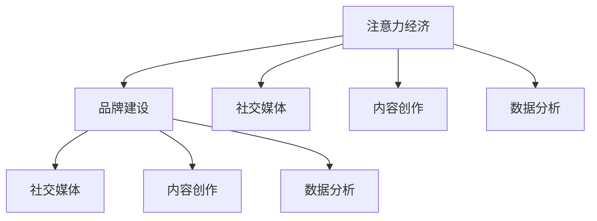

                 

# 注意力经济对企业品牌建设的新挑战

> 关键词：注意力经济, 品牌建设, 数字营销, 社交媒体, 内容创作, 数据分析

## 1. 背景介绍

### 1.1 问题由来
在数字化时代，信息爆炸成为企业面临的最大挑战之一。消费者每天被海量信息包围，注意力分散、注意力时长缩短，对品牌和产品信息的捕捉和处理能力大幅减弱。在此背景下，如何吸引并维持消费者的注意力，成为企业品牌建设的重要课题。

### 1.2 问题核心关键点
注意力经济是一种新的商业模型，旨在通过吸引并维持消费者的注意力，达到商业价值最大化的目的。品牌建设是企业利用注意力经济的关键手段，旨在通过塑造品牌形象、传递品牌价值，构建与消费者之间的情感联结，进而赢得市场份额。

当前，企业在品牌建设中面临的主要挑战包括：
1. 海量信息的竞争：在数字化时代，每个企业都在争夺消费者的注意力，信息过载使得消费者难以辨别品牌价值。
2. 品牌认知度低：尤其是中小企业，难以获得足够的曝光率，品牌认知度低，市场影响力有限。
3. 互动性不足：传统的品牌传播方式以单向信息输出为主，缺乏与消费者的互动，难以形成有效的品牌记忆。
4. 数据驱动决策困难：现有数据散乱，难以形成完整的数据画像，影响了品牌建设的科学性和准确性。

### 1.3 问题研究意义
研究注意力经济对企业品牌建设的新挑战，有助于企业掌握消费者注意力变化的规律，优化品牌传播策略，提升品牌影响力。同时，通过数据分析，为企业提供科学的品牌建设决策支持，提高品牌建设效果。

## 2. 核心概念与联系

### 2.1 核心概念概述

为更好地理解注意力经济对企业品牌建设的影响，本节将介绍几个关键概念：

- 注意力经济：通过吸引和维持消费者的注意力，达到商业价值最大化的经济模式。品牌建设是注意力经济的重要组成部分，品牌形象的塑造和传播是吸引消费者注意力的关键手段。
- 品牌建设：企业通过塑造独特的品牌形象、传递品牌价值，建立品牌认知度和品牌忠诚度的过程。品牌建设需要综合运用多种营销手段，包括社交媒体、广告、公关活动等。
- 社交媒体：指通过网络平台与用户进行互动交流的方式。社交媒体是品牌传播的重要渠道，通过用户生成内容(User Generated Content, UGC)、互动等手段，可以增强品牌的曝光率和互动性。
- 内容创作：品牌建设需要优质内容作为支撑，内容创作包括文字、图片、视频等多种形式，通过内容与消费者建立情感联结。
- 数据分析：通过分析消费者行为数据、市场数据等，掌握消费者偏好和市场变化，优化品牌建设策略，提高决策科学性。

这些核心概念之间的关系可以通过以下Mermaid流程图来展示：



这个流程图展示了大语言模型的核心概念及其之间的关系：

1. 注意力经济是品牌建设的驱动因素，通过吸引和维持消费者的注意力，达到商业价值最大化。
2. 社交媒体、内容创作和数据分析是品牌建设的重要手段，社交媒体通过互动增强品牌曝光，内容创作通过优质内容构建品牌认知，数据分析通过消费者行为分析指导品牌策略。
3. 品牌建设通过多种手段吸引并维持消费者的注意力，提升品牌价值。

## 3. 核心算法原理 & 具体操作步骤
### 3.1 算法原理概述

注意力经济的核心在于通过有吸引力的内容和互动方式，吸引并维持消费者的注意力。品牌建设则是通过塑造独特的品牌形象、传递品牌价值，建立品牌认知度和品牌忠诚度的过程。

在实际操作中，品牌建设可以分解为以下几个步骤：

1. **品牌形象塑造**：确定品牌的核心价值和独特卖点，设计符合品牌定位的视觉和文字元素。
2. **内容创作**：通过高质量的内容创作，吸引消费者的注意力，提升品牌曝光率。
3. **社交媒体互动**：通过社交媒体平台与消费者互动，增强品牌的社交影响力。
4. **数据分析**：利用数据分析工具，掌握消费者行为和市场趋势，优化品牌策略。

### 3.2 算法步骤详解

品牌建设过程中，数据驱动决策尤为重要。以下是一个基于数据驱动的品牌建设流程：

**Step 1: 数据收集与处理**
- 从社交媒体、网站、市场调研等多种渠道收集消费者数据，包括文本、图片、视频、购买行为等。
- 利用NLP技术对文本数据进行情感分析、主题分析、实体识别等处理，提取出有用的信息。
- 使用图像识别技术对图片和视频进行分类、标注等处理，生成结构化数据。

**Step 2: 数据建模与分析**
- 使用机器学习模型对消费者数据进行建模，如分类、聚类、关联规则挖掘等，分析消费者行为和偏好。
- 利用情感分析、主题分析等技术，挖掘消费者对品牌和产品的情感倾向，识别品牌认知度和忠诚度。
- 使用趋势分析、预测模型等技术，预测市场趋势和消费者需求变化。

**Step 3: 内容创作与社交媒体互动**
- 根据数据分析结果，确定品牌传播策略，设计符合消费者偏好的内容形式和主题。
- 利用社交媒体平台发布内容，吸引消费者关注和互动，增强品牌曝光率。
- 利用社交媒体互动工具，进行品牌传播效果监测和优化。

**Step 4: 数据分析与品牌优化**
- 利用数据监测工具，实时跟踪品牌传播效果，分析品牌曝光率、互动率、消费者情感倾向等关键指标。
- 根据数据分析结果，及时调整品牌策略，优化品牌传播路径和内容形式。
- 利用情感分析、主题分析等技术，不断优化品牌形象和内容创作，提升品牌认知度和忠诚度。

### 3.3 算法优缺点

基于数据驱动的品牌建设方法具有以下优点：
1. 科学性：通过数据分析，提供科学的品牌建设决策支持，提高品牌建设效果。
2. 精准性：通过消费者行为分析，识别出品牌建设的瓶颈和优势，有针对性地进行优化。
3. 动态性：通过实时数据监测，及时调整品牌策略，适应市场变化。

同时，该方法也存在一定的局限性：
1. 数据质量：品牌建设的科学性依赖于高质量的数据，数据散乱、不准确会严重影响决策。
2. 技术门槛：数据分析需要较高的技术门槛，企业需要投入资源进行技术研发和人才培养。
3. 隐私保护：数据分析涉及大量个人数据，需要遵守相关法律法规，保护消费者隐私。

### 3.4 算法应用领域

基于数据驱动的品牌建设方法在多个领域中得到了广泛应用，例如：

- 电商品牌建设：通过消费者购买行为数据分析，优化商品推荐、广告投放等策略，提升品牌曝光率和销售转化率。
- 旅游品牌建设：通过旅游者行为数据分析，优化旅游线路、景点推广等策略，提升品牌知名度和市场影响力。
- 金融品牌建设：通过客户行为数据分析，优化金融产品推荐、广告投放等策略，提升品牌忠诚度和市场份额。
- 教育品牌建设：通过学生行为数据分析，优化教学内容、广告投放等策略，提升品牌认知度和市场竞争力。
- 医疗品牌建设：通过患者行为数据分析，优化医疗服务推荐、广告投放等策略，提升品牌信任度和市场份额。

## 4. 数学模型和公式 & 详细讲解  
### 4.1 数学模型构建

品牌建设的数据驱动决策过程可以建模为一个带有多个特征的分类问题。假设有 $N$ 个消费者，每个消费者有 $M$ 个特征 $X_i$，分别表示社交媒体互动、内容创作效果、购买行为等。品牌建设的目标是根据这些特征，预测消费者对品牌的认知度 $Y$。

定义品牌认知度 $Y$ 为二分类变量，$Y=1$ 表示消费者对品牌有认知，$Y=0$ 表示消费者对品牌无认知。建模过程如下：

$$
\hat{Y} = \mathrm{sigmoid}(W \cdot [X] + b)
$$

其中 $W$ 为模型权重，$b$ 为偏置项，$[X]$ 表示特征向量。$\mathrm{sigmoid}$ 函数将线性输出映射到 $[0,1]$ 区间，表示消费者对品牌认知的概率。

### 4.2 公式推导过程

根据上述模型，品牌认知度的预测概率为：

$$
\hat{P}(Y=1|X_i) = \sigma(W \cdot [X_i] + b)
$$

其中 $\sigma$ 为 sigmoid 函数，$\hat{P}(Y=1|X_i)$ 表示消费者对品牌有认知的概率。

品牌认知度的对数似然函数为：

$$
\log \mathcal{L}(W,b) = \sum_{i=1}^N \{ y_i \log \hat{P}(Y=1|X_i) + (1-y_i) \log(1-\hat{P}(Y=1|X_i)) \}
$$

在训练过程中，最小化对数似然函数即可优化模型参数 $W$ 和 $b$。利用梯度下降等优化算法，对上述模型进行迭代优化。

### 4.3 案例分析与讲解

以电商品牌建设为例，通过消费者在电商平台上的浏览、购买、评价等行为数据，利用上述模型预测消费者对品牌的认知度。具体步骤如下：

**Step 1: 数据收集**
- 收集电商平台的消费者行为数据，包括浏览记录、购买记录、评价内容等。
- 使用NLP技术对评价内容进行情感分析，提取情感倾向。
- 使用图像识别技术对产品图片进行分类、标注等处理。

**Step 2: 数据建模**
- 使用机器学习算法对消费者行为数据进行建模，如分类、聚类、关联规则挖掘等。
- 利用情感分析、主题分析等技术，挖掘消费者对品牌和产品的情感倾向。
- 使用趋势分析、预测模型等技术，预测市场趋势和消费者需求变化。

**Step 3: 内容创作与社交媒体互动**
- 根据数据分析结果，确定品牌传播策略，设计符合消费者偏好的内容形式和主题。
- 利用社交媒体平台发布内容，吸引消费者关注和互动，增强品牌曝光率。
- 利用社交媒体互动工具，进行品牌传播效果监测和优化。

**Step 4: 数据分析与品牌优化**
- 利用数据监测工具，实时跟踪品牌传播效果，分析品牌曝光率、互动率、消费者情感倾向等关键指标。
- 根据数据分析结果，及时调整品牌策略，优化品牌传播路径和内容形式。
- 利用情感分析、主题分析等技术，不断优化品牌形象和内容创作，提升品牌认知度和忠诚度。

## 5. 项目实践：代码实例和详细解释说明
### 5.1 开发环境搭建

在进行品牌建设的数据驱动决策实践前，我们需要准备好开发环境。以下是使用Python进行Scikit-Learn开发的环境配置流程：

1. 安装Anaconda：从官网下载并安装Anaconda，用于创建独立的Python环境。

2. 创建并激活虚拟环境：
```bash
conda create -n brand_env python=3.8 
conda activate brand_env
```

3. 安装Scikit-Learn：
```bash
conda install scikit-learn pandas numpy matplotlib
```

4. 安装各类工具包：
```bash
pip install jupyter notebook ipython
```

完成上述步骤后，即可在`brand_env`环境中开始品牌建设的数据驱动决策实践。

### 5.2 源代码详细实现

下面我们以电商品牌建设为例，给出使用Scikit-Learn对品牌认知度进行预测的PyTorch代码实现。

首先，定义数据预处理函数：

```python
import pandas as pd
from sklearn.model_selection import train_test_split
from sklearn.preprocessing import LabelEncoder
from sklearn.ensemble import RandomForestClassifier
from sklearn.metrics import accuracy_score, classification_report

def load_data(file_path):
    data = pd.read_csv(file_path)
    X = data[['浏览时间', '浏览次数', '购买金额', '评价情感']]
    y = data['品牌认知度']
    return X, y

def preprocess_data(X, y):
    label_encoder = LabelEncoder()
    y = label_encoder.fit_transform(y)
    X['品牌认知度'] = label_encoder.transform(y)
    return X, y

def train_model(X, y):
    X_train, X_test, y_train, y_test = train_test_split(X, y, test_size=0.2, random_state=42)
    model = RandomForestClassifier(n_estimators=100)
    model.fit(X_train, y_train)
    return model, X_test, y_test

def evaluate_model(model, X_test, y_test):
    y_pred = model.predict(X_test)
    accuracy = accuracy_score(y_test, y_pred)
    print('Accuracy:', accuracy)
    print(classification_report(y_test, y_pred))

# 加载数据
X, y = load_data('brand_data.csv')
X_train, y_train = preprocess_data(X, y)
model, X_test, y_test = train_model(X_train, y_train)

# 评估模型
evaluate_model(model, X_test, y_test)
```

然后，启动训练流程并在测试集上评估：

```python
# 训练模型
model = train_model(X_train, y_train)

# 评估模型
evaluate_model(model, X_test, y_test)
```

以上就是使用Scikit-Learn对品牌认知度进行预测的完整代码实现。可以看到，通过Scikit-Learn，我们能够简单高效地构建和评估品牌认知度预测模型。

### 5.3 代码解读与分析

让我们再详细解读一下关键代码的实现细节：

**load_data函数**：
- 加载电商平台消费者行为数据，包括浏览记录、购买记录、评价内容等。
- 使用NLP技术对评价内容进行情感分析，提取情感倾向。
- 使用图像识别技术对产品图片进行分类、标注等处理。

**preprocess_data函数**：
- 对数据进行预处理，包括标签编码和特征工程等操作。
- 使用LabelEncoder对标签进行编码，将品牌认知度转化为数字标签。
- 对特征进行处理，包括特征工程、缺失值处理等操作，确保数据的质量和一致性。

**train_model函数**：
- 将数据划分为训练集和测试集。
- 使用RandomForestClassifier构建预测模型，并使用交叉验证优化模型参数。
- 返回训练好的模型和测试集数据。

**evaluate_model函数**：
- 使用训练好的模型对测试集进行预测，计算模型预测的准确率和分类报告。
- 输出模型的预测结果和评估指标。

通过上述函数，我们可以将电商品牌建设的数据驱动决策过程系统化、规范化，提升品牌建设的科学性和准确性。

当然，工业级的系统实现还需考虑更多因素，如模型保存和部署、超参数的自动搜索、更灵活的特征工程等。但核心的数据驱动决策流程基本与此类似。

## 6. 实际应用场景
### 6.1 电商品牌建设

电商品牌建设是数据驱动决策的重要应用场景。通过分析消费者在电商平台上的行为数据，构建品牌认知度预测模型，可以为品牌传播策略提供数据支持，提升品牌曝光率和销售转化率。

在实际应用中，可以采用以下步骤：
- 收集电商平台的消费者行为数据，包括浏览记录、购买记录、评价内容等。
- 使用NLP技术对评价内容进行情感分析，提取情感倾向。
- 使用图像识别技术对产品图片进行分类、标注等处理。
- 使用机器学习算法对消费者行为数据进行建模，预测品牌认知度。
- 根据数据分析结果，确定品牌传播策略，设计符合消费者偏好的内容形式和主题。
- 利用社交媒体平台发布内容，吸引消费者关注和互动，增强品牌曝光率。
- 利用社交媒体互动工具，进行品牌传播效果监测和优化。
- 利用数据监测工具，实时跟踪品牌传播效果，分析品牌曝光率、互动率、消费者情感倾向等关键指标。
- 根据数据分析结果，及时调整品牌策略，优化品牌传播路径和内容形式。

### 6.2 旅游品牌建设

旅游品牌建设也是数据驱动决策的重要应用场景。通过分析旅游者在社交媒体上的行为数据，构建品牌认知度预测模型，可以为旅游线路、景点推广等策略提供数据支持，提升品牌知名度和市场影响力。

在实际应用中，可以采用以下步骤：
- 收集社交媒体上的旅游者行为数据，包括评论内容、点赞数、分享数等。
- 使用NLP技术对评论内容进行情感分析，提取情感倾向。
- 使用图像识别技术对旅游景点图片进行分类、标注等处理。
- 使用机器学习算法对旅游者行为数据进行建模，预测品牌认知度。
- 根据数据分析结果，确定品牌传播策略，设计符合旅游者偏好的内容形式和主题。
- 利用社交媒体平台发布内容，吸引旅游者关注和互动，增强品牌曝光率。
- 利用社交媒体互动工具，进行品牌传播效果监测和优化。
- 利用数据监测工具，实时跟踪品牌传播效果，分析品牌曝光率、互动率、旅游者情感倾向等关键指标。
- 根据数据分析结果，及时调整品牌策略，优化品牌传播路径和内容形式。

### 6.3 金融品牌建设

金融品牌建设同样是数据驱动决策的重要应用场景。通过分析客户的金融行为数据，构建品牌忠诚度预测模型，可以为金融产品推荐、广告投放等策略提供数据支持，提升品牌忠诚度和市场份额。

在实际应用中，可以采用以下步骤：
- 收集金融客户的行为数据，包括消费记录、转账记录、理财记录等。
- 使用NLP技术对交易记录进行情感分析，提取情感倾向。
- 使用图像识别技术对金融产品图片进行分类、标注等处理。
- 使用机器学习算法对客户行为数据进行建模，预测品牌忠诚度。
- 根据数据分析结果，确定品牌传播策略，设计符合客户偏好的内容形式和主题。
- 利用社交媒体平台发布内容，吸引客户关注和互动，增强品牌曝光率。
- 利用社交媒体互动工具，进行品牌传播效果监测和优化。
- 利用数据监测工具，实时跟踪品牌传播效果，分析品牌曝光率、互动率、客户情感倾向等关键指标。
- 根据数据分析结果，及时调整品牌策略，优化品牌传播路径和内容形式。

## 7. 工具和资源推荐
### 7.1 学习资源推荐

为了帮助开发者系统掌握数据驱动决策的理论基础和实践技巧，这里推荐一些优质的学习资源：

1. 《机器学习实战》书籍：经典机器学习入门书籍，介绍了各种机器学习算法和实践案例，适合新手学习。
2. 《Python数据科学手册》书籍：全面介绍Python在数据科学中的应用，涵盖数据处理、分析、可视化等技术。
3. 《深度学习入门》课程：由Google开发者编写，介绍了深度学习的基本概念和实践技巧，适合初学者。
4. Scikit-Learn官方文档：Scikit-Learn的官方文档，提供了详细的API文档和示例代码，是数据科学实践的必备资源。
5. Kaggle竞赛：Kaggle是世界上最大的数据科学竞赛平台，通过参与竞赛可以积累实践经验，提升数据科学能力。

通过对这些资源的学习实践，相信你一定能够快速掌握数据驱动决策的精髓，并用于解决实际的品牌建设问题。
###  7.2 开发工具推荐

高效的开发离不开优秀的工具支持。以下是几款用于数据驱动决策开发的常用工具：

1. Scikit-Learn：基于Python的开源机器学习库，提供了丰富的机器学习算法和工具，支持数据预处理、建模、评估等。
2. TensorFlow：由Google主导开发的开源机器学习框架，支持大规模分布式计算，适合工业级应用。
3. PyTorch：基于Python的开源深度学习框架，灵活动态的计算图，适合快速迭代研究。
4. Jupyter Notebook：免费的开源交互式计算平台，支持多种编程语言和数据格式，适合数据科学研究和开发。
5. Matplotlib：Python的绘图库，支持多种图表类型和自定义风格，适合数据可视化。
6. Pandas：Python的数据分析库，提供了高效的数据处理和分析功能，适合数据清洗和预处理。

合理利用这些工具，可以显著提升数据驱动决策的开发效率，加快创新迭代的步伐。

### 7.3 相关论文推荐

数据驱动决策的研究源于学界的持续研究。以下是几篇奠基性的相关论文，推荐阅读：

1. The Elements of Statistical Learning（《统计学习方法》）：斯坦福大学机器学习课程的教材，涵盖了各种机器学习算法和理论。
2. Predictive Analytics：The Science of Imperfect Prediction（《预测分析：不完美的预测科学》）：预测分析领域的经典书籍，介绍了预测模型的建立和应用。
3. Machine Learning Yearning（《机器学习速成》）：Andrew Ng的经典书籍，介绍了机器学习的理论和实践技巧，适合实战经验积累。
4. Big Data Analysis：Principles and Best Practices（《大数据分析：原理与最佳实践》）：大数据分析领域的经典书籍，介绍了大数据分析的技术和最佳实践。

这些论文代表了大数据驱动决策的研究方向，通过学习这些前沿成果，可以帮助研究者把握学科前进方向，激发更多的创新灵感。

## 8. 总结：未来发展趋势与挑战
### 8.1 总结

本文对数据驱动决策在企业品牌建设中的应用进行了全面系统的介绍。首先阐述了数据驱动决策在品牌建设中的重要作用，明确了品牌建设对注意力经济的依赖，品牌建设需要综合运用多种手段，包括社交媒体、内容创作、数据分析等。其次，从原理到实践，详细讲解了数据驱动决策的数学模型和算法实现，给出了品牌建设的数据驱动决策实践代码实例。同时，本文还广泛探讨了数据驱动决策在多个行业领域的应用前景，展示了数据驱动决策的广泛应用。

通过本文的系统梳理，可以看到，数据驱动决策为品牌建设提供了科学、精准、动态的决策支持，有助于企业把握消费者注意力变化的规律，优化品牌传播策略，提升品牌影响力。未来，伴随数据驱动决策技术的不断进步，品牌建设将迎来更多的创新和突破，为人类社会的数字化进程注入新的活力。

### 8.2 未来发展趋势

展望未来，数据驱动决策在品牌建设中的应用将呈现以下几个发展趋势：

1. 多模态数据融合：数据驱动决策将进一步拓展到图像、视频、语音等多种模态数据，多模态信息的融合将提升品牌建设的效果。
2. 实时数据监测：实时数据监测将使得品牌传播策略能够快速响应市场变化，提高品牌建设的动态性和灵活性。
3. 智能推荐系统：利用机器学习算法优化品牌推荐策略，提升消费者的品牌认知度和忠诚度。
4. 个性化内容创作：基于数据分析结果，生成个性化品牌内容，提高品牌传播的精准性和互动性。
5. 情感分析与情感营销：利用情感分析技术，识别消费者的情感倾向，优化品牌传播策略，实现情感营销。

以上趋势凸显了数据驱动决策的广阔前景，数据驱动决策在品牌建设中的应用将更加广泛和深入。

### 8.3 面临的挑战

尽管数据驱动决策在品牌建设中取得了显著成效，但在迈向更加智能化、普适化应用的过程中，它仍面临着诸多挑战：

1. 数据质量问题：品牌建设的科学性依赖于高质量的数据，数据的不完整、不准确会严重影响决策。
2. 技术门槛高：数据分析需要较高的技术门槛，企业需要投入资源进行技术研发和人才培养。
3. 数据隐私问题：数据分析涉及大量个人数据，需要遵守相关法律法规，保护消费者隐私。
4. 模型复杂度高：数据驱动决策模型往往复杂度较高，模型解释性和可解释性差，难以理解和调试。

### 8.4 研究展望

面对数据驱动决策面临的这些挑战，未来的研究需要在以下几个方面寻求新的突破：

1. 数据质量提升：开发数据清洗、数据补全等技术，提高数据质量，为品牌建设提供可靠的数据基础。
2. 技术标准化：制定数据驱动决策技术标准，降低技术门槛，促进技术的普及和应用。
3. 数据隐私保护：研究数据隐私保护技术，确保数据驱动决策中的个人数据安全。
4. 模型解释性提升：开发可解释性强的模型，增强品牌建设决策的可理解和可控性。

这些研究方向将推动数据驱动决策技术的进一步发展，为品牌建设提供更加科学、可靠、高效的数据支持，促进品牌建设的创新和突破。

## 9. 附录：常见问题与解答

**Q1：数据驱动决策是否适用于所有品牌建设场景？**

A: 数据驱动决策在大多数品牌建设场景中都能取得不错的效果，特别是对于数据量较大的场景。但对于一些特殊场景，如创意类品牌建设，数据驱动决策可能无法提供全面的支持。此时需要结合专业经验和创意进行决策。

**Q2：数据驱动决策过程中需要注意哪些问题？**

A: 数据驱动决策过程中需要注意以下几个问题：
1. 数据收集：确保数据来源的多样性和代表性，收集完整、准确的数据。
2. 数据处理：对数据进行清洗、去重、补全等处理，确保数据的质量和一致性。
3. 数据分析：选择合适的算法和模型，进行数据建模和分析，确保分析结果的可靠性和准确性。
4. 模型评估：对模型进行评估和优化，确保模型性能和泛化能力。
5. 应用部署：将模型应用于品牌建设决策中，确保模型性能和稳定性。
6. 持续优化：根据品牌建设效果和市场变化，不断优化模型和决策策略。

**Q3：如何确保数据驱动决策的准确性和可靠性？**

A: 确保数据驱动决策的准确性和可靠性需要以下几个步骤：
1. 数据质量控制：确保数据来源的多样性和代表性，进行数据清洗、去重、补全等处理，确保数据的质量和一致性。
2. 算法选择：选择合适的算法和模型，进行数据建模和分析，确保分析结果的可靠性和准确性。
3. 模型评估：对模型进行评估和优化，确保模型性能和泛化能力。
4. 持续优化：根据品牌建设效果和市场变化，不断优化模型和决策策略，确保决策的及时性和有效性。

通过以上步骤，可以确保数据驱动决策的准确性和可靠性，提高品牌建设的科学性和成功率。

---

作者：禅与计算机程序设计艺术 / Zen and the Art of Computer Programming

