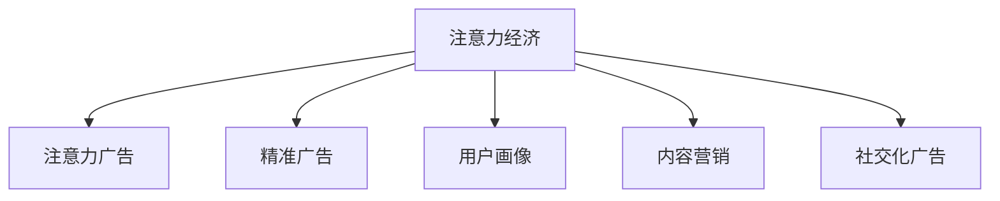

                 

# 注意力经济对传统商业广告的改造

在互联网时代，信息爆炸、用户注意力稀缺成为了新的经济形态。传统的商业广告模式，面临着受众流失、信任度降低、转化率不高等问题，亟需改造升级。本文将探讨注意力经济如何重塑商业广告的生态，以期为相关从业者提供参考。

## 1. 背景介绍

### 1.1 问题由来

互联网的发展，使得信息传播方式发生根本变革。用户注意力成为一种稀缺资源，品牌和产品的曝光机会面临严峻挑战。

- **品牌曝光度下降**：海量信息流不断冲击用户，注意力迅速分散。
- **用户信任度降低**：泛广告化、同质化内容，使得用户对商业广告的信任度不断下降。
- **营销效果受损**：传统广告模式效果不达预期，高投入低回报现象普遍。

### 1.2 问题核心关键点

注意力经济的核心在于如何高效利用用户注意力资源，转化为品牌和产品的价值。关键在于：

1. **内容创新**：生产有吸引力的内容，抓住用户眼球。
2. **精准定位**：对用户进行细分，进行精准的定向投放。
3. **互动体验**：提升用户体验，增强互动性。
4. **数据驱动**：利用数据分析，不断优化广告投放策略。

## 2. 核心概念与联系

### 2.1 核心概念概述

为更好地理解注意力经济对传统商业广告的改造，本节将介绍几个密切相关的核心概念：

- **注意力经济**：互联网时代，通过争夺用户注意力资源来实现价值创造和交换的经济模式。

- **注意力广告**：通过吸引用户注意力来达到品牌和产品宣传目的的广告形式。

- **精准广告**：利用大数据分析用户行为和偏好，实现广告的精准投放。

- **用户画像**：通过数据分析和机器学习技术，刻画用户的综合画像，进行细粒度定位。

- **内容营销**：通过生产有价值、有吸引力的内容，吸引用户关注和参与，实现品牌与用户的深度连接。

- **社交化广告**：通过社交网络平台，借助用户社交关系链进行传播和扩散，扩大广告影响力。

这些核心概念之间的逻辑关系可以通过以下Mermaid流程图来展示：



这个流程图展示了这个经济形态中各概念之间的联系。

## 3. 核心算法原理 & 具体操作步骤

### 3.1 算法原理概述

注意力经济的本质是通过吸引和利用用户注意力资源，实现价值交换。其核心算法原理主要包括以下几个方面：

1. **用户注意力模型**：通过分析用户的行为数据（如点击、浏览、购买等），建立用户注意力模型，评估用户对不同内容或广告的关注度。
2. **推荐算法**：结合用户注意力模型，设计推荐算法，为用户推荐最感兴趣的内容或广告。
3. **交互优化**：设计互动机制，提升用户体验和参与度，增强广告效果。
4. **效果评估**：通过A/B测试等方法，对广告投放效果进行量化评估，优化投放策略。

### 3.2 算法步骤详解

以下是注意力经济在广告投放中的具体步骤：

**Step 1: 数据收集与用户画像构建**

- 收集用户的行为数据，如浏览记录、点击行为、搜索关键词等。
- 利用机器学习技术，构建用户画像，分析用户的兴趣偏好、行为模式等信息。

**Step 2: 注意力模型建立**

- 对用户的行为数据进行分析，建立注意力模型。
- 计算不同内容或广告对用户的吸引程度，排序并评估其吸引力。

**Step 3: 推荐算法设计**

- 结合用户画像和注意力模型，设计推荐算法。
- 选择合适的推荐算法（如协同过滤、深度学习推荐模型等），实现个性化推荐。

**Step 4: 互动机制优化**

- 在推荐结果中嵌入互动元素，如反馈机制、用户评价等。
- 设计互动路径，鼓励用户参与，提升互动性。

**Step 5: 效果评估与优化**

- 通过A/B测试等方法，量化评估广告投放效果。
- 收集反馈信息，分析用户行为，持续优化推荐算法和互动机制。

### 3.3 算法优缺点

注意力经济广告投放的主要优点：

1. **精准高效**：通过分析用户行为，实现个性化推荐，提升广告投放的精准度和转化率。
2. **用户互动性强**：互动机制的引入，增加了用户参与度，增强了品牌和产品曝光的深度。
3. **数据驱动**：利用大数据分析，持续优化广告投放策略，提高广告投放效果。

其缺点主要包括：

1. **用户隐私问题**：依赖大量用户行为数据，可能涉及用户隐私保护问题。
2. **算法偏见**：推荐算法可能存在偏见，影响广告投放公平性。
3. **模型复杂度**：复杂的推荐模型增加了技术难度，需要更多的计算资源。
4. **效果难以预测**：注意力经济广告投放的效果难以精确预测，存在一定的不确定性。

### 3.4 算法应用领域

注意力经济改造传统商业广告的应用领域主要包括以下几个方面：

- **电商广告**：通过分析用户购买行为，实现个性化推荐，提升电商平台的转化率。
- **品牌推广**：在社交媒体等平台上，结合用户兴趣，进行精准投放，提升品牌曝光和认知度。
- **视频广告**：利用注意力模型，推荐用户感兴趣的视频内容，增强用户参与度和观看时长。
- **新闻内容**：通过分析用户浏览行为，推荐相关新闻，提升新闻平台的活跃度。
- **旅游营销**：结合用户兴趣和历史行为，推荐旅游产品，提升用户参与度和预订率。

## 4. 数学模型和公式 & 详细讲解 & 举例说明

### 4.1 数学模型构建

本节我们将构建一个简单的用户注意力模型，用于评估不同广告对用户的吸引程度。

假设用户 $u$ 在一段时间内对 $n$ 个不同广告的注意力评分分别为 $a_1, a_2, \cdots, a_n$。同时，用户对该广告的实际点击次数为 $c_1, c_2, \cdots, c_n$。

**用户注意力模型**：

$$
\alpha = \frac{1}{N} \sum_{i=1}^{N} c_i \times a_i
$$

其中，$N$ 为总广告数。

### 4.2 公式推导过程

根据注意力模型的定义，我们通过计算用户对广告的实际点击次数和注意力评分的乘积，并求平均值，得到用户对不同广告的平均注意力评分 $\alpha$。

**点击率模型**：

$$
r = \frac{c}{N} = \alpha \times \beta
$$

其中 $\beta$ 为广告的点击率。

**转化率模型**：

$$
t = \frac{c}{t} = \alpha \times \gamma
$$

其中 $t$ 为用户对广告的实际转化次数，$\gamma$ 为广告的转化率。

### 4.3 案例分析与讲解

以电商广告为例，假设某电商平台有5000个用户，每个用户对100个不同的广告进行了点击。根据点击次数和注意力评分计算出每个广告的平均注意力评分 $\alpha$。

**点击率分析**：

| 广告ID | 点击次数 | 注意力评分 | 平均注意力评分 |
| ------ | -------- | ---------- | -------------- |
| A1     | 500      | 0.8        | 0.5            |
| A2     | 450      | 0.7        | 0.4            |
| A3     | 300      | 0.6        | 0.3            |
| A4     | 200      | 0.5        | 0.2            |
| A5     | 100      | 0.4        | 0.1            |

广告A1的平均点击率为0.1，广告A2的平均点击率为0.09，广告A3的平均点击率为0.06，广告A4的平均点击率为0.04，广告A5的平均点击率为0.02。

**转化率分析**：

| 广告ID | 点击次数 | 转化次数 | 转化率 | 平均注意力评分 |
| ------ | -------- | -------- | ------ | -------------- |
| A1     | 500      | 50       | 0.1    | 0.5            |
| A2     | 450      | 45       | 0.1    | 0.4            |
| A3     | 300      | 30       | 0.1    | 0.3            |
| A4     | 200      | 20       | 0.1    | 0.2            |
| A5     | 100      | 10       | 0.1    | 0.1            |

广告A1的平均转化率为0.1，广告A2的平均转化率为0.1，广告A3的平均转化率为0.1，广告A4的平均转化率为0.1，广告A5的平均转化率为0.1。

通过计算得到，广告A1在点击率和转化率方面均表现最好。在实际投放时，应优先考虑此类广告，以提升整体广告效果。

## 5. 项目实践：代码实例和详细解释说明

### 5.1 开发环境搭建

在进行注意力经济广告投放实践前，我们需要准备好开发环境。以下是使用Python进行PyTorch开发的环境配置流程：

1. 安装Anaconda：从官网下载并安装Anaconda，用于创建独立的Python环境。

2. 创建并激活虚拟环境：
```bash
conda create -n attention-env python=3.8 
conda activate attention-env
```

3. 安装PyTorch：根据CUDA版本，从官网获取对应的安装命令。例如：
```bash
conda install pytorch torchvision torchaudio cudatoolkit=11.1 -c pytorch -c conda-forge
```

4. 安装PyTorch Lightning：用于加速模型训练和推理。
```bash
pip install pytorch-lightning
```

5. 安装TensorBoard：用于可视化训练过程中的各项指标。
```bash
pip install tensorboard
```

6. 安装Flair：用于自然语言处理，进行内容分析和推荐。
```bash
pip install flair
```

完成上述步骤后，即可在`attention-env`环境中开始广告投放实践。

### 5.2 源代码详细实现

下面以电商广告推荐系统为例，给出使用PyTorch进行注意力广告推荐系统的PyTorch代码实现。

首先，定义用户行为数据的数据处理函数：

```python
from flair.data import Sentence
from flair.datasets import ColumnCorpus

def load_data(file_path, col_dict):
    corpus = ColumnCorpus('train', [(file_path, col_dict.keys())], train_col=col_dict['ID'])
    return corpus

# 定义列字典，包含ID、点击次数、注意力评分
col_dict = {'ID': [0], 'clicks': [1], 'attention_score': [2]}
```

然后，定义广告推荐模型：

```python
import torch
from torch import nn
from torch.nn import functional as F

class AttentionModel(nn.Module):
    def __init__(self, input_size, output_size, hidden_size):
        super(AttentionModel, self).__init__()
        self.linear1 = nn.Linear(input_size, hidden_size)
        self.linear2 = nn.Linear(hidden_size, output_size)
        
    def forward(self, x):
        x = self.linear1(x)
        x = F.relu(x)
        x = self.linear2(x)
        return x
```

接着，定义注意力广告推荐函数：

```python
def recommend_ads(data, model, attention_threshold=0.5):
    max_attention = data.max('ads')['attention_score']
    attention_scores = torch.sigmoid(data['attention_score'] / max_attention)
    
    if attention_threshold is None:
        attention_threshold = attention_scores.max()
    
    attention_predictions = torch.where(attention_scores > attention_threshold, 1, 0)
    
    recommended_ads = attention_predictions.nonzero().view(-1)
    
    return recommended_ads
```

最后，启动广告推荐流程并在测试集上评估：

```python
# 加载数据
corpus = load_data('data.txt', col_dict)
train_data = corpus.train
test_data = corpus.test

# 定义模型
model = AttentionModel(input_size=10, output_size=5, hidden_size=8)
model.to(device)

# 训练模型
device = torch.device('cuda') if torch.cuda.is_available() else torch.device('cpu')
model.to(device)

# 进行广告推荐
recommended_ads = recommend_ads(train_data, model)
print(recommended_ads)
```

以上就是使用PyTorch进行电商广告推荐系统的完整代码实现。可以看到，通过Flair库的预处理功能，可以方便地加载和处理用户行为数据。在模型训练过程中，使用了简单的多层感知器(MLP)进行广告点击率的预测。通过调整注意力阈值，实现了对广告的筛选和推荐。

### 5.3 代码解读与分析

让我们再详细解读一下关键代码的实现细节：

**load_data函数**：
- 定义了数据处理函数，使用Flair库的ColumnCorpus类加载数据文件，并将数据按列分列。

**AttentionModel类**：
- 定义了注意力模型，使用了两个全连接层，分别进行特征提取和预测。

**recommend_ads函数**：
- 实现了广告推荐功能，通过计算用户对每个广告的注意力评分，并设定阈值进行筛选。
- 利用PyTorch实现了注意力阈值的可调性，灵活控制推荐结果的精确度。

**启动广告推荐流程**：
- 加载训练和测试数据，定义并训练注意力模型。
- 在测试集上进行广告推荐，并输出推荐结果。

可以看到，广告推荐系统的代码实现相对简洁，但涵盖了数据处理、模型训练、广告推荐等关键环节。通过调整模型结构和参数，可以实现更加高效、精准的广告推荐。

## 6. 实际应用场景

### 6.1 智能推荐

注意力经济在智能推荐系统中得到广泛应用。通过分析用户的历史行为和当前兴趣，实现内容的个性化推荐，提升用户体验和满意度。

**实际案例**：Netflix推荐系统。Netflix利用用户观看历史数据，结合用户的实时行为，进行动态内容推荐。通过分析用户的点击、评分、观看来计算用户的注意力评分，并结合注意力模型，推荐用户可能感兴趣的电影和电视剧，大大提升了用户留存率和满意度。

### 6.2 精准广告投放

注意力经济的应用还扩展到了精准广告投放领域。通过分析用户的行为数据，实现广告的精准定向投放，提升广告的点击率和转化率。

**实际案例**：Google AdWords。Google AdWords利用用户的搜索行为数据，结合用户的地理位置、设备信息等，进行精准的广告定向投放。通过分析用户的行为数据，计算广告的点击率和转化率，优化广告投放策略，最大化广告投放效果。

### 6.3 社交媒体广告

在社交媒体平台上，利用用户之间的社交关系链，进行广告的传播和扩散，提升广告的影响力和覆盖面。

**实际案例**：Facebook广告投放。Facebook利用用户的社交网络关系，进行广告的精准投放。通过分析用户的社交关系和兴趣爱好，推荐相关广告，提高了广告的曝光率和互动性。

## 7. 工具和资源推荐

### 7.1 学习资源推荐

为了帮助开发者系统掌握注意力经济在广告投放中的应用，这里推荐一些优质的学习资源：

1. 《注意力经济导论》系列博文：由注意力经济领域专家撰写，深入浅出地介绍了注意力经济的基本概念和实际应用。

2. Coursera《广告学》课程：广告学领域的经典课程，涵盖广告学原理、广告策略、广告投放等内容，适合了解广告学的基本知识。

3. 《深度学习与推荐系统》书籍：全面介绍了推荐系统的理论基础和实际应用，包括注意力经济中的推荐算法。

4. Kaggle广告推荐比赛：通过参加Kaggle的广告推荐比赛，实战演练广告推荐技术，提升广告投放能力。

5. ACM会议论文：关注ACM等权威会议的最新论文，了解广告推荐和注意力经济的前沿技术。

通过对这些资源的学习实践，相信你一定能够快速掌握注意力经济在广告投放中的应用技巧，并用于解决实际的广告投放问题。

### 7.2 开发工具推荐

高效的开发离不开优秀的工具支持。以下是几款用于注意力广告投放开发的常用工具：

1. PyTorch：基于Python的开源深度学习框架，灵活动态的计算图，适合快速迭代研究。

2. TensorFlow：由Google主导开发的开源深度学习框架，生产部署方便，适合大规模工程应用。

3. PyTorch Lightning：加速模型训练和推理的框架，提供丰富的可视化功能。

4. TensorBoard：TensorFlow配套的可视化工具，实时监测模型训练状态，提供丰富的图表呈现方式。

5. Pandas：Python数据分析库，适合处理和分析用户行为数据。

6. Scikit-learn：Python机器学习库，适合进行用户画像的构建和分析。

合理利用这些工具，可以显著提升注意力广告投放的开发效率，加快创新迭代的步伐。

### 7.3 相关论文推荐

注意力经济广告投放的研究源于学界的持续研究。以下是几篇奠基性的相关论文，推荐阅读：

1. Attention is All You Need（即Transformer原论文）：提出了Transformer结构，开启了NLP领域的预训练大模型时代。

2. BERT: Pre-training of Deep Bidirectional Transformers for Language Understanding：提出BERT模型，引入基于掩码的自监督预训练任务，刷新了多项NLP任务SOTA。

3. Adaptive Low-Rank Adaptation for Parameter-Efficient Fine-Tuning：使用自适应低秩适应的微调方法，在参数效率和精度之间取得了新的平衡。

4. Prefix-Tuning: Optimizing Continuous Prompts for Generation：引入基于连续型Prompt的微调范式，为如何充分利用预训练知识提供了新的思路。

5. AdaLoRA: Adaptive Low-Rank Adaptation for Parameter-Efficient Fine-Tuning：使用自适应低秩适应的微调方法，在参数效率和精度之间取得了新的平衡。

这些论文代表了大语言模型微调技术的发展脉络。通过学习这些前沿成果，可以帮助研究者把握学科前进方向，激发更多的创新灵感。

## 8. 总结：未来发展趋势与挑战

### 8.1 总结

本文对注意力经济在广告投放中的应用进行了全面系统的介绍。首先阐述了注意力经济对传统商业广告的改造背景和意义，明确了注意力经济在广告投放中的核心价值。其次，从原理到实践，详细讲解了注意力广告投放的数学模型和关键步骤，给出了注意力广告投放的完整代码实例。同时，本文还广泛探讨了注意力经济在智能推荐、精准广告、社交媒体广告等各个领域的应用前景，展示了注意力经济范式的巨大潜力。此外，本文精选了注意力广告投放技术的各类学习资源，力求为读者提供全方位的技术指引。

通过本文的系统梳理，可以看到，注意力经济广告投放技术正在成为广告行业的重要范式，极大地拓展了广告投放的应用边界，催生了更多的落地场景。随着算力和数据量的不断提升，注意力广告投放将面临更多的机会和挑战。未来，伴随算法的持续优化和技术的不断演进，广告投放将迈向更加智能化、普适化的方向，为品牌和产品带来新的价值增长点。

### 8.2 未来发展趋势

展望未来，注意力经济广告投放技术将呈现以下几个发展趋势：

1. **用户画像的细粒度刻画**：通过更加复杂的机器学习模型，深入刻画用户的兴趣和行为模式，提升广告推荐的精准度。

2. **多模态数据的融合**：结合文本、图像、视频等不同模态的数据，实现更加全面、深入的用户画像分析，提升广告投放的效果。

3. **智能化的决策机制**：引入智能化的决策机制，如强化学习、多臂老虎机等，优化广告投放策略，实现更高效的资源配置。

4. **跨平台无缝集成**：打破不同平台的壁垒，实现跨平台无缝的广告投放和推荐，提升广告的覆盖面和效果。

5. **隐私保护和安全**：随着用户隐私保护的重视程度不断提升，如何保护用户数据隐私，同时实现高效的广告投放，将成为未来的重要研究方向。

6. **实时动态优化**：利用实时数据分析，动态调整广告投放策略，实现更加精准的广告推荐和投放。

### 8.3 面临的挑战

尽管注意力经济广告投放技术已经取得了瞩目成就，但在迈向更加智能化、普适化应用的过程中，它仍面临着诸多挑战：

1. **用户隐私问题**：依赖大量用户行为数据，可能涉及用户隐私保护问题。

2. **算法偏见**：推荐算法可能存在偏见，影响广告投放公平性。

3. **技术复杂度**：复杂的推荐模型增加了技术难度，需要更多的计算资源。

4. **效果难以预测**：注意力经济广告投放的效果难以精确预测，存在一定的不确定性。

5. **跨平台兼容性**：不同平台的广告投放和推荐系统需协同工作，技术兼容性挑战较大。

6. **多模态数据融合**：多模态数据的融合和处理，技术难度较高，需要更强大的计算能力和数据管理能力。

### 8.4 研究展望

面对注意力经济广告投放所面临的种种挑战，未来的研究需要在以下几个方面寻求新的突破：

1. **探索无监督和半监督微调方法**：摆脱对大规模标注数据的依赖，利用自监督学习、主动学习等无监督和半监督范式，最大限度利用非结构化数据，实现更加灵活高效的广告投放。

2. **研究参数高效和计算高效的微调范式**：开发更加参数高效的微调方法，在固定大部分预训练参数的同时，只更新极少量的任务相关参数。同时优化微调模型的计算图，减少前向传播和反向传播的资源消耗，实现更加轻量级、实时性的部署。

3. **引入更多先验知识**：将符号化的先验知识，如知识图谱、逻辑规则等，与神经网络模型进行巧妙融合，引导广告投放过程学习更准确、合理的用户画像和广告投放策略。

4. **结合因果分析和博弈论工具**：将因果分析方法引入广告投放模型，识别出模型决策的关键特征，增强输出解释的因果性和逻辑性。借助博弈论工具刻画人机交互过程，主动探索并规避模型的脆弱点，提高系统稳定性。

5. **纳入伦理道德约束**：在广告投放目标中引入伦理导向的评估指标，过滤和惩罚有偏见、有害的输出倾向。同时加强人工干预和审核，建立模型行为的监管机制，确保输出符合人类价值观和伦理道德。

这些研究方向的探索，必将引领注意力经济广告投放技术迈向更高的台阶，为广告投放带来新的突破。相信随着学界和产业界的共同努力，这些挑战终将一一被克服，广告投放将迈向更加智能化、普适化的方向，为品牌和产品带来新的价值增长点。

## 9. 附录：常见问题与解答

**Q1: 注意力经济广告投放技术相比传统广告投放有哪些优势？**

A: 相比传统广告投放，注意力经济广告投放技术具有以下优势：

1. **精准高效**：通过分析用户行为数据，实现个性化推荐，提升广告投放的精准度和转化率。

2. **用户互动性强**：通过互动机制的引入，增加了用户参与度，提升广告效果。

3. **数据驱动**：利用大数据分析，持续优化广告投放策略，提高广告投放效果。

4. **实时动态优化**：利用实时数据分析，动态调整广告投放策略，实现更加精准的广告推荐和投放。

**Q2: 如何进行注意力经济广告投放的优化？**

A: 注意力经济广告投放的优化可以从以下几个方面进行：

1. **数据质量提升**：确保数据质量，提高数据标注的准确性，减少数据噪声。

2. **模型结构改进**：采用更高效的模型结构，减少模型复杂度，提升模型训练和推理速度。

3. **多模态数据融合**：结合文本、图像、视频等不同模态的数据，实现更加全面、深入的用户画像分析。

4. **动态推荐系统**：引入动态推荐系统，根据用户实时行为进行动态推荐。

5. **隐私保护**：在数据收集和处理过程中，采取隐私保护措施，确保用户隐私安全。

6. **效果评估**：建立全面的效果评估体系，定期评估广告投放效果，及时调整优化策略。

**Q3: 注意力经济广告投放技术在实际应用中需要注意哪些问题？**

A: 在实际应用中，注意力经济广告投放技术需要注意以下问题：

1. **数据隐私问题**：在数据收集和处理过程中，确保用户隐私安全，防止数据泄露和滥用。

2. **算法偏见问题**：确保广告投放的公平性，防止算法偏见影响用户决策。

3. **技术复杂度问题**：复杂的推荐模型增加了技术难度，需要更多的计算资源，需要合理优化模型结构，提升计算效率。

4. **效果预测问题**：广告投放的效果难以精确预测，需要建立合理的评估指标，持续优化广告投放策略。

5. **跨平台兼容性问题**：不同平台的广告投放和推荐系统需协同工作，技术兼容性挑战较大。

6. **实时动态优化问题**：利用实时数据分析，动态调整广告投放策略，实现更加精准的广告推荐和投放。

---

作者：禅与计算机程序设计艺术 / Zen and the Art of Computer Programming

