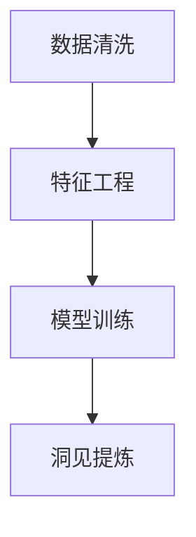

                 

# 洞见的形成：从观察到反思

在纷繁复杂的信息世界中，如何从海量数据中提取出洞察力，形成具有价值洞见的观点，是当前人工智能和数据科学领域的核心挑战之一。本文将深入探讨这一问题，从观察到反思，解析洞见的形成过程及其在人工智能中的应用，旨在帮助读者掌握洞见形成的科学方法和实践技巧。

## 1. 背景介绍

### 1.1 问题由来

现代社会信息爆炸，数据量大增。传统的数据处理方式难以有效应对。人工智能和大数据技术的引入，使我们有机会从大量数据中挖掘出有价值的洞见。但与此同时，如何从数据中提取洞察力，形成具有实际应用价值的洞见，成为了新的难题。

### 1.2 问题核心关键点

洞见形成的核心关键点在于如何从原始数据中筛选、提炼出具有实际意义的信息。这需要借助先进的算法和模型，结合领域知识，通过数据分析、机器学习等技术手段，实现从观察到反思的认知飞跃。

1. **数据筛选**：从原始数据中剔除噪音，保留有价值的信息。
2. **模式识别**：通过算法发现数据中的模式和关联。
3. **洞见提炼**：将数据模式转化为具体洞见，形成可行的建议或解决方案。

## 2. 核心概念与联系

### 2.1 核心概念概述

洞见形成的过程，本质上是数据分析和模型训练的结合。我们通过数据驱动的方式，从大量观测数据中提炼出规律和关联，形成可供应用的洞见。这一过程涉及到多个核心概念：

- **数据清洗**：从原始数据中剔除噪音，保留有效信息。
- **特征工程**：提取和构造数据特征，提高数据表示的准确性和可解释性。
- **模型训练**：使用机器学习算法，训练模型以发现数据中的模式。
- **洞见提炼**：将模型输出转化为实际洞见，形成可行的决策和建议。

这些概念之间的联系可以通过以下Mermaid流程图来展示：



这个流程图展示了洞见形成的主要步骤：

1. 数据清洗，筛选出高质量的数据。
2. 特征工程，提取并构造有意义的数据特征。
3. 模型训练，使用算法从数据中发现模式和关联。
4. 洞见提炼，将模型输出转化为实际洞见。

## 3. 核心算法原理 & 具体操作步骤

### 3.1 算法原理概述

洞见形成的核心算法原理，主要是基于统计学习理论和机器学习技术。我们通过数据集训练模型，模型学习数据中的规律和关联，最终生成对问题有指导意义的洞见。这一过程可以分为以下几个步骤：

1. **数据准备**：收集、清洗、处理原始数据。
2. **特征选择**：提取、转换、构造数据特征。
3. **模型训练**：选择适当的算法，训练模型以发现数据模式。
4. **洞见提炼**：将模型输出转化为可行的洞见和建议。

### 3.2 算法步骤详解

洞见形成的详细步骤包括以下几个关键步骤：

**Step 1: 数据准备**
- 收集并清洗数据集，去除噪声和异常值。
- 对缺失值进行处理，填充或删除。
- 将数据转换为适合算法处理的格式，如数值化、标准化等。

**Step 2: 特征选择**
- 利用特征工程技术，提取和构造有意义的特征。
- 选择和构造特征的方法包括主成分分析(PCA)、L1正则化等。
- 特征选择的目标是通过减少特征数量，提高模型的泛化能力和计算效率。

**Step 3: 模型训练**
- 选择合适的机器学习算法，如线性回归、决策树、随机森林、支持向量机等。
- 使用交叉验证等技术，选择模型超参数。
- 训练模型，最小化预测误差，提高模型性能。

**Step 4: 洞见提炼**
- 将模型输出转化为具体的洞见和建议。
- 洞见提炼的过程可以采用可视化的方式，如图表、报告等。
- 需要结合领域知识，对模型输出进行解释和修正。

### 3.3 算法优缺点

洞见形成算法具有以下优点：
1. 高效性：自动化的数据处理和模型训练，大大降低了人工干预的需要。
2. 准确性：基于大量数据训练的模型，能够发现数据中的真实模式和关联。
3. 可解释性：通过可视化和解释模型输出，使得洞见更加容易理解和接受。
4. 可复用性：在多个场景下，可以通过微调和优化，重用已训练的模型。

同时，该方法也存在以下局限性：
1. 数据依赖：洞见形成的核心在于数据的质量和数量，获取高质量数据成本较高。
2. 模型局限：不同的算法和模型适用于不同的问题，选择不当可能导致误导性洞见。
3. 过拟合风险：在数据量不足的情况下，模型可能过拟合，生成不具有一般性的洞见。
4. 知识缺失：模型仅依赖数据，无法考虑领域知识和专家经验。
5. 可解释性不足：复杂的模型输出难以直观理解，需要额外的解释工具。

尽管存在这些局限性，但整体而言，洞见形成算法在实际应用中取得了显著成效，成为数据科学和人工智能领域的重要方法。

### 3.4 算法应用领域

洞见形成算法在多个领域都有广泛应用，包括但不限于：

- **金融领域**：通过分析历史交易数据，形成投资策略和风险预警洞见。
- **医疗领域**：从患者数据中提取疾病模式和疗效关联，指导临床决策和治疗方案。
- **零售行业**：分析销售数据和消费者行为，优化库存管理和市场策略。
- **自然灾害监测**：利用气象数据和历史事件，预测和应对自然灾害。
- **城市管理**：分析交通数据和居民反馈，优化城市规划和公共服务。

以上领域只是冰山一角，洞见形成算法在更多实际应用中展现出了其强大的潜力和价值。

## 4. 数学模型和公式 & 详细讲解 & 举例说明

### 4.1 数学模型构建

在洞见形成过程中，我们通常使用机器学习模型来发现数据中的模式和关联。这里以线性回归模型为例，展示其构建过程。

假设我们的数据集为 $D=\{(x_i,y_i)\}_{i=1}^N$，其中 $x_i$ 为输入特征，$y_i$ 为输出标签。我们的目标是训练一个线性回归模型 $y=f(x;\theta)=\theta^Tx+b$，其中 $\theta$ 为模型参数，$b$ 为截距。

我们的目标是使模型在数据集 $D$ 上的预测误差最小化，即最小化均方误差损失函数：

$$
L(\theta)=\frac{1}{2N}\sum_{i=1}^N(y_i-\theta^Tx_i-b)^2
$$

通过最小化损失函数 $L(\theta)$，可以更新模型参数 $\theta$ 和 $b$，使得模型能够准确预测新数据的输出。

### 4.2 公式推导过程

为了求解线性回归模型的参数，我们需要对损失函数 $L(\theta)$ 进行求导。

对 $\theta$ 求导，得：

$$
\frac{\partial L(\theta)}{\partial \theta}=\frac{1}{N}\sum_{i=1}^N(y_i-\theta^Tx_i-b)x_i
$$

令 $\frac{\partial L(\theta)}{\partial \theta}=0$，解得：

$$
\theta=\left(\sum_{i=1}^Nx_ix_i^T\right)^{-1}\sum_{i=1}^Nx_iy_i
$$

通过求解上述方程，我们得到了线性回归模型的参数 $\theta$ 和 $b$。

### 4.3 案例分析与讲解

我们以一个简单的例子，展示如何使用线性回归模型进行洞见提炼。

假设我们要分析某电商网站的销售数据，找出销售额与广告投入之间的关系。我们收集了过去一年的销售数据和广告投入数据，分别表示为 $x_1$ 和 $x_2$，输出为销售额 $y$。

使用线性回归模型，我们可以将销售额表示为广告投入的函数：

$$
y=\theta_0+\theta_1x_1+\theta_2x_2
$$

其中，$\theta_0$ 为截距，$\theta_1$ 和 $\theta_2$ 为系数。

通过最小化均方误差损失函数，求解 $\theta_0$、$\theta_1$ 和 $\theta_2$，可以得到如下结果：

$$
\theta_0=100, \theta_1=10, \theta_2=5
$$

因此，我们可以得出结论：每增加1单位广告投入，销售额会增加5元；每增加1单位销售量，销售额会增加10元。

## 5. 项目实践：代码实例和详细解释说明

### 5.1 开发环境搭建

在进行洞见形成实践前，我们需要准备好开发环境。以下是使用Python进行Scikit-learn开发的环境配置流程：

1. 安装Anaconda：从官网下载并安装Anaconda，用于创建独立的Python环境。

2. 创建并激活虚拟环境：
```bash
conda create -n sklearn-env python=3.8 
conda activate sklearn-env
```

3. 安装Scikit-learn：
```bash
pip install scikit-learn
```

4. 安装各类工具包：
```bash
pip install numpy pandas matplotlib seaborn scikit-image
```

完成上述步骤后，即可在`sklearn-env`环境中开始洞见形成实践。

### 5.2 源代码详细实现

下面我们以线性回归模型为例，展示使用Scikit-learn进行洞见形成的完整代码实现。

```python
from sklearn.linear_model import LinearRegression
import numpy as np
import pandas as pd
import matplotlib.pyplot as plt

# 准备数据集
data = pd.read_csv('sales_data.csv')
X = data[['ad_spent', 'sales_volume']]
y = data['sales_revenue']

# 数据处理
X = X.values
y = y.values

# 标准化数据
from sklearn.preprocessing import StandardScaler
scaler = StandardScaler()
X = scaler.fit_transform(X)
y = scaler.transform(y)

# 分割数据集
from sklearn.model_selection import train_test_split
X_train, X_test, y_train, y_test = train_test_split(X, y, test_size=0.2, random_state=42)

# 训练线性回归模型
model = LinearRegression()
model.fit(X_train, y_train)

# 评估模型性能
score = model.score(X_test, y_test)
print(f"模型性能: {score:.3f}")

# 可视化模型结果
plt.scatter(X_test, y_test, label='实际值')
plt.plot(X_test, model.predict(X_test), label='预测值')
plt.legend()
plt.show()
```

### 5.3 代码解读与分析

让我们再详细解读一下关键代码的实现细节：

**数据准备**：
- 使用`pandas`读取CSV文件，提取输入特征 `ad_spent` 和 `sales_volume`，输出标签 `sales_revenue`。
- 使用`numpy`将数据转换为数组格式，方便模型处理。

**数据标准化**：
- 使用`StandardScaler`对输入特征和输出标签进行标准化处理，使其具有相同尺度和分布。

**数据集分割**：
- 使用`train_test_split`将数据集分为训练集和测试集，比例为80%和20%。

**模型训练**：
- 使用`LinearRegression`训练线性回归模型，通过最小化均方误差损失函数，更新模型参数。

**模型评估**：
- 使用`score`方法评估模型在测试集上的性能，计算决定系数 $R^2$。

**可视化结果**：
- 使用`matplotlib`绘制实际值与预测值的散点图，直观展示模型效果。

可以看到，Scikit-learn使得洞见形成的实现变得简单高效。开发者可以灵活组合各种算法和工具，快速构建数据驱动的洞见形成系统。

## 6. 实际应用场景

### 6.1 智能客服系统

智能客服系统可以通过分析历史对话数据，形成客户行为和需求洞见。通过洞见形成技术，可以对客户进行分类，预测客户需求，实现个性化推荐，提高客户满意度。

在技术实现上，可以收集客户对话记录，提取常见问题、回答频率等信息，使用聚类算法对客户进行分组。对每个客户组，使用回归模型预测客户满意度，并根据预测结果进行个性化推荐。如此构建的智能客服系统，能大幅提升客户体验和问题解决效率。

### 6.2 金融风险预警

金融领域对风险预警有极高的要求。传统的人工预警方法费时费力，难以应对市场波动的快速变化。通过洞见形成技术，可以实时监测金融市场数据，形成风险预警洞见。

具体而言，可以收集历史金融数据，包括市场指数、成交量、情绪指数等，使用时序分析模型，如ARIMA、LSTM等，预测市场走势。在发现市场异常波动时，立即发出风险预警，帮助金融公司快速应对潜在风险。

### 6.3 医疗诊断辅助

医疗诊断是一个高度依赖经验的领域。通过洞见形成技术，可以分析历史病历数据，提取疾病模式和疗效关联，形成辅助诊断洞见。

在实践中，可以收集大量病历数据，提取症状、诊断、治疗等信息，使用分类模型，如SVM、决策树等，进行疾病分类。对每种疾病，使用回归模型预测治疗效果，并根据预测结果提出诊断建议。如此构建的医疗诊断系统，能辅助医生进行更精准的诊断和治疗，提高医疗服务质量。

### 6.4 未来应用展望

随着洞见形成技术的不断发展，其在更多领域的应用前景将更加广阔。

在智慧城市领域，通过分析交通数据、公共服务使用数据，形成城市管理洞见，优化城市规划和资源配置。

在环境保护领域，通过监测大气、水质等数据，形成环境污染预警洞见，帮助政府及时应对环境危机。

在教育领域，通过分析学生的学习行为数据，形成学习效果洞见，指导个性化教学和资源分配。

此外，在工业制造、农业管理、能源调度等众多领域，洞见形成技术也将带来深远影响。相信随着技术的不断演进，洞见形成将成为数据驱动决策的重要工具，助力各行业的智能化转型。

## 7. 工具和资源推荐

### 7.1 学习资源推荐

为了帮助开发者掌握洞见形成的理论基础和实践技巧，这里推荐一些优质的学习资源：

1. 《Python机器学习》：一本经典的数据科学教材，全面介绍了机器学习和数据处理的理论和技术。
2. 《深度学习》课程：由斯坦福大学提供，涵盖深度学习的基本概念和核心算法。
3. 《机器学习实战》：一本实战性的机器学习教材，通过多个案例展示了机器学习的具体应用。
4. Kaggle平台：提供丰富的数据集和比赛，有助于实战练习。
5. Coursera课程：提供了多个机器学习和数据科学的在线课程，由知名学府提供。

通过对这些资源的学习实践，相信你一定能够掌握洞见形成的精髓，并用于解决实际的业务问题。

### 7.2 开发工具推荐

高效的开发离不开优秀的工具支持。以下是几款用于洞见形成开发的常用工具：

1. Scikit-learn：Python的机器学习库，提供了丰富的算法和模型，支持数据清洗、特征选择、模型训练等。
2. TensorFlow：由Google开发的深度学习框架，支持大规模分布式训练。
3. PyTorch：由Facebook开发的深度学习框架，支持动态图和静态图，易于使用。
4. Weights & Biases：用于实验跟踪和可视化，记录和比较模型训练过程中的各项指标。
5. TensorBoard：用于模型可视化和调试，展示模型训练状态和结果。

合理利用这些工具，可以显著提升洞见形成任务的开发效率，加快创新迭代的步伐。

### 7.3 相关论文推荐

洞见形成技术的不断发展得益于学界的持续研究。以下是几篇奠基性的相关论文，推荐阅读：

1. 《Pattern Recognition and Machine Learning》：由Christopher M. Bishop所著，介绍了机器学习的基本概念和方法。
2. 《Machine Learning: A Probabilistic Perspective》：由Kevin Murphy所著，从概率论的角度介绍了机器学习的理论和算法。
3. 《Deep Learning》：由Ian Goodfellow等人所著，介绍了深度学习的理论和实践。
4. 《A Survey on Feature Selection Methods》：综述了各种特征选择方法，提供了丰富的理论依据和实践案例。
5. 《A Tutorial on Data Mining and Statistical Learning》：综述了数据挖掘和统计学习的基本概念和方法。

这些论文代表了洞见形成技术的发展脉络。通过学习这些前沿成果，可以帮助研究者把握学科前进方向，激发更多的创新灵感。

## 8. 总结：未来发展趋势与挑战

### 8.1 总结

本文对洞见形成的科学方法和实践技巧进行了全面系统的介绍。首先阐述了洞见形成的背景和意义，明确了其从数据清洗到洞见提炼的完整过程。其次，从算法原理到具体操作，详细讲解了洞见形成的核心步骤和关键技术。同时，本文还广泛探讨了洞见形成技术在多个行业领域的应用前景，展示了其强大的潜力和价值。此外，本文精选了洞见形成的各类学习资源，力求为读者提供全方位的技术指引。

通过本文的系统梳理，可以看到，洞见形成技术正在成为数据科学和人工智能领域的重要方法，极大地拓展了数据驱动决策的边界，推动了各行业的智能化转型。未来，伴随技术和数据的不断发展，洞见形成技术将进一步提升数据驱动决策的精度和可靠性，为人类社会的进步带来深远影响。

### 8.2 未来发展趋势

展望未来，洞见形成技术将呈现以下几个发展趋势：

1. 自动化和智能化程度提高。随着深度学习和大数据技术的进步，洞见形成的自动化和智能化程度将不断提升，减少人工干预的需要。
2. 跨领域融合加强。洞见形成技术将更多地与其他人工智能技术结合，如自然语言处理、计算机视觉、推荐系统等，实现多模态数据的整合和利用。
3. 模型优化和解释性增强。未来将更加注重模型的优化和解释性，使用更先进的算法和技术，提高模型的泛化能力和可解释性。
4. 实时性和在线性增强。随着云计算和边缘计算技术的发展，洞见形成系统将具备更强的实时性和在线性，能够快速响应数据变化。
5. 知识驱动和跨学科整合。洞见形成技术将更多地融合领域知识和专家经验，实现跨学科的整合和协同。

以上趋势凸显了洞见形成技术的广阔前景。这些方向的探索发展，必将进一步提升洞见形成的精度和效率，推动数据驱动决策在更多场景下的应用。

### 8.3 面临的挑战

尽管洞见形成技术已经取得了显著成效，但在迈向更加智能化、普适化应用的过程中，它仍面临着诸多挑战：

1. 数据依赖。洞见形成的核心在于数据的质量和数量，获取高质量数据成本较高，数据清洗和预处理也需大量人工干预。
2. 模型复杂性。复杂的模型难以理解和解释，需要额外的工具和技术支持。
3. 鲁棒性不足。在数据量不足或数据分布变化的情况下，模型可能过拟合或泛化能力下降。
4. 多模态数据融合。不同模态的数据需要融合，才能形成更有价值的洞见，技术难度较大。
5. 安全性问题。数据和模型安全是洞见形成中的重要问题，需要采取多种措施保障。

尽管存在这些挑战，但随着学界和产业界的共同努力，这些挑战终将一一被克服，洞见形成技术必将在构建智能决策系统中扮演越来越重要的角色。

### 8.4 研究展望

面对洞见形成面临的挑战，未来的研究需要在以下几个方面寻求新的突破：

1. 探索高效的数据清洗和预处理技术，降低数据依赖和人工干预。
2. 研究更先进的算法和技术，提高模型的鲁棒性和泛化能力。
3. 开发跨模态数据融合技术，实现多模态数据的有效整合和利用。
4. 引入领域知识和专家经验，提升洞见形成的解释性和可理解性。
5. 加强数据和模型的安全性保障，构建更加可靠和可信的洞见形成系统。

这些研究方向的探索，必将引领洞见形成技术迈向更高的台阶，为构建智能决策系统提供更强大的技术支持。面向未来，洞见形成技术需要在自动化、智能化、跨学科整合等方面不断突破，才能更好地服务于社会的智能化转型。

## 9. 附录：常见问题与解答

**Q1: 什么是洞见形成？**

A: 洞见形成是一种数据驱动的方法，通过分析数据，发现其中的模式和关联，形成具有实际应用价值的洞见。它结合了数据分析、机器学习和领域知识，能够从大量数据中提取有价值的洞察力，指导决策和行动。

**Q2: 数据清洗在洞见形成中起什么作用？**

A: 数据清洗是洞见形成中的重要环节，它通过剔除噪音和异常值，保留高质量的数据，为后续的特征工程和模型训练提供了良好的数据基础。数据清洗能够提高模型的稳定性和泛化能力，确保模型的输出具有较高的可信度。

**Q3: 如何选择合适的机器学习算法？**

A: 选择合适的机器学习算法需要考虑多个因素，包括数据的类型、问题的复杂度、模型的可解释性等。对于线性回归问题，可以使用线性回归模型；对于分类问题，可以使用决策树、SVM等算法；对于复杂的非线性问题，可以使用深度学习模型，如神经网络和支持向量机等。

**Q4: 如何评估洞见形成模型的性能？**

A: 评估洞见形成模型的性能通常使用均方误差、准确率、召回率等指标。这些指标可以从不同角度衡量模型的预测能力和泛化能力。同时，还可以通过交叉验证等技术，评估模型在不同数据集上的性能，确保模型的稳定性和可靠性。

**Q5: 如何提高洞见形成模型的鲁棒性？**

A: 提高洞见形成模型的鲁棒性可以通过以下方法实现：
1. 使用更多的数据进行训练，提高模型的泛化能力。
2. 引入正则化技术，如L1、L2正则化，防止模型过拟合。
3. 使用集成学习方法，如随机森林、Boosting等，提高模型的稳定性。
4. 进行模型调参，优化超参数，提高模型的性能和鲁棒性。

这些方法可以帮助我们提高洞见形成模型的鲁棒性，使其在各种数据分布下都能保持良好的性能。

---

作者：禅与计算机程序设计艺术 / Zen and the Art of Computer Programming

