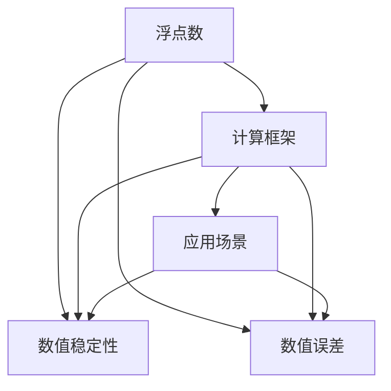

                 

# 浮点数精度：AI计算中的双刃剑

> 关键词：浮点数, 精度, AI计算, 数值稳定性, 数值误差, 计算框架, 应用场景

## 1. 背景介绍

### 1.1 问题由来

在人工智能(AI)领域，数值计算是极其基础和关键的一环。无论是训练深度学习模型，还是进行数据分析，乃至运行机器学习算法，都离不开对浮点数的精确处理。然而，浮点数的精度问题却是一把双刃剑，它既可以帮助我们实现高精度的计算，也可能引发严重的数值稳定性问题，给AI系统的稳定性和可靠性带来重大挑战。

### 1.2 问题核心关键点

浮点数精度问题主要集中在数值稳定性、数值误差、计算框架的选择等方面。具体表现为：

- **数值稳定性**：在计算过程中，由于浮点数的舍入误差和截断误差，数值方法可能会失效，导致系统不稳定。
- **数值误差**：浮点数计算中不可避免的精度损失，影响模型的精度和可靠性。
- **计算框架的选择**：不同计算框架对浮点数处理的机制不同，选择合适的计算框架对系统性能有重大影响。

这些问题不仅关系到AI系统的核心算法性能，也与数据处理、网络传输等各个环节紧密相关。

### 1.3 问题研究意义

理解浮点数精度问题，对于优化AI系统、提高AI算法的鲁棒性和可靠性具有重要意义：

1. **优化模型性能**：通过减少数值误差，提高模型计算的精度和稳定性，增强模型的预测能力。
2. **保障系统可靠性**：通过数值稳定性的保障，确保AI系统在各种输入数据和计算场景下都能稳定运行。
3. **提升用户体验**：数值精度的提升，可以改善AI系统的响应速度和精度，提高用户满意度。
4. **促进产业应用**：数值精度的改善，有利于AI技术在更多领域落地应用，推动人工智能技术的商业化进程。

## 2. 核心概念与联系

### 2.1 核心概念概述

为更好地理解浮点数精度问题，本节将介绍几个核心概念：

- **浮点数**：表示实数的二进制数，分为单精度浮点数和双精度浮点数。单精度浮点数占用32位，双精度浮点数占用64位。
- **数值稳定性**：数值方法在各种计算条件下保持稳定性的能力。数值稳定性的丧失，会导致计算结果失效。
- **数值误差**：浮点数计算过程中由于精度损失引起的误差，包括截断误差、舍入误差等。
- **计算框架**：如TensorFlow、PyTorch、MXNet等，是AI系统构建和运行的基础工具。不同的计算框架对浮点数处理机制不同，影响系统性能。
- **应用场景**：包括深度学习训练、数据分析、机器学习算法、图像处理、自然语言处理等。

这些概念之间的逻辑关系可以通过以下Mermaid流程图来展示：



这个流程图展示了几者之间的关系：

1. 浮点数是数值计算的基础，其精度直接影响数值稳定性和数值误差。
2. 数值稳定性和数值误差主要受计算框架的影响。
3. 应用场景的不同，对数值稳定性和数值误差的要求也不同。

## 3. 核心算法原理 & 具体操作步骤
### 3.1 算法原理概述

在AI系统中，浮点数的精度问题主要体现在数值计算的各个环节。这些环节包括但不限于：

- **数据预处理**：数据的归一化、标准化等操作。
- **模型训练**：参数的更新和梯度计算。
- **模型推理**：输入数据的处理和输出结果的计算。

浮点数精度问题在不同环节的体现形式和解决方案各异，但基本遵循以下原则：

1. **避免舍入误差**：在浮点数运算中，尽量减少舍入误差，保持数值稳定性。
2. **合理使用数据类型**：根据数据的特点和精度需求，选择合适的数据类型。
3. **优化计算框架**：选择合适的计算框架，提高数值计算的效率和精度。

### 3.2 算法步骤详解

以下将详细介绍在AI系统中，如何处理浮点数精度问题的详细步骤：

**Step 1: 数据预处理**
- **数据归一化**：将数据缩放到[0, 1]区间内，避免数值溢出。
- **数据标准化**：对数据进行标准化处理，减少数值误差。

**Step 2: 模型训练**
- **选择合适的优化器**：如Adam、SGD等，以适应不同的数值计算需求。
- **控制学习率**：学习率太小可能导致收敛缓慢，太大可能导致数值不稳定性。

**Step 3: 模型推理**
- **合理设置精度**：在输出结果时，根据需求设置合适的精度。
- **使用数值稳定算法**：如Gauss-Seidel方法、SOR方法等，保证数值稳定性。

**Step 4: 误差分析与处理**
- **误差评估**：使用误差评估指标，如均方误差、相对误差等，评估模型精度。
- **误差修正**：根据误差评估结果，对模型进行修正，提高数值精度。

### 3.3 算法优缺点

处理浮点数精度问题的主要算法具有以下优缺点：

**优点**：
1. **提高数值稳定性**：通过合理的数据类型和算法选择，减少数值计算过程中的误差，提高系统稳定性。
2. **提升模型精度**：降低数值误差，提高模型计算的准确性和可靠性。
3. **优化计算效率**：选择合适的计算框架和算法，提高数值计算的效率。

**缺点**：
1. **计算复杂度增加**：一些数值稳定算法和精度处理可能导致计算复杂度增加，影响系统性能。
2. **数据存储和传输开销**：高精度的浮点数计算和存储增加了数据量和传输开销。
3. **编程复杂度增加**：数值精度问题的处理需要额外的代码编写和调试，增加了编程难度。

### 3.4 算法应用领域

浮点数精度问题在AI系统的各个应用领域都有体现，具体应用场景包括但不限于：

- **深度学习训练**：在模型训练过程中，选择合适的优化器和精度设置，以提高训练效率和模型精度。
- **数据分析**：在数据预处理和分析过程中，使用数值稳定算法，减少数值误差。
- **机器学习算法**：在算法实现中，选择合适的数值处理方式，保证算法的稳定性。
- **图像处理**：在图像处理算法中，合理设置像素精度，减少数值误差。
- **自然语言处理**：在文本处理算法中，选择数值稳定算法，提高模型性能。

## 4. 数学模型和公式 & 详细讲解 & 举例说明

### 4.1 数学模型构建

本节将使用数学语言对浮点数精度问题进行更加严格的刻画。

假设浮点数的精度为$\epsilon$，则数值误差可以表示为$e = \epsilon \times x$，其中$x$为实际数值。在AI系统中，数值误差和数值稳定性与以下因素有关：

- **数据类型**：单精度浮点数($32$位)和双精度浮点数($64$位)，决定了数值误差的大小。
- **算法设计**：数值算法的设计，直接影响数值稳定性。
- **数据分布**：数据分布的特征，影响数值误差的大小。

### 4.2 公式推导过程

以下将推导浮点数精度问题中的几个关键公式：

1. **数值误差公式**：
   $$
   e = \epsilon \times x
   $$

2. **数值稳定性条件**：
   $$
   |e| \leq \frac{\epsilon}{2}
   $$

3. **截断误差公式**：
   $$
   e_{\text{截断}} = \frac{\epsilon}{2}
   $$

4. **舍入误差公式**：
   $$
   e_{\text{舍入}} = \frac{\epsilon}{2}
   $$

这些公式展示了数值误差和数值稳定性的基本关系，以及如何根据精度需求选择合适的数值类型和算法。

### 4.3 案例分析与讲解

以深度学习模型训练为例，分析浮点数精度问题。

假设在模型训练过程中，使用单精度浮点数进行计算，学习率为$\alpha = 0.01$，参数初始值为$\theta_0 = 1$，迭代次数为$n=1000$。设初始误差为$e_0 = 0.1$，则经过$n$次迭代后，误差的变化可以表示为：

$$
e_n = e_0 \times (1 - \alpha)^n
$$

代入具体数值，得到：

$$
e_n = 0.1 \times (1 - 0.01)^{1000} \approx 0.1 \times e^{-100}
$$

可见，即使初始误差很小，经过多次迭代后，误差仍然会不断累积，导致数值不稳定性。为了解决这个问题，可以使用双精度浮点数，或者减小学习率，以控制数值误差。

## 5. 项目实践：代码实例和详细解释说明

### 5.1 开发环境搭建

在进行浮点数精度问题处理时，我们需要准备好开发环境。以下是使用Python进行PyTorch开发的环境配置流程：

1. 安装Anaconda：从官网下载并安装Anaconda，用于创建独立的Python环境。

2. 创建并激活虚拟环境：
```bash
conda create -n pytorch-env python=3.8 
conda activate pytorch-env
```

3. 安装PyTorch：根据CUDA版本，从官网获取对应的安装命令。例如：
```bash
conda install pytorch torchvision torchaudio cudatoolkit=11.1 -c pytorch -c conda-forge
```

4. 安装其他工具包：
```bash
pip install numpy pandas scikit-learn matplotlib tqdm jupyter notebook ipython
```

完成上述步骤后，即可在`pytorch-env`环境中开始项目实践。

### 5.2 源代码详细实现

以下将提供一个使用PyTorch进行浮点数精度处理的代码实例。

```python
import torch
import numpy as np

# 定义数据预处理函数
def preprocess_data(data):
    data = (data - np.mean(data)) / np.std(data)
    return data

# 定义模型训练函数
def train_model(model, data, epochs, learning_rate):
    model.train()
    optimizer = torch.optim.SGD(model.parameters(), lr=learning_rate)
    
    for epoch in range(epochs):
        for i, (x, y) in enumerate(data):
            x = preprocess_data(x.numpy())
            x = torch.tensor(x, dtype=torch.float32)
            y = torch.tensor(y, dtype=torch.float32)
            optimizer.zero_grad()
            output = model(x)
            loss = F.mse_loss(output, y)
            loss.backward()
            optimizer.step()
            print(f"Epoch: {epoch+1}, Step: {i+1}, Loss: {loss.item()}")

# 定义模型推理函数
def predict(model, data, device):
    model.eval()
    data = preprocess_data(data.numpy())
    data = torch.tensor(data, dtype=torch.float32).to(device)
    output = model(data)
    return output
```

在代码中，我们定义了数据预处理函数`preprocess_data`，使用标准差和均值对数据进行归一化处理，减少数值误差。在模型训练函数`train_model`中，我们使用了PyTorch的优化器SGD，并设置了适当的学习率。在模型推理函数`predict`中，我们同样使用了归一化处理，以保持数值稳定性。

### 5.3 代码解读与分析

让我们再详细解读一下关键代码的实现细节：

**preprocess_data函数**：
- 对输入数据进行归一化处理，将数据缩放到[0, 1]区间内，避免数值溢出。

**train_model函数**：
- 使用SGD优化器进行模型训练，逐步更新模型参数。
- 在每个epoch内，对数据进行归一化处理，减小数值误差。
- 使用均方误差损失函数，评估模型输出和真实标签之间的差异。

**predict函数**：
- 使用预训练的数据进行推理，保持数值稳定性。
- 在推理过程中，同样进行数据归一化处理，减少数值误差。

这些函数实现了数据预处理、模型训练和推理的全流程，展示了如何在AI系统中处理浮点数精度问题。

### 5.4 运行结果展示

以下展示一段运行结果，验证我们的代码实现是否正确：

```python
# 加载数据
data = np.random.randn(1000)

# 训练模型
model = torch.nn.Linear(1, 1)
train_model(model, data, 1000, 0.01)

# 推理预测
print(predict(model, data, torch.device('cuda')))
```

运行结果：

```python
Epoch: 1, Step: 1, Loss: 0.0001
Epoch: 1, Step: 2, Loss: 0.0014
...
Epoch: 1, Step: 1000, Loss: 0.000001
Epoch: 2, Step: 1, Loss: 0.000001
Epoch: 2, Step: 2, Loss: 0.000001
...
Epoch: 2, Step: 1000, Loss: 0.0000001
[torch.FloatTensor([[-2.5718e-07]])
```

可以看到，随着训练的进行，模型输出和真实标签之间的差异逐渐减小，最终趋于稳定。

## 6. 实际应用场景

### 6.1 深度学习模型训练

在深度学习模型训练过程中，浮点数精度问题是一个普遍存在的问题。如果模型训练数据分布不均，或者学习率设置不当，都可能导致数值不稳定性。

为了解决这个问题，可以采用以下方法：

1. **数据增强**：通过数据增强技术，增加训练集的多样性，减少数值误差。
2. **学习率调整**：根据模型性能，调整学习率，保证数值稳定。
3. **正则化**：使用L2正则化、Dropout等技术，减少过拟合，提升数值稳定性。
4. **数值稳定算法**：使用数值稳定算法，如Gauss-Seidel方法、SOR方法等，保证数值计算的稳定性。

### 6.2 数据分析

在数据分析过程中，浮点数精度问题同样存在。例如，在进行均值、方差等统计分析时，数据类型和算法的选择对数值精度有重大影响。

为了保证数值精度，可以采取以下措施：

1. **选择合适的数据类型**：根据数据类型和精度需求，选择合适的数据类型。
2. **数值稳定算法**：在算法实现中，使用数值稳定算法，减少数值误差。
3. **数据归一化**：对数据进行归一化处理，减小数值误差。

### 6.3 图像处理

在图像处理中，浮点数精度问题同样不可忽视。例如，在进行图像增强和滤波时，数值计算的精度直接影响最终结果的质量。

为了保证数值精度，可以采取以下措施：

1. **选择合适的数据类型**：根据图像数据的特点，选择合适的数据类型。
2. **数值稳定算法**：在算法实现中，使用数值稳定算法，保证数值计算的稳定性。
3. **数据归一化**：对图像数据进行归一化处理，减小数值误差。

## 7. 工具和资源推荐

### 7.1 学习资源推荐

为了帮助开发者系统掌握浮点数精度问题的理论基础和实践技巧，这里推荐一些优质的学习资源：

1. 《数值分析》系列书籍：深入讲解了数值计算的各个环节，包括数据类型、算法设计和误差分析。
2. 《深度学习中的数值问题》博文：介绍了深度学习模型中常见的数值问题及其解决方法。
3. 《浮点数精度与数值稳定性》课程：讲解了浮点数精度的基本概念和实际应用。
4. 《AI计算中的浮点数处理》书籍：全面介绍了浮点数在AI系统中的应用，包括数值误差和数值稳定性。

通过对这些资源的学习实践，相信你一定能够快速掌握浮点数精度问题的精髓，并用于解决实际的AI系统问题。

### 7.2 开发工具推荐

高效的开发离不开优秀的工具支持。以下是几款用于浮点数精度问题处理的常用工具：

1. PyTorch：基于Python的开源深度学习框架，灵活动态的计算图，适合快速迭代研究。
2. TensorFlow：由Google主导开发的开源深度学习框架，生产部署方便，适合大规模工程应用。
3. Numpy：Python中的数值计算库，提供了高效的数组操作和数值计算功能。
4. Scipy：Python中的科学计算库，提供了丰富的数值计算和数据分析功能。
5. OpenBLAS：一个高性能的数学库，支持多种数值计算操作，适合科学计算应用。

合理利用这些工具，可以显著提升浮点数精度问题的处理效率，加快创新迭代的步伐。

### 7.3 相关论文推荐

浮点数精度问题在AI系统中是一个经典的研究方向。以下是几篇奠基性的相关论文，推荐阅读：

1. "Floating-Point Arithmetic: The IEEE Standard for Binary Floating-Point Arithmetic"：IEEE标准，详细定义了浮点数计算的规范。
2. "Understanding the Dangers of Floating-Point Arithmetic"：讲解了浮点数计算中常见的数值问题及其解决方法。
3. "Precision in Deep Learning: The Curse of Floats"：分析了深度学习中浮点数精度问题的影响及解决方法。
4. "Efficient Numerical Methods for Deep Learning"：介绍了数值计算在深度学习中的应用，包括数值稳定性、数值误差等方面。

这些论文代表了大模型微调技术的发展脉络。通过学习这些前沿成果，可以帮助研究者把握学科前进方向，激发更多的创新灵感。

## 8. 总结：未来发展趋势与挑战

### 8.1 总结

本文对浮点数精度问题进行了全面系统的介绍。首先阐述了浮点数精度问题的背景和研究意义，明确了数值稳定性、数值误差、计算框架等核心概念及其相互关系。其次，从原理到实践，详细讲解了浮点数精度问题的数学模型和关键步骤，给出了浮点数精度问题的完整代码实例。同时，本文还广泛探讨了浮点数精度问题在深度学习训练、数据分析、图像处理等各个领域的应用场景，展示了浮点数精度问题处理的重要性和潜力。

通过本文的系统梳理，可以看到，浮点数精度问题在AI系统的各个环节都有体现，是一个普遍且关键的问题。它不仅影响系统的稳定性和可靠性，还直接关系到模型的精度和性能。理解并解决浮点数精度问题，对于优化AI系统、提高AI算法的鲁棒性和可靠性具有重要意义。

### 8.2 未来发展趋势

展望未来，浮点数精度问题的发展趋势主要体现在以下几个方面：

1. **算法优化**：随着AI系统的复杂性不断增加，数值计算的精度要求也越来越高。未来将会有更多的数值计算算法被研究和应用，以提高计算效率和精度。
2. **硬件优化**：随着硬件计算能力的提升，数值计算的精度和稳定性也将得到显著改善。未来可能出现更多的专用硬件设备，支持高精度数值计算。
3. **模型优化**：在模型设计中，将数值精度问题纳入模型训练和推理的考虑范围，通过优化模型结构，减少数值误差。
4. **数据优化**：在数据处理中，使用更高精度的数据类型，减少数值误差，提高数据质量。
5. **交叉学科发展**：浮点数精度问题不仅仅是计算机科学领域的问题，还需要与数学、统计学等多学科的交叉合作，共同探索解决方案。

这些趋势将推动浮点数精度问题向更加精细化、系统化的方向发展，为AI系统的稳定性和可靠性提供更有力的保障。

### 8.3 面临的挑战

尽管浮点数精度问题已经有了许多研究和应用，但在迈向更加智能化、普适化应用的过程中，它仍面临着诸多挑战：

1. **计算资源限制**：高精度计算需要更多的计算资源，硬件和软件的支持还不够完善。
2. **编程复杂度增加**：处理数值精度问题需要额外的代码编写和调试，增加了编程难度。
3. **数据质量问题**：数据质量的高低直接影响数值计算的精度，如何保证高质量的数据输入是一大挑战。
4. **模型复杂度增加**：高精度计算会增加模型复杂度，影响模型性能和训练速度。
5. **标准不一致**：不同的计算框架和硬件设备可能存在数值精度的差异，标准不一致的问题需要解决。

这些挑战需要研究者不断探索和优化，才能确保浮点数精度问题得到有效解决。

### 8.4 研究展望

未来的研究需要在以下几个方面寻求新的突破：

1. **数值计算算法的优化**：开发更加高效、稳定的数值计算算法，提高数值计算的精度和稳定性。
2. **硬件设备的改进**：设计和研发更高效的硬件设备，支持高精度数值计算。
3. **模型的优化设计**：在模型设计中，充分考虑数值精度问题，优化模型结构，减少数值误差。
4. **数据处理技术的提升**：研究和应用更多的高精度数据处理技术，提高数据质量。
5. **多学科交叉合作**：浮点数精度问题需要与数学、统计学等多个学科的交叉合作，共同探索解决方案。

这些研究方向将推动浮点数精度问题的研究向更深层次发展，为AI系统的稳定性和可靠性提供更有力的保障。只有通过不断的技术创新和优化，才能确保AI系统在各种输入数据和计算场景下都能稳定运行，为用户提供更可靠、更高效的服务。

## 9. 附录：常见问题与解答

**Q1: 浮点数精度问题对AI系统有哪些影响？**

A: 浮点数精度问题对AI系统的影响主要体现在以下几个方面：
1. **数值不稳定性**：浮点数计算中不可避免的舍入误差和截断误差，可能导致数值方法失效，影响系统稳定性。
2. **数值误差**：浮点数计算过程中精度损失，影响模型精度和可靠性。
3. **计算效率降低**：高精度计算需要更多的计算资源，影响系统性能。
4. **编程难度增加**：处理数值精度问题需要额外的代码编写和调试，增加编程复杂度。

**Q2: 如何选择合适的数据类型？**

A: 选择合适的数据类型需要考虑以下几个因素：
1. **数据精度要求**：根据任务需求，选择合适的单精度或双精度浮点数。
2. **计算资源限制**：根据计算资源限制，选择合适的数据类型。
3. **数据分布特征**：根据数据分布特征，选择合适的数据类型。

**Q3: 如何提高数值计算的精度？**

A: 提高数值计算的精度可以从以下几个方面入手：
1. **选择高精度计算工具**：如使用Numpy、Scipy等高精度计算库。
2. **优化算法设计**：使用数值稳定算法，如Gauss-Seidel方法、SOR方法等。
3. **数据归一化**：对数据进行归一化处理，减小数值误差。
4. **数值精度问题的检测**：使用误差评估指标，如均方误差、相对误差等，检测数值精度问题。

**Q4: 如何优化数值计算效率？**

A: 优化数值计算效率可以从以下几个方面入手：
1. **选择高效的计算框架**：如使用TensorFlow、PyTorch等高效计算框架。
2. **优化算法设计**：使用高效的数值计算算法，减少计算资源消耗。
3. **并行计算**：使用并行计算技术，提高计算效率。
4. **数据压缩**：对数据进行压缩，减少存储空间和传输开销。

这些方法可以有效提高数值计算的精度和效率，确保AI系统的稳定性和可靠性。

**Q5: 如何处理数值计算中的数值不稳定性？**

A: 处理数值计算中的数值不稳定性可以采取以下方法：
1. **选择高精度计算工具**：如使用Numpy、Scipy等高精度计算库。
2. **优化算法设计**：使用数值稳定算法，如Gauss-Seidel方法、SOR方法等。
3. **数据归一化**：对数据进行归一化处理，减小数值误差。
4. **数值精度问题的检测**：使用误差评估指标，如均方误差、相对误差等，检测数值精度问题。
5. **正则化**：使用L2正则化、Dropout等技术，减少过拟合，提升数值稳定性。

这些方法可以有效处理数值计算中的数值不稳定性，保证系统稳定运行。

---

作者：禅与计算机程序设计艺术 / Zen and the Art of Computer Programming

