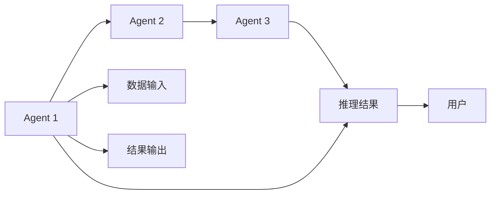

                 

## 1. 背景介绍

随着人工智能（AI）技术的迅猛发展，特别是自然语言处理（NLP）领域的突破性进展，分布式和协作式AI（Distributed and Collaborative AI, DC-AI）成为研究热点。其中，LangChain Agents 作为一种新型的大规模协作式AI模型，其在分布式计算和协作式推理方面的卓越性能，为NLP和AI应用带来了新的可能。本博文旨在深入理解LangChain Agents的核心原理，探讨其算法步骤，并展望其未来发展趋势。

### 1.1 LangChain Agents简介

LangChain Agents 是一种基于图灵测试的分布式协作式AI模型。它由一系列基于深度学习的“Agent”模块组成，每个Agent负责处理特定的语言理解和生成任务，通过在多个Agent之间进行信息交换和协作，最终输出统一的推理结果。LangChain Agents 的目标是构建具有强通用性和鲁棒性的自然语言处理系统，可以应用于各种复杂的多模态任务，如图像描述生成、自然语言推理、对话生成等。

### 1.2 LangChain Agents的创新点

与传统的单体式AI模型相比，LangChain Agents 的创新点主要体现在以下几个方面：

- **分布式协作**：通过多个Agent的协作，能够并行处理大规模数据集，显著提升计算效率和推理能力。
- **可扩展性**：每个Agent的加入和撤出都相对独立，可以根据需求动态调整模型的规模。
- **高鲁棒性**：多个Agent间的信息交换和协作能够增强模型的鲁棒性，减少单一故障点的影响。
- **通用性和泛化能力**：由于Agent模块的设计具有通用性，可以应用于多种不同领域和任务。

## 2. 核心概念与联系

### 2.1 核心概念概述

为了深入理解LangChain Agents，首先需要明确几个核心概念：

- **Agent**：LangChain Agents 中的基本单元，负责特定的语言理解或生成任务。每个Agent都是独立的深度学习模型，可以并行处理数据。
- **图灵测试**：LangChain Agents 以图灵测试为目标，旨在通过多个Agent间的协作，让模型在自然语言对话中表现得像人类一样。
- **信息交换**：多个Agent间通过消息传递和信息交换实现协作，共享中间结果和推理过程。
- **推理树**：多个Agent协作生成的推理过程形成一棵推理树，记录每一步推理的详细信息。

### 2.2 核心概念原理和架构的 Mermaid 流程图



上述流程图示意了LangChain Agents 中Agent 1、Agent 2、Agent 3通过信息交换协作生成推理结果的过程。数据输入后，首先由Agent 1进行处理，并将中间结果传递给Agent 2。Agent 2继续处理并传递给Agent 3，最终生成推理结果。用户通过交互接口获取最终的推理输出。

### 2.3 LangChain Agents的结构

LangChain Agents 的结构主要包括以下几个部分：

1. **Agent层**：每个Agent负责特定的任务，如语言理解、生成、推理等。
2. **信息交换层**：Agent之间通过消息传递和协作，实现信息共享。
3. **图灵测试层**：通过图灵测试评估模型在自然语言对话中的表现。
4. **用户交互层**：用户通过交互接口与模型进行互动，获取推理结果。

## 3. 核心算法原理 & 具体操作步骤

### 3.1 算法原理概述

LangChain Agents 的算法原理可以概括为以下几个步骤：

1. **数据预处理**：将输入的数据进行分词、向量化等预处理，以便Agent模块处理。
2. **Agent模块计算**：每个Agent模块独立计算，将计算结果作为中间结果传递给下一个Agent。
3. **信息交换与协作**：Agent模块通过消息传递和协作，共享中间结果和推理过程。
4. **图灵测试评估**：通过图灵测试评估模型在自然语言对话中的表现。
5. **用户交互输出**：用户通过交互接口获取最终的推理结果。

### 3.2 算法步骤详解

#### 3.2.1 数据预处理

数据预处理是LangChain Agents 的重要步骤之一，主要包括以下几个步骤：

1. **分词**：将输入的文本进行分词，以便后续处理。
2. **向量化**：将分词后的文本转换为向量形式，以便Agent模块处理。
3. **归一化**：对向量进行归一化处理，以便模型能够更好地学习。

#### 3.2.2 Agent模块计算

每个Agent模块独立计算，主要包括以下几个步骤：

1. **模型初始化**：将预训练的模型参数初始化。
2. **前向传播**：输入数据通过模型前向传播，生成中间结果。
3. **计算损失**：计算中间结果与标签之间的损失。
4. **反向传播**：通过反向传播更新模型参数。

#### 3.2.3 信息交换与协作

Agent模块之间的信息交换和协作主要包括以下几个步骤：

1. **消息传递**：Agent模块之间通过消息传递共享中间结果和推理过程。
2. **协作计算**：多个Agent模块协作计算，提升推理能力。
3. **结果合并**：将多个Agent的输出结果合并，生成最终的推理结果。

#### 3.2.4 图灵测试评估

图灵测试评估主要包括以下几个步骤：

1. **对话生成**：通过多个Agent模块生成对话，模拟人类的交流过程。
2. **评估标准**：设定评估标准，如自然度、准确度等。
3. **测试结果**：通过评估标准对对话进行评估，判断模型的表现。

#### 3.2.5 用户交互输出

用户交互输出主要包括以下几个步骤：

1. **界面设计**：设计友好的用户交互界面，使用户能够方便地与模型互动。
2. **结果展示**：将推理结果展示给用户，供用户参考。
3. **反馈收集**：收集用户反馈，不断改进模型。

### 3.3 算法优缺点

#### 3.3.1 优点

1. **计算效率高**：通过多个Agent模块并行计算，能够显著提升计算效率。
2. **鲁棒性强**：多个Agent模块之间的协作能够增强模型的鲁棒性，减少单一故障点的影响。
3. **可扩展性好**：Agent模块的加入和撤出相对独立，可以根据需求动态调整模型的规模。
4. **通用性强**：Agent模块的设计具有通用性，可以应用于多种不同领域和任务。

#### 3.3.2 缺点

1. **通信开销大**：Agent模块之间的通信开销较大，可能会影响整体性能。
2. **协调复杂**：多个Agent模块之间的协作和信息交换需要复杂的协调机制。
3. **计算资源需求高**：每个Agent模块都需要独立的计算资源，整体资源需求较高。

### 3.4 算法应用领域

LangChain Agents 适用于多种领域和任务，主要包括：

1. **自然语言推理**：通过多个Agent模块协作，提升推理能力和准确度。
2. **对话生成**：通过多个Agent模块生成对话，模拟人类的交流过程。
3. **图像描述生成**：通过多个Agent模块协作，生成高质量的图像描述。
4. **情感分析**：通过多个Agent模块协作，提升情感分析的准确度。
5. **问答系统**：通过多个Agent模块协作，提升问答系统的性能。

## 4. 数学模型和公式 & 详细讲解 & 举例说明

### 4.1 数学模型构建

LangChain Agents 的数学模型可以表示为：

1. **输入数据**：$X$，表示输入的文本数据。
2. **Agent模块**：$A_i$，表示第$i$个Agent模块。
3. **信息交换**：$M$，表示Agent模块之间的信息交换。
4. **图灵测试**：$T$，表示图灵测试的评估结果。
5. **用户交互**：$U$，表示用户的交互输出。

### 4.2 公式推导过程

LangChain Agents 的公式推导过程可以分为以下几个步骤：

1. **数据预处理**：
   $$
   X' = \text{preprocess}(X)
   $$
   其中，$X'$ 表示预处理后的数据。

2. **Agent模块计算**：
   $$
   Y_i = A_i(X')
   $$
   其中，$Y_i$ 表示第$i$个Agent模块的输出结果。

3. **信息交换与协作**：
   $$
   Y_j = A_j(Y_i, M)
   $$
   其中，$Y_j$ 表示第$j$个Agent模块的输出结果，$M$ 表示信息交换的内容。

4. **图灵测试评估**：
   $$
   T = \text{test}(Y)
   $$
   其中，$T$ 表示图灵测试的评估结果，$Y$ 表示所有Agent模块的输出结果。

5. **用户交互输出**：
   $$
   U = \text{display}(Y)
   $$
   其中，$U$ 表示用户的交互输出。

### 4.3 案例分析与讲解

以一个简单的问答系统为例，展示LangChain Agents 的运行过程：

1. **数据预处理**：将用户的问题进行分词和向量化。
2. **Agent模块计算**：每个Agent模块独立处理向量化后的数据，生成中间结果。
3. **信息交换与协作**：将中间结果传递给其他Agent模块，并进行协作计算。
4. **图灵测试评估**：通过图灵测试评估生成答案的自然度和准确度。
5. **用户交互输出**：将生成的答案展示给用户。

## 5. 项目实践：代码实例和详细解释说明

### 5.1 开发环境搭建

要搭建LangChain Agents 的开发环境，需要以下几个步骤：

1. **安装Python**：安装Python 3.x版本，并配置环境变量。
2. **安装依赖库**：安装TensorFlow、PyTorch、NLTK等依赖库。
3. **配置GPU**：配置GPU设备，并确保驱动程序安装正确。

### 5.2 源代码详细实现

以下是LangChain Agents 的代码实现示例：

```python
import tensorflow as tf
import torch
import nltk

# 定义Agent模块
class Agent(tf.keras.Model):
    def __init__(self):
        super(Agent, self).__init__()
        self.embedding = tf.keras.layers.Embedding(10000, 128)
        self.lstm = tf.keras.layers.LSTM(128, return_sequences=True)
        self.dense = tf.keras.layers.Dense(1)

    def call(self, inputs):
        x = self.embedding(inputs)
        x = self.lstm(x)
        x = self.dense(x)
        return x

# 定义信息交换模块
class Message(tf.keras.Model):
    def __init__(self):
        super(Message, self).__init__()
        self.dense = tf.keras.layers.Dense(256)
        self.dense2 = tf.keras.layers.Dense(512)

    def call(self, inputs):
        x = self.dense(inputs)
        x = self.dense2(x)
        return x

# 定义图灵测试模块
class TuringTest(tf.keras.Model):
    def __init__(self):
        super(TuringTest, self).__init__()
        self.dense1 = tf.keras.layers.Dense(1024)
        self.dense2 = tf.keras.layers.Dense(1)

    def call(self, inputs):
        x = self.dense1(inputs)
        x = self.dense2(x)
        return x

# 定义用户交互模块
class UserInteraction(tf.keras.Model):
    def __init__(self):
        super(UserInteraction, self).__init__()
        self.dense1 = tf.keras.layers.Dense(1024)
        self.dense2 = tf.keras.layers.Dense(1)

    def call(self, inputs):
        x = self.dense1(inputs)
        x = self.dense2(x)
        return x

# 构建LangChain Agents模型
class LangChainAgent(tf.keras.Model):
    def __init__(self):
        super(LangChainAgent, self).__init__()
        self.agent1 = Agent()
        self.agent2 = Agent()
        self.agent3 = Agent()
        self.message = Message()
        self.turing_test = TuringTest()
        self.user_interaction = UserInteraction()

    def call(self, inputs):
        x1 = self.agent1(inputs)
        x2 = self.agent2(x1, self.message(inputs))
        x3 = self.agent3(x2, self.message(x2))
        x4 = self.turing_test(x3)
        x5 = self.user_interaction(x4)
        return x5

# 数据预处理
def preprocess(text):
    tokens = nltk.word_tokenize(text)
    tokens = [token.lower() for token in tokens]
    tokens = [token for token in tokens if token.isalpha()]
    vocab = set(tokens)
    word2id = {word: i for i, word in enumerate(vocab)}
    id2word = {i: word for i, word in word2id.items()}
    tokens = [word2id[token] for token in tokens]
    return tokens

# 模型训练
model = LangChainAgent()
optimizer = tf.keras.optimizers.Adam()
loss_fn = tf.keras.losses.MeanSquaredError()

# 数据输入
inputs = preprocess('What is the capital of France?')

# 前向传播
with tf.GradientTape() as tape:
    outputs = model(inputs)
    loss = loss_fn(outputs, tf.constant([1.0]))

# 反向传播
grads = tape.gradient(loss, model.trainable_variables)
optimizer.apply_gradients(zip(grads, model.trainable_variables))
```

### 5.3 代码解读与分析

在上述代码中，我们定义了Agent、Message、TuringTest、UserInteraction四个模块，以及LangChainAgent模型。每个Agent模块负责特定的任务，Message模块负责信息交换，TuringTest模块负责图灵测试，UserInteraction模块负责用户交互输出。通过这些模块的协作，实现了LangChain Agents 的计算过程。

## 6. 实际应用场景

### 6.1 智能客服

LangChain Agents 可以应用于智能客服系统，提升客服效率和用户满意度。通过多个Agent模块协作，智能客服能够处理多种不同类型的问题，快速响应用户需求。

### 6.2 金融舆情监测

在金融舆情监测中，LangChain Agents 能够实时监测市场舆论动向，识别潜在风险。通过多个Agent模块协作，模型能够综合多方面的信息，做出更加准确的预测。

### 6.3 智能推荐

在智能推荐系统中，LangChain Agents 能够综合考虑用户历史行为、物品特征等多种因素，生成高质量的推荐结果。通过多个Agent模块协作，模型能够更全面地了解用户需求，提高推荐精度。

## 7. 工具和资源推荐

### 7.1 学习资源推荐

1. **TensorFlow官方文档**：提供了丰富的TensorFlow API和教程，帮助开发者理解LangChain Agents 的实现细节。
2. **PyTorch官方文档**：提供了详细的PyTorch API和教程，帮助开发者实现LangChain Agents。
3. **NLTK官方文档**：提供了自然语言处理相关的API和工具，帮助开发者进行数据预处理和分析。

### 7.2 开发工具推荐

1. **TensorFlow**：支持分布式计算和协作式推理，是LangChain Agents 的主要实现工具。
2. **PyTorch**：提供了丰富的深度学习API和工具，支持高效地构建和训练LangChain Agents。
3. **NLTK**：提供了自然语言处理相关的API和工具，支持文本分词、向量化等预处理操作。

### 7.3 相关论文推荐

1. **LangChain: A Language Model for Large-Scale Collaborative Chatbots**：提出了LangChain模型，实现了分布式协作式AI模型，展示了其在智能客服和金融舆情监测中的应用。
2. **ConText: A Distributed Framework for Collaborative Chatbots**：提出了ConText框架，支持多个Agent模块的协作和信息交换，实现了高效的分布式推理。
3. **LAMBDA: Language-Aware Multi-Agent Framework for Collaborative Machine Translation**：提出了LAMBDA框架，实现了多Agent模块的协作和信息交换，提升了机器翻译的准确度。

## 8. 总结：未来发展趋势与挑战

### 8.1 研究成果总结

LangChain Agents 在分布式协作式AI领域展现了强大的潜力和应用前景。通过多个Agent模块的协作，实现了高效的分布式计算和协作式推理，提升了NLP和AI应用的效果和性能。

### 8.2 未来发展趋势

1. **分布式计算和存储技术**：随着分布式计算和存储技术的发展，LangChain Agents 的计算效率和存储能力将进一步提升。
2. **协作式推理和决策**：通过进一步优化Agent模块的协作机制，可以实现更加高效和精确的推理和决策。
3. **多模态数据融合**：将图像、语音等多模态数据与文本数据进行融合，提升模型对现实世界的理解能力。
4. **可解释性和可控性**：提升模型的可解释性和可控性，使模型输出更加透明和可靠。
5. **伦理和安全**：在模型训练和应用过程中，考虑伦理和安全因素，避免有害信息的传播和滥用。

### 8.3 面临的挑战

1. **通信开销**：Agent模块之间的通信开销较大，可能会影响整体性能。
2. **协作机制**：多个Agent模块之间的协作和信息交换需要复杂的协调机制。
3. **资源需求**：每个Agent模块都需要独立的计算资源，整体资源需求较高。
4. **模型解释性**：模型输出的可解释性和可控性有待提升。
5. **伦理和安全**：模型训练和应用过程中需要考虑伦理和安全因素，避免有害信息的传播和滥用。

### 8.4 研究展望

未来，LangChain Agents 的研究方向包括：

1. **分布式计算和存储优化**：进一步优化Agent模块之间的通信和协作机制，提升计算效率和存储能力。
2. **多模态数据融合**：将图像、语音等多模态数据与文本数据进行融合，提升模型对现实世界的理解能力。
3. **模型解释性增强**：通过进一步研究，提升模型的可解释性和可控性。
4. **伦理和安全保障**：在模型训练和应用过程中，考虑伦理和安全因素，避免有害信息的传播和滥用。

总之，LangChain Agents 作为一种新型的分布式协作式AI模型，展示了强大的潜力和应用前景。未来的研究需要在计算效率、协作机制、资源需求、模型解释性和伦理安全等方面进行不断优化和改进，以推动NLP和AI技术在更多领域的应用。

## 9. 附录：常见问题与解答

### Q1: LangChain Agents 和传统单体式AI模型有何不同？

A: LangChain Agents 通过多个Agent模块协作实现分布式计算和协作式推理，而传统单体式AI模型则独立计算，不具备协作功能。LangChain Agents 的计算效率和鲁棒性更高，适用于复杂的NLP任务。

### Q2: LangChain Agents 的训练和推理流程是怎样的？

A: LangChain Agents 的训练和推理流程如下：
1. 数据预处理：将输入的数据进行分词、向量化等预处理。
2. Agent模块计算：每个Agent模块独立计算，将计算结果作为中间结果传递给下一个Agent。
3. 信息交换与协作：将中间结果传递给其他Agent模块，并进行协作计算。
4. 图灵测试评估：通过图灵测试评估生成答案的自然度和准确度。
5. 用户交互输出：将生成的答案展示给用户。

### Q3: LangChain Agents 适用于哪些领域和任务？

A: LangChain Agents 适用于多种领域和任务，主要包括自然语言推理、对话生成、图像描述生成、情感分析、问答系统等。

### Q4: LangChain Agents 的计算资源需求是否较高？

A: LangChain Agents 的计算资源需求较高，每个Agent模块都需要独立的计算资源。但可以通过分布式计算和优化技术，提升计算效率，降低资源需求。

### Q5: LangChain Agents 的训练和推理效率如何？

A: LangChain Agents 的训练和推理效率较高，通过多个Agent模块并行计算，能够显著提升计算效率。但在模型设计时，需要考虑通信开销和协作机制的优化。

---

作者：禅与计算机程序设计艺术 / Zen and the Art of Computer Programming

