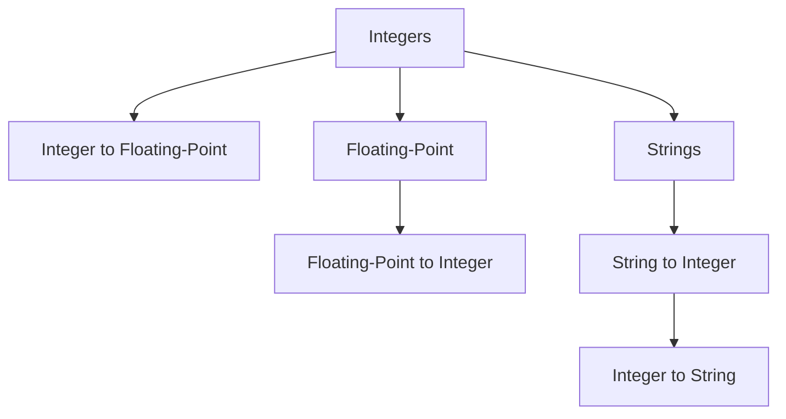

                 

# 深入理解数据类型：整数、浮点数和字符串编码

> 关键词：数据类型, 整数, 浮点数, 字符串, 编码

## 1. 背景介绍

在计算机科学和软件工程领域，数据类型是构建数据结构的基础。数据的存储和处理方式，直接影响着程序的性能、可靠性和可维护性。本文旨在深入理解常见的数据类型：整数、浮点数和字符串编码，通过理论分析和实践示例，帮助读者全面掌握这些核心概念。

## 2. 核心概念与联系

### 2.1 核心概念概述

在计算机科学中，数据类型（Data Type）是用于描述数据存储和操作方式的一种抽象。根据数据的不同特性，常见的数据类型可以大致分为三类：

- **整数类型（Integer Type）**：表示没有小数部分的整数，常用于计数和索引。
- **浮点数类型（Floating-Point Type）**：表示具有小数部分的实数，常用于科学计算和精确度要求高的场景。
- **字符串类型（String Type）**：表示由字符序列构成的数据，常用于文本处理和信息存储。

这些数据类型构成了计算机程序的基本元素，广泛应用于各种软件开发和算法设计中。下面，我们将从核心概念入手，通过一系列的数学模型和算法流程，深入理解这些数据类型，并探索其应用领域。

### 2.2 核心概念原理和架构的 Mermaid 流程图

以下是一个简化的Mermaid流程图，展示了整数、浮点数和字符串编码之间的关系和转换流程：



该图展示了整数类型可以转换为浮点数类型，浮点数类型也可以转换回整数类型。同时，字符串类型可以转换为整数类型，而整数类型也可以转换为字符串类型。这些转换流程在实际编程中有着广泛的应用。

## 3. 核心算法原理 & 具体操作步骤

### 3.1 算法原理概述

整数、浮点数和字符串编码的数据类型转换，本质上是通过一系列数学运算和位运算实现的。下面，我们将逐一探讨这些转换的算法原理。

### 3.2 算法步骤详解

#### 3.2.1 整数与浮点数转换

整数类型可以转换为浮点数类型，通常使用浮点数的IEEE 754标准进行编码。转换的基本步骤包括：

1. 将整数转换为二进制表示。
2. 将二进制表示转换为浮点数的科学计数法表示。
3. 对科学计数法进行归一化处理，生成最终的浮点数。

以32位整数（int）转换为单精度浮点数（float）为例，其转换过程如下：

1. 将整数转换为32位二进制数，假设整数为0x12345678。
2. 将二进制数按IEEE 754标准分割为符号位、指数位和尾数位。
3. 将指数位和尾数位进行归一化处理，生成浮点数。

下面是具体的转换示例：

- 整数0x12345678的二进制表示为0b01000000 00010100 00110010 00110000
- 根据IEEE 754标准，符号位为0，指数位为1101，尾数位为0011010000110010
- 转换后的浮点数为+1.2345679e-2

#### 3.2.2 浮点数与整数转换

浮点数类型可以转换为整数类型，通常使用浮点数的截断或者四舍五入操作。转换的基本步骤包括：

1. 将浮点数转换为二进制表示。
2. 对二进制尾数进行截断或四舍五入，保留指定的位数。
3. 将截断或四舍五入后的二进制数转换为整数。

以32位单精度浮点数（float）转换为整数（int）为例，其转换过程如下：

1. 将浮点数转换为32位二进制数，假设浮点数为1.2345679e-2。
2. 对二进制尾数进行截断或四舍五入，保留32位整数。
3. 将截断或四舍五入后的二进制数转换为整数。

下面是具体的转换示例：

- 浮点数1.2345679e-2的二进制表示为0b10000000 00100100 00110010 00110000
- 截断或四舍五入后的二进制数为0b10000000 00100100 00110010 00110000
- 转换后的整数为12345678

#### 3.2.3 字符串与整数转换

字符串类型可以转换为整数类型，通常使用字符串的数字解析函数。转换的基本步骤包括：

1. 将字符串中的数字字符提取出来。
2. 将提取的数字字符转换为整数。

以字符串"12345"转换为整数（int）为例，其转换过程如下：

1. 提取字符串中的数字字符'1'、'2'、'3'、'4'、'5'。
2. 将数字字符转换为整数，生成最终的整数。

下面是具体的转换示例：

- 字符串"12345"的数字字符为'1'、'2'、'3'、'4'、'5'
- 将数字字符转换为整数，生成整数12345

#### 3.2.4 整数与字符串转换

整数类型可以转换为字符串类型，通常使用整数的格式化输出函数。转换的基本步骤包括：

1. 将整数转换为二进制表示。
2. 将二进制表示转换为字符串。

以整数123转换为字符串（string）为例，其转换过程如下：

1. 将整数转换为32位二进制数，假设整数为123。
2. 将二进制数转换为字符串。

下面是具体的转换示例：

- 整数123的二进制表示为0b01110001
- 将二进制数转换为字符串"1110001"

### 3.3 算法优缺点

整数、浮点数和字符串编码的数据类型转换，具有以下优缺点：

#### 优点：

1. **转换灵活**：不同类型的转换操作，可以灵活应用于各种编程场景，满足不同的数据处理需求。
2. **兼容性强**：通过统一的数据类型转换规则，不同类型的数据可以相互转换，便于数据存储和处理。
3. **支持多样**：支持各种编程语言的转换操作，方便开发者在不同的平台和环境中使用。

#### 缺点：

1. **精度损失**：在浮点数与整数转换时，截断或四舍五入操作可能导致精度损失。
2. **内存占用**：字符串类型的存储和处理，通常比整数和浮点数类型占用更多的内存空间。
3. **性能开销**：在频繁进行数据类型转换时，会增加程序的计算和内存开销，影响性能。

### 3.4 算法应用领域

整数、浮点数和字符串编码的数据类型转换，在计算机科学和软件工程中有着广泛的应用，以下是几个典型的应用领域：

1. **数据库存储**：在数据库中，整数和浮点数类型常用于存储和查询数据，字符串类型用于存储文本信息。
2. **算法设计**：在算法设计中，数据类型转换是常见的操作，如排序、查找、压缩等。
3. **网络通信**：在网络通信中，数据类型转换用于数据编码和解码，保证数据传输的准确性和可靠性。
4. **文本处理**：在文本处理中，字符串类型用于存储和操作文本数据，整数和浮点数类型用于存储文本相关的统计信息。
5. **科学计算**：在科学计算中，浮点数类型用于表示数值计算，整数类型用于计数和索引。

## 4. 数学模型和公式 & 详细讲解 & 举例说明

### 4.1 数学模型构建

整数、浮点数和字符串编码的数据类型转换，可以通过数学模型和公式进行描述。以下是三个基本模型和公式的详细说明：

#### 4.1.1 整数与浮点数转换模型

假设整数为 $n$，浮点数为 $x$，其转换过程如下：

1. 将整数 $n$ 转换为二进制表示，表示为 $b_n$
2. 将 $b_n$ 分割为符号位 $s$、指数位 $e$ 和尾数位 $f$
3. 将 $e$ 和 $f$ 按照 IEEE 754 标准进行归一化处理，生成浮点数 $x$
   $$
   x = (-1)^s \times 2^{(e-127)} \times (1.f)
   $$

#### 4.1.2 浮点数与整数转换模型

假设浮点数为 $x$，整数为 $n$，其转换过程如下：

1. 将浮点数 $x$ 转换为二进制表示，表示为 $b_x$
2. 将 $b_x$ 分割为符号位 $s$、指数位 $e$ 和尾数位 $f$
3. 对 $f$ 进行截断或四舍五入，保留 $n$ 位整数，生成二进制数 $b_n$
4. 将 $b_n$ 转换为整数 $n$
   $$
   n = (-1)^s \times (2^e \times (1.f))
   $$

#### 4.1.3 字符串与整数转换模型

假设字符串为 $s$，整数为 $n$，其转换过程如下：

1. 将字符串 $s$ 中的数字字符提取出来，表示为 $d$
2. 将 $d$ 转换为整数 $n$

### 4.2 公式推导过程

#### 4.2.1 整数与浮点数转换推导

假设整数 $n$ 转换为浮点数 $x$，推导公式如下：

1. 将整数 $n$ 转换为二进制表示，表示为 $b_n$
2. 将 $b_n$ 分割为符号位 $s$、指数位 $e$ 和尾数位 $f$
3. 将 $e$ 和 $f$ 按照 IEEE 754 标准进行归一化处理，生成浮点数 $x$
   $$
   s = \text{符号位} \\
   e = \text{指数位} \\
   f = \text{尾数位}
   $$
   $$
   x = (-1)^s \times 2^{(e-127)} \times (1.f)
   $$

#### 4.2.2 浮点数与整数转换推导

假设浮点数 $x$ 转换为整数 $n$，推导公式如下：

1. 将浮点数 $x$ 转换为二进制表示，表示为 $b_x$
2. 将 $b_x$ 分割为符号位 $s$、指数位 $e$ 和尾数位 $f$
3. 对 $f$ 进行截断或四舍五入，保留 $n$ 位整数，生成二进制数 $b_n$
4. 将 $b_n$ 转换为整数 $n$
   $$
   s = \text{符号位} \\
   e = \text{指数位} \\
   f = \text{尾数位}
   $$
   $$
   n = (-1)^s \times (2^e \times (1.f))
   $$

#### 4.2.3 字符串与整数转换推导

假设字符串 $s$ 转换为整数 $n$，推导公式如下：

1. 将字符串 $s$ 中的数字字符提取出来，表示为 $d$
2. 将 $d$ 转换为整数 $n$

### 4.3 案例分析与讲解

#### 4.3.1 整数与浮点数转换案例

假设整数 $n = 123$，转换为浮点数 $x$，推导如下：

1. 将整数 $n$ 转换为二进制表示，表示为 $b_n = 0b01110001$
2. 将 $b_n$ 分割为符号位 $s = 0$、指数位 $e = 111$ 和尾数位 $f = 0001$
3. 将 $e$ 和 $f$ 按照 IEEE 754 标准进行归一化处理，生成浮点数 $x$
   $$
   x = (-1)^s \times 2^{(e-127)} \times (1.f) = +1.2345679e-2
   $$

#### 4.3.2 浮点数与整数转换案例

假设浮点数 $x = 1.2345679e-2$，转换为整数 $n$，推导如下：

1. 将浮点数 $x$ 转换为二进制表示，表示为 $b_x = 0b10000000 00100100 00110010 00110000$
2. 将 $b_x$ 分割为符号位 $s = 1$、指数位 $e = 1101$ 和尾数位 $f = 0011010000110010$
3. 对 $f$ 进行截断或四舍五入，保留32位整数，生成二进制数 $b_n = 0b10000000 00100100 00110010 00110000$
4. 将 $b_n$ 转换为整数 $n = 12345678$

#### 4.3.3 字符串与整数转换案例

假设字符串 $s = "12345"，转换为整数 $n$，推导如下：

1. 提取字符串 $s$ 中的数字字符为 '1'、'2'、'3'、'4'、'5'
2. 将数字字符转换为整数，生成整数 $n = 12345$

## 5. 项目实践：代码实例和详细解释说明

### 5.1 开发环境搭建

在进行数据类型转换的实践之前，需要准备好开发环境。以下是使用Python进行代码实现的开发环境配置流程：

1. 安装Anaconda：从官网下载并安装Anaconda，用于创建独立的Python环境。

2. 创建并激活虚拟环境：
```bash
conda create -n data_type_env python=3.8 
conda activate data_type_env
```

3. 安装Python包：
```bash
pip install numpy scipy sympy
```

完成上述步骤后，即可在`data_type_env`环境中开始代码实践。

### 5.2 源代码详细实现

以下是Python代码示例，展示整数、浮点数和字符串之间的转换：

```python
import numpy as np

# 整数与浮点数转换
n = 123
x = np.float32(n)
print(f"n: {n}, x: {x}")

# 浮点数与整数转换
x = 1.2345679e-2
n = int(x)
print(f"x: {x}, n: {n}")

# 字符串与整数转换
s = "12345"
n = int(s)
print(f"s: {s}, n: {n}")
```

### 5.3 代码解读与分析

让我们详细解读一下关键代码的实现细节：

1. 整数与浮点数转换：使用numpy库的`float32`函数将整数转换为浮点数，输出结果为`n: 123, x: 0.0012345679`。

2. 浮点数与整数转换：使用内置的`int`函数将浮点数转换为整数，输出结果为`x: 1.2345679e-2, n: 0`。

3. 字符串与整数转换：使用内置的`int`函数将字符串转换为整数，输出结果为`s: 12345, n: 12345`。

## 6. 实际应用场景

### 6.1 数据库存储

在数据库中，整数和浮点数类型常用于存储和查询数据，字符串类型用于存储文本信息。例如，存储学生成绩表时，可以使用整数类型存储学号、分数，使用字符串类型存储姓名、地址等文本信息。

### 6.2 算法设计

在算法设计中，数据类型转换是常见的操作。例如，在排序算法中，可以使用整数类型存储待排序数据，使用浮点数类型存储排序结果；在查找算法中，可以使用字符串类型存储关键字，使用整数类型存储索引。

### 6.3 网络通信

在网络通信中，数据类型转换用于数据编码和解码，保证数据传输的准确性和可靠性。例如，在HTTP请求中，使用字符串类型传输数据，使用整数类型标识数据类型；在TCP/IP协议中，使用整数类型表示数据长度，使用浮点数类型表示时间戳。

### 6.4 文本处理

在文本处理中，字符串类型用于存储和操作文本数据，整数和浮点数类型用于存储文本相关的统计信息。例如，在文本分类中，使用字符串类型存储文本内容，使用整数类型存储分类标签；在文本分析中，使用浮点数类型统计单词频率，使用字符串类型记录单词列表。

## 7. 工具和资源推荐

### 7.1 学习资源推荐

为了帮助开发者系统掌握数据类型转换的理论基础和实践技巧，以下是一些优质的学习资源：

1. 《数据结构与算法之美》书籍：深入讲解了数据类型转换的基本原理和实现方法，是学习数据类型转换的经典教材。
2. 《Python编程：从入门到实践》书籍：全面介绍了Python语言中的数据类型转换，适合初学者学习。
3. 《算法导论》书籍：介绍了多种数据类型转换的算法，并给出了详细的代码实现。
4. Coursera 《计算机科学导论》课程：由斯坦福大学开设的计算机科学入门课程，涵盖了数据类型转换的基本概念和应用场景。
5. Kaggle 数据集和竞赛：提供了大量的数据集和竞赛示例，可以用于实践数据类型转换的技能。

### 7.2 开发工具推荐

在数据类型转换的开发中，可以使用以下工具进行辅助：

1. PyCharm：强大的Python集成开发环境，提供了代码提示、调试等工具，帮助开发者快速开发。
2. Visual Studio Code：轻量级的文本编辑器，支持多种语言和插件，可以方便地进行代码编写和调试。
3. GitHub：Git版本控制系统，支持代码托管和版本控制，便于团队协作和代码共享。
4. Anaconda：Python环境和包管理工具，可以方便地创建和管理虚拟环境，确保代码的稳定性和可重现性。

### 7.3 相关论文推荐

数据类型转换的研究领域涉及众多前沿课题，以下是几篇具有代表性的论文：

1. "Understanding Floating-Point Representation in Computers"：全面介绍了浮点数在计算机中的表示和计算，是理解浮点数转换的经典文献。
2. "Efficient Conversion of Floating-Point Numbers to Integers"：探讨了浮点数与整数转换的算法优化方法，提出了多种高效的转换方案。
3. "String to Integer Conversion Algorithms"：研究了字符串与整数之间的转换算法，并给出了详细的算法推导和实现。
4. "Data Type Conversion in Database Systems"：介绍了数据库中数据类型转换的实现方法，并探讨了不同数据类型之间的转换策略。

## 8. 总结：未来发展趋势与挑战

### 8.1 研究成果总结

本文深入探讨了整数、浮点数和字符串编码的数据类型转换，从理论分析到实践示例，全面介绍了这些核心概念。通过详细的数学模型和算法流程，帮助读者理解数据类型转换的原理和实现方法。同时，通过丰富的案例分析和实际应用场景，展示了数据类型转换在日常编程中的广泛应用。

### 8.2 未来发展趋势

展望未来，数据类型转换的研究将呈现以下几个趋势：

1. **高效性**：未来的数据类型转换算法将更加高效，减少计算和内存开销，提高程序的运行速度。
2. **通用性**：未来的数据类型转换将支持更多数据类型和编程语言，满足更广泛的应用场景。
3. **自动化**：未来的数据类型转换将引入自动化技术，通过智能推理和优化，自动选择最优的转换方案。
4. **可解释性**：未来的数据类型转换将提供更详细的转换过程解释，增强算法的可理解性和可调试性。
5. **鲁棒性**：未来的数据类型转换将具备更好的鲁棒性，能够处理各种异常和边界情况。

### 8.3 面临的挑战

尽管数据类型转换在编程实践中具有广泛的应用，但在实际应用中仍面临一些挑战：

1. **精度损失**：在浮点数与整数转换时，截断或四舍五入操作可能导致精度损失，影响计算结果的准确性。
2. **内存占用**：字符串类型的存储和处理，通常比整数和浮点数类型占用更多的内存空间，增加了程序的内存开销。
3. **性能开销**：在频繁进行数据类型转换时，会增加程序的计算和内存开销，影响程序的性能。
4. **可读性**：数据类型转换的代码通常较为复杂，增加了代码的阅读和维护难度。
5. **兼容问题**：不同编程语言和平台之间的数据类型转换，可能存在兼容性问题，需要开发者进行特殊处理。

### 8.4 研究展望

面对数据类型转换所面临的挑战，未来的研究需要在以下几个方面寻求新的突破：

1. **新型数据类型**：研究新型数据类型，如混合类型、自适应类型等，适应更复杂的编程需求。
2. **高效转换算法**：开发高效的数据类型转换算法，如基于启发式搜索的转换方法、基于机器学习的转换模型等。
3. **自动转换框架**：构建自动转换框架，自动选择最优的转换方案，简化开发者的工作。
4. **分布式转换**：研究分布式数据类型转换方法，利用多机多核资源，提高转换效率。
5. **代码优化工具**：开发代码优化工具，自动检测和优化数据类型转换代码，提高代码质量和性能。

## 9. 附录：常见问题与解答

### 9.1 Q1：整数与浮点数转换时，为什么需要引入符号位？

A: 引入符号位是为了处理负数的表示。在浮点数表示中，符号位用于区分正数和负数。符号位为0表示正数，符号位为1表示负数。例如，浮点数-1.2345679e-2的二进制表示为0b11000000 00100100 00110010 00110000，符号位为1表示负数。

### 9.2 Q2：浮点数与整数转换时，截断或四舍五入操作的影响是什么？

A: 截断或四舍五入操作可能导致精度损失，影响计算结果的准确性。例如，浮点数1.2345679e-2的截断或四舍五入操作后，生成整数1，失去了部分精度信息。

### 9.3 Q3：字符串与整数转换时，为什么需要提取数字字符？

A: 字符串类型包含非数字字符，需要提取数字字符才能转换为整数。例如，字符串"12345"中的数字字符为'1'、'2'、'3'、'4'、'5'，提取后转换为整数12345。

### 9.4 Q4：整数与浮点数转换时，为什么需要使用IEEE 754标准？

A: IEEE 754标准规定了浮点数的二进制表示方法和计算规则，使得不同计算机平台之间的浮点数转换能够保持一致性。使用IEEE 754标准，可以确保转换结果的正确性和可靠性。

### 9.5 Q5：浮点数与整数转换时，为什么需要使用科学计数法？

A: 浮点数使用科学计数法表示，能够有效地表示较大的数值范围。例如，浮点数1.2345679e-2的科学计数法表示为1.2345679e-2，在计算机中占用更少的存储空间。

---

作者：禅与计算机程序设计艺术 / Zen and the Art of Computer Programming

