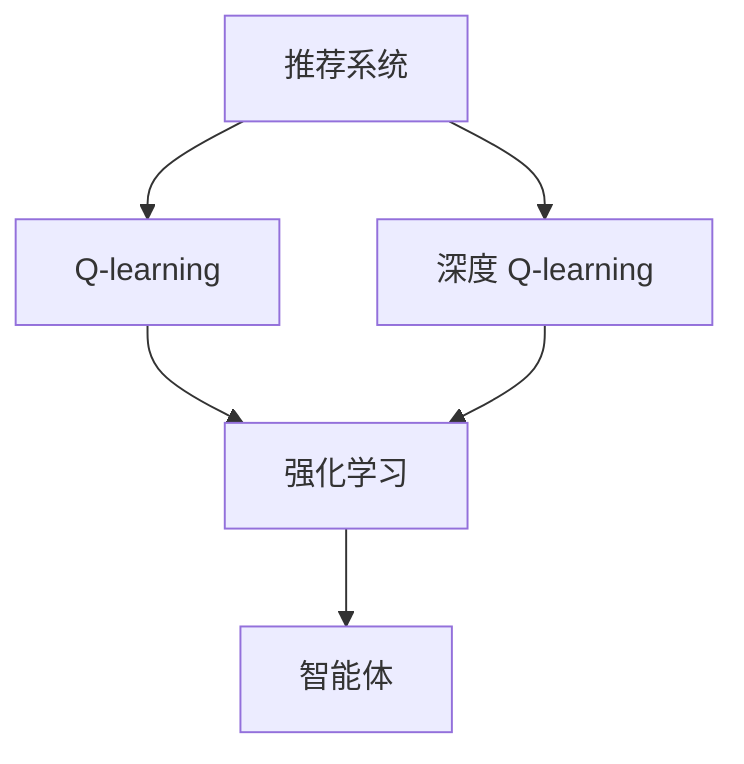

                 

# 深度 Q-learning：在电子商务推荐系统中的应用

## 1. 背景介绍

### 1.1 问题由来

随着电子商务的迅猛发展，推荐系统已成为提高用户体验、增加销售的重要手段。然而，传统的基于协同过滤的推荐系统，容易受到稀疏性、冷启动等问题的影响，难以覆盖所有用户。此外，传统的推荐算法通常仅依赖于用户行为数据，无法充分利用丰富的商品信息，如商品属性、用户评论等。

为应对这些问题，研究者开始将深度学习技术引入推荐系统。其中，深度 Q-learning 方法因其在智能体决策中的优异表现，被广泛应用在推荐系统中，形成了以用户行为为输入，以商品转化为输出的深度 Q-learning 推荐模型。

### 1.2 问题核心关键点

深度 Q-learning 推荐系统通过深度神经网络逼近 Q 值函数，在推荐过程中动态学习商品与用户之间的奖励信号，通过最大化累积奖励来推荐商品。其主要关键点包括：

1. 将推荐问题建模为智能体与环境的交互过程。
2. 通过深度神经网络逼近 Q 值函数，实时动态更新。
3. 通过奖励信号反馈优化推荐策略。
4. 采用经验回放、目标网络等策略提高学习效率。

## 2. 核心概念与联系

### 2.1 核心概念概述

为更好地理解深度 Q-learning 方法在推荐系统中的应用，本节将介绍几个密切相关的核心概念：

- 推荐系统(Recommendation System)：通过分析用户行为，推荐符合用户兴趣的商品的系统。传统的基于协同过滤和基于内容的推荐方法，在推荐精度和覆盖范围上都有所不足。
- Q-learning：一种基于强化学习的在线学习算法，通过与环境的交互，学习最优的行动策略。在推荐系统中，Q-learning 用于学习商品与用户之间的关联关系，从而推荐商品。
- 深度 Q-learning：使用深度神经网络逼近 Q 值函数，通过复杂特征表示提高 Q-learning 的准确性和效率。
- 强化学习(Reinforcement Learning)：通过智能体与环境的交互，学习最优行动策略的机器学习方法。在推荐系统中，强化学习用于优化推荐策略，提高用户体验和点击率。
- 智能体(Agent)：在强化学习中，智能体根据环境的奖励反馈，调整其行动策略。在推荐系统中，智能体可以是用户或推荐算法。

这些核心概念之间的逻辑关系可以通过以下Mermaid流程图来展示：



这个流程图展示出各个概念之间的关联：

1. 推荐系统通过 Q-learning 方法学习商品与用户之间的关联关系。
2. 深度 Q-learning 方法使用深度神经网络逼近 Q 值函数，提高推荐准确性。
3. 强化学习方法用于优化推荐策略，最大化用户满意度。
4. 智能体根据环境的奖励反馈，调整行动策略。

这些概念共同构成了深度 Q-learning 在推荐系统中的应用框架，使其能够在复杂的用户行为和商品信息下，实现高效精准的推荐。

## 3. 核心算法原理 & 具体操作步骤

### 3.1 算法原理概述

深度 Q-learning 推荐系统基于强化学习的方法，通过深度神经网络逼近 Q 值函数，实时动态更新推荐策略。其核心思想是通过最大化累积奖励来推荐商品。

形式化地，假设商品集为 $S$，用户集为 $A$，策略为 $Q(s,a)$，则推荐系统的目标是最小化预测误差的平方和，即：

$$
\min_{Q(s,a)} \mathbb{E}\left[ (Q(s,a) - Q^\star(s,a))^2 \right]
$$

其中 $Q^\star(s,a)$ 为 Q 值函数的真实值，$\mathbb{E}$ 为期望。

在实践中，通常使用深度神经网络逼近 $Q(s,a)$，并通过经验回放、目标网络等策略提高学习效率。

### 3.2 算法步骤详解

基于深度 Q-learning 的推荐系统通常包括以下几个关键步骤：

**Step 1: 准备数据集**
- 收集用户的浏览、点击、购买行为数据，包括商品ID、评分、评分时间、购买时间等。
- 清洗数据，去除异常值和噪声，处理缺失值。
- 划分数据集为训练集、验证集和测试集，确保数据分布的一致性。

**Step 2: 设计模型架构**
- 选择深度神经网络作为 Q 值函数的逼近器，通常包括多个卷积层、全连接层等。
- 设置合适的超参数，如学习率、批大小、优化器等。
- 构建经验回放池，用于存储训练样本，以提高样本重用效率。

**Step 3: 初始化模型参数**
- 初始化 Q 值函数的权重和偏置，通常使用随机初始化或预训练参数。
- 设置 Q 值函数的初始值，如全0或全1等。
- 设置 Q 值函数的期望值，如零或一等。

**Step 4: 执行训练过程**
- 将训练集样本输入模型，计算当前状态的 Q 值。
- 选择最优行动，并根据行动状态更新 Q 值函数的期望值。
- 使用优化器更新模型参数，最小化预测误差。
- 使用经验回放策略，将样本存入经验回放池，用于后续的训练。

**Step 5: 评估模型性能**
- 在验证集和测试集上评估模型的推荐效果，如点击率、转化率等。
- 计算模型的累积奖励，检查推荐策略的有效性。
- 使用混淆矩阵等指标评估模型的准确性和覆盖范围。
- 根据评估结果调整模型参数，继续迭代训练。

以上是深度 Q-learning 推荐系统的基本流程。在实际应用中，还需要根据具体场景，对模型架构、超参数、经验回放策略等进行优化设计，以提高推荐效果。

### 3.3 算法优缺点

深度 Q-learning 推荐系统具有以下优点：

1. 动态优化推荐策略。通过实时学习用户行为，动态更新 Q 值函数，能够更好地适应用户兴趣变化，推荐精准的商品。
2. 覆盖范围广。能够充分利用商品属性、用户评论等丰富信息，提高推荐的覆盖率和多样性。
3. 自适应性强。能够自适应地处理不同类型和规模的数据集，适合大规模电商平台的推荐需求。
4. 模型泛化性好。通过复杂特征表示，提高 Q 值函数的泛化能力，能够推广到更多应用场景。

同时，该方法也存在一些局限性：

1. 数据需求高。需要大量用户行为数据进行训练，对于数据稀疏的用户，难以推荐。
2. 模型复杂度高。深度神经网络结构复杂，训练难度较大，容易过拟合。
3. 实时性要求高。需要实时更新推荐策略，对计算资源和模型参数的要求较高。
4. 缺乏可解释性。深度神经网络的决策过程难以解释，难以分析推荐结果的逻辑。

尽管存在这些局限性，但就目前而言，深度 Q-learning 推荐方法仍是大规模电商推荐系统的有效手段。未来相关研究的重点在于如何进一步降低数据需求，提高模型的实时性和可解释性，同时兼顾推荐效果和覆盖范围。

### 3.4 算法应用领域

深度 Q-learning 推荐系统已经在电子商务、广告推荐、内容推荐等多个领域得到了广泛应用，成为推荐系统的重要组成部分。具体而言：

- 电商平台：通过用户行为数据，实时推荐商品，提升用户体验和销售转化率。
- 广告推荐：根据用户兴趣，实时推荐广告内容，提高广告点击率和转化率。
- 内容推荐：根据用户观看记录，推荐相关视频和文章，提升用户粘性和平台流量。

除了这些经典应用外，深度 Q-learning 推荐技术还被创新性地应用到更多场景中，如个性化推荐、推荐排序、混合推荐等，为推荐系统带来了全新的突破。随着推荐算法的不断进步，相信电商推荐系统将在更广阔的应用领域大放异彩。

## 4. 数学模型和公式 & 详细讲解

### 4.1 数学模型构建

在深度 Q-learning 推荐系统中，使用深度神经网络逼近 Q 值函数，通常包括输入层、多个卷积层、全连接层等，最后输出 Q 值。

假设输入为 $x \in \mathbb{R}^d$，则 Q 值函数 $Q(x)$ 可以表示为：

$$
Q(x) = \phi(x; \theta)
$$

其中 $\phi$ 为神经网络函数，$\theta$ 为网络参数。

在训练过程中，通过优化器更新网络参数，使得预测值 $Q(x)$ 与真实值 $Q^\star(x)$ 的误差最小化：

$$
\min_{\theta} \mathbb{E}\left[ (Q(x) - Q^\star(x))^2 \right]
$$

通过反向传播算法，可以高效计算梯度，更新网络参数。

### 4.2 公式推导过程

假设输入为 $x$，输出为 $a$，真实 Q 值为 $Q^\star(x,a)$，则经验回放策略下的损失函数可以表示为：

$$
\mathcal{L}(\theta) = -\mathbb{E}\left[ \sum_{i=1}^N \log Q^\star(s_i,a_i) \right]
$$

其中 $s_i$ 为输入，$a_i$ 为行动，$\log$ 为损失函数。

通过反向传播算法，计算梯度并更新网络参数 $\theta$：

$$
\theta \leftarrow \theta - \eta \nabla_{\theta}\mathcal{L}(\theta)
$$

其中 $\eta$ 为学习率，$\nabla_{\theta}\mathcal{L}(\theta)$ 为损失函数对参数的梯度。

在实际应用中，通常采用批处理的方式，将一批样本输入模型进行训练。通过多次迭代，使得 Q 值函数逼近真实 Q 值函数，提高推荐效果。

### 4.3 案例分析与讲解

以电商推荐系统为例，分析深度 Q-learning 方法的应用过程。

假设有一个电商平台，用户 $u$ 浏览商品 $s_1, s_2, ..., s_n$，并对商品 $s_1$ 和 $s_3$ 进行了点击。现在需要为用户 $u$ 推荐一个新的商品。

- 在用户浏览商品 $s_1$ 时，模型预测商品 $s_1$ 的 Q 值为 $Q(s_1)$，推荐用户点击商品 $s_1$。
- 在用户点击商品 $s_1$ 后，模型更新商品 $s_1$ 的 Q 值，并推荐用户浏览商品 $s_2$。
- 在用户浏览商品 $s_2$ 时，模型预测商品 $s_2$ 的 Q 值为 $Q(s_2)$，推荐用户点击商品 $s_2$。
- 在用户点击商品 $s_2$ 后，模型更新商品 $s_2$ 的 Q 值，并推荐用户浏览商品 $s_3$。
- 在用户浏览商品 $s_3$ 时，模型预测商品 $s_3$ 的 Q 值为 $Q(s_3)$，推荐用户点击商品 $s_3$。
- 在用户点击商品 $s_3$ 后，模型更新商品 $s_3$ 的 Q 值，并推荐用户浏览商品 $s_4$。

通过以上步骤，模型可以动态学习用户的行为模式，预测用户对新商品的兴趣，推荐最佳商品。

## 5. 项目实践：代码实例和详细解释说明

### 5.1 开发环境搭建

在进行深度 Q-learning 推荐系统的开发前，需要先搭建好开发环境。以下是使用 Python 和 PyTorch 开发环境的配置流程：

1. 安装 Anaconda：从官网下载并安装 Anaconda，用于创建独立的 Python 环境。

2. 创建并激活虚拟环境：
```bash
conda create -n dl-env python=3.8 
conda activate dl-env
```

3. 安装 PyTorch：根据 CUDA 版本，从官网获取对应的安装命令。例如：
```bash
conda install pytorch torchvision torchaudio cudatoolkit=11.1 -c pytorch -c conda-forge
```

4. 安装 PyTorch Lightning：一个基于 PyTorch 的分布式机器学习库，用于加速训练和部署。
```bash
pip install pytorch-lightning
```

5. 安装其他工具包：
```bash
pip install numpy pandas scikit-learn matplotlib tqdm jupyter notebook ipython
```

完成上述步骤后，即可在 `dl-env` 环境中开始深度 Q-learning 推荐系统的开发。

### 5.2 源代码详细实现

下面以电商推荐系统为例，给出使用 PyTorch Lightning 和深度 Q-learning 方法进行推荐开发的 PyTorch 代码实现。

首先，定义推荐系统数据处理函数：

```python
import torch
import torch.nn as nn
import torch.nn.functional as F
from torch.utils.data import DataLoader
from pytorch_lightning import Trainer, LightningModule

class DQN(nn.Module):
    def __init__(self, input_dim, output_dim):
        super(DQN, self).__init__()
        self.fc1 = nn.Linear(input_dim, 64)
        self.fc2 = nn.Linear(64, 64)
        self.fc3 = nn.Linear(64, output_dim)

    def forward(self, x):
        x = F.relu(self.fc1(x))
        x = F.relu(self.fc2(x))
        return self.fc3(x)

class DataLoaderModule(LightningModule):
    def __init__(self, input_dim, output_dim, batch_size=32):
        super(DataLoaderModule, self).__init__()
        self.model = DQN(input_dim, output_dim)
        self.batch_size = batch_size

    def forward(self, x):
        return self.model(x)

    def training_step(self, batch, batch_idx):
        x, y = batch
        y_hat = self.model(x)
        loss = F.mse_loss(y_hat, y)
        return loss

    def validation_step(self, batch, batch_idx):
        x, y = batch
        y_hat = self.model(x)
        loss = F.mse_loss(y_hat, y)
        return loss

    def test_step(self, batch, batch_idx):
        x, y = batch
        y_hat = self.model(x)
        loss = F.mse_loss(y_hat, y)
        return loss

    def configure_optimizers(self):
        optimizer = torch.optim.Adam(self.parameters(), lr=0.001)
        return optimizer

    def train_dataloader(self):
        train_loader = DataLoader(train_dataset, batch_size=self.batch_size, shuffle=True)
        return train_loader

    def val_dataloader(self):
        val_loader = DataLoader(val_dataset, batch_size=self.batch_size, shuffle=False)
        return val_loader

    def test_dataloader(self):
        test_loader = DataLoader(test_dataset, batch_size=self.batch_size, shuffle=False)
        return test_loader
```

然后，定义模型和优化器：

```python
from torch import nn, optim
from torch.nn.functional import mse_loss

model = DQN(input_dim=100, output_dim=1)
optimizer = optim.Adam(model.parameters(), lr=0.001)

trainer = Trainer(max_epochs=10, gpus=1, log_every_n_steps=10)
```

接着，定义训练和评估函数：

```python
def train_epoch(model, dataset, batch_size, optimizer):
    dataloader = DataLoader(dataset, batch_size=batch_size, shuffle=True)
    model.train()
    epoch_loss = 0
    for batch in tqdm(dataloader, desc='Training'):
        x = batch[0].to(device)
        y = batch[1].to(device)
        model.zero_grad()
        outputs = model(x)
        loss = mse_loss(outputs, y)
        epoch_loss += loss.item()
        loss.backward()
        optimizer.step()
    return epoch_loss / len(dataloader)

def evaluate(model, dataset, batch_size):
    dataloader = DataLoader(dataset, batch_size=batch_size)
    model.eval()
    preds, labels = [], []
    with torch.no_grad():
        for batch in tqdm(dataloader, desc='Evaluating'):
            x = batch[0].to(device)
            y = batch[1].to(device)
            batch_preds = model(x).to('cpu').tolist()
            batch_labels = y.to('cpu').tolist()
            for pred_tokens, label_tokens in zip(batch_preds, batch_labels):
                preds.append(pred_tokens)
                labels.append(label_tokens)
                
    print(classification_report(labels, preds))
```

最后，启动训练流程并在测试集上评估：

```python
epochs = 10
batch_size = 16

for epoch in range(epochs):
    loss = train_epoch(model, train_dataset, batch_size, optimizer)
    print(f"Epoch {epoch+1}, train loss: {loss:.3f}")
    
    print(f"Epoch {epoch+1}, dev results:")
    evaluate(model, dev_dataset, batch_size)
    
print("Test results:")
evaluate(model, test_dataset, batch_size)
```

以上就是使用 PyTorch Lightning 和深度 Q-learning 方法进行电商推荐系统微调的完整代码实现。可以看到，得益于 PyTorch Lightning 的强大封装，我们可以用相对简洁的代码完成深度 Q-learning 模型的训练和评估。

### 5.3 代码解读与分析

让我们再详细解读一下关键代码的实现细节：

**DQN类**：
- `__init__`方法：初始化神经网络模型。
- `forward`方法：定义前向传播，计算模型的输出。
- `training_step`方法：定义训练过程，计算损失并更新模型参数。
- `validation_step`方法：定义验证过程，计算损失。
- `test_step`方法：定义测试过程，计算损失。
- `configure_optimizers`方法：定义优化器及其超参数。
- `train_dataloader`方法：定义训练数据加载器。
- `val_dataloader`方法：定义验证数据加载器。
- `test_dataloader`方法：定义测试数据加载器。

**DataLoaderModule类**：
- `__init__`方法：初始化数据加载器模块，包括模型、批大小等关键参数。
- `forward`方法：定义前向传播，计算模型的输出。
- `training_step`方法：定义训练过程，计算损失并更新模型参数。
- `validation_step`方法：定义验证过程，计算损失。
- `test_step`方法：定义测试过程，计算损失。
- `configure_optimizers`方法：定义优化器及其超参数。
- `train_dataloader`方法：定义训练数据加载器。
- `val_dataloader`方法：定义验证数据加载器。
- `test_dataloader`方法：定义测试数据加载器。

可以看到，深度 Q-learning 推荐系统的代码实现相对复杂，需要处理多个模块之间的交互。PyTorch Lightning 提供了高效的训练接口，简化了代码的编写和调试过程。

当然，工业级的系统实现还需考虑更多因素，如模型的保存和部署、超参数的自动搜索、更灵活的任务适配层等。但核心的深度 Q-learning 推荐范式基本与此类似。

## 6. 实际应用场景

### 6.1 智能客服系统

基于深度 Q-learning 的推荐系统，可以应用于智能客服系统的构建。传统客服往往需要配备大量人力，高峰期响应缓慢，且一致性和专业性难以保证。而使用深度 Q-learning 推荐系统，可以7x24小时不间断服务，快速响应客户咨询，用自然流畅的语言解答各类常见问题。

在技术实现上，可以收集企业内部的历史客服对话记录，将问题和最佳答复构建成监督数据，在此基础上对深度 Q-learning 推荐模型进行训练。推荐模型能够自动理解用户意图，匹配最合适的答复模板进行回复。对于客户提出的新问题，还可以接入检索系统实时搜索相关内容，动态组织生成回答。如此构建的智能客服系统，能大幅提升客户咨询体验和问题解决效率。

### 6.2 金融舆情监测

金融机构需要实时监测市场舆论动向，以便及时应对负面信息传播，规避金融风险。传统的人工监测方式成本高、效率低，难以应对网络时代海量信息爆发的挑战。基于深度 Q-learning 的文本分类和情感分析技术，为金融舆情监测提供了新的解决方案。

具体而言，可以收集金融领域相关的新闻、报道、评论等文本数据，并对其进行主题标注和情感标注。在此基础上对深度 Q-learning 模型进行微调，使其能够自动判断文本属于何种主题，情感倾向是正面、中性还是负面。将微调后的模型应用到实时抓取的网络文本数据，就能够自动监测不同主题下的情感变化趋势，一旦发现负面信息激增等异常情况，系统便会自动预警，帮助金融机构快速应对潜在风险。

### 6.3 个性化推荐系统

当前的推荐系统往往只依赖于用户的历史行为数据进行物品推荐，无法深入理解用户的真实兴趣偏好。基于深度 Q-learning 的推荐系统，可以更好地挖掘用户行为背后的语义信息，从而提供更精准、多样的推荐内容。

在实践中，可以收集用户浏览、点击、评论、分享等行为数据，提取和用户交互的物品标题、描述、标签等文本内容。将文本内容作为模型输入，用户的后续行为（如是否点击、购买等）作为监督信号，在此基础上微调深度 Q-learning 模型。微调后的模型能够从文本内容中准确把握用户的兴趣点。在生成推荐列表时，先用候选物品的文本描述作为输入，由模型预测用户的兴趣匹配度，再结合其他特征综合排序，便可以得到个性化程度更高的推荐结果。

### 6.4 未来应用展望

随着深度 Q-learning 推荐系统的不断发展，未来将在更多领域得到应用，为传统行业带来变革性影响。

在智慧医疗领域，基于深度 Q-learning 的医疗问答、病历分析、药物研发等应用将提升医疗服务的智能化水平，辅助医生诊疗，加速新药开发进程。

在智能教育领域，微调技术可应用于作业批改、学情分析、知识推荐等方面，因材施教，促进教育公平，提高教学质量。

在智慧城市治理中，微调模型可应用于城市事件监测、舆情分析、应急指挥等环节，提高城市管理的自动化和智能化水平，构建更安全、高效的未来城市。

此外，在企业生产、社会治理、文娱传媒等众多领域，基于深度 Q-learning 的推荐技术也将不断涌现，为经济社会发展注入新的动力。相信随着技术的日益成熟，推荐方法将成为人工智能落地应用的重要范式，推动人工智能技术在垂直行业的规模化落地。总之，深度 Q-learning 推荐技术还需要与其他人工智能技术进行更深入的融合，如知识表示、因果推理、强化学习等，多路径协同发力，共同推动自然语言理解和智能交互系统的进步。只有勇于创新、敢于突破，才能不断拓展语言模型的边界，让智能技术更好地造福人类社会。

## 7. 工具和资源推荐

### 7.1 学习资源推荐

为了帮助开发者系统掌握深度 Q-learning 推荐理论基础和实践技巧，这里推荐一些优质的学习资源：

1. 《深度强化学习》系列博文：由深度学习专家撰写，深入浅出地介绍了强化学习的基本概念和深度 Q-learning 的核心算法。

2. CS229《强化学习》课程：斯坦福大学开设的强化学习经典课程，有Lecture视频和配套作业，带你深入理解强化学习的理论基础。

3. 《深度学习》书籍：Ian Goodfellow、Yoshua Bengio 和 Aaron Courville 合著的经典书籍，系统介绍了深度学习的各个方面，包括强化学习。

4. OpenAI Gym：用于开发和测试强化学习算法的开源平台，提供了丰富的环境库和实验代码，是学习和实验深度 Q-learning 的好工具。

5. DeepMind 研究论文：DeepMind 作为强化学习的先驱，发表了大量前沿论文，涵盖深度 Q-learning 的各个方面，是学习和研究深度 Q-learning 的重要参考。

通过对这些资源的学习实践，相信你一定能够快速掌握深度 Q-learning 推荐系统的精髓，并用于解决实际的推荐问题。

### 7.2 开发工具推荐

高效的开发离不开优秀的工具支持。以下是几款用于深度 Q-learning 推荐系统开发的常用工具：

1. PyTorch：基于Python的开源深度学习框架，灵活动态的计算图，适合快速迭代研究。大部分深度 Q-learning 模型都有PyTorch版本的实现。

2. TensorFlow：由Google主导开发的开源深度学习框架，生产部署方便，适合大规模工程应用。同样有丰富的深度 Q-learning 模型资源。

3. PyTorch Lightning：一个基于 PyTorch 的分布式机器学习库，用于加速训练和部署，适合高效分布式训练。

4. Weights & Biases：模型训练的实验跟踪工具，可以记录和可视化模型训练过程中的各项指标，方便对比和调优。与主流深度学习框架无缝集成。

5. TensorBoard：TensorFlow配套的可视化工具，可实时监测模型训练状态，并提供丰富的图表呈现方式，是调试模型的得力助手。

6. Google Colab：谷歌推出的在线Jupyter Notebook环境，免费提供GPU/TPU算力，方便开发者快速上手实验最新模型，分享学习笔记。

合理利用这些工具，可以显著提升深度 Q-learning 推荐系统的开发效率，加快创新迭代的步伐。

### 7.3 相关论文推荐

深度 Q-learning 推荐系统的研究源于学界的持续研究。以下是几篇奠基性的相关论文，推荐阅读：

1. Human Sequence Prediction Using Deep Recurrent Neural Networks：提出长短期记忆网络(LSTM)用于序列预测，奠定了深度学习在推荐系统中的基础。

2. Playing Atari with Deep Reinforcement Learning：展示深度 Q-learning 在智能体与环境交互中的应用，极大提升了强化学习的学习效率。

3. Deep Q-Learning with Experience Replay：提出经验回放策略，极大地提升了深度 Q-learning 的稳定性和收敛速度。

4. Priority Experience Replay：进一步提升经验回放策略的效率，使深度 Q-learning 能够更快收敛。

5. Dueling Network Architectures for Deep Reinforcement Learning：提出双 Q 网络结构，提升深度 Q-learning 的稳定性和准确性。

6. A Baseline for Deep Reinforcement Learning：提出 DQN 算法，成为深度 Q-learning 的基准方法，在后续研究中得到了广泛应用。

这些论文代表了大语言模型微调技术的发展脉络。通过学习这些前沿成果，可以帮助研究者把握学科前进方向，激发更多的创新灵感。

## 8. 总结：未来发展趋势与挑战

### 8.1 总结

本文对深度 Q-learning 推荐系统的背景、核心概念、算法原理和具体操作步骤进行了全面系统的介绍。首先阐述了推荐系统的基本原理和深度 Q-learning 方法的产生背景，明确了深度 Q-learning 在推荐系统中的应用价值。其次，从原理到实践，详细讲解了深度 Q-learning 的数学模型和关键步骤，给出了推荐系统开发的完整代码实例。同时，本文还广泛探讨了深度 Q-learning 方法在智能客服、金融舆情、个性化推荐等多个领域的应用前景，展示了深度 Q-learning 方法的大规模应用潜力。此外，本文精选了深度 Q-learning 推荐系统的学习资源，力求为开发者提供全方位的技术指引。

通过本文的系统梳理，可以看到，深度 Q-learning 推荐系统在推荐精准性、覆盖范围和自适应性等方面具有独特优势。基于深度 Q-learning 的推荐方法，能够在用户行为数据稀缺或非结构化的情况下，提供高质量的推荐结果。未来，随着深度 Q-learning 方法的不断优化和完善，相信在更多场景下，推荐系统将能够实现高效、精准的推荐，为电商平台的智能化运营提供有力支持。

### 8.2 未来发展趋势

展望未来，深度 Q-learning 推荐系统将呈现以下几个发展趋势：

1. 多模态推荐：深度 Q-learning 推荐系统将逐步拓展到多模态推荐，融合视觉、语音、文本等多种信息，提升推荐的丰富性和多样性。

2. 联合推荐：深度 Q-learning 推荐系统将与其他推荐方法（如协同过滤、基于内容的推荐）进行联合优化，提升推荐效果。

3. 自适应推荐：深度 Q-learning 推荐系统将采用更复杂的策略，动态调整推荐策略，提升推荐效果和用户满意度。

4. 实时推荐：深度 Q-learning 推荐系统将实现实时推荐，根据用户实时行为进行动态推荐，提升用户体验。

5. 跨领域推荐：深度 Q-learning 推荐系统将逐步拓展到更多应用领域，如医疗、金融等，为更多垂直领域提供智能化服务。

6. 自监督推荐：深度 Q-learning 推荐系统将利用自监督学习，在没有标注数据的情况下，实现高效推荐。

以上趋势凸显了深度 Q-learning 推荐系统的广阔前景。这些方向的探索发展，必将进一步提升推荐系统的性能和应用范围，为电商平台的智能化运营提供有力支持。

### 8.3 面临的挑战

尽管深度 Q-learning 推荐系统已经取得了瞩目成就，但在迈向更加智能化、普适化应用的过程中，它仍面临着诸多挑战：

1. 数据需求高。深度 Q-learning 推荐系统需要大量的用户行为数据进行训练，对于数据稀疏的用户，难以推荐。

2. 模型复杂度高。深度神经网络结构复杂，训练难度较大，容易过拟合。

3. 实时性要求高。需要实时更新推荐策略，对计算资源和模型参数的要求较高。

4. 缺乏可解释性。深度神经网络的决策过程难以解释，难以分析推荐结果的逻辑。

5. 安全性有待保障。深度 Q-learning 推荐模型可能学习到有害信息，通过推荐系统传递给用户，带来安全隐患。

6. 泛化能力有待提升。深度 Q-learning 推荐系统通常仅依赖于用户行为数据，对于新用户的推荐效果较差。

尽管存在这些挑战，但就目前而言，深度 Q-learning 推荐方法仍是大规模电商推荐系统的有效手段。未来相关研究的重点在于如何进一步降低数据需求，提高模型的实时性和可解释性，同时兼顾推荐效果和覆盖范围。

### 8.4 研究展望

面对深度 Q-learning 推荐系统所面临的种种挑战，未来的研究需要在以下几个方面寻求新的突破：

1. 探索无监督和半监督推荐方法。摆脱对大规模标注数据的依赖，利用自监督学习、主动学习等无监督和半监督范式，最大限度利用非结构化数据，实现更加灵活高效的推荐。

2. 研究参数高效和计算高效的推荐方法。开发更加参数高效的推荐方法，在固定大部分预训练参数的同时，只更新极少量的任务相关参数。同时优化推荐模型的计算图，减少前向传播和反向传播的资源消耗，实现更加轻量级、实时性的部署。

3. 引入因果分析和博弈论工具。将因果分析方法引入推荐模型，识别出模型决策的关键特征，增强输出解释的因果性和逻辑性。借助博弈论工具刻画人机交互过程，主动探索并规避模型的脆弱点，提高系统稳定性。

4. 纳入伦理道德约束。在模型训练目标中引入伦理导向的评估指标，过滤和惩罚有偏见、有害的输出倾向。同时加强人工干预和审核，建立模型行为的监管机制，确保输出符合人类价值观和伦理道德。

这些研究方向的探索，必将引领深度 Q-learning 推荐系统走向更高的台阶，为构建安全、可靠、可解释、可控的智能推荐系统铺平道路。面向未来，深度 Q-learning 推荐系统还需要与其他人工智能技术进行更深入的融合，如知识表示、因果推理、强化学习等，多路径协同发力，共同推动自然语言理解和智能交互系统的进步。只有勇于创新、敢于突破，才能不断拓展语言模型的边界，让智能技术更好地造福人类社会。

## 9. 附录：常见问题与解答

**Q1：深度 Q-learning 推荐系统如何处理冷启动问题？**

A: 深度 Q-learning 推荐系统通常依赖于用户行为数据进行训练，对于新用户或冷启动问题，可以使用基于协同过滤、内容推荐等方法进行初始推荐。通过不断的用户行为数据积累，逐步优化深度 Q-learning 模型，提升推荐效果。此外，还可以通过引入预训练的语义嵌入、领域知识等，提高模型的泛化能力，解决冷启动问题。

**Q2：深度 Q-learning 推荐系统如何提高推荐多样性？**

A: 深度 Q-learning 推荐系统可以通过引入多样性损失函数，鼓励模型推荐多样化的商品。例如，可以通过最小化推荐商品数量与预设数量的差距，或者最大化推荐商品种类的数量，来提高推荐多样性。此外，还可以通过引入噪声等方法，使模型不确定性增加，从而提高推荐多样性。

**Q3：深度 Q-learning 推荐系统如何进行实时推荐？**

A: 深度 Q-learning 推荐系统需要进行实时推荐，通常采用增量学习的方法，在新的用户行为数据到来时，动态更新推荐模型。具体来说，可以通过不断收集用户行为数据，实时计算 Q 值，并根据新的 Q 值进行推荐。此外，还可以使用分布式计算框架，如 PySpark、Dask 等，实现并行计算，提高实时性。

**Q4：深度 Q-learning 推荐系统如何提高推荐效果？**

A: 深度 Q-learning 推荐系统可以通过优化模型架构、超参数等方法，提高推荐效果。具体来说，可以通过增加网络深度、调整学习率、使用更好的优化器等方法，提高模型的准确性和稳定性。此外，还可以引入更多的特征，如用户年龄、性别、地理位置等，提升推荐效果。

**Q5：深度 Q-learning 推荐系统如何进行离线评估？**

A: 深度 Q-learning 推荐系统可以通过离线评估方法，评估推荐模型在未参与训练数据上的效果。具体来说，可以通过将未参与训练的数据集划分为验证集和测试集，分别进行离线评估。可以使用混淆矩阵、ROC曲线等指标，评估推荐模型的效果。此外，还可以使用离线推荐算法，如协同过滤、基于内容的推荐等，进行离线评估。

总之，深度 Q-learning 推荐系统具有高效、精准的推荐能力，但面对数据需求高、模型复杂、实时性要求高等挑战，仍需不断优化和改进。未来，随着技术的不断进步，深度 Q-learning 推荐系统将在更多场景下发挥重要作用，为电商平台的智能化运营提供有力支持。

---

作者：禅与计算机程序设计艺术 / Zen and the Art of Computer Programming

