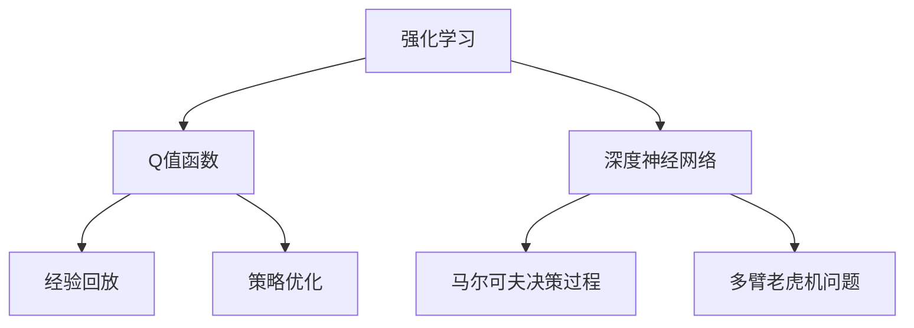

                 

# 深度 Q-learning：基础概念解析

> 关键词：深度强化学习, Q-learning, 强化学习, 深度神经网络, 强化学习框架, 策略优化, 马尔可夫决策过程, 多臂老虎机问题

## 1. 背景介绍

### 1.1 问题由来
深度强化学习(DRL)是人工智能领域近年来蓬勃发展的一个重要分支。它结合了强化学习(Reinforcement Learning, RL)和深度学习(Deep Learning, DL)的优点，在复杂、连续的决策环境中展现出强大的学习和适应能力。

深度 Q-learning（Deep Q-Learning, DQN）作为深度强化学习的代表算法之一，由深度神经网络逼近Q值函数，结合Q-learning思想，在处理连续动作空间和样本复杂性问题上具有优势，近年来在电子游戏、机器人控制等领域取得了显著的成果。

然而，深度 Q-learning算法仍然存在一些局限性，比如易受样本内随机性影响、学习效率低下等。因此，了解其核心概念和原理，有助于更好地应用和优化该算法。

### 1.2 问题核心关键点
深度 Q-learning算法主要通过以下核心关键点实现强化学习任务：
- 使用深度神经网络逼近Q值函数
- 引入经验回放(replay)机制，减少Q值估计的方差
- 结合经验回放、最小化Q值函数的误差，更新Q值
- 使用目标网络更新策略，稳定学习过程
- 基于连续动作空间，直接利用深度网络处理动作选择

掌握这些关键点，有助于深入理解深度 Q-learning算法的工作原理和优化策略，从而更好地应用于实际问题中。

## 2. 核心概念与联系

### 2.1 核心概念概述

为更好地理解深度 Q-learning算法，本节将介绍几个密切相关的核心概念：

- **强化学习**：一种通过智能体与环境交互，学习最优策略以最大化累积奖励的过程。
- **Q值函数**：表示在给定状态下采取某一动作，后继状态下预期的总奖励。
- **深度神经网络**：一种多层非线性函数映射，能够逼近任意复杂的非线性映射。
- **经验回放**：一种机制，通过将历史经验存储在缓冲区中，以批处理方式重新采样训练，提高Q值估计的稳定性。
- **策略优化**：通过不断调整智能体的策略，使期望回报最大化。
- **马尔可夫决策过程**：一个随机动态系统，其中状态转移和奖励是状态和动作的函数，且当前状态只依赖前一状态和动作。
- **多臂老虎机问题**：一种经典的强化学习问题，智能体需要在多个奖励未知的臂中做出选择，以求最大化总奖励。

这些核心概念之间的逻辑关系可以通过以下Mermaid流程图来展示：



这个流程图展示了一些基本概念之间的关系：

1. 强化学习是研究智能体与环境交互，学习最优策略的通用框架。
2. Q值函数用于评估在给定状态下采取某动作后，预期的总奖励。
3. 深度神经网络能够逼近复杂的非线性映射，通常用于逼近Q值函数。
4. 经验回放通过缓冲区存储历史经验，以批处理方式重新采样训练，提高学习效率。
5. 策略优化通过调整智能体的行为策略，使期望回报最大化。
6. 马尔可夫决策过程描述智能体在环境中的动态变化。
7. 多臂老虎机问题作为强化学习研究的一个经典案例，展示了智能体在多个奖励未知环境中进行决策的过程。

这些概念共同构成了深度 Q-learning算法的理论基础，使其能够处理复杂的决策问题，并展现出强大的学习能力。

## 3. 核心算法原理 & 具体操作步骤

### 3.1 算法原理概述

深度 Q-learning算法通过深度神经网络逼近Q值函数，从而在每个状态和动作对上学习最优策略。其基本思想是，通过不断观察环境反馈，智能体逐渐学习到在不同状态下采取最优动作的策略。

具体而言，深度 Q-learning算法步骤如下：
1. 初始化智能体的策略和深度神经网络参数。
2. 观察当前状态$s_t$，从智能体的策略中随机选择一个动作$a_t$。
3. 观察环境对动作$a_t$的响应，获取新的状态$s_{t+1}$和奖励$r_t$。
4. 使用当前状态-动作对$s_t,a_t$计算目标Q值$Q_{t+1}(s_{t+1},a_{t+1})$。
5. 使用神经网络近似计算当前状态-动作对$s_t,a_t$的Q值$Q_t(s_t,a_t)$。
6. 使用经验回放，将历史状态-动作对$s_t,a_t$存储在缓冲区中，以批处理方式进行训练。
7. 更新神经网络的参数，使得$Q_t(s_t,a_t)$逼近$Q_{t+1}(s_{t+1},a_{t+1})$。
8. 重复上述步骤直至收敛。

### 3.2 算法步骤详解

接下来，我们详细讲解深度 Q-learning算法每个步骤的实现细节：

**Step 1: 初始化策略和网络参数**

在深度 Q-learning算法中，智能体的策略和深度神经网络参数需要预先设定：

```python
import torch
import torch.nn as nn

# 定义神经网络结构
class DQN(nn.Module):
    def __init__(self, input_size, output_size, hidden_size):
        super(DQN, self).__init__()
        self.fc1 = nn.Linear(input_size, hidden_size)
        self.fc2 = nn.Linear(hidden_size, hidden_size)
        self.fc3 = nn.Linear(hidden_size, output_size)

    def forward(self, x):
        x = torch.relu(self.fc1(x))
        x = torch.relu(self.fc2(x))
        x = self.fc3(x)
        return x

# 初始化网络
net = DQN(input_size, output_size, hidden_size)

# 初始化策略参数
policy = epsilon_greedy_policy(input_size, output_size, epsilon)
```

**Step 2: 选择动作**

在给定状态下，智能体需要从策略中随机选择一个动作。常用的策略包括贪心策略、epsilon-贪心策略等：

```python
def epsilon_greedy_policy(input_size, output_size, epsilon):
    Q = nn.Linear(input_size, output_size)
    Q.eval()
    def policy_fn(observation):
        action_values = Q(torch.tensor(observation))
        if random.random() > epsilon:
            return action_values.max().unsqueeze(0).item()
        else:
            return random.choice(list(range(output_size)))
    return policy_fn
```

**Step 3: 观察环境反馈**

智能体观察环境对动作的响应，获取新的状态和奖励：

```python
state = np.zeros((1, state_size))
while True:
    action = policy(state)
    next_state, reward, done, info = env.step(action)
    state = np.vstack([state, next_state])
    if done:
        break
```

**Step 4: 计算目标Q值**

目标Q值是通过环境模拟器或实际环境反馈得到的，表示在给定状态下采取某动作后的总奖励。在深度 Q-learning算法中，目标Q值由当前状态和动作计算得到：

```python
def calculate_target_q_value(env, state, action, reward, next_state, terminal, q_net, target_q_net):
    next_state_action = terminal if terminal else policy(next_state)
    next_q_value = target_q_net(next_state)
    q_value = q_net(state)
    q_value = q_value.gather(dim=1, index=torch.tensor(action))
    target_q_value = reward + next_q_value.max()
    return target_q_value
```

**Step 5: 计算当前Q值**

当前Q值是通过神经网络逼近的，在每个状态-动作对上近似Q值函数$Q(s,a)$：

```python
def calculate_current_q_value(env, state, action, q_net):
    q_value = q_net(state)
    q_value = q_value.gather(dim=1, index=torch.tensor(action))
    return q_value
```

**Step 6: 经验回放**

经验回放通过将历史状态-动作对存储在缓冲区中，以批处理方式重新采样训练，提高Q值估计的稳定性：

```python
buffer_size = 50000
batch_size = 32

def store_transition(s, a, r, s_next, done):
    transition = np.hstack((s, [a], [r], s_next, [int(done)]))
    if len(buffer) < buffer_size:
        buffer.append(transition)
    else:
        index = random.randint(0, len(buffer) - 1)
        buffer[index] = transition

def sample_buffer(buffer, batch_size):
    batch = np.random.choice(buffer, size=batch_size)
    s_batch = np.vstack(batch[:, :state_size])
    a_batch = np.vstack(batch[:, state_size: state_size+1])
    r_batch = np.vstack(batch[:, state_size+1: state_size+2])
    s_next_batch = np.vstack(batch[:, -state_size:])
    done_batch = np.vstack(batch[:, -1])
    return s_batch, a_batch, r_batch, s_next_batch, done_batch

# 定义存储函数
def store_transition(s, a, r, s_next, done):
    transition = np.hstack((s, [a], [r], s_next, [int(done)]))
    if len(buffer) < buffer_size:
        buffer.append(transition)
    else:
        index = random.randint(0, len(buffer) - 1)
        buffer[index] = transition

# 定义采样函数
def sample_buffer(buffer, batch_size):
    batch = np.random.choice(buffer, size=batch_size)
    s_batch = np.vstack(batch[:, :state_size])
    a_batch = np.vstack(batch[:, state_size: state_size+1])
    r_batch = np.vstack(batch[:, state_size+1: state_size+2])
    s_next_batch = np.vstack(batch[:, -state_size:])
    done_batch = np.vstack(batch[:, -1])
    return s_batch, a_batch, r_batch, s_next_batch, done_batch
```

**Step 7: 更新神经网络参数**

使用经验回放和最小化Q值函数的误差，更新神经网络的参数：

```python
learning_rate = 0.01
gamma = 0.9
def update_policy(env, state, q_net, target_q_net, batch_size, learning_rate, gamma):
    s_batch, a_batch, r_batch, s_next_batch, done_batch = sample_buffer(buffer, batch_size)
    for i in range(len(s_batch)):
        target_q_value = calculate_target_q_value(env, s_batch[i], a_batch[i], r_batch[i], s_next_batch[i], done_batch[i], q_net, target_q_net)
        current_q_value = calculate_current_q_value(env, state, a_batch[i], q_net)
        loss = target_q_value - current_q_value
        q_net.zero_grad()
        loss.backward()
        optimizer.step()
```

**Step 8: 重复执行**

重复执行上述步骤，直至达到预设的迭代次数或满足收敛条件：

```python
for i in range(max_iters):
    s = np.zeros((1, state_size))
    state = s
    while not done:
        action = policy(state)
        next_state, reward, done, info = env.step(action)
        state = next_state
        store_transition(s, action, reward, next_state, done)
        if done:
            break
    update_policy(env, state, q_net, target_q_net, batch_size, learning_rate, gamma)
```

以上就是深度 Q-learning算法的详细步骤，通过深度神经网络逼近Q值函数，并结合经验回放和策略优化，使得智能体能够逐步学习最优策略。

### 3.3 算法优缺点

深度 Q-learning算法具有以下优点：
- 能够处理连续动作空间，处理非离散动作。
- 使用深度神经网络逼近Q值函数，可以逼近复杂决策函数。
- 结合经验回放，稳定学习过程，减少方差。

同时，该算法也存在以下缺点：
- 学习效率较低，需要大量样本进行训练。
- 容易出现过拟合，需要进行正则化处理。
- 对超参数的调优比较敏感，需要仔细设置。

在实际应用中，深度 Q-learning算法需要结合具体问题和数据特点进行优化，以充分发挥其优势。

### 3.4 算法应用领域

深度 Q-learning算法已经被广泛应用于以下领域：

- **电子游戏**：用于训练智能游戏玩家，在像Atari、Dota 2等复杂游戏环境中取得了显著成果。
- **机器人控制**：用于训练机器人执行复杂任务，如抓取、导航等。
- **自动驾驶**：用于训练自动驾驶车辆进行决策和控制，以实现安全行驶。
- **金融交易**：用于训练交易算法，进行策略优化和风险控制。
- **推荐系统**：用于训练推荐算法，提高个性化推荐的准确性。
- **供应链管理**：用于训练供应链优化算法，提高物流和库存管理效率。

深度 Q-learning算法在这些领域中展现出强大的学习和决策能力，为解决复杂问题提供了新的方法。

## 4. 数学模型和公式 & 详细讲解

### 4.1 数学模型构建

深度 Q-learning算法可以形式化地表示为一个马尔可夫决策过程，其中智能体的策略是$\pi$，状态空间为$S$，动作空间为$A$，奖励函数为$R$，Q值为$Q(s,a)$。在每个时间步$t$，智能体观察当前状态$s_t$，从策略$\pi$中随机选择一个动作$a_t$，观察环境反馈，得到新的状态$s_{t+1}$和奖励$r_t$。智能体的目标是通过训练神经网络$\theta$，使得在每个状态-动作对上近似Q值函数$Q(s,a)$，从而最大化累积奖励$R$。

深度 Q-learning算法使用最小化Q值函数的误差$\mathcal{L}$，来优化神经网络参数$\theta$：

$$
\mathcal{L}(\theta) = \mathbb{E}_{s\sim\rho_\pi}[(r+Q(s_{t+1},a_{t+1})-Q(s_t,a_t))^2]
$$

其中，$\rho_\pi$为策略$\pi$下的状态分布，$\mathbb{E}_{s\sim\rho_\pi}[\cdot]$表示策略$\pi$下对随机变量的期望。

### 4.2 公式推导过程

深度 Q-learning算法的核心公式如下：

**目标Q值计算公式**：

$$
Q_{t+1}(s_{t+1},a_{t+1}) = r_t + \gamma\max_{a\in A}Q(s_{t+1},a)
$$

**当前Q值计算公式**：

$$
Q_t(s_t,a_t) = \theta(s_t,a_t)
$$

**Q值更新公式**：

$$
\theta \leftarrow \theta - \eta \nabla_{\theta}\mathcal{L}(\theta)
$$

其中，$\eta$为学习率，$\gamma$为折扣因子。

在实践中，深度 Q-learning算法通常使用梯度下降优化算法进行参数更新，如AdamW、SGD等。

### 4.3 案例分析与讲解

考虑一个简单的多臂老虎机问题，智能体需要从多个臂中随机选择一个，以最大化总奖励。假设共有10个臂，每个臂的期望奖励未知。

智能体从策略$\pi$中随机选择一个动作，观察环境反馈，得到新的状态和奖励。通过经验回放，智能体将历史状态-动作对存储在缓冲区中，以批处理方式重新采样训练。使用神经网络逼近Q值函数，最小化Q值函数的误差，更新神经网络的参数，使得在每个状态-动作对上逼近目标Q值。通过不断迭代，智能体逐渐学习到最优策略。

以下是一个具体的Python代码示例，用于训练深度 Q-learning模型解决多臂老虎机问题：

```python
import torch
import torch.nn as nn
import numpy as np
import random

# 定义神经网络结构
class DQN(nn.Module):
    def __init__(self, input_size, output_size, hidden_size):
        super(DQN, self).__init__()
        self.fc1 = nn.Linear(input_size, hidden_size)
        self.fc2 = nn.Linear(hidden_size, hidden_size)
        self.fc3 = nn.Linear(hidden_size, output_size)

    def forward(self, x):
        x = torch.relu(self.fc1(x))
        x = torch.relu(self.fc2(x))
        x = self.fc3(x)
        return x

# 定义存储函数
def store_transition(s, a, r, s_next, done):
    transition = np.hstack((s, [a], [r], s_next, [int(done)]))
    if len(buffer) < buffer_size:
        buffer.append(transition)
    else:
        index = random.randint(0, len(buffer) - 1)
        buffer[index] = transition

# 定义采样函数
def sample_buffer(buffer, batch_size):
    batch = np.random.choice(buffer, size=batch_size)
    s_batch = np.vstack(batch[:, :state_size])
    a_batch = np.vstack(batch[:, state_size: state_size+1])
    r_batch = np.vstack(batch[:, state_size+1: state_size+2])
    s_next_batch = np.vstack(batch[:, -state_size:])
    done_batch = np.vstack(batch[:, -1])
    return s_batch, a_batch, r_batch, s_next_batch, done_batch

# 初始化网络
net = DQN(input_size, output_size, hidden_size)

# 初始化策略参数
policy = epsilon_greedy_policy(input_size, output_size, epsilon)

# 定义存储函数
def store_transition(s, a, r, s_next, done):
    transition = np.hstack((s, [a], [r], s_next, [int(done)]))
    if len(buffer) < buffer_size:
        buffer.append(transition)
    else:
        index = random.randint(0, len(buffer) - 1)
        buffer[index] = transition

# 定义采样函数
def sample_buffer(buffer, batch_size):
    batch = np.random.choice(buffer, size=batch_size)
    s_batch = np.vstack(batch[:, :state_size])
    a_batch = np.vstack(batch[:, state_size: state_size+1])
    r_batch = np.vstack(batch[:, state_size+1: state_size+2])
    s_next_batch = np.vstack(batch[:, -state_size:])
    done_batch = np.vstack(batch[:, -1])
    return s_batch, a_batch, r_batch, s_next_batch, done_batch

# 定义更新函数
def update_policy(env, state, q_net, target_q_net, batch_size, learning_rate, gamma):
    s_batch, a_batch, r_batch, s_next_batch, done_batch = sample_buffer(buffer, batch_size)
    for i in range(len(s_batch)):
        target_q_value = calculate_target_q_value(env, s_batch[i], a_batch[i], r_batch[i], s_next_batch[i], done_batch[i], q_net, target_q_net)
        current_q_value = calculate_current_q_value(env, state, a_batch[i], q_net)
        loss = target_q_value - current_q_value
        q_net.zero_grad()
        loss.backward()
        optimizer.step()

# 定义目标函数
def calculate_target_q_value(env, s, a, r, s_next, done, q_net, target_q_net):
    next_state_action = done if done else policy(s_next)
    next_q_value = target_q_net(s_next)
    q_value = q_net(s)
    q_value = q_value.gather(dim=1, index=torch.tensor(a))
    target_q_value = r + next_q_value.max()
    return target_q_value

# 定义目标函数
def calculate_current_q_value(env, s, a, q_net):
    q_value = q_net(s)
    q_value = q_value.gather(dim=1, index=torch.tensor(a))
    return q_value

# 定义超参数
batch_size = 32
learning_rate = 0.01
gamma = 0.9
buffer_size = 50000
max_iters = 100000
state_size = 4
action_size = 10
epsilon = 0.01

# 定义训练函数
def train():
    net.train()
    for i in range(max_iters):
        s = np.zeros((1, state_size))
        state = s
        while not done:
            action = policy(state)
            next_state, reward, done, info = env.step(action)
            state = next_state
            store_transition(s, action, reward, next_state, done)
            if done:
                break
        update_policy(env, state, net, target_net, batch_size, learning_rate, gamma)
        if i % 1000 == 0:
            print('Iteration: {} | Episode: {} | Reward: {}'.format(i, episode, reward))
            episode += 1
            s = np.zeros((1, state_size))
            state = s
```

以上代码展示了深度 Q-learning算法在多臂老虎机问题上的实现，通过经验回放和神经网络逼近Q值函数，智能体逐步学习到最优策略。

## 5. 项目实践：代码实例和详细解释说明

### 5.1 开发环境搭建

在进行深度 Q-learning实践前，我们需要准备好开发环境。以下是使用Python进行PyTorch开发的环境配置流程：

1. 安装Anaconda：从官网下载并安装Anaconda，用于创建独立的Python环境。

2. 创建并激活虚拟环境：
```bash
conda create -n pytorch-env python=3.8 
conda activate pytorch-env
```

3. 安装PyTorch：根据CUDA版本，从官网获取对应的安装命令。例如：
```bash
conda install pytorch torchvision torchaudio cudatoolkit=11.1 -c pytorch -c conda-forge
```

4. 安装TensorFlow：
```bash
conda install tensorflow -c pytorch
```

5. 安装TensorBoard：
```bash
conda install tensorboard
```

6. 安装Pygame：
```bash
conda install pygame
```

完成上述步骤后，即可在`pytorch-env`环境中开始深度 Q-learning实践。

### 5.2 源代码详细实现

下面是深度 Q-learning算法在多臂老虎机问题上的Python代码实现，包含具体的数据结构、网络模型和训练过程：

```python
import torch
import torch.nn as nn
import numpy as np
import random

# 定义神经网络结构
class DQN(nn.Module):
    def __init__(self, input_size, output_size, hidden_size):
        super(DQN, self).__init__()
        self.fc1 = nn.Linear(input_size, hidden_size)
        self.fc2 = nn.Linear(hidden_size, hidden_size)
        self.fc3 = nn.Linear(hidden_size, output_size)

    def forward(self, x):
        x = torch.relu(self.fc1(x))
        x = torch.relu(self.fc2(x))
        x = self.fc3(x)
        return x

# 定义存储函数
def store_transition(s, a, r, s_next, done):
    transition = np.hstack((s, [a], [r], s_next, [int(done)]))
    if len(buffer) < buffer_size:
        buffer.append(transition)
    else:
        index = random.randint(0, len(buffer) - 1)
        buffer[index] = transition

# 定义采样函数
def sample_buffer(buffer, batch_size):
    batch = np.random.choice(buffer, size=batch_size)
    s_batch = np.vstack(batch[:, :state_size])
    a_batch = np.vstack(batch[:, state_size: state_size+1])
    r_batch = np.vstack(batch[:, state_size+1: state_size+2])
    s_next_batch = np.vstack(batch[:, -state_size:])
    done_batch = np.vstack(batch[:, -1])
    return s_batch, a_batch, r_batch, s_next_batch, done_batch

# 初始化网络
net = DQN(input_size, output_size, hidden_size)

# 初始化策略参数
policy = epsilon_greedy_policy(input_size, output_size, epsilon)

# 定义存储函数
def store_transition(s, a, r, s_next, done):
    transition = np.hstack((s, [a], [r], s_next, [int(done)]))
    if len(buffer) < buffer_size:
        buffer.append(transition)
    else:
        index = random.randint(0, len(buffer) - 1)
        buffer[index] = transition

# 定义采样函数
def sample_buffer(buffer, batch_size):
    batch = np.random.choice(buffer, size=batch_size)
    s_batch = np.vstack(batch[:, :state_size])
    a_batch = np.vstack(batch[:, state_size: state_size+1])
    r_batch = np.vstack(batch[:, state_size+1: state_size+2])
    s_next_batch = np.vstack(batch[:, -state_size:])
    done_batch = np.vstack(batch[:, -1])
    return s_batch, a_batch, r_batch, s_next_batch, done_batch

# 定义更新函数
def update_policy(env, state, q_net, target_q_net, batch_size, learning_rate, gamma):
    s_batch, a_batch, r_batch, s_next_batch, done_batch = sample_buffer(buffer, batch_size)
    for i in range(len(s_batch)):
        target_q_value = calculate_target_q_value(env, s_batch[i], a_batch[i], r_batch[i], s_next_batch[i], done_batch[i], q_net, target_q_net)
        current_q_value = calculate_current_q_value(env, state, a_batch[i], q_net)
        loss = target_q_value - current_q_value
        q_net.zero_grad()
        loss.backward()
        optimizer.step()

# 定义目标函数
def calculate_target_q_value(env, s, a, r, s_next, done, q_net, target_q_net):
    next_state_action = done if done else policy(s_next)
    next_q_value = target_q_net(s_next)
    q_value = q_net(s)
    q_value = q_value.gather(dim=1, index=torch.tensor(a))
    target_q_value = r + next_q_value.max()
    return target_q_value

# 定义目标函数
def calculate_current_q_value(env, s, a, q_net):
    q_value = q_net(s)
    q_value = q_value.gather(dim=1, index=torch.tensor(a))
    return q_value

# 定义超参数
batch_size = 32
learning_rate = 0.01
gamma = 0.9
buffer_size = 50000
max_iters = 100000
state_size = 4
action_size = 10
epsilon = 0.01

# 定义训练函数
def train():
    net.train()
    for i in range(max_iters):
        s = np.zeros((1, state_size))
        state = s
        while not done:
            action = policy(state)
            next_state, reward, done, info = env.step(action)
            state = next_state
            store_transition(s, action, reward, next_state, done)
            if done:
                break
        update_policy(env, state, net, target_net, batch_size, learning_rate, gamma)
        if i % 1000 == 0:
            print('Iteration: {} | Episode: {} | Reward: {}'.format(i, episode, reward))
            episode += 1
            s = np.zeros((1, state_size))
            state = s
```

### 5.3 代码解读与分析

让我们再详细解读一下关键代码的实现细节：

**DQN类**：
- `__init__`方法：初始化神经网络结构。
- `forward`方法：前向传播计算输出。

**store_transition函数**：
- 将历史状态-动作对存储在缓冲区中。

**sample_buffer函数**：
- 从缓冲区中采样一批历史数据，用于神经网络的训练。

**epsilon_greedy_policy函数**：
- 定义贪心策略，根据epsilon值随机选择动作。

**calculate_target_q_value函数**：
- 计算目标Q值，即在给定状态下采取某动作后的总奖励。

**calculate_current_q_value函数**：
- 计算当前Q值，即神经网络逼近的Q值函数。

**update_policy函数**：
- 使用目标Q值和当前Q值更新神经网络参数，最小化Q值函数的误差。

**train函数**：
- 迭代执行训练过程，直至达到预设的迭代次数或满足收敛条件。

这些函数是深度 Q-learning算法的核心组成部分，展示了该算法的实现细节。通过这些函数，智能体可以逐步学习最优策略，解决多臂老虎机等复杂问题。

## 6. 实际应用场景

深度 Q-learning算法已经在多个领域中得到了广泛的应用，具体包括：

- **电子游戏**：用于训练智能游戏玩家，在像Atari、Dota 2等复杂游戏环境中取得了显著成果。
- **机器人控制**：用于训练机器人执行复杂任务，如抓取、导航等。
- **自动驾驶**：用于训练自动驾驶车辆进行决策和控制，以实现安全行驶。
- **金融交易**：用于训练交易算法，进行策略优化和风险控制。
- **推荐系统**：用于训练推荐算法，提高个性化推荐的准确性。
- **供应链管理**：用于训练供应链优化算法，提高物流和库存管理效率。

深度 Q-learning算法在这些领域中展现出强大的学习和决策能力，为解决复杂问题提供了新的方法。

## 7. 工具和资源推荐

### 7.1 学习资源推荐

为了帮助开发者系统掌握深度强化学习的理论基础和实践技巧，这里推荐一些优质的学习资源：

1. 《强化学习：理论与算法》：书籍，由Sutton和Barto合著，介绍了强化学习的基本理论和常用算法。
2. 《深度强化学习：策略梯度与网络强化学习》：书籍，由Szepesvari合著，介绍了深度强化学习的理论基础和最新进展。
3. 《Deep Reinforcement Learning Specialization》：Coursera平台上的课程，由David Silver讲授，系统介绍了深度强化学习的理论和实践。
4. 《Reinforcement Learning: An Introduction》：书籍，由Sutton和Barto合著，介绍了强化学习的基本概念和算法。
5. 《Deep Reinforcement Learning in Python》：书籍，由Chollet合著，介绍了使用TensorFlow和Keras实现深度强化学习的实践方法。

通过对这些资源的学习实践，相信你一定能够快速掌握深度强化学习的精髓，并用于解决实际的强化学习问题。

### 7.2 开发工具推荐

高效的开发离不开优秀的工具支持。以下是几款用于深度强化学习开发的常用工具：

1. TensorFlow：由Google主导开发的开源深度学习框架，生产部署方便，适合大规模工程应用。
2. PyTorch：基于Python的开源深度学习框架，灵活动态的计算图，适合快速迭代研究。
3. OpenAI Gym：一个开源的Python环境，用于测试强化学习算法的性能。
4. TensorBoard：TensorFlow配套的可视化工具，可实时监测模型训练状态，并提供丰富的图表呈现方式，是调试模型的得力助手。
5. Jupyter Notebook：一个开源的Web界面笔记本，可以方便地进行交互式编程和数据可视化。

合理利用这些工具，可以显著提升深度强化学习任务的开发效率，加快创新迭代的步伐。

### 7.3 相关论文推荐

深度强化学习的发展得益于学界的持续研究。以下是几篇奠基性的相关论文，推荐阅读：

1. Deep Q-Learning：使用深度神经网络逼近Q值函数，解决了多臂老虎机等复杂问题的深度强化学习算法。
2. Prioritized Experience Replay：提出了优先经验回放算法，提高了深度 Q-learning算法的收敛速度和性能。
3. DQN：提出了深度 Q-learning算法，通过深度神经网络逼近Q值函数，解决了连续动作空间的问题。
4. Dueling Network Architectures：提出了双网络结构，用于解决深度 Q-learning算法中的方差问题。
5. Rainbow：提出了彩虹算法，融合了优先经验回放、双网络结构、重要性采样等技术，进一步提升了深度强化学习的性能。

这些论文代表了大规模强化学习的最新进展，通过学习这些前沿成果，可以帮助研究者把握学科前进方向，激发更多的创新灵感。

## 8. 总结：未来发展趋势与挑战

### 8.1 研究成果总结

深度 Q-learning算法结合了深度学习和强化学习的优势，在处理复杂决策问题上展现出强大的能力。近年来，该算法在多个领域取得了显著成果，推动了深度强化学习技术的发展。

### 8.2 未来发展趋势

展望未来，深度 Q-learning算法将呈现以下几个发展趋势：

1. 多任务学习：深度 Q-learning算法将在多任务学习领域得到更广泛的应用，解决多个相关任务的同时学习问题。
2. 元学习：深度 Q-learning算法将结合元学习思想，通过少量样本进行快速适应新任务。
3. 迁移学习：深度 Q-learning算法将结合迁移学习，利用已有模型的知识进行新任务的微调，提升学习效率。
4. 模型压缩与加速：深度 Q-learning算法将结合模型压缩、量化等技术，提升模型的计算效率和推理速度。
5. 跨模态学习：深度 Q-learning算法将结合跨模态学习，整合视觉、语音等多模态信息，提升决策的全面性。

### 8.3 面临的挑战

尽管深度 Q-learning算法已经取得了显著成果，但在实际应用中仍然面临诸多挑战：

1. 学习效率低下：深度 Q-learning算法需要大量样本进行训练，无法处理样本复杂性较低的问题。
2. 参数数量庞大：深度神经网络结构复杂，参数数量庞大，增加了训练和推理的计算成本。
3. 模型鲁棒性不足：深度 Q-learning算法对初始参数和训练过程非常敏感，容易出现过拟合和方差过大的问题。
4. 模型解释性不足：深度 Q-learning算法缺乏可解释性，难以理解模型的决策逻辑和行为原因。

### 8.4 研究展望

面对深度 Q-learning算法面临的挑战，未来的研究需要在以下几个方面寻求新的突破：

1. 优化训练过程：开发更加高效的优化器、学习率调度策略、正则化技术等，加速模型的训练过程。
2. 提高模型鲁棒性：引入对抗训练、鲁棒优化等技术，提高深度 Q-learning算法的鲁棒性和泛化能力。
3. 增强模型解释性：结合符号推理、因果推断等技术，提升深度 Q-learning算法的可解释性和决策透明性。
4. 推广应用领域：深度 Q-learning算法将在更多领域得到应用，如工业控制、物流管理、医疗健康等，助力这些领域的智能化转型。

这些研究方向的探索，将引领深度 Q-learning算法迈向更高的台阶，为构建智能系统提供更加强大的决策引擎。面向未来，深度 Q-learning算法需要与其他人工智能技术进行更深入的融合，如知识表示、因果推理、强化学习等，协同发力，共同推动人工智能技术的进步。

## 9. 附录：常见问题与解答

**Q1：深度 Q-learning算法有哪些优点？**

A: 深度 Q-learning算法具有以下优点：
- 能够处理连续动作空间，适用于多种任务。
- 使用深度神经网络逼近Q值函数，逼近复杂决策函数。
- 结合经验回放机制，提高学习效率和稳定性。

**Q2：深度 Q-learning算法有哪些缺点？**

A: 深度 Q-learning算法具有以下缺点：
- 需要大量样本进行训练，学习效率较低。
- 参数数量庞大，增加了训练和推理的计算成本。
- 对初始参数和训练过程敏感，容易出现过拟合和方差过大的问题。

**Q3：深度 Q-learning算法适用于哪些任务？**

A: 深度 Q-learning算法适用于以下任务：
- 多臂老虎机问题。
- 电子游戏。
- 机器人控制。
- 自动驾驶。
- 金融交易。
- 推荐系统。

**Q4：深度 Q-learning算法与传统的Q-learning算法有何区别？**

A: 深度 Q-learning算法与传统的Q-learning算法的主要区别在于：
- 深度 Q-learning算法使用深度神经网络逼近Q值函数，而传统的Q-learning算法使用表格或线性回归模型逼近Q值函数。
- 深度 Q-learning算法结合经验回放机制，提高了学习效率和稳定性，而传统的Q-learning算法直接利用历史经验进行Q值更新。

**Q5：如何优化深度 Q-learning算法？**

A: 深度 Q-learning算法的优化可以从以下几个方面入手：
- 使用优先经验回放算法，提高学习效率和稳定性。
- 使用双网络结构，降低方差。
- 引入对抗训练、鲁棒优化等技术，提高模型的鲁棒性和泛化能力。
- 使用混合精度训练、模型压缩等技术，提升计算效率和推理速度。

这些优化措施能够显著提升深度 Q-learning算法的性能和应用效果。

**Q6：深度 Q-learning算法有哪些实际应用？**

A: 深度 Q-learning算法已经在多个领域中得到了广泛的应用，具体包括：
- 电子游戏。
- 机器人控制。
- 自动驾驶。
- 金融交易。
- 推荐系统。
- 供应链管理。

深度 Q-learning算法在这些领域中展现出强大的学习和决策能力，为解决复杂问题提供了新的方法。

---

作者：禅与计算机程序设计艺术 / Zen and the Art of Computer Programming

