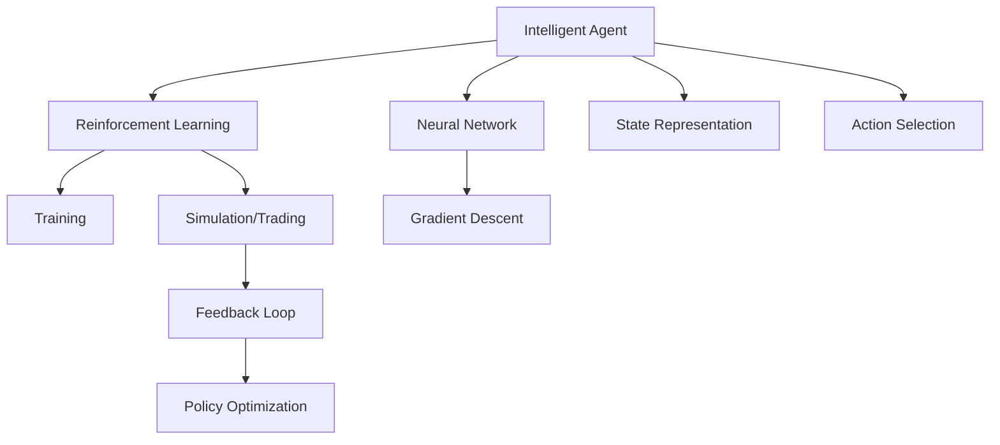

                 

## 1. 背景介绍

金融交易是一个高度动态且复杂的领域，需要精确、实时地做出决策。传统的基于规则和专家知识的金融交易系统，在面对高频且难以预测的市场变化时，往往显得力不从心。深度强化学习（Deep Reinforcement Learning, DRL）作为一种先进的机器学习方法，近年来逐渐成为金融交易领域的研究热点。

### 1.1 问题由来
在金融市场中，投资者面临着无数个潜在的决策点。如何制定投资策略，如何选择交易时机，以及如何在交易中平衡风险和回报，是金融交易的核心问题。传统的量化交易模型基于历史数据和统计规律进行决策，但在非线性且不确定的市场环境下，这些模型往往表现出一定的滞后性。

深度强化学习提供了一种新的解决思路：通过让智能体（agent）在虚拟环境中学习，并逐步将其策略迁移到真实交易环境中，智能体能够在面对未知情况时，做出更为灵活和高效的决策。深度强化学习的核心在于学习环境的建模，奖励机制的设计，以及智能体的策略优化。

### 1.2 问题核心关键点
深度强化学习在金融交易中的应用，主要集中在以下几个核心点：
1. **环境建模**：如何构建有效的金融市场环境，以便智能体能够学习到市场规律。
2. **奖励机制**：如何设计奖励机制，激励智能体做出有利决策。
3. **策略优化**：如何训练智能体，使其能够在不断变化的市场环境中，最大化收益并控制风险。
4. **模型评估**：如何在真实交易环境中验证模型的有效性和稳定性。

## 2. 核心概念与联系

### 2.1 核心概念概述

在金融交易中应用深度强化学习，需要深入理解以下核心概念：

- **深度强化学习**：一种结合深度神经网络和强化学习的方法，能够自主学习复杂环境中的决策策略。
- **智能体**：学习算法中的主体，在金融交易中，智能体通过交易行为与市场环境互动。
- **策略**：智能体在每一步决策时所采用的行动方案，通常由神经网络模型输出。
- **状态**：智能体在每个时间步所处的环境状态，如股价、交易量等。
- **奖励**：智能体在每个时间步所获得的即时反馈，激励其继续执行当前策略。
- **回溯**：通过模拟或实际交易的反复迭代，智能体不断调整策略以优化长期收益。

这些核心概念之间的逻辑关系可以通过以下Mermaid流程图来展示：



这个流程图展示深度强化学习在金融交易中的核心概念及其之间的关系：

1. 智能体通过深度神经网络进行策略学习和决策。
2. 在每一步中，智能体观察状态并根据策略选择动作。
3. 智能体接收即时奖励反馈，用于调整策略。
4. 通过多次回溯和模拟，智能体不断优化策略以最大化长期收益。

## 3. 核心算法原理 & 具体操作步骤

### 3.1 算法原理概述

深度强化学习在金融交易中的应用主要基于以下几个核心步骤：

1. **环境建模**：构建金融市场环境的数学模型，包括股价、交易量、风险指标等。
2. **策略设计**：设计智能体的策略，通常使用深度神经网络作为函数逼近器。
3. **奖励函数设计**：定义奖励机制，激励智能体做出有利决策。
4. **模型训练**：通过回溯和模拟，训练智能体，优化策略。
5. **模型评估**：在实际交易环境中测试模型性能，验证其稳定性和有效性。

### 3.2 算法步骤详解

**Step 1: 环境建模**

首先，需要构建金融市场环境的数学模型。金融市场的环境通常包含以下几个方面：

- **股价**：股票市场的实时价格和历史数据。
- **交易量**：股票市场的交易活跃程度。
- **风险指标**：如波动率、基差等，用于评估市场风险。
- **基本面信息**：如公司财务报表、行业报告等，用于分析股票基本面。

这些数据可以通过API接口或爬虫工具获取。构建环境时，需要考虑数据的时效性和完整性，以确保模型训练的准确性和可靠性。

**Step 2: 策略设计**

智能体的策略通常由深度神经网络模型构成，如卷积神经网络（CNN）、循环神经网络（RNN）或变分自编码器（VAE）等。

以交易策略为例，智能体在每一步决策时，需要输出买入、卖出或持有的信号。策略模型的输入通常包括当前股价、交易量、风险指标等，输出为一个预测信号。策略模型的训练目标是通过最小化损失函数，使得预测信号尽可能接近真实交易结果。

**Step 3: 奖励函数设计**

奖励机制是强化学习的核心，它决定了智能体在每一步决策中的行为激励。在金融交易中，奖励函数通常设计为以下几种形式：

- **最大化收益**：每一步的最大收益作为即时奖励，激励智能体做出有利决策。
- **平均收益**：在一段时间内平均收益作为即时奖励，抑制智能体的短期行为。
- **风险控制**：通过惩罚大风险决策，激励智能体平衡收益与风险。

**Step 4: 模型训练**

模型训练是深度强化学习的关键步骤。通过模拟或实际交易的反复迭代，智能体不断调整策略以优化长期收益。训练过程通常包括以下几个步骤：

- **回溯**：在每个时间步上，智能体观察状态并根据策略选择动作。
- **奖励反馈**：智能体接收即时奖励，并根据奖励更新策略。
- **模型优化**：使用梯度下降等优化算法，最小化损失函数，调整策略参数。
- **模拟测试**：在模拟环境中测试模型，评估其性能。

**Step 5: 模型评估**

模型评估是深度强化学习的最后一步，通过实际交易环境中的测试，验证模型的稳定性和有效性。

在实际交易环境中，智能体需要面对真实市场的波动和风险。评估过程通常包括以下几个步骤：

- **实时交易**：智能体在真实市场中进行交易。
- **风险控制**：实时监控智能体的交易行为，确保其风险可控。
- **性能评估**：评估智能体在一段时间内的收益情况，衡量其优化效果。

### 3.3 算法优缺点

深度强化学习在金融交易中的应用具有以下优点：

1. **自适应性强**：能够自主学习市场规律，适应市场变化。
2. **决策灵活**：能够在面对未知情况时，灵活调整策略。
3. **性能提升**：通过持续学习和优化，智能体的交易策略逐渐优化，收益逐渐提升。

同时，深度强化学习也存在一些局限性：

1. **数据依赖**：需要大量历史数据进行训练，数据质量对模型性能有重要影响。
2. **计算资源消耗大**：深度强化学习需要大量的计算资源进行模型训练和模拟测试。
3. **模型复杂性**：策略模型通常比较复杂，难以解释其内部决策逻辑。
4. **风险控制难度大**：智能体的风险控制机制设计复杂，难以在实际交易中实现。
5. **模型稳定性**：模型在实际交易环境中的表现往往不如预期，需要进行持续优化和调整。

## 4. 数学模型和公式 & 详细讲解 & 举例说明

### 4.1 数学模型构建

深度强化学习的数学模型通常包括以下几个部分：

- **状态表示**：用向量 $s_t$ 表示智能体在时间步 $t$ 的状态。
- **动作表示**：用向量 $a_t$ 表示智能体在时间步 $t$ 的动作。
- **奖励函数**：用函数 $R(s_t, a_t)$ 表示智能体在时间步 $t$ 的即时奖励。
- **策略**：用函数 $\pi(a_t | s_t)$ 表示智能体在时间步 $t$ 的决策策略。

智能体的目标是通过策略优化，最大化预期收益 $J(\pi)$：

$$
J(\pi) = \mathbb{E}[\sum_{t=0}^T \gamma^t R(s_t, a_t)]
$$

其中，$\gamma$ 为折扣因子，控制未来奖励的重要性。

### 4.2 公式推导过程

以一个简单的买入卖出策略为例，智能体在每一步决策时需要输出买入或卖出信号。假设智能体的策略为神经网络模型 $f_{\theta}$，其中 $\theta$ 为模型参数。智能体的策略输出为 $a_t = f_{\theta}(s_t)$。

智能体的目标是通过最小化损失函数 $L(\theta)$，优化策略：

$$
L(\theta) = \mathbb{E}[\sum_{t=0}^T \gamma^t (c_t - r_t) \pi(a_t | s_t)]
$$

其中，$c_t$ 为成本函数，$R(s_t, a_t)$ 为即时奖励，$\pi(a_t | s_t)$ 为策略函数。

通过反向传播算法，最小化损失函数 $L(\theta)$，调整模型参数 $\theta$。

### 4.3 案例分析与讲解

假设智能体在时间步 $t$ 的状态为 $s_t = [p_t, v_t, r_t]$，其中 $p_t$ 为股票价格，$v_t$ 为交易量，$r_t$ 为风险指标。智能体的策略输出为 $a_t = f_{\theta}(s_t)$，即智能体在时间步 $t$ 的买入或卖出信号。

智能体的奖励函数 $R(s_t, a_t)$ 可以设计为：

$$
R(s_t, a_t) = 
\begin{cases}
p_{t+1} - p_t, & \text{if } a_t = 1 \text{ (买入)} \\
p_t - p_{t+1}, & \text{if } a_t = 0 \text{ (卖出)} \\
0, & \text{if } a_t = -1 \text{ (持有)}
\end{cases}
$$

其中，$p_{t+1}$ 为时间步 $t+1$ 的股票价格。

在训练过程中，智能体通过模拟交易，不断调整策略 $f_{\theta}$，使其最大化预期收益 $J(\pi)$。

## 5. 项目实践：代码实例和详细解释说明

### 5.1 开发环境搭建

要进行深度强化学习在金融交易中的应用实践，首先需要搭建好开发环境。以下是使用Python进行PyTorch开发的环境配置流程：

1. 安装Anaconda：从官网下载并安装Anaconda，用于创建独立的Python环境。

2. 创建并激活虚拟环境：
```bash
conda create -n reinforcement-trading python=3.8 
conda activate reinforcement-trading
```

3. 安装PyTorch：根据CUDA版本，从官网获取对应的安装命令。例如：
```bash
conda install pytorch torchvision torchaudio cudatoolkit=11.1 -c pytorch -c conda-forge
```

4. 安装相关库：
```bash
pip install numpy pandas scikit-learn torch gym stock_analysis
```

完成上述步骤后，即可在`reinforcement-trading`环境中开始实践。

### 5.2 源代码详细实现

下面以一个简单的交易策略为例，展示使用PyTorch实现深度强化学习的代码。

```python
import torch
import torch.nn as nn
import torch.optim as optim
import gym
import stock_analysis as st

# 定义交易策略模型
class TradingStrategy(nn.Module):
    def __init__(self, state_size, action_size):
        super(TradingStrategy, self).__init__()
        self.fc1 = nn.Linear(state_size, 64)
        self.fc2 = nn.Linear(64, 64)
        self.fc3 = nn.Linear(64, action_size)
        
    def forward(self, x):
        x = torch.relu(self.fc1(x))
        x = torch.relu(self.fc2(x))
        x = self.fc3(x)
        return x

# 定义奖励函数
def reward_function(state, action):
    price, volume, risk = state
    if action == 0:
        return price - price[1]
    elif action == 1:
        return price[1] - price
    else:
        return 0

# 定义交易环境
class TradingGym(gym.Env):
    def __init__(self):
        self.state_size = 3
        self.action_size = 3
        self.title = "Trading Gym"
        self.action_space = gym.spaces.Discrete(self.action_size)
        self.observation_space = gym.spaces.Box(low=-1, high=1, shape=(self.state_size,))
        self.saved_state = None
        self.t = 0
        self.price = st.get_ticker_data('AAPL')
        self.volume = st.get_ticker_data('AAPL')
        self.risk = st.get_ticker_data('AAPL')
        self.price = st.get_ticker_data('AAPL')
        self.volume = st.get_ticker_data('AAPL')
        self.risk = st.get_ticker_data('AAPL')
        self.reward = None
        self.done = False
        
    def reset(self):
        self.t = 0
        self.price = st.get_ticker_data('AAPL')
        self.volume = st.get_ticker_data('AAPL')
        self.risk = st.get_ticker_data('AAPL')
        self.reward = None
        self.done = False
        return torch.tensor(self.state)
        
    def step(self, action):
        self.t += 1
        self.price = st.get_ticker_data('AAPL')
        self.volume = st.get_ticker_data('AAPL')
        self.risk = st.get_ticker_data('AAPL')
        self.reward = reward_function(self.state, action)
        self.done = self.t >= 100
        self.state = torch.tensor([self.price[-1], self.volume[-1], self.risk[-1]])
        return self.state, self.reward, self.done, {}
        
    def render(self, mode='human'):
        pass

# 创建智能体
class ReinforcementAgent:
    def __init__(self, strategy):
        self.strategy = strategy
        
    def act(self, state):
        state = torch.tensor(state)
        action_scores = self.strategy(state)
        action = torch.multinomial(torch.exp(action_scores), 1).item()
        return action

# 定义训练参数
state_size = 3
action_size = 3
learning_rate = 0.001
discount_factor = 0.9
num_episodes = 1000

# 创建策略模型
strategy = TradingStrategy(state_size, action_size)
optimizer = optim.Adam(strategy.parameters(), lr=learning_rate)

# 创建智能体
agent = ReinforcementAgent(strategy)

# 训练过程
for episode in range(num_episodes):
    state = env.reset()
    total_reward = 0
    
    while True:
        action = agent.act(state)
        next_state, reward, done, _ = env.step(action)
        optimizer.zero_grad()
        loss = -reward_function(state, action)
        loss.backward()
        optimizer.step()
        total_reward += reward
        if done:
            break
        state = next_state
        
    print(f"Episode {episode+1}, total reward: {total_reward}")
```

### 5.3 代码解读与分析

让我们再详细解读一下关键代码的实现细节：

**TradingStrategy类**：
- `__init__`方法：初始化神经网络结构，包括三个全连接层。
- `forward`方法：前向传播计算策略输出。

**reward_function函数**：
- 根据智能体的策略输出和当前状态，计算即时奖励。

**TradingGym类**：
- `__init__`方法：初始化交易环境，包括状态大小、动作空间等。
- `reset`方法：重置环境状态，返回当前状态。
- `step`方法：执行一个时间步，根据策略输出动作，计算奖励并更新状态。
- `render`方法：用于可视化，此处无需实现。

**ReinforcementAgent类**：
- `__init__`方法：初始化智能体，包括策略模型。
- `act`方法：根据当前状态，输出动作。

**训练过程**：
- 创建策略模型和优化器。
- 创建智能体。
- 循环进行多轮训练，每次生成随机动作并根据奖励更新策略参数。
- 输出每轮训练的平均奖励，用于评估智能体的性能。

可以看到，PyTorch使得深度强化学习的实践变得简洁高效。开发者可以将更多精力放在策略模型和奖励函数的设计上，而不必过多关注底层的实现细节。

## 6. 实际应用场景

### 6.1 智能投顾

智能投顾（Robo-Advisor）是深度强化学习在金融交易中的一个典型应用。通过智能投顾，用户可以在不直接交易股票的情况下，获取个性化的投资建议。

智能投顾系统通常由以下几个部分组成：

1. **用户画像**：收集用户的风险偏好、财务状况等数据，构建用户画像。
2. **市场分析**：利用深度学习模型对市场进行分析和预测。
3. **投资策略**：设计投资策略，如资产配置、风险控制等。
4. **投资建议**：根据市场分析和用户画像，生成个性化的投资建议。

在训练过程中，智能投顾系统通过历史数据和用户行为，不断调整策略以优化收益。智能投顾系统还具备自我学习能力，能够在面对市场波动时，灵活调整投资策略，以应对复杂多变的市场环境。

### 6.2 高频交易

高频交易（HFT）是金融交易中的一个重要领域，通过快速执行大量交易，获取微小的市场波动利润。深度强化学习在高频交易中的应用，主要集中在以下几个方面：

1. **市场预测**：利用深度学习模型对市场进行预测，生成交易信号。
2. **交易执行**：根据预测结果，快速执行交易。
3. **风险控制**：实时监控交易风险，控制仓位和仓位流动。

在训练过程中，高频交易系统通过历史交易数据和市场行情，不断调整策略以优化收益和风险。深度强化学习在高频交易中的应用，能够处理高频数据和高频交易，实时进行策略调整，以获取更高的交易回报。

### 6.3 智能对冲

智能对冲是金融机构常用的一种风险管理策略，通过构建对冲组合，对冲市场风险。深度强化学习在智能对冲中的应用，主要集中在以下几个方面：

1. **市场分析**：利用深度学习模型对市场进行分析，生成对冲信号。
2. **对冲组合构建**：根据对冲信号，构建对冲组合。
3. **对冲效果评估**：评估对冲效果，优化对冲组合。

在训练过程中，智能对冲系统通过历史数据和市场行情，不断调整策略以优化对冲效果。深度强化学习在智能对冲中的应用，能够根据市场变化灵活调整对冲组合，最大化对冲效果。

### 6.4 未来应用展望

随着深度强化学习技术的不断发展，其在金融交易中的应用前景将更加广阔。未来，深度强化学习有望在以下几个方向实现突破：

1. **多资产管理**：智能投顾系统能够管理多种资产，构建多元化的投资组合，实现风险分散。
2. **动态对冲**：智能对冲系统能够根据市场变化实时调整对冲组合，实现动态对冲。
3. **高频策略优化**：高频交易系统能够通过深度学习优化高频交易策略，获取更高的交易回报。
4. **实时风险控制**：智能投顾和智能对冲系统能够实时监控市场风险，动态调整仓位，控制风险。

## 7. 工具和资源推荐

### 7.1 学习资源推荐

为了帮助开发者系统掌握深度强化学习在金融交易中的应用，这里推荐一些优质的学习资源：

1. 《强化学习》（Reinforcement Learning）书籍：由Richard S. Sutton和Andrew G. Barto所写，系统介绍了强化学习的理论基础和应用案例，是学习深度强化学习的必备教材。

2. 《深度强化学习》（Deep Reinforcement Learning）课程：由DeepMind公司提供，涵盖深度强化学习的理论和实践，提供了丰富的代码实例和实验平台。

3. 《金融机器学习》（Financial Machine Learning）书籍：由Marcos Lopez de Prado所写，介绍了机器学习在金融交易中的应用，包含深度强化学习的实际案例。

4. 《PyTorch深度学习教程》（PyTorch Deep Learning Tutorials）：由PyTorch官方提供的教程，详细介绍了PyTorch的使用方法，包括深度强化学习的应用。

5. 《Reinforcement Learning with PyTorch》书籍：由Vladimir Zorin所写，介绍了使用PyTorch进行深度强化学习的开发和实践。

通过对这些资源的学习实践，相信你一定能够快速掌握深度强化学习在金融交易中的应用，并用于解决实际的金融问题。

### 7.2 开发工具推荐

高效的开发离不开优秀的工具支持。以下是几款用于深度强化学习在金融交易中开发的常用工具：

1. PyTorch：基于Python的开源深度学习框架，灵活动态的计算图，适合快速迭代研究。

2. TensorFlow：由Google主导开发的开源深度学习框架，生产部署方便，适合大规模工程应用。

3. Gym：一个Python环境库，提供了一系列的模拟环境，方便进行深度强化学习的实验和测试。

4. PyAlgoTrade：一个Python交易算法库，支持多策略并行和回测，适合进行高频交易的开发。

5. Backtrader：一个Python交易回测库，支持多种交易策略和数据源，适合进行策略测试和回测。

6. TA-Lib：一个金融技术分析库，支持多种技术分析指标，适合进行技术分析策略的开发。

合理利用这些工具，可以显著提升深度强化学习在金融交易中的应用效率，加快创新迭代的步伐。

### 7.3 相关论文推荐

深度强化学习在金融交易中的应用源于学界的持续研究。以下是几篇奠基性的相关论文，推荐阅读：

1. 《Deep Reinforcement Learning in Trading》（Gymrek et al. 2019）：介绍了深度强化学习在交易中的应用，包括交易策略和风险控制。

2. 《AlphaGo Zero》（Silver et al. 2017）：展示了AlphaGo Zero在围棋游戏中的胜利，提供了深度强化学习的经典案例。

3. 《Trading with Reinforcement Learning》（Morse et al. 2018）：介绍了深度强化学习在金融交易中的应用，包括市场预测和交易策略。

4. 《Learning to Trade with Deep Reinforcement Learning》（Achiam et al. 2017）：展示了深度强化学习在交易中的应用，包括策略优化和风险控制。

5. 《Adaptive Financial Algorithms》（Boyle et al. 2017）：介绍了适应性金融算法，利用深度强化学习进行动态策略优化。

这些论文代表了大深度强化学习在金融交易领域的发展脉络。通过学习这些前沿成果，可以帮助研究者把握学科前进方向，激发更多的创新灵感。

## 8. 总结：未来发展趋势与挑战

### 8.1 总结

本文对深度强化学习在金融交易中的应用进行了全面系统的介绍。首先阐述了深度强化学习在金融交易中的背景和应用意义，明确了其在市场预测、交易策略、风险控制等方面的重要价值。其次，从原理到实践，详细讲解了深度强化学习在金融交易中的数学模型和核心算法步骤，给出了具体的代码实例。同时，本文还探讨了深度强化学习在金融交易中的实际应用场景，展示了其在智能投顾、高频交易、智能对冲等方面的创新应用。

通过本文的系统梳理，可以看到，深度强化学习在金融交易中具有广阔的应用前景，能够显著提升交易效率和收益，降低市场风险。未来，深度强化学习将在更多领域得到应用，为金融市场的稳定和发展提供新的动力。

### 8.2 未来发展趋势

展望未来，深度强化学习在金融交易中的应用将呈现以下几个发展趋势：

1. **自适应性增强**：智能投顾和智能对冲系统将能够更加智能地适应市场变化，动态调整策略。

2. **多模态融合**：结合文本、图像、声音等多模态信息，提升交易策略的精确度和鲁棒性。

3. **实时性提升**：通过优化计算图和算法，提高深度强化学习的实时响应能力，满足高频交易的需求。

4. **模型复杂度降低**：通过简化模型结构和优化算法，降低深度强化学习的计算复杂度，提升模型的实用性。

5. **安全性保障**：引入区块链、加密技术等手段，保障深度强化学习的安全性，防止模型被恶意攻击。

6. **透明度提高**：通过解释性模型和透明算法，提高深度强化学习的可解释性和可信度，增强用户信任。

这些趋势凸显了深度强化学习在金融交易中的广阔前景。这些方向的探索发展，必将进一步提升深度强化学习在金融交易中的应用效果，为构建安全、可靠、智能的金融系统铺平道路。

### 8.3 面临的挑战

尽管深度强化学习在金融交易中的应用已经取得了一定的进展，但在迈向更加智能化、普适化应用的过程中，仍面临诸多挑战：

1. **数据获取难度大**：获取高质量的历史数据和实时数据，对市场环境建模，是深度强化学习的关键。

2. **计算资源消耗大**：深度强化学习需要大量的计算资源进行模型训练和模拟测试，面临资源瓶颈。

3. **模型鲁棒性不足**：深度强化学习模型在面对非线性且不确定的市场环境时，鲁棒性有待提升。

4. **模型可解释性差**：深度强化学习模型往往难以解释其内部决策逻辑，难以进行风险控制和策略优化。

5. **模型稳定性差**：深度强化学习模型在实际交易环境中的表现往往不如预期，需要进行持续优化和调整。

6. **隐私和安全风险**：深度强化学习模型在处理敏感信息时，面临隐私和安全性风险，需要加强数据保护和隐私保护。

### 8.4 研究展望

面对深度强化学习在金融交易中所面临的诸多挑战，未来的研究需要在以下几个方面寻求新的突破：

1. **高效数据获取**：探索高效的数据获取方法和数据增强技术，提升数据质量和数据量，增强模型的鲁棒性。

2. **轻量级模型设计**：开发轻量级模型和高效算法，降低计算资源消耗，提高模型的实时响应能力。

3. **模型解释性增强**：引入解释性模型和透明算法，增强模型的可解释性和可信度，增强用户信任。

4. **多模态融合技术**：结合文本、图像、声音等多模态信息，提升交易策略的精确度和鲁棒性。

5. **风险控制机制**：引入风险控制机制，实时监控和控制模型风险，确保交易稳定。

6. **隐私和安全保护**：加强数据保护和隐私保护，确保深度强化学习模型的安全性，防止模型被恶意攻击。

这些研究方向的探索，必将引领深度强化学习在金融交易中的应用进入新的阶段，为构建安全、可靠、智能的金融系统提供新的技术路径。面向未来，深度强化学习还需要与其他人工智能技术进行更深入的融合，如知识表示、因果推理、强化学习等，多路径协同发力，共同推动金融交易系统的进步。只有勇于创新、敢于突破，才能不断拓展深度强化学习在金融交易中的边界，让智能技术更好地造福人类社会。

## 9. 附录：常见问题与解答

**Q1：深度强化学习在金融交易中是否适用于所有市场环境？**

A: 深度强化学习在金融交易中的应用，适用于大多数市场环境，特别是高频交易和量化交易。但对于一些极端情况，如极端市场波动、系统性风险等，深度强化学习模型可能无法稳定运行。

**Q2：深度强化学习在金融交易中的学习效率如何？**

A: 深度强化学习在金融交易中的学习效率通常较低，特别是在数据量和计算资源有限的情况下。这可以通过数据增强、模型压缩等技术进行提升。

**Q3：深度强化学习在金融交易中如何避免过拟合？**

A: 深度强化学习在金融交易中容易过拟合，可以通过正则化技术、权重衰减、Dropout等方法进行缓解。同时，通过模型评估和回测，及时发现和修正过拟合问题。

**Q4：深度强化学习在金融交易中的风险控制如何实现？**

A: 深度强化学习在金融交易中的风险控制，主要通过引入风险控制机制，实时监控和控制模型风险。如在投资策略中引入止损机制，在交易执行中限制仓位流动等。

**Q5：深度强化学习在金融交易中的模型评估如何进行？**

A: 深度强化学习在金融交易中的模型评估，通常通过历史回测和实时交易进行。通过多次回测，评估模型的稳定性和鲁棒性。在实时交易中，实时监控模型的表现，及时调整策略。

通过深度强化学习在金融交易中的应用实践，相信你一定能够快速掌握深度强化学习的基本原理和实践方法，并用于解决实际的金融问题。深度强化学习正逐步成为金融交易领域的重要技术，为构建智能、高效、稳定的交易系统提供新的方向。面向未来，深度强化学习将在更多领域得到应用，推动金融市场的发展和创新。

