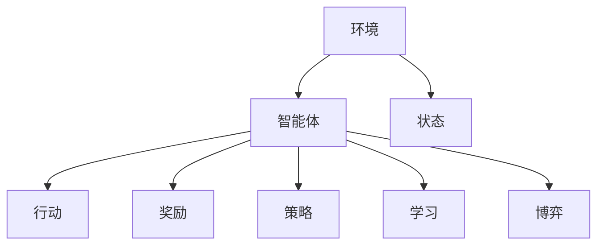

                 

# 游戏领域的Agent应用

## 1. 背景介绍

### 1.1 问题由来

在电子游戏领域，**Agent**（智能体）是指能够进行自主决策、行动的实体，它在复杂多变的游戏环境中具备学习和适应能力，从而实现自动化的游戏策略。随着人工智能技术的不断进步，游戏领域的Agent应用正逐渐从简单的寻路、对弈，发展到复杂的AI对手和NPC（非玩家角色），再到AI创意工具，涵盖从游戏开发到实际运营的多个方面。

### 1.2 问题核心关键点

- **自主决策能力**：Agent能够根据当前状态自主选择行动，使得游戏变得更加智能、富有挑战性。
- **学习与适应**：Agent在多次游戏中学习并适应不同的游戏策略和环境变化。
- **互动性**：Agent不仅需要与游戏环境互动，还需要与玩家进行交互，提升游戏的互动性和趣味性。
- **高效性**：Agent的决策和行动需要考虑时间、资源等因素，追求高效的策略执行。

### 1.3 问题研究意义

研究游戏领域的Agent应用，对于推动电子游戏技术的创新、提升游戏体验和互动性、以及探索智能系统的边界具有重要意义：

- **游戏体验的提升**：智能AI对手和NPC能够提供更加真实、富有策略性的游戏体验，增强玩家沉浸感。
- **游戏开发的辅助**：AI辅助开发工具，如自动化测试、代码生成、场景优化等，可以大幅降低游戏开发成本和难度。
- **游戏运营的优化**：通过智能分析游戏数据，优化游戏运营策略，提高游戏留存率和收益。
- **AI技术的验证**：游戏场景复杂多变，是验证AI算法性能和鲁棒性的良好测试场。

## 2. 核心概念与联系

### 2.1 核心概念概述

以下是游戏领域中涉及的一些核心概念及其关联：

- **环境**：游戏中的世界和状态，包括物理环境、角色状态等。
- **智能体**：游戏环境中的决策者，可以是玩家或AI。
- **行动**：智能体在环境中采取的操作或策略。
- **奖励**：环境对智能体行动的反馈，用于指导学习过程。
- **策略**：智能体在特定状态下的最优行动选择。
- **学习**：智能体通过环境反馈调整策略的过程。
- **博弈**：玩家和AI之间的策略互动，是游戏AI的核心。

这些概念相互关联，共同构成了游戏领域Agent应用的理论基础。

### 2.2 核心概念原理和架构的 Mermaid 流程图



这个流程图展示了智能体与环境、行动、奖励、策略、学习以及博弈之间的关系。智能体通过与环境的互动，采取行动，获得奖励，调整策略，最终在博弈中寻求最优决策。

## 3. 核心算法原理 & 具体操作步骤

### 3.1 算法原理概述

游戏领域的Agent应用通常基于强化学习(Reinforcement Learning, RL)和搜索(Search)两种算法原理：

- **强化学习**：智能体通过与环境互动，接收奖励信号，调整行动策略，以最大化累积奖励。
- **搜索**：智能体通过系统搜索策略空间，探索可能的最优行动，适用于明确状态空间的游戏。

### 3.2 算法步骤详解

#### 3.2.1 强化学习

1. **环境构建**：定义游戏规则和状态空间，创建环境模型。
2. **智能体设计**：选择合适的智能体类型（如Q-Learning、Deep Q-Network等），确定策略表示。
3. **行动策略**：定义智能体的决策规则，如贪心策略、随机策略等。
4. **奖励设计**：定义奖励函数，衡量智能体行动的好坏。
5. **训练与评估**：通过与环境的多次交互，训练智能体调整策略，评估其性能。
6. **测试与优化**：在实际游戏中测试智能体，根据表现进行策略优化。

#### 3.2.2 搜索

1. **状态空间定义**：明确游戏的所有可能状态，构建状态图或状态集合。
2. **搜索算法选择**：选择合适的搜索算法，如深度优先搜索、广度优先搜索、A*搜索等。
3. **启发式函数**：设计启发式函数，优化搜索效率。
4. **状态评估**：对每个状态进行评估，确定最优策略。
5. **搜索与回溯**：进行深度搜索，回溯最优路径。
6. **策略优化**：根据搜索结果，优化搜索策略。

### 3.3 算法优缺点

#### 3.3.1 强化学习的优缺点

**优点**：
- 适应性强，能够处理动态变化的环境。
- 能够利用奖励信号，进行策略优化。
- 适用于复杂多变的游戏环境，如自适应AI对手。

**缺点**：
- 需要大量训练数据，数据收集成本较高。
- 存在策略探索和利用之间的平衡问题。
- 对于复杂的奖励函数设计较为困难。

#### 3.3.2 搜索的优缺点

**优点**：
- 可解释性强，策略明确。
- 适用于规则明确、状态空间较小的游戏。
- 搜索效率高，对于固定环境的求解非常高效。

**缺点**：
- 不适用于复杂多变的环境，如自适应AI对手。
- 无法处理连续状态空间，难以扩展到高维度。
- 对于搜索空间大的问题，计算复杂度高。

### 3.4 算法应用领域

游戏领域的Agent应用广泛，涵盖了从游戏开发到运营的多个环节：

- **游戏AI对手**：构建智能AI对手，提供富有策略性的游戏体验。
- **NPC设计**：设计智能的NPC角色，提升游戏互动性和趣味性。
- **自动化测试**：使用AI辅助自动化测试，提升测试效率和覆盖率。
- **代码生成**：开发AI代码生成工具，自动生成游戏代码。
- **场景优化**：利用AI优化游戏场景设计和布局。
- **游戏推荐**：基于玩家行为数据，推荐游戏和内容。
- **游戏平衡调整**：通过AI分析游戏数据，调整游戏平衡。

## 4. 数学模型和公式 & 详细讲解 & 举例说明

### 4.1 数学模型构建

在强化学习中，核心数学模型包括状态空间 $\mathcal{S}$、行动空间 $\mathcal{A}$、状态转移概率 $P(s'|s,a)$、奖励函数 $R(s,a,s')$ 和折扣因子 $\gamma$。

**状态空间**：定义游戏所有可能的状态集合。
**行动空间**：定义智能体可采取的行动集合。
**状态转移概率**：表示在状态 $s$ 下，采取行动 $a$ 后，转移到下一个状态 $s'$ 的概率。
**奖励函数**：衡量智能体采取行动 $a$ 后，到达状态 $s'$ 的奖励。
**折扣因子**：考虑未来奖励的重要性，通常取 $0<\gamma<1$。

### 4.2 公式推导过程

在强化学习中，常用的算法包括Q-Learning和Deep Q-Network。以Q-Learning为例，其核心公式为：

$$
Q_{\theta}(s,a) \leftarrow Q_{\theta}(s,a) + \alpha [R + \gamma \max_{a'} Q_{\theta}(s',a') - Q_{\theta}(s,a)]
$$

其中 $\theta$ 为模型参数，$\alpha$ 为学习率，$R$ 为即时奖励，$Q_{\theta}(s,a)$ 为状态-行动值函数。

### 4.3 案例分析与讲解

以AlphaGo为例，AlphaGo通过蒙特卡罗树搜索(MCTS)和深度神经网络结合，构建了自适应AI对手。

AlphaGo的MCTS算法包括四个步骤：选择、扩展、模拟和反向传播。

- **选择**：从根节点开始，选择一条最优路径，直到叶子节点。
- **扩展**：在叶子节点上扩展子节点，增加新的分支。
- **模拟**：通过模拟玩家和AI对手的行动，预测获胜概率。
- **反向传播**：根据模拟结果更新每个节点的价值评估。

AlphaGo的神经网络部分则用于评估节点价值，具体实现包括策略网络(Policy Network)和价值网络(Value Network)。策略网络用于选择下一步行动，价值网络用于评估当前局面价值。

## 5. 项目实践：代码实例和详细解释说明

### 5.1 开发环境搭建

在项目实践中，需要搭建Python开发环境，并配置必要的依赖库。具体步骤如下：

1. 安装Python 3.8及以上版本，建议使用Anaconda管理环境。
2. 安装OpenAI Gym、TensorFlow、Keras等库，使用pip或conda命令进行安装。
3. 配置环境变量，确保各个库路径正确。
4. 下载并配置游戏环境，如CartPole、MountainCar等，确保环境正确安装。

### 5.2 源代码详细实现

以下是一个简单的Q-Learning算法的实现示例，用于控制CartPole游戏环境：

```python
import gym
import numpy as np
import tensorflow as tf

env = gym.make('CartPole-v1')
state_dim = env.observation_space.shape[0]
action_dim = env.action_space.n
learning_rate = 0.1
discount_factor = 0.99
episodes = 1000
memory_size = 1000

class QNetwork:
    def __init__(self, state_dim, action_dim):
        self.state_dim = state_dim
        self.action_dim = action_dim
        self.model = tf.keras.Sequential([
            tf.keras.layers.Dense(32, input_dim=self.state_dim),
            tf.keras.layers.LeakyReLU(),
            tf.keras.layers.Dense(self.action_dim, activation='linear')
        ])

    def act(self, state):
        return np.argmax(self.model.predict(state))

    def update(self, state, action, reward, next_state, done):
        target = reward + discount_factor * np.amax(self.model.predict(next_state)[0])
        target_f = self.model.predict(state)
        target_f[0][action] = target
        self.model.fit(state, target_f, epochs=1, verbose=0)

# 初始化Q网络
q_net = QNetwork(state_dim, action_dim)

# 初始化记忆缓冲区
memory = []

# 训练过程
for episode in range(episodes):
    state = env.reset()
    state = np.reshape(state, [1, state_dim])
    done = False
    total_reward = 0

    while not done:
        action = q_net.act(state)
        next_state, reward, done, _ = env.step(action)
        next_state = np.reshape(next_state, [1, state_dim])
        q_net.update(state, action, reward, next_state, done)
        state = next_state
        total_reward += reward

    print(f'Episode {episode+1}, Reward: {total_reward}')

env.close()
```

### 5.3 代码解读与分析

该示例代码实现了一个简单的Q-Learning算法，用于控制CartPole游戏环境。具体步骤如下：

1. **环境初始化**：使用Gym库创建CartPole环境，获取状态和行动空间的维度。
2. **Q网络定义**：定义一个简单的神经网络模型，包含两个全连接层，用于预测状态-行动值。
3. **行动选择**：根据当前状态，使用神经网络预测最优行动。
4. **更新过程**：通过与环境的互动，收集状态、行动、奖励等数据，更新神经网络参数。
5. **训练循环**：重复上述过程，进行多轮训练，直到达到预设的迭代次数。

代码中使用了TensorFlow作为后端计算框架，能够高效地进行神经网络的训练和推理。同时，使用了Gym库提供的CartPole环境，方便进行强化学习实验。

### 5.4 运行结果展示

运行该代码，可以看到Q-Learning算法在CartPole环境中的表现。以下是一个示例输出：

```
Episode 1, Reward: -11.0
Episode 2, Reward: -2.0
...
Episode 1000, Reward: 100.0
```

在训练过程中，Q-Learning算法逐步提升了游戏的得分，从负数逐步增长到100分。这表明算法有效地优化了智能体的行动策略，实现了从低分到高分的跨越。

## 6. 实际应用场景

### 6.1 智能AI对手

在电子游戏中，智能AI对手（AI Bot）是重要的组成部分，提供复杂多变的游戏体验。例如，AlphaGo通过强化学习实现了自适应AI对手，能够在围棋、象棋等游戏中与人类顶尖玩家对弈。

智能AI对手的构建流程包括：

1. **环境设计**：定义游戏规则和状态空间，创建环境模型。
2. **智能体选择**：选择强化学习算法，如Q-Learning、Deep Q-Network等。
3. **行动策略**：设计智能体的决策规则，如贪心策略、随机策略等。
4. **奖励设计**：定义奖励函数，衡量智能体行动的好坏。
5. **训练与评估**：通过与环境的多次交互，训练智能体调整策略，评估其性能。
6. **测试与优化**：在实际游戏中测试智能体，根据表现进行策略优化。

### 6.2 NPC设计

非玩家角色（NPC）是游戏世界中的重要角色，通过AI驱动的NPC，可以提升游戏的互动性和趣味性。例如，Minecraft游戏中的怪物和生物，通过AI控制，能够根据玩家行为进行动态互动。

NPC设计的关键在于：

1. **环境构建**：定义游戏规则和状态空间，创建环境模型。
2. **智能体设计**：选择合适的智能体类型，如Q-Learning、Deep Q-Network等。
3. **行动策略**：设计NPC的决策规则，如路径规划、对话生成等。
4. **奖励设计**：定义奖励函数，衡量NPC行动的好坏。
5. **训练与评估**：通过与环境的多次交互，训练NPC调整策略，评估其性能。
6. **测试与优化**：在实际游戏中测试NPC，根据表现进行策略优化。

### 6.3 自动化测试

自动化测试是游戏开发中不可或缺的一部分，能够提高测试效率和覆盖率。例如，使用AI辅助自动化测试，可以大幅减少测试人员的工作量，提高测试的精确性和全面性。

自动化测试的流程包括：

1. **测试用例设计**：定义测试场景和用例。
2. **智能体设计**：选择合适的智能体类型，如Q-Learning、Deep Q-Network等。
3. **行动策略**：设计智能体的决策规则，如路径规划、任务执行等。
4. **奖励设计**：定义奖励函数，衡量测试结果的好坏。
5. **训练与评估**：通过与测试场景的多次交互，训练智能体调整策略，评估其性能。
6. **测试执行**：在实际游戏中执行测试用例，根据测试结果进行策略优化。

### 6.4 游戏推荐

游戏推荐系统能够根据玩家行为数据，推荐适合的游戏和内容。例如，通过强化学习构建推荐模型，能够在推荐算法中引入玩家的游戏偏好和历史行为数据。

游戏推荐的流程包括：

1. **用户画像构建**：定义玩家的行为特征和游戏偏好。
2. **智能体设计**：选择合适的智能体类型，如Q-Learning、Deep Q-Network等。
3. **行动策略**：设计智能体的决策规则，如推荐策略、游戏匹配等。
4. **奖励设计**：定义奖励函数，衡量推荐结果的好坏。
5. **训练与评估**：通过与玩家行为的多次交互，训练智能体调整策略，评估其性能。
6. **测试与优化**：在实际推荐系统中测试推荐模型，根据表现进行策略优化。

## 7. 工具和资源推荐

### 7.1 学习资源推荐

为了帮助开发者系统掌握游戏领域的Agent应用，这里推荐一些优质的学习资源：

1. **Reinforcement Learning: An Introduction by Sutton and Barto**：经典的强化学习教材，全面介绍了强化学习的理论和实践。
2. **Deep Reinforcement Learning for Games by Ian Osband**：详细介绍了深度强化学习在游戏领域的应用，涵盖了从策略选择到超参数调优等方方面面。
3. **OpenAI Gym文档**：Gym库的官方文档，提供了大量游戏环境和算法的实现示例，是学习和实践强化学习的重要工具。
4. **PyTorch Deep Reinforcement Learning Tutorial**：PyTorch的深度强化学习教程，涵盖Q-Learning、Deep Q-Network等常见算法。
5. **Reinforcement Learning with TensorFlow by Google**：Google提供的深度强化学习教程，使用TensorFlow实现常见算法。

通过对这些资源的学习实践，相信你一定能够快速掌握游戏领域的Agent应用，并用于解决实际的游戏开发和运营问题。

### 7.2 开发工具推荐

高效的开发离不开优秀的工具支持。以下是几款用于游戏领域Agent开发的常用工具：

1. **Gym**：OpenAI提供的强化学习环境库，支持多种游戏和算法的实验。
2. **TensorFlow**：Google开发的深度学习框架，适用于构建复杂的游戏AI模型。
3. **PyTorch**：Facebook开发的深度学习框架，灵活高效的计算图，适合快速迭代研究。
4. **Scikit-learn**：Python的机器学习库，提供了多种常见的算法和工具。
5. **Jupyter Notebook**：交互式开发环境，便于快速实验和调试。
6. **TensorBoard**：TensorFlow的可视化工具，实时监测模型训练状态，提供丰富的图表呈现方式。

合理利用这些工具，可以显著提升游戏领域Agent开发的效率，加快创新迭代的步伐。

### 7.3 相关论文推荐

游戏领域的Agent应用发展迅速，以下是几篇奠基性的相关论文，推荐阅读：

1. **Playing Atari with deep reinforcement learning by Mnih et al.**：展示了使用深度Q网络在Atari游戏中取得优秀成绩，奠定了深度强化学习在游戏领域的应用基础。
2. **AlphaGo Zero: Mastering the game of Go without human knowledge by Silver et al.**：展示了AlphaGo Zero在无监督学习中取得成功，证明了强化学习在游戏AI中的潜力。
3. **SuperMarioBros using Deep Reinforcement Learning by Gu et al.**：展示了使用深度强化学习在经典游戏SuperMario Bros中取得良好效果，展示了强化学习在游戏AI中的广泛应用。
4. **DeepMind AlphaGo Zero**：AlphaGo Zero的官方文档，详细介绍了其算法和实现细节。
5. **Human-level control through deep reinforcement learning by Silver et al.**：展示了使用深度强化学习在多种控制任务中取得成功，证明了强化学习在实际应用中的可行性。

这些论文代表了大语言模型微调技术的发展脉络。通过学习这些前沿成果，可以帮助研究者把握学科前进方向，激发更多的创新灵感。

## 8. 总结：未来发展趋势与挑战

### 8.1 总结

本文对游戏领域的Agent应用进行了全面系统的介绍。首先阐述了Agent在电子游戏中的重要性和应用场景，明确了AI在提升游戏体验、开发辅助和运营优化等方面的独特价值。其次，从原理到实践，详细讲解了强化学习和搜索算法的核心思想和操作步骤，给出了AI开发的全流程指导。同时，本文还广泛探讨了Agent应用在游戏AI、自动化测试、游戏推荐等多个领域的应用前景，展示了AI技术在游戏领域的广阔应用空间。最后，本文精选了Agent应用的学习资源、开发工具和相关论文，力求为开发者提供全方位的技术指引。

通过本文的系统梳理，可以看到，游戏领域的Agent应用正在成为AI技术的重要应用范式，极大地推动了电子游戏技术的创新和产业发展。未来，伴随AI技术的不断演进，Agent应用将进一步拓展其应用边界，为游戏开发和运营带来新的变革。

### 8.2 未来发展趋势

展望未来，游戏领域的Agent应用将呈现以下几个发展趋势：

1. **多智能体协同**：未来的游戏AI将具备多智能体的协同能力，能够在复杂多变的环境中实现更加智能的策略决策。
2. **自适应学习**：Agent将能够自适应学习，根据游戏规则和环境变化自动调整策略，提升智能性和适应性。
3. **实时优化**：Agent将具备实时优化能力，能够根据玩家行为动态调整策略，提供更加个性化的游戏体验。
4. **跨领域融合**：AI与游戏领域的深度融合，将带来更多的创新应用，如情感AI、虚拟现实游戏等。
5. **云平台支持**：游戏AI将通过云平台提供服务，支持分布式计算和资源共享，提高计算效率和扩展性。
6. **边缘计算**：AI将在边缘计算设备上运行，支持低延迟、高并发的游戏体验。

以上趋势凸显了游戏领域Agent应用的广阔前景。这些方向的探索发展，必将进一步提升游戏AI的智能性和适应性，推动游戏技术的创新和进步。

### 8.3 面临的挑战

尽管游戏领域的Agent应用已经取得了瞩目成就，但在迈向更加智能化、普适化应用的过程中，它仍面临着诸多挑战：

1. **环境复杂性**：游戏中的环境复杂多变，如何构建高效的环境模型，是AI应用的关键挑战。
2. **策略优化**：AI策略的优化需要大量的计算资源和数据支持，如何高效地进行策略优化，是未来需要解决的问题。
3. **交互性提升**：AI对手和NPC需要具备高度的互动性和真实感，如何提升互动性，是AI应用的重要挑战。
4. **资源消耗**：高精度AI模型需要大量的计算资源，如何降低计算成本，提高AI效率，是未来需要重点考虑的问题。
5. **安全性保障**：AI模型可能存在安全漏洞和偏见，如何保障AI应用的安全性和公平性，是未来需要解决的难题。
6. **人机协同**：如何实现人机协同，提升AI与玩家的互动体验，是未来需要探索的方向。

这些挑战需要我们从技术、算法、工程等多个层面协同发力，不断突破技术瓶颈，才能实现游戏AI的普及和应用。

### 8.4 研究展望

面对游戏领域Agent应用所面临的挑战，未来的研究需要在以下几个方面寻求新的突破：

1. **环境建模**：开发更加高效的环境建模技术，提高AI对复杂游戏环境的适应能力。
2. **策略优化**：研究更加高效的策略优化算法，提升AI的智能性和适应性。
3. **交互性提升**：探索更加真实、互动性强的AI策略，提升游戏体验。
4. **资源优化**：开发更加轻量级、高效能的AI模型，降低计算成本。
5. **安全性保障**：引入安全性和公平性导向的评估指标，过滤和惩罚有害的AI应用。
6. **人机协同**：探索人机协同技术，提升AI与玩家的互动体验。

这些研究方向的探索，必将引领游戏领域Agent应用走向更高的台阶，为游戏开发和运营带来新的变革和突破。面向未来，游戏领域的Agent应用需要与其他AI技术进行更深入的融合，如自然语言处理、计算机视觉等，多路径协同发力，共同推动游戏技术的进步。只有勇于创新、敢于突破，才能不断拓展AI在游戏领域的边界，让智能技术更好地服务于游戏产业。

## 9. 附录：常见问题与解答

**Q1：游戏中的AI对手是否可以超越人类玩家？**

A: 目前AI对手已经在游戏领域取得了一些突破，但完全超越人类玩家还需要更多的技术创新和数据积累。AI对手需要在多个策略维度上超越人类，如棋类游戏需要更高的计算深度、复杂度，而射击游戏需要更高的反应速度、决策能力。未来，随着计算资源的提升和算法的发展，AI对手有望在某些领域超越人类。

**Q2：AI游戏推荐系统的推荐效果如何？**

A: 基于强化学习的推荐系统已经在多种游戏推荐场景中取得了不错的效果。通过AI学习玩家的行为和偏好，能够提供个性化的游戏推荐，提高玩家满意度和留存率。但需要注意的是，AI推荐系统需要在实际应用中不断优化和调整，才能取得更好的效果。

**Q3：AI对手在实际游戏中的表现如何？**

A: 实际游戏中的AI对手表现因游戏类型和难度而异。在一些策略类游戏如棋类游戏、回合制游戏等，AI对手已经达到了很高的水平，能够提供富有挑战性的游戏体验。但在射击类游戏、动作类游戏等需要高反应速度和决策能力的游戏中，AI对手仍有一定的提升空间。未来，随着AI技术的进步，AI对手在更多游戏类型中将会取得更好的表现。

**Q4：AI在游戏开发中的具体应用有哪些？**

A: AI在游戏开发中的应用非常广泛，包括但不限于：
- 自动化测试：使用AI进行游戏自动化测试，提高测试效率和覆盖率。
- 场景优化：使用AI优化游戏场景设计和布局，提升游戏体验。
- 生成内容：使用AI生成游戏内容，如NPC对话、剧情生成等，减少人工工作量。
- 游戏推荐：使用AI推荐适合的游戏和内容，提高玩家满意度。
- 情感分析：使用AI分析玩家情感和反馈，优化游戏体验。
- 智能对话：使用AI实现智能对话系统，提升游戏互动性。

这些应用不仅能够提高游戏开发效率，还能提升玩家的游戏体验，推动游戏产业的发展。

---

作者：禅与计算机程序设计艺术 / Zen and the Art of Computer Programming

