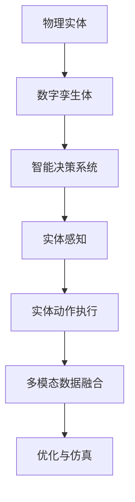

                 

# 物理实体自动化的前景与发展

> 关键词：自动驾驶, 智能制造, 机器人自动化, 工业4.0, 物理实体与数字孪生, 仿真与优化

## 1. 背景介绍

### 1.1 问题由来
在当今数字化、网络化、智能化的时代背景下，各类物理实体（如汽车、机器、设备等）正逐步被数字化、智能化改造，成为能够自主决策、自动执行的智能实体。这种实体自动化技术不仅提升生产效率、降低成本，还大幅改善了工作环境和用户体验。

然而，实体自动化技术的应用和推广，也面临诸多挑战：
- **数据采集问题**：物理实体工作环境中，数据采集往往受限于传感器精度、覆盖范围等因素，难以获取完整全面的数据。
- **模型复杂性**：实体自动化系统涉及复杂的多模态数据（如传感器数据、视频图像等）融合，模型训练复杂度较高。
- **实时性要求高**：实体自动化的关键在于实时响应，如何高效处理大量数据，同时保证决策质量，是一个重要问题。
- **安全与伦理问题**：智能实体需要在高风险场景下运行，如交通系统、自动化医疗设备等，如何确保其决策安全、伦理合规，是研究的难点。

## 2. 核心概念与联系

### 2.1 核心概念概述

实体自动化的核心在于将物理实体与数字虚拟实体相结合，构建出能够自主决策和执行的智能实体系统。以下介绍几个关键概念：

- **物理实体与数字孪生**：实体自动化的基础是物理实体与数字孪生体的结合。数字孪生体是通过数字化手段对物理实体进行全面建模，包含其状态、行为、环境等多维信息。

- **智能决策系统**：在数字孪生体的基础上，利用人工智能技术（如机器学习、深度学习等）进行实时数据分析和决策，指导实体自主执行。

- **实体感知与动作执行**：实体自动化系统通过各种传感器（如视觉传感器、激光雷达、温度传感器等）感知环境信息，并由执行器（如电机、机械臂等）执行动作。

- **多模态数据融合**：实体自动化涉及多种数据类型（如时间序列数据、图像数据、文本数据等），如何有效融合多模态数据，提升决策质量，是研究的重点。

- **优化与仿真**：实体自动化的最终目标是实现最优的决策和执行效果。因此，优化算法和仿真技术在实体自动化系统设计中至关重要。

这些概念之间的关系可以用以下Mermaid流程图来展示：



## 3. 核心算法原理 & 具体操作步骤

### 3.1 算法原理概述

实体自动化的核心算法包括智能决策、多模态数据融合、优化与仿真等。以下详细阐述这些核心算法原理：

#### 3.1.1 智能决策算法

智能决策算法通常基于机器学习、深度学习模型。模型通过对大量历史数据进行训练，学习出实体状态与动作之间的映射关系，实现自主决策。常见的决策模型包括：

- **分类与回归模型**：用于预测实体状态和执行动作，如决策树、随机森林、支持向量机等。
- **强化学习模型**：通过与环境交互，优化实体决策策略，如Q-learning、策略梯度方法等。

#### 3.1.2 多模态数据融合算法

多模态数据融合算法旨在将不同类型的数据（如传感器数据、图像数据等）进行有效整合，提升决策准确性。常见的融合算法包括：

- **特征对齐**：通过特征映射将不同类型的数据对齐，提高数据的可比性和可融合性。
- **加权融合**：根据不同数据的重要性和可靠性，进行加权融合，提升融合结果的质量。
- **深度学习融合**：利用神经网络对多模态数据进行联合学习，提高融合效果。

#### 3.1.3 优化与仿真算法

优化与仿真算法用于设计最优的实体自动化系统方案，并进行效果评估。常见的优化算法包括：

- **优化算法**：如遗传算法、粒子群算法等，用于搜索最优的决策策略。
- **仿真技术**：利用计算机模拟实体自动化系统的运行过程，评估方案效果。

### 3.2 算法步骤详解

#### 3.2.1 智能决策算法步骤

1. **数据收集**：通过传感器收集实体状态和环境数据。
2. **数据预处理**：对收集到的数据进行清洗、归一化等预处理，减少噪声干扰。
3. **模型训练**：利用历史数据对决策模型进行训练，学习决策策略。
4. **实时决策**：在实体运行过程中，利用训练好的模型进行实时决策。

#### 3.2.2 多模态数据融合算法步骤

1. **数据采集**：通过不同类型传感器采集多模态数据。
2. **数据对齐**：将不同类型的数据通过特征映射进行对齐。
3. **数据融合**：将对齐后的数据进行加权融合或深度学习融合，提升融合质量。
4. **融合结果应用**：将融合后的数据用于智能决策模型，提升决策效果。

#### 3.2.3 优化与仿真算法步骤

1. **方案设计**：根据任务需求设计实体自动化系统方案。
2. **仿真验证**：利用仿真技术对设计方案进行验证，评估方案效果。
3. **优化迭代**：根据仿真结果，利用优化算法迭代优化方案，直到达到最优效果。
4. **方案部署**：将优化后的方案部署到实体自动化系统，进行实际运行。

### 3.3 算法优缺点

#### 3.3.1 智能决策算法优缺点

**优点**：
- **自主决策**：智能决策算法能够根据实时数据进行自主决策，提升实体自动化系统的灵活性和响应速度。
- **泛化能力强**：深度学习等模型具有较强的泛化能力，能够在不同场景下进行有效决策。

**缺点**：
- **训练成本高**：模型训练需要大量标注数据，训练成本较高。
- **决策透明性不足**：部分算法（如深度学习）的决策过程较为复杂，难以进行解释和调试。

#### 3.3.2 多模态数据融合算法优缺点

**优点**：
- **融合效果好**：通过多模态数据融合，能够充分利用不同类型数据的优势，提升决策质量。
- **实时性强**：多模态数据融合算法能够实时处理多模态数据，提升决策实时性。

**缺点**：
- **算法复杂度高**：多模态数据融合算法涉及多个步骤，算法复杂度较高。
- **数据质量要求高**：融合效果受数据质量影响较大，需要高质量传感器数据。

#### 3.3.3 优化与仿真算法优缺点

**优点**：
- **方案优化效果好**：通过仿真和优化算法，能够设计出最优的实体自动化系统方案。
- **效果评估准确**：仿真技术能够高精度模拟实体自动化系统的运行过程，评估方案效果。

**缺点**：
- **仿真复杂度高**：仿真技术需要高精度建模和大量计算资源，仿真复杂度较高。
- **方案验证时间长**：方案验证需要大量时间，验证周期较长。

### 3.4 算法应用领域

#### 3.4.1 自动驾驶

自动驾驶系统通过传感器（如摄像头、雷达、激光雷达等）感知周围环境，并由智能决策算法进行路径规划和动作控制。多模态数据融合和仿真技术在自动驾驶中发挥重要作用，提升系统的安全性和稳定性。

#### 3.4.2 智能制造

智能制造系统通过传感器监测生产过程，并由智能决策算法进行设备控制和生产调度。多模态数据融合和优化与仿真技术帮助制造系统实现最优的生产效率和质量控制。

#### 3.4.3 机器人自动化

机器人自动化系统通过视觉传感器、力传感器等进行环境感知，并由智能决策算法进行路径规划和动作执行。多模态数据融合和仿真技术提升机器人的自主性和执行精度。

## 4. 数学模型和公式 & 详细讲解 & 举例说明

### 4.1 数学模型构建

实体自动化的数学模型通常涉及多模态数据融合和智能决策两个方面。以下给出典型场景的数学模型构建。

#### 4.1.1 智能决策模型构建

假设实体状态为 $x$，决策动作为 $u$，决策目标为 $y$。智能决策模型通过历史数据 $(x_i, u_i, y_i)$ 学习状态与动作之间的映射关系，即：

$$
y = f(x, u)
$$

其中，$f$ 为智能决策模型。

#### 4.1.2 多模态数据融合模型构建

假设传感器数据为 $s_1, s_2, \ldots, s_n$，融合后数据为 $z$。多模态数据融合模型通过对齐、融合等步骤，将不同传感器数据融合为 $z$：

$$
z = g(s_1, s_2, \ldots, s_n)
$$

其中，$g$ 为多模态数据融合模型。

### 4.2 公式推导过程

#### 4.2.1 智能决策公式推导

智能决策模型通常采用回归模型，如线性回归、支持向量回归等。以线性回归为例，其模型形式为：

$$
y = \theta_0 + \sum_{i=1}^n \theta_i x_i
$$

其中，$\theta = (\theta_0, \theta_1, \ldots, \theta_n)$ 为模型参数。

对于数据 $(x_i, u_i, y_i)$，采用最小二乘法求解模型参数：

$$
\min_{\theta} \sum_{i=1}^n (y_i - f(x_i, u_i))^2
$$

求解该优化问题，得到模型参数 $\theta$。

#### 4.2.2 多模态数据融合公式推导

多模态数据融合模型通常采用加权融合方法，其形式为：

$$
z = \sum_{i=1}^n \alpha_i s_i
$$

其中，$\alpha_i$ 为融合权重，$s_i$ 为传感器数据。

融合权重 $\alpha_i$ 的计算通常采用方差加权方法：

$$
\alpha_i = \frac{\sigma_i^{-2}}{\sum_{j=1}^n \sigma_j^{-2}}
$$

其中，$\sigma_i$ 为传感器数据的方差。

### 4.3 案例分析与讲解

#### 4.3.1 自动驾驶案例

某自动驾驶系统通过多个传感器采集数据，包括摄像头、雷达、激光雷达等。传感器数据通过多模态数据融合算法进行融合，得到融合后的数据 $z$。融合后的数据 $z$ 输入到智能决策模型 $f$，输出决策动作 $u$，控制车辆行驶。

假设摄像头数据 $s_1$ 的方差为 $2$，雷达数据 $s_2$ 的方差为 $4$，激光雷达数据 $s_3$ 的方差为 $3$。融合权重 $\alpha_i$ 计算如下：

$$
\alpha_1 = \frac{2^{-2}}{2^{-2}+4^{-2}+3^{-2}} = \frac{1}{14}
$$
$$
\alpha_2 = \frac{4^{-2}}{2^{-2}+4^{-2}+3^{-2}} = \frac{2}{7}
$$
$$
\alpha_3 = \frac{3^{-2}}{2^{-2}+4^{-2}+3^{-2}} = \frac{5}{14}
$$

最终融合结果 $z$ 为：

$$
z = \alpha_1 s_1 + \alpha_2 s_2 + \alpha_3 s_3
$$

融合结果 $z$ 用于智能决策模型 $f$，输出决策动作 $u$。

## 5. 项目实践：代码实例和详细解释说明

### 5.1 开发环境搭建

实体自动化的项目开发通常涉及传感器数据采集、数据融合、智能决策等多个环节。以下介绍常用的开发环境搭建流程。

#### 5.1.1 传感器数据采集环境

1. **硬件搭建**：选择适合的传感器（如摄像头、雷达、激光雷达等），并连接至计算机或其他处理设备。
2. **驱动程序安装**：安装传感器驱动，确保数据能够正常采集。
3. **数据格式定义**：定义传感器数据的格式和编码方式，便于数据处理和存储。

#### 5.1.2 数据融合环境

1. **数据预处理**：对采集到的传感器数据进行清洗、归一化等预处理，减少噪声干扰。
2. **多模态数据融合算法实现**：选择合适的融合算法，实现多模态数据的有效融合。

#### 5.1.3 智能决策环境

1. **模型训练**：利用历史数据训练智能决策模型，学习决策策略。
2. **实时决策**：在实体运行过程中，利用训练好的模型进行实时决策。

### 5.2 源代码详细实现

#### 5.2.1 数据采集与预处理

```python
import sensor

# 传感器数据采集
s1 = sensor.sensor1_data()
s2 = sensor.sensor2_data()
s3 = sensor.sensor3_data()

# 数据预处理
s1 = preprocess(s1)
s2 = preprocess(s2)
s3 = preprocess(s3)
```

#### 5.2.2 多模态数据融合

```python
import fusion

# 多模态数据融合
z = fusion.fusion(s1, s2, s3)
```

#### 5.2.3 智能决策

```python
import decision

# 智能决策模型训练
model = decision.train_model()

# 实时决策
u = decision.make_decision(z, model)
```

### 5.3 代码解读与分析

#### 5.3.1 数据采集与预处理

数据采集与预处理是实体自动化系统的基础。传感器的选择、驱动安装、数据格式定义都是关键环节。预处理步骤包括数据清洗、归一化等，以减少噪声干扰，提升数据质量。

#### 5.3.2 多模态数据融合

多模态数据融合算法通过对齐、融合等步骤，将不同类型的数据进行整合。融合算法的选择和实现需要根据具体应用场景进行优化。

#### 5.3.3 智能决策

智能决策模型的训练和应用是实体自动化的核心。模型训练需要大量历史数据，模型应用则涉及实时决策。决策模型的选择和优化需要根据具体应用场景进行优化。

### 5.4 运行结果展示

```python
# 传感器数据采集
s1 = sensor.sensor1_data()
s2 = sensor.sensor2_data()
s3 = sensor.sensor3_data()

# 数据预处理
s1 = preprocess(s1)
s2 = preprocess(s2)
s3 = preprocess(s3)

# 多模态数据融合
z = fusion.fusion(s1, s2, s3)

# 智能决策
u = decision.make_decision(z, model)
```

## 6. 实际应用场景

### 6.1 智能制造

智能制造系统通过传感器监测生产过程，并由智能决策算法进行设备控制和生产调度。多模态数据融合和仿真技术帮助制造系统实现最优的生产效率和质量控制。

#### 6.1.1 生产过程监测

通过温度传感器、压力传感器、振动传感器等监测生产设备的运行状态，通过多模态数据融合算法进行融合，得到融合后的数据 $z$。融合后的数据 $z$ 输入到智能决策模型 $f$，输出决策动作 $u$，控制生产设备的运行。

#### 6.1.2 生产调度优化

通过历史生产数据，利用优化算法优化生产调度方案，提升生产效率和质量控制。通过仿真技术验证优化方案效果，最终部署到实际生产环境中。

### 6.2 自动驾驶

自动驾驶系统通过传感器（如摄像头、雷达、激光雷达等）感知周围环境，并由智能决策算法进行路径规划和动作控制。多模态数据融合和仿真技术在自动驾驶中发挥重要作用，提升系统的安全性和稳定性。

#### 6.2.1 环境感知

通过摄像头、雷达、激光雷达等传感器采集环境数据，通过多模态数据融合算法进行融合，得到融合后的数据 $z$。融合后的数据 $z$ 输入到智能决策模型 $f$，输出决策动作 $u$，控制车辆行驶。

#### 6.2.2 路径规划与动作控制

通过智能决策模型进行路径规划和动作控制。通过仿真技术验证路径规划和动作控制的方案效果，最终部署到实际驾驶环境中。

### 6.3 机器人自动化

机器人自动化系统通过视觉传感器、力传感器等进行环境感知，并由智能决策算法进行路径规划和动作执行。多模态数据融合和仿真技术提升机器人的自主性和执行精度。

#### 6.3.1 路径规划

通过视觉传感器和力传感器采集环境数据，通过多模态数据融合算法进行融合，得到融合后的数据 $z$。融合后的数据 $z$ 输入到智能决策模型 $f$，输出决策动作 $u$，控制机器人路径规划。

#### 6.3.2 动作执行

通过智能决策模型进行动作执行。通过仿真技术验证路径规划和动作执行的方案效果，最终部署到实际机器人系统中。

## 7. 工具和资源推荐

### 7.1 学习资源推荐

#### 7.1.1 在线课程

1. **《实体自动化系统设计与实现》课程**：介绍实体自动化的基本概念、算法设计和实践案例。
2. **《智能决策系统设计与实现》课程**：讲解智能决策算法的理论基础和实践方法。
3. **《多模态数据融合与处理》课程**：讲解多模态数据融合算法的理论基础和实践方法。

#### 7.1.2 书籍推荐

1. **《实体自动化技术与应用》**：系统介绍实体自动化的基本概念、技术原理和应用案例。
2. **《智能决策系统设计与实现》**：介绍智能决策算法的理论基础和实践方法。
3. **《多模态数据融合与处理》**：讲解多模态数据融合算法的理论基础和实践方法。

### 7.2 开发工具推荐

#### 7.2.1 数据采集工具

1. **MySense**：提供多种传感器数据采集接口，支持摄像头、雷达、激光雷达等传感器数据采集。
2. **Xsens**：提供高精度传感器数据采集和处理功能，支持多种传感器数据采集。

#### 7.2.2 数据融合工具

1. **OpenCV**：提供多种图像处理和融合算法，支持摄像头数据融合。
2. **Kalman Filter**：提供多模态数据融合算法，支持传感器数据融合。

#### 7.2.3 智能决策工具

1. **TensorFlow**：支持深度学习模型的训练和推理，适用于智能决策算法实现。
2. **PyTorch**：支持深度学习模型的训练和推理，适用于智能决策算法实现。

### 7.3 相关论文推荐

#### 7.3.1 实体自动化

1. **《实体自动化系统的设计与实现》**：介绍实体自动化的基本概念、技术原理和应用案例。
2. **《基于多模态数据的实体自动化系统设计》**：讲解多模态数据融合算法在实体自动化中的应用。

#### 7.3.2 智能决策

1. **《智能决策系统设计与实现》**：介绍智能决策算法的理论基础和实践方法。
2. **《基于深度学习的智能决策系统设计》**：讲解深度学习模型在智能决策中的应用。

#### 7.3.3 多模态数据融合

1. **《多模态数据融合与处理》**：讲解多模态数据融合算法的理论基础和实践方法。
2. **《基于深度学习的多模态数据融合技术》**：讲解深度学习在多模态数据融合中的应用。

## 8. 总结：未来发展趋势与挑战

### 8.1 研究成果总结

实体自动化技术通过将物理实体与数字孪生体结合，利用人工智能技术进行智能决策和优化，在自动驾驶、智能制造、机器人自动化等领域展现出巨大的应用潜力。

### 8.2 未来发展趋势

#### 8.2.1 实体感知与动作执行

未来实体自动化技术将更加注重实体感知和动作执行的精细化控制。通过高精度传感器和多模态数据融合技术，提升实体对环境的感知能力。通过先进执行器（如机械臂、电动缸等），提升动作执行的精确性和稳定性。

#### 8.2.2 智能决策算法

未来智能决策算法将更加注重模型的可解释性和透明性。通过引入符号化先验知识，提升模型的决策可信度和解释能力。通过优化算法和仿真技术，提升决策模型的泛化能力和鲁棒性。

#### 8.2.3 多模态数据融合

未来多模态数据融合技术将更加注重数据的融合效果和实时性。通过优化融合算法和提高传感器精度，提升数据融合的质量和效率。通过分布式计算和边缘计算技术，提升数据融合的实时性。

#### 8.2.4 仿真与优化

未来仿真与优化技术将更加注重方案的实时验证和优化。通过实时仿真技术，快速验证实体自动化系统的方案效果。通过优化算法和强化学习技术，提升方案的优化效果和泛化能力。

### 8.3 面临的挑战

#### 8.3.1 数据采集与传感器精度

数据采集环节是实体自动化的基础，但传感器精度和覆盖范围往往是瓶颈。未来需要在传感器精度、数据采集方式、数据预处理等方面进行优化。

#### 8.3.2 模型训练与数据量

实体自动化的智能决策和优化算法需要大量历史数据进行训练。未来需要在数据采集、数据清洗、数据增强等方面进行优化，提高数据量。

#### 8.3.3 实时性与计算资源

实体自动化的实时性和计算资源消耗往往是矛盾的。未来需要在模型优化、算法加速、分布式计算等方面进行优化，平衡实时性和计算资源消耗。

#### 8.3.4 安全性与伦理问题

实体自动化系统需要在高风险场景下运行，安全性与伦理问题需要重点关注。未来需要在模型安全、数据隐私、伦理合规等方面进行优化，确保系统安全和可靠。

### 8.4 研究展望

未来实体自动化技术的研究将在以下几个方面进行探索：

#### 8.4.1 实体感知与动作执行

探索更加高效、高精度的传感器和执行器技术，提升实体自动化系统的感知能力和执行效果。

#### 8.4.2 智能决策算法

探索更加透明、可解释的智能决策算法，提升模型的可信度和可解释性。

#### 8.4.3 多模态数据融合

探索更加高效的融合算法，提升数据融合的质量和实时性。

#### 8.4.4 仿真与优化

探索更加高效的仿真与优化技术，提升方案的验证和优化效果。

## 9. 附录：常见问题与解答

**Q1: 实体自动化系统如何实现高效的实体感知？**

A: 实体自动化系统通过多种传感器（如摄像头、雷达、激光雷达等）进行数据采集。传感器数据需要进行预处理和融合，才能提高感知能力。常用的融合算法包括特征对齐、加权融合和深度学习融合等。通过优化传感器精度和数据采集方式，可以进一步提升实体感知效果。

**Q2: 智能决策算法如何选择？**

A: 智能决策算法的选择需要根据具体应用场景进行优化。对于分类、回归等任务，可以使用传统的机器学习算法，如决策树、随机森林等。对于复杂决策任务，可以使用深度学习算法，如神经网络、卷积神经网络等。需要根据任务需求和数据特点，选择合适的算法，并进行优化。

**Q3: 实体自动化系统如何优化仿真与验证？**

A: 实体自动化系统的仿真与优化通常需要高精度建模和大量计算资源。通过分布式计算和边缘计算技术，可以提高仿真的实时性和效率。利用仿真技术验证方案效果，并根据仿真结果进行优化迭代，提升方案效果。

**Q4: 实体自动化系统如何处理数据质量问题？**

A: 实体自动化系统对数据质量的要求较高。可以通过数据预处理、数据清洗、数据增强等技术，提升数据质量。同时，选择合适的数据融合算法，可以有效降低数据噪声干扰，提高融合效果。

**Q5: 实体自动化系统的安全性与伦理问题如何保障？**

A: 实体自动化系统需要在高风险场景下运行，安全性与伦理问题需要重点关注。可以通过模型安全、数据隐私、伦理合规等技术手段，保障系统的安全性和合规性。需要建立系统的监控和审计机制，确保系统行为符合伦理规范。

---

作者：禅与计算机程序设计艺术 / Zen and the Art of Computer Programming

