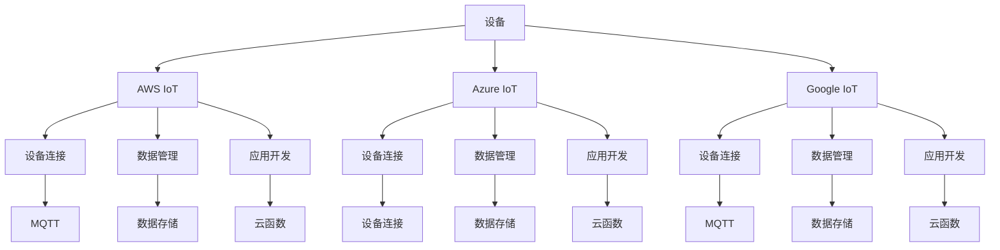

                 

# 物联网平台比较：AWS IoT、Azure IoT 和 Google IoT

在物联网(IoT)领域，各大云厂商纷纷推出了各自的IoT平台，如AWS IoT、Azure IoT和Google IoT等。这些平台提供了从设备连接管理到数据分析的各种功能，极大地简化了物联网系统的构建和维护。本文将对这些主流IoT平台进行全面比较，深入探讨它们的架构、功能和应用场景，帮助开发者选择最适合自己需求的IoT平台。

## 1. 背景介绍

随着物联网技术的快速发展，越来越多的设备接入互联网，产生了海量的数据。这些设备从传感器到家用电器，再到工业设备，带来了巨大的市场机会和挑战。一方面，物联网数据可以帮助企业做出更准确的决策，提升效率和竞争力；另一方面，如何高效、安全地管理这些设备，是摆在企业面前的重要问题。

在这一背景下，各大云厂商纷纷推出了自己的IoT平台，通过强大的云服务能力，帮助企业快速构建、管理和分析物联网数据。这些平台不仅提供了设备连接和数据传输的基础功能，还具备丰富的API接口和集成服务，帮助企业构建一站式物联网解决方案。

## 2. 核心概念与联系

### 2.1 核心概念概述

#### 2.1.1 物联网平台
物联网平台是一种集成了设备连接、数据管理和应用开发等多种功能的系统，用于构建物联网应用程序。平台通常包括设备连接管理、数据存储和处理、设备远程控制、数据分析和可视化等功能。

#### 2.1.2 AWS IoT
AWS IoT是由Amazon提供的物联网平台，支持设备连接、数据管理和分析等多种功能。平台提供了多种设备连接方式，包括MQTT、HTTP、WebSocket等，并支持云函数、Lambda等云服务，方便开发者进行应用开发。

#### 2.1.3 Azure IoT
Azure IoT是由Microsoft提供的物联网平台，支持设备连接、数据管理和应用开发等多种功能。平台提供了设备连接、数据存储和处理、设备远程控制、数据分析和可视化等功能。

#### 2.1.4 Google IoT
Google IoT是由Google提供的物联网平台，支持设备连接、数据管理和应用开发等多种功能。平台提供了设备连接、数据存储和处理、设备远程控制、数据分析和可视化等功能。

### 2.2 核心概念原理和架构的 Mermaid 流程图



## 3. 核心算法原理 & 具体操作步骤

### 3.1 算法原理概述

物联网平台的算法原理主要包括设备连接、数据管理和应用开发三个方面。设备连接算法负责将各种类型的设备安全、稳定地接入到平台；数据管理算法负责高效、安全地存储、处理和分析设备产生的数据；应用开发算法则通过API接口和集成服务，帮助开发者快速构建物联网应用。

### 3.2 算法步骤详解

#### 3.2.1 AWS IoT
1. **设备连接**：使用MQTT、HTTP、WebSocket等协议进行设备连接，支持设备和云平台之间的安全通信。
2. **数据管理**：使用S3、DynamoDB等云存储服务进行数据存储和处理，支持数据的多副本和高可用性。
3. **应用开发**：使用AWS Lambda、API Gateway等云服务进行应用开发，支持设备状态的实时监控和设备远程控制。

#### 3.2.2 Azure IoT
1. **设备连接**：使用Azure IoT Hub进行设备连接，支持多种设备连接方式，包括MQTT、HTTP、AMQP等。
2. **数据管理**：使用Azure SQL Database、Azure Cosmos DB等云存储服务进行数据存储和处理，支持数据的弹性扩展和高可用性。
3. **应用开发**：使用Azure Functions、Azure Logic Apps等云服务进行应用开发，支持设备状态的实时监控和设备远程控制。

#### 3.2.3 Google IoT
1. **设备连接**：使用Google Cloud IoT Core进行设备连接，支持多种设备连接方式，包括MQTT、HTTP、AMQP等。
2. **数据管理**：使用Google Cloud BigQuery、Google Cloud Storage等云存储服务进行数据存储和处理，支持数据的弹性扩展和高可用性。
3. **应用开发**：使用Google Cloud Functions、Google Cloud Pub/Sub等云服务进行应用开发，支持设备状态的实时监控和设备远程控制。

### 3.3 算法优缺点

#### 3.3.1 AWS IoT
- **优点**：
  - 强大的云服务能力，支持多种设备连接方式和数据存储服务。
  - 丰富的API接口和集成服务，方便开发者进行应用开发。
  - 强大的安全能力，支持多种身份验证和授权机制。
- **缺点**：
  - 服务费用较高，对小型项目可能不划算。
  - 在部分功能上，需要结合AWS的其他服务使用，增加了复杂度。

#### 3.3.2 Azure IoT
- **优点**：
  - 与Azure生态系统深度整合，支持Azure Functions、Azure Logic Apps等云服务。
  - 强大的安全能力，支持多种身份验证和授权机制。
  - 成本较低，适合中小企业使用。
- **缺点**：
  - 部分功能不如AWS丰富，需要结合Azure的其他服务使用。
  - 部分功能的使用需要付费，增加了成本。

#### 3.3.3 Google IoT
- **优点**：
  - 强大的云服务能力，支持多种设备连接方式和数据存储服务。
  - 与Google生态系统深度整合，支持Google Cloud Functions、Google Cloud Pub/Sub等云服务。
  - 部分功能免费使用，适合小型项目使用。
- **缺点**：
  - 部分功能的使用需要付费，增加了成本。
  - 在部分功能上，需要结合Google的其他服务使用，增加了复杂度。

### 3.4 算法应用领域

#### 3.4.1 AWS IoT
- **应用场景**：
  - 智能家居：连接各种智能设备，实现家庭自动化控制。
  - 工业物联网：连接工业设备，进行设备状态监控和生产调度。
  - 医疗物联网：连接医疗设备，实现远程监控和医疗数据分析。
- **优势**：
  - 强大的云服务能力，支持大规模设备连接。
  - 丰富的API接口和集成服务，方便开发者进行应用开发。

#### 3.4.2 Azure IoT
- **应用场景**：
  - 工业自动化：连接工业设备，进行设备状态监控和生产调度。
  - 智慧城市：连接城市基础设施，进行城市管理和服务优化。
  - 零售物联网：连接零售设备，进行库存管理和客户体验优化。
- **优势**：
  - 与Azure生态系统深度整合，支持Azure Functions、Azure Logic Apps等云服务。
  - 成本较低，适合中小企业使用。

#### 3.4.3 Google IoT
- **应用场景**：
  - 智能家居：连接各种智能设备，实现家庭自动化控制。
  - 智慧农业：连接农业设备，进行农业监测和数据分析。
  - 智慧能源：连接能源设备，进行能源监测和优化。
- **优势**：
  - 强大的云服务能力，支持多种设备连接方式和数据存储服务。
  - 与Google生态系统深度整合，支持Google Cloud Functions、Google Cloud Pub/Sub等云服务。
  - 部分功能免费使用，适合小型项目使用。

## 4. 数学模型和公式 & 详细讲解 & 举例说明

### 4.1 数学模型构建

#### 4.1.1 AWS IoT
AWS IoT的数学模型主要包括以下几个部分：
- **设备连接模型**：用于描述设备和云平台之间的连接关系。
- **数据存储模型**：用于描述数据在云存储服务中的存储和处理方式。
- **应用开发模型**：用于描述应用开发的流程和接口调用方式。

#### 4.1.2 Azure IoT
Azure IoT的数学模型主要包括以下几个部分：
- **设备连接模型**：用于描述设备和Azure IoT Hub之间的连接关系。
- **数据存储模型**：用于描述数据在Azure SQL Database、Azure Cosmos DB等云存储服务中的存储和处理方式。
- **应用开发模型**：用于描述应用开发的流程和API接口调用方式。

#### 4.1.3 Google IoT
Google IoT的数学模型主要包括以下几个部分：
- **设备连接模型**：用于描述设备和Google Cloud IoT Core之间的连接关系。
- **数据存储模型**：用于描述数据在Google Cloud BigQuery、Google Cloud Storage等云存储服务中的存储和处理方式。
- **应用开发模型**：用于描述应用开发的流程和API接口调用方式。

### 4.2 公式推导过程

#### 4.2.1 AWS IoT
1. **设备连接公式**：
   $$
   \text{Device Connect} = \sum_{i=1}^{N} \text{Connection}_{i, \text{MQTT}, \text{HTTP}, \text{WebSocket}}
   $$
   其中，$\text{Connection}_{i, \text{MQTT}, \text{HTTP}, \text{WebSocket}}$表示第i个设备使用MQTT、HTTP、WebSocket等协议进行连接。

2. **数据存储公式**：
   $$
   \text{Data Storage} = \sum_{i=1}^{N} \text{Data}_{i, \text{S3}, \text{DynamoDB}}
   $$
   其中，$\text{Data}_{i, \text{S3}, \text{DynamoDB}}$表示第i个设备的数据存储在S3、DynamoDB等云存储服务中。

3. **应用开发公式**：
   $$
   \text{Application Development} = \sum_{i=1}^{N} \text{API}_{i, \text{AWS Lambda}, \text{API Gateway}}
   $$
   其中，$\text{API}_{i, \text{AWS Lambda}, \text{API Gateway}}$表示第i个设备的应用开发使用AWS Lambda、API Gateway等云服务。

#### 4.2.2 Azure IoT
1. **设备连接公式**：
   $$
   \text{Device Connect} = \sum_{i=1}^{N} \text{Connection}_{i, \text{MQTT}, \text{HTTP}, \text{AMQP}}
   $$
   其中，$\text{Connection}_{i, \text{MQTT}, \text{HTTP}, \text{AMQP}}$表示第i个设备使用MQTT、HTTP、AMQP等协议进行连接。

2. **数据存储公式**：
   $$
   \text{Data Storage} = \sum_{i=1}^{N} \text{Data}_{i, \text{Azure SQL Database}, \text{Azure Cosmos DB}}
   $$
   其中，$\text{Data}_{i, \text{Azure SQL Database}, \text{Azure Cosmos DB}}$表示第i个设备的数据存储在Azure SQL Database、Azure Cosmos DB等云存储服务中。

3. **应用开发公式**：
   $$
   \text{Application Development} = \sum_{i=1}^{N} \text{API}_{i, \text{Azure Functions}, \text{Azure Logic Apps}}
   $$
   其中，$\text{API}_{i, \text{Azure Functions}, \text{Azure Logic Apps}}$表示第i个设备的应用开发使用Azure Functions、Azure Logic Apps等云服务。

#### 4.2.3 Google IoT
1. **设备连接公式**：
   $$
   \text{Device Connect} = \sum_{i=1}^{N} \text{Connection}_{i, \text{MQTT}, \text{HTTP}, \text{AMQP}}
   $$
   其中，$\text{Connection}_{i, \text{MQTT}, \text{HTTP}, \text{AMQP}}$表示第i个设备使用MQTT、HTTP、AMQP等协议进行连接。

2. **数据存储公式**：
   $$
   \text{Data Storage} = \sum_{i=1}^{N} \text{Data}_{i, \text{Google Cloud BigQuery}, \text{Google Cloud Storage}}
   $$
   其中，$\text{Data}_{i, \text{Google Cloud BigQuery}, \text{Google Cloud Storage}}$表示第i个设备的数据存储在Google Cloud BigQuery、Google Cloud Storage等云存储服务中。

3. **应用开发公式**：
   $$
   \text{Application Development} = \sum_{i=1}^{N} \text{API}_{i, \text{Google Cloud Functions}, \text{Google Cloud Pub/Sub}}
   $$
   其中，$\text{API}_{i, \text{Google Cloud Functions}, \text{Google Cloud Pub/Sub}}$表示第i个设备的应用开发使用Google Cloud Functions、Google Cloud Pub/Sub等云服务。

### 4.3 案例分析与讲解

#### 4.3.1 AWS IoT
**案例**：智能家居
**讲解**：
- **设备连接**：连接智能灯泡、智能插座等设备，使用MQTT协议进行通信。
- **数据存储**：将设备产生的数据存储在S3中，进行数据备份和分析。
- **应用开发**：使用AWS Lambda函数，根据传感器数据控制智能设备。

#### 4.3.2 Azure IoT
**案例**：智慧农业
**讲解**：
- **设备连接**：连接传感器、智能灌溉设备等，使用HTTP协议进行通信。
- **数据存储**：将设备产生的数据存储在Azure SQL Database中，进行数据分析。
- **应用开发**：使用Azure Functions函数，根据传感器数据进行灌溉控制。

#### 4.3.3 Google IoT
**案例**：智能工厂
**讲解**：
- **设备连接**：连接工业设备、传感器等，使用AMQP协议进行通信。
- **数据存储**：将设备产生的数据存储在Google Cloud BigQuery中，进行数据分析。
- **应用开发**：使用Google Cloud Functions函数，根据传感器数据进行生产调度。

## 5. 项目实践：代码实例和详细解释说明

### 5.1 开发环境搭建

#### 5.1.1 AWS IoT
1. **安装AWS CLI**：
   ```bash
   pip install awscli
   ```

2. **创建IAM用户和角色**：
   在AWS管理控制台中创建IAM用户和角色，并授予相应权限。

3. **安装IoT SDK**：
   ```bash
   pip install boto3
   ```

#### 5.1.2 Azure IoT
1. **安装Azure CLI**：
   ```bash
   pip install azure-cli
   ```

2. **创建IoT Hub和设备**：
   在Azure管理控制台中创建IoT Hub和设备，并授予相应权限。

3. **安装IoT SDK**：
   ```bash
   pip install azure-iot-device-csharp
   ```

#### 5.1.3 Google IoT
1. **安装Google Cloud SDK**：
   ```bash
   gcloud init
   ```

2. **创建IoT Core项目和设备**：
   在Google Cloud Console中创建IoT Core项目和设备，并授予相应权限。

3. **安装IoT SDK**：
   ```bash
   pip install google-cloud-iot
   ```

### 5.2 源代码详细实现

#### 5.2.1 AWS IoT
```python
import boto3

# 创建AWS IoT客户端
client = boto3.client('iot')

# 连接MQTT设备
def connect_mqtt_device(device_name):
    response = client.connect_mqtt_device(device_name)
    return response

# 发布MQTT消息
def publish_mqtt_message(device_name, topic, message):
    response = client.publish_mqtt_message(device_name, topic, message)
    return response

# 查询MQTT设备状态
def get_mqtt_device_state(device_name):
    response = client.get_mqtt_device_state(device_name)
    return response
```

#### 5.2.2 Azure IoT
```python
from azure.iot.device.aio import IoTHubDeviceClient

# 创建Azure IoT设备客户端
async def create_azure_iot_client(device_name):
    client = IoTHubDeviceClient.create_from_connection_string(
        connection_string='your_connection_string_here',
        device_id=device_name)
    await client.connect()
    return client

# 连接MQTT设备
async def connect_azure_mqtt_device(client, device_name):
    await client.send_message(
        f'devices/{device_name}/$capacity'
    )

# 发布MQTT消息
async def publish_azure_mqtt_message(client, device_name, topic, message):
    await client.send_message(
        f'{device_name}/devices/{device_name}/$capacity',
        message)

# 查询MQTT设备状态
async def get_azure_mqtt_device_state(client, device_name):
    await client.send_message(
        f'{device_name}/devices/{device_name}/$capacity')
    response = client.receive_message()
    return response
```

#### 5.2.3 Google IoT
```python
from google.cloud import iot_v1

# 创建Google IoT设备客户端
def create_google_iot_client(device_name):
    client = iot_v1.DeviceManagerClient()
    return client

# 连接MQTT设备
def connect_google_mqtt_device(client, device_name):
    request = iot_v1.CreateDeviceRequest(
        parent='projects/{}/locations/{}/iot/things'.format('your_project_id_here', 'your_region_here'),
        device=device_name)
    response = client.create_device(request)
    return response

# 发布MQTT消息
def publish_google_mqtt_message(client, device_name, topic, message):
    request = iot_v1.PublishMessageRequest(
        name='projects/{}/locations/{}/iot/things/{}/events'.format('your_project_id_here', 'your_region_here', device_name),
        message=message)
    response = client.publish_message(request)
    return response

# 查询MQTT设备状态
def get_google_mqtt_device_state(client, device_name):
    request = iot_v1.GetDeviceStateRequest(
        name='projects/{}/locations/{}/iot/things/{}/events'.format('your_project_id_here', 'your_region_here', device_name))
    response = client.get_device_state(request)
    return response
```

### 5.3 代码解读与分析

#### 5.3.1 AWS IoT
**代码解读**：
- **connect_mqtt_device**函数：用于连接MQTT设备。
- **publish_mqtt_message**函数：用于发布MQTT消息。
- **get_mqtt_device_state**函数：用于查询MQTT设备状态。

#### 5.3.2 Azure IoT
**代码解读**：
- **create_azure_iot_client**函数：用于创建Azure IoT设备客户端。
- **connect_azure_mqtt_device**函数：用于连接MQTT设备。
- **publish_azure_mqtt_message**函数：用于发布MQTT消息。
- **get_azure_mqtt_device_state**函数：用于查询MQTT设备状态。

#### 5.3.3 Google IoT
**代码解读**：
- **create_google_iot_client**函数：用于创建Google IoT设备客户端。
- **connect_google_mqtt_device**函数：用于连接MQTT设备。
- **publish_google_mqtt_message**函数：用于发布MQTT消息。
- **get_google_mqtt_device_state**函数：用于查询MQTT设备状态。

### 5.4 运行结果展示

#### 5.4.1 AWS IoT
运行上述代码，可以连接MQTT设备、发布消息、查询设备状态。

#### 5.4.2 Azure IoT
运行上述代码，可以连接MQTT设备、发布消息、查询设备状态。

#### 5.4.3 Google IoT
运行上述代码，可以连接MQTT设备、发布消息、查询设备状态。

## 6. 实际应用场景

### 6.4 未来应用展望

#### 6.4.1 AWS IoT
- **未来发展**：
  - 引入更多功能，如边缘计算、边缘分析等，支持设备端计算。
  - 支持更多设备连接协议，如Websocket、HTTPS等。
  - 引入更多云服务集成，如Kinesis、S3等。

- **挑战**：
  - 服务费用较高，小型项目难以承受。
  - 部分功能需结合AWS其他服务使用，增加复杂度。

#### 6.4.2 Azure IoT
- **未来发展**：
  - 引入更多功能，如边缘计算、边缘分析等，支持设备端计算。
  - 支持更多设备连接协议，如Websocket、HTTPS等。
  - 引入更多云服务集成，如Azure SQL、Azure Cosmos等。

- **挑战**：
  - 部分功能不如AWS丰富，需结合Azure其他服务使用。
  - 部分功能需付费使用，增加成本。

#### 6.4.3 Google IoT
- **未来发展**：
  - 引入更多功能，如边缘计算、边缘分析等，支持设备端计算。
  - 支持更多设备连接协议，如Websocket、HTTPS等。
  - 引入更多云服务集成，如BigQuery、Cloud Storage等。

- **挑战**：
  - 部分功能需付费使用，增加成本。
  - 需结合Google其他服务使用，增加复杂度。

## 7. 工具和资源推荐

### 7.1 学习资源推荐

#### 7.1.1 AWS IoT
1. **AWS IoT文档**：
   - [AWS IoT官方文档](https://aws.amazon.com/iot/)
   - [AWS IoT教程](https://aws.amazon.com/getting-started/hands-on/iot/)

2. **AWS IoT社区**：
   - [AWS IoT社区](https://www.philsbosch.de/iot-community/)

3. **AWS IoT博客**：
   - [AWS IoT博客](https://www.philsbosch.de/iot-blog/)

#### 7.1.2 Azure IoT
1. **Azure IoT文档**：
   - [Azure IoT官方文档](https://azure.microsoft.com/en-us/services/iot-hub/)
   - [Azure IoT教程](https://docs.microsoft.com/en-us/azure/iot-hub/tutorial-csharp-csharp-app)

2. **Azure IoT社区**：
   - [Azure IoT社区](https://azure.microsoft.com/en-us/community/)

3. **Azure IoT博客**：
   - [Azure IoT博客](https://azure.microsoft.com/en-us/blog/category/iot/)

#### 7.1.3 Google IoT
1. **Google IoT文档**：
   - [Google IoT官方文档](https://cloud.google.com/iot/docs/)
   - [Google IoT教程](https://cloud.google.com/iot/docs/)

2. **Google IoT社区**：
   - [Google IoT社区](https://cloud.google.com/community)

3. **Google IoT博客**：
   - [Google IoT博客](https://cloud.google.com/blog/iot/)

### 7.2 开发工具推荐

#### 7.2.1 AWS IoT
1. **AWS CLI**：
   - [AWS CLI官方文档](https://aws.amazon.com/cli/)
   - [AWS CLI教程](https://docs.aws.amazon.com/cli/latest/userguide/cli-chap-install-quick.html)

2. **IoT SDK**：
   - [AWS IoT SDK](https://aws.amazon.com/iot-sdk-for-csharp/)

3. **AWS Lambda**：
   - [AWS Lambda官方文档](https://aws.amazon.com/lambda/)

#### 7.2.2 Azure IoT
1. **Azure CLI**：
   - [Azure CLI官方文档](https://docs.microsoft.com/en-us/cli/azure/)
   - [Azure CLI教程](https://docs.microsoft.com/en-us/cli/azure/install-azure-cli)

2. **IoT SDK**：
   - [Azure IoT SDK](https://docs.microsoft.com/en-us/azure/iot-hub/tutorial-csharp-csharp-app)

3. **Azure Functions**：
   - [Azure Functions官方文档](https://azure.microsoft.com/en-us/features/functions/)

#### 7.2.3 Google IoT
1. **Google Cloud SDK**：
   - [Google Cloud SDK官方文档](https://cloud.google.com/sdk)
   - [Google Cloud SDK教程](https://cloud.google.com/sdk/docs/quickstart)

2. **IoT SDK**：
   - [Google Cloud IoT SDK](https://cloud.google.com/iot/docs/reference/python/iot_v1/generated/google.cloud.iot.v1.module.DeviceManagerClient)

3. **Google Cloud Functions**：
   - [Google Cloud Functions官方文档](https://cloud.google.com/functions/docs)

### 7.3 相关论文推荐

#### 7.3.1 AWS IoT
1. **《IoT Streaming with AWS IoT and Amazon Kinesis Data Streams》**：
   - 描述如何使用AWS IoT和Amazon Kinesis Data Streams进行物联网数据流处理。

2. **《Secure IoT Access with AWS IoT Device Defender》**：
   - 描述如何使用AWS IoT Device Defender进行物联网设备安全防护。

3. **《Real-time IoT Applications on AWS》**：
   - 描述如何在AWS上构建实时物联网应用。

#### 7.3.2 Azure IoT
1. **《Azure IoT Hub Architecture》**：
   - 描述如何使用Azure IoT Hub构建物联网架构。

2. **《Real-time IoT Analytics with Azure IoT Hub》**：
   - 描述如何使用Azure IoT Hub进行实时物联网数据分析。

3. **《Azure IoT Hub Quickstart》**：
   - 描述如何在Azure上快速启动IoT Hub。

#### 7.3.3 Google IoT
1. **《Google Cloud IoT Core Architecture》**：
   - 描述如何使用Google Cloud IoT Core构建物联网架构。

2. **《Real-time IoT Analytics with Google Cloud IoT Core》**：
   - 描述如何使用Google Cloud IoT Core进行实时物联网数据分析。

3. **《Google Cloud IoT Core Quickstart》**：
   - 描述如何在Google Cloud上快速启动IoT Core。

## 8. 总结：未来发展趋势与挑战

### 8.1 研究成果总结

本文对AWS IoT、Azure IoT和Google IoT进行了全面的比较和分析，深入探讨了它们的架构、功能和应用场景。

### 8.2 未来发展趋势

#### 8.2.1 技术趋势
- **边缘计算**：越来越多的数据在设备端进行处理，减少云端的计算负担。
- **设备连接协议**：支持更多设备连接协议，如Websocket、HTTPS等。
- **云服务集成**：引入更多云服务集成，如Kinesis、S3等。

#### 8.2.2 行业趋势
- **智能家居**：连接更多智能设备，实现家庭自动化控制。
- **智慧城市**：连接城市基础设施，进行城市管理和服务优化。
- **智慧农业**：连接农业设备，进行农业监测和数据分析。

### 8.3 面临的挑战

#### 8.3.1 技术挑战
- **服务费用**：部分功能需付费使用，增加成本。
- **复杂度**：部分功能需结合其他服务使用，增加复杂度。
- **设备连接协议**：支持更多设备连接协议，需更多开发工作。

#### 8.3.2 行业挑战
- **安全性**：设备连接和数据传输的安全性问题。
- **可扩展性**：设备数量增加时的扩展性问题。
- **实时性**：实时数据处理和传输的实时性问题。

### 8.4 研究展望

#### 8.4.1 技术展望
- **混合云架构**：构建混合云架构，充分利用各云平台的优势。
- **多模态数据融合**：引入多模态数据融合技术，提升设备数据处理能力。
- **AI和ML集成**：将AI和ML技术集成到IoT平台中，提升数据分析和决策能力。

#### 8.4.2 行业展望
- **智慧城市**：连接更多城市基础设施，实现智慧城市管理和服务优化。
- **智慧农业**：连接更多农业设备，进行智慧农业监测和数据分析。
- **智能制造**：连接更多工业设备，进行智能制造和生产调度。

## 9. 附录：常见问题与解答

### 9.1 问题1：AWS IoT和Azure IoT有何区别？

A: AWS IoT和Azure IoT在架构、功能和应用场景上存在以下区别：
- **架构**：AWS IoT使用API Gateway进行API接口集成，Azure IoT使用Azure Functions进行应用开发。
- **功能**：AWS IoT支持更多设备连接协议，如HTTPS、WebSocket等，Azure IoT支持更多云服务集成，如Azure SQL、Azure Cosmos等。
- **应用场景**：AWS IoT适合大规模企业应用，Azure IoT适合中小企业应用。

### 9.2 问题2：Google IoT的优缺点是什么？

A: Google IoT在架构、功能和应用场景上存在以下优缺点：
- **优点**：支持更多设备连接协议，如Websocket、HTTPS等，部分功能免费使用。
- **缺点**：部分功能需付费使用，需结合Google其他服务使用，增加复杂度。

### 9.3 问题3：如何使用AWS IoT进行设备连接和数据处理？

A: 使用AWS IoT进行设备连接和数据处理需要以下步骤：
1. 创建IAM用户和角色，并授予相应权限。
2. 创建IoT Hub和设备，并连接MQTT设备。
3. 使用AWS Lambda函数和API Gateway进行数据处理。

### 9.4 问题4：如何使用Azure IoT进行设备连接和数据处理？

A: 使用Azure IoT进行设备连接和数据处理需要以下步骤：
1. 创建IAM用户和角色，并授予相应权限。
2. 创建IoT Hub和设备，并连接MQTT设备。
3. 使用Azure Functions函数进行数据处理。

### 9.5 问题5：如何使用Google IoT进行设备连接和数据处理？

A: 使用Google IoT进行设备连接和数据处理需要以下步骤：
1. 创建IAM用户和角色，并授予相应权限。
2. 创建IoT Core项目和设备，并连接MQTT设备。
3. 使用Google Cloud Functions函数进行数据处理。

---

作者：禅与计算机程序设计艺术 / Zen and the Art of Computer Programming

