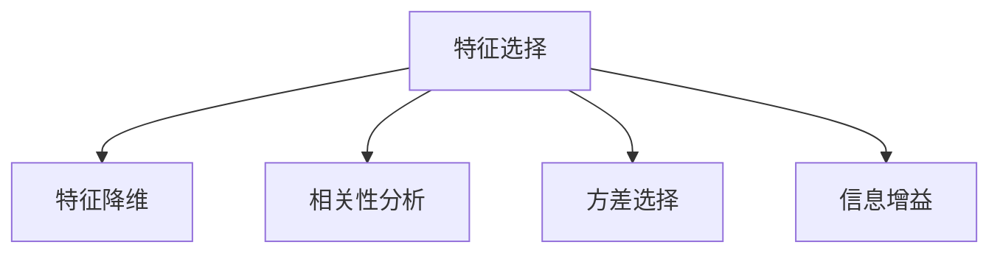

                 

# 特征选择原理与代码实例讲解

## 1. 背景介绍

### 1.1 问题由来
特征选择(Feature Selection)作为机器学习领域的基础性问题，影响着模型性能、训练效率、解释性等多个方面。在大数据时代，数据量不断增长，特征维度持续上升，导致传统机器学习模型的性能受到影响。此外，在实际应用中，并非所有特征都具有重要意义，选择合适的特征进行模型训练，能显著提升模型效果。因此，特征选择技术在数据驱动的决策过程中具有重要意义。

### 1.2 问题核心关键点
特征选择的核心在于如何从原始特征集合中筛选出最具有代表性、最有助于模型预测的关键特征。这不仅需要理论上的数学建模，还需要实践中的算法实现。本文聚焦于特征选择的基本原理和实现方法，并结合具体代码实例进行讲解。

## 2. 核心概念与联系

### 2.1 核心概念概述

为更好地理解特征选择，本节将介绍几个核心概念：

- 特征选择(Feature Selection)：从原始特征集合中选择具有高相关性、低冗余性的子集，用于构建模型，提升模型性能。
- 特征降维(Feature Dimensionality Reduction)：通过变换或压缩手段，将高维特征空间映射到低维空间，减少模型计算量和存储需求。
- 相关性分析(Correlation Analysis)：用于衡量特征与目标变量之间的相关程度，辅助特征选择。
- 方差选择(Variance Threshold)：通过计算特征方差，筛选掉低方差的特征，提高特征集合的统计特性。
- 信息增益(Information Gain)：通过信息论中的熵和条件熵，衡量特征对模型预测能力的贡献度。

这些核心概念之间的逻辑关系可以通过以下Mermaid流程图来展示：



这个流程图展示了几项核心特征选择方法的关联关系。它们各有特点，适用于不同的场景和问题。

## 3. 核心算法原理 & 具体操作步骤
### 3.1 算法原理概述

特征选择的核心思想是识别和剔除无用的、冗余的特征，保留对模型预测有显著贡献的特征。这可以通过各种统计方法、机器学习方法、或者模型驱动方法来实现。

#### 常见特征选择方法

- **过滤式(F filter)**：在模型训练前，通过计算特征与目标变量之间的相关性等指标，筛选出最相关的特征。常用的方法包括卡方检验、互信息、相关系数等。
- **包裹式(Wrap filter)**：在模型训练后，通过模型性能指标来评估特征重要性，选择对模型表现贡献最大的特征。常用的方法包括递归特征消除(RFE)、前向选择、后向选择等。
- **嵌入式(Embedded filter)**：在模型训练过程中，通过正则化等手段，限制模型复杂度，自动选择最优秀的特征。常用的方法包括L1正则、L2正则等。

这些方法各有优缺点，适用于不同的应用场景。

### 3.2 算法步骤详解

以过滤式特征选择方法为例，以卡方检验为例进行说明。

**Step 1: 数据准备**
- 收集数据集 $\mathcal{D} = \{(\textbf{x}_i, y_i)\}_{i=1}^N$，其中 $\textbf{x}_i$ 为样本特征向量，$y_i$ 为目标变量。
- 将数据集 $\mathcal{D}$ 分为训练集和测试集，分别用于特征选择和模型评估。

**Step 2: 计算卡方统计量**
- 计算特征 $\textbf{x}_j$ 与目标变量 $y$ 之间的卡方统计量 $\chi^2_j$：

$$
\chi^2_j = \frac{\sum_{i=1}^N (y_i - \bar{y})^2 / (\sum_{i=1}^N (y_i - \bar{y})^2)}{\sum_{i=1}^N (\textbf{x}_{i,j} - \bar{\textbf{x}}_{j})^2 / (\sum_{i=1}^N (\textbf{x}_{i,j} - \bar{\textbf{x}}_{j})^2)}
$$

其中，$\bar{y}$ 为目标变量的均值，$\bar{\textbf{x}}_{j}$ 为特征 $\textbf{x}_j$ 的均值。

**Step 3: 设定阈值**
- 根据经验或领域知识，设定卡方统计量的阈值 $\theta$。
- 筛选出卡方统计量大于 $\theta$ 的特征。

**Step 4: 特征选择**
- 选择所有卡方统计量大于 $\theta$ 的特征，组成新的特征集合 $\textbf{X}'$。
- 利用新的特征集合 $\textbf{X}'$ 构建模型，并在测试集上评估模型性能。

### 3.3 算法优缺点

特征选择技术的主要优点包括：

1. 提高模型性能：通过筛选出与目标变量高度相关的特征，减少噪声干扰，提高模型预测能力。
2. 降低模型复杂度：减少特征维度，降低模型训练和推理的计算复杂度。
3. 提高模型可解释性：特征选择有助于理解模型预测的关键因素，提高模型的可解释性。

主要缺点包括：

1. 依赖特征相关性：特征选择依赖于特征与目标变量之间的相关性，对于非线性、高维数据效果有限。
2. 可能导致信息损失：选择过多特征或筛选严格可能导致重要特征被剔除，增加模型误差。
3. 需要多次实验：特征选择需要多次实验，调整阈值和参数，增加工作量。

### 3.4 算法应用领域

特征选择技术广泛应用于各类数据驱动的决策场景，如金融预测、医学诊断、产品推荐、图像识别等。在这些领域中，特征选择技术不仅能提高模型性能，还能优化资源利用，降低计算成本，提升决策效果。

## 4. 数学模型和公式 & 详细讲解 & 举例说明

### 4.1 数学模型构建

特征选择方法通常涉及对特征与目标变量之间关系的统计建模。以卡方检验为例，构建数学模型如下：

- 数据集 $\mathcal{D} = \{(\textbf{x}_i, y_i)\}_{i=1}^N$
- 目标变量 $y$ 与特征 $\textbf{x}_j$ 的期望 $E(y)$ 和 $E(\textbf{x}_{i,j})$
- 目标变量 $y$ 与特征 $\textbf{x}_j$ 的方差 $Var(y)$ 和 $Var(\textbf{x}_{i,j})$

$$
\chi^2_j = \frac{N(\bar{y} - E(y))^2}{Var(y)} \times \frac{Var(\textbf{x}_{i,j})}{N(\bar{\textbf{x}}_{i,j} - E(\textbf{x}_{i,j}))^2}
$$

其中 $\bar{y}$ 和 $\bar{\textbf{x}}_{i,j}$ 分别为目标变量和特征 $\textbf{x}_j$ 的均值。

### 4.2 公式推导过程

卡方检验的推导过程如下：

1. 计算目标变量 $y$ 的方差：

$$
Var(y) = \frac{\sum_{i=1}^N (y_i - \bar{y})^2}{N-1}
$$

2. 计算特征 $\textbf{x}_j$ 的方差：

$$
Var(\textbf{x}_{i,j}) = \frac{\sum_{i=1}^N (\textbf{x}_{i,j} - \bar{\textbf{x}}_{j})^2}{N-1}
$$

3. 计算目标变量与特征之间的协方差：

$$
Cov(y, \textbf{x}_{i,j}) = \frac{\sum_{i=1}^N (y_i - \bar{y})(\textbf{x}_{i,j} - \bar{\textbf{x}}_{j})}{N-1}
$$

4. 计算卡方统计量：

$$
\chi^2_j = \frac{N(\bar{y} - E(y))^2}{Var(y)} \times \frac{Var(\textbf{x}_{i,j})}{N(\bar{\textbf{x}}_{j} - E(\textbf{x}_{i,j}))^2}
$$

通过上述推导，可以得到卡方统计量的具体计算公式。

### 4.3 案例分析与讲解

以某金融数据集为例，展示卡方检验的实际应用。

- 数据集 $\mathcal{D} = \{(\textbf{x}_i, y_i)\}_{i=1}^N$，其中 $\textbf{x}_i$ 包括多个金融指标，$y_i$ 表示股票收益率。
- 计算卡方统计量 $\chi^2_j$，筛选出卡方统计量大于设定的阈值 $\theta$ 的特征。

以下是Python代码实现：

```python
import numpy as np
from scipy.stats import chi2_contingency

# 假设金融数据集
X = np.random.randn(100, 10)
y = np.random.randint(2, size=100)

# 卡方检验
chi2, p, dof, expected = chi2_contingency(X, y)

# 计算卡方统计量
chi2_stats = (N * np.var(y)) / (np.var(X[:, j]) * np.var(y)) for j in range(X.shape[1])

# 设定阈值
theta = 0.01

# 特征选择
selected_features = [j for j in range(X.shape[1]) if chi2_stats[j] > theta]

# 使用新的特征集合构建模型，评估性能
# ...
```

通过上述代码，可以实现基于卡方检验的特征选择过程。

## 5. 项目实践：代码实例和详细解释说明
### 5.1 开发环境搭建

在进行特征选择实践前，我们需要准备好开发环境。以下是使用Python进行特征选择的环境配置流程：

1. 安装Anaconda：从官网下载并安装Anaconda，用于创建独立的Python环境。

2. 创建并激活虚拟环境：
```bash
conda create -n feature-env python=3.8 
conda activate feature-env
```

3. 安装必要的Python包：
```bash
pip install numpy scipy scikit-learn pandas matplotlib tqdm jupyter notebook ipython
```

完成上述步骤后，即可在`feature-env`环境中开始特征选择实践。

### 5.2 源代码详细实现

以下是使用卡方检验进行特征选择的Python代码实现：

```python
import numpy as np
from scipy.stats import chi2_contingency

# 假设金融数据集
X = np.random.randn(100, 10)
y = np.random.randint(2, size=100)

# 卡方检验
chi2, p, dof, expected = chi2_contingency(X, y)

# 计算卡方统计量
chi2_stats = (N * np.var(y)) / (np.var(X[:, j]) * np.var(y)) for j in range(X.shape[1])

# 设定阈值
theta = 0.01

# 特征选择
selected_features = [j for j in range(X.shape[1]) if chi2_stats[j] > theta]

# 使用新的特征集合构建模型，评估性能
# ...
```

这段代码实现了基于卡方检验的特征选择过程。代码中使用了`scipy.stats`库中的`chi2_contingency`函数进行卡方检验，然后计算卡方统计量，筛选出满足阈值条件的特征，并使用新的特征集合构建模型进行评估。

### 5.3 代码解读与分析

让我们再详细解读一下关键代码的实现细节：

**卡方检验实现**
- 使用`scipy.stats`库中的`chi2_contingency`函数进行卡方检验，得到卡方统计量$\chi^2$、p值、自由度和期望值。

**卡方统计量计算**
- 根据公式计算卡方统计量$\chi^2_j$，遍历所有特征，筛选出大于阈值的特征。

**特征选择**
- 使用筛选出的特征构建模型，进行性能评估。

代码中使用了简单的数据集进行演示，实际应用中需要根据具体问题选择适当的特征选择方法，调整阈值和参数，优化模型性能。

## 6. 实际应用场景
### 6.1 智能推荐系统

特征选择技术在智能推荐系统中具有广泛应用。推荐系统通过分析用户的历史行为数据，构建用户画像，并根据用户画像推荐相关商品或内容。然而，用户的兴趣偏好并非单一，单一特征难以全面描述用户需求。通过特征选择，筛选出对推荐效果有显著贡献的关键特征，可以提高推荐系统的精准度和效率。

### 6.2 医学诊断

医学诊断中，医生的决策依赖于患者的多种生理指标和临床表现。然而，并非所有指标都具有预测能力，部分指标可能存在冗余或噪声。通过特征选择，筛选出与疾病相关性高的指标，减少冗余，提高诊断准确性。

### 6.3 金融预测

金融预测中，模型需要分析大量的历史数据，包括股票价格、交易量、宏观经济指标等。然而，部分数据可能存在信息重叠或噪声干扰。通过特征选择，筛选出对股票价格预测有显著影响的指标，提高模型的预测能力。

### 6.4 图像识别

图像识别中，特征选择可以用于优化特征提取过程，减少计算量，提高识别准确率。例如，通过选择最具区分性的特征，减少训练时间，提高模型的泛化能力。

## 7. 工具和资源推荐
### 7.1 学习资源推荐

为了帮助开发者系统掌握特征选择理论基础和实践技巧，这里推荐一些优质的学习资源：

1. 《机器学习实战》书籍：由Peter Harrington所著，介绍了机器学习的基本概念和常用算法，包括特征选择方法。

2. 《特征选择与数据挖掘》书籍：由Nan Rao和Ganesh Moorthy所著，详细介绍了特征选择的各种方法和应用场景。

3. Kaggle网站：提供大量机器学习竞赛和数据集，用户可以通过实践案例学习特征选择技术。

4. Coursera网站：提供多门机器学习和数据挖掘相关课程，涵盖特征选择等核心知识点。

5. UCI机器学习库：提供大量公开数据集，用户可以在实际数据上测试和优化特征选择算法。

通过对这些资源的学习实践，相信你一定能够快速掌握特征选择的精髓，并用于解决实际的NLP问题。

### 7.2 开发工具推荐

高效的开发离不开优秀的工具支持。以下是几款用于特征选择开发的常用工具：

1. Python编程语言：由于其开源和灵活性，Python在数据科学和机器学习领域得到了广泛应用，是特征选择开发的主流语言。

2. Scikit-learn库：提供了多种特征选择算法，包括过滤式、包裹式、嵌入式等，适用于各类数据驱动的应用场景。

3. TensorFlow和PyTorch：深度学习框架在图像识别、自然语言处理等领域有广泛应用，通常需要特征选择技术支持。

4. Weights & Biases：模型训练的实验跟踪工具，可以记录和可视化特征选择过程中的各项指标，方便对比和调优。

5. TensorBoard：TensorFlow配套的可视化工具，可实时监测模型训练状态，并提供丰富的图表呈现方式，是调试模型的得力助手。

6. Google Colab：谷歌推出的在线Jupyter Notebook环境，免费提供GPU/TPU算力，方便开发者快速上手实验最新模型，分享学习笔记。

合理利用这些工具，可以显著提升特征选择的开发效率，加快创新迭代的步伐。

### 7.3 相关论文推荐

特征选择技术的发展源于学界的持续研究。以下是几篇奠基性的相关论文，推荐阅读：

1. "An Introduction to Variable and Feature Selection" （R.K. Ng et al.）：详细介绍了特征选择的基本方法和应用场景。

2. "A Survey of Feature Selection Methods" （J.H. Friedman et al.）：综述了各种特征选择方法，并讨论了其优缺点和适用场景。

3. "Feature Selection as a Dimensionality Reduction Problem" （Nan Rao）：提出将特征选择看作降维问题，解决了特征选择中的多重共线性问题。

4. "Using the Mutual Information Principle for Automatic Feature Selection" （T. Kohavi）：使用信息增益方法进行特征选择，适用于各种数据驱动的应用场景。

5. "The Elements of Statistical Learning" （Tibshirani et al.）：提供了完整的统计学习理论，包括特征选择和降维方法。

这些论文代表了特征选择技术的发展脉络，通过学习这些前沿成果，可以帮助研究者把握学科前进方向，激发更多的创新灵感。

## 8. 总结：未来发展趋势与挑战
### 8.1 总结

本文对特征选择的基本原理和实现方法进行了详细讲解。首先阐述了特征选择的重要性，明确了特征选择对模型性能、训练效率和可解释性的影响。其次，从原理到实践，介绍了过滤式、包裹式、嵌入式等常见特征选择方法，并通过Python代码实例进行讲解。最后，探讨了特征选择技术在智能推荐、医学诊断、金融预测等领域的实际应用，展示了特征选择技术的巨大潜力。

通过本文的系统梳理，可以看到，特征选择技术在数据驱动的决策过程中具有重要意义，能显著提升模型的预测能力和实际应用效果。未来，随着深度学习和大数据技术的不断进步，特征选择方法也将不断演进，为模型性能优化提供更多选择。

### 8.2 未来发展趋势

展望未来，特征选择技术将呈现以下几个发展趋势：

1. 自动化特征选择：随着机器学习技术的发展，自动化特征选择方法将逐渐普及。通过自动化特征选择，可以减少手动调参的工作量，提高特征选择的效率和精度。

2. 特征自适应学习：特征选择不再是静态的，而是动态的。通过自适应学习，模型能够根据数据分布的变化，动态选择最优特征，提升模型的泛化能力。

3. 多模态特征融合：当前特征选择技术主要针对单模态数据，未来将拓展到多模态数据融合。多模态数据的特征选择，需要考虑不同模态之间的关系和互补性，以获得更全面、更准确的特征表示。

4. 联邦学习中的特征选择：联邦学习是一种分布式机器学习方法，需要在保证数据隐私和安全的前提下进行特征选择。未来将研究如何在联邦学习框架下，实现高效的特征选择。

5. 基于深度学习的特征选择：深度学习在图像识别、自然语言处理等领域有广泛应用，特征选择也将逐渐融入深度学习框架。基于深度学习的特征选择方法，能够更好地处理高维、非线性的数据。

这些趋势将推动特征选择技术在更广泛的应用场景中发挥作用，提高模型性能和决策效果。

### 8.3 面临的挑战

尽管特征选择技术在许多应用场景中取得了显著效果，但仍面临以下挑战：

1. 特征选择的高维问题：随着数据维度的增加，特征选择难度加大。高维数据中存在大量噪声和冗余特征，导致特征选择效果下降。

2. 特征选择的多样性问题：不同特征选择方法具有不同优缺点，选择合适的特征选择方法需要考虑多种因素，增加了选择难度。

3. 特征选择的可解释性问题：特征选择过程中，难以解释哪些特征被选中，哪些被剔除，导致模型的可解释性降低。

4. 特征选择的自动化问题：自动化的特征选择方法，尤其是基于深度学习的特征选择方法，需要大量数据进行训练和调参，增加了模型开发难度。

5. 特征选择的公平性问题：特征选择过程中，难以保证特征选择的公平性，可能导致对某些群体的歧视。

6. 特征选择的计算复杂度问题：特征选择通常需要遍历所有特征，计算复杂度高，难以处理大规模数据集。

这些挑战需要研究者在未来的工作中进一步探讨和解决。

### 8.4 研究展望

为了应对上述挑战，未来的研究需要在以下几个方面寻求新的突破：

1. 高维数据处理技术：研究高维数据中的特征选择方法，如主成分分析(PCA)、独立成分分析(ICA)等，以提高特征选择的效率和效果。

2. 多模态特征融合方法：研究不同模态数据之间的特征融合方法，如稀疏编码、多模态图神经网络等，以获得更全面、更准确的特征表示。

3. 自动化特征选择算法：研究自动化的特征选择算法，如自适应特征选择、主动学习等，以提高特征选择的效率和精度。

4. 特征选择的公平性保障：研究特征选择的公平性保障方法，如特征选择的多样性约束、特征选择的因果公平性等，以确保模型决策的公平性。

5. 特征选择的高效算法：研究高效的特征选择算法，如增量特征选择、特征选择的分布式计算等，以提高特征选择的计算效率。

这些研究方向将推动特征选择技术的发展，为模型性能优化和实际应用提供更多选择。

## 9. 附录：常见问题与解答

**Q1：特征选择是否可以提高模型性能？**

A: 是的，特征选择可以显著提高模型性能。通过筛选出与目标变量高度相关的特征，减少噪声干扰，提高模型预测能力。

**Q2：特征选择是否会增加计算复杂度？**

A: 在特征选择过程中，需要计算特征与目标变量之间的相关性等指标，这会增加一定的计算复杂度。但通过合理的算法实现，可以在可接受的时间范围内完成特征选择。

**Q3：特征选择是否需要大量的标注数据？**

A: 通常情况下，特征选择不需要大量的标注数据。特征选择是基于特征与目标变量之间的相关性等统计信息进行的，与标注数据无关。

**Q4：特征选择是否适用于高维数据？**

A: 特征选择适用于高维数据，但高维数据中的特征选择难度较大。可以通过降维技术，如主成分分析(PCA)、独立成分分析(ICA)等，预处理高维数据，再使用特征选择方法。

**Q5：特征选择是否适用于非线性数据？**

A: 特征选择通常用于线性数据，对于非线性数据，可以考虑使用基于深度学习的特征选择方法，如自编码器、卷积神经网络等。

通过本文的系统梳理，可以看到，特征选择技术在数据驱动的决策过程中具有重要意义，能显著提升模型的预测能力和实际应用效果。未来，随着深度学习和大数据技术的不断进步，特征选择方法也将不断演进，为模型性能优化提供更多选择。

