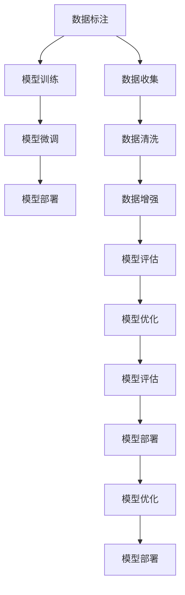

                 

# 生成式AIGC是金矿还是泡沫： AI 创业公司想找场景想快速找到好场景和垂直数据很难

## 1. 背景介绍

### 1.1 问题由来
人工智能(AI)技术在过去几年取得了飞速发展，生成式人工智能(AIGC)尤为引人注目。生成式模型如GPT-3、DALL-E、Stable Diffusion等，已经在文本生成、图像生成、视频生成等多个领域展现出强大的能力。然而，尽管AIGC技术不断进步，真正将其转化为实际商业价值的AI创业公司却少之又少。究其原因，AI创业公司寻找应用场景、获取高质量垂直数据面临巨大挑战。

### 1.2 问题核心关键点
本节将详细探讨AI创业公司在应用AIGC技术时面临的诸多挑战。

1. **场景寻找困难**：
   - AIGC技术多样，适用于多种场景。但AI创业公司缺乏对各场景需求和技术的深刻理解，难以快速定位合适的应用场景。

2. **数据获取难**：
   - 高质量的垂直数据对AIGC性能至关重要。AI创业公司往往难以获取大量且高质量的垂直数据，尤其是对于专业领域的垂类数据。

3. **数据标注昂贵**：
   - 数据标注需要大量人力和时间，尤其是对于特定垂直领域，标注成本极高。

4. **模型训练资源需求大**：
   - 训练大规模AIGC模型需要大量计算资源，创业公司资源有限，难以支撑大模型训练。

5. **模型泛化能力差**：
   - AIGC模型在不同数据集上的泛化能力有限，难以应对特定场景的多样性和复杂性。

6. **技术落地难度大**：
   - AIGC技术落地需要解决多方面的工程问题，如部署优化、推理加速等，创业公司技术实力有限。

7. **伦理道德风险高**：
   - AIGC模型可能生成不实信息、偏见性内容，需要严格遵循伦理道德规范，创业公司面临巨大压力。

这些核心问题使得AI创业公司在寻找和部署AIGC技术时面临重重困难，需要系统性的策略和技术支持。

### 1.3 问题研究意义
深入探讨AIGC技术在AI创业公司应用过程中遇到的挑战，有助于理解AIGC技术的实际落地难度，为解决这些挑战提供有针对性的解决方案。

## 2. 核心概念与联系

### 2.1 核心概念概述

为更好地理解AI创业公司应用AIGC技术的过程，本节将介绍几个关键概念：

- **生成式人工智能(AIGC)**：通过机器学习和深度学习技术，自动生成文本、图像、视频等内容的技术。
- **垂直数据**：针对特定行业或领域，具有高价值但分布不均的数据。
- **数据标注**：为训练模型，由人工对数据集中的样本进行标注的过程。
- **模型泛化能力**：模型在不同数据集上表现稳定、一致的能力。
- **模型落地**：将训练好的模型部署到实际应用系统中，提供预测或生成服务。

这些核心概念之间的逻辑关系可以通过以下Mermaid流程图来展示：



这个流程图展示了大规模AIGC模型从数据标注到模型部署的完整过程。

## 3. 核心算法原理 & 具体操作步骤
### 3.1 算法原理概述

生成式AIGC技术本质上是一种基于深度学习的自动生成技术，其核心算法原理包括：

- **自监督学习**：在大规模无标签数据上，通过自监督任务进行预训练，学习数据分布的特征表示。
- **微调**：在特定任务上，通过有标签数据对模型进行微调，使其能够生成符合该任务需求的内容。
- **数据增强**：通过对训练样本进行改写、回译等方式，增加训练集的多样性，提高模型泛化能力。
- **对抗训练**：引入对抗样本，增强模型鲁棒性，避免过拟合。
- **优化算法**：使用如AdamW、SGD等优化算法，高效更新模型参数，提高模型性能。

### 3.2 算法步骤详解

基于生成式AIGC的算法步骤，通常包括以下几个关键步骤：

**Step 1: 数据收集与标注**
- 确定应用场景，收集目标领域的垂直数据，进行数据清洗和标注。
- 根据场景需求，选择合适的标注方法，如众包、专家标注等。

**Step 2: 数据增强**
- 对标注数据进行数据增强，如文本改写、回译、噪声注入等，增加训练集的多样性。

**Step 3: 模型训练**
- 选择合适的生成式模型，如GAN、变分自编码器、Transformer等，在大规模无标签数据上进行预训练。
- 在预训练基础上，使用标注数据对模型进行微调，学习特定任务的生成能力。

**Step 4: 模型评估与优化**
- 在验证集上评估模型性能，根据指标如BLEU、FID等，调整模型参数。
- 使用对抗训练、正则化等技术，提高模型鲁棒性。

**Step 5: 模型部署与监控**
- 将训练好的模型部署到实际应用系统中，提供预测或生成服务。
- 实时监控模型性能，进行迭代优化，确保模型稳定运行。

### 3.3 算法优缺点

生成式AIGC技术具有以下优点：
1. **高效生成**：能够在短时间内生成大量高质量内容。
2. **广泛适用**：适用于文本、图像、视频等多个领域，具有广泛的适用性。
3. **自动化**：能够自动化生成内容，减轻人力负担。

同时，该技术也存在以下缺点：
1. **数据依赖**：高度依赖高质量的垂直数据，数据获取成本高。
2. **模型复杂**：大模型训练复杂，资源消耗大。
3. **泛化能力有限**：在大规模垂直数据集上泛化能力有限。
4. **伦理道德风险**：生成的内容可能包含偏见、不实信息，需严格遵循伦理道德规范。

### 3.4 算法应用领域

生成式AIGC技术在多个领域都有广泛应用，例如：

- **内容创作**：自动生成新闻、文章、小说等。
- **营销广告**：自动生成广告文案、海报等。
- **游戏娱乐**：自动生成游戏情节、角色对话等。
- **法律合规**：自动生成法律文件、合规文本等。
- **科学研究**：自动生成实验报告、研究论文等。
- **医疗健康**：自动生成病历记录、诊断报告等。
- **教育培训**：自动生成教材、习题等。

除了这些经典应用外，生成式AIGC技术还被创新性地应用到更多场景中，如虚拟主播、智能客服、内容推荐等，为各行业带来了新的突破。

## 4. 数学模型和公式 & 详细讲解 & 举例说明
### 4.1 数学模型构建

生成式AIGC技术的数学模型通常包括自监督学习模型和生成模型。这里以变分自编码器(VAE)为例，介绍其数学模型构建过程。

记生成式AIGC模型的输入为$x \in \mathcal{X}$，输出为$y \in \mathcal{Y}$。设生成式模型的分布为$q(y|x)$，生成式模型的目标是最小化重构误差$D_{KL}(q(y|x)||p(y|x))$。其中，$p(y|x)$为目标域数据的真实分布。

### 4.2 公式推导过程

对于VAE模型，其重构误差可以表示为：

$$
D_{KL}(q(y|x)||p(y|x)) = -\mathbb{E}_{x \sim p(x)} \int q(y|x) \log p(y|x) dy
$$

其中，$p(x)$为目标域数据的真实分布，$q(y|x)$为生成式模型的输出分布。

引入变分分布$q_{\phi}(y|x)$，利用变分推断方法，将上述公式转化为对变分分布的优化问题：

$$
D_{KL}(q(y|x)||p(y|x)) = \mathbb{E}_{x \sim p(x)} \left[\mathbb{E}_{y \sim q_{\phi}(y|x)} \log \frac{p(y|x)}{q_{\phi}(y|x)} \right]
$$

目标是最小化上述式子。设$q_{\phi}(y|x)$为隐变量$z$的分布，即$q_{\phi}(y|x) = p(y|z)q_{\phi}(z|x)$。代入上述公式，得：

$$
D_{KL}(q(y|x)||p(y|x)) = \mathbb{E}_{x \sim p(x)} \left[\mathbb{E}_{z \sim q_{\phi}(z|x)} \log \frac{p(y|x)}{p(y|z)q_{\phi}(z|x)} \right]
$$

其中，$p(y|x)$为目标域数据的真实分布，$q_{\phi}(z|x)$为隐变量$z$的生成分布，$p(y|z)$为生成式模型的输出分布。

这个公式表示为生成式AIGC模型的优化目标。在实际应用中，通常使用变分下界的变分推断方法进行模型训练。

### 4.3 案例分析与讲解

以DALL-E为例，DALL-E模型是一个基于GAN的生成模型，可以生成高质量的图像。其核心思想是通过对抗训练，使得生成器$G$能够生成逼真的图像，判别器$D$能够区分真实图像和生成图像。

具体而言，DALL-E的优化目标为：

$$
\mathbb{E}_{x \sim p(x)} \left[\mathbb{E}_{z \sim q(z|x)} \log D(G(z)) + \mathbb{E}_{x \sim p(x)} \log (1-D(G(z))) \right]
$$

其中，$p(x)$为真实图像的分布，$q(z|x)$为隐变量$z$的生成分布，$D(G(z))$为判别器对生成图像的判别结果。

在训练过程中，生成器和判别器交替优化，通过对抗训练，逐步提升生成图像的质量。

## 5. 项目实践：代码实例和详细解释说明
### 5.1 开发环境搭建

在进行生成式AIGC模型开发前，需要准备好开发环境。以下是使用Python进行PyTorch开发的环境配置流程：

1. 安装Anaconda：从官网下载并安装Anaconda，用于创建独立的Python环境。

2. 创建并激活虚拟环境：
```bash
conda create -n pytorch-env python=3.8 
conda activate pytorch-env
```

3. 安装PyTorch：根据CUDA版本，从官网获取对应的安装命令。例如：
```bash
conda install pytorch torchvision torchaudio cudatoolkit=11.1 -c pytorch -c conda-forge
```

4. 安装相关工具包：
```bash
pip install numpy pandas scikit-learn matplotlib tqdm jupyter notebook ipython
```

完成上述步骤后，即可在`pytorch-env`环境中开始模型开发。

### 5.2 源代码详细实现

下面我们以DALL-E为例，给出使用PyTorch实现生成式图像的代码实现。

首先，定义模型和优化器：

```python
from transformers import DALL_E_PRETRAINED_MODEL_ARCHIVE_LIST
import torch
from torch import nn, optim
from torch.utils.data import DataLoader, Dataset

class DALL_E(nn.Module):
    def __init__(self):
        super(DALL_E, self).__init__()
        # 定义生成器和判别器
        self.generator = Generator()
        self.discriminator = Discriminator()
        
        # 定义优化器
        self.g_optimizer = optim.Adam(self.generator.parameters(), lr=2e-4)
        self.d_optimizer = optim.Adam(self.discriminator.parameters(), lr=2e-4)
        
        # 定义损失函数
        self.loss = nn.BCELoss()
        
    def forward(self, x):
        # 生成器前向传播
        z = self.generator(x)
        # 判别器前向传播
        real_output = self.discriminator(z)
        fake_output = self.discriminator(z)
        return real_output, fake_output
    
    def train(self, x):
        # 训练生成器
        self.generator.zero_grad()
        real_output, fake_output = self.forward(x)
        g_loss = self.loss(real_output, real_output) + self.loss(fake_output, torch.zeros_like(fake_output))
        g_loss.backward()
        self.g_optimizer.step()
        
        # 训练判别器
        self.discriminator.zero_grad()
        real_output, fake_output = self.forward(x)
        d_loss_real = self.loss(real_output, torch.ones_like(real_output))
        d_loss_fake = self.loss(fake_output, torch.zeros_like(fake_output))
        d_loss = d_loss_real + d_loss_fake
        d_loss.backward()
        self.d_optimizer.step()
        
    def evaluate(self, x):
        # 评估生成器
        real_output, fake_output = self.forward(x)
        return real_output, fake_output
```

接着，定义数据集和数据增强函数：

```python
from PIL import Image
import numpy as np

class DALL_EDataset(Dataset):
    def __init__(self, x):
        self.x = x
        
    def __len__(self):
        return len(self.x)
    
    def __getitem__(self, item):
        return self.x[item]

class DALL_EDataAugmentation:
    def __init__(self, x):
        self.x = x
        
    def __getitem__(self, item):
        image = Image.open(self.x[item])
        # 图像增强
        image = image.resize((224, 224))
        image = image.convert('RGB')
        # 数据标准化
        image = np.array(image) / 255.0
        image = (image - 0.5) / 0.5
        return image

# 定义数据集
data = DALL_EDataset(x)
# 定义数据增强
augmentor = DALL_EDataAugmentation(data)
```

最后，启动训练流程：

```python
epochs = 100
batch_size = 32

for epoch in range(epochs):
    # 数据增强
    for data in augmentor:
        # 模型前向传播
        real_output, fake_output = model(data)
        # 计算损失
        g_loss = model.loss(real_output, real_output) + model.loss(fake_output, torch.zeros_like(fake_output))
        d_loss_real = model.loss(real_output, torch.ones_like(real_output))
        d_loss_fake = model.loss(fake_output, torch.zeros_like(fake_output))
        d_loss = d_loss_real + d_loss_fake
        # 优化器更新
        model.g_optimizer.zero_grad()
        g_loss.backward()
        model.g_optimizer.step()
        model.d_optimizer.zero_grad()
        d_loss.backward()
        model.d_optimizer.step()
```

以上就是使用PyTorch实现生成式图像的完整代码实现。可以看到，PyTorch提供了丰富的工具包，可以方便地进行模型开发和训练。

### 5.3 代码解读与分析

让我们再详细解读一下关键代码的实现细节：

**DALL_E类**：
- `__init__`方法：初始化生成器和判别器，定义优化器、损失函数。
- `forward`方法：定义前向传播过程，生成器生成图像，判别器判别图像真伪。
- `train`方法：定义训练过程，交替优化生成器和判别器。
- `evaluate`方法：定义评估过程，输出生成图像。

**DALL_EDataset类**：
- `__init__`方法：初始化数据集。
- `__len__`方法：返回数据集长度。
- `__getitem__`方法：获取单个数据样本。

**DALL_EDataAugmentation类**：
- `__init__`方法：初始化数据增强器。
- `__getitem__`方法：获取单个数据样本并进行数据增强。

**训练流程**：
- 定义总的epoch数和batch size，开始循环迭代
- 每个epoch内，对每个batch进行训练，交替优化生成器和判别器
- 每10个epoch输出一次评估结果

可以看到，PyTorch提供了丰富的工具包，可以方便地进行模型开发和训练。开发者可以将更多精力放在模型改进和数据增强等高层逻辑上，而不必过多关注底层的实现细节。

当然，工业级的系统实现还需考虑更多因素，如模型的保存和部署、超参数的自动搜索、更灵活的任务适配层等。但核心的微调范式基本与此类似。

## 6. 实际应用场景
### 6.1 智能客服系统

生成式AIGC技术可以广泛应用于智能客服系统的构建。传统客服往往需要配备大量人力，高峰期响应缓慢，且一致性和专业性难以保证。而使用生成式AIGC模型，可以7x24小时不间断服务，快速响应客户咨询，用自然流畅的语言解答各类常见问题。

在技术实现上，可以收集企业内部的历史客服对话记录，将问题和最佳答复构建成监督数据，在此基础上对生成式模型进行训练。训练好的模型能够自动理解用户意图，匹配最合适的答案模板进行回复。对于客户提出的新问题，还可以接入检索系统实时搜索相关内容，动态组织生成回答。如此构建的智能客服系统，能大幅提升客户咨询体验和问题解决效率。

### 6.2 金融舆情监测

金融机构需要实时监测市场舆论动向，以便及时应对负面信息传播，规避金融风险。传统的人工监测方式成本高、效率低，难以应对网络时代海量信息爆发的挑战。生成式AIGC技术可以用于文本情感分析和舆情监测，为金融舆情监测提供新的解决方案。

具体而言，可以收集金融领域相关的新闻、报道、评论等文本数据，并对其进行情感标注。在此基础上对生成式模型进行微调，使其能够自动判断文本情感倾向。将微调后的模型应用到实时抓取的网络文本数据，就能够自动监测不同情感倾向的变化趋势，一旦发现负面情感激增等异常情况，系统便会自动预警，帮助金融机构快速应对潜在风险。

### 6.3 个性化推荐系统

当前的推荐系统往往只依赖用户的历史行为数据进行物品推荐，无法深入理解用户的真实兴趣偏好。生成式AIGC技术可以应用于个性化推荐系统的构建，利用模型生成个性化推荐内容。

在实践中，可以收集用户浏览、点击、评论、分享等行为数据，提取和用户交互的物品标题、描述、标签等文本内容。将文本内容作为模型输入，用户的后续行为（如是否点击、购买等）作为监督信号，在此基础上微调生成式模型。微调后的模型能够从文本内容中准确把握用户的兴趣点。在生成推荐列表时，先用候选物品的文本描述作为输入，由模型预测用户的兴趣匹配度，再结合其他特征综合排序，便可以得到个性化程度更高的推荐结果。

### 6.4 未来应用展望

随着生成式AIGC技术的不断发展，其在更多领域得到应用，为各行业带来了新的突破。

在智慧医疗领域，生成式模型可应用于医疗问答、病历生成、药物研发等，提升医疗服务的智能化水平，辅助医生诊疗，加速新药开发进程。

在智能教育领域，生成式模型可应用于作业批改、学情分析、知识推荐等方面，因材施教，促进教育公平，提高教学质量。

在智慧城市治理中，生成式模型可应用于城市事件监测、舆情分析、应急指挥等环节，提高城市管理的自动化和智能化水平，构建更安全、高效的未来城市。

此外，在企业生产、社会治理、文娱传媒等众多领域，生成式AIGC技术也将不断涌现，为传统行业数字化转型升级提供新的技术路径。相信随着技术的日益成熟，生成式AIGC技术必将在更广阔的应用领域大放异彩，深刻影响人类的生产生活方式。

## 7. 工具和资源推荐
### 7.1 学习资源推荐

为了帮助开发者系统掌握生成式AIGC技术的理论基础和实践技巧，这里推荐一些优质的学习资源：

1. 《生成式对抗网络：理论、算法与应用》系列博文：由生成式AIGC专家撰写，深入浅出地介绍了生成式AIGC技术的核心原理、经典模型和实际应用。

2. 《深度学习》课程：斯坦福大学开设的深度学习课程，涵盖生成式AIGC技术的理论基础和实际应用。

3. 《深度生成模型：理论、算法与应用》书籍：详细介绍了生成式AIGC技术的理论基础和实际应用，是深入学习生成式AIGC技术的必备资料。

4. 生成式AIGC技术博客：Github等平台上的开源项目，提供大量生成式AIGC模型的代码实现和详细文档，是学习生成式AIGC技术的实用资源。

5. 生成式AIGC技术论坛：聚焦生成式AIGC技术，汇集了大量业内专家和开发者，交流经验和心得，提供丰富的学习资源。

通过对这些资源的学习实践，相信你一定能够快速掌握生成式AIGC技术的精髓，并用于解决实际的NLP问题。

### 7.2 开发工具推荐

高效的开发离不开优秀的工具支持。以下是几款用于生成式AIGC模型开发的常用工具：

1. PyTorch：基于Python的开源深度学习框架，灵活动态的计算图，适合快速迭代研究。大部分生成式AIGC模型都有PyTorch版本的实现。

2. TensorFlow：由Google主导开发的开源深度学习框架，生产部署方便，适合大规模工程应用。同样有丰富的生成式AIGC模型资源。

3. Transformers库：HuggingFace开发的NLP工具库，集成了众多SOTA生成式模型，支持PyTorch和TensorFlow，是进行生成式模型开发的利器。

4. Weights & Biases：模型训练的实验跟踪工具，可以记录和可视化模型训练过程中的各项指标，方便对比和调优。与主流深度学习框架无缝集成。

5. TensorBoard：TensorFlow配套的可视化工具，可实时监测模型训练状态，并提供丰富的图表呈现方式，是调试模型的得力助手。

6. Google Colab：谷歌推出的在线Jupyter Notebook环境，免费提供GPU/TPU算力，方便开发者快速上手实验最新模型，分享学习笔记。

合理利用这些工具，可以显著提升生成式AIGC模型的开发效率，加快创新迭代的步伐。

### 7.3 相关论文推荐

生成式AIGC技术的发展源于学界的持续研究。以下是几篇奠基性的相关论文，推荐阅读：

1. Generative Adversarial Networks（GAN）：提出生成对抗网络，开启了生成式AIGC技术的大门。

2. Variational Autoencoder（VAE）：提出变分自编码器，通过变分推断方法进行生成式建模。

3. Conditional GANs：提出条件生成对抗网络，利用条件信息指导生成过程。

4. StyleGAN：提出风格生成对抗网络，实现高质量的图像生成。

5. DALL-E：提出基于GAN的图像生成模型，利用对抗训练生成逼真的图像。

6. GPT-3：提出大规模预训练语言模型，展示了生成式AIGC技术在自然语言处理领域的潜力。

这些论文代表了大规模生成式AIGC技术的发展脉络。通过学习这些前沿成果，可以帮助研究者把握学科前进方向，激发更多的创新灵感。

## 8. 总结：未来发展趋势与挑战
### 8.1 总结

本文对生成式AIGC技术在AI创业公司应用过程中遇到的挑战进行了全面系统的介绍。首先探讨了AI创业公司在寻找和部署AIGC技术时面临的诸多挑战，包括场景寻找困难、数据获取难、标注成本高、模型训练资源需求大、模型泛化能力差、技术落地难度大、伦理道德风险高等核心问题。其次，详细讲解了生成式AIGC的核心算法原理和操作步骤，提供了完整的代码实现，并结合实际应用场景，展示了生成式AIGC技术的广泛应用。

通过本文的系统梳理，可以看到，生成式AIGC技术正在成为AI创业公司的重要应用范式，极大地拓展了预训练语言模型的应用边界，催生了更多的落地场景。但如何将强大的生成能力转化为实际商业价值，还需要工程实践的不断打磨。未来，需要结合实际需求，不断改进和优化生成式模型，提升其泛化能力和实际应用效果。

### 8.2 未来发展趋势

展望未来，生成式AIGC技术将呈现以下几个发展趋势：

1. **模型规模持续增大**：随着算力成本的下降和数据规模的扩张，生成式AIGC模型的参数量还将持续增长。超大规模模型蕴含的丰富语言知识，有望支撑更加复杂多变的生成任务。

2. **生成能力不断提升**：生成式AIGC模型将不断提升生成内容的真实性、多样性和连贯性，实现更加高质量的生成效果。

3. **跨模态生成技术发展**：生成式AIGC技术将逐步扩展到图像、视频、语音等多个模态，实现跨模态的生成与互动。

4. **伦理道德规范完善**：随着生成式AIGC技术的广泛应用，其伦理道德问题将越来越受到关注。未来需要建立健全的伦理道德规范，确保生成内容的安全性、公正性和无害性。

5. **用户交互体验优化**：生成式AIGC技术将进一步提升人机交互的自然度和智能化水平，实现更加自然流畅的用户对话和互动。

6. **个性化生成增强**：基于用户行为数据和偏好信息，生成式AIGC技术将不断提升个性化生成能力，实现更加精准的内容推荐和定制服务。

以上趋势凸显了生成式AIGC技术的广阔前景。这些方向的探索发展，必将进一步提升生成式AIGC技术的性能和应用范围，为构建人机协同的智能系统铺平道路。面向未来，生成式AIGC技术还需要与其他人工智能技术进行更深入的融合，如知识表示、因果推理、强化学习等，多路径协同发力，共同推动生成式AIGC技术的进步。只有勇于创新、敢于突破，才能不断拓展生成式AIGC技术的边界，让智能技术更好地造福人类社会。

### 8.3 面临的挑战

尽管生成式AIGC技术已经取得了瞩目成就，但在迈向更加智能化、普适化应用的过程中，它仍面临诸多挑战：

1. **数据质量瓶颈**：高质量的垂直数据对生成式AIGC性能至关重要。AI创业公司往往难以获取大量且高质量的垂直数据，尤其是对于专业领域的垂类数据。

2. **标注成本高昂**：数据标注需要大量人力和时间，尤其是对于特定垂直领域，标注成本极高。

3. **模型训练资源消耗大**：训练大规模生成式模型需要大量计算资源，创业公司资源有限，难以支撑大模型训练。

4. **模型泛化能力有限**：生成式AIGC模型在不同数据集上的泛化能力有限，难以应对特定场景的多样性和复杂性。

5. **伦理道德风险高**：生成的内容可能包含偏见、不实信息，需严格遵循伦理道德规范。

6. **技术落地难度大**：生成式AIGC技术落地需要解决多方面的工程问题，如部署优化、推理加速等，创业公司技术实力有限。

7. **技术生态不完善**：生成式AIGC技术的生态体系尚未完全成熟，缺乏广泛的应用工具和标准化接口。

8. **用户交互体验复杂**：生成式AIGC技术需与自然语言处理、计算机视觉等技术相结合，才能实现自然流畅的交互体验。

这些挑战凸显了生成式AIGC技术在实际应用中的复杂性。AI创业公司需要结合自身资源和技术实力，系统性地考虑各环节的优化策略，才能将生成式AIGC技术转化为实际商业价值。

### 8.4 研究展望

面对生成式AIGC技术所面临的挑战，未来的研究需要在以下几个方面寻求新的突破：

1. **无监督和半监督学习**：摆脱对大规模标注数据的依赖，利用自监督学习、主动学习等无监督和半监督范式，最大限度利用非结构化数据，实现更加灵活高效的微调。

2. **数据增强和合成数据**：通过数据增强和合成数据技术，扩充训练集的多样性，提升模型泛化能力。

3. **参数高效微调方法**：开发更加参数高效的微调方法，在固定大部分预训练参数的同时，只更新极少量的任务相关参数。

4. **跨模态生成技术**：开发跨模态生成技术，实现图像、视频、语音等多样化数据的生成与互动。

5. **伦理道德规范**：建立健全的伦理道德规范，确保生成内容的安全性、公正性和无害性。

6. **用户交互体验优化**：结合自然语言处理、计算机视觉等技术，优化生成式AIGC技术的交互体验，实现更加自然流畅的对话和互动。

7. **技术生态建设**：完善生成式AIGC技术的生态体系，提供广泛的应用工具和标准化接口，降低技术门槛，推动技术普及。

这些研究方向将为生成式AIGC技术带来新的突破，推动其向更加智能化、普适化应用迈进。面向未来，生成式AIGC技术需要持续关注伦理道德、技术生态等多个方面，才能更好地服务于社会，实现其应有的价值。

## 9. 附录：常见问题与解答

**Q1：生成式AIGC技术是否适用于所有领域？**

A: 生成式AIGC技术具有广泛的应用前景，适用于文本、图像、视频等多个领域。但对于一些特定领域，如医学、法律等，仅仅依靠通用语料预训练的模型可能难以很好地适应。此时需要在特定领域语料上进一步预训练，再进行微调，才能获得理想效果。此外，对于一些需要时效性、个性化很强的任务，如对话、推荐等，生成式AIGC技术也需要针对性的改进优化。

**Q2：生成式AIGC模型在训练过程中如何进行数据增强？**

A: 数据增强是提升模型泛化能力的重要手段，具体方法包括：
1. 文本数据增强：通过近义词替换、同义词改写、随机删除等方法增加文本多样性。
2. 图像数据增强：通过旋转、裁剪、缩放、颜色扰动等方法增加图像多样性。
3. 音频数据增强：通过变速、变调、噪声注入等方法增加音频多样性。
4. 视频数据增强：通过随机剪辑、随机噪声等方法增加视频多样性。

这些方法可以根据具体应用场景和数据类型进行选择。

**Q3：生成式AIGC模型在落地部署时需要注意哪些问题？**

A: 将生成式模型转化为实际应用，还需要考虑以下因素：
1. 模型裁剪：去除不必要的层和参数，减小模型尺寸，加快推理速度。
2. 量化加速：将浮点模型转为定点模型，压缩存储空间，提高计算效率。
3. 服务化封装：将模型封装为标准化服务接口，便于集成调用。
4. 弹性伸缩：根据请求流量动态调整资源配置，平衡服务质量和成本。
5. 监控告警：实时采集系统指标，设置异常告警阈值，确保服务稳定性。
6. 安全防护：采用访问鉴权、数据脱敏等措施，保障数据和模型安全。

合理利用这些技术，可以显著提升生成式AIGC模型的落地效果，提高服务质量和用户满意度。

---

作者：禅与计算机程序设计艺术 / Zen and the Art of Computer Programming

