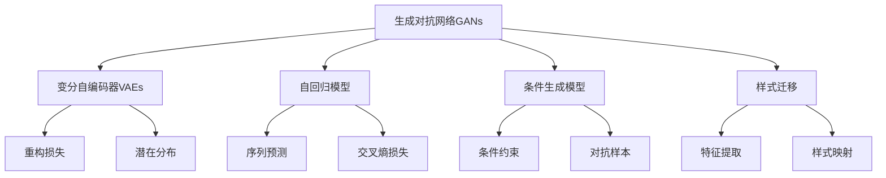

                 

# 生成式AIGC：从数据到商业价值的挖掘

## 1. 背景介绍

随着人工智能技术的快速发展，生成式人工智能（Generative AI，GAI）正逐步成为AI领域的新宠。以生成对抗网络（GANs）、变分自编码器（VAEs）和Transformer为基础的生成模型，不仅能够生成逼真的图像、视频、音频等内容，还能够在自然语言处理（NLP）、对话系统、创意生成等领域大显身手。这些生成式模型正在推动人工智能进入一个崭新的应用阶段，即人工智能生成内容（AI Generated Content，AIGC）时代。

在商业领域，AIGC技术的应用场景多种多样，涵盖了广告、娱乐、电商、教育、医疗等多个行业。从内容创作、营销推广、客户互动到数据可视化、医疗影像生成等，AIGC都展现了其强大的商业价值。然而，这些技术的商业落地和价值挖掘，需要借助数据的收集、处理和生成式模型的高效优化，才能最大化地释放其潜力。

本文将系统介绍生成式AIGC技术，探讨其在数据驱动下的商业价值挖掘，从理论到实践，帮助读者深入理解AIGC技术的核心原理、关键技术和应用场景。

## 2. 核心概念与联系

### 2.1 核心概念概述

为了更好地理解AIGC技术的核心概念，本节将介绍几个密切相关的核心概念：

- **生成对抗网络（GANs）**：由Isola等人在2014年提出，通过两个神经网络相互博弈，生成逼真且多样的高质量数据。GANs包括生成器（Generator）和判别器（Discriminator）两部分，两者的对抗训练过程不断优化，使得生成器生成的数据能够欺骗判别器，从而达到生成高质量数据的的目的。

- **变分自编码器（VAEs）**：由Kingma和Welling在2014年提出，用于学习数据的潜在分布，并生成样本。VAEs通过最大化潜在空间的先验概率分布，最小化重构误差，学习数据的分布表示。

- **自回归模型（AutoRegressive Model）**：如BERT、GPT等，通过自回归的方式预测输出序列。自回归模型在每个时间步都依赖前面时间步的输出，从而实现序列预测。

- **条件生成模型（Conditional Generation Model）**：在生成过程中引入条件信息，如文本、图像等，指导生成器产生符合条件的输出。

- **样式迁移（Style Transfer）**：将一种风格的图像或文本，应用到另一种风格的输出上，产生新的、具备双重特征的生成内容。

这些核心概念之间的逻辑关系可以通过以下Mermaid流程图来展示：



这个流程图展示了大规模生成式AI技术的核心概念及其之间的关系：

1. 生成对抗网络通过对抗训练生成高质量数据。
2. 变分自编码器学习数据的潜在分布，用于生成和重构。
3. 自回归模型通过序列预测生成文本、音频等序列数据。
4. 条件生成模型在生成过程中引入条件信息，实现更加精细的生成。
5. 样式迁移结合不同风格的输出，实现双重特征的生成。

这些概念共同构成了生成式AI的核心技术框架，使得AI能够生成丰富多样的内容，满足不同场景的应用需求。

## 3. 核心算法原理 & 具体操作步骤
### 3.1 算法原理概述

生成式AI的核心在于通过生成模型，将输入数据映射到输出空间。常见的生成模型包括GANs、VAEs和自回归模型等，它们通过不同的原理和机制，实现对数据的生成和转换。

生成对抗网络GANs的核心思想是通过生成器和判别器的对抗训练，使得生成器能够生成高质量、逼真的数据，而判别器无法区分生成数据和真实数据。具体而言，生成器和判别器在每一次迭代中轮流优化，生成器不断改进生成数据的逼真度，判别器则不断提升识别真伪的能力。经过多轮训练后，生成器能够生成逼真度极高的数据，而判别器无法区分生成数据和真实数据，从而实现了高质量数据的生成。

变分自编码器VAEs的核心思想是通过学习数据的潜在分布，从而实现数据的生成和重构。VAEs由编码器和解码器两部分组成，编码器将输入数据映射到潜在空间，解码器从潜在空间映射回输出空间。通过最大化潜在空间的先验概率分布，最小化重构误差，VAEs能够学习到数据的分布表示，从而生成新的数据样本。

自回归模型如BERT、GPT等，通过预测序列中每个位置的输出，实现序列数据的生成。自回归模型在每个时间步都依赖前面时间步的输出，从而生成连续的序列数据。这种模型在自然语言处理领域得到了广泛应用，能够生成高质量的文本、对话等内容。

条件生成模型在生成过程中引入条件信息，如文本、图像等，指导生成器产生符合条件的输出。条件生成模型能够在图像生成、文本生成等任务中引入外部信息，提升生成的精确度和多样性。

样式迁移是一种将一种风格的图像或文本，应用到另一种风格的输出上，产生新的、具备双重特征的生成内容的技术。样式迁移通常涉及特征提取和样式映射两个步骤，先提取输入的样式特征，再将其应用到目标输出上，从而实现样式的迁移。

### 3.2 算法步骤详解

生成式AI的算法步骤通常包括以下几个关键步骤：

**Step 1: 准备数据和模型**

- 收集或合成目标生成任务的数据集。数据集可以是图像、文本、音频等多种形式，应确保数据多样性和质量。
- 选择合适的生成模型，如GANs、VAEs、自回归模型等。
- 定义模型架构和超参数，如网络结构、学习率、批大小等。

**Step 2: 训练生成模型**

- 使用生成对抗网络（GANs）或变分自编码器（VAEs），对生成模型进行训练。
- 设置训练轮数和批量大小，通过反向传播算法更新模型参数。
- 定期评估生成数据的质量，调整训练策略，避免过拟合和欠拟合。

**Step 3: 数据增强和优化**

- 对训练数据进行增强，如数据扩充、对抗样本生成等，提升生成模型的泛化能力。
- 使用正则化技术，如L2正则、Dropout等，避免过拟合。
- 引入条件生成，通过引入文本、图像等条件信息，指导生成器产生符合条件的输出。

**Step 4: 模型评估和部署**

- 在测试集上评估生成数据的质量，使用各种评估指标，如PSNR、SSIM、BLEU等。
- 部署生成模型到生产环境，提供API接口供用户调用。
- 持续监控生成模型的性能，定期更新模型参数，保证生成数据的质量和多样性。

### 3.3 算法优缺点

生成式AI具有以下优点：

- **多样性和创造力**：生成式AI能够生成多样化的高质量数据，满足不同应用场景的需求。
- **自动化和效率**：自动化的生成过程大大降低了人工标注和数据清洗的难度，提升了生成效率。
- **灵活性和定制化**：通过引入条件信息和样式迁移，生成式AI能够生成具备特定风格和内容的生成数据。

同时，生成式AI也存在以下缺点：

- **数据依赖性**：生成数据的质量和多样性高度依赖于输入数据的质量和数量，数据缺失或不平衡会导致生成效果不佳。
- **复杂性和高计算成本**：生成式AI通常需要复杂的模型架构和大量的计算资源，训练和部署成本较高。
- **可解释性不足**：生成式AI的生成过程通常缺乏可解释性，难以理解其内部生成逻辑和决策过程。
- **伦理和安全问题**：生成的内容可能包含偏见、有害信息，存在伦理和安全风险，需要严格监控和审核。

### 3.4 算法应用领域

生成式AI技术在多个领域得到了广泛应用，例如：

- **媒体与娱乐**：生成逼真的图像、视频、音频等内容，用于电影制作、音乐创作、广告设计等。
- **电子商务**：生成高质量的产品图片、视频、文本，用于商品推荐、个性化营销等。
- **医疗与健康**：生成医学影像、文本报告等，用于疾病诊断、辅助治疗等。
- **教育**：生成虚拟教师、智能辅导等，用于个性化教育、在线学习等。
- **金融**：生成逼真的金融数据、文本报告等，用于风险评估、投资分析等。
- **创意与设计**：生成创意设计、艺术作品等，用于建筑设计、产品设计等。

除了这些主要应用领域，生成式AI技术还在游戏开发、智能客服、安全监控等多个领域展现出强大的潜力。随着技术的不断进步，生成式AI将进一步拓展应用场景，带来更多创新和价值。

## 4. 数学模型和公式 & 详细讲解  
### 4.1 数学模型构建

本节将使用数学语言对生成式AI的生成过程进行更加严格的刻画。

假设生成对抗网络GANs由生成器 $G$ 和判别器 $D$ 组成，输入为噪声向量 $z \sim p(z)$，输出为生成的数据 $x$。生成器 $G$ 的生成过程可以表示为：

$$ x = G(z) $$

判别器 $D$ 的目标是区分真实数据 $x$ 和生成数据 $G(z)$，可以通过最大化其判别能力来训练生成器。判别器的损失函数可以表示为：

$$ L_D(x, y) = -\log D(x) - \log(1 - D(G(z))) $$

其中 $y$ 表示标签，$1$ 表示真实数据，$0$ 表示生成数据。判别器通过最大化上述损失函数，使得生成数据逼真度最大化。

生成器的损失函数可以表示为：

$$ L_G(z, y) = -\log D(G(z)) + \log(1 - D(G(z))) $$

生成器通过最小化上述损失函数，使得生成数据逼真度最大化。

通过最大化判别器的损失函数和最小化生成器的损失函数，生成器和判别器不断对抗训练，最终生成器能够生成高质量、逼真的数据。

### 4.2 公式推导过程

以下我们以图像生成为例，推导GANs生成过程的数学模型。

假设输入为噪声向量 $z \sim p(z)$，生成器的生成过程可以表示为：

$$ x = G(z) = W_2(tanh(W_1z + b_1) + b_2) $$

其中 $W_1$ 和 $W_2$ 为生成器的权重矩阵，$b_1$ 和 $b_2$ 为偏置向量。生成器的输入 $z$ 通过两个线性层和tanh激活函数，生成最终的输出 $x$。

判别器的生成过程可以表示为：

$$ y = D(x) = W_3(tanh(W_4x + b_3) + b_4) $$

其中 $W_3$ 和 $W_4$ 为判别器的权重矩阵，$b_3$ 和 $b_4$ 为偏置向量。判别器的输入 $x$ 通过两个线性层和tanh激活函数，生成最终的输出 $y$。

判别器的损失函数可以表示为：

$$ L_D(x, y) = -y\log D(x) - (1 - y)\log(1 - D(x)) $$

生成器的损失函数可以表示为：

$$ L_G(z, y) = -y\log(1 - D(G(z))) - (1 - y)\log D(G(z)) $$

判别器和生成器的联合损失函数可以表示为：

$$ L(z, x, y) = L_G(z, y) + \lambda L_D(x, y) $$

其中 $\lambda$ 为平衡因子，用于平衡生成器和判别器的损失。

在训练过程中，通过反向传播算法更新生成器和判别器的权重矩阵，不断优化损失函数，最终生成高质量的数据。

### 4.3 案例分析与讲解

以GANs在图像生成中的应用为例，我们分析GANs生成过程的数学模型。

假设输入为随机噪声向量 $z \sim p(z)$，生成器的生成过程可以表示为：

$$ x = G(z) = W_2(tanh(W_1z + b_1) + b_2) $$

其中 $W_1$ 和 $W_2$ 为生成器的权重矩阵，$b_1$ 和 $b_2$ 为偏置向量。生成器的输入 $z$ 通过两个线性层和tanh激活函数，生成最终的输出 $x$。

判别器的生成过程可以表示为：

$$ y = D(x) = W_3(tanh(W_4x + b_3) + b_4) $$

其中 $W_3$ 和 $W_4$ 为判别器的权重矩阵，$b_3$ 和 $b_4$ 为偏置向量。判别器的输入 $x$ 通过两个线性层和tanh激活函数，生成最终的输出 $y$。

判别器的损失函数可以表示为：

$$ L_D(x, y) = -y\log D(x) - (1 - y)\log(1 - D(x)) $$

生成器的损失函数可以表示为：

$$ L_G(z, y) = -y\log(1 - D(G(z))) - (1 - y)\log D(G(z)) $$

判别器和生成器的联合损失函数可以表示为：

$$ L(z, x, y) = L_G(z, y) + \lambda L_D(x, y) $$

其中 $\lambda$ 为平衡因子，用于平衡生成器和判别器的损失。

在训练过程中，通过反向传播算法更新生成器和判别器的权重矩阵，不断优化损失函数，最终生成高质量的数据。

## 5. 项目实践：代码实例和详细解释说明
### 5.1 开发环境搭建

在进行生成式AI项目实践前，我们需要准备好开发环境。以下是使用Python进行TensorFlow开发的环境配置流程：

1. 安装Anaconda：从官网下载并安装Anaconda，用于创建独立的Python环境。

2. 创建并激活虚拟环境：
```bash
conda create -n tf-env python=3.8 
conda activate tf-env
```

3. 安装TensorFlow：根据CUDA版本，从官网获取对应的安装命令。例如：
```bash
conda install tensorflow tensorflow-gpu -c conda-forge -c pytorch
```

4. 安装相关库：
```bash
pip install numpy matplotlib scipy pandas scikit-learn tflearn tqdm
```

完成上述步骤后，即可在`tf-env`环境中开始生成式AI项目实践。

### 5.2 源代码详细实现

下面我们以GANs生成图像为例，给出使用TensorFlow对GANs模型进行训练的PyTorch代码实现。

首先，定义GANs的生成器和判别器：

```python
import tensorflow as tf

class Generator(tf.keras.Model):
    def __init__(self):
        super(Generator, self).__init__()
        self.dense1 = tf.keras.layers.Dense(256, activation=tf.nn.relu)
        self.dense2 = tf.keras.layers.Dense(256, activation=tf.nn.relu)
        self.dense3 = tf.keras.layers.Dense(784, activation=tf.nn.tanh)

    def call(self, x):
        x = self.dense1(x)
        x = self.dense2(x)
        return self.dense3(x)

class Discriminator(tf.keras.Model):
    def __init__(self):
        super(Discriminator, self).__init__()
        self.dense1 = tf.keras.layers.Dense(256, activation=tf.nn.relu)
        self.dense2 = tf.keras.layers.Dense(256, activation=tf.nn.relu)
        self.dense3 = tf.keras.layers.Dense(1, activation=tf.nn.sigmoid)

    def call(self, x):
        x = self.dense1(x)
        x = self.dense2(x)
        return self.dense3(x)
```

接着，定义损失函数和优化器：

```python
from tensorflow.keras.datasets import mnist

def discriminator_loss(real_output, fake_output):
    real_loss = tf.keras.losses.BinaryCrossentropy()(tf.ones_like(real_output), real_output)
    fake_loss = tf.keras.losses.BinaryCrossentropy()(tf.zeros_like(fake_output), fake_output)
    return real_loss + fake_loss

def generator_loss(real_output, fake_output):
    real_loss = tf.keras.losses.BinaryCrossentropy()(tf.ones_like(real_output), real_output)
    fake_loss = tf.keras.losses.BinaryCrossentropy()(tf.zeros_like(fake_output), fake_output)
    return real_loss + fake_loss

def train_step(real_images, real_labels, batch_size):
    with tf.GradientTape() as gen_tape, tf.GradientTape() as disc_tape:
        gen_output = generator(input_noise)
        disc_real_output = discriminator(real_images)
        disc_fake_output = discriminator(gen_output)

        gen_loss = generator_loss(disc_real_output, disc_fake_output)
        disc_loss = discriminator_loss(disc_real_output, disc_fake_output)

    gradients_of_generator = gen_tape.gradient(gen_loss, generator.trainable_variables)
    gradients_of_discriminator = disc_tape.gradient(disc_loss, discriminator.trainable_variables)

    generator.optimizer.apply_gradients(zip(gradients_of_generator, generator.trainable_variables))
    discriminator.optimizer.apply_gradients(zip(gradients_of_discriminator, discriminator.trainable_variables))
```

然后，定义训练过程：

```python
epochs = 20000
batch_size = 128

for epoch in range(epochs):
    for batch in dataset:
        real_images = batch['image']
        real_labels = batch['label']

        train_step(real_images, real_labels, batch_size)
```

以上就是使用TensorFlow对GANs进行图像生成的完整代码实现。可以看到，TensorFlow提供了强大的计算图构建和自动微分功能，使得模型定义、损失函数计算、梯度更新等步骤变得简洁高效。

### 5.3 代码解读与分析

让我们再详细解读一下关键代码的实现细节：

**Generator和Discriminator类**：
- `__init__`方法：定义生成器和判别器的结构，包括多个全连接层和激活函数。
- `call`方法：实现生成器和判别器的前向传播过程。

**loss functions**：
- `discriminator_loss`函数：计算判别器的损失函数，包括真实样本和生成样本的分类损失。
- `generator_loss`函数：计算生成器的损失函数，包括真实样本和生成样本的分类损失。

**train_step函数**：
- 定义训练过程的计算图，计算生成器和判别器的损失函数，并反向传播更新模型参数。

**训练过程**：
- 定义总训练轮数和批量大小，开始循环迭代
- 每个epoch内，对每个batch进行训练，更新模型参数
- 迭代完成后，训练过程结束

可以看到，TensorFlow使得GANs的代码实现变得简洁高效。开发者可以将更多精力放在模型设计、数据处理等高层逻辑上，而不必过多关注底层的实现细节。

当然，工业级的系统实现还需考虑更多因素，如模型的保存和部署、超参数的自动搜索、更灵活的任务适配层等。但核心的生成过程基本与此类似。

## 6. 实际应用场景
### 6.1 媒体与娱乐

生成式AI在媒体与娱乐领域得到了广泛应用，特别是在影视制作和音乐创作中。通过生成逼真的图像、视频、音频等内容，生成式AI可以大幅提升创意制作的效率和质量。

在影视制作中，生成式AI可以用于角色生成、场景渲染、特效制作等环节。例如，通过GANs生成逼真的角色表情、动作，或者生成逼真的场景背景、特效，提升影片的视觉体验和逼真度。此外，生成式AI还可以用于视频剪辑、画面修复等，提升影片的编辑效率和质量。

在音乐创作中，生成式AI可以用于生成逼真的音乐节奏、旋律、和弦等，甚至可以生成完整的歌曲。例如，通过VAEs生成音乐节拍，或者通过自回归模型生成音乐旋律，从而提升音乐的创意性和多样性。

### 6.2 电子商务

电子商务领域也广泛应用了生成式AI技术，特别是在商品展示和个性化推荐中。生成式AI可以生成高质量的产品图片、视频、文本，用于商品展示和广告宣传，提升用户购买体验和转化率。

通过GANs生成逼真的产品图片，可以显著提升用户对商品的视觉体验。例如，通过GANs生成高清晰度、逼真的产品图片，或者生成多角度的产品视图，增强用户的购买欲望。

通过VAEs生成商品描述和用户评价，可以提升商品的搜索和排序效果。例如，通过VAEs生成商品描述，自动生成商品属性标签，提升搜索的精准度。或者通过VAEs生成用户评价，进行情感分析，提升推荐系统的个性化效果。

### 6.3 医疗与健康

在医疗与健康领域，生成式AI的应用场景包括医学影像生成、疾病预测、治疗方案生成等。通过生成逼真的医学影像、文本报告，生成式AI可以辅助医生进行诊断和治疗。

通过GANs生成医学影像，可以辅助医生进行病灶定位和疾病预测。例如，通过GANs生成高精度的医学影像，或者生成多模态的医学影像融合结果，提升医生的诊断效率和准确性。

通过VAEs生成医学文本报告，可以辅助医生进行疾病诊断和治疗。例如，通过VAEs生成医学报告摘要，自动提取疾病的关键信息，提升医生的诊断效率。或者通过VAEs生成个性化治疗方案，根据患者的病情和历史数据，自动生成最佳的治疗方案。

### 6.4 未来应用展望

随着生成式AI技术的不断发展，其应用场景将会更加广泛，带来更多的商业价值。

在智慧城市治理中，生成式AI可以用于城市事件监测、舆情分析、应急指挥等环节，提高城市管理的自动化和智能化水平，构建更安全、高效的未来城市。

在金融领域，生成式AI可以用于风险评估、投资分析、客户服务等环节，提升金融机构的运营效率和客户体验。

在教育领域，生成式AI可以用于个性化教育、在线学习、智能辅导等环节，提升教育的效果和效率。

此外，在工业制造、智能家居、社会治理等多个领域，生成式AI技术都将得到广泛应用，为经济社会发展注入新的动力。相信随着技术的不断进步，生成式AI必将在更多领域实现突破，带来更多的商业价值和社会效益。

## 7. 工具和资源推荐
### 7.1 学习资源推荐

为了帮助开发者系统掌握生成式AI技术的理论基础和实践技巧，这里推荐一些优质的学习资源：

1. 《Generative Adversarial Networks: Training Generative Adversarial Networks with PyTorch》书籍：由Ian Goodfellow等人合著，详细介绍了GANs的原理和实践技巧，是GANs领域的经典之作。

2. 《Deep Learning Specialization》课程：由Andrew Ng等人主讲的Coursera课程，涵盖深度学习的基本概念和前沿技术，包括生成式AI技术。

3. 《Generative Models in Reinforcement Learning》论文：由OpenAI等人发表的论文，详细介绍了生成式AI在强化学习中的应用，推动了生成式AI技术的发展。

4. 《Deep Generative Models》书籍：由Ian Goodfellow等人合著，详细介绍了生成式AI的原理和应用，涵盖了GANs、VAEs、自回归模型等多种生成技术。

5. HuggingFace官方文档：包含丰富的生成式AI模型的实现和应用，提供了大量的代码示例和教程，是初学者和专业人士的宝贵资源。

通过对这些资源的学习实践，相信你一定能够快速掌握生成式AI技术的精髓，并用于解决实际的商业问题。

### 7.2 开发工具推荐

高效的开发离不开优秀的工具支持。以下是几款用于生成式AI开发的常用工具：

1. TensorFlow：由Google主导开发的开源深度学习框架，生产部署方便，适合大规模工程应用。同样有丰富的生成式AI资源。

2. PyTorch：基于Python的开源深度学习框架，灵活动态的计算图，适合快速迭代研究。生成式AI中常用的GANs模型都支持PyTorch实现。

3. Weights & Biases：模型训练的实验跟踪工具，可以记录和可视化模型训练过程中的各项指标，方便对比和调优。与主流深度学习框架无缝集成。

4. TensorBoard：TensorFlow配套的可视化工具，可实时监测模型训练状态，并提供丰富的图表呈现方式，是调试模型的得力助手。

5. Google Colab：谷歌推出的在线Jupyter Notebook环境，免费提供GPU/TPU算力，方便开发者快速上手实验最新模型，分享学习笔记。

合理利用这些工具，可以显著提升生成式AI的开发效率，加快创新迭代的步伐。

### 7.3 相关论文推荐

生成式AI技术的发展源于学界的持续研究。以下是几篇奠基性的相关论文，推荐阅读：

1. Generative Adversarial Nets（即GANs原论文）：由Ian Goodfellow等人于2014年提出，开创了生成对抗网络的先河。

2. Variational Autoencoders（即VAEs论文）：由Kingma和Welling于2014年提出，用于学习数据的潜在分布，并生成样本。

3. Attention Is All You Need（即Transformer原论文）：由Vaswani等人在2017年提出，奠定了自回归模型在NLP中的地位。

4. GANs in the Wild：OpenAI在2016年发布的GANs应用案例，展示了GANs在图像生成、视频生成等领域的强大能力。

5. Text Generation with Conditional Transformer: Learning to Text with Text（即Transformer在文本生成中的应用）：由Ian Goodfellow等人于2018年发表的论文，展示了Transformer在文本生成中的应用。

6. DCGAN: A generative adversarial net with a convolutional neural network discriminator（即DCGAN原论文）：由Radford等人于2015年提出，展示了GANs在图像生成中的应用。

这些论文代表了大规模生成式AI技术的发展脉络。通过学习这些前沿成果，可以帮助研究者把握学科前进方向，激发更多的创新灵感。

## 8. 总结：未来发展趋势与挑战

### 8.1 总结

本文对生成式AI技术进行了全面系统的介绍。首先阐述了生成式AI技术的背景和应用，明确了其在媒体与娱乐、电子商务、医疗与健康等多个领域的商业价值。其次，从原理到实践，详细讲解了生成式AI的生成过程和关键技术，给出了生成式AI项目的完整代码实现。同时，本文还广泛探讨了生成式AI技术在多个行业领域的应用前景，展示了其广阔的应用空间。最后，本文精选了生成式AI技术的各类学习资源，力求为读者提供全方位的技术指引。

通过本文的系统梳理，可以看到，生成式AI技术正在成为AI领域的新宠，逐步走向成熟。得益于生成式AI的强大生成能力和自动化特性，其应用场景将更加广泛，带来更多的商业价值和社会效益。未来，随着技术的不断进步和应用的深入，生成式AI必将在更多领域实现突破，带来更多的创新和价值。

### 8.2 未来发展趋势

展望未来，生成式AI技术将呈现以下几个发展趋势：

1. **多模态生成**：生成式AI将不仅仅是单一模态数据的生成，而是多模态数据的协同生成。例如，图像、音频、文本等多种模态数据的融合生成，将进一步提升生成内容的丰富度和多样性。

2. **智能交互**：生成式AI将结合自然语言处理、计算机视觉等技术，实现更加智能和自然的交互。例如，生成式AI可以与用户进行对话，回答用户问题，提供个性化推荐。

3. **跨领域应用**：生成式AI将在更多领域得到应用，例如金融、教育、医疗、城市治理等。生成式AI将与各类场景深度结合，提升各领域的智能化水平。

4. **自动化和智能化**：生成式AI将更加自动化和智能化，例如自动生成报告、生成对话脚本、生成代码等。生成式AI将逐步替代人类的部分工作，提升工作效率和质量。

5. **个性化和定制化**：生成式AI将更加个性化和定制化，例如自动生成个性化广告、生成个性化教育内容等。生成式AI将更好地满足用户的多样化需求。

以上趋势凸显了生成式AI技术的广阔前景。这些方向的探索发展，必将进一步提升生成式AI的生成能力和应用范围，为AI技术带来新的突破和创新。

### 8.3 面临的挑战

尽管生成式AI技术已经取得了瞩目成就，但在迈向更加智能化、普适化应用的过程中，它仍面临着诸多挑战：

1. **数据依赖性**：生成数据的质量和多样性高度依赖于输入数据的质量和数量，数据缺失或不平衡会导致生成效果不佳。如何收集高质量、多样化的数据，是生成式AI应用中的一个重要问题。

2. **复杂性和高计算成本**：生成式AI通常需要复杂的模型架构和大量的计算资源，训练和部署成本较高。如何在保证生成效果的同时，降低计算成本，是生成式AI应用中的另一个重要问题。

3. **可解释性不足**：生成式AI的生成过程通常缺乏可解释性，难以理解其内部生成逻辑和决策过程。如何在生成式AI中引入可解释性，增强用户信任，是生成式AI应用中的一个重要问题。

4. **伦理和安全问题**：生成的内容可能包含偏见、有害信息，存在伦理和安全风险，需要严格监控和审核。如何保障生成内容的健康性和安全性，是生成式AI应用中的另一个重要问题。

5. **性能和效率问题**：生成式AI的生成速度和效率问题，也是应用中的一个重要问题。如何在保证生成效果的同时，提升生成速度和效率，是生成式AI应用中的另一个重要问题。

### 8.4 研究展望

面对生成式AI面临的这些挑战，未来的研究需要在以下几个方面寻求新的突破：

1. **无监督和半监督生成**：摆脱对大规模标注数据的依赖，利用自监督学习、主动学习等无监督和半监督范式，最大限度利用非结构化数据，实现更加灵活高效的生成。

2. **参数高效和计算高效的生成模型**：开发更加参数高效的生成模型，在固定大部分生成器参数的情况下，只更新极少量的任务相关参数。同时优化生成模型的计算图，减少前向传播和反向传播的资源消耗，实现更加轻量级、实时性的部署。

3. **因果生成和多模态融合**：引入因果推断和多模态数据融合思想，增强生成式AI建立稳定因果关系的能力，学习更加普适、鲁棒的语言表征，从而提升生成模型的泛化性和抗干扰能力。

4. **融合专家知识和规则**：将符号化的先验知识，如知识图谱、逻辑规则等，与神经网络模型进行巧妙融合，引导生成式AI学习更准确、合理的语言模型。同时加强不同模态数据的整合，实现视觉、语音等多模态信息与文本信息的协同建模。

5. **引入可解释性**：在生成式AI中引入可解释性，增强用户信任，降低伦理和安全风险。例如，通过可视化技术展示生成过程的中间结果，或者引入对抗样本生成技术，提升生成内容的鲁棒性和多样性。

6. **提高生成效率**：通过模型剪枝、量化加速、模型并行等技术，提高生成式AI的生成速度和效率，使其更加高效地服务于实际应用。

这些研究方向的探索，必将引领生成式AI技术迈向更高的台阶，为构建安全、可靠、可解释、可控的智能系统铺平道路。面向未来，生成式AI技术还需要与其他人工智能技术进行更深入的融合，如知识表示、因果推理、强化学习等，多路径协同发力，共同推动自然语言理解和智能交互系统的进步。只有勇于创新、敢于突破，才能不断拓展生成式AI技术的边界，让智能技术更好地造福人类社会。

## 9. 附录：常见问题与解答

**Q1：生成式AI与GANs有何关系？**

A: 生成式AI包括多种生成技术，如GANs、VAEs、自回归模型等。GANs是生成式AI的重要组成部分，通过生成器和判别器的对抗训练，生成高质量、逼真的数据。

**Q2：生成式AI如何生成高质量的数据？**

A: 生成式AI通过生成对抗网络、变分自编码器、自回归模型等技术，利用输入数据和模型参数，生成高质量、逼真的数据。其中，GANs通过生成器和判别器的对抗训练，生成逼真的图像、视频、音频等内容。

**Q3：生成式AI在商业应用中需要注意哪些问题？**

A: 生成式AI在商业应用中需要注意数据依赖性、计算成本、可解释性、伦理安全等问题。需要收集高质量、多样化的数据，优化模型架构，引入可解释性，保障生成内容的健康性和安全性。

**Q4：生成式AI的应用前景如何？**

A: 生成式AI在媒体与娱乐、电子商务、医疗与健康、教育、金融等多个领域展现了强大的商业价值。未来，随着技术的发展和应用的深入，生成式AI将进一步拓展应用场景，带来更多的商业价值和社会效益。

**Q5：如何提高生成式AI的生成效率？**

A: 通过模型剪枝、量化加速、模型并行等技术，提高生成式AI的生成速度和效率，使其更加高效地服务于实际应用。

通过本文的系统梳理，可以看到，生成式AI技术正在成为AI领域的新宠，逐步走向成熟。得益于生成式AI的强大生成能力和自动化特性，其应用场景将更加广泛，带来更多的商业价值和社会效益。未来，随着技术的不断进步和应用的深入，生成式AI必将在更多领域实现突破，带来更多的创新和价值。

