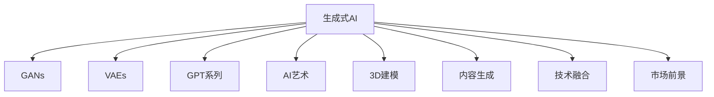

                 

# 生成式AI的未来市场趋势

> 关键词：生成式AI, GANs, VAEs, GPT系列, AI艺术, 3D建模, 内容生成, 技术融合, 市场前景

## 1. 背景介绍

### 1.1 问题由来

随着人工智能技术的快速发展，生成式人工智能（Generative AI, 简称生成式AI）逐步成为了热门话题，引起了各界学者的高度关注。生成式AI通过使用机器学习模型生成全新的数据，为诸如图像、文本、音频等多模态数据的生成提供了强大的工具，为创新、设计、艺术、娱乐等多个领域带来了革命性的影响。

### 1.2 问题核心关键点

生成式AI的核心在于其能够通过深度学习算法生成出逼真且具有创造性的数据，突破了传统数据生成方式的限制。相较于传统的图像、文本等数据生成方法，生成式AI展示了更强的创造性和更高的效率。然而，在实际应用中，生成式AI也面临着数据质量、模型复杂度、计算资源消耗、伦理道德等一系列挑战。

## 2. 核心概念与联系

### 2.1 核心概念概述

为更好地理解生成式AI，本节将介绍几个核心概念，以及它们之间的联系。

- **生成式AI（Generative AI）**：指通过机器学习算法生成全新的数据（如图像、文本、音频等）的AI技术。典型应用包括生成对抗网络（GANs）、变分自编码器（VAEs）、GPT系列模型等。

- **生成对抗网络（GANs）**：由生成器和判别器两个子网络组成，通过对抗训练生成逼真的假数据。GANs是生成式AI的典型代表，广泛应用于图像生成、视频生成、音乐生成等领域。

- **变分自编码器（VAEs）**：通过学习数据的高维概率分布，生成与训练数据相似的新数据。VAEs在生成连续性数据（如图像、音频）方面表现出色，但相比于GANs，其生成质量略逊一筹。

- **GPT系列模型**：OpenAI开发的预训练语言模型，基于自回归架构，能够生成连贯的文本，并在文本生成、对话系统、自然语言推理等方面取得显著成果。

- **AI艺术**：结合生成式AI技术，创作独特的艺术品。AI艺术作品在艺术界引起了广泛关注，被视为AI的重要应用场景之一。

- **3D建模**：生成式AI在三维空间数据生成方面的应用。结合生成式AI，可以生成逼真的3D模型，广泛应用于虚拟现实、游戏设计等领域。

- **内容生成**：生成式AI可以自动化地生成丰富多样的内容，如新闻、故事、音乐等，为内容创作提供更多可能性。

- **技术融合**：生成式AI与传统技术（如图像处理、语音识别、自然语言处理等）的深度融合，提供了更全面、高效的技术解决方案。

- **市场前景**：随着生成式AI技术的进步，其在多个行业（如娱乐、医疗、教育、艺术等）的应用前景广阔，市场潜力巨大。

这些核心概念之间的联系可通过以下Mermaid流程图来展示：



该流程图展示了生成式AI技术在各个方向的应用和未来发展的潜质。

## 3. 核心算法原理 & 具体操作步骤

### 3.1 算法原理概述

生成式AI的算法原理主要基于深度学习，特别是神经网络架构。生成式AI模型通常由生成器和判别器两个组件构成，通过对抗训练生成逼真的数据。

以GANs为例，其基本原理是：生成器（Generator）负责生成假数据，判别器（Discriminator）则负责判别数据是真是假，并指导生成器优化生成数据的质量。通过不断迭代优化生成器和判别器，GANs可以生成高质量的逼真数据。

在文本生成方面，GPT系列模型通过自回归架构，利用大量无标签文本数据进行预训练，生成连贯、逻辑正确的文本。

在图像生成方面，VAEs通过学习数据的概率分布，生成与真实数据分布相似的新数据。

### 3.2 算法步骤详解

以下是生成式AI的典型步骤，包括GANs和VAEs的详细说明：

**GANs生成步骤**：

1. **初始化**：设定生成器（Generator）和判别器（Discriminator）的结构和参数。
2. **训练过程**：
   - 随机生成一批噪声向量，输入生成器生成假数据。
   - 判别器评估假数据的真实性。
   - 生成器根据判别器的反馈调整模型参数。
   - 判别器也根据生成器的输出调整参数。
3. **收敛**：迭代多次后，生成器生成的数据逼真度越来越高，判别器难以区分真假数据，生成过程趋于稳定。

**VAEs生成步骤**：

1. **编码器**：将输入数据映射到潜在空间，形成潜在向量。
2. **解码器**：将潜在向量解码回生成数据。
3. **损失函数**：通过最小化数据重构误差和潜在空间正则化项，训练生成模型。
4. **生成数据**：使用训练好的模型生成新的数据。

### 3.3 算法优缺点

生成式AI具有以下优点：

- **高效生成**：相较于传统的数据生成方式，生成式AI可以高效生成大量高质量数据。
- **创造性强**：生成式AI能生成出全新的、创造性的数据，突破了传统数据生成方式的限制。
- **应用广泛**：生成式AI在图像、文本、音频等多模态数据的生成方面具有广泛的应用前景。

同时，生成式AI也存在一些缺点：

- **模型复杂**：生成式AI模型结构复杂，训练需要大量的计算资源和时间。
- **数据质量依赖**：生成式AI的效果高度依赖于训练数据的质量和多样性。
- **伦理道德风险**：生成的假数据可能被用于误导性信息传播，引发伦理道德问题。

### 3.4 算法应用领域

生成式AI在多个领域中具有广泛的应用，具体包括：

- **图像和视频生成**：用于自动生成逼真的图像和视频内容，广泛应用于娱乐、广告、电影制作等领域。
- **音乐和音频生成**：生成逼真的音乐和音频内容，应用于音乐创作、广告配音等领域。
- **文本生成**：用于生成自然流畅、逻辑合理的文本，应用于写作辅助、对话系统、自动化内容创作等领域。
- **3D建模**：生成逼真的三维模型，应用于虚拟现实、游戏设计、建筑设计等领域。
- **AI艺术**：结合生成式AI技术，创作独特的艺术品，应用于艺术创作、展览展示等领域。
- **内容生成**：生成丰富多样的内容，应用于新闻撰写、故事创作、游戏设计等领域。
- **技术融合**：结合生成式AI与其他AI技术，提供更全面、高效的技术解决方案，应用于智慧医疗、自动驾驶、智能客服等领域。

## 4. 数学模型和公式 & 详细讲解 & 举例说明

### 4.1 数学模型构建

#### 4.1.1 GANs数学模型

GANs由生成器和判别器组成，分别定义如下：

- **生成器（Generator）**：将噪声向量映射到生成数据空间。
  $$
  G(z) = \mu(z)
  $$
  其中 $G$ 为生成器，$z$ 为噪声向量，$\mu$ 为生成器参数。

- **判别器（Discriminator）**：判别输入数据的真实性。
  $$
  D(x) = \sigma(W_D x + b_D)
  $$
  其中 $D$ 为判别器，$x$ 为输入数据，$W_D$ 和 $b_D$ 为判别器参数，$\sigma$ 为激活函数。

GANs的目标函数定义为：

$$
\mathcal{L} = \mathbb{E}_{x\sim p(x)}[D(x)] + \mathbb{E}_{z\sim p(z)}[1 - D(G(z))]
$$

其中 $p(x)$ 为真实数据分布，$p(z)$ 为噪声向量分布。

#### 4.1.2 VAEs数学模型

VAEs由编码器和解码器组成，分别定义如下：

- **编码器（Encoder）**：将输入数据映射到潜在空间。
  $$
  \mu(z|x) = \sigma(W_{\mu} x + b_{\mu})
  $$
  $$
  \log(\sigma(\sigma(W_{\sigma} x + b_{\sigma})))
  $$

- **解码器（Decoder）**：将潜在向量解码回生成数据。
  $$
  x = \sigma(W_D z + b_D)
  $$

VAEs的目标函数定义为：

$$
\mathcal{L} = \mathbb{E}_{x\sim p(x)}[\|x - \mu(x)\|_2^2] + \mathbb{E}_{z\sim p(z)}[\|z - \sigma(z)\|_2^2]
$$

其中 $\sigma$ 为激活函数，$p(x)$ 为真实数据分布，$p(z)$ 为潜在向量分布。

### 4.2 公式推导过程

以GANs为例，推导生成器和判别器的损失函数：

**生成器损失**：

$$
\mathcal{L}_G = -\mathbb{E}_{z\sim p(z)}[\log D(G(z))]
$$

**判别器损失**：

$$
\mathcal{L}_D = -\mathbb{E}_{x\sim p(x)}[\log D(x)] - \mathbb{E}_{z\sim p(z)}[\log (1 - D(G(z)))]
$$

综合优化生成器和判别器的损失函数：

$$
\mathcal{L}_{GAN} = \mathcal{L}_G + \mathcal{L}_D
$$

生成器和判别器通过优化上述损失函数，不断调整自身参数，生成逼真的假数据。

### 4.3 案例分析与讲解

以GANs在图像生成中的应用为例：

- **模型选择**：选择CNN等深度神经网络作为生成器和判别器的结构。
- **数据准备**：收集大量高质量的真实图像数据。
- **训练过程**：通过对抗训练不断优化生成器和判别器的参数。
- **生成图像**：使用训练好的生成器生成逼真的图像。

以下是使用PyTorch实现GANs图像生成的代码示例：

```python
import torch
import torch.nn as nn
import torch.optim as optim
from torchvision import datasets, transforms

class Generator(nn.Module):
    def __init__(self):
        super(Generator, self).__init__()
        self.main = nn.Sequential(
            nn.ConvTranspose2d(100, 256, 4, 1, 0, bias=False),
            nn.BatchNorm2d(256),
            nn.ReLU(True),
            nn.ConvTranspose2d(256, 128, 4, 2, 1, bias=False),
            nn.BatchNorm2d(128),
            nn.ReLU(True),
            nn.ConvTranspose2d(128, 64, 4, 2, 1, bias=False),
            nn.BatchNorm2d(64),
            nn.ReLU(True),
            nn.ConvTranspose2d(64, 3, 4, 2, 1, bias=False),
            nn.Tanh()
        )

    def forward(self, input):
        return self.main(input)

class Discriminator(nn.Module):
    def __init__(self):
        super(Discriminator, self).__init__()
        self.main = nn.Sequential(
            nn.Conv2d(3, 64, 4, 2, 1, bias=False),
            nn.LeakyReLU(0.2, inplace=True),
            nn.Conv2d(64, 128, 4, 2, 1, bias=False),
            nn.BatchNorm2d(128),
            nn.LeakyReLU(0.2, inplace=True),
            nn.Conv2d(128, 256, 4, 2, 1, bias=False),
            nn.BatchNorm2d(256),
            nn.LeakyReLU(0.2, inplace=True),
            nn.Conv2d(256, 1, 4, 1, 0, bias=False),
            nn.Sigmoid()
        )

    def forward(self, input):
        return self.main(input)

# 定义训练函数
def train_gan(model_G, model_D, dataset, batch_size, learning_rate, device):
    # 定义损失函数
    criterion_G = nn.BCELoss()
    criterion_D = nn.BCELoss()

    # 定义优化器
    optimizer_G = optim.Adam(model_G.parameters(), lr=learning_rate)
    optimizer_D = optim.Adam(model_D.parameters(), lr=learning_rate)

    # 训练过程
    for epoch in range(num_epochs):
        for i, (real_images, _) in enumerate(data_loader):
            # 设置随机噪声向量
            noise = torch.randn(batch_size, latent_dim, device=device)

            # 将噪声向量输入生成器
            fake_images = model_G(noise)

            # 将真实图像和假图像传入判别器
            real_labels = torch.ones(batch_size, device=device)
            fake_labels = torch.zeros(batch_size, device=device)

            # 计算判别器损失
            D_real = model_D(real_images).view(-1)
            D_fake = model_D(fake_images).view(-1)
            D_loss = criterion_D(D_real, real_labels) + criterion_D(D_fake, fake_labels)

            # 计算生成器损失
            G_loss = criterion_G(D_fake, fake_labels)

            # 更新参数
            optimizer_G.zero_grad()
            optimizer_D.zero_grad()

            D_loss.backward()
            G_loss.backward()
            optimizer_G.step()
            optimizer_D.step()

# 实例运行
latent_dim = 100
num_epochs = 100
batch_size = 32
learning_rate = 0.0002
device = 'cuda'

# 实例运行
model_G = Generator().to(device)
model_D = Discriminator().to(device)
train_gan(model_G, model_D, dataset, batch_size, learning_rate, device)
```

上述代码展示了GANs图像生成的完整实现过程，包括生成器和判别器的定义、训练函数的实现、以及实例运行。

## 5. 项目实践：代码实例和详细解释说明

### 5.1 开发环境搭建

在进行生成式AI的实践前，我们需要准备好开发环境。以下是使用Python进行PyTorch开发的环境配置流程：

1. 安装Anaconda：从官网下载并安装Anaconda，用于创建独立的Python环境。

2. 创建并激活虚拟环境：
```bash
conda create -n pytorch-env python=3.8 
conda activate pytorch-env
```

3. 安装PyTorch：根据CUDA版本，从官网获取对应的安装命令。例如：
```bash
conda install pytorch torchvision torchaudio cudatoolkit=11.1 -c pytorch -c conda-forge
```

4. 安装TensorFlow：
```bash
pip install tensorflow
```

5. 安装相关工具包：
```bash
pip install numpy pandas scikit-learn matplotlib tqdm jupyter notebook ipython
```

完成上述步骤后，即可在`pytorch-env`环境中开始生成式AI的实践。

### 5.2 源代码详细实现

下面我们以GANs在图像生成中的应用为例，给出使用PyTorch的详细代码实现。

首先，定义GANs的生成器和判别器：

```python
import torch
import torch.nn as nn
import torch.optim as optim
from torchvision import datasets, transforms

class Generator(nn.Module):
    def __init__(self):
        super(Generator, self).__init__()
        self.main = nn.Sequential(
            nn.ConvTranspose2d(100, 256, 4, 1, 0, bias=False),
            nn.BatchNorm2d(256),
            nn.ReLU(True),
            nn.ConvTranspose2d(256, 128, 4, 2, 1, bias=False),
            nn.BatchNorm2d(128),
            nn.ReLU(True),
            nn.ConvTranspose2d(128, 64, 4, 2, 1, bias=False),
            nn.BatchNorm2d(64),
            nn.ReLU(True),
            nn.ConvTranspose2d(64, 3, 4, 2, 1, bias=False),
            nn.Tanh()
        )

    def forward(self, input):
        return self.main(input)

class Discriminator(nn.Module):
    def __init__(self):
        super(Discriminator, self).__init__()
        self.main = nn.Sequential(
            nn.Conv2d(3, 64, 4, 2, 1, bias=False),
            nn.LeakyReLU(0.2, inplace=True),
            nn.Conv2d(64, 128, 4, 2, 1, bias=False),
            nn.BatchNorm2d(128),
            nn.LeakyReLU(0.2, inplace=True),
            nn.Conv2d(128, 256, 4, 2, 1, bias=False),
            nn.BatchNorm2d(256),
            nn.LeakyReLU(0.2, inplace=True),
            nn.Conv2d(256, 1, 4, 1, 0, bias=False),
            nn.Sigmoid()
        )

    def forward(self, input):
        return self.main(input)
```

接着，定义训练函数：

```python
def train_gan(model_G, model_D, dataset, batch_size, learning_rate, device):
    # 定义损失函数
    criterion_G = nn.BCELoss()
    criterion_D = nn.BCELoss()

    # 定义优化器
    optimizer_G = optim.Adam(model_G.parameters(), lr=learning_rate)
    optimizer_D = optim.Adam(model_D.parameters(), lr=learning_rate)

    # 训练过程
    for epoch in range(num_epochs):
        for i, (real_images, _) in enumerate(data_loader):
            # 设置随机噪声向量
            noise = torch.randn(batch_size, latent_dim, device=device)

            # 将噪声向量输入生成器
            fake_images = model_G(noise)

            # 将真实图像和假图像传入判别器
            real_labels = torch.ones(batch_size, device=device)
            fake_labels = torch.zeros(batch_size, device=device)

            # 计算判别器损失
            D_real = model_D(real_images).view(-1)
            D_fake = model_D(fake_images).view(-1)
            D_loss = criterion_D(D_real, real_labels) + criterion_D(D_fake, fake_labels)

            # 计算生成器损失
            G_loss = criterion_G(D_fake, fake_labels)

            # 更新参数
            optimizer_G.zero_grad()
            optimizer_D.zero_grad()

            D_loss.backward()
            G_loss.backward()
            optimizer_G.step()
            optimizer_D.step()
```

最后，启动训练流程：

```python
num_epochs = 100
batch_size = 32
learning_rate = 0.0002
device = 'cuda'

# 实例运行
model_G = Generator().to(device)
model_D = Discriminator().to(device)
train_gan(model_G, model_D, dataset, batch_size, learning_rate, device)
```

以上就是使用PyTorch实现GANs图像生成的完整代码实现。可以看到，PyTorch的高级API使得模型的定义和训练过程变得简洁高效。

### 5.3 代码解读与分析

让我们再详细解读一下关键代码的实现细节：

**Generator类**：
- `__init__`方法：初始化生成器的参数和网络结构。
- `forward`方法：前向传播计算生成数据。

**Discriminator类**：
- `__init__`方法：初始化判别器的参数和网络结构。
- `forward`方法：前向传播计算判别器的输出。

**train_gan函数**：
- 定义损失函数和优化器。
- 在每个epoch中，遍历训练集。
- 在每个batch中，生成随机噪声向量，输入生成器生成假图像。
- 将真实图像和假图像传入判别器，计算判别器和生成器的损失函数。
- 更新模型参数，完成一轮训练。

## 6. 实际应用场景

### 6.1 图像和视频生成

GANs在图像和视频生成方面有着广泛应用，例如：

- **艺术创作**：生成逼真的艺术作品，如绘画、雕塑等，为艺术创作提供新的灵感。
- **影视制作**：生成逼真的电影场景、角色动画等，降低影视制作成本。
- **虚拟试衣间**：生成逼真的衣物试穿效果，提升用户体验。

### 6.2 音乐和音频生成

VAEs在音乐和音频生成方面也有重要应用，例如：

- **音乐创作**：生成高质量的音乐作品，为音乐创作提供新的思路。
- **声音合成**：生成逼真的语音、对话等，应用于虚拟客服、语音助手等领域。
- **声音翻译**：将一种语言的声音翻译为另一种语言，应用于跨语言通信、字幕生成等领域。

### 6.3 文本生成

GPT系列模型在文本生成方面表现出色，例如：

- **文章生成**：自动生成新闻报道、小说等文本内容，应用于新闻撰写、小说创作等领域。
- **对话系统**：生成连贯、逻辑正确的对话内容，应用于智能客服、在线客服等领域。
- **情感分析**：自动分析文本情感，应用于情感分析、舆情监测等领域。

### 6.4 3D建模

GANs在3D建模方面也有重要应用，例如：

- **虚拟现实**：生成逼真的虚拟场景，应用于虚拟现实游戏、虚拟旅游等领域。
- **3D打印**：生成高质量的3D模型，应用于工业设计、建筑规划等领域。
- **电影特效**：生成逼真的3D角色和场景，应用于电影特效制作等领域。

### 6.5 AI艺术

AI艺术结合生成式AI技术，应用于艺术创作、展览展示等领域，例如：

- **艺术创作**：生成独特的艺术品，应用于艺术创作、展览展示等领域。
- **虚拟展览**：生成逼真的虚拟展览环境，提升展览体验。
- **艺术教育**：生成艺术作品，应用于艺术教育、艺术创作指导等领域。

### 6.6 内容生成

生成式AI在内容生成方面也有重要应用，例如：

- **新闻撰写**：自动生成新闻报道、分析文章等，应用于新闻撰写、新闻编辑等领域。
- **内容创作**：生成丰富多样的内容，应用于内容创作、内容推荐等领域。
- **创意写作**：生成创意文本，应用于创意写作、小说创作等领域。

### 6.7 技术融合

生成式AI结合其他AI技术，提供更全面、高效的技术解决方案，例如：

- **智能客服**：结合生成式AI和自然语言处理技术，生成逼真的客服回复。
- **自动驾驶**：生成逼真的模拟场景，用于自动驾驶测试。
- **医疗诊断**：生成逼真的医疗图像，用于辅助诊断和治疗。

## 7. 工具和资源推荐

### 7.1 学习资源推荐

为了帮助开发者系统掌握生成式AI的理论基础和实践技巧，这里推荐一些优质的学习资源：

1. **Deep Learning Specialization by Andrew Ng**：斯坦福大学的深度学习专项课程，涵盖了从机器学习到深度学习的基本概念和经典模型。
2. **Coursera上的GANs课程**：由IBM提供，详细讲解了GANs的基本原理和应用。
3. **PyTorch官方文档**：PyTorch的官方文档，提供了丰富的生成式AI样例代码，适合快速上手。
4. **NIPS会议论文**：NIPS会议上的重要论文，涵盖了生成式AI的前沿研究和最新进展。
5. **Nature Communications上的生成式AI论文**：Nature Communications期刊上的生成式AI研究论文，涵盖广泛的领域和方向。

通过对这些资源的学习实践，相信你一定能够快速掌握生成式AI的精髓，并用于解决实际的NLP问题。

### 7.2 开发工具推荐

高效的开发离不开优秀的工具支持。以下是几款用于生成式AI开发的常用工具：

1. **PyTorch**：基于Python的开源深度学习框架，灵活动态的计算图，适合快速迭代研究。
2. **TensorFlow**：由Google主导开发的开源深度学习框架，生产部署方便，适合大规模工程应用。
3. **JAX**：由Google开发的基于Python的高级深度学习框架，支持动态计算图和高效分布式计算。
4. **TensorBoard**：TensorFlow配套的可视化工具，可实时监测模型训练状态，并提供丰富的图表呈现方式。
5. **Weights & Biases**：模型训练的实验跟踪工具，可以记录和可视化模型训练过程中的各项指标，方便对比和调优。

合理利用这些工具，可以显著提升生成式AI的开发效率，加快创新迭代的步伐。

### 7.3 相关论文推荐

生成式AI的研究源于学界的持续研究。以下是几篇奠基性的相关论文，推荐阅读：

1. **Generative Adversarial Nets (GANs)**：Ian Goodfellow等人提出的GANs算法，开启了生成式AI的研究热潮。
2. **Variational Autoencoders (VAEs)**：王晋东等人提出的VAEs算法，提供了一种生成连续性数据的有效方法。
3. **Attention is All You Need (GPT-2)**：OpenAI提出的GPT-2算法，展示了生成式AI在自然语言处理方面的强大能力。
4. **Adversarial Learning and Generation of Highly Diverse Faces**：Ian Goodfellow等人提出的方法，展示了GANs在生成逼真图像方面的巨大潜力。
5. **Language Models are Unsupervised Multitask Learners**：Yann LeCun等人提出的方法，展示了生成式AI在自然语言处理方面的广泛应用。

这些论文代表了大生成式AI的研究发展脉络。通过学习这些前沿成果，可以帮助研究者把握学科前进方向，激发更多的创新灵感。

## 8. 总结：未来发展趋势与挑战

### 8.1 总结

本文对生成式AI的原理和应用进行了全面系统的介绍。首先，阐述了生成式AI的技术背景和研究意义，明确了生成式AI在图像、文本、音乐等多模态数据生成方面的重要应用。其次，从算法原理到实践细节，详细讲解了GANs和VAEs的数学模型和代码实现，展示了生成式AI的强大能力。最后，本文还广泛探讨了生成式AI在多个行业领域的应用前景，展示了其广阔的市场潜力。

通过本文的系统梳理，可以看到，生成式AI技术正在逐步成为人工智能的重要组成部分，为各行各业带来了革命性的影响。未来，伴随生成式AI技术的不断演进，其在更多领域的应用前景将更加广阔。

### 8.2 未来发展趋势

展望未来，生成式AI技术将呈现以下几个发展趋势：

1. **技术融合加深**：生成式AI将与其他AI技术（如强化学习、知识图谱等）进行更深入的融合，提供更全面、高效的技术解决方案。
2. **多模态数据生成**：生成式AI将更好地融合视觉、语音、文本等多种模态数据，生成更加丰富、逼真的内容。
3. **个性化生成**：生成式AI将根据用户偏好生成个性化内容，提升用户体验。
4. **实时生成**：生成式AI将实现实时生成内容，应用于实时内容创作、智能客服等领域。
5. **跨领域应用**：生成式AI将应用于更多垂直领域，如医疗、教育、娱乐等，提升各行各业的智能化水平。

### 8.3 面临的挑战

尽管生成式AI技术已经取得了瞩目成就，但在迈向更加智能化、普适化应用的过程中，它仍面临诸多挑战：

1. **数据质量依赖**：生成式AI的效果高度依赖于训练数据的质量和多样性，数据的获取和处理成本较高。
2. **计算资源消耗**：生成式AI模型结构复杂，训练需要大量的计算资源和时间。
3. **模型鲁棒性不足**：生成式AI在面对域外数据时，泛化性能往往不足，容易生成不合理的输出。
4. **伦理道德问题**：生成的假数据可能被用于误导性信息传播，引发伦理道德问题。
5. **可解释性不足**：生成式AI模型的决策过程缺乏可解释性，难以对其推理逻辑进行分析和调试。

### 8.4 研究展望

面对生成式AI面临的挑战，未来的研究需要在以下几个方面寻求新的突破：

1. **数据增强**：通过数据增强、合成数据生成等技术，提升生成式AI的数据质量和多样性。
2. **模型压缩**：通过模型压缩、量化等技术，减小生成式AI模型的计算资源消耗。
3. **鲁棒性增强**：通过对抗训练、领域适应等技术，提升生成式AI的模型鲁棒性。
4. **伦理道德设计**：通过伦理导向的评估指标和监管机制，确保生成式AI的应用符合伦理道德要求。
5. **可解释性提升**：通过可解释性模型和可视化工具，提升生成式AI的可解释性，增强其可信度。

这些研究方向将为生成式AI技术的成熟和广泛应用提供重要支撑。相信伴随学界和产业界的共同努力，生成式AI必将在更多领域实现突破，为人类社会带来更广泛、深远的影响。

## 9. 附录：常见问题与解答

**Q1: 生成式AI是否适用于所有数据生成任务？**

A: 生成式AI在图像、文本、音频等多种数据生成任务中表现出色，但并不适用于所有数据生成任务。例如，在医学图像生成方面，生成式AI的效果可能不如传统方法。因此，选择适合生成式AI的数据生成任务非常重要。

**Q2: 生成式AI的效果高度依赖于训练数据的质量，如何确保数据的准确性？**

A: 生成式AI的效果高度依赖于训练数据的质量和多样性，确保数据的准确性需要采用以下策略：
1. 数据清洗：对数据进行预处理，去除噪声和不合理的数据点。
2. 数据增强：通过数据增强技术，扩充数据集，提升数据质量和多样性。
3. 数据标注：确保训练数据的标注准确性，减少模型输出偏差。

**Q3: 生成式AI的训练过程复杂，如何提高训练效率？**

A: 提高生成式AI的训练效率需要采用以下策略：
1. 分布式训练：利用多台机器进行分布式训练，提升计算效率。
2. 硬件加速：使用GPU、TPU等高性能设备，加快模型训练速度。
3. 模型压缩：采用模型压缩、量化等技术，减小模型大小，提升训练效率。

**Q4: 生成式AI在生成高质量内容方面表现出色，但如何避免生成的内容有害？**

A: 避免生成的内容有害需要采用以下策略：
1. 数据筛选：对训练数据进行严格筛选，去除有害信息。
2. 模型约束：通过正则化、对抗训练等技术，提升模型的鲁棒性和可信度。
3. 人工审核：结合人工审核，对模型输出进行监督，确保内容的合法性和无害性。

**Q5: 生成式AI的伦理道德问题如何处理？**

A: 处理生成式AI的伦理道德问题需要采用以下策略：
1. 数据伦理：确保训练数据符合伦理道德标准，避免使用有害数据。
2. 模型伦理：在模型训练和应用过程中，遵循伦理道德原则，避免生成有害内容。
3. 法律规范：制定相关的法律法规，规范生成式AI的应用，保护用户隐私和数据安全。

通过以上策略，可以有效地处理生成式AI的伦理道德问题，确保其应用符合社会规范和伦理要求。

---

作者：禅与计算机程序设计艺术 / Zen and the Art of Computer Programming

