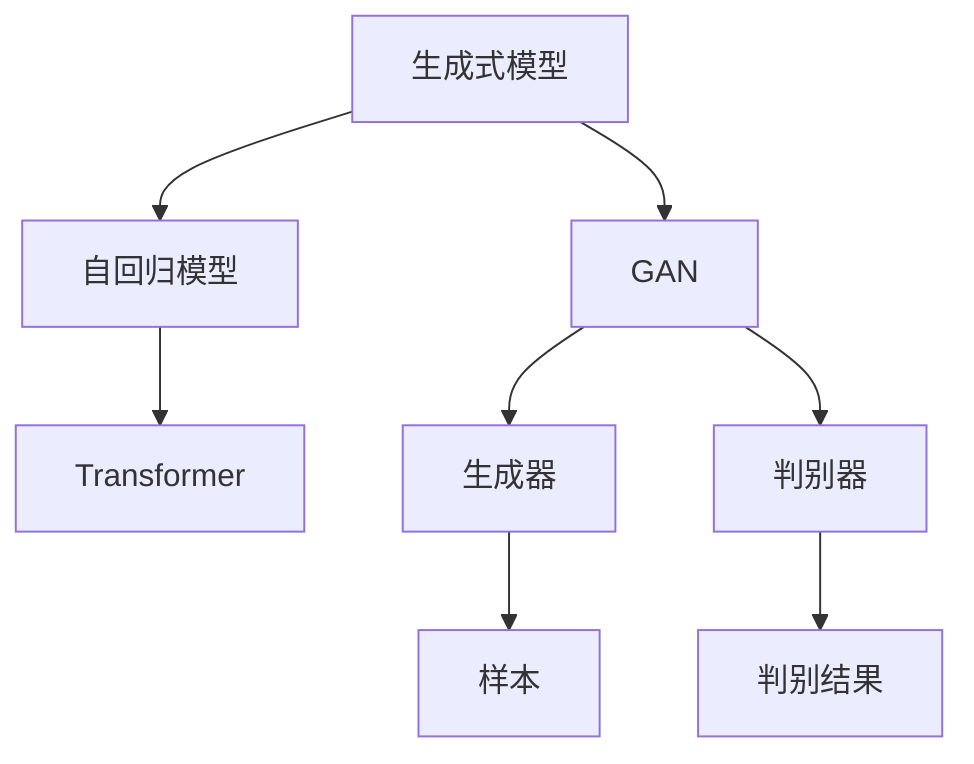

                 

# 生成式AI：技术革新与伦理挑战并存

> 关键词：生成式AI, 深度学习, 迁移学习, 自然语言处理, 图像生成, 伦理安全, 模型压缩

## 1. 背景介绍

### 1.1 问题由来
近年来，生成式人工智能（Generative AI）技术取得了飞速发展。尤其是基于深度学习和大规模数据训练的生成模型，在图像、文本、音频等多种形式的数据生成上，取得了令人瞩目的成果。这些模型包括但不限于GAN、变分自编码器、自回归模型等，能够从无到有生成高质量的新数据，广泛应用在艺术创作、内容生成、智能推荐等多个领域。

生成式AI技术的兴起，不仅极大提升了人工智能在创意与内容生产上的能力，还带来了产业应用、社会伦理等多维度的深远影响。然而，这种技术的迅猛发展，也带来了诸多新的挑战和问题，特别是在伦理与安全领域。本文将系统介绍生成式AI技术的核心概念与原理，并探讨其在实际应用中的技术创新与伦理挑战。

### 1.2 问题核心关键点
生成式AI技术的核心在于通过深度学习模型，从大量数据中学习生成数据的规则，进而能够生成新数据，这种技术通常基于神经网络结构和优化算法进行训练。

技术的核心问题包括：

1. 如何高效训练大模型？
2. 如何提升生成质量与多样性？
3. 如何控制生成过程的公平性？
4. 如何确保生成内容的真实性与合法性？

本文将从这些问题入手，全面系统地探讨生成式AI技术。

## 2. 核心概念与联系

### 2.1 核心概念概述

生成式AI是指通过深度学习模型，生成具有一定创造性和规律性的新数据，包括但不限于文本、图像、音频等形式。以下是几个核心的概念：

- **生成式模型（Generative Models）**：一类基于深度学习的模型，能够学习数据分布，并生成符合该分布的新数据。主要包括GAN、变分自编码器等。
- **自回归模型（Auto-Regressive Models）**：一种能够基于前文生成后文的模型，如Transformer模型。
- **迁移学习（Transfer Learning）**：利用已有模型在特定任务上的知识，通过微调等方式，提升在新任务上的性能。
- **对抗训练（Adversarial Training）**：通过加入对抗样本，提升模型的鲁棒性。
- **生成式对抗网络（Generative Adversarial Networks, GAN）**：由生成器和判别器两部分组成的模型，通过对抗训练提升生成质量。
- **变分自编码器（Variational Autoencoders, VAE）**：一种基于生成概率模型的自编码器，可以生成与输入数据分布相似的新数据。

这些概念之间相互关联，共同构成了生成式AI的核心框架，帮助模型学习并生成高质量的新数据。

### 2.2 核心概念原理和架构的 Mermaid 流程图



此流程图展示了生成式AI的核心架构，通过不同的模型与算法，学习并生成高质量的新数据。其中，自回归模型和GAN是最常用的生成模型，分别通过不同的方式学习数据分布。

## 3. 核心算法原理 & 具体操作步骤
### 3.1 算法原理概述

生成式AI的核心算法原理主要包括自回归生成和生成对抗网络。

**自回归生成**：通过模型学习数据的前文，生成符合概率分布的后文。如Transformer模型，利用自回归机制，能够生成流畅自然的文本。

**生成对抗网络**：通过生成器和判别器两部分的对抗训练，提升生成质量。生成器学习生成新数据，判别器学习区分真实数据和生成数据。训练过程中，两者互相博弈，提升生成器的生成能力。

### 3.2 算法步骤详解

**自回归生成步骤**：
1. 数据预处理：将输入数据转化为模型可接受的格式，如文本数据转化为token序列。
2. 模型初始化：选择适当的模型结构，如Transformer，进行模型初始化。
3. 数据编码：将输入数据输入模型，得到编码表示。
4. 生成过程：利用编码表示和自回归机制，生成下一个token，不断重复该过程，直至生成完整序列。

**生成对抗网络步骤**：
1. 数据准备：收集足够多的真实数据作为训练集。
2. 模型初始化：生成器和判别器初始化。
3. 对抗训练：在每轮训练中，生成器尝试生成高质量的新数据，判别器尝试区分真实数据和生成数据。
4. 模型更新：通过梯度下降等优化算法，更新生成器和判别器参数，提升生成质量和判别能力。

### 3.3 算法优缺点

**生成式AI的优点**：
1. 生成质量高：能够生成高质量、自然流畅的新数据。
2. 应用广泛：在艺术创作、内容生成、智能推荐等领域有广泛应用。
3. 模型多样：有多种生成模型可供选择，适应不同的生成任务。

**生成式AI的缺点**：
1. 生成过程复杂：需要大量计算资源，训练时间较长。
2. 对抗攻击敏感：生成对抗网络模型对对抗样本敏感，容易受到攻击。
3. 公平性与多样性控制难度高：生成模型容易陷入模式偏移，生成内容缺乏多样性。
4. 数据隐私问题：生成的数据可能包含敏感信息，存在隐私泄露的风险。

### 3.4 算法应用领域

生成式AI在多个领域都有广泛应用，以下是几个典型领域：

- **自然语言处理（NLP）**：通过生成式模型，能够自动生成文本摘要、对话、情感分析等。
- **计算机视觉（CV）**：生成对抗网络在图像生成、图像增强等方面有广泛应用。
- **音频生成**：变分自编码器等模型在音频生成、音乐创作方面表现出色。
- **推荐系统**：生成式模型能够生成个性化推荐内容，提升用户体验。
- **艺术创作**：生成模型在绘画、设计、音乐等领域有广泛应用。

这些应用展示了生成式AI的强大能力，但也带来了新的挑战和问题。

## 4. 数学模型和公式 & 详细讲解 & 举例说明

### 4.1 数学模型构建

生成式AI的数学模型构建主要依赖于深度学习理论，尤其是概率模型和自回归模型。

**自回归模型**：通过自回归机制，学习数据分布，生成新数据。模型通常基于Transformer结构。假设模型输入为序列 $x=(x_1,x_2,...,x_T)$，输出为序列 $y=(y_1,y_2,...,y_T)$，则模型可以表示为：

$$
y_t = \sum_k w_k y_{t-k} + b_t
$$

其中 $w_k$ 和 $b_t$ 为模型的可训练参数，通过优化算法（如AdamW）进行学习。

**生成对抗网络**：由生成器 $G$ 和判别器 $D$ 两部分组成，训练过程可以表示为：

$$
\min_G \max_D V(G,D) = \mathbb{E}_{x \sim p(x)} [\log D(x)] + \mathbb{E}_{z \sim p(z)} [\log (1-D(G(z)))]
$$

其中 $p(x)$ 为真实数据分布，$G(z)$ 为生成器生成的新数据，$D$ 为判别器，$V$ 为生成对抗损失函数。

### 4.2 公式推导过程

以自回归模型为例，推导其生成过程。假设输入序列 $x=(x_1,x_2,...,x_T)$，输出序列 $y=(y_1,y_2,...,y_T)$，则模型可以表示为：

$$
y_t = \sum_k w_k y_{t-k} + b_t
$$

将 $y_t$ 替换为条件概率 $p(y_t|y_{t-1},...,y_1)$，得到：

$$
p(y_t|y_{t-1},...,y_1) = \sum_k w_k p(y_{t-k}|y_{t-1},...,y_1)
$$

通过递归方式，可以得到模型生成的条件概率分布。

### 4.3 案例分析与讲解

以图像生成为例，介绍GAN模型的训练过程。假设模型由生成器 $G$ 和判别器 $D$ 两部分组成，训练过程可以表示为：

1. 数据准备：收集真实图像数据作为训练集。
2. 模型初始化：生成器和判别器初始化。
3. 对抗训练：在每轮训练中，生成器尝试生成高质量的新图像，判别器尝试区分真实图像和生成图像。
4. 模型更新：通过梯度下降等优化算法，更新生成器和判别器参数，提升生成质量和判别能力。

## 5. 项目实践：代码实例和详细解释说明

### 5.1 开发环境搭建

生成式AI的实现需要深度学习框架的支持，如PyTorch、TensorFlow等。以下是Python环境搭建的简单步骤：

1. 安装Anaconda：
```bash
conda install anaconda
```
2. 创建虚拟环境：
```bash
conda create --name pytorch-env python=3.8
conda activate pytorch-env
```
3. 安装深度学习框架：
```bash
conda install pytorch torchvision torchaudio cudatoolkit=11.1 -c pytorch -c conda-forge
```

### 5.2 源代码详细实现

以下是一个简单的自回归文本生成代码示例：

```python
import torch
from torch import nn

class RNN(nn.Module):
    def __init__(self, input_size, hidden_size, output_size):
        super(RNN, self).__init__()
        self.hidden_size = hidden_size
        self.i2h = nn.Linear(input_size + hidden_size, hidden_size)
        self.i2o = nn.Linear(input_size + hidden_size, output_size)
        self.softmax = nn.Softmax(dim=1)

    def forward(self, input, hidden):
        combined = torch.cat((input, hidden), 1)
        hidden = self.i2h(combined)
        output = self.i2o(combined)
        output = self.softmax(output)
        return output, hidden

    def initHidden(self):
        return torch.zeros(1, 1, self.hidden_size)

def main():
    input_size = 10
    hidden_size = 5
    output_size = 5
    model = RNN(input_size, hidden_size, output_size)
    model.train()
    optimizer = torch.optim.Adam(model.parameters(), lr=0.01)
    criterion = nn.CrossEntropyLoss()

    input = torch.randn(1, 1, input_size)
    hidden = model.initHidden()
    for i in range(100):
        output, hidden = model(input, hidden)
        optimizer.zero_grad()
        loss = criterion(output, target)
        loss.backward()
        optimizer.step()
        print(loss.item())

if __name__ == '__main__':
    main()
```

### 5.3 代码解读与分析

**RNN类**：定义自回归模型，包括隐藏层和输出层，并实现前向传播和损失计算。

**main函数**：训练自回归模型，使用交叉熵损失函数，并使用Adam优化器进行参数更新。

**代码运行**：通过输入数据和目标标签，进行模型训练，并打印损失值。

## 6. 实际应用场景

### 6.1 艺术创作

生成式AI在艺术创作领域有着广泛的应用，如自动绘画、音乐创作等。通过生成对抗网络等模型，艺术家可以生成独特的艺术作品，推动艺术的创新与多样化。

### 6.2 内容生成

生成式AI在内容生成领域有广泛应用，如生成新闻、广告文案、视频等。通过自回归模型，可以快速生成高质量的内容，提高内容生产的效率和多样性。

### 6.3 个性化推荐

生成式AI在个性化推荐系统中有重要应用，如推荐系统生成个性化推荐内容，提升用户体验。通过生成模型，能够生成符合用户偏好的内容，提高推荐效果。

### 6.4 未来应用展望

未来，生成式AI将有更广泛的应用前景：

- **智能交互**：生成式AI将提升人机交互的自然性和多样性，推动智能助手、聊天机器人等应用的发展。
- **医疗健康**：生成式AI在医学影像分析、虚拟试药等应用中将有重要应用，推动医疗健康产业的发展。
- **智能制造**：生成式AI在产品设计、生产计划优化等领域有广泛应用，提升制造业的智能化水平。
- **金融服务**：生成式AI在金融风险管理、智能投顾等领域有重要应用，提升金融服务的效率和质量。

## 7. 工具和资源推荐

### 7.1 学习资源推荐

1. **Coursera**：提供深度学习和生成式AI的课程，如Andrew Ng的《Deep Learning Specialization》。
2. **Deep Learning with PyTorch**：开源书籍，介绍了深度学习和生成式AI的实现。
3. **Arxiv**：最新的深度学习论文，涵盖生成式AI的各个方面。
4. **Udacity**：提供深度学习和生成式AI的纳米学位课程。
5. **Kaggle**：数据科学竞赛平台，包含生成式AI相关的竞赛和项目。

### 7.2 开发工具推荐

1. **PyTorch**：深度学习框架，支持自回归模型和生成对抗网络。
2. **TensorFlow**：深度学习框架，支持生成式AI的实现。
3. **JAX**：高性能计算库，支持自动微分和深度学习模型的实现。
4. **Hugging Face Transformers**：支持生成式AI的库，包含多种生成模型。
5. **TensorBoard**：可视化工具，用于监控和调试生成模型。

### 7.3 相关论文推荐

1. **Generative Adversarial Nets**：Ian Goodfellow等，生成对抗网络的经典论文。
2. **Generative Story of GAN**：Goodfellow等，关于生成对抗网络的研究综述。
3. **Neural Text Generation with Sequence-to-Sequence RNNs**：Ian Goodfellow等，关于自回归模型的经典论文。
4. **VAE**：Diederik Kingma等，变分自编码器的经典论文。
5. **Attention is All You Need**：Ashish Vaswani等，Transformer模型的经典论文。

## 8. 总结：未来发展趋势与挑战

### 8.1 研究成果总结

生成式AI技术的快速发展，推动了深度学习模型在创意和内容生成上的突破。然而，随着技术的发展，伦理和安全问题也逐渐显现，成为制约其发展的重要因素。

### 8.2 未来发展趋势

未来，生成式AI将有更广泛的应用前景，主要趋势包括：

1. **模型规模增大**：随着算力成本的下降，预训练模型的规模将不断增大，生成质量将进一步提升。
2. **生成过程优化**：通过优化生成过程，减少对抗攻击风险，提升生成内容的公平性和多样性。
3. **跨模态生成**：将生成式AI应用于跨模态数据，如多模态生成、跨媒体生成等。
4. **实时生成**：通过优化模型结构和计算图，实现实时生成，提升用户体验。
5. **联邦生成**：在分布式环境中，通过联邦学习等技术，实现数据的本地化处理和生成。

### 8.3 面临的挑战

尽管生成式AI有广阔的应用前景，但在实际应用中仍面临诸多挑战：

1. **计算资源限制**：生成式AI需要大量计算资源，如何优化模型和训练过程，提升效率，是一个重要的研究方向。
2. **伦理和安全问题**：生成模型可能生成虚假信息，如何防止生成内容的真实性与合法性，是一个亟需解决的问题。
3. **多样性和公平性**：生成模型容易陷入模式偏移，生成内容缺乏多样性和公平性，如何优化生成过程，提升多样性和公平性，是一个重要的研究方向。
4. **数据隐私问题**：生成的数据可能包含敏感信息，如何保护数据隐私，是一个亟需解决的问题。
5. **可解释性问题**：生成式模型通常缺乏可解释性，如何赋予模型更强的可解释性，是一个重要的研究方向。

### 8.4 研究展望

未来的研究方向将集中在以下几个方面：

1. **生成模型的优化**：通过优化模型结构和训练过程，提升生成质量与效率。
2. **伦理与安全研究**：研究生成内容的真实性与合法性，确保生成过程的伦理和安全。
3. **生成内容的多样性与公平性**：研究生成内容的多样性与公平性，提升模型的公平性和多样性。
4. **数据隐私保护**：研究如何保护生成数据中的隐私信息，确保数据安全。
5. **生成模型的可解释性**：研究生成模型的可解释性，提高模型的透明度和可理解性。

通过这些研究，可以更好地应对生成式AI技术在实际应用中面临的挑战，推动生成式AI技术的不断进步。

## 9. 附录：常见问题与解答

### Q1: 什么是生成式AI？

A: 生成式AI是指通过深度学习模型，从大量数据中学习生成数据的规则，进而生成新数据的技术。

### Q2: 生成式AI与判别式AI的区别是什么？

A: 生成式AI通过生成器学习数据分布，生成新数据；而判别式AI通过判别器学习数据分布，区分真实数据和生成数据。

### Q3: 如何控制生成内容的质量和多样性？

A: 通过优化生成器参数、引入对抗训练、引入多样性约束等方法，可以控制生成内容的质量和多样性。

### Q4: 生成式AI是否存在伦理和安全问题？

A: 生成式AI可能生成虚假信息，带来伦理和安全问题，因此需要严格监管和规范其应用。

### Q5: 生成式AI的发展方向是什么？

A: 未来，生成式AI将向规模化、高效化、多样化、安全性等方向发展，提升其在各个领域的实际应用。

---

作者：禅与计算机程序设计艺术 / Zen and the Art of Computer Programming

