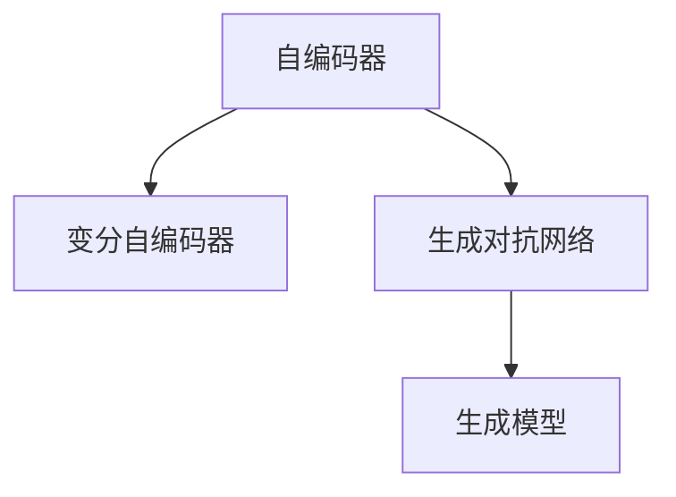

                 

# 生成式AI：金矿还是泡沫？第二部分：AI不是万能药

## 1. 背景介绍

### 1.1 问题由来

生成式人工智能（Generative AI）是AI领域的又一个技术热点。基于深度学习的生成式模型能够自动生成文本、图像、音频等各类媒体内容，其应用潜力巨大，引发了业界的广泛关注。

然而，在过度吹捧和实际效果之间，存在不小的落差。生成式AI在早期落地时，面临着诸多问题，如生成的内容质量不稳定、模型训练成本高、应用场景受限等。这些问题引起了业内外人士的广泛讨论，有人认为生成式AI是未来的金矿，有人则质疑其为泡沫。

本文将从生成式AI的核心概念、发展历程、主要技术、应用场景以及未来趋势等方面，全面解析生成式AI的价值和风险，探讨其在现实世界中的地位和作用。

### 1.2 问题核心关键点

生成式AI的核心在于生成模型的训练与使用。其核心技术包括自编码器（Autoencoder）、变分自编码器（Variational Autoencoder）、生成对抗网络（Generative Adversarial Networks, GANs）等。这些模型通过学习大量真实数据，构建生成模型，以生成与原始数据相似但完全独立的新数据。

生成式AI的应用包括但不限于：
- 图像生成：生成逼真图像，如GANs用于人脸生成、风格迁移等。
- 文本生成：生成连贯自然的文本，如循环神经网络（RNN）和变分自编码器用于文本生成、机器翻译等。
- 语音生成：生成逼真的语音，如WaveNet、Tacotron等用于语音合成。

生成式AI面临的挑战包括：
- 训练成本高：大模型的训练通常需要耗费大量时间和计算资源。
- 模型泛化性差：生成模型往往对训练数据的分布过于敏感，泛化到新数据上的表现可能不佳。
- 模型可解释性弱：生成模型通常被视为黑盒，难以解释其内部生成过程。
- 生成内容质量不稳定：不同模型的性能波动较大，生成的内容质量不稳定。

## 2. 核心概念与联系

### 2.1 核心概念概述

要深入理解生成式AI，首先需要掌握一些核心概念：

- **生成模型（Generative Models）**：通过学习大量数据，构建生成模型，能够生成与真实数据相似但完全独立的新数据。
- **自编码器（Autoencoder）**：通过压缩编码与解码，实现数据的重建。自编码器主要用于特征提取，也可以用于生成。
- **变分自编码器（Variational Autoencoder, VAE）**：在自编码器的基础上，加入变分推断框架，能够生成连续的数据分布。
- **生成对抗网络（GANs）**：通过生成器和判别器的对抗训练，生成逼真的新数据。

这些概念之间的逻辑关系可以通过以下Mermaid流程图来展示：



这个流程图展示了自己编码器、变分自编码器和生成对抗网络之间的联系：

- 自编码器是生成模型的一种形式，通过压缩编码和解码实现数据的重建。
- 变分自编码器在自编码器的基础上，加入了变分推断框架，能够生成连续的数据分布。
- 生成对抗网络通过生成器和判别器的对抗训练，生成逼真的新数据。

这些生成模型在生成式AI中扮演着重要的角色，形成了生成式AI的生成框架。

## 3. 核心算法原理 & 具体操作步骤

### 3.1 算法原理概述

生成式AI的核心算法原理主要是通过训练生成模型，学习数据分布，进而生成新的数据。

- **自编码器**：通过训练自编码器，学习数据的潜在特征表示。编码器将输入数据压缩为潜在的特征向量，解码器则将这些特征向量还原为原始数据。自编码器的目标是最小化重构误差，即输入数据与输出数据之间的差距。

- **变分自编码器**：变分自编码器通过引入变分推断框架，能够生成连续的数据分布。编码器将输入数据映射到潜在特征空间，解码器则将这些特征向量生成新的数据。变分自编码器的目标是最小化重构误差和KL散度，即生成数据与真实数据分布之间的差异。

- **生成对抗网络**：生成对抗网络通过对抗训练，生成逼真的新数据。生成器负责生成伪造数据，判别器负责区分真实数据和伪造数据。生成器和判别器之间通过对抗训练，逐渐提升生成器的生成能力，使得生成数据越来越逼真。

### 3.2 算法步骤详解

生成式AI的训练过程大致分为以下几个步骤：

1. **数据准备**：收集并清洗数据集，准备好训练生成模型所需的数据。

2. **模型设计**：选择合适的生成模型，并设计模型结构。对于自编码器，设计编码器和解码器；对于变分自编码器，设计编码器和解码器；对于生成对抗网络，设计生成器和判别器。

3. **模型训练**：使用训练数据集，对生成模型进行训练。自编码器的目标是最小化重构误差；变分自编码器的目标是最小化重构误差和KL散度；生成对抗网络的目标是最大化判别器的损失函数，最小化生成器的损失函数。

4. **模型评估**：使用验证数据集，评估生成模型的性能。对于自编码器和变分自编码器，计算重构误差和KL散度；对于生成对抗网络，评估生成数据的逼真度和多样性。

5. **模型应用**：使用训练好的生成模型，生成新的数据。对于自编码器和变分自编码器，使用编码器将新数据映射到潜在特征空间，再使用解码器生成新数据；对于生成对抗网络，使用生成器生成新数据。

### 3.3 算法优缺点

生成式AI的优点包括：

- **数据生成**：生成式AI能够自动生成大量新数据，降低数据获取成本。
- **多样性**：生成式AI能够生成多种风格和形式的数据，丰富数据集。
- **自动化**：生成式AI能够自动化生成数据，减少人工干预。

生成式AI的缺点包括：

- **训练成本高**：生成式AI的模型训练通常需要耗费大量时间和计算资源。
- **泛化性差**：生成模型对训练数据的分布过于敏感，泛化到新数据上的表现可能不佳。
- **可解释性弱**：生成模型通常被视为黑盒，难以解释其内部生成过程。
- **生成内容质量不稳定**：不同模型的性能波动较大，生成的内容质量不稳定。

### 3.4 算法应用领域

生成式AI在多个领域具有广泛的应用前景：

- **图像生成**：用于图像修复、风格迁移、人脸生成等。
- **文本生成**：用于自动生成文章、对话、摘要等。
- **语音生成**：用于语音合成、文本转语音等。
- **游戏开发**：用于生成游戏角色、场景、物品等。
- **医疗领域**：用于生成医疗影像、病历等。

## 4. 数学模型和公式 & 详细讲解 & 举例说明

### 4.1 数学模型构建

生成式AI的数学模型主要基于概率生成模型和变分生成模型。

- **概率生成模型**：通过学习数据的概率分布，生成新数据。常见的方法包括隐马尔可夫模型（HMM）、条件随机场（CRF）、高斯混合模型（GMM）等。

- **变分生成模型**：通过学习数据的变分分布，生成新数据。常见的方法包括变分自编码器（VAE）、变分自回归模型（VAR）等。

### 4.2 公式推导过程

以变分自编码器为例，其核心公式如下：

- **编码器**：将输入数据 $x$ 编码到潜在特征空间 $z$，即 $z=f(x)$。
- **解码器**：将潜在特征 $z$ 解码为输出数据 $\hat{x}$，即 $\hat{x}=g(z)$。

变分自编码器的目标是最小化重构误差和KL散度：

$$
\min_{f,g} \mathbb{E}_{p(x)}[\mathbb{E}_{q(z|x)}[\log p(x|z)]+\mathbb{E}_{q(z|x)}[\log q(z)]-\mathbb{E}_{p(z)}[\log q(z)]
$$

其中，$p(x)$ 表示真实数据的分布，$q(z|x)$ 表示潜在特征的分布，$p(x|z)$ 表示输出数据的条件分布，$q(z)$ 表示潜在特征的先验分布。

### 4.3 案例分析与讲解

以GANs为例，GANs的生成器 $G$ 和判别器 $D$ 之间的对抗训练过程如下：

- **生成器**：生成器 $G$ 将随机噪声 $z$ 映射为伪造数据 $x'$，即 $x' = G(z)$。
- **判别器**：判别器 $D$ 判断数据 $x'$ 是真实数据还是伪造数据，即 $D(x')$。
- **对抗训练**：生成器和判别器交替训练，生成器的目标是最大化 $D(x')$，判别器的目标是最大化 $D(x)$ 和最小化 $D(x')$。

生成器 $G$ 的优化目标是最小化 $D(x')$，即：

$$
\min_G \mathbb{E}_{p(z)}[\log D(G(z))]
$$

判别器 $D$ 的优化目标是最小化 $D(x)$ 和最大化 $D(x')$，即：

$$
\max_D \mathbb{E}_{p(x)}[\log D(x)] + \mathbb{E}_{p(z)}[\log (1-D(G(z))]
$$

通过不断迭代训练，生成器和判别器逐渐提升各自的性能，使得生成器生成的伪造数据越来越逼真。

## 5. 项目实践：代码实例和详细解释说明

### 5.1 开发环境搭建

在进行生成式AI的开发前，需要先准备好开发环境。以下是使用Python进行PyTorch开发的环境配置流程：

1. 安装Anaconda：从官网下载并安装Anaconda，用于创建独立的Python环境。

2. 创建并激活虚拟环境：
```bash
conda create -n pytorch-env python=3.8 
conda activate pytorch-env
```

3. 安装PyTorch：根据CUDA版本，从官网获取对应的安装命令。例如：
```bash
conda install pytorch torchvision torchaudio cudatoolkit=11.1 -c pytorch -c conda-forge
```

4. 安装TensorBoard：
```bash
pip install tensorboard
```

5. 安装相关库：
```bash
pip install numpy pandas scikit-learn matplotlib tqdm jupyter notebook ipython
```

完成上述步骤后，即可在`pytorch-env`环境中开始生成式AI的实践。

### 5.2 源代码详细实现

这里以生成式对抗网络（GANs）为例，给出使用PyTorch实现GANs的代码示例。

```python
import torch
import torch.nn as nn
import torch.optim as optim
import torchvision
from torchvision import transforms
from torchvision.utils import save_image

# 定义生成器
class Generator(nn.Module):
    def __init__(self):
        super(Generator, self).__init__()
        self.main = nn.Sequential(
            nn.ConvTranspose2d(100, 256, 4, 1, 0, bias=False),
            nn.BatchNorm2d(256),
            nn.ReLU(True),
            nn.ConvTranspose2d(256, 128, 4, 2, 1, bias=False),
            nn.BatchNorm2d(128),
            nn.ReLU(True),
            nn.ConvTranspose2d(128, 64, 4, 2, 1, bias=False),
            nn.BatchNorm2d(64),
            nn.ReLU(True),
            nn.ConvTranspose2d(64, 3, 4, 2, 1, bias=False),
            nn.Tanh()
        )
    
    def forward(self, input):
        return self.main(input)

# 定义判别器
class Discriminator(nn.Module):
    def __init__(self):
        super(Discriminator, self).__init__()
        self.main = nn.Sequential(
            nn.Conv2d(3, 64, 4, 2, 1, bias=False),
            nn.LeakyReLU(0.2, inplace=True),
            nn.Conv2d(64, 128, 4, 2, 1, bias=False),
            nn.BatchNorm2d(128),
            nn.LeakyReLU(0.2, inplace=True),
            nn.Conv2d(128, 256, 4, 2, 1, bias=False),
            nn.BatchNorm2d(256),
            nn.LeakyReLU(0.2, inplace=True),
            nn.Conv2d(256, 1, 4, 1, 0, bias=False),
            nn.Sigmoid()
        )
    
    def forward(self, input):
        return self.main(input)

# 定义GAN模型
class GAN(nn.Module):
    def __init__(self):
        super(GAN, self).__init__()
        self.G = Generator()
        self.D = Discriminator()
    
    def forward(self, input):
        fake = self.G(input)
        real = input
        validity = self.D(fake)
        return fake, validity
    
    def train(self, real_images, batch_size, n_epochs):
        real_images = real_images.view(-1, 1, 28, 28).to(device)
        optimizer_G = optim.Adam(self.G.parameters(), lr=0.0002)
        optimizer_D = optim.Adam(self.D.parameters(), lr=0.0002)
        for epoch in range(n_epochs):
            real_images = real_images.to(device)
            batch_idx = 0
            while batch_idx * batch_size < real_images.size(0):
                batch_real_images = real_images[batch_idx * batch_size:(batch_idx + 1) * batch_size]
                batch_real_images = batch_real_images.to(device)
                optimizer_G.zero_grad()
                optimizer_D.zero_grad()
                fake = self.G(batch_real_images)
                validity = self.D(fake)
                real = batch_real_images
                fake_loss = -torch.mean(torch.log(self.D(fake)))
                real_loss = -torch.mean(torch.log(self.D(real)))
                fake_loss.backward(torch.ones_like(fake_loss))
                real_loss.backward(torch.ones_like(real_loss))
                optimizer_G.step()
                optimizer_D.step()
                batch_idx += 1
            if (epoch + 1) % 50 == 0:
                save_image(denorm(fake).detach().cpu(), "gan_out_epoch_{}.png".format(epoch + 1))
```

### 5.3 代码解读与分析

让我们再详细解读一下关键代码的实现细节：

**Generator类**：
- 定义了生成器的结构，包括多个卷积层和激活函数。
- 实现前向传播，将随机噪声映射为生成图像。

**Discriminator类**：
- 定义了判别器的结构，包括多个卷积层和激活函数。
- 实现前向传播，判断输入图像是真实图像还是伪造图像。

**GAN类**：
- 定义了GAN模型，包括生成器和判别器。
- 实现前向传播，将随机噪声映射为生成图像，并判断其真实性。
- 实现训练过程，通过对抗训练提升生成器和判别器的性能。

**train方法**：
- 定义训练过程，包括生成器和判别器的更新。
- 使用优化器优化生成器和判别器的参数。
- 在每个epoch结束时，保存生成的图像。

可以看到，PyTorch的强大封装使得GAN的实现变得简洁高效。开发者可以将更多精力放在模型改进、数据处理等高层逻辑上，而不必过多关注底层的实现细节。

## 6. 实际应用场景

### 6.1 图像生成

生成式AI在图像生成领域具有广泛的应用前景。常见的应用包括人脸生成、风格迁移、艺术创作等。GANs是最常用的生成模型之一，能够生成高质量的伪造图像。

以GANs用于人脸生成为例，具体步骤如下：
1. 收集并准备数据集，如LFW人脸数据集。
2. 使用GANs模型对数据集进行训练，生成逼真的人脸图像。
3. 在测试集上评估生成图像的质量和多样性。
4. 将生成图像应用到其他场景中，如人脸识别、增强现实等。

### 6.2 文本生成

生成式AI在文本生成领域同样具有广泛的应用前景。常见的应用包括自动生成文章、对话、摘要等。变分自编码器是常用的生成模型之一，能够生成连贯自然的文本。

以变分自编码器用于文本生成为例，具体步骤如下：
1. 收集并准备数据集，如新闻文章、对话记录等。
2. 使用变分自编码器模型对数据集进行训练，生成逼真的文本。
3. 在测试集上评估生成文本的质量和连贯性。
4. 将生成文本应用到其他场景中，如自动摘要、智能客服等。

### 6.3 未来应用展望

随着生成式AI技术的不断进步，未来其在多个领域的应用前景更加广阔：

- **医疗领域**：用于生成医疗影像、病历、药物分子等。
- **金融领域**：用于生成市场数据、金融报告等。
- **艺术创作**：用于生成艺术作品、音乐等。
- **游戏开发**：用于生成游戏角色、场景、物品等。

生成式AI将在更多领域发挥重要作用，为人类创造更多的价值。

## 7. 工具和资源推荐

### 7.1 学习资源推荐

为了帮助开发者系统掌握生成式AI的理论基础和实践技巧，这里推荐一些优质的学习资源：

1. **《深度学习》书籍**：Ian Goodfellow等著，全面介绍了深度学习的基本概念和前沿技术。
2. **《生成对抗网络》书籍**：Ian Goodfellow等著，详细讲解了GANs的原理和实现方法。
3. **Stanford CS231n课程**：斯坦福大学开设的深度学习课程，有Lecture视频和配套作业，带你入门深度学习领域的基本概念和经典模型。
4. **GANs教程**：由DeepLearning.AI提供的生成对抗网络教程，系统讲解了GANs的原理和实现。
5. **Transformers库**：HuggingFace开发的NLP工具库，集成了众多SOTA生成模型，支持PyTorch和TensorFlow，是进行生成式AI开发的利器。

通过对这些资源的学习实践，相信你一定能够快速掌握生成式AI的精髓，并用于解决实际的NLP问题。

### 7.2 开发工具推荐

高效的开发离不开优秀的工具支持。以下是几款用于生成式AI开发的常用工具：

1. **PyTorch**：基于Python的开源深度学习框架，灵活动态的计算图，适合快速迭代研究。
2. **TensorFlow**：由Google主导开发的开源深度学习框架，生产部署方便，适合大规模工程应用。
3. **TensorBoard**：TensorFlow配套的可视化工具，可实时监测模型训练状态，并提供丰富的图表呈现方式。
4. **Weights & Biases**：模型训练的实验跟踪工具，可以记录和可视化模型训练过程中的各项指标。
5. **Jupyter Notebook**：Jupyter Notebook提供了强大的交互式编程环境，方便开发和调试生成式AI模型。

合理利用这些工具，可以显著提升生成式AI开发的效率，加快创新迭代的步伐。

### 7.3 相关论文推荐

生成式AI的发展源于学界的持续研究。以下是几篇奠基性的相关论文，推荐阅读：

1. **ImageNet Large Scale Visual Recognition Challenge (ILSVRC)**：Alex Krizhevsky等著，提出了深度卷积神经网络（CNN）模型，奠定了深度学习在图像识别领域的地位。
2. **Generative Adversarial Nets (GANs)**：Ian Goodfellow等著，提出了生成对抗网络，解决了生成式模型的不稳定问题。
3. **Variational Autoencoder (VAE)**：Diederik P Kingma等著，提出了变分自编码器，能够生成连续的数据分布。
4. **Auto-Encoding Variational Bayes (AEVB)**：Diederik P Kingma等著，提出了变分推断方法，用于优化生成式模型。

这些论文代表了大生成式AI的发展脉络。通过学习这些前沿成果，可以帮助研究者把握学科前进方向，激发更多的创新灵感。

## 8. 总结：未来发展趋势与挑战

### 8.1 总结

本文对生成式AI的核心概念、发展历程、主要技术、应用场景以及未来趋势等方面，全面解析了生成式AI的价值和风险。生成式AI在图像生成、文本生成等领域展现了巨大的潜力，但也面临着诸如训练成本高、泛化性差、可解释性弱等问题。

通过本文的系统梳理，可以看到，生成式AI正在成为AI领域的重要范式，极大地拓展了深度学习的应用边界，催生了更多的落地场景。未来，伴随生成式AI技术的不断演进，相信其在各个领域的创新应用将带来更多的变革性影响。

### 8.2 未来发展趋势

生成式AI的未来发展趋势如下：

1. **模型规模不断增大**：随着算力成本的下降和数据规模的扩张，生成式AI模型的参数量还将持续增长，生成模型的表现将进一步提升。
2. **生成内容质量不断提高**：随着生成对抗网络（GANs）等技术的不断优化，生成式AI生成内容的真实度和多样性将进一步提高。
3. **应用领域不断扩展**：生成式AI将在医疗、金融、艺术等更多领域发挥重要作用，为人类创造更多的价值。
4. **算法效率不断优化**：随着模型压缩、稀疏化存储等技术的发展，生成式AI的训练和推理效率将进一步提升。
5. **可解释性不断增强**：随着生成式AI的可解释性技术不断发展，生成式AI模型的内部生成过程将逐步透明化。

### 8.3 面临的挑战

尽管生成式AI技术已经取得了显著进展，但在走向大规模应用的过程中，仍面临着诸多挑战：

1. **训练成本高**：生成式AI的模型训练通常需要耗费大量时间和计算资源，如何降低训练成本仍是一个重要问题。
2. **泛化性差**：生成式AI模型对训练数据的分布过于敏感，泛化到新数据上的表现可能不佳。
3. **可解释性弱**：生成式AI模型通常被视为黑盒，难以解释其内部生成过程，可解释性有待提高。
4. **生成内容质量不稳定**：不同生成模型的性能波动较大，生成的内容质量不稳定。

### 8.4 研究展望

面对生成式AI面临的挑战，未来的研究需要在以下几个方面寻求新的突破：

1. **训练效率优化**：开发更加高效的生成模型训练算法，如稀疏化训练、分布式训练等，降低训练成本。
2. **泛化性提升**：开发更加鲁棒的生成模型，通过数据增强、对抗训练等技术，提升模型的泛化性能。
3. **可解释性增强**：开发生成式AI的可解释性技术，如生成式对抗网络（GANs）的对抗训练、变分自编码器（VAE）的生成过程可视化等。
4. **生成内容质量提升**：开发更加稳定的生成模型，通过模型结构优化、数据增强等技术，提升生成内容的真实度和多样性。
5. **应用场景拓展**：将生成式AI应用到更多的领域，如医疗、金融、艺术等，为人类创造更多的价值。

总之，生成式AI技术在未来将迎来更多的创新突破，为人类创造更多的价值。相信随着学界和产业界的共同努力，这些挑战终将一一被克服，生成式AI必将在构建人机协同的智能时代中扮演越来越重要的角色。

## 9. 附录：常见问题与解答

**Q1：生成式AI的训练成本高吗？**

A: 是的，生成式AI的模型训练通常需要耗费大量时间和计算资源。大模型的训练过程通常需要GPU或TPU等高性能设备，对算力要求较高。此外，模型的大小和复杂度也会影响训练效率。

**Q2：生成式AI的泛化性能如何？**

A: 生成式AI模型对训练数据的分布过于敏感，泛化到新数据上的表现可能不佳。为了提高泛化性能，可以采用数据增强、对抗训练等技术，增加模型对新数据的适应能力。

**Q3：生成式AI的可解释性如何？**

A: 生成式AI模型通常被视为黑盒，难以解释其内部生成过程。为了提高可解释性，可以采用生成对抗网络（GANs）的对抗训练、变分自编码器（VAE）的生成过程可视化等技术。

**Q4：生成式AI的生成内容质量如何？**

A: 生成式AI的生成内容质量不稳定，不同生成模型的性能波动较大。为了提高生成内容的质量，可以采用模型结构优化、数据增强等技术，提升生成内容的真实度和多样性。

**Q5：生成式AI的应用场景有哪些？**

A: 生成式AI在图像生成、文本生成、语音生成等领域具有广泛的应用前景。未来，生成式AI将在医疗、金融、艺术等更多领域发挥重要作用，为人类创造更多的价值。

通过本文的系统梳理，可以看到，生成式AI正在成为AI领域的重要范式，极大地拓展了深度学习的应用边界，催生了更多的落地场景。未来，伴随生成式AI技术的不断演进，相信其在各个领域的创新应用将带来更多的变革性影响。

