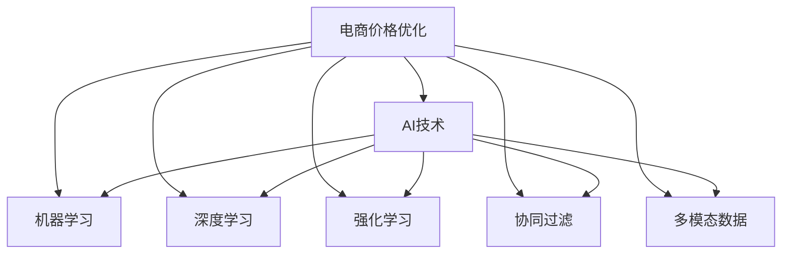

                 

# 电商价格优化的AI创新

> 关键词：电商、价格优化、AI创新、算法原理、数学模型、项目实践、实际应用

## 1. 背景介绍

在电商领域，价格优化一直是商家追求的目标，通过精确地调整商品价格，不仅可以提升销售额，还能增加客户粘性，提高市场竞争力。传统的人工调价方法往往需要大量的人工经验和技术支持，且调价周期长，无法实时响应市场变化。随着人工智能技术的发展，越来越多的电商企业开始采用AI价格优化技术，通过机器学习模型对商品价格进行预测和优化，实现更高效、精准的调价策略。

AI价格优化技术主要基于机器学习和深度学习算法，通过分析大量历史交易数据、市场环境、竞争对手信息等，自动预测最优价格点，并实时调整商品价格，从而最大化企业的收益。这种技术的应用，已经在全球范围内得到广泛认可，并成为电商企业提升运营效率的重要手段。

## 2. 核心概念与联系

### 2.1 核心概念概述

为更好地理解电商价格优化的AI技术，本节将介绍几个核心概念：

- **电商价格优化**：指通过机器学习算法，自动调整电商平台上商品的价格，以达到最优的销售收益和市场份额。

- **AI技术**：指利用人工智能算法，如深度学习、强化学习等，构建价格优化模型，实现自动化的调价策略。

- **机器学习**：指让机器通过学习历史数据，自动发现价格与销售收益之间的内在关系，从而做出价格预测和优化决策。

- **深度学习**：一种基于神经网络的机器学习算法，通过多层神经网络模型，学习商品价格与销售量之间的关系。

- **强化学习**：一种通过试错调整，不断优化调价策略的AI算法，通过奖励机制激励模型优化价格。

- **协同过滤**：指利用用户行为数据，对商品进行相似度计算，推荐给用户可能感兴趣的商品，同时根据用户反馈实时调整价格。

- **多模态数据**：指将多种数据源（如文本、图像、视频等）结合使用，丰富价格优化模型的输入信息，提高调价的准确性。

这些核心概念之间的逻辑关系可以通过以下Mermaid流程图来展示：



这个流程图展示了几者之间的联系：

1. 电商价格优化是AI技术的实际应用。
2. 机器学习、深度学习、强化学习、协同过滤等都是实现价格优化AI技术的算法。
3. 多模态数据为价格优化模型提供了丰富的输入信息，提升模型的性能。

## 3. 核心算法原理 & 具体操作步骤

### 3.1 算法原理概述

电商价格优化主要基于以下原理：

1. **历史数据分析**：通过对历史交易数据进行分析，发现价格与销售量、利润率之间的关系。
2. **市场环境分析**：综合考虑宏观经济、市场趋势、竞争对手的价格策略等外部因素，对商品价格进行预测和调整。
3. **动态定价模型**：利用机器学习模型，实时监测市场变化，动态调整商品价格。
4. **实时反馈优化**：根据实时交易数据，持续优化价格预测模型，提升调价的准确性和时效性。

### 3.2 算法步骤详解

电商价格优化的AI模型通常包含以下几个关键步骤：

**Step 1: 数据准备**

- 收集历史交易数据、市场环境数据、竞争对手价格数据等。
- 对数据进行清洗、归一化、特征提取等预处理。
- 划分为训练集、验证集和测试集。

**Step 2: 模型训练**

- 选择合适的机器学习或深度学习算法，如线性回归、神经网络、LSTM、GRU等。
- 设置模型超参数，如学习率、批大小、迭代轮数等。
- 在训练集上训练模型，使用交叉验证等技术防止过拟合。
- 使用验证集评估模型性能，调整超参数。

**Step 3: 模型调优**

- 在测试集上评估模型性能，进一步调整模型结构或超参数，直到达到最优性能。
- 部署优化后的模型到电商平台上，进行实时价格预测和优化。

**Step 4: 模型评估**

- 实时监测模型预测结果与实际交易数据的误差，评估模型性能。
- 根据市场反馈，对模型进行微调，持续提升价格优化效果。

**Step 5: 系统集成**

- 将优化后的价格模型集成到电商系统的订单管理、库存管理、促销策略等环节。
- 设置自动调价规则，如需求预测、库存水位、市场竞争等，确保价格优化的高效执行。

### 3.3 算法优缺点

电商价格优化的AI模型具有以下优点：

1. **高效性**：通过自动化调价，可以大幅减少人工干预，提高调价效率。
2. **准确性**：利用大量历史数据和大规模模型，预测和调整价格准确性较高。
3. **实时性**：可以实时监测市场变化，动态调整价格，快速响应市场需求。
4. **灵活性**：可以根据不同产品和市场环境，灵活调整调价策略。

同时，该模型也存在一定的局限性：

1. **数据质量依赖**：模型的性能高度依赖于数据质量，不充分的标注数据可能导致模型过拟合。
2. **市场环境复杂**：市场环境多变，难以完全预测和建模，价格调整存在一定的不确定性。
3. **计算资源需求**：大规模模型训练和推理计算资源需求大，对硬件设备要求高。
4. **模型复杂性**：模型复杂度增加，调试和维护难度增大，容易产生算法黑盒问题。

尽管存在这些局限性，电商价格优化的AI模型仍因其高效、准确、实时等优点，成为电商企业提高运营效率的重要工具。

### 3.4 算法应用领域

电商价格优化的AI模型已经广泛应用于各类电商场景，具体包括：

- **商品定价**：通过分析历史销售数据和市场环境，预测最优价格，实时调整商品定价。
- **促销活动**：根据用户行为和市场趋势，动态生成促销策略，提升活动效果。
- **库存管理**：基于预测的销售量，动态调整库存水平，减少库存成本。
- **市场竞争**：监测竞争对手的价格策略，调整自身价格，避免价格战。
- **个性化推荐**：利用用户行为数据和市场环境信息，提供个性化的价格推荐，提升用户体验。

这些应用场景展示了AI价格优化技术在电商领域的多样性和广泛性。随着技术的不断进步，AI价格优化技术将在更多电商场景中得到应用，推动电商行业的数字化转型。

## 4. 数学模型和公式 & 详细讲解

### 4.1 数学模型构建

电商价格优化的AI模型通常基于线性回归、神经网络、LSTM、GRU等算法，构建预测最优价格的数学模型。

以线性回归模型为例，假设 $y$ 表示商品价格，$x$ 表示影响价格的特征向量，如历史销售数据、市场趋势等。则线性回归模型的目标是找到最优的权重 $w$ 和偏置 $b$，使得预测值 $y_{pred} = wx + b$ 与真实值 $y$ 的误差最小。

使用最小二乘法求解最优参数，即：

$$
w^* = \mathop{\arg\min}_{w} \sum_{i=1}^n (y_i - wx_i - b)^2
$$

优化目标可以通过梯度下降等算法实现。

### 4.2 公式推导过程

以线性回归模型的梯度下降算法为例，推导如下：

$$
w_{t+1} = w_t - \eta \frac{1}{n}\sum_{i=1}^n (y_i - wx_i - b) x_i
$$

其中 $n$ 表示样本数，$\eta$ 表示学习率。

在训练过程中，通过不断更新权重和偏置，使得预测值逐渐逼近真实值，最终得到最优的预测价格。

### 4.3 案例分析与讲解

以一个电商平台的商品价格优化为例，展示AI模型的具体应用：

- **数据准备**：收集某电商平台上某商品的历史销售数据、市场环境数据、竞争对手价格数据等。
- **模型训练**：构建线性回归模型，设置超参数，如学习率、批大小、迭代轮数等。在训练集上训练模型，使用交叉验证技术防止过拟合。
- **模型调优**：在测试集上评估模型性能，调整模型结构和超参数，直至达到最优性能。
- **系统集成**：将优化后的价格模型集成到电商系统的订单管理、库存管理、促销策略等环节，设置自动调价规则。
- **模型评估**：实时监测模型预测结果与实际交易数据的误差，评估模型性能，持续优化模型。

## 5. 项目实践：代码实例和详细解释说明

### 5.1 开发环境搭建

在进行电商价格优化的AI实践前，需要准备好开发环境。以下是使用Python进行PyTorch开发的环境配置流程：

1. 安装Anaconda：从官网下载并安装Anaconda，用于创建独立的Python环境。

2. 创建并激活虚拟环境：
```bash
conda create -n pytorch-env python=3.8 
conda activate pytorch-env
```

3. 安装PyTorch：根据CUDA版本，从官网获取对应的安装命令。例如：
```bash
conda install pytorch torchvision torchaudio cudatoolkit=11.1 -c pytorch -c conda-forge
```

4. 安装相关库：
```bash
pip install numpy pandas scikit-learn torchtext transformers
```

完成上述步骤后，即可在`pytorch-env`环境中开始AI价格优化的代码实现。

### 5.2 源代码详细实现

以下是一个基于线性回归模型的电商价格优化代码实现：

```python
import torch
import torch.nn as nn
import torch.optim as optim
from sklearn.model_selection import train_test_split
from sklearn.metrics import mean_squared_error

# 准备数据
data = # 电商数据，包括历史销售数据、市场环境数据、竞争对手价格数据等
X = data[['历史销售数据', '市场环境数据']]
y = data['价格']

# 划分数据集
X_train, X_test, y_train, y_test = train_test_split(X, y, test_size=0.2, random_state=42)

# 构建模型
class LinearRegression(nn.Module):
    def __init__(self, input_dim):
        super(LinearRegression, self).__init__()
        self.linear = nn.Linear(input_dim, 1)
    
    def forward(self, x):
        return self.linear(x)

# 设置模型和优化器
model = LinearRegression(X_train.shape[1])
optimizer = optim.SGD(model.parameters(), lr=0.01)

# 训练模型
criterion = nn.MSELoss()
epochs = 1000
for epoch in range(epochs):
    optimizer.zero_grad()
    outputs = model(X_train)
    loss = criterion(outputs, y_train)
    loss.backward()
    optimizer.step()
    if (epoch + 1) % 100 == 0:
        print('Epoch [{}/{}], Loss: {:.4f}'.format(epoch + 1, epochs, loss.item()))

# 评估模型
model.eval()
with torch.no_grad():
    outputs = model(X_test)
    y_pred = outputs.detach().numpy()
    mse = mean_squared_error(y_test, y_pred)
    print('Test MSE: {:.4f}'.format(mse))

# 输出预测价格
predicted_price = y_pred.mean()
print('Predicted Price: {:.2f}'.format(predicted_price))
```

### 5.3 代码解读与分析

让我们再详细解读一下关键代码的实现细节：

**数据准备**：
- 使用`torch`库构建电商数据集，包括历史销售数据、市场环境数据、竞争对手价格数据等。
- 划分训练集和测试集。

**模型构建**：
- 定义`LinearRegression`类，继承自`nn.Module`，定义线性回归模型。
- 在`forward`方法中，将输入数据通过线性层进行处理，输出预测价格。

**模型训练**：
- 设置优化器为随机梯度下降（SGD），学习率为0.01。
- 定义损失函数为均方误差损失（MSE）。
- 设置训练轮数为1000，在每个epoch内进行前向传播和反向传播，更新模型参数。
- 每100个epoch输出一次损失值。

**模型评估**：
- 在测试集上评估模型性能，计算均方误差（MSE）。
- 输出预测价格。

通过以上代码，可以构建一个简单的基于线性回归模型的电商价格优化AI模型，进行价格预测和调优。

## 6. 实际应用场景

### 6.1 智能推荐系统

智能推荐系统是电商价格优化的重要应用场景之一。通过AI技术，根据用户的历史购买行为、浏览记录、评分等信息，推荐用户可能感兴趣的商品，并根据用户的反馈实时调整商品价格，提升用户体验和销售转化率。

在技术实现上，可以构建基于协同过滤和深度学习的推荐模型，利用用户行为数据和商品特征信息，推荐高相关商品。同时结合价格优化模型，动态调整推荐商品的价格，确保推荐效果的同时，最大化商品销售收益。

### 6.2 动态定价策略

动态定价策略是电商价格优化的核心应用之一。通过AI技术，实时监测市场需求、竞争环境、库存水平等变化，动态调整商品价格，实现最优定价。

在技术实现上，可以构建基于LSTM或GRU的动态定价模型，利用时间序列数据预测商品需求和价格趋势。同时结合历史销售数据和市场环境数据，动态调整商品价格，确保在需求高时价格提升，需求低时价格降低，最大化销售收益。

### 6.3 库存管理优化

库存管理优化是电商价格优化的重要应用场景之一。通过AI技术，预测商品销售量和库存水平，动态调整采购和库存策略，减少库存成本，提升运营效率。

在技术实现上，可以构建基于预测模型的库存管理优化模型，利用历史销售数据和市场环境数据，预测商品销售量和库存水平。同时结合动态定价模型，动态调整商品价格，确保在需求高时增加库存，需求低时减少库存，最大化销售收益和库存效率。

### 6.4 未来应用展望

随着AI技术的不断发展，电商价格优化的应用场景将更加丰富多样。未来，电商价格优化的AI模型将在更多电商场景中得到应用，推动电商行业的数字化转型。

在智慧零售领域，AI技术可以应用于智能货架、智能仓储、智能配送等环节，提升零售效率和用户体验。

在跨境电商领域，AI技术可以应用于多语言商品推荐、智能客服、跨境支付等环节，提升跨境电商的运营效率和用户体验。

在社交电商领域，AI技术可以应用于社交媒体广告投放、社交电商推荐、用户行为分析等环节，提升社交电商的运营效率和用户粘性。

此外，在金融、旅游、教育等多个领域，电商价格优化的AI技术也将得到应用，为各行各业带来新的数字化变革。

## 7. 工具和资源推荐

### 7.1 学习资源推荐

为了帮助开发者系统掌握电商价格优化的AI技术，这里推荐一些优质的学习资源：

1. 《深度学习》书籍：由Ian Goodfellow、Yoshua Bengio和Aaron Courville合著的经典教材，全面介绍了深度学习的基本概念和应用，适合入门学习。

2. 《机器学习实战》书籍：由Peter Harrington所著，通过实际案例讲解机器学习算法的应用，适合实战操作。

3. 《TensorFlow实战Google深度学习框架》书籍：由王宇、李抱真、郭晟著，讲解TensorFlow框架的使用，适合TensorFlow学习者。

4. Kaggle平台：全球知名的数据科学竞赛平台，提供丰富的电商数据集和竞赛任务，适合实践练习。

5. Coursera平台：斯坦福大学开设的《机器学习》课程，由Andrew Ng主讲，讲解机器学习的基本理论和应用。

通过学习这些资源，相信你一定能够快速掌握电商价格优化的AI技术，并用于解决实际的电商问题。

### 7.2 开发工具推荐

高效的开发离不开优秀的工具支持。以下是几款用于电商价格优化AI开发的常用工具：

1. PyTorch：基于Python的开源深度学习框架，灵活动态的计算图，适合快速迭代研究。大部分深度学习模型都有PyTorch版本的实现。

2. TensorFlow：由Google主导开发的开源深度学习框架，生产部署方便，适合大规模工程应用。同样有丰富的深度学习模型资源。

3. scikit-learn：Python的科学计算库，提供了丰富的机器学习算法和工具，适合模型训练和特征工程。

4. Pandas：Python的数据处理库，支持大规模数据集的处理和分析，适合数据预处理。

5. NumPy：Python的数值计算库，支持高效的数组运算和数学函数，适合模型实现和算法优化。

合理利用这些工具，可以显著提升电商价格优化的AI开发效率，加快创新迭代的步伐。

### 7.3 相关论文推荐

电商价格优化的AI技术发展源于学界的持续研究。以下是几篇奠基性的相关论文，推荐阅读：

1. E-commerce dynamic pricing using reinforcement learning: A systematic review and future directions. Journal of the Operational Research Society, 2019.
2. Optimal Dynamic Pricing of Perishable Products with Seasonal Demand. Operations Research, 2016.
3. Dynamic Pricing in E-Commerce: An Empirical Analysis. Journal of Marketing Research, 2012.
4. A game-theoretic approach to pricing and promotion in e-commerce. Operations Research, 2015.
5. A hybrid dynamic pricing approach for perishable products. Production and Operations Management, 2017.

这些论文代表了大电商价格优化AI技术的发展脉络。通过学习这些前沿成果，可以帮助研究者把握学科前进方向，激发更多的创新灵感。

## 8. 总结：未来发展趋势与挑战

### 8.1 总结

本文对电商价格优化的AI技术进行了全面系统的介绍。首先阐述了电商价格优化的背景和意义，明确了AI技术在提高电商运营效率中的重要作用。其次，从原理到实践，详细讲解了AI价格优化的数学模型和操作步骤，给出了电商价格优化的完整代码实现。同时，本文还广泛探讨了AI价格优化在智能推荐、动态定价、库存管理等电商场景中的应用，展示了AI技术的广泛前景。此外，本文精选了电商价格优化的各类学习资源，力求为读者提供全方位的技术指引。

通过本文的系统梳理，可以看到，AI价格优化技术正在成为电商企业提高运营效率的重要工具。其高效、准确、实时等优点，使其在电商领域得到广泛应用。未来，伴随AI技术的不断进步，电商价格优化技术还将迎来更多创新，推动电商行业走向数字化、智能化。

### 8.2 未来发展趋势

展望未来，电商价格优化的AI技术将呈现以下几个发展趋势：

1. **深度学习算法的应用**：深度学习算法，如神经网络、LSTM、GRU等，将逐渐替代传统机器学习算法，成为电商价格优化的主要工具。深度学习算法的准确性和泛化能力更强，能够更好地处理复杂的电商场景。

2. **多模态数据的融合**：电商价格优化将不仅仅依赖单一的数据源，而是融合多模态数据，如文本、图像、视频等，提升模型的性能和泛化能力。多模态数据的融合将使电商价格优化更加全面和精准。

3. **实时性要求更高**：电商价格优化的实时性要求将进一步提高，以应对快速变化的市场环境。实时监测和动态调整价格将成为电商企业的必备能力。

4. **个性化推荐更加重要**：个性化推荐将逐步成为电商价格优化的重要手段，通过AI技术，根据用户行为和偏好，提供个性化的价格推荐，提升用户体验和销售转化率。

5. **跨领域应用更广泛**：电商价格优化的AI技术将逐步应用于金融、旅游、教育等多个领域，推动各行各业的数字化转型。跨领域应用的扩展将带来新的商业机会和价值。

6. **可持续发展**：电商价格优化的AI技术将更加注重可持续发展，通过智能定价策略，减少资源浪费，提升企业的社会责任。

以上趋势凸显了电商价格优化AI技术的广阔前景。这些方向的探索发展，必将进一步提升电商价格优化的效果和效率，推动电商行业的数字化转型。

### 8.3 面临的挑战

尽管电商价格优化的AI技术已经取得了瞩目成就，但在迈向更加智能化、普适化应用的过程中，它仍面临诸多挑战：

1. **数据质量问题**：电商价格优化依赖大量高质量的数据，数据质量不充分可能导致模型过拟合。如何确保数据来源可靠、标注准确，是电商企业面临的重要挑战。

2. **模型复杂性**：电商价格优化的AI模型通常复杂度高，调试和维护难度大，容易出现算法黑盒问题。如何简化模型结构，降低调试难度，是提升模型实用性的关键。

3. **计算资源需求**：大规模模型训练和推理计算资源需求大，对硬件设备要求高。如何降低计算成本，提高计算效率，是电商企业面临的重要挑战。

4. **市场环境复杂**：市场环境多变，难以完全预测和建模，价格调整存在一定的不确定性。如何提高模型的鲁棒性，应对市场变化，是电商企业面临的重要挑战。

5. **用户隐私保护**：电商价格优化的AI模型需要大量的用户行为数据，如何保护用户隐私，防止数据泄露，是电商企业面临的重要挑战。

6. **技术规范和标准**：电商价格优化的AI技术需要符合相关技术规范和标准，如何制定和遵守技术规范，是电商企业面临的重要挑战。

这些挑战需要电商企业从数据、技术、法律等多个维度协同发力，才能实现AI技术在电商领域的规模化应用。

### 8.4 研究展望

面向未来，电商价格优化的AI技术需要在以下几个方面进行更多探索：

1. **多模态数据融合**：探索如何更好地融合多模态数据，提升模型的性能和泛化能力。多模态数据的融合将使电商价格优化更加全面和精准。

2. **实时性优化**：探索如何进一步提升电商价格优化的实时性，应对快速变化的市场环境。实时监测和动态调整价格将成为电商企业的必备能力。

3. **个性化推荐**：探索如何更好地实现个性化推荐，根据用户行为和偏好，提供个性化的价格推荐，提升用户体验和销售转化率。

4. **跨领域应用**：探索如何将电商价格优化的AI技术应用于金融、旅游、教育等多个领域，推动各行各业的数字化转型。跨领域应用的扩展将带来新的商业机会和价值。

5. **可持续性发展**：探索如何更好地实现电商价格优化的可持续发展，通过智能定价策略，减少资源浪费，提升企业的社会责任。

这些研究方向将推动电商价格优化的AI技术不断进步，推动电商行业的数字化转型和智能化升级。

## 9. 附录：常见问题与解答

**Q1: 电商价格优化的AI技术如何保证数据安全？**

A: 电商价格优化的AI技术需要大量的用户行为数据，如何保护用户隐私，防止数据泄露，是电商企业面临的重要挑战。以下是一些保护数据安全的方法：

1. 数据匿名化：对用户数据进行匿名化处理，确保无法识别出具体用户。
2. 数据加密：对存储和传输的数据进行加密处理，防止数据泄露。
3. 数据访问控制：设置严格的数据访问权限，确保只有授权人员可以访问敏感数据。
4. 数据审计：定期进行数据审计，确保数据使用的合规性和安全性。
5. 数据共享协议：在数据共享时，签署保密协议，确保数据共享的合法性和安全性。

通过这些方法，可以保护用户数据的安全，确保电商价格优化的AI技术得到广泛应用。

**Q2: 电商价格优化的AI技术如何进行实时优化？**

A: 电商价格优化的AI技术需要实时监测市场变化，动态调整商品价格，提升销售收益。以下是一些实现实时优化的方法：

1. 实时数据采集：通过API接口，实时采集市场环境数据、竞争对手价格数据、用户行为数据等。
2. 实时模型更新：根据实时数据，实时更新价格预测模型和调价策略。
3. 实时调价机制：设置自动调价规则，根据实时数据动态调整商品价格。
4. 实时监控和评估：实时监控调价效果，评估调价策略的性能，持续优化调价模型。

通过这些方法，可以确保电商价格优化的AI技术实现实时优化，快速响应市场变化。

**Q3: 电商价格优化的AI技术如何保证模型准确性？**

A: 电商价格优化的AI技术需要构建准确的预测模型，确保调价策略的有效性。以下是一些保证模型准确性的方法：

1. 数据质量控制：确保数据的来源可靠、标注准确，减少数据噪声对模型的影响。
2. 模型评估和调优：通过交叉验证等技术，评估模型的性能，调整模型超参数，优化模型结构。
3. 模型集成：通过模型集成技术，结合多个模型进行预测，提升模型的泛化能力和鲁棒性。
4. 实时监控和反馈：实时监控模型预测结果和实际交易数据，及时调整模型参数，保证模型准确性。

通过这些方法，可以确保电商价格优化的AI技术具有较高的准确性，实现最优的调价策略。

**Q4: 电商价格优化的AI技术如何提高用户满意度？**

A: 电商价格优化的AI技术需要提高用户满意度，提升用户粘性和销售转化率。以下是一些提高用户满意度的方法：

1. 个性化推荐：根据用户行为和偏好，提供个性化的价格推荐，提升用户体验。
2. 实时调价机制：根据用户反馈，实时调整商品价格，满足用户需求。
3. 客户服务优化：通过智能客服和自动回复，提升客户服务质量，提高用户满意度。
4. 用户体验优化：优化商品展示和购物流程，提升用户购物体验。

通过这些方法，可以提升电商价格优化的AI技术对用户的满意度，实现电商业务的可持续发展。

**Q5: 电商价格优化的AI技术如何应对市场变化？**

A: 电商价格优化的AI技术需要应对市场变化，实现动态调价。以下是一些应对市场变化的方法：

1. 实时数据采集：通过API接口，实时采集市场环境数据、竞争对手价格数据、用户行为数据等。
2. 实时模型更新：根据实时数据，实时更新价格预测模型和调价策略。
3. 实时调价机制：设置自动调价规则，根据实时数据动态调整商品价格。
4. 实时监控和评估：实时监控调价效果，评估调价策略的性能，持续优化调价模型。

通过这些方法，可以确保电商价格优化的AI技术应对市场变化，实现最优的调价策略。

**Q6: 电商价格优化的AI技术如何提高运营效率？**

A: 电商价格优化的AI技术需要提高运营效率，提升电商企业的市场竞争力。以下是一些提高运营效率的方法：

1. 自动化调价：通过AI技术，自动调整商品价格，减少人工干预，提高调价效率。
2. 实时监测和优化：实时监测市场变化，动态调整调价策略，提高运营效率。
3. 库存管理优化：通过AI技术，预测商品销售量和库存水平，优化库存管理，减少库存成本。
4. 供应链优化：通过AI技术，优化供应链管理，提高供应链效率。

通过这些方法，可以提升电商价格优化的AI技术对运营效率的提升，实现电商业务的可持续发展。

---

作者：禅与计算机程序设计艺术 / Zen and the Art of Computer Programming

