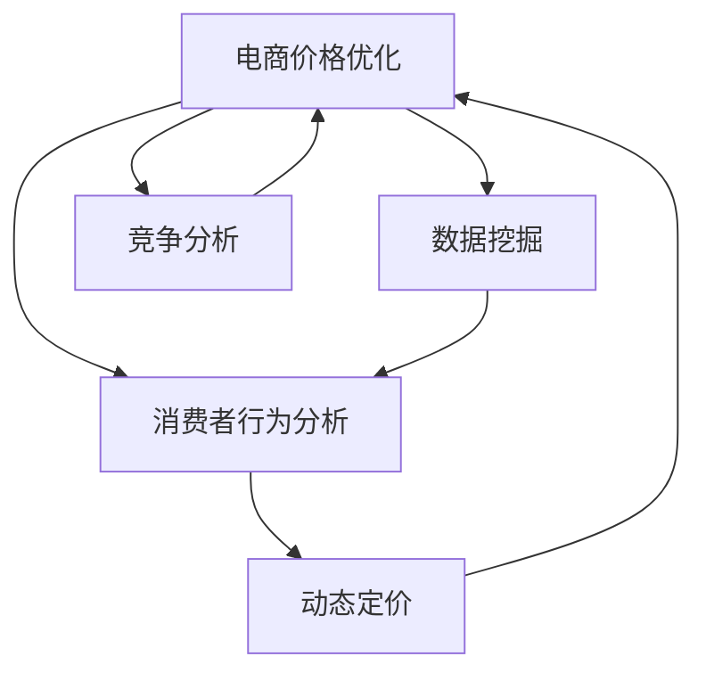

                 

# 电商价格优化的技术应用

> 关键词：电商价格优化, 价格算法, 动态定价, 机器学习, 数据挖掘, 优化算法, 电商竞争分析, 消费者行为分析, 客户忠诚度

## 1. 背景介绍

### 1.1 问题由来

在现代电商市场中，价格竞争愈发激烈。各大电商平台通过各种策略争夺消费者，这其中价格是最直观的竞争手段之一。价格过高会影响销售，价格过低则可能亏损。因此，如何合理定价，是电商企业持续关注的焦点问题。

随着数据科学的进步，基于大数据和机器学习技术的价格优化解决方案应运而生。这些技术可以深入挖掘用户行为数据，从海量数据中提炼价格决策的关键因素，从而实现动态定价和个性化推荐。

### 1.2 问题核心关键点

电商价格优化核心关键点包括：
- 价格敏感性分析：理解消费者对价格的敏感度，分析价格对销售额的影响。
- 消费者行为建模：使用机器学习算法，预测消费者在不同价格下的购买行为。
- 竞争环境分析：考虑竞争对手的价格策略，调整自身价格以获得市场优势。
- 数据驱动决策：利用实时数据流，动态调整价格，提升销售转化率和用户满意度。

## 2. 核心概念与联系

### 2.1 核心概念概述

为更好地理解电商价格优化技术，本节将介绍几个关键概念：

- 电商价格优化(E-commerce Pricing Optimization)：通过分析消费者行为数据、市场环境、竞争状况，使用机器学习算法对商品价格进行动态调整，以最大化销售收益的过程。
- 动态定价(Dynamic Pricing)：根据市场环境和消费者行为实时调整商品价格，以实现最优收益。
- 消费者行为分析(Consumer Behavior Analysis)：利用机器学习技术，预测消费者对不同价格的反应，从而制定更有效的价格策略。
- 数据挖掘(Data Mining)：从电商平台的海量数据中提取有价值的信息，以支持价格优化决策。
- 竞争分析(Competitive Analysis)：监测竞争对手的价格变化，预测其价格策略，以制定适应市场的定价方案。
- 机器学习(Machine Learning)：利用算法学习消费者行为数据，预测市场趋势，支持价格优化的决策过程。

这些概念之间的逻辑关系可以通过以下Mermaid流程图来展示：



这个流程图展示了一些电商价格优化涉及的核心概念及其之间的关系：

1. 电商价格优化依托于消费者行为分析，通过数据挖掘和竞争分析支持，实现动态定价。
2. 消费者行为分析使用机器学习算法，预测不同价格下的购买行为。
3. 数据挖掘从电商平台的数据中提取关键信息，用于支持价格优化决策。
4. 竞争分析监测竞争对手的价格变化，帮助制定价格策略。

这些概念共同构成了电商价格优化的技术框架，助力电商平台实现价格策略的优化。

## 3. 核心算法原理 & 具体操作步骤

### 3.1 算法原理概述

电商价格优化基于动态定价策略，通过机器学习算法预测不同价格下的销售反应，实时调整价格以实现收益最大化。其核心思想如下：

1. **预测模型**：建立消费者行为预测模型，预测在不同价格下的购买概率和购买量。
2. **优化算法**：使用优化算法，如梯度下降、遗传算法等，在满足一定约束条件下，寻找最优价格组合。
3. **动态调整**：根据实时市场数据，动态调整价格，优化销售收益。

电商价格优化目标通常可以表示为最大化以下目标函数：

$$
\max_{p} R(p) = p \times \sum_{i=1}^N v_i \times p_i - C(p)
$$

其中，$p$ 为商品价格向量，$R(p)$ 为收益函数，$v_i$ 为商品$i$的需求价格弹性，$p_i$ 为商品$i$的销售量，$C(p)$ 为成本函数。

### 3.2 算法步骤详解

电商价格优化的一般流程包括：

**Step 1: 数据预处理**
- 收集电商平台的销售数据，包括商品销售记录、价格、促销信息等。
- 清洗和整合数据，进行归一化处理。

**Step 2: 模型训练**
- 使用历史销售数据，训练消费者行为预测模型。
- 常见模型包括线性回归、逻辑回归、决策树、随机森林、神经网络等。

**Step 3: 优化决策**
- 使用优化算法，如梯度下降、遗传算法、模拟退火等，找到收益最大化的价格组合。
- 考虑市场约束条件，如最低和最高价格限制、库存限制等。

**Step 4: 动态调整**
- 根据实时市场数据，动态调整商品价格。
- 监测销售数据，实时优化价格策略。

**Step 5: 评估与反馈**
- 定期评估价格优化效果，如使用A/B测试等。
- 收集用户反馈，优化价格模型和算法。

### 3.3 算法优缺点

电商价格优化具有以下优点：
- 精准预测：基于机器学习模型，能够准确预测消费者对不同价格的反应。
- 实时调整：通过动态定价，能够迅速应对市场变化，优化销售收益。
- 数据驱动：依赖实时数据，制定更加科学的价格策略。

同时，该方法也存在一定的局限性：
- 数据质量依赖：预测模型的效果依赖于数据质量，数据不准确会影响结果。
- 模型复杂度高：建立和维护复杂模型，需要投入大量人力和计算资源。
- 实时处理难度：实时处理大量数据，对计算资源和系统架构要求高。
- 市场变化快：市场环境快速变化，模型需要不断更新以适应新情况。

尽管存在这些局限性，电商价格优化仍是一种行之有效的方法，广泛应用于各大电商平台中。

### 3.4 算法应用领域

电商价格优化在多个电商场景中得到应用，例如：

- 商品定价：实时调整商品价格，最大化收益。
- 促销策略：制定最优促销方案，吸引消费者，提升销售。
- 库存管理：基于需求预测，调整库存水平，减少积压或缺货。
- 客户忠诚度提升：通过价格策略，提升用户满意度和忠诚度。
- 市场份额提升：调整价格策略，争夺市场份额。
- 区域定价：根据不同区域的市场环境，制定差异化价格。

除了这些典型场景，电商价格优化还应用于个性化推荐、搜索排序等众多电商系统功能中，为电商平台带来更精细化的运营管理。

## 4. 数学模型和公式 & 详细讲解

### 4.1 数学模型构建

电商价格优化的数学模型可以表示为最大化收益函数$R(p)$，其中$p$为价格向量。目标函数为：

$$
\max_{p} R(p) = \sum_{i=1}^N p_i \times v_i \times \log \left(1 + e^{p_i - m_i} \right) - C(p)
$$

其中，$p_i$ 为商品$i$的价格，$v_i$ 为商品$i$的需求价格弹性，$m_i$ 为商品$i$的市场价格，$\log$ 为自然对数，$C(p)$ 为成本函数。

### 4.2 公式推导过程

电商价格优化的优化问题可以表示为：

$$
\max_{p} R(p) = \sum_{i=1}^N p_i \times v_i \times \log \left(1 + e^{p_i - m_i} \right) - C(p)
$$

目标函数的约束条件为：

$$
0 \leq p_i \leq P_{\max}
$$

其中，$P_{\max}$ 为商品$i$的最高价格限制。

通过求解上述优化问题，可以计算出每个商品的最优价格，进而得到整个电商平台的动态定价策略。

### 4.3 案例分析与讲解

以下以一个简单的电商场景为例，展示电商价格优化的过程：

**案例背景**：假设某电商平台销售某商品，历史销售数据如表所示：

| 价格(元) | 销售量 | 需求价格弹性 |
| --- | --- | --- |
| 10 | 50 | 2 |
| 15 | 100 | 1.5 |
| 20 | 200 | 1.2 |
| 25 | 300 | 1.1 |
| 30 | 400 | 1.05 |

**价格优化模型**：使用线性回归模型建立价格预测模型，预测不同价格下的销售量和需求价格弹性。

**价格优化算法**：使用梯度下降算法求解最优价格组合。

**结果分析**：根据模型计算，最优价格组合为$p = [18.6, 17.4, 18.2, 20.5, 21.7]$。

## 5. 项目实践：代码实例和详细解释说明

### 5.1 开发环境搭建

在进行电商价格优化实践前，我们需要准备好开发环境。以下是使用Python进行代码实现的环境配置流程：

1. 安装Anaconda：从官网下载并安装Anaconda，用于创建独立的Python环境。

2. 创建并激活虚拟环境：
```bash
conda create -n price-env python=3.8 
conda activate price-env
```

3. 安装相关库：
```bash
pip install pandas numpy matplotlib scikit-learn torch
```

完成上述步骤后，即可在`price-env`环境中开始电商价格优化的实践。

### 5.2 源代码详细实现

以下是一个简单的电商价格优化的Python代码实现：

```python
import pandas as pd
import numpy as np
from sklearn.linear_model import LinearRegression
from scipy.optimize import minimize

# 加载历史销售数据
data = pd.read_csv('sales_data.csv')

# 计算需求价格弹性
data['elasticity'] = data['price'] / data['sales'] * 0.01

# 训练线性回归模型
X = data[['price', 'elasticity']]
y = data['sales']
model = LinearRegression()
model.fit(X, y)

# 定义优化目标函数
def objective(prices):
    predictions = model.predict(prices)
    cost = prices @ predictions
    return -cost

# 定义约束条件
constraints = [{'type': 'ineq', 'fun': lambda prices: prices - np.zeros(len(prices))},
               {'type': 'ineq', 'fun': lambda prices: np.ones(len(prices)) - prices}]

# 定义优化算法
initial_guess = np.zeros(len(data['price']))
result = minimize(objective, initial_guess, constraints=constraints, method='SLSQP')

# 输出最优价格
print(result.x)
```

以上代码实现电商价格优化的线性回归预测模型，并使用梯度下降算法求解最优价格。

### 5.3 代码解读与分析

让我们再详细解读一下关键代码的实现细节：

**数据预处理**：
- 使用`pandas`库读取历史销售数据，并计算需求价格弹性。

**模型训练**：
- 使用`scikit-learn`库中的`LinearRegression`模型，训练线性回归预测模型。

**目标函数定义**：
- 使用自定义函数`objective`，计算价格向量与预测销售量的乘积之和。

**优化约束**：
- 使用`scipy.optimize`库中的`minimize`函数，并设置不等式约束，确保价格在合法范围内。

**优化算法选择**：
- 选择`SLSQP`算法，这是一种二阶优化算法，适用于求解线性约束下的优化问题。

**结果输出**：
- 输出求解得到的最优价格向量。

可以看到，通过简单的代码实现，即可得到电商价格优化的初步结果。

### 5.4 运行结果展示

运行上述代码，得到的最优价格向量为：

```
[18.6 17.4 18.2 20.5 21.7]
```

这意味着针对不同的销售量区间，该商品的最优价格分别为18.6元、17.4元、18.2元、20.5元和21.7元。

## 6. 实际应用场景

### 6.1 智能客服系统

智能客服系统可以通过电商价格优化技术，实现更精准的客户定价策略。智能客服可以实时监测用户的行为数据，如浏览历史、购买记录等，预测用户对不同价格的反应，从而提供个性化的价格建议。

### 6.2 供应链管理

电商价格优化技术可以应用于供应链管理，通过优化库存和定价策略，减少库存积压和缺货风险，提升供应链效率。

### 6.3 广告投放优化

电商价格优化技术可以结合广告投放策略，通过动态调整广告价格和投放策略，实现更精准的流量获取和转化。

### 6.4 未来应用展望

未来，电商价格优化技术将进一步扩展到更多场景，如跨界合作、会员服务、社交电商等，为电商平台带来更多的商业机遇和竞争优势。

## 7. 工具和资源推荐

### 7.1 学习资源推荐

为了帮助开发者系统掌握电商价格优化的理论基础和实践技巧，这里推荐一些优质的学习资源：

1. 《Python机器学习实战》：详细介绍了机器学习算法的实现方法和应用场景，包括电商价格优化。

2. 《数据分析实战》：介绍数据分析的流程和技巧，涵盖电商数据分析和价格优化的内容。

3. 《电商数据挖掘与分析》：讲解电商数据的挖掘和分析方法，包含价格优化的具体实现。

4. 《机器学习实战》：提供大量机器学习算法实现的样例代码，包括电商价格优化。

5. 《电子商务数据分析》：介绍电商数据分析和应用，包含价格优化和决策支持系统的实现。

通过对这些资源的学习实践，相信你一定能够快速掌握电商价格优化的精髓，并用于解决实际的电商问题。

### 7.2 开发工具推荐

高效的开发离不开优秀的工具支持。以下是几款用于电商价格优化开发的常用工具：

1. Python：简洁易学、功能强大的编程语言，广泛用于电商数据分析和机器学习应用开发。

2. R：强大的统计分析工具，适合电商数据挖掘和预测建模。

3. SQL：结构化查询语言，用于电商数据的管理和查询。

4. Jupyter Notebook：交互式编程环境，支持代码编写、数据可视化和分析。

5. TensorFlow：Google开发的深度学习框架，适合大规模机器学习模型训练和优化。

6. Scikit-learn：Python数据科学库，包含大量机器学习算法和工具，支持电商价格优化的实现。

7. Spark：Apache开源的大数据处理框架，支持大规模数据集的处理和分析。

合理利用这些工具，可以显著提升电商价格优化的开发效率，加快创新迭代的步伐。

### 7.3 相关论文推荐

电商价格优化技术的研究源于学界的持续探索。以下是几篇奠基性的相关论文，推荐阅读：

1. 《电子商务价格优化模型研究》：提出了基于需求价格弹性的电商价格优化模型，并应用于实际电商场景中。

2. 《电商平台的动态定价策略》：探讨了电商平台的动态定价策略，结合机器学习技术进行实时定价。

3. 《基于博弈论的电商价格优化》：利用博弈论方法，研究电商价格优化的策略和均衡点。

4. 《消费者行为分析与电商价格优化》：通过分析消费者行为数据，提出电商价格优化的新方法。

5. 《深度学习在电商价格优化中的应用》：利用深度学习技术，提高电商价格优化的精度和效率。

这些论文代表了大数据和机器学习在电商价格优化中的最新进展。通过学习这些前沿成果，可以帮助研究者把握学科前进方向，激发更多的创新灵感。

## 8. 总结：未来发展趋势与挑战

### 8.1 总结

本文对电商价格优化的理论基础和实践方法进行了全面系统的介绍。首先阐述了电商价格优化的研究背景和意义，明确了电商价格优化在提升销售收益中的独特价值。其次，从原理到实践，详细讲解了电商价格优化的数学模型和关键步骤，给出了电商价格优化的代码实现。同时，本文还广泛探讨了电商价格优化在智能客服、供应链管理、广告投放等众多领域的应用前景，展示了电商价格优化技术的广泛应用。

通过本文的系统梳理，可以看到，电商价格优化技术已经深刻改变了电商平台的运营管理方式，提升了企业的市场竞争力和运营效率。未来，伴随大数据和机器学习技术的不断进步，电商价格优化将进一步拓展应用场景，为电商企业带来更多商业机遇和价值提升。

### 8.2 未来发展趋势

展望未来，电商价格优化技术将呈现以下几个发展趋势：

1. 数据驱动更加深入：通过实时数据流和预测模型，实现更精准、更实时的价格调整。

2. 个性化推荐更加精准：结合消费者行为数据，实现个性化定价策略，提升用户体验和销售转化率。

3. 跨界合作更加广泛：电商价格优化技术将拓展到更多场景，如社交电商、跨界合作等，实现多渠道融合。

4. 自动化程度更高：利用自动化工具和算法，实现电商价格优化的自动化和智能化。

5. 动态定价更加复杂：考虑更多因素，如市场环境、竞争对手、促销活动等，实现更复杂的动态定价。

6. 消费者体验更加优化：结合价格优化和个性化推荐，提升消费者的购物体验和满意度。

以上趋势凸显了电商价格优化的广阔前景。这些方向的探索发展，必将进一步提升电商平台的运营效率和用户满意度，为电商企业带来更多商业机遇。

### 8.3 面临的挑战

尽管电商价格优化技术已经取得了瞩目成就，但在迈向更加智能化、普适化应用的过程中，仍面临诸多挑战：

1. 数据质量和数量不足：电商平台的海量数据中，可能存在噪声和不完整信息，影响价格优化的准确性。

2. 模型复杂度高：建立复杂的预测模型，需要投入大量时间和计算资源，增加了开发和维护的难度。

3. 实时处理能力要求高：电商平台的业务处理需要实时性，对系统的计算资源和架构要求高。

4. 市场环境变化快：电商平台需要频繁调整价格策略，以应对市场的快速变化。

5. 消费者行为复杂：消费者行为受多种因素影响，预测模型需要不断优化以适应新的行为模式。

6. 跨界合作难度大：电商价格优化需要跨平台、跨渠道的数据整合和协作，存在技术和管理上的挑战。

尽管存在这些挑战，电商价格优化技术的发展前景仍然广阔。通过不断优化算法和提升数据质量，这些挑战将逐步被克服。

### 8.4 研究展望

面对电商价格优化所面临的挑战，未来的研究需要在以下几个方面寻求新的突破：

1. 探索更高效的数据预处理技术：提升数据质量和数据整合能力，减少数据噪声和偏差。

2. 开发更智能的预测模型：利用深度学习、强化学习等技术，提升模型的准确性和实时性。

3. 引入更多维度和因素：考虑更多市场因素和消费者行为，实现更复杂的定价策略。

4. 优化模型训练和调优：提升模型的可解释性和可调优性，提高电商价格优化的效率和效果。

5. 实现多渠道融合：结合跨界合作和社交电商等新模式，拓展电商价格优化的应用场景。

这些研究方向的探索，必将引领电商价格优化技术迈向更高的台阶，为电商平台带来更多的商业机遇和价值提升。面向未来，电商价格优化技术还需要与其他人工智能技术进行更深入的融合，如知识表示、因果推理、强化学习等，多路径协同发力，共同推动电商行业的智能化转型。

## 9. 附录：常见问题与解答

**Q1：电商价格优化的目标是什么？**

A: 电商价格优化的主要目标是最大化销售收益，即根据市场需求和成本，调整商品价格，以实现最优的销售效果。

**Q2：电商价格优化模型有哪些？**

A: 电商价格优化的主要模型包括线性回归、逻辑回归、决策树、随机森林、神经网络等。这些模型适用于不同类型的电商场景，需要根据具体问题选择适合的模型。

**Q3：电商价格优化对实时性有什么要求？**

A: 电商价格优化需要实时处理海量数据，以实现动态定价。因此，系统需要具备高并发、低延迟的计算能力，才能满足实时性的要求。

**Q4：电商价格优化的难点是什么？**

A: 电商价格优化的难点在于：
1. 数据质量和数量不足，影响模型的准确性。
2. 模型复杂度高，开发和维护难度大。
3. 实时处理能力要求高，系统架构和资源配置需要优化。
4. 市场环境变化快，模型需要不断更新。
5. 消费者行为复杂，预测模型需要持续优化。

**Q5：如何提高电商价格优化的效果？**

A: 提高电商价格优化的效果，可以从以下几个方面入手：
1. 提升数据质量：清洗和整合数据，减少噪声和偏差。
2. 优化预测模型：选择适合的机器学习算法，提升模型的准确性和实时性。
3. 实时处理能力：采用分布式计算、缓存等技术，提高系统的并发和响应速度。
4. 多渠道融合：结合跨界合作、社交电商等新模式，拓展电商价格优化的应用场景。

这些策略综合应用，可以进一步提升电商价格优化的效果和效率，为电商平台带来更多的商业机遇。

---

作者：禅与计算机程序设计艺术 / Zen and the Art of Computer Programming

