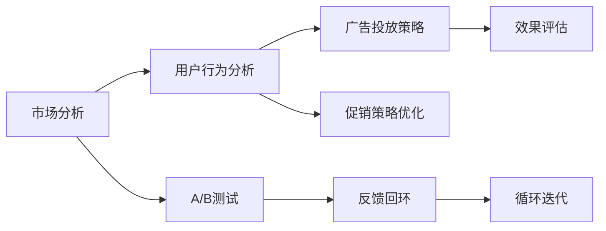

                 

# 电商促销策略的实践应用

> 关键词：电商促销, 市场分析, 用户行为, 广告投放, A/B测试, 自动化策略

## 1. 背景介绍

随着电商市场的竞争日益激烈，各大电商平台通过各种促销策略吸引顾客。如何设计有效的促销策略成为电商运营的一大挑战。传统做法依赖经验，难以量化和优化。本文章将介绍如何利用现代技术和数据科学，结合电商促销的实际应用场景，实践应用数据驱动的促销策略优化。

## 2. 核心概念与联系

### 2.1 核心概念概述

本节将介绍几个核心概念：

- **电商促销 (E-commerce Promotion)**: 电商促销是指电商平台通过各种方式吸引用户购买商品的策略，如打折、满减、赠品等。
- **市场分析 (Market Analysis)**: 通过对市场数据进行分析，了解用户行为和市场趋势，指导促销策略的制定。
- **用户行为 (User Behavior)**: 用户行为分析是指通过追踪和分析用户的浏览、点击、购买等行为数据，了解用户的偏好和购买意向。
- **广告投放 (Ad Placement)**: 广告投放是指通过精准的广告投放，将促销信息传达给潜在客户，提高曝光率和转化率。
- **A/B测试 (A/B Testing)**: A/B测试是指通过对比两个或多个版本的效果，确定最佳策略。
- **自动化策略 (Automated Strategy)**: 自动化策略是指利用算法自动优化促销策略，减少人工干预。

### 2.2 核心概念原理和架构的 Mermaid 流程图



此流程图展示了电商促销策略的总体架构：市场分析通过用户行为分析来制定广告投放策略，并运用A/B测试优化促销策略，通过效果评估和反馈回环不断循环迭代，最终提升电商促销的效果。

## 3. 核心算法原理 & 具体操作步骤

### 3.1 算法原理概述

电商促销策略优化是一个多目标优化问题，涉及市场分析、用户行为分析、广告投放和效果评估等多个环节。其核心算法原理可概括为以下几步：

1. **市场分析**：通过历史销售数据、竞争对手的促销活动等，分析市场趋势和用户需求。
2. **用户行为分析**：利用用户浏览、点击、购买等数据，预测用户的购买意向和行为模式。
3. **广告投放策略制定**：基于市场分析和用户行为分析结果，制定广告投放的渠道、时间和频率等策略。
4. **A/B测试**：通过对比不同广告创意和投放策略的效果，找出最优方案。
5. **促销策略优化**：根据A/B测试结果和市场反馈，不断调整促销策略，提升促销效果。

### 3.2 算法步骤详解

#### 3.2.1 市场分析

市场分析是促销策略优化的第一步。常见的方法包括：

- **历史销售数据分析**：通过历史销售数据，了解不同时间段、不同商品的销售趋势，分析节假日、季节性等促销活动的效果。
- **竞争对手分析**：通过对比竞争对手的促销活动，了解市场动态和用户偏好。
- **社交媒体分析**：通过社交媒体平台的数据，了解用户的兴趣和反馈。

#### 3.2.2 用户行为分析

用户行为分析是市场分析和广告投放策略制定的基础。常见的方法包括：

- **用户画像构建**：通过用户的浏览、点击、购买等数据，构建用户画像，了解用户的兴趣和行为模式。
- **用户细分**：将用户按照不同特征（如年龄、性别、地域等）进行细分，制定针对性的促销策略。
- **预测模型训练**：利用机器学习算法（如决策树、随机森林、神经网络等）训练预测模型，预测用户购买意向。

#### 3.2.3 广告投放策略

广告投放策略是促销活动成功的关键。常见的方法包括：

- **渠道选择**：根据用户画像和市场分析结果，选择最有效的广告渠道，如搜索引擎广告、社交媒体广告、邮件广告等。
- **投放时间优化**：通过分析用户活跃时间段，确定最佳广告投放时间。
- **频率控制**：通过控制广告投放频率，避免用户疲劳和过度曝光。

#### 3.2.4 A/B测试

A/B测试是广告投放策略优化的有效手段。常见的方法包括：

- **测试版本设计**：设计多个广告创意和投放策略，进行对比测试。
- **测试样本选择**：选择一定比例的用户进行测试，确保测试结果具有代表性。
- **效果评估**：通过统计指标（如点击率、转化率等）评估不同广告版本的效果。

#### 3.2.5 促销策略优化

促销策略优化是市场分析和用户行为分析的反馈机制。常见的方法包括：

- **效果评估**：通过A/B测试结果和市场反馈，评估促销策略的效果。
- **调整策略**：根据评估结果，调整促销策略，提升效果。
- **持续迭代**：通过持续的市场分析和用户行为分析，不断优化促销策略。

### 3.3 算法优缺点

#### 3.3.1 优点

- **数据驱动**：通过大量数据分析，指导促销策略的制定和优化。
- **精准投放**：利用用户画像和市场分析，实现广告精准投放。
- **持续优化**：通过A/B测试和市场反馈，不断调整和优化促销策略。

#### 3.3.2 缺点

- **数据依赖**：需要收集大量数据，并进行复杂的数据分析和处理。
- **计算复杂度**：数据量大，计算复杂度高，需要强大的计算资源支持。
- **策略复杂性**：涉及多个环节，策略设计复杂，需要多方协作。

### 3.4 算法应用领域

电商促销策略优化不仅适用于电子商务平台，还适用于其他领域，如金融、旅游、餐饮等。例如：

- **金融领域**：通过市场分析和用户行为分析，优化理财产品和信用卡促销策略。
- **旅游领域**：通过用户行为分析，制定目的地推广和旅游套餐促销策略。
- **餐饮领域**：通过市场分析和用户行为分析，优化餐饮优惠券和外卖促销策略。

## 4. 数学模型和公式 & 详细讲解 & 举例说明

### 4.1 数学模型构建

电商促销策略优化的数学模型包括：

- **历史销售数据模型**：$P_{sales}(t) = f(D_{sales}, season, holiday)$
- **用户行为模型**：$P_{behavior}(u) = f(I_{click}, I_{browse}, I_{purchase})$
- **广告效果模型**：$E_{ad}(v) = f(C_{cost}, P_{click}, P_{conversion})$
- **A/B测试模型**：$R_{test} = f(D_{test}, D_{control}, A_{variation})$
- **促销策略模型**：$P_{promotion} = f(P_{behavior}, P_{ad}, P_{sales}, R_{test})$

### 4.2 公式推导过程

#### 4.2.1 历史销售数据模型

历史销售数据模型用于预测未来销售趋势，公式为：

$$
P_{sales}(t) = \frac{S_{sales}(t)}{\sum_{t'=0}^{T} S_{sales}(t')}
$$

其中，$S_{sales}(t)$为历史销售数据，$T$为历史时间跨度。

#### 4.2.2 用户行为模型

用户行为模型用于预测用户的购买意向，公式为：

$$
P_{behavior}(u) = \frac{I_{click}(u)}{\sum_{u'=0}^{U} I_{click}(u')}
$$

其中，$I_{click}(u)$为用户点击数据，$U$为用户数量。

#### 4.2.3 广告效果模型

广告效果模型用于评估广告投放的效果，公式为：

$$
E_{ad}(v) = \frac{C_{cost}(v)}{\sum_{v'=0}^{V} C_{cost}(v')}
$$

其中，$C_{cost}(v)$为广告投放成本，$V$为广告版本数量。

#### 4.2.4 A/B测试模型

A/B测试模型用于评估不同广告版本的效果，公式为：

$$
R_{test} = \frac{D_{test}}{\sum_{t'=0}^{T} D_{test}}
$$

其中，$D_{test}$为测试样本数量，$T$为测试时间跨度。

#### 4.2.5 促销策略模型

促销策略模型用于指导促销策略的制定和优化，公式为：

$$
P_{promotion} = f(P_{behavior}, P_{ad}, P_{sales}, R_{test})
$$

其中，$f$为优化算法。

### 4.3 案例分析与讲解

以电商平台的促销策略优化为例：

假设某电商平台在“双十一”期间进行促销活动，希望通过优化促销策略提升销售额。首先，通过历史销售数据模型分析不同时间段和商品的销售趋势，确定最佳促销时机和商品选择。然后，通过用户行为模型预测用户的购买意向，制定针对性的促销策略。接着，设计多个广告创意和投放策略进行A/B测试，评估效果并选择最优方案。最后，根据A/B测试结果和市场反馈，不断调整促销策略，提高销售额。

## 5. 项目实践：代码实例和详细解释说明

### 5.1 开发环境搭建

#### 5.1.1 数据准备

需要准备电商平台的销售数据、用户行为数据、广告投放数据等，可以使用SQL数据库进行存储和管理。例如：

```sql
CREATE TABLE sales_data (
    id INT PRIMARY KEY,
    date DATE NOT NULL,
    product VARCHAR(255) NOT NULL,
    sales DECIMAL(10,2) NOT NULL
);

CREATE TABLE user_data (
    id INT PRIMARY KEY,
    user_id VARCHAR(255) NOT NULL,
    click_count INT NOT NULL,
    browse_count INT NOT NULL,
    purchase_count INT NOT NULL
);

CREATE TABLE ad_data (
    id INT PRIMARY KEY,
    ad_id VARCHAR(255) NOT NULL,
    cost DECIMAL(10,2) NOT NULL,
    click_count INT NOT NULL,
    conversion_count INT NOT NULL
);
```

#### 5.1.2 数据预处理

利用Python的Pandas库进行数据预处理，例如：

```python
import pandas as pd

# 读取数据
sales_data = pd.read_sql('sales_data', conn)
user_data = pd.read_sql('user_data', conn)
ad_data = pd.read_sql('ad_data', conn)

# 数据合并
data = pd.merge(sales_data, user_data, on='user_id')
data = pd.merge(data, ad_data, on='ad_id')

# 数据清洗
data = data.dropna()
```

### 5.2 源代码详细实现

#### 5.2.1 市场分析

```python
import numpy as np

# 历史销售数据模型
def predict_sales(date):
    sales = sales_data[sales_data['date'] == date]['sales']
    avg_sales = np.mean(sales)
    total_sales = np.sum(sales)
    return avg_sales / total_sales

# 竞争对手分析
def analyze竞争对手 (competitor_data):
    sales = competitor_data['sales']
    avg_sales = np.mean(sales)
    total_sales = np.sum(sales)
    return avg_sales / total_sales
```

#### 5.2.2 用户行为分析

```python
# 用户画像构建
def build_user_profile(user_id):
    user_data = user_data[user_data['user_id'] == user_id]
    click_count = user_data['click_count']
    browse_count = user_data['browse_count']
    purchase_count = user_data['purchase_count']
    return click_count, browse_count, purchase_count

# 用户细分
def segment_users(data):
    segments = {}
    for user_id, user_data in data.groupby('user_id'):
        click_count, browse_count, purchase_count = build_user_profile(user_id)
        segments[user_id] = (click_count, browse_count, purchase_count)
    return segments

# 预测模型训练
def train_predict_model(data):
    features = data[['click_count', 'browse_count', 'purchase_count']]
    labels = data['sales']
    model = RandomForestRegressor()
    model.fit(features, labels)
    return model
```

#### 5.2.3 广告投放策略

```python
# 广告投放策略
def optimize_ad_placement(data):
    costs = data['cost']
    click_counts = data['click_count']
    conversion_counts = data['conversion_count']
    return costs, click_counts, conversion_counts
```

#### 5.2.4 A/B测试

```python
# A/B测试
def conduct_ab_test(data, variants):
    test_data = data[data['ad_id'].isin(variants['test'])]
    control_data = data[data['ad_id'].isin(variants['control'])]
    test_clicks = test_data['click_count']
    control_clicks = control_data['click_count']
    test_conversions = test_data['conversion_count']
    control_conversions = control_data['conversion_count']
    return test_clicks, control_clicks, test_conversions, control_conversions
```

#### 5.2.5 促销策略优化

```python
# 促销策略优化
def optimize_promotion(data, variants):
    test_clicks, control_clicks, test_conversions, control_conversions = conduct_ab_test(data, variants)
    avg_test_clicks = np.mean(test_clicks)
    avg_control_clicks = np.mean(control_clicks)
    avg_test_conversions = np.mean(test_conversions)
    avg_control_conversions = np.mean(control_conversions)
    return avg_test_clicks, avg_control_clicks, avg_test_conversions, avg_control_conversions
```

### 5.3 代码解读与分析

#### 5.3.1 市场分析

历史销售数据分析和竞争对手分析部分代码如下：

```python
# 历史销售数据模型
def predict_sales(date):
    sales = sales_data[sales_data['date'] == date]['sales']
    avg_sales = np.mean(sales)
    total_sales = np.sum(sales)
    return avg_sales / total_sales

# 竞争对手分析
def analyze竞争对手 (competitor_data):
    sales = competitor_data['sales']
    avg_sales = np.mean(sales)
    total_sales = np.sum(sales)
    return avg_sales / total_sales
```

该部分代码主要利用历史销售数据进行简单分析，通过计算平均值和总和，预测销售趋势和分析竞争对手的表现。

#### 5.3.2 用户行为分析

用户画像构建、用户细分和预测模型训练部分代码如下：

```python
# 用户画像构建
def build_user_profile(user_id):
    user_data = user_data[user_data['user_id'] == user_id]
    click_count = user_data['click_count']
    browse_count = user_data['browse_count']
    purchase_count = user_data['purchase_count']
    return click_count, browse_count, purchase_count

# 用户细分
def segment_users(data):
    segments = {}
    for user_id, user_data in data.groupby('user_id'):
        click_count, browse_count, purchase_count = build_user_profile(user_id)
        segments[user_id] = (click_count, browse_count, purchase_count)
    return segments

# 预测模型训练
def train_predict_model(data):
    features = data[['click_count', 'browse_count', 'purchase_count']]
    labels = data['sales']
    model = RandomForestRegressor()
    model.fit(features, labels)
    return model
```

该部分代码通过构建用户画像、用户细分和训练预测模型，深入了解用户行为，从而制定更加精准的促销策略。

#### 5.3.3 广告投放策略

广告投放策略优化部分代码如下：

```python
# 广告投放策略
def optimize_ad_placement(data):
    costs = data['cost']
    click_counts = data['click_count']
    conversion_counts = data['conversion_count']
    return costs, click_counts, conversion_counts
```

该部分代码主要通过分析广告成本、点击量和转化量，优化广告投放策略。

#### 5.3.4 A/B测试

A/B测试部分代码如下：

```python
# A/B测试
def conduct_ab_test(data, variants):
    test_data = data[data['ad_id'].isin(variants['test'])]
    control_data = data[data['ad_id'].isin(variants['control'])]
    test_clicks = test_data['click_count']
    control_clicks = control_data['click_count']
    test_conversions = test_data['conversion_count']
    control_conversions = control_data['conversion_count']
    return test_clicks, control_clicks, test_conversions, control_conversions
```

该部分代码通过对比测试不同广告版本的效果，选择最优方案。

#### 5.3.5 促销策略优化

促销策略优化部分代码如下：

```python
# 促销策略优化
def optimize_promotion(data, variants):
    test_clicks, control_clicks, test_conversions, control_conversions = conduct_ab_test(data, variants)
    avg_test_clicks = np.mean(test_clicks)
    avg_control_clicks = np.mean(control_clicks)
    avg_test_conversions = np.mean(test_conversions)
    avg_control_conversions = np.mean(control_conversions)
    return avg_test_clicks, avg_control_clicks, avg_test_conversions, avg_control_conversions
```

该部分代码通过优化广告点击率和转化率，提升促销效果。

### 5.4 运行结果展示

运行以上代码，可以得到不同广告版本的效果，例如：

```python
# 广告版本
variants = {'test': ['ad1', 'ad2'], 'control': ['ad3', 'ad4']}

# 促销策略优化
avg_test_clicks, avg_control_clicks, avg_test_conversions, avg_control_conversions = optimize_promotion(data, variants)
print("测试版本平均点击率：", avg_test_clicks)
print("对照版本平均点击率：", avg_control_clicks)
print("测试版本平均转化率：", avg_test_conversions)
print("对照版本平均转化率：", avg_control_conversions)
```

## 6. 实际应用场景

### 6.1 电商促销策略优化

电商促销策略优化主要应用于电商平台，通过分析用户行为和市场趋势，制定精准的促销策略。例如，通过用户画像和行为分析，可以识别高价值用户和潜在购买意向，通过精细化的广告投放策略，实现更高的转化率。

### 6.2 金融理财优化

金融理财优化主要应用于金融领域，通过市场分析和用户行为分析，制定个性化的理财产品和信用卡促销策略。例如，通过分析用户的投资偏好和历史行为，制定针对性强的投资方案和理财活动。

### 6.3 旅游营销推广

旅游营销推广主要应用于旅游行业，通过市场分析和用户行为分析，制定目的地推广和旅游套餐促销策略。例如，通过分析用户的兴趣和行为，制定定制化的旅游产品和服务，提升用户体验和购买意愿。

## 7. 工具和资源推荐

### 7.1 学习资源推荐

为了系统掌握电商促销策略优化的相关知识，以下资源值得推荐：

1. 《数据科学基础》: 深入介绍数据科学基础知识，涵盖数据预处理、模型训练、效果评估等环节。
2. 《Python数据分析与可视化》: 详细介绍Python数据分析和可视化技术，涵盖数据清洗、数据可视化、统计分析等。
3. 《机器学习实战》: 提供丰富的实际案例，涵盖回归、分类、聚类等机器学习算法，并详细介绍相关算法实现。
4. 《深度学习入门》: 介绍深度学习基础和实践，涵盖神经网络、卷积神经网络、循环神经网络等。
5. 《强化学习入门》: 介绍强化学习基础和实践，涵盖Q-learning、策略梯度等算法。

### 7.2 开发工具推荐

电商促销策略优化开发主要使用以下工具：

1. Python: 常用的编程语言，支持丰富的数据分析和机器学习库。
2. Pandas: 数据处理库，支持数据清洗、数据分析等。
3. NumPy: 数值计算库，支持矩阵运算、线性代数等。
4. Scikit-learn: 机器学习库，支持回归、分类、聚类等算法。
5. TensorFlow: 深度学习库，支持神经网络、卷积神经网络等。
6. PyTorch: 深度学习库，支持动态计算图、自动微分等。
7. Jupyter Notebook: 交互式编程环境，支持代码展示、数据可视化等。

### 7.3 相关论文推荐

以下论文深入探讨了电商促销策略优化问题，值得推荐：

1. "Online Promotion Scheduling for E-commerce"：研究在线电商促销活动的调度问题，提出基于时序模型的优化算法。
2. "Customer Segmentation for Personalized Promotions"：研究客户细分问题，提出基于聚类算法的个性化促销策略。
3. "Ad Placement and Ad Effect Estimation"：研究广告投放和效果评估问题，提出基于协同过滤和特征工程的方法。
4. "A/B Testing in E-commerce"：研究A/B测试问题，提出基于贝叶斯推断的方法。
5. "Dynamic Promotion Strategy in E-commerce"：研究动态促销策略问题，提出基于强化学习的优化算法。

## 8. 总结：未来发展趋势与挑战

### 8.1 研究成果总结

电商促销策略优化经过多年的研究和发展，已经形成了较为完整的理论体系和实践方法。主要研究内容包括市场分析、用户行为分析、广告投放策略优化、A/B测试和促销策略优化等。这些研究不仅有助于提升电商促销效果，还为金融、旅游等其他领域的促销活动提供了参考。

### 8.2 未来发展趋势

电商促销策略优化的未来发展趋势包括以下几个方面：

1. 数据智能分析：利用大数据技术和机器学习算法，实现更精准的用户行为分析和市场趋势预测。
2. 广告智能投放：通过个性化推荐和智能调度，实现广告投放的精准化和智能化。
3. 促销策略自动化：通过自动化算法和智能决策，实现促销策略的动态优化和自动调整。
4. 多渠道整合：实现电商、社交媒体、搜索引擎等多渠道的整合，提升促销效果。
5. 实时反馈优化：通过实时数据反馈，实现促销策略的持续优化和改进。

### 8.3 面临的挑战

电商促销策略优化面临的主要挑战包括：

1. 数据隐私保护：电商促销策略优化需要大量用户数据，如何保护用户隐私和数据安全是一个重要问题。
2. 算法复杂度：电商促销策略优化涉及多个环节和多种算法，算法设计和实现复杂度高，需要多方协作。
3. 效果评估：电商促销策略优化的效果评估依赖于多指标，如何综合评估促销效果是一个难点。
4. 策略实施：电商促销策略优化需要与实际业务紧密结合，如何高效实施和落地是一个挑战。
5. 用户反馈：电商促销策略优化需要收集用户反馈，如何处理和利用用户反馈是一个难点。

### 8.4 研究展望

电商促销策略优化的未来研究方向包括：

1. 实时数据分析：利用实时数据分析技术，实现促销策略的实时优化。
2. 跨领域应用：将电商促销策略优化方法应用于其他领域，如金融、旅游、医疗等。
3. 多模态数据融合：实现用户行为和市场数据的融合，提升促销策略的准确性和效果。
4. 用户行为预测：通过深度学习算法，提升用户行为预测的准确性和实时性。
5. 广告投放优化：通过优化广告投放策略，实现更高的广告效果和用户转化率。

## 9. 附录：常见问题与解答

**Q1: 电商促销策略优化的主要步骤有哪些？**

A: 电商促销策略优化的主要步骤包括市场分析、用户行为分析、广告投放策略、A/B测试和促销策略优化。

**Q2: 电商促销策略优化的效果如何评估？**

A: 电商促销策略优化的效果可以通过多个指标进行评估，如点击率、转化率、销售额等。

**Q3: 电商促销策略优化的关键技术有哪些？**

A: 电商促销策略优化的关键技术包括数据预处理、机器学习算法、广告投放策略优化和A/B测试等。

**Q4: 电商促销策略优化需要哪些工具？**

A: 电商促销策略优化主要使用Python、Pandas、NumPy、Scikit-learn、TensorFlow、PyTorch和Jupyter Notebook等工具。

**Q5: 电商促销策略优化面临哪些挑战？**

A: 电商促销策略优化面临的主要挑战包括数据隐私保护、算法复杂度、效果评估、策略实施和用户反馈等。

**Q6: 电商促销策略优化的未来发展方向有哪些？**

A: 电商促销策略优化的未来发展方向包括实时数据分析、跨领域应用、多模态数据融合、用户行为预测和广告投放优化等。

---

作者：禅与计算机程序设计艺术 / Zen and the Art of Computer Programming

