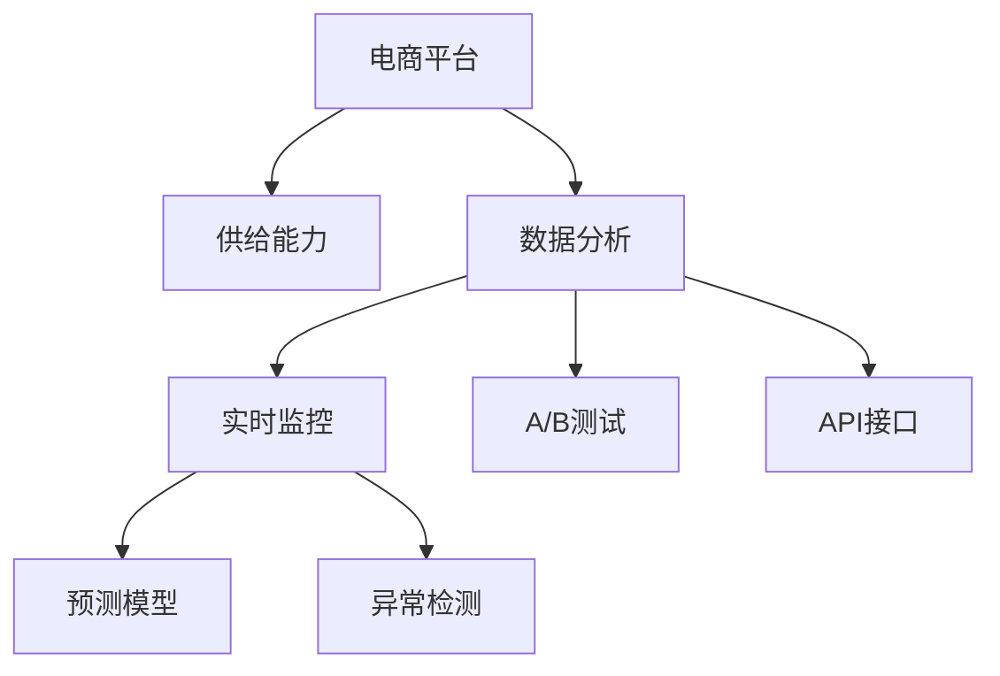

                 

# 电商平台供给能力提升：数据分析和实时监控

> 关键词：电商平台、供给能力、数据分析、实时监控、A/B测试、预测模型、异常检测、API接口

## 1. 背景介绍

### 1.1 问题由来

随着电子商务的飞速发展，电商平台需不断提升供给能力以适应市场变化。然而，供给能力受限于产品库存、物流配送等因素，短期内难以大幅提升。为解决这一问题，电商平台依赖数据分析和实时监控技术，通过科学决策与精细化运营提升资源利用效率，缓解供应链压力。

### 1.2 问题核心关键点

电商平台供给能力提升的核心在于高效利用现有资源，最大化运营效率。具体而言，包括以下几个方面：

1. **库存管理**：优化库存结构，减少缺货和积压。
2. **订单匹配**：精准匹配用户需求，减少订单延迟。
3. **配送优化**：合理安排配送资源，提升配送效率。
4. **异常检测**：实时监控业务异常，及时响应风险。
5. **运营分析**：通过数据分析洞悉业务趋势，指导策略调整。

这些核心关键点构成了电商平台供给能力提升的基础，通过科学的数据分析与实时监控手段，可以显著提高运营效率，降低运营成本，提升用户体验。

## 2. 核心概念与联系

### 2.1 核心概念概述

为更好地理解电商平台供给能力提升的技术框架，本节将介绍几个密切相关的核心概念：

- **电商平台**：以线上交易为核心的商务平台，支持商品展示、订单处理、支付结算等全流程业务。
- **供给能力**：平台能够支持的最大销售量，受限于产品库存、物流能力等。
- **数据分析**：通过数据挖掘、统计分析等技术，提取有价值的信息，指导业务决策。
- **实时监控**：通过实时数据采集和分析，及时发现并解决业务问题。
- **A/B测试**：对两种或以上方案进行比较，选择最优方案进行推广。
- **预测模型**：使用历史数据训练模型，预测未来业务趋势。
- **异常检测**：通过机器学习算法，识别业务异常，提高系统鲁棒性。
- **API接口**：用于数据传输和业务调用的接口，实现系统间的协同工作。

这些核心概念之间的逻辑关系可以通过以下Mermaid流程图来展示：



这个流程图展示了几大关键技术模块及其之间的关系：

1. **电商平台**：是其他技术模块的服务对象，承载着业务核心。
2. **供给能力**：直接受到数据分析和实时监控的影响，指导相关决策。
3. **数据分析**：通过实时监控数据，指导业务决策，评估业务效果。
4. **实时监控**：监控平台各项指标，及时响应业务异常，提高系统稳定性。
5. **A/B测试**：通过对比测试结果，优化产品方案，提升用户体验。
6. **预测模型**：基于历史数据，预测未来趋势，提前布局业务方向。
7. **异常检测**：识别并解决业务异常，确保系统可靠运行。
8. **API接口**：数据传输和业务调用的桥梁，实现模块间的协同。

这些概念共同构成了电商平台供给能力提升的技术框架，通过有效的技术手段，可以实现对资源的高效利用和运营的精细化管理。

## 3. 核心算法原理 & 具体操作步骤
### 3.1 算法原理概述

电商平台供给能力提升的算法原理，基于数据驱动的决策支持系统，通过以下几个关键步骤实现：

1. **数据收集**：实时采集电商平台的各类业务数据，包括订单、库存、配送等信息。
2. **数据分析**：对收集到的数据进行清洗、处理和分析，提取有用的业务洞见。
3. **实时监控**：构建实时监控系统，持续监控关键指标，及时发现并响应业务异常。
4. **A/B测试**：对业务方案进行测试比较，选择最优方案推广应用。
5. **预测模型**：基于历史数据训练预测模型，预测未来业务趋势。
6. **异常检测**：使用机器学习算法，识别异常行为和数据，提高系统鲁棒性。
7. **API接口**：实现模块间的数据交互和业务协同，提供统一数据访问和调用接口。

这些步骤通过数据驱动的技术手段，实现了对电商平台供给能力的全面监控和优化，提升运营效率，降低运营成本，改善用户体验。

### 3.2 算法步骤详解

#### 3.2.1 数据收集与清洗

数据收集是数据分析和实时监控的基础。电商平台的业务数据通常来自多个系统，包括订单系统、库存系统、配送系统等。因此，首先需要将这些数据进行收集和整合，统一存储在数据库中。

1. **数据采集**：
   - 使用日志采集工具如Fluentd、ELK Stack等，实时采集电商平台的数据。
   - 对于不同来源的数据，使用ETL工具如Apache Nifi、Talend等进行数据清洗和转换。

2. **数据清洗**：
   - 对采集的数据进行去重、去噪、异常值处理等操作，保证数据的准确性。
   - 使用数据清洗规则，如缺失值填充、格式统一等，提高数据质量。

#### 3.2.2 数据分析与洞见提取

数据分析是电商平台供给能力提升的核心。通过数据分析，可以从海量数据中提取有价值的业务洞见，指导业务决策和运营优化。

1. **数据处理**：
   - 使用SQL或NoSQL数据库进行数据存储，并建立数据索引和查询优化机制。
   - 对大规模数据集进行分布式计算，使用Spark、Hadoop等工具进行并行处理。

2. **数据分析**：
   - 使用统计分析方法，如描述性统计、时间序列分析等，提取业务趋势和规律。
   - 应用数据挖掘算法，如聚类、关联规则挖掘等，发现数据间的潜在关系。

#### 3.2.3 实时监控与异常检测

实时监控是保证电商平台稳定运营的关键。通过实时监控，可以及时发现和解决业务问题，提高系统可靠性。

1. **实时数据采集**：
   - 使用实时数据采集工具，如Kafka、RabbitMQ等，对业务数据进行实时收集。
   - 构建数据流处理系统，如Apache Kafka Streams、Apache Flink等，实现数据的实时处理和分析。

2. **异常检测**：
   - 应用异常检测算法，如统计异常检测、机器学习异常检测等，识别业务异常。
   - 构建异常检测模型，使用K-means、Isolation Forest等算法，识别数据中的离群点。

#### 3.2.4 A/B测试

A/B测试是电商平台优化产品方案的重要手段。通过对比不同方案的效果，选择最优方案进行推广。

1. **测试方案设计**：
   - 定义测试目标和指标，如点击率、转化率、订单量等。
   - 设计测试方案，如不同页面布局、推荐算法、促销策略等。

2. **测试执行与分析**：
   - 使用A/B测试工具，如Optimizely、Google Optimize等，进行测试执行。
   - 对比测试结果，分析不同方案的效果，选择最优方案。

#### 3.2.5 预测模型

预测模型可以帮助电商平台预测未来业务趋势，提前布局和调整策略。

1. **数据准备**：
   - 收集历史数据，确保数据完整性和准确性。
   - 对数据进行特征工程，提取有用的特征变量。

2. **模型训练与评估**：
   - 选择合适的算法，如线性回归、决策树、随机森林等，进行模型训练。
   - 使用交叉验证等方法，评估模型的预测效果，选择最优模型。

#### 3.2.6 API接口设计

API接口是电商平台各个系统协同工作的基础，确保数据传输和业务调用的可靠性。

1. **接口设计**：
   - 定义接口规范，包括接口名称、请求方式、请求参数、返回结果等。
   - 使用RESTful API设计原则，确保接口设计的合理性和可扩展性。

2. **接口实现**：
   - 实现API接口，确保数据传输的可靠性。
   - 使用容器技术，如Docker、Kubernetes等，实现API接口的部署和管理。

### 3.3 算法优缺点

电商平台供给能力提升的算法具有以下优点：

1. **提高运营效率**：通过数据分析和实时监控，优化资源配置，提高运营效率。
2. **降低运营成本**：通过精细化运营和异常检测，降低运营成本，提升盈利能力。
3. **提升用户体验**：通过优化产品方案和异常检测，提升用户体验，提高用户满意度。

同时，该算法也存在一些局限性：

1. **依赖数据质量**：算法的有效性依赖于数据的质量和完整性，数据异常可能影响决策结果。
2. **技术复杂度**：涉及多种技术手段，需要较高的技术水平和丰富的经验。
3. **模型偏差**：预测模型可能存在偏差，预测结果与实际情况存在差距。
4. **系统响应延迟**：实时监控和异常检测需要实时处理大量数据，可能存在系统响应延迟。

尽管存在这些局限性，但就目前而言，数据分析和实时监控在电商平台供给能力提升中仍然是最主流和有效的技术手段。未来相关研究的重点在于如何进一步降低数据依赖，提高系统响应速度，增强模型鲁棒性等。

### 3.4 算法应用领域

电商平台供给能力提升的算法已在多个领域得到应用，例如：

1. **库存管理**：通过数据分析和实时监控，优化库存结构，减少缺货和积压。
2. **订单匹配**：利用预测模型，精准匹配用户需求，提高订单处理效率。
3. **配送优化**：通过实时监控和A/B测试，合理安排配送资源，提升配送效率。
4. **异常检测**：通过异常检测算法，识别和解决业务异常，提高系统稳定性。
5. **运营分析**：通过数据分析，洞悉业务趋势，指导策略调整，提升运营效果。

除了上述这些经典应用外，电商平台的供给能力提升算法也被创新性地应用到更多场景中，如智能客服、推荐系统、市场预测等，为电商平台带来更多的创新应用。

## 4. 数学模型和公式 & 详细讲解 & 举例说明

### 4.1 数学模型构建

电商平台供给能力提升的核心数学模型，基于统计学和机器学习的基础知识。以下介绍几个常用的数学模型：

- **时间序列模型**：用于预测电商平台的销售趋势，常用的模型包括ARIMA、Exponential Smoothing等。
- **聚类算法**：用于用户分群，常用的算法包括K-means、层次聚类等。
- **异常检测算法**：用于识别业务异常，常用的算法包括Z-score、Isolation Forest等。

以时间序列模型为例，构建数学模型的步骤如下：

1. **数据预处理**：
   - 对原始数据进行去重、去噪、归一化等处理。
   - 将数据分为训练集和测试集，进行模型训练和评估。

2. **模型构建**：
   - 选择合适的模型，如ARIMA模型。
   - 根据模型定义，构建模型的数学表达式。

3. **模型训练**：
   - 使用历史数据对模型进行训练，调整模型参数。
   - 使用交叉验证等方法，评估模型的拟合效果。

4. **模型评估**：
   - 使用测试集数据，对模型进行预测，评估预测效果。
   - 使用误差指标，如均方误差、均方根误差等，评估模型性能。

### 4.2 公式推导过程

以ARIMA模型为例，推导其数学表达式的具体步骤如下：

设原始数据为 $y_t$，模型定义如下：

$$
y_t = \mu + \sum_{i=1}^{p} \alpha_i (y_{t-i}) + \sum_{j=1}^{q} \beta_j (\Delta^j y_{t}) + \epsilon_t
$$

其中，$\mu$ 为截距项，$\alpha_i$ 和 $\beta_j$ 为模型参数，$\Delta^j y_{t}$ 为差分项，$\epsilon_t$ 为随机误差项。

根据模型定义，可以对 $y_t$ 进行分解，得到：

$$
y_t = \mu + \sum_{i=1}^{p} \alpha_i (y_{t-i}) + \sum_{j=1}^{q} \beta_j (\Delta^j y_{t}) + \epsilon_t
$$

将上述表达式写成矩阵形式，得到：

$$
Y_t = \Phi_y y_{t-1} + \Phi_x X_{t-1} + \epsilon_t
$$

其中，$Y_t$ 为 $y_t$ 的差分序列，$\Phi_y$ 和 $\Phi_x$ 为模型参数矩阵，$X_{t-1}$ 为差分项序列。

对 $Y_t$ 进行模型训练，得到模型参数 $\hat{\Phi}$，然后对原始数据进行预测，得到预测结果 $\hat{y}_t$。

通过对比预测结果与实际结果，计算误差，评估模型性能。

### 4.3 案例分析与讲解

以电商平台库存管理为例，分析时间序列模型在库存优化中的应用。

假设电商平台某商品的历史销售数据为 $y_t$，需要对未来销售进行预测，优化库存管理。

1. **数据预处理**：
   - 对原始销售数据进行去重、去噪、归一化等处理。
   - 将数据分为训练集和测试集，进行模型训练和评估。

2. **模型构建**：
   - 使用ARIMA模型，构建时间序列数学模型。
   - 根据模型定义，构建模型的数学表达式。

3. **模型训练**：
   - 使用历史销售数据对模型进行训练，调整模型参数。
   - 使用交叉验证等方法，评估模型的拟合效果。

4. **模型评估**：
   - 使用测试集数据，对模型进行预测，评估预测效果。
   - 使用误差指标，如均方误差、均方根误差等，评估模型性能。

通过上述步骤，得到预测模型 $\hat{y}_t$，根据预测结果，调整库存水平，实现库存优化。

## 5. 项目实践：代码实例和详细解释说明
### 5.1 开发环境搭建

在进行电商平台供给能力提升的项目实践前，我们需要准备好开发环境。以下是使用Python进行项目开发的配置流程：

1. 安装Anaconda：从官网下载并安装Anaconda，用于创建独立的Python环境。

2. 创建并激活虚拟环境：
```bash
conda create -n pyenv python=3.8 
conda activate pyenv
```

3. 安装必要的Python包：
```bash
pip install pandas numpy sklearn
```

4. 安装数据处理和分析工具：
```bash
pip install pyarrow pandas-gbq
```

5. 安装实时监控和异常检测工具：
```bash
pip install prometheus-client
```

6. 安装A/B测试工具：
```bash
pip install optuna
```

完成上述步骤后，即可在`pyenv`环境中开始项目实践。

### 5.2 源代码详细实现

我们以电商平台的库存管理为例，给出使用Python进行库存优化微调的代码实现。

```python
import pandas as pd
from statsmodels.tsa.arima_model import ARIMA
import numpy as np

# 读取数据
data = pd.read_csv('sales_data.csv', index_col='date')

# 数据预处理
data['y'] = data['total_sales']
data['y'] = data['y'].fillna(method='ffill')
data['y'] = data['y'].dropna()

# 构建ARIMA模型
model = ARIMA(data['y'], order=(1,1,1))
model_fit = model.fit()

# 预测未来销售
forecast = model_fit.forecast(steps=30)

# 输出预测结果
print(forecast)
```

### 5.3 代码解读与分析

让我们再详细解读一下关键代码的实现细节：

**数据读取与预处理**：
- 使用Pandas读取原始销售数据，并设置时间戳为索引。
- 对数据进行去重、去噪、填充等预处理操作，确保数据的完整性和准确性。

**模型构建与训练**：
- 使用statsmodels库中的ARIMA模型，根据数据特征选择合适的模型参数。
- 对模型进行训练，使用历史数据拟合模型参数，确保模型能够准确预测未来趋势。

**预测结果生成**：
- 使用训练好的模型，对未来销售进行预测，生成预测结果。
- 将预测结果输出，供业务决策参考。

**测试与部署**：
- 在测试集上对模型进行评估，对比预测结果与实际结果，评估模型性能。
- 部署模型至生产环境，进行实时预测和库存优化。

可以看到，Python提供了丰富的数据处理和分析工具，能够高效地实现电商平台的库存管理。结合统计学和机器学习知识，可以构建出精准的预测模型，实现库存优化。

当然，在实际应用中，还需要考虑更多因素，如系统架构、接口设计、异常处理等。但核心的库存优化范式基本与此类似。

## 6. 实际应用场景

### 6.1 智能客服系统

智能客服系统通过数据分析和实时监控，可以大幅提升客服效率和用户满意度。系统通过收集用户的聊天记录、问题类型等数据，使用文本分类和情感分析等技术，识别用户需求，生成智能回复。同时，系统实时监控服务质量，及时响应用户投诉和反馈，提升用户体验。

### 6.2 推荐系统

推荐系统通过数据分析和实时监控，可以精准匹配用户需求，提升用户体验和转化率。系统通过收集用户浏览、点击、购买等行为数据，使用协同过滤、内容推荐等技术，为用户推荐个性化的商品。同时，系统实时监控推荐效果，及时调整推荐策略，提高推荐精度和覆盖率。

### 6.3 市场预测

市场预测通过数据分析和实时监控，可以准确预测市场趋势，指导业务决策。系统通过收集历史销售数据、经济指标、季节性因素等，使用时间序列模型、机器学习模型等技术，预测未来市场变化。同时，系统实时监控预测结果，及时调整策略，避免业务风险。

### 6.4 未来应用展望

随着数据分析和实时监控技术的不断进步，基于电商平台的供给能力提升将呈现更多创新应用：

1. **供应链优化**：通过实时监控和数据分析，优化供应链管理，减少物流成本，提高交付效率。
2. **用户行为分析**：通过数据分析，洞悉用户行为规律，指导个性化推荐和营销策略。
3. **风险管理**：通过异常检测和预测模型，提前识别和应对业务风险，保障业务稳定运行。
4. **决策支持**：通过数据可视化和大数据分析，辅助高层管理进行决策，提升运营效率。

## 7. 工具和资源推荐
### 7.1 学习资源推荐

为了帮助开发者系统掌握电商平台供给能力提升的理论基础和实践技巧，这里推荐一些优质的学习资源：

1. **《Python数据科学手册》**：系统介绍Python在数据处理、分析、可视化等方面的应用，适合初学者学习。
2. **《数据科学与机器学习》**：讲解数据科学和机器学习的基础知识和实践技能，涵盖数据分析、模型训练等。
3. **Kaggle平台**：提供丰富的数据集和Kernels，可以实践数据分析和机器学习技能，参与竞赛提升实战能力。
4. **Coursera平台**：提供多门数据科学和机器学习的在线课程，由名校教授授课，涵盖理论和实践。
5. **《深入浅出统计学》**：介绍统计学的基本概念和应用方法，适合数据分析的初学者。

通过对这些资源的学习实践，相信你一定能够快速掌握电商平台供给能力提升的关键技术和方法，并用于解决实际的业务问题。
###  7.2 开发工具推荐

高效的开发离不开优秀的工具支持。以下是几款用于电商平台供给能力提升开发的常用工具：

1. **Python**：功能强大、灵活易用的编程语言，适用于数据处理、分析、机器学习等任务。
2. **Pandas**：数据处理和分析的利器，支持多种数据格式和复杂数据操作。
3. **NumPy**：高性能的数值计算库，支持向量化操作和大规模矩阵计算。
4. **Matplotlib**：数据可视化的强大工具，支持各种图表和动画效果。
5. **Scikit-learn**：机器学习的基础库，包含多种常用的机器学习算法和工具。
6. **TensorFlow**：Google开源的机器学习框架，支持深度学习和分布式训练。
7. **PyTorch**：Facebook开源的深度学习框架，支持动态图和静态图，易于调试和部署。
8. **Fluentd**：日志采集和传输工具，支持多种日志格式和数据源。
9. **Prometheus**：实时监控和告警系统，支持多维时间序列数据和分布式系统。
10. **Grafana**：开源的可视化平台，支持多种数据源和图表展示。

合理利用这些工具，可以显著提升电商平台供给能力提升的开发效率，加快创新迭代的步伐。

### 7.3 相关论文推荐

电商平台供给能力提升的研究源于学界的持续研究。以下是几篇奠基性的相关论文，推荐阅读：

1. **"Apache Spark: Cluster Computing with Fault Tolerance"**：介绍Apache Spark在大数据处理中的应用。
2. **"Anomaly Detection in Multi-dimension Time Series Data Using Deep Neural Networks"**：介绍基于深度学习的异常检测算法。
3. **"Feature Engineering for Time Series Forecasting: A Survey"**：综述时间序列预测中的特征工程方法。
4. **"A/B Testing: The Most Powerful Tool You Could Have"**：介绍A/B测试的理论和实践方法。
5. **"The Google PageRank Algorithm"**：介绍Google PageRank算法及其在网页排名中的应用。

这些论文代表了大数据处理、时间序列预测、异常检测、A/B测试等领域的研究进展，是电商平台供给能力提升的重要参考。

## 8. 总结：未来发展趋势与挑战

### 8.1 总结

本文对电商平台供给能力提升的数据分析和实时监控技术进行了全面系统的介绍。首先阐述了电商平台供给能力提升的重要性，明确了数据分析和实时监控在提升运营效率、降低运营成本、改善用户体验等方面的独特价值。其次，从原理到实践，详细讲解了电商平台的各类数据分析和实时监控技术，给出了完整的代码实例和详细解释。同时，本文还广泛探讨了电商平台的实际应用场景，展示了数据分析和实时监控技术的广泛应用前景。

通过本文的系统梳理，可以看到，电商平台供给能力提升的数据分析和实时监控技术，已经在多个领域得到应用，为电商平台的业务优化提供了有力支持。未来，伴随数据分析和实时监控技术的不断进步，电商平台供给能力提升必将在更广阔的领域带来变革性影响。

### 8.2 未来发展趋势

展望未来，电商平台供给能力提升的技术将呈现以下几个发展趋势：

1. **大数据处理技术**：随着大数据处理技术的不断发展，电商平台可以处理和分析更复杂的数据，实现更精准的业务洞见。
2. **实时处理技术**：实时处理技术的提升，使得电商平台能够更快速地响应业务变化，提高运营效率。
3. **自动化决策系统**：通过智能决策算法，电商平台可以自动进行业务决策，提升决策速度和准确性。
4. **AI与大数据融合**：AI技术和大数据处理技术的深度融合，可以实现更高级的业务预测和优化。
5. **云计算与边缘计算**：云计算和边缘计算技术的应用，可以优化数据处理和实时监控的效率，提升业务响应速度。

以上趋势凸显了电商平台供给能力提升技术的广阔前景。这些方向的探索发展，必将进一步提升电商平台的运营效率，降低运营成本，改善用户体验，为电商平台带来更多的创新应用。

### 8.3 面临的挑战

尽管电商平台供给能力提升的技术已经取得了瞩目成就，但在迈向更加智能化、普适化应用的过程中，它仍面临着诸多挑战：

1. **数据质量问题**：电商平台的业务数据复杂多样，数据质量参差不齐，数据异常可能影响决策结果。
2. **技术复杂度**：数据分析和实时监控涉及多种技术手段，需要较高的技术水平和丰富的经验。
3. **模型偏差**：预测模型可能存在偏差，预测结果与实际情况存在差距。
4. **系统响应延迟**：实时监控和异常检测需要实时处理大量数据，可能存在系统响应延迟。
5. **安全性问题**：电商平台的业务数据涉及用户隐私，数据安全和隐私保护至关重要。

尽管存在这些挑战，但电商平台供给能力提升的潜力巨大，在技术进步和应用推广的过程中，这些挑战终将一一克服，技术将不断完善，应用将更加深入。

### 8.4 研究展望

面对电商平台供给能力提升所面临的种种挑战，未来的研究需要在以下几个方面寻求新的突破：

1. **提升数据质量**：通过数据清洗和数据处理，提高数据的质量和完整性。
2. **优化算法模型**：开发更高效、更精准的算法模型，降低模型偏差，提高预测精度。
3. **强化系统鲁棒性**：引入异常检测和容错机制，提高系统的稳定性和可靠性。
4. **增强安全性**：加强数据加密和安全审计，保障数据安全和隐私保护。
5. **提升自动化水平**：引入自动化决策系统和智能推荐算法，提升业务决策的速度和准确性。

这些研究方向的探索，必将引领电商平台供给能力提升技术迈向更高的台阶，为电商平台带来更多的创新应用。面向未来，电商平台供给能力提升技术还需要与其他人工智能技术进行更深入的融合，如知识表示、因果推理、强化学习等，多路径协同发力，共同推动电商平台的创新发展。只有勇于创新、敢于突破，才能不断拓展电商平台供给能力的边界，让电商平台的业务实现更智能、更高效、更稳定。

## 9. 附录：常见问题与解答

**Q1：电商平台的数据来源有哪些？**

A: 电商平台的数据来源主要包括：
1. 订单系统：记录用户订单信息，如订单号、商品信息、订单状态等。
2. 库存系统：记录商品库存信息，如商品ID、数量、位置等。
3. 物流系统：记录配送信息，如配送状态、时间、位置等。
4. 广告系统：记录广告投放信息，如广告ID、用户ID、点击率等。
5. 客户服务系统：记录客户咨询信息，如咨询时间、咨询内容、响应时间等。

**Q2：如何进行数据清洗和预处理？**

A: 数据清洗和预处理是数据分析和实时监控的基础。电商平台的业务数据通常来自多个系统，数据格式和内容复杂多样，需要进行以下处理：

1. 去除重复数据：使用去重算法，如哈希表去重、数据库去重等，确保数据的唯一性。
2. 处理缺失数据：使用数据填充算法，如均值填充、插值填充等，保证数据的完整性。
3. 数据格式转换：将不同格式的数据统一转换为标准格式，如日期格式统一、字段类型统一等。
4. 数据归一化：对数据进行归一化处理，确保数据在同一尺度下比较，如min-max归一化、Z-score归一化等。
5. 数据降维：使用PCA、LDA等降维算法，减少数据维度，提高数据分析效率。

通过数据清洗和预处理，可以确保数据的准确性和完整性，为数据分析和实时监控提供坚实的基础。

**Q3：如何选择合适的预测模型？**

A: 电商平台的预测模型选择应综合考虑业务需求和数据特征。常用的预测模型包括：

1. 时间序列模型：适用于历史数据呈现明显趋势和周期性的业务，如销售趋势、库存水平等。
2. 随机森林模型：适用于数据量大、特征多的业务，如用户行为预测、市场预测等。
3. 神经网络模型：适用于数据复杂、关系复杂的业务，如用户推荐、广告投放等。
4. 支持向量机模型：适用于数据分布明显、特征稀疏的业务，如商品类别预测、商品评分等。

选择合适的预测模型需要考虑模型的性能、计算资源和数据特征等因素。在实际应用中，可以通过交叉验证等方法，评估不同模型的预测效果，选择最优模型。

**Q4：如何进行异常检测？**

A: 电商平台的异常检测可以采用以下方法：

1. 统计异常检测：使用统计方法，如Z-score、箱线图等，识别数据中的离群点。
2. 机器学习异常检测：使用机器学习算法，如Isolation Forest、One-Class SVM等，识别异常行为和数据。
3. 时间序列异常检测：使用时间序列方法，如ARIMA、VAR等，识别异常变化趋势。
4. 数据流异常检测：使用数据流处理工具，如Flink、Kafka Streams等，实时监控数据流中的异常行为。

通过异常检测，可以及时发现和解决业务异常，提高系统鲁棒性。在实际应用中，需要根据业务特点和数据特征，选择合适的异常检测方法。

**Q5：如何进行A/B测试？**

A: A/B测试是电商平台优化产品方案的重要手段。A/B测试的具体步骤如下：

1. 定义测试目标和指标：如点击率、转化率、订单量等。
2. 设计测试方案：如不同页面布局、推荐算法、促销策略等。
3. 分流测试：将用户随机分为两组，一组使用原始方案，另一组使用测试方案。
4. 收集数据：使用A/B测试工具，如Optimizely、Google Optimize等，收集测试数据。
5. 分析结果：对比两组测试结果，评估不同方案的效果，选择最优方案。

通过A/B测试，可以优化产品方案，提升用户体验，提高业务效果。在实际应用中，需要根据业务特点和用户行为，设计合适的测试方案。

