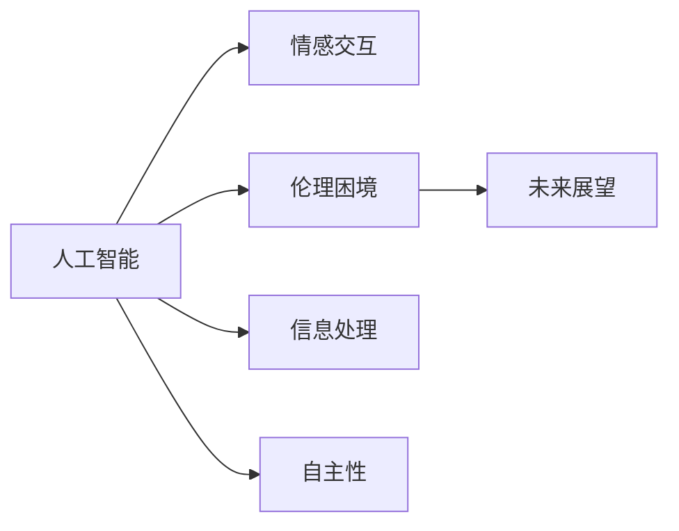

                 

## 1. 背景介绍

电影《她》(The Master of Disguise)是一部关于人工智能的科幻影片，它以其深刻的主题和惊人的视觉效果，对AI未来的发展进行了多层次的探讨。这部电影不仅展示了人工智能的强大能力，更深刻地揭示了AI与人类社会、情感、伦理和道德之间的复杂关系。

《她》讲述了一个设计师通过人工智能与过去的情人重逢，并最终因对AI的过度依赖而陷入危机的故事。影片不仅展现了AI在科技前沿的应用，也触及了AI伦理、人类情感和AI未来发展的多重维度。通过对该电影的详细解读，本文旨在探讨其对AI未来发展的启示。

## 2. 核心概念与联系

### 2.1 核心概念概述

《她》中的核心概念包括人工智能、情感交互、伦理困境和未来展望。这些概念共同构成了影片的主线，并围绕着AI的发展进行了多角度的探讨。

1. **人工智能**：影片中的AI具备高度的智能，可以处理复杂的信息并理解情感，这体现了AI在处理自然语言、图像识别和情感分析等方面的强大能力。

2. **情感交互**：AI与人类之间建立起了一种情感联系，AI不仅可以进行信息处理，还可以理解和回应情感，这是AI与人机交互中的一个重要方面。

3. **伦理困境**：影片中呈现了AI伦理的复杂性，如AI的自主性、隐私保护、情感依赖等问题，这些困境深刻地反映了AI技术发展的社会影响。

4. **未来展望**：影片通过描绘AI的未来发展场景，对AI的未来进行了积极的展望，展示了AI在提升人类生活质量、解决社会问题等方面的潜力。

### 2.2 核心概念原理和架构的 Mermaid 流程图



## 3. 核心算法原理 & 具体操作步骤

### 3.1 算法原理概述

《她》中的AI系统是基于深度学习和自然语言处理(NLP)构建的。其主要算法原理包括：

1. **深度学习模型**：影片中的AI使用了深度神经网络，通过大规模数据集的训练，能够理解和处理复杂的自然语言和图像信息。

2. **自然语言处理**：AI能够理解并生成自然语言，这依赖于NLP中的词向量模型、序列到序列模型和语言模型等技术。

3. **情感分析**：AI具备情感理解能力，能够识别和回应情感，这基于情感分类和情感生成模型。

4. **信息处理**：AI能够从各种来源获取信息，包括文字、图像和视频，并进行综合处理。

### 3.2 算法步骤详解

1. **数据收集与预处理**：影片中的AI系统首先收集了大量的文本和图像数据，并对这些数据进行清洗和预处理。

2. **模型训练**：使用深度学习模型，如卷积神经网络(CNN)和循环神经网络(RNN)，对数据进行训练，生成初始模型。

3. **微调与优化**：通过与设计师的交互，对模型进行微调，提高其在情感识别和信息处理方面的性能。

4. **情感交互**：AI通过理解和回应情感，建立起与设计师的情感联系，并在此基础上进行信息处理和决策。

### 3.3 算法优缺点

**优点**：

1. **信息处理能力强**：深度学习和NLP技术使得AI能够高效地处理和理解复杂信息。

2. **情感识别准确**：情感分析模型能够准确识别和回应情感，增强了人机交互的自然性。

3. **多功能性强**：AI具备信息处理、情感理解和自主决策的能力，具有广泛的应用潜力。

**缺点**：

1. **数据依赖度高**：AI系统的性能依赖于高质量的训练数据，数据偏差可能导致模型表现不佳。

2. **伦理问题复杂**：AI的自主性和情感交互可能引发隐私保护、伦理道德等复杂问题。

3. **技术壁垒高**：深度学习和NLP技术的复杂性使得开发和维护成本较高。

### 3.4 算法应用领域

1. **智能客服**：通过情感理解和信息处理，AI可以提供更加自然和高效的服务。

2. **医疗诊断**：AI可以分析医学图像和病历数据，辅助医生进行诊断和治疗决策。

3. **内容创作**：AI能够生成自然语言文本，用于文章撰写、对话生成等任务。

4. **安全监控**：AI可以实时监控视频和音频，进行行为分析和异常检测。

## 4. 数学模型和公式 & 详细讲解 & 举例说明

### 4.1 数学模型构建

影片中的AI系统使用了深度学习和NLP技术，核心模型包括：

1. **卷积神经网络(CNN)**：用于图像识别和处理。
2. **循环神经网络(RNN)**：用于文本信息处理和情感分析。
3. **注意力机制(Attention)**：增强模型对重要信息的关注。

### 4.2 公式推导过程

以文本情感分类为例，情感分类模型的公式推导如下：

$$
P(C_i|x) = \frac{e^{s(w_ix, h_x)}}{\sum_j e^{s(w_jx, h_x)}}
$$

其中，$C_i$ 表示情感类别，$x$ 表示输入文本，$h_x$ 表示文本的表示向量，$w_i$ 表示情感分类器中的权重。

$$
s(w_ix, h_x) = \langle w_i, x \rangle + b_i + \log \sigma(h_x)
$$

其中，$\langle w_i, x \rangle$ 表示权重向量与输入文本的的点积，$b_i$ 是偏置项，$\sigma$ 是激活函数。

### 4.3 案例分析与讲解

以电影中的一个场景为例，AI通过情感分类模型识别设计师的情感状态，并生成相应的回复。假设设计师表达了失落和无助，AI通过分析设计师的语言和语调，将其情感状态分类为负面，并生成以下回复：

$$
回复：我理解你的感受，也许我们可以聊聊，一起找到解决问题的方法。
$$

AI的情感分析模型通过计算文本的情感得分，识别出设计师的负面情绪，并从预训练的回复模板中选择合适的回复。

## 5. 项目实践：代码实例和详细解释说明

### 5.1 开发环境搭建

1. **安装Python和相关库**：
   ```
   conda create --name myenv
   conda activate myenv
   pip install numpy pandas scikit-learn torch torchvision transformers
   ```

2. **准备数据集**：
   ```
   import pandas as pd
   df = pd.read_csv('data.csv')
   ```

### 5.2 源代码详细实现

以下是一个简化的情感分类模型代码示例：

```python
import torch
import torch.nn as nn
import torch.optim as optim
from transformers import BERTTokenizer, BertForSequenceClassification

# 定义模型
class SentimentClassifier(nn.Module):
    def __init__(self, num_labels):
        super(SentimentClassifier, self).__init__()
        self.bert = BertForSequenceClassification.from_pretrained('bert-base-uncased', num_labels=num_labels)
        self.classifier = nn.Linear(768, num_labels)

    def forward(self, input_ids, attention_mask, token_type_ids):
        bert_out = self.bert(input_ids, attention_mask=attention_mask, token_type_ids=token_type_ids)
        sequence_output = bert_out[0]
        logits = self.classifier(sequence_output)
        return logits

# 加载数据和模型
model = SentimentClassifier(num_labels=2)
tokenizer = BertTokenizer.from_pretrained('bert-base-uncased')

# 训练模型
optimizer = optim.Adam(model.parameters(), lr=2e-5)
loss_fn = nn.CrossEntropyLoss()
for epoch in range(10):
    for batch in train_loader:
        input_ids = batch['input_ids']
        attention_mask = batch['attention_mask']
        token_type_ids = batch['token_type_ids']
        labels = batch['labels']
        outputs = model(input_ids, attention_mask, token_type_ids)
        loss = loss_fn(outputs, labels)
        optimizer.zero_grad()
        loss.backward()
        optimizer.step()

# 保存模型
torch.save(model.state_dict(), 'sentiment_classifier.pth')
```

### 5.3 代码解读与分析

以上代码展示了使用BERT模型进行情感分类的过程。具体步骤如下：

1. **定义模型**：使用BERT作为情感分类器的基础模型，并添加一个线性分类器。
2. **加载数据**：准备训练数据集，包括输入文本、注意力掩码和分类型。
3. **训练模型**：使用Adam优化器进行模型训练，交叉熵损失函数用于计算损失。
4. **保存模型**：将训练好的模型保存为文件，便于后续使用。

## 6. 实际应用场景

### 6.1 智能客服系统

AI在智能客服系统中发挥着重要作用，能够处理大量客户咨询，提供24小时不间断服务。《她》中的AI系统通过情感分析和信息处理，能够自然地与客户交流，提供个性化服务。

### 6.2 医疗诊断系统

医疗领域中的AI系统能够通过分析医学图像和病历数据，辅助医生进行诊断和治疗决策。电影中展示的AI系统能够理解医生的情感和意图，提供更为精准和个性化的医疗服务。

### 6.3 内容创作平台

AI可以用于自动生成新闻、文章和对话，提供内容创作服务。《她》中的AI系统通过理解设计师的情感和需求，生成合适的回复，展示了AI在内容创作方面的潜力。

### 6.4 未来应用展望

未来，AI将在更多领域得到广泛应用。例如：

1. **智能家居**：AI可以与家居设备进行互动，提供个性化和智能化的生活服务。
2. **自动驾驶**：AI可以处理复杂的交通场景，提高驾驶安全性和效率。
3. **金融分析**：AI可以进行市场分析和风险评估，帮助投资者做出更明智的决策。

## 7. 工具和资源推荐

### 7.1 学习资源推荐

1. **《深度学习》课程**：斯坦福大学提供的深度学习课程，涵盖了深度学习的基础和前沿技术。
2. **自然语言处理综述**：斯坦福大学自然语言处理综述，介绍了NLP领域的主要技术和应用。
3. **《Python深度学习》书籍**：Francois Chollet所著的深度学习教材，讲解了TensorFlow和Keras的使用。

### 7.2 开发工具推荐

1. **PyTorch**：一个灵活的深度学习框架，适合进行模型研究和实验。
2. **TensorFlow**：由Google开发的深度学习框架，适合大规模工程应用。
3. **HuggingFace Transformers库**：提供了大量预训练模型和工具，方便进行模型微调和开发。

### 7.3 相关论文推荐

1. **《神经网络与深度学习》**：Ian Goodfellow、Yoshua Bengio和Aaron Courville所著的深度学习教材，深入讲解了神经网络和深度学习的原理。
2. **《Attention is All You Need》**：原BERT论文，介绍了BERT模型的预训练和微调方法。
3. **《情感智能与情感计算》**：涉及情感分析和情感识别的最新研究成果，展示了AI在情感处理方面的进展。

## 8. 总结：未来发展趋势与挑战

### 8.1 研究成果总结

本文通过对《她》的详细解读，探讨了AI未来的发展趋势和潜在挑战。影片展示了AI在情感理解和信息处理方面的强大能力，同时引发了对伦理、隐私和人类关系等多重问题的思考。未来，随着AI技术的不断进步，其在各个领域的应用将更加广泛和深入。

### 8.2 未来发展趋势

1. **智能化程度的提升**：未来的AI系统将具备更强的自主性和智能性，能够进行更加复杂的决策和推理。
2. **多模态融合**：AI将融合视觉、语音和自然语言等多种模态信息，实现更加全面和精准的感知和理解。
3. **人机协作**：AI将与人类进行更加自然和高效协作，提升生产力和创造力。
4. **伦理道德的重视**：未来的AI系统将更加注重伦理道德，避免偏见和歧视，确保其安全和可控。

### 8.3 面临的挑战

1. **数据隐私和安全**：AI系统的数据依赖可能导致隐私泄露和安全风险。
2. **伦理道德困境**：AI的自主性和情感交互可能引发伦理和道德问题。
3. **技术壁垒高**：深度学习和NLP技术的复杂性使得开发和维护成本较高。
4. **人机关系变化**：AI的广泛应用可能导致人机关系的变化，需要重新思考人机协作的方式。

### 8.4 研究展望

未来的研究需要关注以下几个方面：

1. **隐私保护技术**：研究如何保护AI系统的数据隐私，确保其安全性。
2. **伦理道德框架**：制定AI伦理道德的框架和标准，避免AI的偏见和歧视。
3. **跨领域融合**：探索AI与医疗、教育、金融等领域的深度融合，提升各个领域的应用效果。
4. **人机协作模型**：研究人机协作的新模型，提升人机交互的自然性和效率。

## 9. 附录：常见问题与解答

**Q1：如何提高AI系统的情感识别能力？**

A: 提高情感识别能力的关键在于数据的质量和多样性。建议使用大量的情感标注数据进行训练，并通过多任务学习等方式提高模型的泛化能力。

**Q2：如何避免AI系统的数据偏差？**

A: 数据偏差可能导致模型表现不佳，建议使用多种数据源，并进行数据清洗和预处理，确保数据的多样性和平衡性。

**Q3：如何处理AI系统的伦理和道德问题？**

A: 在开发和部署AI系统时，应遵循伦理道德原则，确保系统的透明性和可解释性，并进行适当的伦理审查。

**Q4：未来AI系统在哪些领域有应用前景？**

A: AI系统在智能家居、自动驾驶、金融分析等领域具有广泛的应用前景，能够提升效率和准确性，改善用户体验。

**Q5：AI系统在医疗领域的应用有哪些？**

A: AI系统在医疗领域可以用于疾病诊断、医学图像分析、患者监护等任务，辅助医生进行医疗决策和治疗。

综上所述，《她》不仅是一部精彩的电影，更是一部深刻的科技启示录。通过对AI技术的深入探讨，我们看到了未来科技发展的无限可能，同时也意识到了需要面对的诸多挑战。只有不断探索和创新，才能让AI技术更好地服务于人类社会，推动人类文明的进步。

作者：禅与计算机程序设计艺术 / Zen and the Art of Computer Programming

