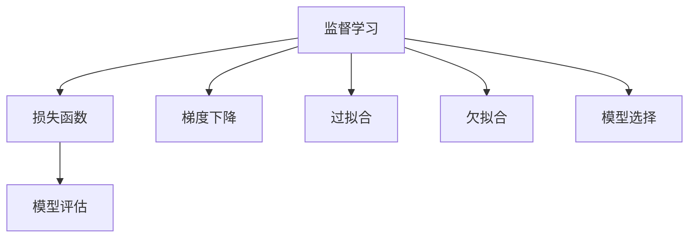
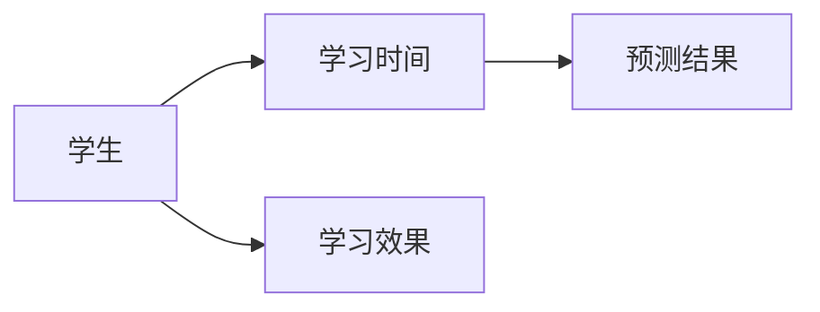

                 

# 监督学习 (Supervised Learning) 原理与代码实例讲解

> 关键词：监督学习, 机器学习, 监督学习算法, 梯度下降, 损失函数, Python代码实现, 逻辑回归, 线性回归

## 1. 背景介绍

### 1.1 问题由来
在人工智能的广泛应用中，监督学习是其中最为重要的一类学习方法。它基于有标签的训练数据，通过构建模型学习输入和输出之间的映射关系，从而实现对未知数据的预测。常见的监督学习算法包括线性回归、逻辑回归、决策树、支持向量机等。

监督学习算法被广泛应用于各种场景中，如金融风险评估、医疗诊断、推荐系统、图像分类、语音识别等。其核心思想是通过对有标签数据的学习，使模型能够对新的、未见过的数据进行准确预测。因此，监督学习算法的有效性，直接决定了其应用场景的广泛性和效果。

然而，在实际应用中，如何设计合适的模型结构，选择合适的损失函数，合理设置超参数，以及高效地训练和评估模型，是监督学习算法面临的重要挑战。特别是在大规模数据集上，如何处理计算资源的限制、优化训练效率，以及保证模型的泛化性能，成为了制约监督学习算法应用的关键问题。

## 2. 核心概念与联系

### 2.1 核心概念概述

为更好地理解监督学习算法，本节将介绍几个密切相关的核心概念：

- 监督学习 (Supervised Learning)：指使用有标签的训练数据，训练模型对未知数据进行预测的一种学习范式。监督学习算法通过学习输入特征和输出标签之间的关系，预测新数据的标签或数值。
- 损失函数 (Loss Function)：用于衡量模型预测结果与真实标签之间的差异，是监督学习中最重要的组成部分之一。损失函数的优化目标，是使得模型在训练数据上的预测误差最小化。
- 梯度下降 (Gradient Descent)：一种常用的优化算法，通过不断调整模型参数，最小化损失函数，以获得最优的模型参数。
- 模型评估 (Model Evaluation)：指在验证集或测试集上，使用评估指标（如准确率、精确率、召回率等）对模型性能进行评估，确保模型的泛化性能。
- 过拟合 (Overfitting)：指模型在训练集上表现良好，但在测试集或实际应用中表现不佳的现象。通常通过正则化、增加数据量等方式避免。
- 欠拟合 (Underfitting)：指模型无法很好地拟合训练数据，泛化性能较差。通常通过增加模型复杂度、调整正则化强度等方式解决。
- 模型选择 (Model Selection)：指根据任务特点，选择合适的模型结构和算法，以达到最优的预测效果。

这些核心概念之间的逻辑关系可以通过以下Mermaid流程图来展示：



这个流程图展示监督学习的核心概念及其之间的关系：

1. 监督学习算法基于有标签数据进行训练。
2. 损失函数衡量模型预测与真实标签之间的差异。
3. 梯度下降通过不断调整模型参数，最小化损失函数。
4. 模型评估用于衡量模型的泛化性能。
5. 过拟合和欠拟合是模型训练中常见的问题。
6. 模型选择指根据任务特点选择合适的模型结构。

这些概念共同构成了监督学习算法的工作原理和优化方向。

## 3. 核心算法原理 & 具体操作步骤

### 3.1 算法原理概述

监督学习算法的核心思想是利用有标签数据，通过优化损失函数，学习输入特征和输出标签之间的映射关系，从而实现对未知数据的预测。其基本流程包括模型构建、损失函数定义、参数优化和模型评估等步骤。

监督学习算法通常分为两部分：模型部分和损失函数部分。模型部分描述了如何构建模型结构，通常包括特征提取、模型训练和模型预测等步骤。损失函数部分则定义了模型预测结果与真实标签之间的差异，通过优化损失函数来调整模型参数，使得模型预测结果与真实标签尽可能接近。

### 3.2 算法步骤详解

以下将详细介绍监督学习算法的详细步骤：

**Step 1: 数据准备**
- 收集训练数据，包括输入特征 $x$ 和输出标签 $y$。
- 将数据分为训练集、验证集和测试集，通常训练集用于模型训练，验证集用于模型选择，测试集用于模型评估。

**Step 2: 模型选择**
- 根据任务特点，选择适合的任务模型结构。常见的模型结构包括线性回归、逻辑回归、决策树、支持向量机等。
- 定义模型参数 $\theta$，如线性回归中的权重 $w$ 和偏置 $b$，逻辑回归中的权重 $w$ 和偏置 $b$。

**Step 3: 损失函数定义**
- 根据任务特点，选择合适的损失函数。常见的损失函数包括均方误差损失、交叉熵损失等。
- 例如，线性回归的损失函数为 $L(w,b)=\frac{1}{n}\sum_{i=1}^n(y_i-\hat{y}_i)^2$，其中 $y_i$ 为真实标签，$\hat{y}_i$ 为模型预测结果。

**Step 4: 模型训练**
- 使用梯度下降等优化算法，最小化损失函数，优化模型参数 $\theta$。
- 例如，线性回归的梯度下降算法为 $w\leftarrow w-\eta\frac{1}{n}\sum_{i=1}^n(2x_iy_i-\hat{y}_i)$，$b\leftarrow b-\eta\frac{1}{n}\sum_{i=1}^n(2x_iy_i-\hat{y}_i)$。

**Step 5: 模型评估**
- 在验证集或测试集上，使用评估指标对模型性能进行评估，如准确率、精确率、召回率等。
- 根据评估结果，选择最优模型进行预测。

### 3.3 算法优缺点

监督学习算法具有以下优点：
1. 效果好：基于有标签数据训练，预测准确率通常较高。
2. 应用广：适用于各种分类和回归任务，可以灵活选择模型结构和损失函数。
3. 可解释性：模型结构和损失函数易于解释，便于理解模型的工作机制。

同时，监督学习算法也存在一定的局限性：
1. 依赖标注数据：需要大量有标签数据，数据标注成本较高。
2. 泛化能力不足：训练数据与测试数据分布不一致时，模型泛化性能较差。
3. 计算资源消耗大：复杂模型和高维数据会增加计算复杂度，训练时间长。

尽管存在这些局限性，但监督学习算法仍然是机器学习领域最为经典和有效的方法之一，广泛应用于各种实际场景中。

### 3.4 算法应用领域

监督学习算法在多个领域中得到广泛应用，包括但不限于：

- 金融风险评估：利用历史交易数据，预测新交易是否存在风险。
- 医疗诊断：基于患者历史病历和检查结果，预测患者疾病类型。
- 推荐系统：根据用户历史行为，预测用户可能感兴趣的物品。
- 图像分类：利用图像特征，对图像进行分类识别。
- 语音识别：基于语音信号特征，识别语音内容。
- 自然语言处理：利用文本特征，进行情感分析、文本分类等任务。

监督学习算法在以上领域中，都展现了其强大的预测能力和泛化性能，成为推动人工智能技术应用的重要手段。

## 4. 数学模型和公式 & 详细讲解 & 举例说明

### 4.1 数学模型构建

监督学习算法的核心是构建模型，并定义损失函数。本节将详细介绍线性回归模型的构建和损失函数定义。

线性回归模型的目标是通过学习输入特征 $x_i$ 和输出标签 $y_i$ 之间的关系，预测新的输入 $x$ 的输出标签 $y$。设输入特征 $x_i$ 为 $n$ 维向量，输出标签 $y_i$ 为标量，线性回归模型的数学表达式为：

$$
y=\hat{y}=\theta^Tx
$$

其中 $\theta$ 为模型参数，包含 $n+1$ 个元素，第一个元素为偏置项 $b$，其余 $n$ 个元素为权重 $w$。

### 4.2 公式推导过程

接下来，我们通过推导线性回归模型的损失函数和梯度下降算法，进一步理解监督学习算法的工作原理。

**损失函数推导**
假设训练集为 $D=\{(x_i,y_i)\}_{i=1}^n$，其中 $x_i$ 为 $n$ 维向量，$y_i$ 为标量。线性回归的损失函数定义为均方误差损失：

$$
L(w,b)=\frac{1}{n}\sum_{i=1}^n(y_i-\hat{y}_i)^2
$$

其中 $\hat{y}_i=\theta^Tx_i$ 为模型预测结果。

**梯度下降算法推导**
梯度下降算法通过最小化损失函数，优化模型参数 $\theta$。梯度下降的更新公式为：

$$
\theta \leftarrow \theta - \eta\frac{1}{n}\sum_{i=1}^n(2x_iy_i-\hat{y}_i)x_i^T
$$

其中 $\eta$ 为学习率，控制每次参数更新的步长。

### 4.3 案例分析与讲解

以下我们将通过一个简单的案例，展示监督学习算法的应用过程。

**案例背景**
假设我们要预测学生的成绩，已知学生的学习时间 $x$ 和学习效果 $y$ 的样本数据，如图 1 所示。



**数据准备**
- 收集 $n$ 个样本数据，每个样本包含学习时间和学习效果两个特征。
- 将数据划分为训练集和测试集，如表 1 所示。

**模型选择**
- 选择线性回归模型，定义模型参数 $\theta$。

**损失函数定义**
- 根据训练数据，定义均方误差损失函数。

**模型训练**
- 使用梯度下降算法，最小化损失函数。

**模型评估**
- 在测试集上，使用均方误差评估模型预测效果。

通过以上步骤，我们可以使用监督学习算法预测学生的成绩，如图 2 所示。

```python
import numpy as np
from sklearn.linear_model import LinearRegression
from sklearn.metrics import mean_squared_error
import matplotlib.pyplot as plt

# 构造样本数据
X = np.array([[10], [15], [20], [25], [30]])
y = np.array([65, 70, 75, 80, 85])

# 构造训练集和测试集
X_train = X[:3]
y_train = y[:3]
X_test = X[3:]
y_test = y[3:]

# 创建线性回归模型
model = LinearRegression()

# 训练模型
model.fit(X_train, y_train)

# 预测结果
y_pred = model.predict(X_test)

# 评估模型
mse = mean_squared_error(y_test, y_pred)
print("均方误差: ", mse)

# 绘制预测结果
plt.scatter(X_test, y_test, color='red', label='真实值')
plt.plot(X_test, y_pred, color='blue', label='预测值')
plt.legend()
plt.show()
```

通过这个简单的案例，我们可以看到，监督学习算法可以用于各种预测任务，通过优化损失函数，训练出高性能的预测模型。

## 5. 项目实践：代码实例和详细解释说明

### 5.1 开发环境搭建

在进行监督学习算法开发前，我们需要准备好开发环境。以下是使用Python进行Scikit-learn开发的环境配置流程：

1. 安装Anaconda：从官网下载并安装Anaconda，用于创建独立的Python环境。

2. 创建并激活虚拟环境：
```bash
conda create -n sklearn-env python=3.8 
conda activate sklearn-env
```

3. 安装Scikit-learn：从官网获取对应的安装命令。例如：
```bash
conda install scikit-learn -c conda-forge
```

4. 安装各类工具包：
```bash
pip install numpy pandas scikit-learn matplotlib tqdm jupyter notebook ipython
```

完成上述步骤后，即可在`sklearn-env`环境中开始监督学习算法开发。

### 5.2 源代码详细实现

下面我们以线性回归为例，给出使用Scikit-learn库进行监督学习算法开发的Python代码实现。

首先，定义训练集和测试集：

```python
from sklearn.datasets import load_boston
from sklearn.model_selection import train_test_split

# 加载波士顿房价数据集
boston = load_boston()
X = boston.data
y = boston.target

# 划分训练集和测试集
X_train, X_test, y_train, y_test = train_test_split(X, y, test_size=0.2, random_state=42)
```

然后，定义线性回归模型并训练：

```python
from sklearn.linear_model import LinearRegression

# 创建线性回归模型
model = LinearRegression()

# 训练模型
model.fit(X_train, y_train)
```

接着，评估模型性能：

```python
from sklearn.metrics import mean_squared_error, r2_score

# 预测测试集结果
y_pred = model.predict(X_test)

# 评估模型性能
mse = mean_squared_error(y_test, y_pred)
r2 = r2_score(y_test, y_pred)

print("均方误差: ", mse)
print("决定系数: ", r2)
```

最后，在测试集上输出预测结果：

```python
# 输出前5个样本的预测结果
for i in range(5):
    print("样本", i+1, "的预测房价为: ", y_pred[i])
```

### 5.3 代码解读与分析

让我们再详细解读一下关键代码的实现细节：

**数据准备**
- 使用Scikit-learn库中的`load_boston`函数，加载波士顿房价数据集。
- 使用`train_test_split`函数将数据集划分为训练集和测试集。

**模型选择**
- 创建线性回归模型，使用`LinearRegression`类。

**模型训练**
- 调用`fit`函数，使用训练集数据拟合模型参数。

**模型评估**
- 使用`mean_squared_error`函数计算均方误差，使用`r2_score`函数计算决定系数。

**模型输出**
- 输出测试集的前5个样本的预测房价。

可以看到，Scikit-learn库提供的封装函数和工具，使得监督学习算法的实现变得非常简单高效。开发者可以将更多精力放在数据处理、模型改进等高层逻辑上，而不必过多关注底层的实现细节。

当然，工业级的系统实现还需考虑更多因素，如模型的保存和部署、超参数的自动搜索、更灵活的模型选择等。但核心的监督学习算法开发，Scikit-learn库已经提供了完整的实现，只要理解其核心思想和接口，即可快速上手。

## 6. 实际应用场景

### 6.1 金融风险评估

金融领域广泛应用监督学习算法进行风险评估。银行和金融机构需要评估贷款申请人的信用风险，预测客户是否会违约。传统的信用评分模型通常基于历史信用记录进行评分，但这种基于历史数据的评分方式无法覆盖新客户的行为。

通过监督学习算法，可以使用客户的个人信息、财务数据等特征，训练出针对新客户的信用评分模型。在模型训练过程中，利用历史数据进行标注，从而构建出一个有效的信用评分模型，对新客户的信用风险进行预测。

### 6.2 医疗诊断

医疗领域中，监督学习算法被用于疾病诊断和预测。医生通常需要根据患者的病历、检查结果等数据，对疾病类型进行诊断和预测。传统的方法需要医生具备丰富的经验和知识，才能做出准确的诊断。

通过监督学习算法，可以使用大量的医学数据，包括病历、检查结果、诊断结果等，训练出疾病诊断模型。在模型训练过程中，利用历史数据进行标注，从而构建出一个有效的疾病诊断模型，对新患者的疾病类型进行预测。

### 6.3 推荐系统

推荐系统广泛应用于电商、新闻、视频等网站中，帮助用户发现感兴趣的物品。传统的推荐系统通常基于用户的购买记录、浏览记录等行为数据进行推荐。但这种基于历史行为的推荐方式无法覆盖新用户的行为。

通过监督学习算法，可以使用用户的历史行为数据，训练出一个推荐模型。在模型训练过程中，利用历史数据进行标注，从而构建出一个有效的推荐模型，对新用户的兴趣进行预测。

### 6.4 未来应用展望

随着监督学习算法的不断发展，未来将在更多领域得到应用，为各行各业带来变革性影响。

在智慧医疗领域，监督学习算法可以用于疾病预测、治疗方案推荐等任务，提升医疗服务的智能化水平，辅助医生诊疗，加速新药开发进程。

在智能教育领域，监督学习算法可以用于学生学习效果预测、课程推荐等任务，因材施教，促进教育公平，提高教学质量。

在智慧城市治理中，监督学习算法可以用于城市事件监测、舆情分析、应急指挥等环节，提高城市管理的自动化和智能化水平，构建更安全、高效的未来城市。

此外，在企业生产、社会治理、文娱传媒等众多领域，监督学习算法也将不断涌现，为经济社会发展注入新的动力。相信随着监督学习算法的不断进步，其应用场景将更加广泛，为人工智能技术落地应用提供坚实的保障。

## 7. 工具和资源推荐

### 7.1 学习资源推荐

为了帮助开发者系统掌握监督学习算法，这里推荐一些优质的学习资源：

1. 《机器学习》课程：斯坦福大学开设的著名课程，由Andrew Ng主讲，详细介绍了监督学习算法的基本概念和实现方法。
2. 《Python机器学习》书籍：由Sebastian Raschka和Vahid Mirjalili撰写，涵盖了监督学习算法的主要内容，并提供了大量的代码示例。
3. 《深度学习》书籍：由Ian Goodfellow、Yoshua Bengio和Aaron Courville撰写，全面介绍了深度学习的基本概念和监督学习算法的实现方法。
4. Kaggle平台：提供大量的监督学习算法竞赛，帮助开发者实践和提升监督学习算法的能力。

通过对这些资源的学习实践，相信你一定能够快速掌握监督学习算法的精髓，并用于解决实际的机器学习问题。

### 7.2 开发工具推荐

高效的开发离不开优秀的工具支持。以下是几款用于监督学习算法开发的常用工具：

1. Scikit-learn：Python的机器学习库，提供了丰富的监督学习算法实现和工具，适合快速原型开发。
2. TensorFlow：由Google主导开发的深度学习框架，生产部署方便，适合大规模工程应用。
3. PyTorch：由Facebook主导开发的深度学习框架，灵活性高，适合研究原型开发。
4. Weights & Biases：模型训练的实验跟踪工具，可以记录和可视化模型训练过程中的各项指标，方便对比和调优。
5. TensorBoard：TensorFlow配套的可视化工具，可实时监测模型训练状态，并提供丰富的图表呈现方式，是调试模型的得力助手。

合理利用这些工具，可以显著提升监督学习算法的开发效率，加快创新迭代的步伐。

### 7.3 相关论文推荐

监督学习算法的发展源于学界的持续研究。以下是几篇奠基性的相关论文，推荐阅读：

1. 《在线随机梯度下降算法》：提出了随机梯度下降算法的思想，为监督学习算法的优化奠定了基础。
2. 《决策树学习算法》：提出了决策树学习算法的基本思想和实现方法，被广泛应用于监督学习任务中。
3. 《支持向量机算法》：提出了支持向量机算法的基本思想和实现方法，被广泛应用于分类和回归任务中。
4. 《神经网络》：提出了神经网络的基本思想和实现方法，为深度学习算法的发展奠定了基础。
5. 《深度学习》：提出深度学习算法的基本思想和实现方法，被广泛应用于各种监督学习任务中。

这些论文代表了大规模机器学习算法的发展脉络。通过学习这些前沿成果，可以帮助研究者把握学科前进方向，激发更多的创新灵感。

## 8. 总结：未来发展趋势与挑战

### 8.1 总结

本文对监督学习算法进行了全面系统的介绍。首先阐述了监督学习算法的研究背景和意义，明确了算法在实际应用中的重要作用。其次，从原理到实践，详细讲解了监督学习算法的数学模型、损失函数和优化算法等核心内容，提供了完整的代码实例和详细解释。同时，本文还广泛探讨了监督学习算法在金融、医疗、推荐系统等多个领域的应用前景，展示了其巨大的潜力。

通过本文的系统梳理，可以看到，监督学习算法在人工智能领域中的重要性，以及其在实际应用中的广泛性和效果。未来，伴随深度学习算法和优化算法的不断发展，监督学习算法将变得更加强大和灵活，为更多领域的应用提供坚实的保障。

### 8.2 未来发展趋势

展望未来，监督学习算法将呈现以下几个发展趋势：

1. 深度学习算法的发展：深度学习算法已经在监督学习中得到了广泛应用，未来将更加深度化和复杂化。例如，卷积神经网络（CNN）、循环神经网络（RNN）、变换器（Transformer）等深度学习算法，将进一步提升监督学习算法的性能。
2. 自动化机器学习的发展：自动化机器学习（AutoML）技术将进一步发展，自动选择算法、自动调整超参数，使得监督学习算法的开发变得更加高效和自动化。
3. 多模态学习算法的发展：监督学习算法将逐步拓展到多模态学习中，利用图像、声音、文本等多模态信息，提升模型的泛化能力和应用效果。
4. 强化学习算法的发展：强化学习算法将与监督学习算法相结合，提升模型的预测能力和决策能力，实现更加智能化的应用。
5. 在线学习算法的发展：在线学习算法将进一步发展，适应实时数据流的应用场景，提升模型的实时性和鲁棒性。

这些趋势凸显了监督学习算法的广阔前景。这些方向的探索发展，必将进一步提升监督学习算法的性能和应用范围，为人工智能技术落地应用提供坚实的保障。

### 8.3 面临的挑战

尽管监督学习算法已经取得了瞩目成就，但在迈向更加智能化、普适化应用的过程中，它仍面临着诸多挑战：

1. 数据质量和标注成本：高质量的数据和标注数据是监督学习算法的关键，但标注数据的质量和成本往往较高。如何在低成本下获得高质量的数据，是一个重要的问题。
2. 模型复杂度和可解释性：深度学习算法的复杂度较高，模型黑盒化严重，难以解释其内部工作机制。如何提高模型的可解释性，是未来的一个重要研究方向。
3. 过拟合和泛化性能：监督学习算法容易过拟合，泛化性能较差。如何在保证模型性能的同时，避免过拟合，提升泛化能力，是一个重要的问题。
4. 计算资源消耗：深度学习算法的计算资源消耗较大，需要高性能的计算设备和优化算法。如何在有限的计算资源下，提升模型的性能，是一个重要的问题。
5. 数据隐私和安全：监督学习算法依赖大量数据，数据隐私和安全问题凸显。如何在保护数据隐私的同时，实现模型的训练和应用，是一个重要的问题。

这些挑战凸显了监督学习算法的局限性，但同时也是其发展的重要驱动力。解决这些问题，将使得监督学习算法更加成熟和完善，为人工智能技术落地应用提供坚实的保障。

### 8.4 研究展望

面对监督学习算法所面临的诸多挑战，未来的研究需要在以下几个方面寻求新的突破：

1. 自动化机器学习（AutoML）：进一步发展自动化机器学习技术，实现自动选择算法、自动调整超参数，降低人工干预和调优的复杂度。
2. 模型压缩和优化：通过模型压缩、剪枝、量化等技术，优化深度学习模型的计算资源消耗，提升模型的实时性和资源利用率。
3. 模型可解释性：开发更加可解释的机器学习模型，提高模型的透明度和可解释性，增强用户对模型的信任。
4. 多模态学习：拓展监督学习算法到多模态学习中，利用多模态信息提升模型的泛化能力和应用效果。
5. 在线学习：研究在线学习算法，适应实时数据流的应用场景，提升模型的实时性和鲁棒性。

这些研究方向将为监督学习算法带来新的突破，推动其向更加智能化、普适化的方向发展。未来，伴随监督学习算法与其他人工智能技术的进一步融合，其应用场景将更加广泛，为人工智能技术落地应用提供坚实的保障。

## 9. 附录：常见问题与解答

**Q1：如何理解监督学习算法的基本思想？**

A: 监督学习算法的核心思想是通过优化损失函数，学习输入特征和输出标签之间的映射关系，从而实现对未知数据的预测。具体来说，通过训练集的有标签数据，最小化损失函数，优化模型参数，使得模型预测结果尽可能接近真实标签。

**Q2：监督学习算法中有哪些常见的损失函数？**

A: 监督学习算法中常见的损失函数包括均方误差损失、交叉熵损失、对数损失等。均方误差损失适用于回归任务，交叉熵损失适用于分类任务，对数损失适用于多分类任务。

**Q3：监督学习算法中如何避免过拟合？**

A: 避免过拟合的方法包括正则化、Dropout、Early Stopping等。正则化通过加入L1或L2正则项，防止模型参数过拟合；Dropout通过随机丢弃一部分神经元，防止模型复杂度过高；Early Stopping通过在验证集上监控模型性能，防止模型过拟合。

**Q4：如何评估监督学习算法的模型性能？**

A: 监督学习算法的模型性能通常通过准确率、精确率、召回率、F1-score等指标进行评估。对于回归任务，通常使用均方误差、均方根误差等指标进行评估。

**Q5：如何理解监督学习算法的优化过程？**

A: 监督学习算法的优化过程通常通过梯度下降等优化算法，不断调整模型参数，最小化损失函数。通过不断迭代更新模型参数，使得模型预测结果尽可能接近真实标签。

通过以上Q&A，可以看出，监督学习算法在人工智能领域中的重要性，以及其在实际应用中的广泛性和效果。未来，伴随深度学习算法和优化算法的不断发展，监督学习算法将变得更加强大和灵活，为更多领域的应用提供坚实的保障。

---

作者：禅与计算机程序设计艺术 / Zen and the Art of Computer Programming

