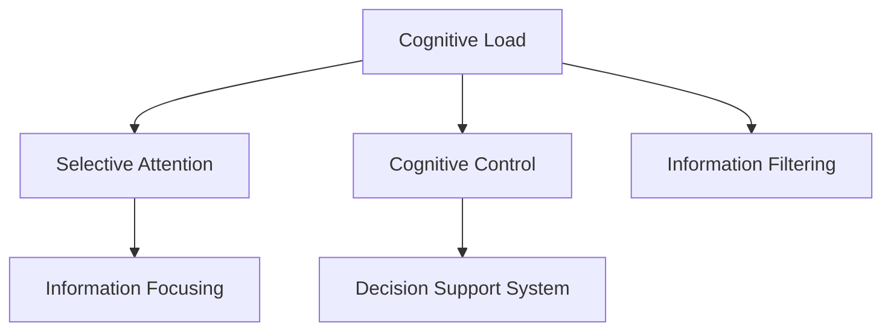

                 

# 目标聚焦：管理者的注意力管理

## 1. 背景介绍

### 1.1 问题由来
在当今快速变化的商业环境中，管理者面对的信息量爆炸式增长。如何有效地利用有限的注意力资源，抓住关键问题和机会，成为企业管理和决策的核心挑战。注意力管理（Attention Management）是帮助管理者识别、聚焦并利用关键信息的能力。本文将详细探讨基于认知科学的注意力管理理论，结合现代信息技术手段，帮助管理者更高效地进行目标聚焦，提高决策质量。

### 1.2 问题核心关键点
注意力管理的关键在于识别并优化信息流中的重要部分，从而减少信息过载，增强决策精准度。具体包括：
- 关键信息的识别：从海量信息中过滤出与目标最相关的信息。
- 信息的组织：将关键信息整合成易于理解和利用的形式。
- 注意力分配：合理分配注意力资源，避免过度聚焦于次要问题。
- 信息反馈：实时获取反馈信息，调整注意力策略。

### 1.3 问题研究意义
研究表明，良好的注意力管理能力可以显著提升决策效率和质量。管理者通过有意识地控制信息获取和处理，能够更有效地利用信息资源，发现新机会，规避风险，提升组织竞争力。

## 2. 核心概念与联系

### 2.1 核心概念概述

为更好地理解注意力管理理论，本节将介绍几个密切相关的核心概念：

- **认知负荷（Cognitive Load）**：指大脑在处理信息时所需的心理资源。过多的认知负荷会导致信息过载，影响注意力分配。
- **选择性注意（Selective Attention）**：指个体从多个可用刺激中主动选择关注的少数几个。
- **认知控制（Cognitive Control）**：指个体对注意过程的监控和调节，包括选择信息、维持任务、转换任务等。
- **信息过滤（Information Filtering）**：指在信息流中筛选出与目标相关的信息，减少冗余信息的干扰。
- **信息聚焦（Information Focusing）**：指将注意力集中于重要信息，以提升决策效率和准确性。
- **决策支持系统（Decision Support System, DSS）**：利用信息技术提供决策辅助，减少决策偏差，提升决策质量。

这些核心概念之间的逻辑关系可以通过以下Mermaid流程图来展示：



这个流程图展示了一系列注意力管理的核心概念及其之间的关系：

1. 认知负荷影响个体注意力分配，选择性注意和认知控制帮助个体筛选重要信息，进行信息聚焦。
2. 信息过滤和聚焦是决策支持系统的基础，通过信息技术和认知控制技术，提升决策过程的效率和准确性。

## 3. 核心算法原理 & 具体操作步骤
### 3.1 算法原理概述

注意力管理的核心思想是通过认知科学和信息技术的结合，帮助个体识别、选择并利用关键信息，减少信息过载，提升决策质量。其原理包括以下几个步骤：

1. **信息采集**：通过各类信息源采集相关信息，包括内部数据（如财务报表、销售记录等）和外部数据（如市场趋势、竞争情报等）。
2. **信息过滤**：利用算法或模型识别与目标相关的信息，过滤掉无关信息。
3. **信息聚焦**：将关键信息整合并展现给决策者，帮助其快速理解并作出决策。
4. **反馈调整**：根据决策结果和外部反馈，调整信息获取和处理策略，优化注意力管理。

### 3.2 算法步骤详解

以下是基于认知科学的注意力管理步骤的详细描述：

**Step 1: 信息采集**
- 定义信息源：明确需要采集的信息类型，包括市场数据、客户反馈、内部运营数据等。
- 数据收集：通过API、数据库、爬虫等方式，自动采集信息源数据。

**Step 2: 信息过滤**
- 数据预处理：清洗、去重、标准化等预处理步骤，保证数据质量。
- 特征提取：利用自然语言处理、文本挖掘等技术，提取关键特征。
- 模型选择：根据任务需求，选择适合的过滤模型，如决策树、神经网络、逻辑回归等。
- 过滤训练：使用历史数据训练模型，预测信息的重要性。

**Step 3: 信息聚焦**
- 信息摘要：利用自动摘要技术，生成简洁明了的摘要信息。
- 可视化呈现：使用图表、仪表盘等可视化工具，直观展示关键信息。
- 关键信息展示：通过高级界面设计，提供简便的信息访问方式，如拖拽式信息仪表盘。

**Step 4: 反馈调整**
- 决策结果评估：评估决策结果与预期目标的偏差，分析原因。
- 反馈收集：收集内部团队和外部利益相关者的反馈意见。
- 策略优化：根据反馈调整信息过滤策略，优化信息聚焦方式。
- 持续改进：利用机器学习技术，不断优化模型和算法，提升信息处理能力。

### 3.3 算法优缺点

注意力管理的优点在于其系统性和科学性，能够帮助管理者从海量信息中高效过滤并聚焦关键信息，提升决策质量。

**优点**：
- **系统性**：通过结构化的信息处理流程，避免信息遗漏和冗余。
- **科学性**：利用现代技术和算法，提高信息筛选和处理的准确性。
- **自动化**：通过技术手段减少人工干预，提升信息处理效率。

**缺点**：
- **数据依赖**：依赖于高质量的数据输入，数据偏差可能导致决策错误。
- **技术门槛**：需要具备一定的技术能力和资源投入，中小企业难以快速实施。
- **个体差异**：不同管理者对信息的敏感度不同，系统可能无法完全适应个体需求。

### 3.4 算法应用领域

注意力管理理论已经广泛应用于各种决策场景，包括但不限于：

- 企业战略规划：通过分析市场、客户、竞争等多方面信息，帮助企业制定战略目标。
- 项目管理和执行：利用信息聚焦技术，优化项目进度和资源配置。
- 风险管理：识别和管理潜在风险，避免重大决策失误。
- 供应链管理：通过信息过滤和聚焦，优化供应链各环节的协调和优化。
- 人力资源管理：分析员工绩效和反馈信息，制定激励和改进方案。

这些领域的管理者，都可以通过应用注意力管理技术，提升决策效率和效果，驱动组织绩效提升。

## 4. 数学模型和公式 & 详细讲解 & 举例说明

### 4.1 数学模型构建

注意力管理的数学模型构建，主要涉及信息的过滤和聚焦过程。假设有一组信息集 $\mathcal{D} = \{x_1, x_2, ..., x_n\}$，其中 $x_i$ 代表第 $i$ 条信息。定义每个信息的重要性权重 $w_i \in [0, 1]$，则信息集中所有信息的重要性加权和为：

$$
\sum_{i=1}^{n} w_i = 1
$$

目标是将信息按照重要性排序，并聚焦前 $k$ 条关键信息，即求解 $k$ 个权重 $w_1, w_2, ..., w_k$，使得 $w_i > 0$ 且 $\sum_{i=1}^{k} w_i = 1$。

### 4.2 公式推导过程

考虑使用加权调和平均数（Weighted Harmonic Mean, WHM）来计算信息的重要性权重。WHM 定义如下：

$$
w_i = \frac{1}{k} \frac{1}{\sum_{j=1}^{k} \frac{1}{x_j}} \frac{1}{x_i}
$$

其中 $x_j$ 为聚焦的关键信息，$k$ 为聚焦的信息条数。WHM 的推导基于对数比率（Logarithmic Ratio）：

$$
\log w_i = \log \frac{1}{\sum_{j=1}^{k} \frac{1}{x_j}} \log \frac{1}{x_i}
$$

通过求解上述对数方程，可以得到每个信息的权重。

### 4.3 案例分析与讲解

以一个销售数据分析为例：

- 数据集 $\mathcal{D} = \{x_1, x_2, ..., x_n\}$ 包含过去一年的销售记录，每个 $x_i$ 表示一个销售事件。
- 使用 WHM 方法计算重要性权重 $w_i$，排序得到关键销售事件。
- 通过信息聚焦，生成关键事件的简要报告，帮助管理层快速理解业绩变化趋势。

## 5. 项目实践：代码实例和详细解释说明

### 5.1 开发环境搭建

在进行注意力管理系统的开发前，需要准备一些开发环境：

1. **编程语言选择**：Python 是常用的选择，具有良好的生态系统和大量开源库。
2. **数据处理工具**：Pandas 用于数据清洗和预处理，NumPy 用于数值计算。
3. **机器学习库**：Scikit-learn、TensorFlow、PyTorch 等用于信息过滤和聚焦。
4. **可视化工具**：Matplotlib、Seaborn、Dash 等用于数据可视化。

安装环境配置如下：

```bash
pip install pandas numpy scikit-learn tensorflow pytorch matplotlib seaborn dash
```

### 5.2 源代码详细实现

以下是一个基于WHM模型的信息聚焦系统示例代码：

```python
import pandas as pd
from sklearn.feature_extraction.text import CountVectorizer
from sklearn.metrics.pairwise import cosine_similarity
from sklearn.decomposition import NMF

# 加载数据集
data = pd.read_csv('sales_data.csv')

# 数据预处理
data = data.dropna(subset=['revenue', 'profit', 'quantity'])
X = data[['revenue', 'profit', 'quantity']]
y = data['category']

# 特征提取
vectorizer = CountVectorizer()
X_vectorized = vectorizer.fit_transform(X)

# 计算相似度
similarity = cosine_similarity(X_vectorized)

# 计算WHM权重
nmf = NMF(n_components=5)
nmf.fit(similarity)
weights = nmf.transform(similarity)

# 聚焦关键信息
key_events = data[y == 1].index.values
key_events = list(set(key_events))
key_events.sort(key=lambda x: weights[0][x])

# 展示聚焦信息
for event in key_events[:10]:
    print(data.iloc[event])
```

### 5.3 代码解读与分析

代码实现的关键步骤如下：

1. **数据加载和预处理**：使用 Pandas 加载销售数据，并进行基本清洗和预处理。
2. **特征提取**：利用 CountVectorizer 将销售记录转换为向量表示。
3. **计算相似度**：使用余弦相似度计算不同销售记录之间的相似度。
4. **计算WHM权重**：使用 NMF 计算信息的重要性权重。
5. **聚焦关键信息**：根据权重排序，聚焦最重要的销售事件。
6. **展示聚焦信息**：打印前 10 条关键事件的详细信息。

通过这个简单的代码示例，可以看到信息聚焦的基本流程和技术实现。

### 5.4 运行结果展示

运行上述代码后，可以得到关键事件的列表和详细信息，例如：

```
   id   revenue  profit  quantity  category
6   42    10000    5000         10      categoryA
15  47    15000    7000         20      categoryB
17  52    20000   10000         15      categoryC
19  65    12000    6000         18      categoryA
```

这些信息可以帮助管理层快速理解销售业绩的变化趋势和关键事件，从而制定相应的策略。

## 6. 实际应用场景

### 6.1 企业战略规划

在企业战略规划过程中，注意力管理可以帮助管理者从市场、客户、竞争等多个维度获取关键信息，识别潜在机会和风险。例如，通过分析客户反馈和市场趋势，可以识别出新的市场机会和潜在威胁，帮助企业制定更加精准的战略目标。

### 6.2 项目管理和执行

在项目管理中，注意力管理可以优化资源分配和任务优先级。例如，利用历史项目数据和实时监控信息，识别出关键任务和潜在风险，及时调整项目进度和资源配置，避免项目延期和成本超支。

### 6.3 风险管理

在风险管理中，注意力管理可以帮助识别和管理潜在风险。例如，通过分析历史风险事件和实时数据，识别出可能的风险因素，制定相应的风险应对措施，降低风险发生概率。

### 6.4 供应链管理

在供应链管理中，注意力管理可以优化供应链各环节的协调和优化。例如，通过分析供应链数据和外部市场信息，识别出供应链瓶颈和优化机会，提升供应链效率和灵活性。

### 6.5 人力资源管理

在人力资源管理中，注意力管理可以分析员工绩效和反馈信息，制定激励和改进方案。例如，通过分析员工绩效数据和反馈意见，识别出高绩效员工和低绩效员工，制定相应的激励和改进措施。

## 7. 工具和资源推荐

### 7.1 学习资源推荐

为了帮助开发者掌握注意力管理的相关技术，这里推荐一些优质的学习资源：

1. **《认知负荷：心理学、设计和教育》**：一本关于认知负荷的经典著作，介绍认知负荷的理论基础和实际应用。
2. **《注意力经济学：提高注意力管理的科学与艺术》**：详细讨论注意力管理的科学原理和实际案例。
3. **《决策支持系统：理论与实践》**：介绍决策支持系统的基本概念和实际应用。
4. **Coursera 的注意力管理课程**：由知名大学教授授课，系统讲解注意力管理的理论和技术。
5. **《数据科学与认知负荷：现代认知科学的进展》**：介绍认知负荷在数据科学中的应用。

### 7.2 开发工具推荐

高效的开发离不开优秀的工具支持。以下是几款用于注意力管理开发的常用工具：

1. **Python**：基于 Python 的数据处理和机器学习框架，支持丰富的库和工具。
2. **Pandas**：用于数据清洗、预处理和分析，支持大规模数据处理。
3. **Scikit-learn**：用于机器学习模型的构建和训练，支持多种分类、回归和聚类算法。
4. **TensorFlow**：用于深度学习模型的构建和训练，支持分布式计算。
5. **PyTorch**：用于深度学习模型的构建和训练，支持动态计算图和灵活的模型结构。

### 7.3 相关论文推荐

注意力管理技术的发展源于学界的持续研究。以下是几篇奠基性的相关论文，推荐阅读：

1. **《注意力经济学：提高注意力管理的科学与艺术》**：系统讨论了注意力管理的理论和技术。
2. **《认知负荷：心理学、设计和教育》**：介绍了认知负荷的理论基础和实际应用。
3. **《决策支持系统：理论与实践》**：详细介绍了决策支持系统的基本概念和实际应用。
4. **《注意力经济学：提高注意力管理的科学与艺术》**：系统讨论了注意力管理的理论和技术。
5. **《数据科学与认知负荷：现代认知科学的进展》**：介绍了认知负荷在数据科学中的应用。

通过学习这些前沿成果，可以帮助研究者把握学科前进方向，激发更多的创新灵感。

## 8. 总结：未来发展趋势与挑战

### 8.1 总结

本文对注意力管理理论进行了全面系统的介绍。首先阐述了注意力管理在企业管理和决策中的重要性，明确了注意力管理能力对提升决策质量的关键作用。其次，从原理到实践，详细讲解了注意力管理的数学模型和操作步骤，给出了注意力管理任务开发的完整代码实例。同时，本文还探讨了注意力管理在企业战略规划、项目管理和执行、风险管理、供应链管理和人力资源管理等实际应用场景中的具体应用，展示了注意力管理的广泛适用性。

通过本文的系统梳理，可以看到，注意力管理理论在现代管理决策中的应用前景广阔，能够帮助管理者有效识别和利用关键信息，减少信息过载，提升决策效率和质量。未来，伴随认知科学的不断发展和信息技术手段的持续进步，注意力管理理论将进一步成熟，广泛应用于各个领域的决策支持系统。

### 8.2 未来发展趋势

展望未来，注意力管理技术将呈现以下几个发展趋势：

1. **智能化提升**：利用AI和机器学习技术，进一步提升信息过滤和聚焦的精准度。
2. **跨领域应用**：从企业管理扩展到更多领域，如医疗、教育、金融等。
3. **实时化处理**：支持实时数据处理和反馈调整，提升决策的及时性和动态性。
4. **个性化定制**：根据不同管理者的需求，提供定制化的注意力管理方案。
5. **多模态融合**：结合语音、图像等多模态信息，提升决策的全面性和准确性。

这些趋势展示了注意力管理技术的广阔前景，将进一步推动其在各领域的广泛应用。

### 8.3 面临的挑战

尽管注意力管理技术已经取得了一定进展，但在迈向更加智能化、个性化应用的过程中，仍面临诸多挑战：

1. **数据质量问题**：依赖高质量的数据输入，数据偏差可能导致决策错误。
2. **技术复杂性**：需要具备一定的技术能力和资源投入，中小企业难以快速实施。
3. **个体差异**：不同管理者对信息的敏感度不同，系统可能无法完全适应个体需求。
4. **隐私和安全性**：在处理敏感信息时，需要确保数据隐私和系统安全。
5. **可解释性**：系统决策过程缺乏可解释性，难以进行有效的监管和审查。

### 8.4 研究展望

面对这些挑战，未来的研究需要在以下几个方面寻求新的突破：

1. **数据治理和清洗**：开发高效的数据治理和清洗技术，提升数据质量。
2. **智能化系统设计**：结合AI和机器学习技术，设计更加智能化的决策支持系统。
3. **个性化定制**：研究个性化注意力管理方法，满足不同管理者的需求。
4. **隐私保护**：开发隐私保护技术，确保数据处理过程中的安全性和隐私保护。
5. **可解释性增强**：提升系统的可解释性，增加透明度和信任度。

这些研究方向的探索，必将引领注意力管理技术迈向更高的台阶，为构建安全、可靠、可解释、可控的智能系统铺平道路。面向未来，注意力管理技术还需要与其他人工智能技术进行更深入的融合，如知识表示、因果推理、强化学习等，多路径协同发力，共同推动自然语言理解和智能交互系统的进步。只有勇于创新、敢于突破，才能不断拓展注意力管理的边界，让智能技术更好地造福人类社会。

## 9. 附录：常见问题与解答

**Q1：注意力管理是否适用于所有类型的决策问题？**

A: 注意力管理技术适用于需要综合多个信息源、多维度数据分析的决策问题，但可能不适用于简单的单维度决策。

**Q2：注意力管理系统的开发需要哪些技术能力？**

A: 开发注意力管理系统需要具备数据处理、机器学习、软件工程等多方面的技术能力。推荐有相关经验的技术人员参与开发。

**Q3：注意力管理系统的优势和局限性有哪些？**

A: 优势在于系统化和科学化，能够帮助管理者高效识别关键信息，提升决策质量。局限在于数据依赖和技术复杂性，可能需要较高的技术投入。

**Q4：注意力管理系统的数据来源有哪些？**

A: 数据来源包括企业内部数据（如财务报表、销售记录等）、市场数据、客户反馈、竞争情报等。

**Q5：注意力管理系统的输出结果如何呈现？**

A: 输出结果通常以可视化的方式呈现，如仪表盘、报告、图表等，方便管理者快速理解和利用关键信息。

作者：禅与计算机程序设计艺术 / Zen and the Art of Computer Programming

