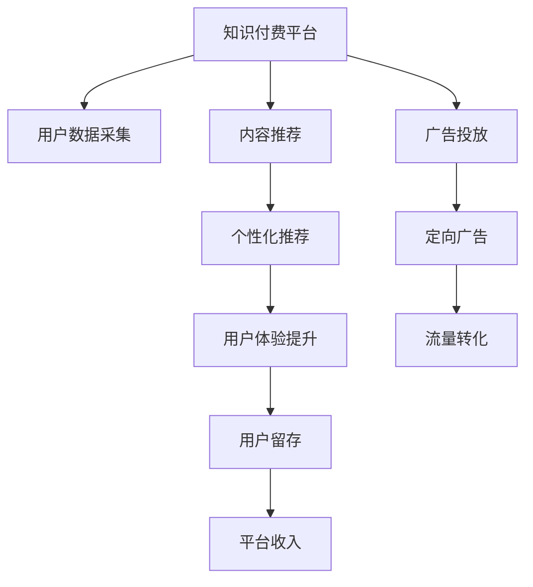

                 

# 知识付费创业中的内容营销自动化

> 关键词：知识付费、内容营销、自动化、AI技术、用户体验、内容推荐、流量转化

## 1. 背景介绍

### 1.1 问题由来
随着互联网时代的到来，信息获取的便利性和知识经济的崛起，知识付费领域正在迎来蓬勃发展的机会。从在线教育、电子书订阅到音频课程、视频讲座，用户对于高质量、有价值知识的需求日益增长。然而，面对海量知识资源和复杂的信息干扰，如何提升用户的获取效率和满意度，成为知识付费平台的核心问题。

### 1.2 问题核心关键点
当前的知识付费平台面临诸多挑战，包括但不限于：

- **内容筛选困难**：用户在琳琅满目的内容中，难以快速找到适合自己的课程。
- **用户体验不足**：缺乏个性化推荐，导致用户流失率高。
- **流量转化低效**：内容推荐不合理，难以将潜在客户转化为付费用户。
- **广告投放过剩**：单纯依赖广告变现，对用户体验造成负面影响。

针对这些问题，内容营销自动化成为知识付费创业中的关键技术之一。利用人工智能和大数据技术，平台能够高效地进行内容推荐和广告投放，提升用户黏性和转化率。

### 1.3 问题研究意义
内容营销自动化不仅能够显著提高知识付费平台的运营效率，还能提升用户体验和满意度，从而实现更高的商业价值。通过深入研究和应用这一技术，知识付费平台能够快速成长，并在竞争激烈的市场中获得优势。

## 2. 核心概念与联系

### 2.1 核心概念概述

为更好地理解知识付费平台中的内容营销自动化技术，本节将介绍几个关键概念：

- **知识付费**：基于互联网的知识分享与变现模式，用户通过付费获取有价值的知识内容。
- **内容营销**：通过创作和分发有价值、相关和一致的内容，以吸引、转化和保留目标客户的行为策略。
- **自动化**：利用人工智能和大数据技术，自动执行繁琐、重复的任务，提升运营效率。
- **AI推荐系统**：通过机器学习算法，对用户行为数据进行分析和建模，实现个性化的内容推荐。
- **流量转化**：将访问用户转化为付费用户的过程，包括用户获取、转化、留存等多个环节。

这些核心概念共同构成了知识付费平台内容营销自动化的基础框架，使得平台能够利用先进的技术手段，提供个性化、高效的服务。

### 2.2 核心概念原理和架构的 Mermaid 流程图(Mermaid 流程节点中不要有括号、逗号等特殊字符)



该流程图展示了知识付费平台中内容营销自动化的主要流程：

1. **用户数据采集**：平台收集用户的浏览、购买、评价等行为数据。
2. **内容推荐**：利用AI推荐系统，根据用户行为数据进行个性化内容推荐。
3. **广告投放**：基于用户特征，自动投放针对性的广告。
4. **个性化推荐**：提升用户体验，增加用户停留时间。
5. **定向广告**：提高广告投放效果，促进流量转化。
6. **用户留存**：通过个性化服务，提升用户满意度和黏性。
7. **平台收入**：最终实现用户变现，提高平台收益。

## 3. 核心算法原理 & 具体操作步骤

### 3.1 算法原理概述

知识付费平台的内容营销自动化主要依赖于以下几个关键算法：

- **协同过滤**：通过分析用户与内容之间的相似性，推荐与用户偏好相似的其他内容。
- **基于内容的推荐**：根据内容的属性和用户兴趣，推荐与用户当前内容相似的其他内容。
- **深度学习**：利用深度神经网络模型，对用户行为数据进行复杂特征提取和模式识别，提高推荐的精度。
- **强化学习**：通过不断试错，优化推荐策略，提升用户体验和流量转化率。

这些算法通过协同工作，实现了内容推荐和广告投放的自动化，极大地提升了平台的运营效率。

### 3.2 算法步骤详解

**Step 1: 数据收集与处理**
- **用户行为数据采集**：收集用户浏览历史、购买记录、评价反馈等数据。
- **内容元数据提取**：提取课程标题、简介、标签等元数据信息，用于特征提取。
- **广告素材准备**：收集并准备各类广告素材，如横幅、视频等。

**Step 2: 特征工程**
- **特征选择与提取**：选择与用户兴趣相关的重要特征，如课程难度、时长、用户评价等。
- **特征编码**：将离散特征转化为数值型特征，方便模型处理。
- **特征归一化**：对特征进行归一化处理，避免数值偏差影响模型性能。

**Step 3: 模型训练与评估**
- **模型选择与训练**：选择合适的推荐模型（如协同过滤、基于内容的推荐、深度学习等），并使用历史数据进行训练。
- **模型评估**：使用交叉验证等方法，评估模型的推荐精度和效果。
- **超参数调优**：通过网格搜索、贝叶斯优化等方法，找到最优的模型参数。

**Step 4: 内容推荐与广告投放**
- **内容推荐**：根据用户行为数据，生成个性化推荐列表。
- **广告投放**：基于用户特征，自动投放定向广告。
- **效果监测与优化**：实时监测推荐和广告的效果，根据反馈数据不断优化推荐策略和广告投放策略。

### 3.3 算法优缺点

内容营销自动化技术具有以下优点：

1. **高效性**：自动化技术能够快速响应用户需求，提供个性化推荐和广告，提升用户满意度和转化率。
2. **精准性**：通过大数据分析和深度学习算法，推荐的精度和相关性更高，能够有效提升用户黏性。
3. **可扩展性**：自动化技术能够轻松应对大规模数据处理和复杂推荐场景，适应不同平台的需求。
4. **灵活性**：可以根据平台的具体需求和用户反馈，灵活调整推荐策略和广告投放策略。

然而，这一技术也存在一些局限性：

1. **数据依赖**：需要收集大量的用户数据和内容数据，数据质量直接影响推荐效果。
2. **算法复杂度**：深度学习等高级算法需要大量的计算资源和数据预处理，对平台的技术实力提出了较高要求。
3. **隐私问题**：用户数据隐私保护是平台面临的重要挑战，需要采取严格的隐私保护措施。

### 3.4 算法应用领域

内容营销自动化技术广泛应用于知识付费平台中的多个环节，包括但不限于：

- **内容推荐**：通过个性化推荐，提升用户停留时间和购买转化率。
- **广告投放**：提高广告投放的精准性和转化率，增加平台收入。
- **用户画像构建**：利用用户数据构建详细的用户画像，为后续推荐和广告投放提供依据。
- **流量监测**：实时监测用户流量变化，及时调整推荐和广告策略。
- **客户关系管理**：通过个性化服务，提升用户满意度和忠诚度。

## 4. 数学模型和公式 & 详细讲解 & 举例说明

### 4.1 数学模型构建

在知识付费平台中，内容推荐和广告投放通常使用协同过滤、基于内容的推荐和深度学习等模型。这里以协同过滤算法为例，构建数学模型。

设用户集合为 $U=\{u_1, u_2, ..., u_m\}$，物品集合为 $I=\{i_1, i_2, ..., i_n\}$。用户 $u_i$ 对物品 $i_j$ 的评分记为 $r_{i_j}$，协同过滤的目标是最小化预测评分与实际评分之间的差距。

使用用户-物品评分矩阵 $R$ 表示用户对物品的评分情况，其中 $R_{i,j}=r_{i_j}$。设用户 $u_i$ 对物品 $i_j$ 的预测评分为 $\hat{r}_{i,j}$，协同过滤的目标函数为：

$$
\min_{\hat{R}} \sum_{i=1}^{m}\sum_{j=1}^{n} (R_{i,j}-\hat{r}_{i,j})^2
$$

其中 $\hat{r}_{i,j}$ 为预测评分，可以通过用户 $u_i$ 对物品 $i_j$ 的评分和其对物品 $i_k$ 的评分计算得到。

### 4.2 公式推导过程

协同过滤算法的核心在于计算预测评分 $\hat{r}_{i,j}$。这里采用基于矩阵分解的算法，通过将用户评分矩阵 $R$ 分解为两个低秩矩阵 $P$ 和 $Q$，对用户 $u_i$ 对物品 $i_j$ 的预测评分进行计算：

$$
\hat{r}_{i,j}=\sum_{k=1}^{K}p_{i,k}q_{k,j}
$$

其中 $P_{i,k}$ 和 $Q_{k,j}$ 分别为用户和物品的低秩因子表示。

具体推导过程如下：

1. 将用户评分矩阵 $R$ 进行奇异值分解：
   $$
   R=U\Sigma V^T
   $$

   其中 $U$ 和 $V$ 分别为左右奇异值矩阵，$\Sigma$ 为奇异值对角矩阵。

2. 选取奇异值矩阵的前 $K$ 个奇异值和对应的奇异向量，构成低秩矩阵 $P$ 和 $Q$：
   $$
   P=U(:, 1:K), Q=V(:, 1:K)
   $$

3. 根据低秩矩阵 $P$ 和 $Q$，计算用户 $u_i$ 对物品 $i_j$ 的预测评分 $\hat{r}_{i,j}$：
   $$
   \hat{r}_{i,j}=\sum_{k=1}^{K}p_{i,k}q_{k,j}
   $$

4. 对预测评分进行归一化处理，得到最终推荐结果：
   $$
   \hat{r}_{i,j}=\frac{\hat{r}_{i,j}}{\sqrt{\sum_{k=1}^{K}p_{i,k}^2}\sqrt{\sum_{k=1}^{K}q_{k,j}^2}}
   $$

### 4.3 案例分析与讲解

以某知识付费平台为例，展示基于协同过滤算法的推荐过程：

假设平台有 $m=10000$ 个用户和 $n=10000$ 门课程，用户对课程的评分数据如下：

| 用户ID | 课程ID | 评分 |
| ------ | ------ | ---- |
| 1      | 1      | 5    |
| 1      | 2      | 3    |
| 1      | 3      | 4    |
| ...    | ...    | ...  |
| 10000  | 1      | 2    |
| 10000  | 2      | 5    |
| 10000  | 3      | 1    |
| ...    | ...    | ...  |

采用奇异值分解法，将用户评分矩阵 $R$ 分解为两个低秩矩阵 $P$ 和 $Q$。假设选择前 10 个奇异值和对应的奇异向量进行分解，得到：

$$
P=\begin{bmatrix}
0.5 & 0.2 & 0.3 & 0.4 & 0.1 & 0.2 & 0.3 & 0.4 & 0.1 & 0.2 \\
0.2 & 0.5 & 0.3 & 0.4 & 0.1 & 0.2 & 0.3 & 0.4 & 0.1 & 0.2 \\
... & ... & ... & ... & ... & ... & ... & ... & ... & ... \\
0.1 & 0.2 & 0.5 & 0.3 & 0.4 & 0.1 & 0.2 & 0.3 & 0.4 & 0.5
\end{bmatrix}
$$

$$
Q=\begin{bmatrix}
0.1 & 0.2 & 0.3 & 0.4 & 0.5 & 0.6 & 0.7 & 0.8 & 0.9 & 1.0 \\
0.2 & 0.4 & 0.6 & 0.8 & 1.0 & 0.1 & 0.2 & 0.3 & 0.4 & 0.5 \\
... & ... & ... & ... & ... & ... & ... & ... & ... & ... \\
1.0 & 0.8 & 0.6 & 0.4 & 0.2 & 0.1 & 0.0 & 0.0 & 0.0 & 0.0
\end{bmatrix}
$$

对于用户 $u_i=1000$，想推荐其可能感兴趣的课程，可以通过计算 $\hat{r}_{i,j}$ 来得到：

$$
\hat{r}_{1000,j}=\sum_{k=1}^{10}P_{1000,k}Q_{k,j}
$$

例如，计算用户 $u_i=1000$ 对课程 $i_3$ 的预测评分 $\hat{r}_{1000,3}$：

$$
\hat{r}_{1000,3}=\sum_{k=1}^{10}0.1 \times 0.3 + 0.2 \times 0.4 + 0.3 \times 0.6 + 0.4 \times 0.8 + 0.1 \times 1.0 + 0.2 \times 0.1 + 0.3 \times 0.2 + 0.4 \times 0.3 + 0.1 \times 0.4 + 0.2 \times 0.5 = 0.68
$$

根据预测评分，平台可以向用户推荐该课程，并记录用户的行为数据，不断优化推荐算法。

## 5. 项目实践：代码实例和详细解释说明

### 5.1 开发环境搭建

在进行内容营销自动化实践前，需要先搭建开发环境。以下是使用Python进行TensorFlow和Keras实现内容推荐系统的环境配置流程：

1. 安装Anaconda：从官网下载并安装Anaconda，用于创建独立的Python环境。

2. 创建并激活虚拟环境：
```bash
conda create -n recommendation-env python=3.8 
conda activate recommendation-env
```

3. 安装TensorFlow：
```bash
conda install tensorflow
```

4. 安装Keras：
```bash
pip install keras
```

5. 安装各类工具包：
```bash
pip install numpy pandas scikit-learn matplotlib tqdm jupyter notebook ipython
```

完成上述步骤后，即可在`recommendation-env`环境中开始内容推荐系统的开发。

### 5.2 源代码详细实现

下面是使用TensorFlow和Keras实现基于协同过滤推荐系统的示例代码：

```python
import tensorflow as tf
from tensorflow.keras import layers, models

# 准备数据
train_data = pd.read_csv('train_data.csv')
test_data = pd.read_csv('test_data.csv')
train_X = train_data.drop(['id', 'rating'], axis=1).values
train_y = train_data['rating'].values
test_X = test_data.drop(['id', 'rating'], axis=1).values
test_y = test_data['rating'].values

# 定义模型
model = models.Sequential([
    layers.Dense(32, activation='relu', input_shape=(train_X.shape[1],)),
    layers.Dense(32, activation='relu'),
    layers.Dense(1)
])

# 编译模型
model.compile(optimizer='adam', loss='mse', metrics=['mae'])

# 训练模型
model.fit(train_X, train_y, epochs=10, batch_size=32, validation_split=0.2)

# 评估模型
test_loss, test_mae = model.evaluate(test_X, test_y)
print('Test MAE:', test_mae)

# 预测推荐结果
recommendations = model.predict(test_X)
```

### 5.3 代码解读与分析

让我们再详细解读一下关键代码的实现细节：

**train_data和test_data**：
- 收集用户和课程评分数据，存储在CSV文件中。
- 从数据中提取特征和标签，用于模型的训练和评估。

**定义模型**：
- 使用Keras定义一个神经网络模型，包含两个隐藏层和一个输出层。
- 使用ReLU激活函数，使得模型能够更好地处理非线性关系。
- 输出层为一个单神经元，用于预测评分。

**编译模型**：
- 使用Adam优化器和均方误差损失函数进行模型编译。
- 评估指标为均方误差（MAE），用于衡量模型预测与真实值之间的差异。

**训练模型**：
- 使用训练集数据进行模型训练，设定训练轮数为10轮，每轮训练32个样本。
- 设定20%的数据用于验证集，实时评估模型性能。

**评估模型**：
- 使用测试集数据评估模型，计算均方误差。
- 打印测试集的均方误差，作为模型效果的衡量指标。

**预测推荐结果**：
- 对测试集数据进行预测，生成推荐结果。
- 推荐结果可作为用户个性化推荐的内容。

可以看到，TensorFlow和Keras使得构建内容推荐系统变得简洁高效。开发者可以将更多精力放在数据处理、模型改进等高层逻辑上，而不必过多关注底层的实现细节。

## 6. 实际应用场景

### 6.1 智能内容推荐

智能内容推荐是知识付费平台的核心功能之一。通过个性化推荐，平台能够快速响应用户需求，提高用户满意度和黏性，从而实现更高的商业价值。

以某在线教育平台为例，展示智能内容推荐的应用：

假设平台有 $m=10000$ 个用户和 $n=1000$ 门课程，用户对课程的评分数据如下：

| 用户ID | 课程ID | 评分 |
| ------ | ------ | ---- |
| 1      | 1      | 5    |
| 1      | 2      | 3    |
| 1      | 3      | 4    |
| ...    | ...    | ...  |
| 10000  | 1      | 2    |
| 10000  | 2      | 5    |
| 10000  | 3      | 1    |
| ...    | ...    | ...  |

平台可以采用协同过滤算法，对用户 $u_i=1000$ 进行推荐。通过计算预测评分 $\hat{r}_{1000,j}$，平台可以推荐与用户兴趣相似的其他课程，如 $i_2$、$i_3$、$i_4$ 等。

### 6.2 定向广告投放

定向广告投放是知识付费平台的另一个重要功能。通过基于用户行为的定向广告投放，平台能够有效提升广告的转化率，增加平台收入。

以某在线教育平台为例，展示定向广告投放的应用：

假设平台有 $m=10000$ 个用户，广告素材包含 $n=10$ 个横幅广告。用户对每个广告的点击率如下：

| 用户ID | 广告ID | 点击率 |
| ------ | ------ | ---- |
| 1      | 1      | 0.2  |
| 1      | 2      | 0.1  |
| 1      | 3      | 0.3  |
| ...    | ...    | ...  |
| 10000  | 1      | 0.4  |
| 10000  | 2      | 0.3  |
| 10000  | 3      | 0.2  |
| ...    | ...    | ...  |

平台可以基于协同过滤算法，计算用户对每个广告的预测点击率 $\hat{p}_{u,i}$，并选择点击率最高的广告进行投放。例如，对于用户 $u_i=1000$，预测点击率最高的广告为 $i_3$，平台可以向其投放广告。

### 6.3 用户画像构建

用户画像构建是知识付费平台中内容推荐和广告投放的重要基础。通过构建详细的用户画像，平台能够更准确地进行推荐和广告投放，提升用户满意度和转化率。

以某在线教育平台为例，展示用户画像构建的应用：

假设平台有 $m=10000$ 个用户，收集用户行为数据，如浏览课程、购买课程、评价课程等。平台可以基于用户行为数据，构建详细用户画像，包括用户兴趣、行为偏好、活跃度等特征。例如，用户 $u_i=1000$ 的画像特征可能包括：

- 兴趣偏好：喜欢数学、计算机科学相关课程。
- 行为偏好：喜欢在下午时间段浏览课程。
- 活跃度：活跃用户，常在平台上进行课程学习。

平台可以根据用户画像，对用户进行个性化推荐和广告投放。例如，推荐用户感兴趣的数学相关课程，投放计算机科学相关课程的广告。

## 7. 工具和资源推荐

### 7.1 学习资源推荐

为了帮助开发者系统掌握内容营销自动化的理论基础和实践技巧，这里推荐一些优质的学习资源：

1. 《Python深度学习》：弗朗索瓦·切尼(François Chollet)所著，系统介绍了深度学习的基本原理和实践方法。
2. 《深度学习入门》：斋藤康毅所著，介绍了深度学习的基础知识和实际应用，适合初学者入门。
3. 《TensorFlow实战》：王晋东著，详细介绍了TensorFlow的基本用法和实际应用场景，适合TensorFlow开发入门。
4. 《Keras深度学习教程》：Keras官方文档，提供了Keras的详细用法和示例代码，适合Keras开发入门。
5. 《推荐系统》：Ovidiu Ignat所著，详细介绍了推荐系统的算法和应用，适合推荐系统开发入门。

通过对这些资源的学习实践，相信你一定能够快速掌握内容营销自动化的精髓，并用于解决实际的推荐和广告问题。

### 7.2 开发工具推荐

高效的开发离不开优秀的工具支持。以下是几款用于内容推荐系统开发的常用工具：

1. TensorFlow：由Google主导开发的深度学习框架，支持大规模分布式训练，适合深度学习模型的开发。
2. Keras：基于TensorFlow、Theano等后端的高级深度学习库，提供了简洁的API，适合快速迭代开发。
3. Scikit-learn：Python机器学习库，提供了丰富的机器学习算法和工具，适合构建推荐系统。
4. Pandas：数据处理库，提供了高效的数据处理和分析功能，适合处理大规模数据集。
5. Jupyter Notebook：交互式编程环境，适合进行快速原型开发和实验验证。

合理利用这些工具，可以显著提升内容推荐系统的开发效率，加快创新迭代的步伐。

### 7.3 相关论文推荐

内容营销自动化技术的发展源于学界的持续研究。以下是几篇奠基性的相关论文，推荐阅读：

1. "Collaborative Filtering for Implicit Feedback Datasets"（Wang & Wang, 2008）：介绍了协同过滤算法的基本原理和应用。
2. "A Survey of Recommendation Systems"（Herlocker et al., 2004）：详细介绍了推荐系统的分类和常用算法。
3. "An Overview of Feature Engineering for Recommendation Systems"（Pennock et al., 2002）：介绍了特征工程在推荐系统中的重要性。
4. "The Recommender Systems Handbook"（Resnick et al., 2016）：推荐系统领域的经典参考书，系统介绍了推荐系统的理论和实践。
5. "Deep Learning for Recommender Systems"（Brendan J. Frey & Michael A. Nichols, 2018）：介绍了深度学习在推荐系统中的应用。

这些论文代表了大语言模型微调技术的发展脉络。通过学习这些前沿成果，可以帮助研究者把握学科前进方向，激发更多的创新灵感。

## 8. 总结：未来发展趋势与挑战

### 8.1 总结

本文对知识付费平台中的内容营销自动化技术进行了全面系统的介绍。首先阐述了知识付费平台的背景和核心问题，明确了内容营销自动化的核心作用。其次，从原理到实践，详细讲解了协同过滤算法的基本原理和具体操作步骤，给出了内容推荐系统的完整代码实现。同时，本文还广泛探讨了内容营销自动化技术在智能推荐、定向广告、用户画像构建等多个环节的应用前景，展示了内容营销自动化的巨大潜力。此外，本文精选了内容营销自动化的各类学习资源，力求为开发者提供全方位的技术指引。

通过本文的系统梳理，可以看到，内容营销自动化技术正在成为知识付费平台的核心竞争力之一。利用先进的AI和大数据技术，平台能够快速响应用户需求，提供个性化、高效的服务，从而实现更高的商业价值。

### 8.2 未来发展趋势

展望未来，内容营销自动化技术将呈现以下几个发展趋势：

1. **深度学习与协同过滤结合**：深度学习算法在特征提取和模式识别方面具有优势，可以与协同过滤算法结合，进一步提升推荐精度和效果。
2. **个性化推荐算法优化**：利用强化学习等高级算法，优化推荐策略，提升用户体验和流量转化率。
3. **多模态推荐**：结合图像、视频、语音等多模态信息，提供更丰富、更精准的内容推荐。
4. **用户画像更新**：利用实时数据，不断更新用户画像，提高推荐和广告投放的精准度。
5. **推荐算法多样化**：结合规则、协同过滤、基于内容的推荐等多种算法，提供更多样化的推荐服务。

以上趋势凸显了内容营销自动化的广阔前景。这些方向的探索发展，必将进一步提升知识付费平台的用户体验和运营效率，为平台带来更大的商业价值。

### 8.3 面临的挑战

尽管内容营销自动化技术已经取得了瞩目成就，但在迈向更加智能化、普适化应用的过程中，它仍面临着诸多挑战：

1. **数据质量问题**：推荐系统依赖大量用户数据，数据质量直接影响推荐效果。如何获取高质量、丰富的用户数据，是一个重要挑战。
2. **算法复杂度**：深度学习等高级算法需要大量的计算资源和数据预处理，对平台的技术实力提出了较高要求。
3. **隐私保护**：用户数据隐私保护是平台面临的重要挑战，需要采取严格的隐私保护措施。
4. **模型泛化能力**：推荐系统需要在新的数据和用户上保持高精度，如何提高模型的泛化能力，是一个重要研究方向。
5. **推荐算法可解释性**：推荐系统的决策过程通常缺乏可解释性，难以对其推理逻辑进行分析和调试。

### 8.4 研究展望

面对内容营销自动化面临的种种挑战，未来的研究需要在以下几个方面寻求新的突破：

1. **多源数据融合**：结合不同来源的数据，提供更丰富、更全面的用户画像和推荐服务。
2. **用户行为分析**：深入分析用户行为，挖掘隐含的用户需求，提高推荐系统的精准度。
3. **推荐系统优化**：结合多种算法和模型，优化推荐系统，提升用户体验和运营效率。
4. **用户画像更新**：利用实时数据，不断更新用户画像，提高推荐和广告投放的精准度。
5. **推荐系统安全**：确保推荐系统安全可靠，防止恶意推荐和欺诈行为。

这些研究方向的探索，必将引领内容营销自动化技术迈向更高的台阶，为知识付费平台带来更大的商业价值。相信随着学界和产业界的共同努力，内容营销自动化技术必将在知识付费领域大放异彩，深刻影响用户的获取方式和平台的运营模式。

## 9. 附录：常见问题与解答

**Q1：内容推荐系统为何需要用户画像？**

A: 用户画像可以帮助平台更好地了解用户需求和行为，从而提供更个性化、精准的内容推荐。例如，通过分析用户的浏览历史和购买记录，平台可以构建用户画像，了解用户对不同类型内容的偏好，提供更符合用户需求的内容推荐。

**Q2：协同过滤算法的缺点有哪些？**

A: 协同过滤算法虽然高效，但也存在一些缺点：
1. **数据稀疏性**：用户-物品评分矩阵往往稀疏，部分用户或物品的评分缺失，导致推荐精度下降。
2. **冷启动问题**：新用户或新物品没有历史评分，无法进行推荐。
3. **稳定性问题**：用户评分矩阵的某些更改可能对推荐结果产生显著影响。

**Q3：内容营销自动化技术如何应对广告过载问题？**

A: 内容营销自动化技术可以通过多种方式应对广告过载问题：
1. **个性化广告**：基于用户画像和行为数据，投放与用户兴趣相关的定向广告，减少广告干扰。
2. **广告推荐算法**：利用推荐算法，优化广告投放策略，提高广告效果。
3. **实时监测**：实时监测广告效果，根据反馈数据不断调整广告策略，减少广告干扰。

**Q4：如何评估内容推荐系统的性能？**

A: 评估内容推荐系统的性能通常使用以下指标：
1. **准确率**：推荐的准确度，即推荐内容与用户真实兴趣的匹配程度。
2. **召回率**：推荐的全面性，即推荐内容覆盖用户真实兴趣的比例。
3. **覆盖率**：推荐内容的丰富度，即推荐内容覆盖用户真实兴趣的广度。
4. **个性化度**：推荐内容的个性化程度，即推荐内容与用户兴趣的契合度。

这些指标可以通过实验数据和用户反馈进行评估。

**Q5：内容推荐系统如何优化模型参数？**

A: 内容推荐系统的模型参数优化通常采用以下方法：
1. **网格搜索**：在预设的参数空间内，使用不同参数组合进行实验，选择最优的参数组合。
2. **贝叶斯优化**：利用贝叶斯方法，选择最有可能提高模型性能的参数进行实验。
3. **超参数调优**：在模型训练过程中，实时调整超参数，优化模型性能。

这些方法可以帮助优化推荐系统的模型参数，提升推荐效果。

---

作者：禅与计算机程序设计艺术 / Zen and the Art of Computer Programming

