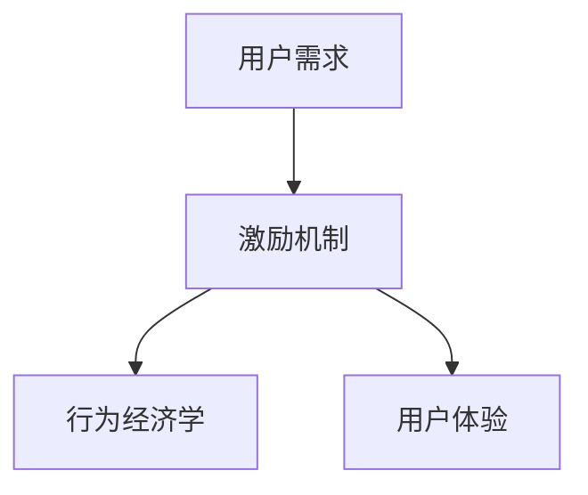

                 

# 知识付费创业中的用户激励机制设计

在知识付费领域，用户激励机制是吸引和保留用户的关键。良好的激励机制可以提高用户粘性，促进内容消费，提升平台的用户活跃度和收益。本文将从原理、设计、实现和案例分析四个方面，全面探讨知识付费创业中的用户激励机制设计。

## 1. 背景介绍

### 1.1 问题由来

随着互联网技术的发展，知识付费逐渐成为信息获取的重要途径。传统的信息获取方式如搜索引擎、论坛、博客等，存在信息量大、筛选困难、权威性差等问题。而知识付费通过付费筛选优质内容，提供专业、权威的知识和技能，满足用户个性化需求。

但知识付费也面临用户获取难、留存率低、内容付费意愿不强等挑战。因此，如何设计有效的用户激励机制，提升用户粘性，成为知识付费平台的重要课题。

### 1.2 问题核心关键点

知识付费平台的用户激励机制设计，核心在于：
1. **需求引导**：识别用户真实需求，通过奖励和引导，让用户产生付费行为。
2. **行为激励**：通过奖励机制，激发用户消费内容的动力，如积分、优惠券、会员特权等。
3. **体验优化**：提升用户使用体验，通过互动、分享、个性化推荐等，提升用户满意度。

### 1.3 问题研究意义

设计良好的用户激励机制，不仅能提升知识付费平台的留存率和收益，还能通过正向反馈，促进用户粘性和内容的传播。具体而言：
1. **提升用户留存**：通过激励机制，满足用户多样化的需求，增强用户粘性。
2. **促进内容消费**：通过推荐和奖励，引导用户付费消费优质内容。
3. **提高平台收益**：通过提升用户付费率和消费频次，增加平台的收入来源。

## 2. 核心概念与联系

### 2.1 核心概念概述

为更好地理解用户激励机制的设计，本节将介绍几个关键概念：

- **用户需求**：指用户在知识付费平台上的核心需求，包括获取信息、学习技能、获取证书等。
- **激励机制**：通过奖励、惩罚、竞争等手段，引导用户满足特定行为的目标。
- **行为经济学**：研究人类行为如何受到激励和惩罚的影响，为设计有效的激励机制提供理论依据。
- **用户体验**：指用户在使用知识付费平台过程中的体验，包括界面友好度、内容丰富度、推荐精准度等。

这些概念之间的关系可以通过以下Mermaid流程图来展示：



这个流程图展示出用户需求与激励机制之间的关系，以及激励机制如何影响用户体验。

## 3. 核心算法原理 & 具体操作步骤

### 3.1 算法原理概述

用户激励机制的设计，本质上是基于行为经济学和用户体验的理论，通过奖励、惩罚和竞争等手段，引导用户满足特定的行为目标。其核心原理如下：

- **强化学习**：通过不断的正向反馈和奖励，强化用户产生特定行为的倾向。
- **边际效用递减**：用户对同一种奖励的效用会随着重复次数增加而递减，需要设计多样化的激励手段。
- **目标设定理论**：设定明确的目标，让用户知道奖励与特定行为之间的直接联系。
- **公平与透明**：激励机制设计要公平透明，确保用户信任和满意度。

### 3.2 算法步骤详解

用户激励机制的设计，通常包括以下几个关键步骤：

**Step 1: 用户需求分析**
- 通过调研和数据分析，识别用户真实需求，分析用户行为特征。
- 设计用户画像，理解不同用户群体的偏好和需求。
- 根据用户需求，设计相应的激励机制，确保激励手段的有效性。

**Step 2: 激励手段设计**
- 根据用户需求，设计多样化的激励手段，如积分、优惠券、会员特权等。
- 设定明确的奖励规则，让用户了解激励机制的目标和奖惩标准。
- 设计公平透明的激励策略，确保用户体验和满意度。

**Step 3: 激励机制实施**
- 在知识付费平台上部署激励机制，确保用户能够方便地参与。
- 实时监测用户行为和反馈，调整激励机制参数，优化用户体验。
- 定期发布激励活动，保持用户兴趣和参与度。

**Step 4: 激励效果评估**
- 通过用户行为数据，评估激励机制的实际效果，如用户活跃度、付费率等。
- 收集用户反馈，识别激励机制的不足和改进空间。
- 持续优化激励机制，确保其有效性。

### 3.3 算法优缺点

用户激励机制设计的优点包括：
1. **提升用户留存**：通过满足用户需求，增强用户粘性。
2. **促进内容消费**：通过激励手段，引导用户消费优质内容。
3. **提高平台收益**：通过增加用户付费率和消费频次，提升平台收入。

但该机制也存在一定的局限性：
1. **成本较高**：设计和实施激励机制需要投入较多的资源，包括资金和技术支持。
2. **效果难以预测**：不同用户对激励手段的反应各异，难以准确预测其效果。
3. **公平性问题**：激励机制的设计需要考虑公平性，避免对特定用户群体的不公平待遇。
4. **激励依赖**：过度的激励依赖可能导致用户对平台的依赖性，影响独立性和自驱力。

## 4. 数学模型和公式 & 详细讲解 & 举例说明

### 4.1 数学模型构建

用户激励机制的设计，可以通过构建数学模型来量化和评估。本节将构建一个基于奖励和惩罚的用户行为模型。

假设用户的行为可以用 $X$ 表示，行为的价值可以用 $V(X)$ 表示。激励机制通过奖励和惩罚来调整用户行为的价值，最终目标是最小化用户的总效用 $U(X)$。

数学模型如下：

$$
U(X) = \sum_{i=1}^{N} \alpha_i V_i(X) - \beta W(X)
$$

其中，$V_i(X)$ 表示用户在不同行为下获得的价值，$\alpha_i$ 表示不同行为的权重，$W(X)$ 表示用户行为的惩罚值，$\beta$ 表示惩罚的强度。

### 4.2 公式推导过程

根据上述模型，用户的行为价值和总效用可以通过以下推导得到：

1. **行为价值模型**：
$$
V_i(X) = V(X) + \sum_{j=1}^{M} \gamma_j R(X_i,X_j)
$$

其中，$R(X_i,X_j)$ 表示用户在第 $i$ 个行为 $X_i$ 后，执行第 $j$ 个行为 $X_j$ 的奖励值，$\gamma_j$ 表示奖励的强度。

2. **总效用模型**：
$$
U(X) = \sum_{i=1}^{N} \alpha_i V_i(X) - \beta W(X)
$$

其中，$W(X)$ 表示用户行为的惩罚值，$\beta$ 表示惩罚的强度。

### 4.3 案例分析与讲解

以下以知识付费平台为例，解释激励机制的实际应用：

**案例背景**：某知识付费平台推出新课，用户可以通过参与特定活动获得优惠券，用于优惠券的消费。

**模型构建**：

1. **用户行为价值**：用户学习课程的价值 $V(X)$，可以通过用户的学习效果、满意度等指标来量化。
2. **奖励模型**：用户通过参与特定活动获得的优惠券价值 $R(X_i,X_j)$，可以设定为 $R(X_i,X_j) = r \cdot \text{value}(X_j)$，其中 $r$ 表示优惠券的价值。
3. **总效用模型**：用户学习课程的总效用 $U(X)$，可以表示为 $U(X) = \alpha V(X) - \beta W(X)$，其中 $\alpha$ 表示学习课程的价值权重，$\beta$ 表示参与活动的惩罚强度。

**激励手段设计**：
1. **优惠券奖励**：用户通过参与活动获得优惠券，用于课程消费，设定优惠券的奖励强度 $r$ 和惩罚强度 $\beta$。
2. **学习效果激励**：通过用户的学习效果，设定学习课程的价值权重 $\alpha$。

**实施和优化**：
1. **优惠券发放**：在平台上发放优惠券，用户通过完成特定任务获得。
2. **学习效果评估**：通过用户的学习效果，评估课程的价值权重 $\alpha$。
3. **激励效果评估**：通过用户行为数据，评估优惠券的激励效果，调整奖励和惩罚强度。

## 5. 项目实践：代码实例和详细解释说明

### 5.1 开发环境搭建

在进行用户激励机制的开发实践前，我们需要准备好开发环境。以下是使用Python进行开发的环境配置流程：

1. 安装Anaconda：从官网下载并安装Anaconda，用于创建独立的Python环境。

2. 创建并激活虚拟环境：
```bash
conda create -n user-incentive-env python=3.8 
conda activate user-incentive-env
```

3. 安装相关库：
```bash
pip install flask requests json flask-limiter
```

完成上述步骤后，即可在`user-incentive-env`环境中开始开发实践。

### 5.2 源代码详细实现

以下是一个简单的用户激励机制的Python代码实现：

```python
from flask import Flask, request, jsonify
from flask_limiter import Limiter
from json import dumps

app = Flask(__name__)
limiter = Limiter(app, key_func=get_remote_addr)

# 激励奖励策略
def reward_strategy(reward_type, user_id):
    if reward_type == 'coupon':
        # 优惠券奖励策略
        coupon = {'id': 123, 'value': 50}  # 假设优惠券价值为50元
        return {'user_id': user_id, 'reward': coupon}
    else:
        return None

@app.route('/incentive', methods=['POST'])
@limiter.limit("100/day")
def incentive():
    user_id = request.json.get('user_id')
    reward_type = request.json.get('reward_type')
    
    # 获取用户信息和奖励策略
    user_info = get_user_info(user_id)
    reward = reward_strategy(reward_type, user_id)
    
    if reward:
        # 发送激励奖励
        send_reward(user_id, reward)
        return jsonify({'success': True})
    else:
        return jsonify({'success': False}), 400

@app.route('/reward', methods=['POST'])
def reward():
    user_id = request.json.get('user_id')
    reward_info = request.json.get('reward_info')
    
    # 用户领取奖励
    redeem_reward(user_id, reward_info)
    return jsonify({'success': True})

@app.route('/reward_info', methods=['GET'])
def reward_info():
    user_id = request.json.get('user_id')
    reward_info = get_reward_info(user_id)
    
    if reward_info:
        return jsonify(reward_info)
    else:
        return jsonify({'success': False}), 404

if __name__ == '__main__':
    app.run()
```

以上代码实现了用户激励机制的基本功能，包括奖励发放、领取和查询。

### 5.3 代码解读与分析

让我们再详细解读一下关键代码的实现细节：

**app.py文件**：
- `__init__`方法：初始化Flask应用和限流器。
- `/incentive`路由：根据用户ID和奖励类型，发放激励奖励。
- `/reward`路由：用户领取激励奖励。
- `/reward_info`路由：用户查询激励奖励信息。

**get_user_info、send_reward、redeem_reward、get_reward_info**函数：
- `get_user_info`：获取用户信息。
- `send_reward`：发送激励奖励。
- `redeem_reward`：用户领取激励奖励。
- `get_reward_info`：查询用户激励奖励信息。

以上代码展示了用户激励机制的完整流程，包括奖励发放、领取和查询。开发者可以根据具体需求，进一步扩展和优化激励机制的功能。

### 5.4 运行结果展示

在完成代码实现后，可以在本地运行应用程序，测试激励机制的功能。通过访问不同API接口，查看激励奖励的发放和领取情况，以及用户查询激励奖励信息的结果。

## 6. 实际应用场景

### 6.1 教育培训

在教育培训领域，用户激励机制可以极大地提升学习效果和用户满意度。通过设计多样化的激励手段，如积分、优惠券、证书等，可以有效提升用户的参与度和学习积极性。

例如，在线教育平台可以推出新课推广活动，通过发放优惠券、积分等奖励，吸引用户参与学习，提升课程的完成率和用户粘性。同时，还可以通过学习成果展示和奖励机制，激发用户的成就感，增强学习动力。

### 6.2 职场培训

在职场培训领域，用户激励机制可以提升员工的学习效果和工作积极性。通过设计合理的激励手段，如培训证书、绩效奖励、晋升机会等，可以有效提升员工的学习动力和绩效表现。

例如，企业可以推出员工培训计划，通过发放培训证书和绩效奖励，激励员工积极参与培训，提升职业技能和工作效率。同时，还可以通过晋升机会和岗位轮换等激励手段，增强员工的职业发展动力。

### 6.3 医疗健康

在医疗健康领域，用户激励机制可以提升患者的学习效果和治疗效果。通过设计合理的激励手段，如健康积分、康复奖励、家庭医生服务等，可以有效提升患者的健康意识和治疗积极性。

例如，健康管理平台可以推出健康积分奖励机制，通过积累健康积分，激励用户积极参与健康监测和管理，提升健康水平。同时，还可以通过家庭医生服务和康复奖励等激励手段，增强用户的治疗效果和满意度。

### 6.4 未来应用展望

随着用户激励机制的研究和应用不断深入，未来在更多领域将有更多创新应用出现。

在金融理财领域，用户激励机制可以提升用户的理财意识和效果，通过积分、红包、优惠券等手段，激发用户的理财热情和行为。

在娱乐休闲领域，用户激励机制可以提升用户的体验和消费意愿，通过游戏积分、虚拟物品、会员特权等手段，增强用户的娱乐体验和忠诚度。

在政府服务领域，用户激励机制可以提升公众的参与度和满意度，通过积分、荣誉证书、服务质量奖励等手段，激励公众积极参与政府服务，提升政府服务的质量和效率。

## 7. 工具和资源推荐

### 7.1 学习资源推荐

为了帮助开发者系统掌握用户激励机制的设计，这里推荐一些优质的学习资源：

1. **《行为经济学》课程**：通过学习行为经济学原理，理解人类行为对激励和惩罚的反应，设计有效的用户激励机制。
2. **《用户体验设计》课程**：学习用户体验设计的基本原理和方法，提升用户激励机制的用户体验。
3. **《游戏设计》课程**：通过学习游戏设计中的激励机制，设计更多样化、有趣的用户激励手段。
4. **《数据分析》课程**：学习数据分析的基本方法和工具，评估用户激励机制的效果和改进方向。

通过对这些资源的学习实践，相信你一定能够快速掌握用户激励机制的精髓，并用于解决实际的NLP问题。

### 7.2 开发工具推荐

高效的开发离不开优秀的工具支持。以下是几款用于用户激励机制开发的常用工具：

1. **Flask**：轻量级的Web框架，支持快速开发和部署激励机制的API。
2. **Flask-Limiter**：限流中间件，可以限制API请求次数，防止恶意攻击和资源滥用。
3. **Redis**：分布式缓存和数据存储系统，可以存储用户信息和奖励数据，提升系统性能。
4. **MySQL/PostgreSQL**：关系型数据库，可以存储用户行为数据和激励奖励信息，提供查询和管理功能。

合理利用这些工具，可以显著提升用户激励机制的开发效率，加快创新迭代的步伐。

### 7.3 相关论文推荐

用户激励机制的研究源于学界的持续探索。以下是几篇奠基性的相关论文，推荐阅读：

1. **《行为经济学中的激励机制》**：研究人类行为对激励和惩罚的反应，为设计有效的激励机制提供理论基础。
2. **《用户体验设计的原则与实践》**：总结用户体验设计的核心原则，提升用户激励机制的用户体验。
3. **《游戏设计与激励机制》**：探讨游戏设计中的激励机制，提供更多样化的激励手段。
4. **《数据驱动的用户行为分析》**：通过数据分析方法，评估用户激励机制的效果和改进方向。

这些论文代表了大用户激励机制的研究方向。通过学习这些前沿成果，可以帮助研究者把握学科前进方向，激发更多的创新灵感。

## 8. 总结：未来发展趋势与挑战

### 8.1 总结

本文对用户激励机制的设计进行了全面系统的介绍。首先阐述了用户激励机制的研究背景和意义，明确了激励机制在提升用户粘性、促进内容消费、提高平台收益方面的独特价值。其次，从原理到实践，详细讲解了用户激励机制的数学模型和操作步骤，给出了用户激励机制开发的完整代码实现。同时，本文还探讨了用户激励机制在教育培训、职场培训、医疗健康等不同领域的应用场景，展示了激励机制的广阔前景。

通过本文的系统梳理，可以看到，用户激励机制的设计对知识付费平台至关重要，能够显著提升平台的用户活跃度和收益。未来，伴随技术的不断进步，激励机制将会在更多领域得到广泛应用，带来新的商业机遇。

### 8.2 未来发展趋势

展望未来，用户激励机制将呈现以下几个发展趋势：

1. **个性化激励**：根据用户行为数据，个性化设计激励手段，提升用户满意度和忠诚度。
2. **动态调整**：通过实时监测用户行为，动态调整激励策略，确保激励效果最优。
3. **多渠道融合**：结合线上线下渠道，设计多样化的激励手段，提升用户粘性和参与度。
4. **社交互动**：引入社交互动元素，提升用户激励机制的趣味性和参与性。
5. **数据驱动**：利用大数据分析，评估激励机制的效果，优化激励策略。

以上趋势凸显了用户激励机制的广阔前景。这些方向的探索发展，必将进一步提升用户激励机制的有效性和用户满意度。

### 8.3 面临的挑战

尽管用户激励机制已经取得了显著成效，但在实际应用中也面临诸多挑战：

1. **成本控制**：激励机制的设计和实施需要投入较多的资源，包括资金和技术支持。
2. **效果预测**：不同用户对激励手段的反应各异，难以准确预测其效果。
3. **公平性问题**：激励机制的设计需要考虑公平性，避免对特定用户群体的不公平待遇。
4. **激励依赖**：过度的激励依赖可能导致用户对平台的依赖性，影响独立性和自驱力。
5. **用户流失**：激励机制的设计需要防止用户流失，确保平台长期稳定发展。

### 8.4 研究展望

面对用户激励机制面临的挑战，未来的研究需要在以下几个方面寻求新的突破：

1. **数据驱动优化**：通过大数据分析，优化激励机制的设计和实施，提升激励效果。
2. **多目标优化**：结合业务目标，设计多目标激励机制，提升用户满意度和平台收益。
3. **AI辅助设计**：利用AI技术，自动化生成激励机制的设计方案，提升设计效率和效果。
4. **用户心理研究**：通过心理学的研究成果，设计更科学、更有效的激励手段，提升用户满意度。
5. **激励机制可解释性**：提升激励机制的可解释性，让用户理解激励机制的逻辑和目的。

这些研究方向的探索，必将引领用户激励机制的设计迈向更高的台阶，为构建人机协同的智能系统铺平道路。面向未来，用户激励机制需要与其他人工智能技术进行更深入的融合，共同推动知识付费平台的进步。

## 9. 附录：常见问题与解答

**Q1：用户激励机制是否适用于所有知识付费平台？**

A: 用户激励机制适用于大多数知识付费平台，但需要根据平台的具体情况进行定制化设计。例如，针对不同的用户群体，激励手段和策略需要有所不同。同时，平台需要根据自身的商业模式和盈利模式，设计适合的激励机制。

**Q2：如何设计公平透明的激励机制？**

A: 公平透明的激励机制设计需要考虑以下几点：
1. 激励规则的透明性：确保激励规则明确、公正，让用户了解奖励和惩罚的依据。
2. 激励流程的公正性：确保激励流程公正、公开，防止人为干预和操作。
3. 激励效果的公开：定期公开激励效果的统计数据，让用户了解激励机制的实际效果。

**Q3：如何防止用户对激励手段的过度依赖？**

A: 防止用户对激励手段的过度依赖，可以通过以下几点措施：
1. 设计多样化的激励手段：避免单一激励手段的使用，设计多种奖励和惩罚机制。
2. 设定合理的奖励强度：确保奖励强度适中，避免过度激励或奖励不足。
3. 设计任务导向的激励：通过设计任务导向的激励，增强用户的主动性和自驱力。
4. 定期调整激励策略：根据用户反馈和行为数据，定期调整激励策略，避免激励效果下降。

这些措施可以帮助防止用户对激励手段的过度依赖，保持激励机制的可持续性。

**Q4：如何评估用户激励机制的效果？**

A: 评估用户激励机制的效果，需要从以下几个方面进行：
1. 用户行为数据：通过分析用户行为数据，评估激励机制对用户行为的影响。
2. 用户满意度调查：通过问卷调查等方式，评估用户对激励机制的满意度。
3. 业务指标：通过评估平台的业务指标，如用户留存率、付费率等，评估激励机制对平台收益的影响。

这些评估方法可以帮助了解激励机制的效果和改进方向。

**Q5：如何提升用户激励机制的用户体验？**

A: 提升用户激励机制的用户体验，可以通过以下几点措施：
1. 界面友好：设计友好的用户界面，提升用户操作体验。
2. 实时反馈：及时反馈用户操作结果，增强用户的参与感。
3. 个性化推荐：根据用户行为数据，推荐合适的激励手段，提升用户满意度。
4. 互动设计：通过互动元素，提升用户激励机制的趣味性和参与性。

这些措施可以帮助提升用户激励机制的用户体验，增强用户的粘性和满意度。

---

作者：禅与计算机程序设计艺术 / Zen and the Art of Computer Programming

