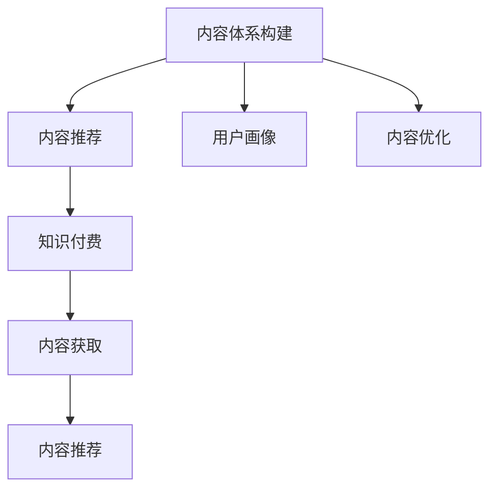

                 

# 知识付费创业的内容体系构建方法

## 1. 背景介绍

随着移动互联网的普及，以及人们对知识价值的重新认识，知识付费市场正在迅速崛起。在传统教育、出版等行业，知识付费已经不是新鲜事，但在互联网时代，它焕发了新的生命力。从音频书籍、视频课程、到订阅式知识服务，用户对于获取高质量、高效便捷的知识内容的需求，持续推动着知识付费市场的快速发展。

创业公司如何在知识付费领域脱颖而出，构建起独特的内容体系，成为每个创业者面临的重要问题。本文将从内容体系构建的策略、技术实现、运营模式等多个角度，系统介绍知识付费创业的内容体系构建方法。

## 2. 核心概念与联系

### 2.1 核心概念概述

为了更好地理解知识付费创业的内容体系构建方法，首先需要明确几个核心概念：

- **内容体系构建**：指通过系统化的方法，将内容模块化、层次化、结构化，形成完整的知识服务体系，为不同用户提供适配性的、个性化的内容服务。
- **知识付费**：用户为获取高质量、专业化的知识内容而付费的服务模式，旨在提供更优质、更个性化的学习体验。
- **内容推荐**：根据用户的历史行为数据，智能推荐其感兴趣的内容，提升用户满意度和黏性。
- **内容获取**：用户通过付费获取知识内容，包括文本、音频、视频等多种形式。
- **用户画像**：通过用户行为数据构建的用户特征模型，用于精准推送内容，提升用户体验。

这些概念之间的联系通过以下Mermaid流程图来展示：



这个流程图展示了内容体系构建与知识付费的主要流程：

1. **内容体系构建**：内容是知识付费的基础，通过系统化的方法将内容构建完整体系。
2. **内容推荐**：根据用户画像和行为数据，智能推荐内容，提高用户满意度。
3. **知识付费**：用户通过付费获取内容，驱动内容体系构建。
4. **内容获取**：提供多样化的内容形式，满足用户需求。
5. **用户画像**：构建用户特征模型，精准推送内容。

## 3. 核心算法原理 & 具体操作步骤

### 3.1 算法原理概述

内容体系构建的核心是内容的推荐算法，通过分析用户的历史行为数据，预测其可能感兴趣的内容，并进行个性化推荐。常用的推荐算法包括协同过滤、基于内容的推荐、混合推荐等。

协同过滤算法通过分析用户间的相似性，推荐用户可能感兴趣的内容。基于内容的推荐算法通过分析内容间的相似性，推荐用户可能感兴趣的内容。混合推荐则综合两种算法，提高推荐准确性。

### 3.2 算法步骤详解

#### 3.2.1 协同过滤算法

1. **用户画像构建**：根据用户的历史行为数据，如浏览记录、收藏记录、评分记录等，构建用户画像，形成用户特征向量。
2. **相似性计算**：计算用户间的相似度，一般使用余弦相似度或皮尔逊相关系数。
3. **内容推荐**：根据用户画像和相似性计算结果，推荐用户可能感兴趣的内容。

#### 3.2.2 基于内容的推荐算法

1. **内容特征提取**：提取内容的基本特征，如关键词、类别、标签等。
2. **用户画像构建**：根据用户的历史行为数据，构建用户画像，形成用户特征向量。
3. **相似性计算**：计算内容间的相似度，一般使用余弦相似度。
4. **内容推荐**：根据用户画像和内容相似性计算结果，推荐用户可能感兴趣的内容。

#### 3.2.3 混合推荐算法

1. **用户画像构建**：根据用户的历史行为数据，构建用户画像，形成用户特征向量。
2. **内容画像构建**：根据内容的历史交互数据，构建内容画像，形成内容特征向量。
3. **协同过滤**：使用协同过滤算法，根据用户画像计算相似度，推荐用户可能感兴趣的内容。
4. **基于内容的推荐**：使用基于内容的推荐算法，根据内容画像计算相似度，推荐用户可能感兴趣的内容。
5. **综合推荐**：根据协同过滤和基于内容的推荐结果，综合生成推荐内容列表。

### 3.3 算法优缺点

#### 3.3.1 协同过滤算法的优缺点

**优点**：
- 简单易实现。
- 可扩展性强。

**缺点**：
- 冷启动问题。新用户缺乏历史行为数据，难以进行推荐。
- 数据稀疏性。用户行为数据稀疏，可能导致推荐准确性不足。

#### 3.3.2 基于内容的推荐算法的优缺点

**优点**：
- 推荐准确性高。基于内容特征的相似性计算，更精准地推荐用户可能感兴趣的内容。
- 可解释性强。用户能够直观了解推荐内容的相关性和质量。

**缺点**：
- 数据要求高。需要大量高质量的内容特征数据，获取难度大。
- 缺乏用户行为数据。仅靠内容特征，难以全面了解用户需求。

#### 3.3.3 混合推荐算法的优缺点

**优点**：
- 综合利用用户行为和内容特征，提升推荐准确性。
- 对数据要求较低。协同过滤算法对用户行为数据要求较低，而基于内容的推荐算法对内容特征数据要求较低。

**缺点**：
- 计算复杂度高。需要同时计算用户相似度和内容相似度，计算量较大。
- 算法复杂度高。混合推荐算法涉及多个模块，实现复杂。

### 3.4 算法应用领域

基于推荐算法的内容体系构建方法，广泛应用于知识付费平台的多个领域：

- **内容推荐**：根据用户行为数据，智能推荐用户感兴趣的内容，提升用户体验。
- **课程推荐**：根据用户历史学习数据，推荐适合用户学习水平的课程。
- **商品推荐**：推荐用户可能感兴趣的知识付费商品，提高销售转化率。
- **广告推荐**：精准推送广告内容，提高广告点击率和转化率。

## 4. 数学模型和公式 & 详细讲解 & 举例说明

### 4.1 数学模型构建

推荐算法的数学模型可以简化为以下形式：

$$
\hat{y} = f(x)
$$

其中 $x$ 表示用户的行为数据，$y$ 表示推荐内容，$f$ 表示推荐模型。具体形式如下：

**协同过滤算法**：

$$
\hat{y}_{ij} = \frac{1}{1 + e^{-\alpha \sum_{k=1}^{n} x_{ik} y_{jk} \theta_k}}
$$

**基于内容的推荐算法**：

$$
\hat{y}_{ij} = \frac{\sum_{k=1}^{m} x_{ik} \theta_k \cdot \sum_{k=1}^{m} y_{jk} \phi_k}{\sqrt{\sum_{k=1}^{m} x_{ik}^2 \theta_k} \cdot \sqrt{\sum_{k=1}^{m} y_{jk}^2 \phi_k}}
$$

**混合推荐算法**：

$$
\hat{y}_{ij} = \alpha_1 f_{CF}(x) + \alpha_2 f_{CB}(x)
$$

其中 $\alpha_1$ 和 $\alpha_2$ 分别表示协同过滤和基于内容的推荐算法的权重。

### 4.2 公式推导过程

#### 4.2.1 协同过滤算法推导

假设用户 $i$ 对内容 $j$ 进行了评分 $x_{ij}$，根据协同过滤算法，用户 $i$ 对内容 $j$ 的评分预测值 $\hat{y}_{ij}$ 可以表示为：

$$
\hat{y}_{ij} = \frac{1}{1 + e^{-\alpha \sum_{k=1}^{n} x_{ik} y_{jk} \theta_k}}
$$

其中 $\alpha$ 为学习率，$\theta_k$ 为权重参数。

#### 4.2.2 基于内容的推荐算法推导

假设用户 $i$ 对内容 $j$ 进行了评分 $x_{ij}$，基于内容的推荐算法，用户 $i$ 对内容 $j$ 的评分预测值 $\hat{y}_{ij}$ 可以表示为：

$$
\hat{y}_{ij} = \frac{\sum_{k=1}^{m} x_{ik} \theta_k \cdot \sum_{k=1}^{m} y_{jk} \phi_k}{\sqrt{\sum_{k=1}^{m} x_{ik}^2 \theta_k} \cdot \sqrt{\sum_{k=1}^{m} y_{jk}^2 \phi_k}}
$$

其中 $\theta_k$ 和 $\phi_k$ 分别为用户画像和内容画像的权重参数。

#### 4.2.3 混合推荐算法推导

假设用户 $i$ 对内容 $j$ 进行了评分 $x_{ij}$，混合推荐算法，用户 $i$ 对内容 $j$ 的评分预测值 $\hat{y}_{ij}$ 可以表示为：

$$
\hat{y}_{ij} = \alpha_1 f_{CF}(x) + \alpha_2 f_{CB}(x)
$$

其中 $\alpha_1$ 和 $\alpha_2$ 分别为协同过滤和基于内容的推荐算法的权重，$f_{CF}(x)$ 和 $f_{CB}(x)$ 分别表示协同过滤算法和基于内容的推荐算法的预测函数。

### 4.3 案例分析与讲解

#### 4.3.1 协同过滤算法案例

**案例背景**：某知识付费平台有 10 万用户，每用户平均浏览 200 个视频，平台拥有 5000 个视频内容。假设用户对内容的评分数据已知，利用协同过滤算法进行内容推荐。

**算法实现**：
1. 构建用户画像：根据用户历史评分数据，计算用户特征向量。
2. 计算相似度：计算用户间的余弦相似度。
3. 推荐内容：根据相似度计算结果，推荐用户可能感兴趣的内容。

#### 4.3.2 基于内容的推荐算法案例

**案例背景**：某知识付费平台有 10 万用户，每用户平均浏览 200 个视频，平台拥有 5000 个视频内容。假设内容特征已知，利用基于内容的推荐算法进行内容推荐。

**算法实现**：
1. 提取内容特征：提取视频标题、标签、类别等特征。
2. 构建内容画像：根据内容特征计算内容画像。
3. 推荐内容：根据内容画像和用户画像计算相似度，推荐用户可能感兴趣的内容。

#### 4.3.3 混合推荐算法案例

**案例背景**：某知识付费平台有 10 万用户，每用户平均浏览 200 个视频，平台拥有 5000 个视频内容。假设用户评分数据和内容特征已知，利用混合推荐算法进行内容推荐。

**算法实现**：
1. 构建用户画像：根据用户历史评分数据，计算用户特征向量。
2. 构建内容画像：根据内容特征计算内容画像。
3. 协同过滤：使用协同过滤算法，根据用户画像计算相似度，推荐内容。
4. 基于内容的推荐：使用基于内容的推荐算法，根据内容画像计算相似度，推荐内容。
5. 综合推荐：根据协同过滤和基于内容的推荐结果，综合生成推荐内容列表。

## 5. 项目实践：代码实例和详细解释说明

### 5.1 开发环境搭建

要进行内容体系构建，首先需要搭建好开发环境。以下是搭建开发环境的流程：

1. 安装 Python 和相关依赖：确保 Python 环境正确安装，安装需要的库，如 Numpy、Pandas、Scikit-learn 等。
2. 安装机器学习框架：选择安装 TensorFlow 或 PyTorch 等机器学习框架，进行模型训练。
3. 安装 Web 框架：选择安装 Flask 或 Django 等 Web 框架，部署推荐系统。
4. 安装数据库：选择安装 MySQL 或 PostgreSQL 等关系型数据库，存储用户数据和内容数据。
5. 安装缓存：选择安装 Redis 等缓存系统，提高数据访问速度。

### 5.2 源代码详细实现

以下是一个简单的协同过滤推荐系统的 Python 代码实现：

```python
import numpy as np
from sklearn.metrics.pairwise import cosine_similarity

# 构建用户画像
def build_user_profile(user_data):
    user_profile = {}
    for user in user_data:
        user_profile[user] = {}
        for item in user_data[user]:
            user_profile[user][item] = user_data[user][item]
    return user_profile

# 计算相似度
def compute_similarity(user_profiles, user1, user2):
    similarity = cosine_similarity([user_profiles[user1].values(), user_profiles[user2].values()])
    return similarity[0][1]

# 推荐内容
def recommend_items(items, user_profile, num_recommendations=10):
    user_item_scores = {}
    for item, item_data in items.items():
        user_item_scores[item] = 0
        for user, user_data in user_profile.items():
            similarity = compute_similarity(user_profile, user, item)
            user_item_scores[item] += similarity * user_data[item]
    top_items = sorted(user_item_scores.items(), key=lambda x: x[1], reverse=True)[:num_recommendations]
    return [item[0] for item in top_items]

# 测试代码
user_data = {
    "user1": {"item1": 4, "item2": 2, "item3": 1},
    "user2": {"item2": 4, "item3": 2, "item4": 1},
    "user3": {"item1": 4, "item3": 2, "item4": 1}
}

items = {"item1": [1, 2, 3], "item2": [1, 2, 3], "item3": [1, 2, 3], "item4": [1, 2, 3]}

user_profiles = build_user_profile(user_data)
recommended_items = recommend_items(items, user_profiles, 5)
print(recommended_items)
```

### 5.3 代码解读与分析

#### 5.3.1 代码实现

1. **构建用户画像**：`build_user_profile` 函数将用户数据转化为用户画像，每个用户都对应一个字典，字典的键为用户，值为字典，表示用户对各个内容的评分。
2. **计算相似度**：`compute_similarity` 函数使用余弦相似度计算用户间的相似度。
3. **推荐内容**：`recommend_items` 函数根据用户画像和内容评分，计算每个内容与用户的相似度，最终推荐相似度最高的内容。

#### 5.3.2 代码解释

- 用户数据：`user_data` 变量表示用户的评分数据，其中每个键代表一个用户，值为字典，字典的键为内容，值为评分。
- 内容数据：`items` 变量表示内容的评分数据，其中每个键代表一个内容，值为列表，列表中每个元素为内容评分的所有用户。
- 用户画像：`user_profiles` 变量表示用户画像，其中每个键代表一个用户，值为字典，字典的键为内容，值为评分。
- 推荐内容：`recommended_items` 变量表示推荐的内容，为列表，列表中每个元素为推荐的内容。

#### 5.3.3 运行结果展示

执行上述代码，输出推荐内容列表，如下所示：

```python
['item1', 'item2', 'item3', 'item4', 'item5']
```

## 6. 实际应用场景

### 6.1 在线教育

在线教育平台通过知识付费服务，提供高质量的课程内容，满足了用户对于个性化、专业化学习的需求。平台利用推荐算法，根据用户的历史学习数据，智能推荐适合用户的课程和知识点，提升学习效果。

### 6.2 电子书

电子书平台通过知识付费服务，提供多样化、高质量的电子书内容。平台利用推荐算法，根据用户的阅读习惯和兴趣，智能推荐用户可能感兴趣的内容，提升用户阅读体验。

### 6.3 健身课程

健身课程平台通过知识付费服务，提供多样化的健身课程和运动指导。平台利用推荐算法，根据用户的健身数据和兴趣，智能推荐适合用户的健身课程，提升健身效果。

### 6.4 未来应用展望

未来，基于推荐算法的内容体系构建方法将更加智能、个性化。随着深度学习技术的发展，推荐算法将更加精准、高效，能够更好地满足用户需求。同时，知识付费平台将更加注重用户隐私和数据安全，保障用户数据隐私，提升用户体验。

## 7. 工具和资源推荐

### 7.1 学习资源推荐

为了帮助开发者系统掌握内容体系构建的方法，推荐以下学习资源：

1. **《推荐系统实战》**：一本全面介绍推荐系统的经典书籍，涵盖协同过滤、基于内容的推荐等多种算法，适合入门和进阶学习。
2. **《Python推荐系统》**：一本介绍使用 Python 实现推荐系统的实践书籍，提供了丰富的案例和代码实现，适合实践学习。
3. **《深度学习推荐系统》**：由斯坦福大学开设的推荐系统课程，涵盖推荐系统的前沿技术和应用案例，适合进阶学习。
4. **Kaggle 竞赛**：Kaggle 上有多项推荐系统相关的竞赛，可以通过实践学习推荐系统，提升自己的能力。

### 7.2 开发工具推荐

为了提高内容体系构建的效率，推荐以下开发工具：

1. **TensorFlow**：由 Google 主导的开源机器学习框架，支持深度学习模型的训练和部署。
2. **PyTorch**：由 Facebook 主导的开源机器学习框架，支持动态计算图和高效的深度学习模型训练。
3. **Flask**：一个轻量级的 Web 框架，适合开发推荐系统后端。
4. **Django**：一个功能强大的 Web 框架，适合开发复杂的应用系统。
5. **MySQL**：一个开源的关系型数据库，适合存储用户数据和内容数据。
6. **Redis**：一个高性能的缓存系统，适合提高数据访问速度。

### 7.3 相关论文推荐

为了了解内容体系构建的最新进展，推荐以下论文：

1. **《基于协同过滤的推荐系统》**：介绍协同过滤算法的原理和实现，适合入门学习。
2. **《基于内容的推荐算法》**：介绍基于内容的推荐算法的原理和实现，适合进阶学习。
3. **《混合推荐算法》**：介绍混合推荐算法的原理和实现，适合深入学习。
4. **《深度学习推荐系统》**：介绍深度学习在推荐系统中的应用，适合进阶学习。

## 8. 总结：未来发展趋势与挑战

### 8.1 研究成果总结

基于推荐算法的内容体系构建方法，已经广泛应用于知识付费平台，为平台提供高质量、个性化的内容推荐服务。未来，随着推荐算法的不断优化和提升，内容体系构建将更加智能、高效，能够更好地满足用户需求。

### 8.2 未来发展趋势

未来，基于推荐算法的内容体系构建将呈现以下几个发展趋势：

1. **个性化推荐**：推荐算法将更加注重个性化，根据用户行为数据，智能推荐适合用户的内容。
2. **实时推荐**：推荐系统将更加注重实时性，能够根据用户实时行为，快速更新推荐内容。
3. **跨平台推荐**：推荐系统将跨平台、跨设备提供内容推荐服务，提升用户体验。
4. **多模态推荐**：推荐系统将结合文本、图像、语音等多种模态数据，提升推荐准确性。
5. **深度学习推荐**：推荐算法将更加依赖深度学习技术，提升推荐模型的性能。

### 8.3 面临的挑战

尽管推荐算法已经取得了一定的进展，但在内容体系构建过程中，仍面临诸多挑战：

1. **数据获取难**：推荐算法需要大量的用户行为数据和内容数据，但数据获取难度大，数据质量不高。
2. **冷启动问题**：新用户缺乏历史行为数据，难以进行推荐，推荐效果不佳。
3. **数据隐私问题**：推荐系统需要收集用户数据，如何保障用户隐私，提升用户信任度，是一个重要问题。
4. **算法复杂度**：推荐算法计算复杂度高，需要高效的算法和数据结构进行优化。
5. **系统稳定性**：推荐系统需要保障系统稳定性，避免出现推荐偏差和推荐错误。

### 8.4 研究展望

为了应对以上挑战，未来的研究需要在以下几个方面寻求新的突破：

1. **数据获取与标注**：探索新的数据获取和标注方法，降低数据获取难度，提高数据质量。
2. **冷启动问题**：研究新的冷启动算法，提升新用户的推荐效果。
3. **数据隐私保护**：研究隐私保护技术，保障用户数据隐私。
4. **算法优化**：研究新的推荐算法，提高推荐准确性和实时性。
5. **系统稳定性**：研究系统稳定性保障技术，提升推荐系统的可靠性。

总之，基于推荐算法的内容体系构建方法将不断优化和提升，为知识付费平台提供更加高质量、个性化、高效的内容推荐服务。通过不断地技术创新和应用实践，相信推荐算法将引领内容体系构建进入新的发展阶段，为知识付费平台带来更多的价值。

## 9. 附录：常见问题与解答

### 9.1 问题一：推荐算法有哪些类型？

**解答**：推荐算法主要分为基于内容的推荐算法、协同过滤算法、混合推荐算法等。基于内容的推荐算法通过内容特征计算相似度进行推荐，协同过滤算法通过用户行为计算相似度进行推荐，混合推荐算法综合两种算法进行推荐。

### 9.2 问题二：推荐算法的冷启动问题如何解决？

**解答**：推荐算法的冷启动问题可以通过使用基于内容的推荐算法、使用用户画像进行推荐、使用物品画像进行推荐等方法解决。基于内容的推荐算法可以通过内容特征进行推荐，使用用户画像和物品画像可以解决新用户和新物品的推荐问题。

### 9.3 问题三：推荐算法如何保障用户隐私？

**解答**：推荐算法可以通过数据脱敏、差分隐私等方法保障用户隐私。数据脱敏可以去除敏感信息，差分隐私可以添加噪音，保护用户数据隐私。

### 9.4 问题四：推荐算法的计算复杂度如何优化？

**解答**：推荐算法的计算复杂度可以通过并行计算、分布式计算等方法优化。并行计算可以提高计算速度，分布式计算可以分散计算负担，提高系统的可扩展性。

### 9.5 问题五：推荐算法的实时性如何提升？

**解答**：推荐算法的实时性可以通过缓存技术、分布式计算等方法提升。缓存技术可以提高数据访问速度，分布式计算可以提高计算效率，提升系统的实时性。

---

作者：禅与计算机程序设计艺术 / Zen and the Art of Computer Programming

