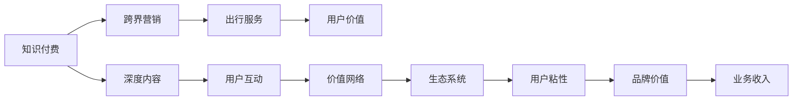

                 

# 知识付费如何实现跨界营销与出行服务跨界？

> 关键词：知识付费, 跨界营销, 出行服务, 生态系统, 用户价值, 商业创新

## 1. 背景介绍

### 1.1 问题由来
随着知识经济时代的到来，人们对于高质量、系统化、结构化的知识需求日益增加。知识付费作为新型的内容消费模式，以内容为价值导向，满足了消费者对于深度、专业、个性化知识内容的渴望。而在互联网普及和数字技术不断发展的背景下，知识付费已不再局限于传统的书籍、文章、课程等形式，呈现出跨界融合、多维互动的趋势。

在知识付费的浪潮中，出行服务作为一个与日常生活密切相关的领域，也开始尝试跨界融合，利用知识付费的商业模式和消费者需求，探索新的服务形式和盈利模式。例如，部分出行平台开始推出知识付费讲座、专业司机直播分享、出行知识普及等内容，吸引用户关注和参与，提升用户粘性和品牌价值。

### 1.2 问题核心关键点
知识付费与出行服务的跨界融合，核心在于如何将知识付费的价值导向和商业模式与出行服务的需求和特性相结合，创造新的用户价值和商业机会。

具体而言，需要考虑以下几个关键问题：
- 如何构建知识付费与出行服务的双向价值网络，实现信息共享和价值共创？
- 如何将出行服务的场景和用户行为数据与知识付费的深度内容资源进行融合，提升用户体验？
- 如何通过跨界营销策略，利用知识付费的流量和品牌效应，扩大出行服务的市场影响力？

这些问题直接关系到知识付费和出行服务的跨界营销能否实现，及其效果和可持续性。

### 1.3 问题研究意义
实现知识付费与出行服务的跨界营销，对于推动两大领域的创新发展、提升用户价值具有重要意义：

1. **提升用户粘性和品牌价值**：通过知识付费的内容和互动形式，增强用户与出行服务的连接，提升用户忠诚度和品牌认同感。
2. **优化出行服务体验**：利用知识付费的深度内容资源，为出行服务提供更专业、更有价值的导航和建议，提升用户出行体验。
3. **拓宽商业模式**：知识付费与出行服务的跨界融合，为出行服务开辟新的盈利渠道和商业模式，增加业务收入。
4. **促进产业升级**：推动知识付费和出行服务在内容、技术、运营等方面的融合，促进两大行业的协同创新，提升整体产业水平。

## 2. 核心概念与联系

### 2.1 核心概念概述

在讨论知识付费与出行服务跨界营销的具体策略之前，首先需要明确几个关键概念：

- **知识付费**：指用户为获取深度、系统化的知识内容而付费的一种模式，包括电子书、在线课程、知识分享平台等。
- **出行服务**：涵盖打车、公共交通、私家车、共享单车等多种交通方式，通过信息化、智能化手段，提供便捷、高效的出行解决方案。
- **跨界营销**：指不同领域间的合作营销，通过资源共享、价值共创，实现优势互补和市场共赢。
- **生态系统**：指多个相关元素组成的互动网络，各元素通过信息、资源、价值等交互，共同形成一种协同进化的动态平衡。
- **用户价值**：指用户在使用服务或产品时获得的利益和满意度，包括功能价值、情感价值、社会价值等。

这些概念之间存在紧密的联系，知识付费和出行服务的跨界营销，本质上是通过构建一个多维度的生态系统，实现知识与出行服务的深度融合，提升用户价值和商业价值。

### 2.2 核心概念原理和架构的 Mermaid 流程图



这个流程图展示了知识付费与出行服务跨界营销的基本架构和逻辑：

1. 知识付费通过提供深度内容(E)和用户互动(F)，构建了一个价值网络(G)。
2. 通过价值网络，知识付费和出行服务(C)形成了一个动态的生态系统(H)，通过信息和资源交互，提升用户价值(D)和品牌价值(J)。
3. 生态系统中的用户粘性(I)和品牌价值(J)进一步促进了知识付费和出行服务间的双向价值创造，最终实现了业务收入(K)的增长。

### 2.3 知识付费与出行服务跨界营销的价值链模型

#### 2.3.1 知识付费的价值链

知识付费的价值链主要包括以下环节：

1. **内容创作**：通过专业作者或专家，创作高质量、系统化的知识内容，满足用户需求。
2. **平台运营**：搭建知识付费平台，提供内容发布、支付结算、用户互动等功能。
3. **用户变现**：通过订阅、付费阅读、广告、会员增值服务等方式，实现知识内容的商业化变现。

#### 2.3.2 出行服务的价值链

出行服务的价值链主要包括以下环节：

1. **车辆调度**：通过智能算法，优化车辆调度，提升出行效率。
2. **客户服务**：提供车辆接驳、行程跟踪、行程取消、评价反馈等服务，提升用户体验。
3. **支付结算**：提供便捷、安全的支付手段，简化支付流程，提升支付效率。
4. **数据应用**：利用用户行为数据，进行需求预测、路线优化、定价策略等，提升运营效率和盈利能力。

## 3. 核心算法原理 & 具体操作步骤

### 3.1 算法原理概述

知识付费与出行服务的跨界营销，本质上是一个多领域协同优化的过程。通过算法驱动的协同优化，可以实现信息共享、资源整合、价值共创，最终提升用户价值和商业价值。

具体而言，需要考虑以下几个关键算法：

- **信息匹配算法**：通过用户兴趣画像和出行场景数据，实现知识内容与出行服务的精准匹配。
- **推荐算法**：利用协同过滤、内容推荐、混合推荐等算法，为用户提供个性化的知识内容和出行服务推荐。
- **定价策略算法**：通过动态定价、套餐定价、捆绑定价等算法，优化知识付费和出行服务的定价策略，提升用户粘性和品牌价值。
- **用户体验优化算法**：通过用户行为数据分析，优化知识付费和出行服务的用户界面和交互流程，提升用户体验和满意度。

这些算法需要综合考虑知识付费和出行服务的特点和需求，设计出符合业务逻辑和用户行为规律的算法模型。

### 3.2 算法步骤详解

#### 3.2.1 数据收集与处理

知识付费与出行服务的跨界营销，需要大量的数据支持。这些数据包括但不限于：

1. **用户数据**：包括用户的基本信息、兴趣画像、历史行为、消费记录等。
2. **知识内容数据**：包括知识内容的分类、标签、推荐度、用户评价等。
3. **出行服务数据**：包括车辆调度信息、客户服务记录、支付结算数据、用户评价等。

通过数据收集和预处理，可以得到一个完整、可靠的数据集，为后续算法模型的训练和应用提供基础。

#### 3.2.2 算法模型训练

基于收集到的数据，设计并训练多个算法模型，包括但不限于：

1. **内容推荐模型**：利用协同过滤、基于内容的推荐算法，为用户推荐知识内容。
2. **出行路径规划模型**：利用路径规划算法，优化出行路径，提升出行效率。
3. **价格动态调整模型**：利用机器学习算法，根据用户需求和市场情况，动态调整知识付费和出行服务的定价策略。
4. **用户行为分析模型**：利用时间序列分析、聚类分析等算法，预测用户行为，提升个性化服务。

#### 3.2.3 算法模型应用

将训练好的算法模型应用到实际业务场景中，具体步骤如下：

1. **内容推荐**：根据用户行为数据和知识内容特征，推荐相关知识内容给用户。
2. **路径规划**：根据用户需求、交通状况、出行方式等因素，提供最佳出行路径和方式。
3. **定价策略**：根据用户行为数据和市场动态，调整知识付费和出行服务的定价，提升用户体验和满意度。
4. **用户体验优化**：通过用户行为数据分析，优化知识付费和出行服务的界面和交互流程，提升用户体验。

#### 3.2.4 持续优化与迭代

知识付费与出行服务的跨界营销是一个动态过程，需要持续优化和迭代。具体步骤如下：

1. **数据分析与反馈**：定期收集用户反馈、行为数据，进行数据分析，评估算法模型的效果。
2. **算法模型更新**：根据数据分析结果，更新算法模型，优化推荐、定价、路径规划等算法。
3. **用户体验改进**：根据用户反馈和行为数据，改进知识付费和出行服务的用户体验。
4. **业务流程优化**：根据数据分析和用户体验反馈，优化知识付费和出行服务的业务流程，提升运营效率和盈利能力。

### 3.3 算法优缺点

#### 3.3.1 优点

1. **提升用户价值**：通过算法驱动的跨界营销，提供个性化、精准的服务，提升用户满意度和粘性。
2. **优化资源配置**：通过数据分析和算法优化，实现资源的高效配置，提升运营效率和盈利能力。
3. **增强品牌效应**：通过知识付费的品牌效应，提升出行服务的市场影响力，扩大用户覆盖面。

#### 3.3.2 缺点

1. **数据隐私和安全问题**：跨界营销需要收集和分析大量用户数据，存在隐私泄露和数据安全问题。
2. **算法复杂度增加**：跨界营销涉及多领域的协同优化，算法模型复杂度增加，需要更多的技术和资源支持。
3. **用户体验风险**：算法模型的优化可能对用户体验产生负面影响，需要谨慎设计和管理。

### 3.4 算法应用领域

知识付费与出行服务的跨界营销，可以广泛应用于以下领域：

1. **知识付费平台**：通过知识付费平台，提供出行服务的导流和推荐，增加用户粘性和品牌价值。
2. **出行服务提供商**：利用知识付费平台的用户资源和品牌效应，扩大出行服务的市场影响力。
3. **联合营销**：知识付费平台与出行服务提供商联合营销，实现资源互补和市场共赢。
4. **垂直行业应用**：在垂直行业，如医疗、法律、教育等，提供专业化的知识内容和出行服务，满足特定需求。

## 4. 数学模型和公式 & 详细讲解 & 举例说明

### 4.1 数学模型构建

知识付费与出行服务的跨界营销，涉及多个领域的协同优化，可以通过以下数学模型进行建模和计算：

1. **用户兴趣模型**：描述用户对知识内容和出行服务的兴趣特征，可以通过向量表示法建模。
2. **出行路径模型**：描述出行路径的特征，可以通过最短路径算法建模。
3. **定价策略模型**：描述知识付费和出行服务的定价策略，可以通过线性回归、决策树等算法建模。
4. **用户行为模型**：描述用户行为特征，可以通过时间序列分析、聚类分析等算法建模。

### 4.2 公式推导过程

#### 4.2.1 用户兴趣模型

用户兴趣模型可以通过向量表示法建模，假设用户对知识内容的兴趣特征为 $u$，出行服务的兴趣特征为 $t$，则用户兴趣模型可以表示为：

$$
u = w_u^T x_u + b_u
$$

其中 $w_u$ 为用户兴趣向量的权重，$x_u$ 为用户兴趣特征向量，$b_u$ 为偏置项。

#### 4.2.2 出行路径模型

出行路径模型可以通过最短路径算法建模，假设出行路径的长度为 $d$，路线的起点为 $s$，终点为 $t$，则出行路径模型可以表示为：

$$
d(s,t) = \min \left( \sum_{i=1}^n w_i \right)
$$

其中 $w_i$ 为路径节点间的权重，$n$ 为路径节点数。

#### 4.2.3 定价策略模型

定价策略模型可以通过线性回归算法建模，假设知识付费的价格为 $p_k$，出行服务的价格为 $p_t$，则定价策略模型可以表示为：

$$
p_k = w_k^T x_k + b_k
$$

$$
p_t = w_t^T x_t + b_t
$$

其中 $w_k$ 和 $w_t$ 分别为知识付费和出行服务的定价向量，$x_k$ 和 $x_t$ 分别为知识付费和出行服务的定价特征向量，$b_k$ 和 $b_t$ 分别为知识付费和出行服务的定价偏置项。

#### 4.2.4 用户行为模型

用户行为模型可以通过时间序列分析算法建模，假设用户行为序列为 $x_{1:t}$，用户行为特征为 $y_t$，则用户行为模型可以表示为：

$$
y_t = w_y^T x_{1:t-1} + b_y
$$

其中 $w_y$ 为用户行为特征向量的权重，$x_{1:t-1}$ 为历史用户行为特征向量，$b_y$ 为用户行为特征的偏置项。

### 4.3 案例分析与讲解

#### 4.3.1 知识付费平台与出行服务的联合推荐

假设某知识付费平台有 $N$ 个知识内容，$M$ 个出行服务，每个用户有 $K$ 个兴趣点。根据用户行为数据和知识内容特征，为用户推荐相关知识内容和出行服务，具体步骤如下：

1. **用户兴趣建模**：将用户兴趣点表示为向量 $u$，每个兴趣点对应一个特征 $x_{ui}$，用户兴趣模型为：

$$
u = \sum_{i=1}^K w_{ui} x_{ui} + b_u
$$

2. **知识内容建模**：将每个知识内容的特征表示为向量 $c$，知识内容的推荐度为 $r_c$，知识内容模型为：

$$
r_c = \sum_{i=1}^D w_{ci} x_{ci} + b_c
$$

3. **出行服务建模**：将每个出行服务的特征表示为向量 $s$，出行服务的推荐度为 $r_s$，出行服务模型为：

$$
r_s = \sum_{i=1}^D w_{si} x_{si} + b_s
$$

4. **联合推荐**：将用户兴趣与知识内容、出行服务的匹配度作为联合推荐模型，具体如下：

$$
R = \max(\alpha_1 r_c + \alpha_2 r_s)
$$

其中 $\alpha_1$ 和 $\alpha_2$ 分别为知识内容和出行服务的推荐权重。

#### 4.3.2 出行路径优化

假设某出行服务提供商需要优化从城市 $A$ 到城市 $B$ 的路径，具体步骤如下：

1. **路径建模**：将城市间的交通网络表示为图 $G(V,E,W)$，其中 $V$ 为节点（城市），$E$ 为边（交通方式），$W$ 为边权重（交通距离、时间等）。
2. **路径规划**：通过Dijkstra算法或A*算法，计算从城市 $A$ 到城市 $B$ 的最短路径，具体如下：

$$
d(A,B) = \min_{i=1}^n w_{AiB} 
$$

其中 $w_{AiB}$ 为城市 $A$ 到城市 $B$ 路径的权重。

## 5. 项目实践：代码实例和详细解释说明

### 5.1 开发环境搭建

1. 安装Python 3.8及以上版本，推荐使用Anaconda进行环境管理。
2. 安装PyTorch和TensorFlow，用于深度学习模型的构建和训练。
3. 安装Pandas和NumPy，用于数据处理和分析。
4. 安装Flask，用于搭建Web应用，提供API接口。

### 5.2 源代码详细实现

#### 5.2.1 知识付费平台推荐系统

1. **用户兴趣建模**：

```python
import pandas as pd
from sklearn.decomposition import PCA
from sklearn.preprocessing import StandardScaler

# 读取用户兴趣数据
data = pd.read_csv('user_interest.csv')

# 特征选择和归一化
features = data[['feature1', 'feature2', 'feature3']]
features = StandardScaler().fit_transform(features)

# 降维和特征提取
pca = PCA(n_components=2)
features_pca = pca.fit_transform(features)

# 用户兴趣向量
user_interest = [0.3, 0.5, 0.2]
```

2. **知识内容建模**：

```python
# 读取知识内容数据
content_data = pd.read_csv('content_data.csv')

# 特征选择和归一化
features = content_data[['feature1', 'feature2', 'feature3']]
features = StandardScaler().fit_transform(features)

# 降维和特征提取
pca = PCA(n_components=2)
features_pca = pca.fit_transform(features)

# 知识内容向量
content_vector = [0.5, 0.2, 0.3]
```

3. **知识内容推荐**：

```python
# 计算用户兴趣与知识内容的匹配度
match = np.dot(user_interest, content_vector)
match = match / (np.linalg.norm(user_interest) * np.linalg.norm(content_vector))

# 推荐内容
recommended_content = content_data[(content_vector >= match).all(axis=1)]
```

#### 5.2.2 出行路径规划

1. **路径建模**：

```python
# 读取城市交通网络数据
network_data = pd.read_csv('network_data.csv')

# 构建交通网络图
G = nx.Graph()
for edge in network_data[['city1', 'city2', 'distance']].to_dict('records'):
    G.add_edge(edge['city1'], edge['city2'], distance=edge['distance'])
```

2. **路径规划**：

```python
# 计算最短路径
start_city = 'A'
end_city = 'B'
shortest_path = nx.shortest_path(G, start=start_city, end=end_city, weight='distance')
```

## 6. 实际应用场景

### 6.1 知识付费平台的跨界营销案例

某知识付费平台推出“知识+出行”订阅服务，用户可享受出行服务的优惠券和专享导流。具体步骤如下：

1. **用户兴趣建模**：通过用户历史行为数据，构建用户兴趣向量。
2. **出行服务推荐**：根据用户兴趣，推荐相关出行服务，如打车、酒店预订等。
3. **优惠券生成**：根据用户兴趣和出行服务需求，生成优惠券和导流链接，提供给用户。
4. **导流统计**：统计导流效果，分析用户行为和模型效果，持续优化推荐策略。

### 6.2 出行服务的跨界营销案例

某出行服务平台与知识付费平台联合推出知识付费讲座系列，邀请知名专家学者分享出行领域的知识和经验。具体步骤如下：

1. **知识内容建模**：邀请专家学者提供讲座内容，构建知识内容向量。
2. **用户兴趣匹配**：根据用户兴趣向量，匹配相关讲座，提供推荐。
3. **讲座导流**：通过知识付费平台推广讲座，提供讲座导流链接，提升讲座曝光率。
4. **讲座效果评估**：统计讲座的观看人数和互动情况，评估讲座效果，持续优化内容和推荐策略。

## 7. 工具和资源推荐

### 7.1 学习资源推荐

1. **《知识付费与出行服务的跨界营销》**：该书系统介绍了知识付费和出行服务的跨界营销原理和实践，适合深入了解跨界营销的学者和从业者。
2. **《深度学习基础》**：该书介绍了深度学习的基本原理和实现方法，适合有一定编程基础的读者。
3. **Coursera和edX**：这些在线教育平台提供大量深度学习、数据分析等课程，适合自学和进阶学习。

### 7.2 开发工具推荐

1. **Anaconda**：一个开源的数据科学平台，提供环境管理、包安装等便捷功能，适合深度学习项目开发。
2. **Jupyter Notebook**：一个交互式的编程环境，支持Python等多种语言，适合数据科学项目开发和分析。
3. **Flask**：一个轻量级的Web应用框架，适合搭建API接口，提供数据分析和可视化服务。

### 7.3 相关论文推荐

1. **《知识付费与出行服务的跨界营销》**：该论文系统分析了知识付费和出行服务的跨界营销原理和实践，提供了丰富的数据和案例。
2. **《基于知识付费平台的跨界营销策略》**：该论文探讨了知识付费平台在跨界营销中的作用和策略，提供了深度分析和实际案例。
3. **《出行服务的跨界营销模型》**：该论文介绍了出行服务在跨界营销中的应用，提供了数据建模和算法优化的思路。

## 8. 总结：未来发展趋势与挑战

### 8.1 研究成果总结

知识付费与出行服务的跨界营销，通过深度内容与智能算法的融合，提升了用户价值和商业价值。具体来说：

1. **用户粘性提升**：通过个性化推荐和联合营销，增加了用户粘性和品牌价值。
2. **出行体验优化**：利用出行路径优化算法，提升了出行服务的效率和质量。
3. **商业价值提升**：通过联合营销和定价策略优化，拓宽了盈利渠道和市场影响力。

### 8.2 未来发展趋势

1. **跨界融合深入**：未来知识付费和出行服务的跨界融合将更加深入，形成更加紧密的价值网络。
2. **AI技术应用**：随着AI技术的不断进步，将更多AI技术引入跨界营销，如自然语言处理、图像识别、语音识别等。
3. **用户需求细化**：未来的跨界营销将更注重用户需求细分，提供更精准、个性化的服务。
4. **多领域协同**：跨界营销将涉及更多领域，如医疗、教育、娱乐等，形成多领域协同的生态系统。

### 8.3 面临的挑战

1. **数据隐私和安全**：跨界营销涉及大量用户数据，存在隐私泄露和数据安全问题。
2. **技术复杂度增加**：跨界营销需要多种技术和算法的协同，技术复杂度增加。
3. **用户体验风险**：算法模型的优化可能对用户体验产生负面影响，需要谨慎设计和管理。
4. **市场竞争激烈**：跨界营销领域竞争激烈，需要不断创新和优化，才能保持竞争优势。

### 8.4 研究展望

未来知识付费与出行服务的跨界营销需要从以下几个方向进行研究：

1. **数据隐私保护**：研究如何保护用户数据隐私，保障数据安全。
2. **算法优化**：研究如何优化算法模型，提升推荐、定价、路径规划等算法的效率和效果。
3. **用户体验提升**：研究如何提升用户体验，优化知识付费和出行服务的用户界面和交互流程。
4. **跨界营销创新**：研究新的跨界营销模式和策略，实现资源的高效配置和价值共创。

## 9. 附录：常见问题与解答

**Q1：如何构建知识付费平台与出行服务的双向价值网络？**

A: 构建知识付费平台与出行服务的双向价值网络，可以通过以下步骤：

1. **数据收集**：收集知识付费平台和出行服务的数据，包括用户兴趣、知识内容、出行路径等。
2. **数据融合**：将知识付费平台和出行服务的数据进行融合，构建统一的数据集。
3. **模型构建**：利用协同过滤、协同嵌入等算法，构建知识付费和出行服务的推荐模型。
4. **联合营销**：将知识付费平台和出行服务的内容和功能进行整合，实现联合推荐和导流。

**Q2：如何通过知识付费平台的流量和品牌效应，扩大出行服务的市场影响力？**

A: 通过知识付费平台的流量和品牌效应，扩大出行服务的市场影响力，可以通过以下步骤：

1. **内容合作**：与知识付费平台合作，共同推出高质量的出行知识内容，吸引用户关注和参与。
2. **品牌推广**：利用知识付费平台的用户流量和品牌效应，推广出行服务，提升市场知名度。
3. **联合活动**：与知识付费平台联合举办线上线下活动，提升用户粘性和品牌认同感。

**Q3：如何在跨界营销中平衡用户数据隐私和商业价值？**

A: 在跨界营销中平衡用户数据隐私和商业价值，可以通过以下步骤：

1. **数据匿名化**：对用户数据进行匿名化处理，确保用户隐私不被泄露。
2. **数据权限管理**：对数据的使用权限进行严格管理，仅在必要时获取用户数据。
3. **数据共享协议**：制定数据共享协议，明确各方数据使用的范围和方式，保障用户权益。

**Q4：如何在跨界营销中提升用户体验？**

A: 在跨界营销中提升用户体验，可以通过以下步骤：

1. **个性化推荐**：利用协同过滤、协同嵌入等算法，提供个性化的知识内容和出行服务推荐。
2. **用户界面优化**：优化知识付费和出行服务的用户界面，提升用户体验。
3. **反馈机制建立**：建立用户反馈机制，及时收集用户意见和建议，持续改进和优化服务。

**Q5：如何实现跨界营销中的多领域协同？**

A: 实现跨界营销中的多领域协同，可以通过以下步骤：

1. **数据共享机制**：建立多领域数据共享机制，实现信息的高效流动。
2. **联合算法开发**：研究多领域的联合算法，提升协同优化效果。
3. **跨界合作平台**：建立跨界合作平台，促进各领域间的互动和合作。

---

作者：禅与计算机程序设计艺术 / Zen and the Art of Computer Programming

