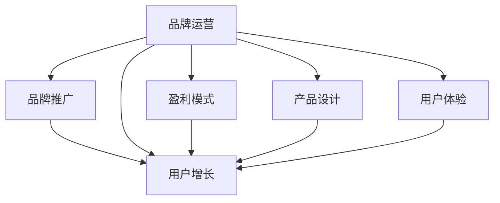

                 

# 知识付费赚钱的品牌品牌运营与品牌推广策略

> 关键词：知识付费,品牌运营,品牌推广,盈利模式,用户增长

## 1. 背景介绍

随着知识付费的兴起，越来越多的平台涌现，竞争日趋激烈。如何在这片红海中脱颖而出，成为品牌成功的关键。本文将从品牌运营和品牌推广的角度，深入探讨知识付费平台的盈利模式和用户增长策略，帮助品牌实现知识付费领域的快速崛起。

## 2. 核心概念与联系

### 2.1 核心概念概述

- **知识付费**：通过付费方式获取知识内容的模式，典型平台有得到、喜马拉雅、知乎等。
- **品牌运营**：涉及品牌定位、产品设计、用户体验等环节，核心目标是通过品牌影响力吸引和留住用户。
- **品牌推广**：利用营销手段提升品牌知名度和美誉度，主要手段包括内容营销、社交媒体、广告投放等。
- **盈利模式**：知识付费平台的收益主要来源于订阅费用、广告收入、知识商品销售等。
- **用户增长**：通过各种策略，吸引新用户注册、激活，并提高留存率，是品牌成功的基石。

这些核心概念之间相互关联，共同构成知识付费品牌运营和推广的基础。品牌运营为推广奠定基础，推广为运营注入动力，盈利模式则贯穿其中，用户增长是最终目标。

### 2.2 核心概念原理和架构的 Mermaid 流程图



这个流程图展示了大语言模型的核心概念及其之间的关系：

1. 品牌运营通过产品设计、用户体验等方面提升品牌吸引力，为品牌推广打下坚实基础。
2. 品牌推广通过各种营销手段提升品牌知名度，引导用户增长。
3. 盈利模式贯穿品牌运营和推广的全过程，为平台提供持续的收入来源。
4. 用户增长是品牌成功的最终目标，需要通过持续的品牌运营和推广来实现。

## 3. 核心算法原理 & 具体操作步骤

### 3.1 算法原理概述

品牌运营和推广的核心算法原理包括用户行为分析、市场细分、内容推荐等，这些算法共同作用于品牌运营的各个环节，实现用户增长和品牌推广的目标。

- **用户行为分析**：通过数据挖掘和机器学习技术，分析用户的行为特征和需求，提供个性化的产品和服务。
- **市场细分**：将市场细分为不同的用户群体，根据不同群体的需求和特点，制定差异化的运营策略。
- **内容推荐**：利用协同过滤、内容召回等算法，为用户提供符合其兴趣和需求的内容，提升用户粘性。

### 3.2 算法步骤详解

#### 3.2.1 用户行为分析

**步骤1：数据收集**  
收集用户在平台上的行为数据，包括浏览记录、购买记录、评论反馈等。

**步骤2：特征提取**  
使用TF-IDF、词嵌入等技术，将行为数据转化为向量表示。

**步骤3：模型训练**  
利用随机森林、GBDT、深度学习等模型，训练用户行为分析模型。

**步骤4：结果应用**  
根据模型预测结果，为用户提供个性化推荐、动态定价等策略。

#### 3.2.2 市场细分

**步骤1：用户分群**  
根据用户的行为数据、属性数据等，将用户分为不同群体。

**步骤2：特征分析**  
分析每个群体的特征和需求，如年龄段、兴趣领域等。

**步骤3：策略制定**  
针对不同群体，制定差异化的品牌推广和用户增长策略。

#### 3.2.3 内容推荐

**步骤1：内容表示**  
将内容转化为向量表示，使用word2vec、Doc2Vec等技术。

**步骤2：用户表示**  
使用协同过滤、矩阵分解等技术，表示用户兴趣。

**步骤3：推荐算法**  
结合用户和内容的表示，使用协同过滤、深度学习等算法，推荐用户感兴趣的内容。

### 3.3 算法优缺点

**优点**：
- 个性化推荐提升用户体验，增加用户粘性。
- 市场细分精准定位用户需求，提高运营效率。
- 用户行为分析提供数据支持，优化产品设计。

**缺点**：
- 数据隐私问题引发用户关注，需谨慎处理。
- 模型复杂度高，对数据质量和算法要求高。
- 推荐效果受限于用户数据的多样性和质量。

### 3.4 算法应用领域

这些算法原理和方法广泛应用于知识付费平台的品牌运营和推广中。例如，通过用户行为分析，平台可以优化产品推荐，提升用户满意度；通过市场细分，可以设计针对性广告，提高广告投放效率；通过内容推荐，可以提升用户留存率和活跃度，增加平台收益。

## 4. 数学模型和公式 & 详细讲解 & 举例说明

### 4.1 数学模型构建

品牌运营和推广的数学模型主要包括以下几个方面：

- **用户行为分析模型**：使用协同过滤、聚类等方法，建模用户行为特征。
- **市场细分模型**：利用K-means、层次聚类等算法，对市场进行细分。
- **内容推荐模型**：采用协同过滤、矩阵分解、深度学习等技术，推荐用户感兴趣的内容。

### 4.2 公式推导过程

#### 用户行为分析模型

**协同过滤推荐算法**：
设用户集为 $U$，物品集为 $I$，用户 $u$ 对物品 $i$ 的评分矩阵为 $R_{ui}$。协同过滤推荐算法的基本思路是根据与用户 $u$ 相似度高的用户 $v$ 对物品 $i$ 的评分，推测用户 $u$ 对物品 $i$ 的评分，推荐给用户 $u$。

设用户 $u$ 和用户 $v$ 的相似度为 $sim(u,v)$，根据用户 $v$ 对物品 $i$ 的评分 $R_{vi}$，推测用户 $u$ 对物品 $i$ 的评分 $R_{ui}$，推荐给用户 $u$。

**公式推导**：
$$
\hat{R}_{ui} = \sum_{v \in U} sim(u,v) \cdot R_{vi}
$$

其中，$sim(u,v)$ 为相似度函数，可以采用余弦相似度、皮尔逊相关系数等。

#### 市场细分模型

**K-means聚类算法**：
设市场中的 $N$ 个用户表示为 $X_1,X_2,\cdots,X_N \in R^d$，目标是将这些用户划分为 $K$ 个簇 $C_1,C_2,\cdots,C_K$，使得每个簇内的点尽可能地紧凑，簇间尽可能地分开。

**公式推导**：
$$
\min \sum_{i=1}^{K} \sum_{x \in C_i} \|x-\mu_i\|^2
$$

其中，$\mu_i$ 为簇 $C_i$ 的中心点。

### 4.3 案例分析与讲解

**案例一：用户行为分析模型**

某知识付费平台希望通过分析用户行为，优化推荐系统。收集用户浏览、购买、评价等数据，建立协同过滤模型，计算用户之间的相似度，推荐相似用户喜欢的课程。

具体步骤：
1. 收集用户浏览、购买、评价数据。
2. 将用户行为数据转化为评分矩阵 $R$。
3. 使用协同过滤算法计算用户相似度，推荐相似用户喜欢的课程。

**案例二：市场细分模型**

某在线教育平台希望通过市场细分，提升品牌推广效果。收集平台用户的数据，使用K-means算法将用户分为不同的群体。

具体步骤：
1. 收集用户行为、属性数据。
2. 使用K-means算法将用户分为 $K$ 个群体。
3. 针对不同群体，设计差异化的广告和推广策略。

## 5. 项目实践：代码实例和详细解释说明

### 5.1 开发环境搭建

以下是搭建知识付费品牌运营和推广的开发环境的步骤：

1. 安装Python，推荐使用3.7或更高版本。
2. 安装相关依赖库，如pandas、numpy、scikit-learn、tensorflow等。
3. 安装相关框架，如Flask、Django等。
4. 安装相关数据库，如MySQL、MongoDB等。

### 5.2 源代码详细实现

以下是使用Python实现协同过滤推荐算法的代码示例：

```python
import numpy as np
from sklearn.metrics.pairwise import cosine_similarity

def collaborative_filtering(data, k=10):
    R = data.to_numpy()
    n_users, n_items = R.shape
    
    # 计算用户之间的相似度
    similarity_matrix = cosine_similarity(R)
    
    # 计算每个用户的评分向量
    user_sums = np.sum(similarity_matrix, axis=1)
    user_sums[np.isnan(user_sums)] = 0
    user_weights = np.sqrt(user_sums)
    
    # 计算每个物品的评分向量
    item_sums = np.sum(similarity_matrix, axis=0)
    item_weights = np.sqrt(item_sums)
    item_sums[item_sums == 0] = 1
    item_weights[item_weights == 0] = 1
    
    # 计算每个用户的推荐评分
    user_recommends = np.dot(similarity_matrix, item_weights)
    user_recommends /= user_weights
    
    # 选择前k个推荐物品
    indices = np.argsort(user_recommends, axis=1)[-1:k]
    recommends = user_recommends[:, indices]
    
    return recommends
```

### 5.3 代码解读与分析

在上述代码中，我们使用了NumPy和Scikit-learn库来实现协同过滤推荐算法。

1. **数据预处理**：将用户行为数据转化为评分矩阵 $R$。
2. **计算用户相似度**：使用余弦相似度计算用户之间的相似度矩阵。
3. **计算用户评分向量**：根据用户相似度矩阵，计算每个用户的评分向量。
4. **计算物品评分向量**：根据物品相似度矩阵，计算每个物品的评分向量。
5. **计算用户推荐评分**：将用户和物品的评分向量相乘，得到每个用户的推荐评分。
6. **选择推荐物品**：选择前k个推荐物品，生成推荐列表。

### 5.4 运行结果展示

运行上述代码，可以生成每个用户的推荐课程列表。例如，对于用户 $u$，推荐列表可能如下：

1. 用户 $u$ 对物品 $i_1$ 的评分 $\hat{R}_{ui_1} = 4.5$
2. 用户 $u$ 对物品 $i_2$ 的评分 $\hat{R}_{ui_2} = 4.2$
3. 用户 $u$ 对物品 $i_3$ 的评分 $\hat{R}_{ui_3} = 4.1$

## 6. 实际应用场景

### 6.1 智能客服系统

智能客服系统可以通过品牌运营和推广，提升用户满意度和留存率。例如，某在线教育平台通过智能客服系统，提供7x24小时在线咨询，解答用户问题。通过品牌推广，提升平台知名度，吸引更多用户注册使用。

### 6.2 金融理财平台

金融理财平台可以通过品牌运营和推广，提升用户粘性和信任度。例如，某金融理财平台通过品牌运营，建立用户信任，推广其理财课程，吸引更多用户使用。通过市场细分，针对不同用户群体，设计差异化的产品和服务。

### 6.3 在线教育平台

在线教育平台可以通过品牌运营和推广，提升品牌影响力和用户留存率。例如，某在线教育平台通过品牌推广，提升平台知名度，吸引更多用户注册使用。通过市场细分，针对不同用户群体，设计差异化的课程和广告。

### 6.4 未来应用展望

未来，知识付费品牌运营和推广将更加注重用户体验和个性化服务。通过大数据和机器学习技术，不断优化推荐算法，提升用户满意度。同时，利用社交媒体、广告投放等手段，提升品牌知名度，吸引更多用户注册使用。

## 7. 工具和资源推荐

### 7.1 学习资源推荐

- **书籍**：《推荐系统实践》、《深度学习与推荐系统》
- **网站**：Kaggle、Coursera、edX
- **社区**：Stack Overflow、Kaggle、Reddit

### 7.2 开发工具推荐

- **编程语言**：Python、Java、Scala
- **框架**：Flask、Django、TensorFlow
- **数据库**：MySQL、MongoDB、Elasticsearch

### 7.3 相关论文推荐

- **用户行为分析**：《基于协同过滤的推荐算法》
- **市场细分**：《K-means聚类算法》
- **内容推荐**：《深度学习在推荐系统中的应用》

## 8. 总结：未来发展趋势与挑战

### 8.1 研究成果总结

本文系统介绍了知识付费平台的品牌运营和推广策略，深入探讨了用户行为分析、市场细分、内容推荐等核心算法原理和具体操作步骤。通过实例分析，展示了品牌运营和推广在知识付费领域的应用效果。

### 8.2 未来发展趋势

未来，知识付费平台的品牌运营和推广将更加注重个性化服务和用户体验。通过大数据和机器学习技术，不断优化推荐算法，提升用户满意度。同时，利用社交媒体、广告投放等手段，提升品牌知名度，吸引更多用户注册使用。

### 8.3 面临的挑战

品牌运营和推广过程中，面临的挑战包括数据隐私、算法复杂度、用户增长速度等。如何处理用户数据隐私问题，优化推荐算法，提升用户增长速度，是品牌运营和推广的关键。

### 8.4 研究展望

未来的研究需要结合心理学、社会学等学科，深入理解用户行为和需求，设计更加精准的品牌运营和推广策略。同时，需要不断优化推荐算法，提升用户体验和满意度，吸引更多用户注册使用。

## 9. 附录：常见问题与解答

**Q1：知识付费平台如何提升用户留存率？**

A: 提升用户留存率需要从多个方面入手，包括优化用户体验、设计差异化服务、提升品牌影响力等。具体措施包括：
- 优化产品设计，提升用户体验。
- 设计个性化推荐，满足用户多样化需求。
- 提升品牌影响力，吸引更多新用户。

**Q2：市场细分需要收集哪些数据？**

A: 市场细分需要收集用户行为数据、属性数据、历史数据等。具体来说，需要收集以下数据：
- 用户注册信息、年龄、性别、职业等。
- 用户行为数据，包括浏览记录、购买记录、评分反馈等。
- 历史数据，包括用户活跃度、流失率等。

**Q3：推荐算法如何选择？**

A: 选择推荐算法需要考虑数据类型、用户需求、推荐目标等因素。常见推荐算法包括协同过滤、矩阵分解、深度学习等。具体选择如下：
- 协同过滤适合用户行为数据较多，但物品特征较少的情况。
- 矩阵分解适合物品特征丰富，但用户行为数据较少的情况。
- 深度学习适合用户行为数据和物品特征都较多的情况。

**Q4：品牌推广有哪些渠道？**

A: 品牌推广可以采用多种渠道，包括：
- 内容营销：通过优质的内容吸引用户，提升品牌影响力。
- 社交媒体：在各大社交平台推广品牌，提升品牌知名度。
- 广告投放：在搜索引擎、社交媒体等平台投放广告，吸引用户注册使用。

**Q5：如何衡量品牌推广效果？**

A: 品牌推广效果的衡量可以从多个维度进行，包括：
- 品牌知名度：通过调查问卷、社交媒体数据等衡量品牌知名度。
- 用户增长：通过新用户注册、活跃用户数等衡量用户增长情况。
- 用户满意度：通过用户反馈、评分等衡量用户满意度。

---

作者：禅与计算机程序设计艺术 / Zen and the Art of Computer Programming

