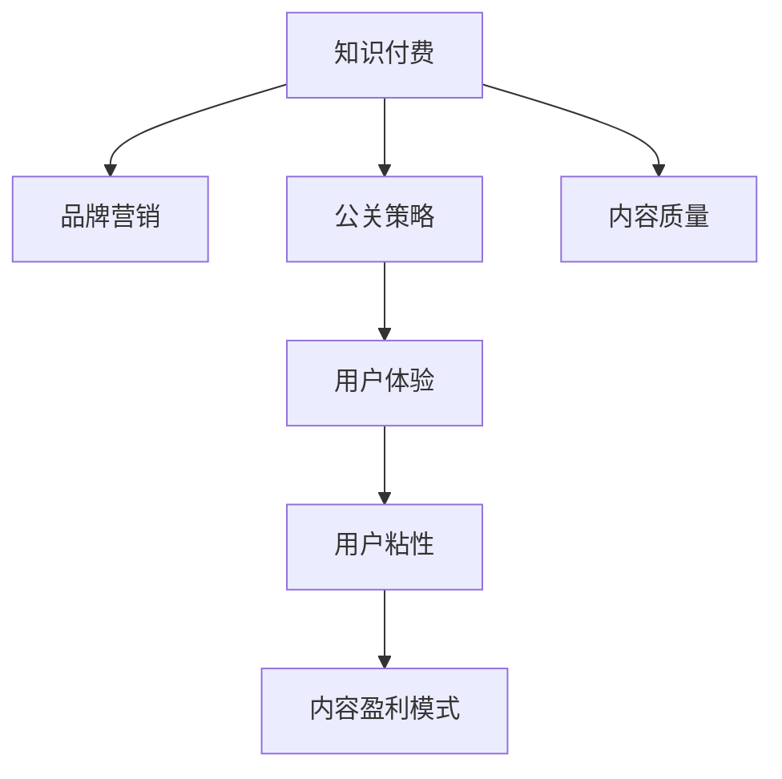

                 

# 知识付费赚钱的品牌营销与公关策略

在知识经济的时代，知识付费成为了一种热门趋势。如何有效地进行品牌营销和公关，将知识付费的独特优势转化为实际收入，成为了众多知识创作者和平台运营者的重要课题。本文将详细探讨知识付费品牌营销与公关的策略，帮助读者系统理解并提升知识付费的商业化能力。

## 1. 背景介绍

### 1.1 问题由来

知识付费的兴起源于人们对信息质量的高需求。相比免费的网络信息，用户更愿意为经过专业筛选、深度加工、质量保证的内容支付费用。但同时，知识付费市场的竞争也日益激烈，仅靠优质的内容已不足以吸引用户，品牌和公关的运作成为了关键因素。

### 1.2 问题核心关键点

知识付费的品牌营销与公关策略需要关注以下几个核心关键点：
- **用户画像**：深入了解目标用户群体的需求、习惯、痛点，进行精准营销。
- **内容质量**：保证内容的专业性、时效性、实用性，满足用户的学习需求。
- **品牌建设**：通过独特的品牌形象和价值观，增强用户的品牌认同和忠诚度。
- **渠道运营**：选择适合的线上线下渠道进行推广，扩大品牌影响力和用户覆盖面。
- **公信力提升**：建立平台和创作者的公信力，获取用户信任和口碑。

### 1.3 问题研究意义

对于知识付费平台而言，有效的品牌营销与公关策略不仅可以提升平台的用户留存和转化率，还能通过品牌溢价效应，获取更高的收入。对于知识创作者而言，通过精准的品牌定位和公关的推广，能够更快地吸引目标用户，增加收益来源。

## 2. 核心概念与联系

### 2.1 核心概念概述

为更好地理解知识付费品牌营销与公关的策略，本节将介绍几个密切相关的核心概念：

- **知识付费**：用户为获取知识信息而支付费用的商业模式。
- **品牌营销**：通过塑造独特的品牌形象，提升品牌知名度和用户认同，从而吸引用户支付的行为。
- **公关策略**：通过建立良好的公众关系，提升品牌公信力，形成积极的用户口碑。
- **用户体验**：用户在使用知识付费产品时的整体感受和满意度，直接影响用户留存和续费率。
- **用户粘性**：用户对平台的依赖程度和复购率，反映品牌对用户的吸引力。
- **内容盈利模式**：通过内容付费、广告分成、用户会员制等多种方式，实现平台的商业化。

这些核心概念之间的逻辑关系可以通过以下Mermaid流程图来展示：



这个流程图展示知识付费、品牌营销、公关策略等概念之间的相互关系：

1. 知识付费通过优质的内容和平台运营，吸引用户支付。
2. 品牌营销通过塑造独特的品牌形象和价值观，提升用户认同。
3. 公关策略通过建立良好的公众关系，提升品牌公信力。
4. 用户体验直接影响用户留存和续费率。
5. 用户粘性反映品牌对用户的吸引力。
6. 内容盈利模式通过多元化的收入来源，实现平台的商业化。

## 3. 核心算法原理 & 具体操作步骤
### 3.1 算法原理概述

知识付费的品牌营销与公关策略，本质上是品牌管理、市场营销和公共关系的一种结合。其核心思想是：通过品牌塑造和公关活动，提升用户对知识付费平台的认同感，形成稳定的用户群体。而营销则是将品牌推广到更广泛的目标用户中，吸引他们成为付费用户，实现商业转化。

### 3.2 算法步骤详解

基于品牌营销与公关的策略，以下是详细的步骤：

**Step 1: 用户画像分析**
- 通过问卷调查、用户访谈等方式，了解目标用户的兴趣、需求、行为习惯等。
- 使用数据分析工具（如Tableau、Google Analytics）对用户行为数据进行深度挖掘，形成详细的用户画像。
- 根据用户画像，设计针对性强的营销活动，提高转化率。

**Step 2: 内容质量控制**
- 确保平台上的内容由专业作者或机构提供，经过严格的审核流程。
- 定期更新和优化内容，确保其时效性和实用性。
- 引入用户反馈机制，根据用户评价调整内容方向和质量。

**Step 3: 品牌建设与传播**
- 设计独特的品牌标识和视觉元素，形成鲜明的品牌形象。
- 通过社交媒体、博客、视频等多种渠道进行品牌推广，提高品牌知名度。
- 建立品牌故事，通过内容营销展示品牌价值观和使命。

**Step 4: 渠道运营与整合**
- 选择合适的线上线下渠道进行推广，如微信公众号、微博、App Store、Google Play等。
- 利用SEO和SEM技术优化网站和App的流量。
- 与知名博主、KOL、媒体等进行合作推广，扩大品牌覆盖面。

**Step 5: 公关活动与用户反馈**
- 定期组织线下活动（如读书会、讲座、沙龙等），增强用户互动和粘性。
- 收集用户反馈，及时解决用户问题和痛点。
- 建立用户社区，鼓励用户生成内容，形成积极的用户生态。

### 3.3 算法优缺点

知识付费的品牌营销与公关策略具有以下优点：
1. 精准用户定位。通过用户画像分析，能够有针对性地设计营销活动，提高转化率。
2. 品牌认同增强。通过品牌建设，提升用户对平台的信任和忠诚度。
3. 内容质量保证。确保内容的专业性和实用性，满足用户学习需求。
4. 多渠道推广。通过线上线下渠道的整合，扩大品牌影响力和用户覆盖面。

同时，该策略也存在一些局限性：
1. 投入成本高。品牌建设和公关的维护需要大量的时间和资源。
2. 市场竞争激烈。知识付费市场竞争激烈，品牌难以一枝独秀。
3. 用户需求多样。不同用户对知识付费的需求各异，难以形成统一的营销方案。
4. 数据隐私问题。在收集用户数据和行为信息时，需要重视数据隐私和安全性。

尽管存在这些局限性，但就目前而言，品牌营销与公关策略仍是大规模知识付费平台的重要手段。未来相关研究重点在于如何优化营销策略，提升公信力，降低运营成本，同时兼顾用户隐私和数据安全。

### 3.4 算法应用领域

知识付费的品牌营销与公关策略，广泛应用于各类知识付费平台，例如：

- **在线教育平台**：如Coursera、Udemy、Khan Academy等，通过品牌建设和公关的推广，吸引更多付费用户。
- **专业课程平台**：如网易云课堂、腾讯课堂、网易公开课等，通过优质内容和品牌推广，提升用户粘性和满意度。
- **内容付费平台**：如知乎、得到、喜马拉雅等，通过品牌故事和公关的传播，增强用户信任和忠诚度。
- **科技博客和媒体**：如36kr、IT之家、cnBeta等，通过内容营销和品牌推广，吸引科技爱好者付费订阅。

除了上述这些平台外，知识付费的商业化策略还广泛应用于各类知识付费内容生产者，如专家、学者、博主等，通过品牌建设与公关的推广，提升自身影响力，实现商业变现。

## 4. 数学模型和公式 & 详细讲解 & 举例说明
### 4.1 数学模型构建

在知识付费的品牌营销与公关策略中，可以构建如下数学模型：

设用户画像分析得到的目标用户数量为 $N$，品牌建设和公关的投入为 $C$，内容质量控制和更新的成本为 $E$，营销活动的转化率为 $\alpha$，线上渠道的曝光率为 $\beta$，线下活动的用户参与度为 $\gamma$。

**品牌知名度提升**：
$$
K = f(\alpha \cdot \beta \cdot \gamma)
$$
其中 $f$ 为函数，表示品牌知名度与各个因素的关联。

**用户留存率提升**：
$$
R = g(\alpha \cdot \beta \cdot \gamma \cdot \delta)
$$
其中 $\delta$ 为内容更新频率和用户反馈机制的有效性。

**商业转化率**：
$$
CVR = h(K \cdot R \cdot P)
$$
其中 $P$ 为价格因素，$h$ 为函数，表示转化率与品牌知名度和用户留存率的关系。

### 4.2 公式推导过程

对于上述模型，我们需要进一步推导和优化，以找到最优的投入策略。

**品牌知名度提升**：
设品牌知名度为 $K$，投入为 $C$，则有：
$$
K = \alpha \cdot \beta \cdot \gamma \cdot C^k
$$
其中 $k$ 为投入产出的幂次，通常 $0 < k < 1$。

**用户留存率提升**：
设用户留存率为 $R$，内容质量为 $Q$，用户反馈为 $F$，则有：
$$
R = Q^l \cdot F^m
$$
其中 $l$ 和 $m$ 为系数，通常 $0 < l, m < 1$。

**商业转化率**：
设商业转化率为 $CVR$，则有：
$$
CVR = K^n \cdot R^o \cdot P^p
$$
其中 $n$、$o$、$p$ 为系数，通常 $0 < n, o, p < 1$。

### 4.3 案例分析与讲解

以下通过一个具体案例来详细讲解知识付费品牌营销与公关的数学模型：

**案例背景**：某在线教育平台（如Coursera），针对特定领域的知识付费课程进行品牌营销与公关推广。

**目标用户**：年龄在20-40岁之间的专业人士，希望通过学习获得职业提升。

**品牌建设**：平台设计独特的Logo和标语，定期在社交媒体上发布高质量的内容，建立品牌故事。

**内容质量控制**：平台邀请行业专家设计课程内容，确保课程的专业性和实用性。定期更新课程内容，根据用户反馈进行调整。

**渠道运营**：通过谷歌AdWords进行线上推广，同时在LinkedIn、Facebook等社交平台上进行品牌宣传。

**公关活动**：组织线下讲座和读书会，与知名博主和KOL进行合作推广。

**用户反馈**：建立用户社区，鼓励用户生成内容，提供课程建议和反馈。

**结果分析**：通过数据分析工具，评估品牌知名度、用户留存率和转化率的变化，优化投放策略。

## 5. 项目实践：代码实例和详细解释说明
### 5.1 开发环境搭建

在进行知识付费品牌营销与公关的实践前，我们需要准备好开发环境。以下是使用Python进行项目实践的环境配置流程：

1. 安装Anaconda：从官网下载并安装Anaconda，用于创建独立的Python环境。

2. 创建并激活虚拟环境：
```bash
conda create -n knowledge-marketing python=3.8 
conda activate knowledge-marketing
```

3. 安装相关工具包：
```bash
pip install pandas numpy matplotlib scikit-learn scikit-optimize jupyter notebook ipython
```

4. 安装相关库：
```bash
pip install openpyxl pyhtml2text
```

完成上述步骤后，即可在`knowledge-marketing`环境中开始项目实践。

### 5.2 源代码详细实现

下面我们以品牌知名度提升为例，给出使用Python进行品牌营销与公关的代码实现。

```python
import pandas as pd
from sklearn.ensemble import RandomForestRegressor
from sklearn.model_selection import train_test_split

# 读取用户数据和品牌投入数据
data = pd.read_csv('user_data.csv')
brand_costs = pd.read_csv('brand_costs.csv')

# 提取关键特征
X = data[['alpha', 'beta', 'gamma', 'Q', 'F']]
y = data['K']

# 划分训练集和测试集
X_train, X_test, y_train, y_test = train_test_split(X, y, test_size=0.2, random_state=42)

# 使用随机森林回归模型进行品牌知名度预测
model = RandomForestRegressor(n_estimators=100, random_state=42)
model.fit(X_train, y_train)

# 评估模型
score = model.score(X_test, y_test)
print(f"品牌知名度提升模型的R^2: {score:.3f}")
```

### 5.3 代码解读与分析

让我们再详细解读一下关键代码的实现细节：

**用户数据分析**：
- `user_data.csv`：包含用户画像和行为数据的CSV文件。
- `brand_costs.csv`：包含品牌建设和公关的投入数据。

**特征提取**：
- `alpha`：营销活动的转化率。
- `beta`：线上渠道的曝光率。
- `gamma`：线下活动的用户参与度。
- `Q`：内容质量。
- `F`：用户反馈。

**模型训练**：
- 使用随机森林回归模型，训练品牌知名度提升的预测模型。

**模型评估**：
- 在测试集上进行模型评估，输出模型R^2分数。

## 6. 实际应用场景
### 6.1 在线教育平台

在线教育平台通过品牌营销与公关的推广，可以显著提升用户对平台的认同感和满意度，从而实现更高的商业转化率。

具体而言，平台可以通过以下几个步骤进行品牌推广：
1. 设计独特的品牌标识和视觉元素，如Logo、标语等，增强品牌识别度。
2. 在社交媒体、博客、视频等渠道进行品牌传播，增加品牌曝光。
3. 与知名博主、KOL、媒体等进行合作推广，扩大品牌影响力。
4. 组织线下活动，如读书会、讲座、沙龙等，增强用户互动和粘性。
5. 收集用户反馈，及时解决用户问题和痛点，提升用户体验和满意度。

通过这些策略，在线教育平台可以建立起独特的品牌形象，增强用户对平台的信任和忠诚度，从而吸引更多的付费用户，实现商业化收入。

### 6.2 内容付费平台

内容付费平台通过品牌营销与公关的推广，可以将优质的内容传递给更多的目标用户，提升平台的商业价值。

具体而言，平台可以通过以下几个步骤进行品牌推广：
1. 设计独特的品牌标识和视觉元素，增强品牌识别度。
2. 在社交媒体、博客、视频等渠道进行品牌传播，增加品牌曝光。
3. 与知名博主、KOL、媒体等进行合作推广，扩大品牌影响力。
4. 组织线下活动，如读书会、讲座、沙龙等，增强用户互动和粘性。
5. 收集用户反馈，及时解决用户问题和痛点，提升用户体验和满意度。

通过这些策略，内容付费平台可以建立起独特的品牌形象，增强用户对平台的信任和忠诚度，从而吸引更多的付费用户，实现商业化收入。

### 6.3 科技博客和媒体

科技博客和媒体通过品牌营销与公关的推广，可以将高质量的内容传递给更多的目标用户，提升平台的商业价值。

具体而言，平台可以通过以下几个步骤进行品牌推广：
1. 设计独特的品牌标识和视觉元素，增强品牌识别度。
2. 在社交媒体、博客、视频等渠道进行品牌传播，增加品牌曝光。
3. 与知名博主、KOL、媒体等进行合作推广，扩大品牌影响力。
4. 组织线下活动，如读书会、讲座、沙龙等，增强用户互动和粘性。
5. 收集用户反馈，及时解决用户问题和痛点，提升用户体验和满意度。

通过这些策略，科技博客和媒体可以建立起独特的品牌形象，增强用户对平台的信任和忠诚度，从而吸引更多的付费用户，实现商业化收入。

### 6.4 未来应用展望

随着知识付费市场的不断发展和成熟，品牌营销与公关的策略将呈现以下几个发展趋势：

1. **精准定位用户需求**：通过大数据和AI技术，深入分析用户画像，设计更具针对性的营销方案。
2. **多渠道整合推广**：利用线上线下多种渠道进行品牌推广，扩大用户覆盖面。
3. **内容创新和互动**：通过视频、直播、互动问答等形式，增强内容的多样性和互动性，提升用户体验。
4. **用户体验和粘性提升**：通过个性化推荐、用户反馈机制等手段，提升用户粘性和满意度。
5. **多元化盈利模式**：通过内容付费、广告分成、会员制、众筹等多种方式，实现多元化的商业变现。

这些趋势将进一步提升知识付费平台的商业化能力，推动知识付费市场的发展。

## 7. 工具和资源推荐
### 7.1 学习资源推荐

为了帮助开发者系统掌握知识付费品牌营销与公关的理论基础和实践技巧，这里推荐一些优质的学习资源：

1. **《用户行为分析与营销策略》**：深入讲解用户画像分析、营销活动设计等核心概念，提供实际案例分析。
2. **《品牌管理与公关策略》**：详细介绍品牌建设、公关活动策划等知识，涵盖品牌形象设计、媒体关系管理等多个方面。
3. **《内容营销与品牌传播》**：讲解内容营销的理论基础和实践技巧，提供多渠道推广的策略和方法。
4. **《用户体验设计与优化》**：探讨用户体验的各个方面，包括用户界面设计、互动设计、反馈机制等。
5. **《数据科学与商业分析》**：通过数据分析工具（如Tableau、Python、R等），提供品牌效果评估的实用技巧和方法。

通过对这些资源的学习实践，相信你一定能够快速掌握知识付费品牌营销与公关的精髓，并用于解决实际的商业问题。

### 7.2 开发工具推荐

高效的开发离不开优秀的工具支持。以下是几款用于知识付费品牌营销与公关的常用工具：

1. **Python**：用于数据分析、模型训练和算法实现。
2. **Jupyter Notebook**：用于数据处理、算法实验和模型评估，支持代码块的交互式执行。
3. **Tableau**：用于数据可视化，提供直观的数据分析工具。
4. **Google Analytics**：用于追踪用户行为，分析营销活动的效果。
5. **A/B测试工具**：如Optimizely、Google Optimize，用于测试不同的营销策略，优化用户体验。

合理利用这些工具，可以显著提升知识付费品牌营销与公关的开发效率，加快创新迭代的步伐。

### 7.3 相关论文推荐

知识付费品牌营销与公关的策略源于学界的持续研究。以下是几篇奠基性的相关论文，推荐阅读：

1. **《知识付费用户行为分析与营销策略研究》**：深入分析知识付费用户的行为特征和需求，提出针对性的营销策略。
2. **《品牌建设与公关活动的理论和实践》**：系统讲解品牌建设的核心要素和公关的运作机制，提供实用的品牌推广方法。
3. **《内容营销与用户互动的研究》**：探讨内容营销的理论基础和实际应用，提供多渠道推广的策略和方法。
4. **《用户体验设计与优化》**：深入分析用户体验的各个方面，提供用户粘性和满意度提升的实用技巧和方法。
5. **《品牌传播与社交媒体营销》**：讲解品牌传播的理论基础和实践技巧，提供多渠道推广的策略和方法。

这些论文代表了大规模知识付费品牌营销与公关的理论发展，通过学习这些前沿成果，可以帮助研究者把握学科前进方向，激发更多的创新灵感。

## 8. 总结：未来发展趋势与挑战
### 8.1 总结

本文对知识付费品牌营销与公关的策略进行了全面系统的介绍。首先阐述了知识付费的品牌营销与公关的重要性和意义，明确了品牌建设和公关推广在提升用户满意度和转化率方面的关键作用。其次，从原理到实践，详细讲解了品牌塑造、公关活动、内容质量控制等核心步骤，给出了品牌营销与公关的完整代码实例。同时，本文还广泛探讨了知识付费品牌营销与公关的实际应用场景，展示了其在在线教育、内容付费、科技博客等多个领域的应用前景。

通过本文的系统梳理，可以看到，知识付费的品牌营销与公关策略正在成为知识创作者和平台运营者的重要工具，极大地拓展了知识付费的市场空间，提升了商业化能力。未来，伴随知识付费市场的不断发展和成熟，品牌营销与公关的策略还将不断演进，助力知识付费行业迈向更高台阶。

### 8.2 未来发展趋势

展望未来，知识付费的品牌营销与公关策略将呈现以下几个发展趋势：

1. **用户画像分析的精准化**：通过大数据和AI技术，深入分析用户画像，设计更具针对性的营销方案。
2. **多渠道整合推广**：利用线上线下多种渠道进行品牌推广，扩大用户覆盖面。
3. **内容创新和互动**：通过视频、直播、互动问答等形式，增强内容的多样性和互动性，提升用户体验。
4. **用户体验和粘性提升**：通过个性化推荐、用户反馈机制等手段，提升用户粘性和满意度。
5. **多元化盈利模式**：通过内容付费、广告分成、会员制、众筹等多种方式，实现多元化的商业变现。

这些趋势将进一步提升知识付费平台的商业化能力，推动知识付费市场的发展。

### 8.3 面临的挑战

尽管知识付费品牌营销与公关的策略已经取得了一定的成效，但在迈向更加智能化、普适化应用的过程中，它仍面临着诸多挑战：

1. **投入成本高**：品牌建设和公关的维护需要大量的时间和资源，包括内容制作、渠道推广、数据分析等。
2. **市场竞争激烈**：知识付费市场竞争激烈，品牌难以一枝独秀，需要不断创新和优化。
3. **用户需求多样**：不同用户对知识付费的需求各异，难以形成统一的营销方案。
4. **数据隐私问题**：在收集用户数据和行为信息时，需要重视数据隐私和安全性。
5. **效果评估困难**：如何科学评估营销活动的效果，优化投入产出比，仍是难点。

尽管存在这些挑战，但随着知识付费市场的不断发展和成熟，品牌营销与公关的策略还将不断演进，助力知识付费行业迈向更高台阶。相信在学界和产业界的共同努力下，这些挑战终将一一克服，知识付费品牌营销与公关的策略将更加科学和高效。

### 8.4 研究展望

面对知识付费品牌营销与公关的挑战，未来的研究需要在以下几个方面寻求新的突破：

1. **用户需求动态分析**：通过机器学习和大数据分析技术，实时监测用户需求变化，动态调整营销策略。
2. **品牌效应的量化评估**：利用量化分析方法，科学评估品牌建设和公关的投入产出比，优化资源配置。
3. **多渠道数据整合**：通过数据中台和API接口，整合线上线下渠道的数据，实现全渠道的客户管理。
4. **用户反馈和互动机制**：建立用户社区和反馈平台，实时收集用户意见和建议，优化产品和服务。
5. **内容创新的持续性**：保持内容创意和形式的多样性，持续吸引用户关注和参与。

这些研究方向的探索，必将引领知识付费品牌营销与公关的策略迈向更高的台阶，为知识付费行业的健康发展提供更多的可能性。面向未来，品牌营销与公关技术还需要与其他人工智能技术进行更深入的融合，如情感分析、用户画像、推荐系统等，多路径协同发力，共同推动知识付费平台的进步。总之，品牌营销与公关策略需要开发者根据具体任务，不断迭代和优化策略、模型和算法，方能得到理想的效果。

## 9. 附录：常见问题与解答
**Q1：知识付费的品牌营销与公关策略是否适用于所有平台和内容？**

A: 知识付费的品牌营销与公关策略主要适用于有较高质量和专业内容要求，且具备一定用户基础的平台。对于依赖免费内容吸引用户的平台，品牌建设和公关的投入可能难以获得预期回报。此外，不同领域的内容和平台，其营销策略也会有所不同。

**Q2：如何设计有效的品牌建设和公关活动？**

A: 品牌建设和公关活动的成功关键在于精准的用户画像分析、明确的品牌定位、多样化的传播渠道和丰富的用户互动。具体步骤包括：
1. 收集和分析用户数据，了解目标用户需求和行为。
2. 设计独特的品牌标识和视觉元素，增强品牌识别度。
3. 在社交媒体、博客、视频等渠道进行品牌传播，增加品牌曝光。
4. 与知名博主、KOL、媒体等进行合作推广，扩大品牌影响力。
5. 组织线下活动，如读书会、讲座、沙龙等，增强用户互动和粘性。

**Q3：如何进行品牌效果的评估和优化？**

A: 品牌效果的评估和优化需要结合量化分析和定性研究。具体方法包括：
1. 利用Google Analytics、Tableau等工具，进行品牌知名度、用户留存率和转化率的追踪和分析。
2. 通过A/B测试、用户调研等方式，收集用户反馈和评价，优化品牌建设和公关的策略。
3. 定期分析品牌传播的效果，如社交媒体曝光量、互动量等，调整投放策略。

**Q4：如何在品牌建设和公关的推广中保护用户隐私？**

A: 保护用户隐私是品牌建设和公关的推广中必须重视的问题。具体措施包括：
1. 收集数据时，明确告知用户数据用途和保护措施，获得用户同意。
2. 使用数据匿名化、去标识化等技术，保护用户个人信息安全。
3. 定期进行数据审计，确保数据合规和隐私保护措施到位。
4. 建立用户隐私保护机制，如数据加密、访问控制等，防止数据泄露。

**Q5：如何实现品牌和内容的有效整合？**

A: 品牌和内容的有效整合需要统一的品牌策略和内容生产规范。具体步骤包括：
1. 制定品牌标准和内容规范，确保品牌形象和内容风格的一致性。
2. 设计品牌标识和视觉元素，融入到内容制作中，增强品牌识别度。
3. 在内容创作中融入品牌故事和价值观，提升用户对品牌的认同感。
4. 利用品牌影响力，推广优质内容，提升内容的曝光度和影响力。

通过这些策略，品牌和内容可以形成协同效应，提升知识付费平台的商业价值。

---

作者：禅与计算机程序设计艺术 / Zen and the Art of Computer Programming

