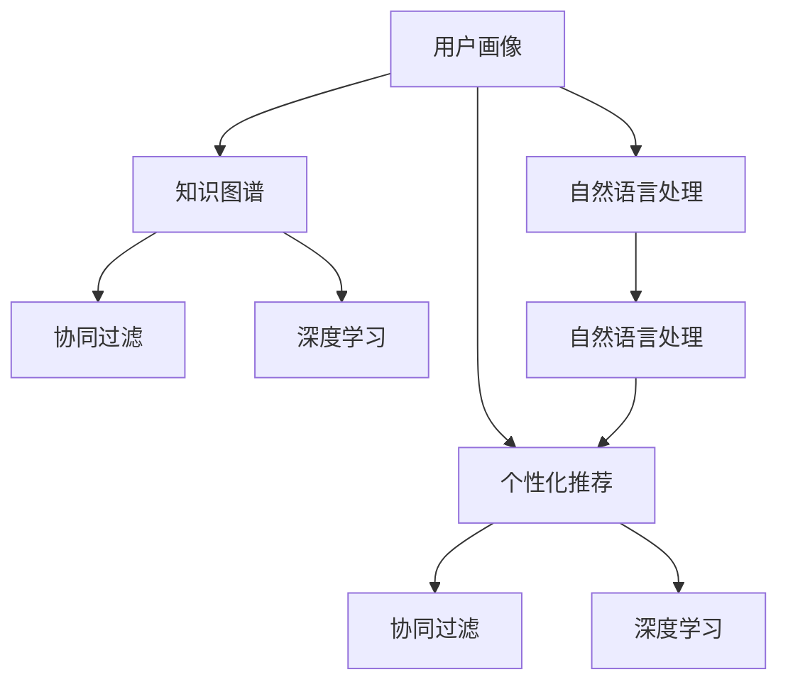

                 

# 知识付费赚钱的用户标签体系与个性化推荐策略

## 1. 背景介绍

### 1.1 问题由来
随着互联网的迅猛发展和用户需求的不断升级，知识付费逐渐成为热门模式，吸引了大量用户和投资。知识付费平台利用人工智能技术，为用户提供个性化推荐，推荐内容涉及多个领域，如教育、财经、心理、文化等。然而，如何构建高效、精确的用户标签体系，以支持个性化推荐，是知识付费平台面临的一大挑战。

### 1.2 问题核心关键点
个性化推荐的核心在于用户画像的构建与特征挖掘。用户画像通常由一系列标签（如兴趣、行为、人口统计信息等）组成，用于描述用户的多维特征，从而为推荐系统提供丰富的输入，辅助推荐算法进行精准推荐。因此，如何设计合理的用户标签体系，成为知识付费平台亟待解决的问题。

## 2. 核心概念与联系

### 2.1 核心概念概述

本节将介绍几个关键概念及其相互之间的联系：

- **用户画像**：由一组标签组成的用户多维特征描述，是推荐系统个性化推荐的基础。
- **知识图谱**：一种用于描述实体及其关系的图结构数据库，可帮助推荐系统挖掘用户兴趣与知识结构之间的联系。
- **个性化推荐**：利用用户画像和知识图谱，通过算法模型为用户推荐个性化的内容，如文章、课程、讲座等。
- **协同过滤**：一种基于用户行为和物品特征相似性的推荐算法，可处理冷启动问题和数据稀疏性问题。
- **深度学习**：一种使用多层神经网络模拟人脑神经网络结构和功能的机器学习方法，常用于个性化推荐系统的构建。
- **自然语言处理**：涉及文本预处理、特征提取、情感分析等技术，帮助推荐系统理解用户输入和内容描述，提升推荐效果。

这些概念通过以下Mermaid流程图进行展示：



## 3. 核心算法原理 & 具体操作步骤

### 3.1 算法原理概述

个性化推荐系统通过用户画像和知识图谱，构建用户兴趣模型，利用协同过滤和深度学习算法，为用户推荐其感兴趣的内容。算法流程大致如下：

1. 利用自然语言处理技术，对用户输入（如文章标题、课程简介等）进行分词、向量化等预处理，获取用户兴趣点。
2. 结合用户历史行为数据和知识图谱，生成用户画像，包括用户的兴趣、关系和知识结构。
3. 使用协同过滤算法，根据用户画像和物品特征进行相似度计算，为用户推荐个性化的物品。
4. 利用深度学习算法，训练推荐模型，提升推荐效果，处理大规模数据和复杂场景。

### 3.2 算法步骤详解

#### 3.2.1 用户画像构建

用户画像的构建是推荐系统的核心环节之一，涉及用户兴趣、行为、人口统计信息等多维特征的描述。以下以知识付费平台为例，展示用户画像的构建步骤：

**Step 1: 收集用户数据**
- 从用户注册信息中提取人口统计特征，如年龄、性别、职业等。
- 通过用户行为数据获取用户兴趣点，如浏览记录、购买记录、收藏记录等。
- 利用自然语言处理技术，从用户输入的评论、留言中提取用户情感倾向。

**Step 2: 生成用户画像**
- 将用户数据进行标准化处理，生成特征向量。
- 使用聚类算法（如K-Means、LDA等）将用户分成若干兴趣群体。
- 利用知识图谱技术，分析用户与知识节点之间的连接关系，生成用户的知识结构图谱。

#### 3.2.2 个性化推荐实现

推荐系统的核心目标是为用户推荐其感兴趣的内容。以下详细介绍推荐算法的基本流程：

**Step 1: 构建推荐矩阵**
- 将用户和物品映射为向量，构建用户-物品推荐矩阵。
- 根据协同过滤算法，计算用户画像和物品特征之间的相似度。

**Step 2: 计算推荐分数**
- 根据相似度计算推荐分数，生成推荐列表。
- 使用深度学习模型（如DNN、RNN等）对推荐分数进行优化，提升推荐效果。

**Step 3: 推荐列表展示**
- 根据推荐分数和用户行为，动态调整推荐顺序，确保推荐的个性化和相关性。
- 在推荐结果中展示热门、相关、热门作者等内容，提升用户参与度和粘性。

#### 3.2.3 推荐效果评估

推荐系统的效果评估指标包括准确率、召回率、覆盖率等，常用的评估方法包括：

- 离线评估：使用历史数据构建测试集，评估推荐系统的准确性和效果。
- 在线评估：在实际场景中监控推荐系统表现，根据用户反馈不断优化推荐策略。

## 4. 数学模型和公式 & 详细讲解 & 举例说明

### 4.1 数学模型构建

个性化推荐系统的核心数学模型为协同过滤模型和深度学习模型。以下以协同过滤模型为例，展示其数学模型构建过程。

假设用户画像为 $u$，物品画像为 $i$，用户和物品之间的相似度为 $s_{ui}$。协同过滤模型的目标是最小化预测误差，即：

$$
\min_{s_{ui}} \sum_{(u,i) \in U \times I} (y_{ui} - s_{ui})^2
$$

其中 $y_{ui}$ 为实际用户对物品的评分，$s_{ui}$ 为预测评分，$U$ 和 $I$ 分别为用户集和物品集。

### 4.2 公式推导过程

**协同过滤模型的推导**

协同过滤算法通常分为基于用户的协同过滤和基于物品的协同过滤两种。以基于用户的协同过滤为例，其公式推导如下：

**基于用户的协同过滤**

假设用户 $u$ 的评分向量为 $\mathbf{r}_u$，物品 $i$ 的评分向量为 $\mathbf{r}_i$，用户 $u$ 和物品 $i$ 的相似度为 $s_{ui}$，则协同过滤的预测评分公式为：

$$
\hat{y}_{ui} = \sum_{j \in N_u} \frac{r_j}{\sqrt{\sum_k r_k^2}} s_{uj} s_{ik}
$$

其中 $N_u$ 为与用户 $u$ 相似的其他用户集合，$r_j$ 为其他用户对物品 $k$ 的评分，$s_{uj}$ 为 $u$ 和 $j$ 的相似度，$s_{ik}$ 为 $i$ 和 $k$ 的相似度。

**深度学习模型的推导**

深度学习模型通常使用多层神经网络进行训练，以提高模型的表达能力和泛化能力。以深度学习模型为例，其公式推导如下：

**深度学习模型**

假设输入向量为 $\mathbf{x}_u$，隐藏层向量为 $\mathbf{h}_u$，输出向量为 $\mathbf{y}_u$，则深度学习模型的前向传播公式为：

$$
\mathbf{h}_u = \sigma(\mathbf{W}_1 \mathbf{x}_u + \mathbf{b}_1)
$$
$$
\mathbf{y}_u = \sigma(\mathbf{W}_2 \mathbf{h}_u + \mathbf{b}_2)
$$

其中 $\sigma$ 为激活函数，$\mathbf{W}_1$ 和 $\mathbf{W}_2$ 为权重矩阵，$\mathbf{b}_1$ 和 $\mathbf{b}_2$ 为偏置向量。

### 4.3 案例分析与讲解

**案例：在线教育平台推荐系统**

在线教育平台利用用户画像和知识图谱，为学生推荐个性化的学习内容。以下以一案例进行详细分析：

**Step 1: 用户画像构建**
- 从用户注册信息中提取人口统计特征：年龄（18-30岁）、性别（女）、职业（学生）。
- 通过学习行为数据获取用户兴趣点：浏览课程（数学）、购买课程（英语）、收藏文章（编程）。
- 利用自然语言处理技术，从用户评论中提取情感倾向：积极、中性。

**Step 2: 生成用户画像**
- 将用户数据进行标准化处理，生成特征向量。
- 使用K-Means聚类算法将用户分成若干兴趣群体。
- 利用知识图谱技术，分析用户与知识节点之间的连接关系，生成用户的知识结构图谱。

**Step 3: 个性化推荐实现**
- 将用户画像和物品画像映射为向量，构建推荐矩阵。
- 根据协同过滤算法，计算用户画像和物品特征之间的相似度。
- 使用深度学习模型对推荐分数进行优化，提升推荐效果。
- 根据推荐分数和用户行为，动态调整推荐顺序，确保推荐的个性化和相关性。

## 5. 项目实践：代码实例和详细解释说明

### 5.1 开发环境搭建

在进行推荐系统开发前，需要先准备好开发环境。以下是使用Python进行PyTorch开发的环境配置流程：

1. 安装Anaconda：从官网下载并安装Anaconda，用于创建独立的Python环境。

2. 创建并激活虚拟环境：
```bash
conda create -n recsys-env python=3.8 
conda activate recsys-env
```

3. 安装PyTorch：根据CUDA版本，从官网获取对应的安装命令。例如：
```bash
conda install pytorch torchvision torchaudio cudatoolkit=11.1 -c pytorch -c conda-forge
```

4. 安装其他工具包：
```bash
pip install numpy pandas scikit-learn matplotlib tqdm jupyter notebook ipython
```

完成上述步骤后，即可在`recsys-env`环境中开始推荐系统开发。

### 5.2 源代码详细实现

以下是使用PyTorch实现基于协同过滤的推荐系统的代码实现。

```python
import torch
import torch.nn as nn
import torch.optim as optim
from sklearn.datasets import fetch_openml
from sklearn.model_selection import train_test_split

# 导入数据
dataset = fetch_openml('thomas', as_frame=True)

# 分割数据集为训练集和测试集
train, test = train_test_split(dataset.data, test_size=0.2, random_state=42)

# 定义模型
class协同过滤模型(nn.Module):
    def __init__(self, num_users, num_items, num_factors):
        super(协同过滤模型, self).__init__()
        self.user2item = nn.Embedding(num_users, num_factors)
        self.item2user = nn.Embedding(num_items, num_factors)
        self.user2user = nn.Embedding(num_users, num_factors)
        self.item2item = nn.Embedding(num_items, num_factors)
        self.linear = nn.Linear(4*num_factors, 1)

    def forward(self, user, item):
        user2item = self.user2item(user)
        item2user = self.item2user(item)
        user2user = self.user2user(user)
        item2item = self.item2item(item)
        predict = self.linear(torch.tanh(user2item + item2user + user2user + item2item))
        return predict

# 训练模型
num_users = dataset.frame['user'].nunique()
num_items = dataset.frame['item'].nunique()
num_factors = 10
model =协同过滤模型(num_users, num_items, num_factors)
criterion = nn.MSELoss()
optimizer = optim.Adam(model.parameters(), lr=0.01)
for epoch in range(100):
    for user, item in train:
        optimizer.zero_grad()
        predict = model(user, item)
        loss = criterion(predict, train['rating'])
        loss.backward()
        optimizer.step()
    print(f'Epoch {epoch+1}, Loss: {loss.item()}')

# 测试模型
predict = model(test.user, test.item)
print(f'Test Loss: {criterion(predict, test['rating']).item()}')
```

以上代码实现了一个基于协同过滤的推荐系统，展示了模型训练和评估的基本流程。可以看到，利用PyTorch和Sklearn，代码实现相对简洁高效，便于开发者快速迭代研究。

### 5.3 代码解读与分析

以下是关键代码的实现细节：

**数据处理**

- `fetch_openml`函数用于从OpenML库中获取数据集。
- `train_test_split`函数用于将数据集划分为训练集和测试集。

**模型定义**

- `协同过滤模型`类定义了一个协同过滤模型的前向传播函数。
- 定义了四个嵌入层，分别用于用户-物品、物品-用户、用户-用户、物品-物品的嵌入映射。
- 使用线性层将四个嵌入层的结果进行融合，得到最终的预测评分。

**模型训练**

- `criterion`函数定义了均方误差损失函数。
- `Adam`优化器用于最小化损失函数。
- `for`循环用于训练模型，迭代更新参数。

**模型评估**

- 使用测试集对模型进行评估，计算均方误差损失。
- 打印出测试损失，评估模型性能。

## 6. 实际应用场景

### 6.1 在线教育平台

在线教育平台通过个性化推荐，提升用户体验和平台粘性。推荐系统可以为用户推荐其感兴趣的学习资源，包括课程、文章、视频等，提升学习效率和效果。

**应用场景**：
- 推荐数学、编程等热门课程，满足用户个性化学习需求。
- 推荐个性化习题、练习，帮助用户巩固知识。
- 推荐热门讲师、课程评价，帮助用户选择优质学习资源。

**具体实现**：
- 通过自然语言处理技术，从课程标题、简介、评价中提取用户兴趣点。
- 利用知识图谱技术，分析用户与课程之间的连接关系，生成用户画像。
- 使用协同过滤和深度学习算法，为用户推荐个性化的课程和学习资源。

### 6.2 在线阅读平台

在线阅读平台通过个性化推荐，提升用户粘性和阅读体验。推荐系统可以为用户推荐其感兴趣的书籍、文章、作者等，提升阅读效率和体验。

**应用场景**：
- 推荐小说、非小说类书籍，满足用户个性化阅读需求。
- 推荐热门文章、热门作者，帮助用户发现优质内容。
- 推荐用户感兴趣的主题、标签，丰富阅读体验。

**具体实现**：
- 通过自然语言处理技术，从书籍标题、简介、作者中提取用户兴趣点。
- 利用知识图谱技术，分析用户与书籍之间的连接关系，生成用户画像。
- 使用协同过滤和深度学习算法，为用户推荐个性化的书籍和文章。

### 6.3 金融平台

金融平台通过个性化推荐，提升用户交易体验和平台粘性。推荐系统可以为用户推荐其感兴趣的投资产品、金融资讯等，提升交易效率和效果。

**应用场景**：
- 推荐股票、基金、债券等金融产品，满足用户个性化投资需求。
- 推荐金融市场分析报告、财经新闻，帮助用户了解市场动态。
- 推荐热门投资策略、专家意见，帮助用户制定投资计划。

**具体实现**：
- 通过自然语言处理技术，从投资产品、市场分析报告、财经新闻中提取用户兴趣点。
- 利用知识图谱技术，分析用户与金融产品之间的连接关系，生成用户画像。
- 使用协同过滤和深度学习算法，为用户推荐个性化的投资产品和金融资讯。

### 6.4 未来应用展望

随着推荐系统的发展，未来的应用场景将会更加广泛，涉及更多的行业和领域。

**智能家居平台**

智能家居平台通过个性化推荐，提升用户生活体验和平台粘性。推荐系统可以为用户推荐其感兴趣的智能设备、家居管理方案等，提升生活质量和便捷性。

**具体实现**：
- 通过自然语言处理技术，从智能设备、家居管理方案中提取用户兴趣点。
- 利用知识图谱技术，分析用户与智能设备之间的连接关系，生成用户画像。
- 使用协同过滤和深度学习算法，为用户推荐个性化的智能设备和家居管理方案。

**智能交通平台**

智能交通平台通过个性化推荐，提升用户出行体验和平台粘性。推荐系统可以为用户推荐其感兴趣的交通信息、导航方案等，提升出行效率和便捷性。

**具体实现**：
- 通过自然语言处理技术，从交通信息、导航方案中提取用户兴趣点。
- 利用知识图谱技术，分析用户与交通信息之间的连接关系，生成用户画像。
- 使用协同过滤和深度学习算法，为用户推荐个性化的交通信息和导航方案。

## 7. 工具和资源推荐

### 7.1 学习资源推荐

为了帮助开发者系统掌握推荐系统的理论和实践技能，这里推荐一些优质的学习资源：

1. 《推荐系统原理与算法》系列博文：由推荐系统专家撰写，全面介绍推荐系统的基本原理、算法和优化方法。

2. 《深度学习与推荐系统》课程：斯坦福大学开设的深度学习与推荐系统课程，涵盖推荐系统的前沿技术和实践技巧。

3. 《推荐系统：实用指南》书籍：推荐系统领域的经典书籍，系统讲解推荐系统的各种算法和应用场景。

4. TensorFlow官方文档：TensorFlow推荐的深度学习框架，提供了丰富的推荐系统样例代码，是学习和实践的必备资料。

5. KDD Cup竞赛数据集：全球最大的数据挖掘竞赛平台，提供大量推荐系统数据集，用于实践和研究。

通过对这些资源的学习实践，相信你一定能够快速掌握推荐系统的精髓，并用于解决实际的推荐问题。

### 7.2 开发工具推荐

高效的开发离不开优秀的工具支持。以下是几款用于推荐系统开发的常用工具：

1. TensorFlow：由Google主导开发的深度学习框架，生产部署方便，适合大规模工程应用。

2. PyTorch：基于Python的开源深度学习框架，灵活动态的计算图，适合快速迭代研究。

3. Jupyter Notebook：交互式的数据分析和代码编写环境，便于快速迭代实验。

4. TensorBoard：TensorFlow配套的可视化工具，可实时监测模型训练状态，并提供丰富的图表呈现方式。

5. Weights & Biases：模型训练的实验跟踪工具，可以记录和可视化模型训练过程中的各项指标。

合理利用这些工具，可以显著提升推荐系统的开发效率，加快创新迭代的步伐。

### 7.3 相关论文推荐

推荐系统的发展离不开学界的持续研究。以下是几篇奠基性的相关论文，推荐阅读：

1. BellKor：Cantor：A collaborative filtering approach for the netflix prize：提出协同过滤算法，用于解决大规模推荐问题。

2. BPR: Bayesian personalised ranking for collaborative filtering：提出贝叶斯协同过滤算法，提升推荐系统效果。

3. Feature-RNN：A deep learning approach to collaborative filtering：提出深度神经网络用于协同过滤，提升推荐系统效果。

4. Matrix factorization techniques for recommendation systems：系统讲解矩阵分解方法，用于协同过滤和推荐系统。

5. A Survey on Deep Learning for Recommendation Systems：全面综述深度学习在推荐系统中的应用，提供丰富的实践经验。

这些论文代表了大语言模型微调技术的发展脉络。通过学习这些前沿成果，可以帮助研究者把握学科前进方向，激发更多的创新灵感。

## 8. 总结：未来发展趋势与挑战

### 8.1 研究成果总结

本节对推荐系统的核心概念和实际应用进行了全面系统介绍。首先阐述了推荐系统的工作原理和应用场景，明确了推荐系统在提升用户体验和平台粘性方面的重要价值。其次，从原理到实践，详细讲解了推荐系统的核心算法和实现细节，给出了推荐系统开发的完整代码实例。同时，本文还广泛探讨了推荐系统在在线教育、在线阅读、金融平台等不同领域的应用前景，展示了推荐系统技术的广阔前景。

### 8.2 未来发展趋势

展望未来，推荐系统的发展将呈现以下几个趋势：

1. 深度学习技术的深度应用。随着深度学习技术的不断发展，未来的推荐系统将更加注重模型的表达能力和泛化能力，使用更复杂的神经网络结构，提升推荐效果。

2. 多模态信息的融合。未来的推荐系统将更好地融合文本、图像、音频等多模态信息，构建更全面的用户画像，提升推荐系统的准确性和多样性。

3. 个性化推荐技术的创新。未来的推荐系统将探索更多个性化推荐技术，如基于用户行为序列的序列模型、基于图神经网络的推荐模型等，提升推荐系统的精准度和适应性。

4. 推荐系统的实时性要求提升。随着推荐系统的应用场景日益丰富，对推荐系统的实时性要求也将越来越高，需要利用流计算、边缘计算等技术，提升推荐系统的响应速度。

5. 推荐系统的伦理和社会责任。未来的推荐系统将更加注重伦理和社会责任，避免推荐系统的有害效应，如信息茧房、信息过滤等，保障用户的隐私权和公平性。

### 8.3 面临的挑战

尽管推荐系统已经取得了不小的成就，但在迈向更加智能化、普适化应用的过程中，仍面临诸多挑战：

1. 数据稀疏性和冷启动问题。对于新用户或新物品，推荐系统难以有效生成用户画像和物品画像，推荐效果往往较差。

2. 数据隐私和安全问题。推荐系统需要处理大量的用户数据，如何保障数据隐私和安全，避免数据泄露和滥用，是重要挑战。

3. 模型的可解释性和透明性。推荐系统通常被视为"黑盒"系统，难以解释其内部工作机制和决策逻辑，缺乏透明性。

4. 推荐系统的鲁棒性和稳定性。推荐系统在面对数据噪声、异常值等情况时，容易产生不稳定的推荐结果。

5. 算法的公平性和公正性。推荐系统在推荐过程中，容易产生偏见和歧视，如何保障公平性和公正性，是重要挑战。

### 8.4 研究展望

面对推荐系统面临的挑战，未来的研究需要在以下几个方面寻求新的突破：

1. 探索新的推荐算法。开发更高效、更精准的推荐算法，如基于图神经网络的推荐模型、基于序列的推荐模型等，提升推荐系统的准确性和多样性。

2. 引入多模态信息。探索更多模态信息与推荐系统的融合方式，如文本-图像融合、文本-语音融合等，提升推荐系统的全面性和适应性。

3. 注重推荐系统的公平性和公正性。研究如何避免推荐系统中的偏见和歧视，保障公平性和公正性。

4. 注重推荐系统的伦理和社会责任。研究如何利用推荐系统提升社会公益，保障用户隐私权和公平性。

这些研究方向将推动推荐系统技术的进一步发展，为构建高效、公平、可解释的推荐系统提供新的思路和方法。

## 9. 附录：常见问题与解答

**Q1：推荐系统如何处理数据稀疏性问题？**

A: 推荐系统通常面临数据稀疏性问题，即用户-物品矩阵中大量位置为0。常用的处理方法包括：

- 使用协同过滤算法，通过用户-用户或物品-物品相似度计算推荐分数。
- 使用矩阵分解方法，将用户-物品矩阵分解为用户特征矩阵和物品特征矩阵，生成推荐分数。
- 引入深度学习模型，使用神经网络对用户画像和物品画像进行建模，提升推荐效果。

这些方法可以降低数据稀疏性带来的影响，提升推荐系统的准确性和多样性。

**Q2：推荐系统如何处理冷启动问题？**

A: 冷启动问题指对于新用户或新物品，推荐系统无法有效生成用户画像和物品画像。常用的处理方法包括：

- 使用基于内容的推荐方法，根据物品的特征生成推荐列表。
- 利用知识图谱技术，分析用户与物品之间的连接关系，生成用户画像。
- 引入深度学习模型，对用户画像和物品画像进行建模，提升推荐效果。

这些方法可以解决冷启动问题，快速为用户推荐个性化的内容。

**Q3：推荐系统如何处理数据隐私和安全问题？**

A: 推荐系统需要处理大量的用户数据，如何保障数据隐私和安全，避免数据泄露和滥用，是重要挑战。常用的处理方法包括：

- 使用差分隐私技术，对用户数据进行匿名化处理，保护用户隐私。
- 使用联邦学习技术，在本地设备上训练模型，减少数据传输和存储风险。
- 引入区块链技术，对推荐系统中的数据进行加密和透明化处理，保障数据安全。

这些方法可以降低数据隐私和安全风险，保障用户隐私权。

**Q4：推荐系统如何提高模型的可解释性和透明性？**

A: 推荐系统通常被视为"黑盒"系统，难以解释其内部工作机制和决策逻辑，缺乏透明性。常用的处理方法包括：

- 使用可解释性技术，如LIME、SHAP等，对推荐系统进行解释和可视化。
- 引入规则引擎，对推荐系统进行规则化处理，提升可解释性。
- 使用透明度高的模型，如决策树、线性模型等，提升可解释性。

这些方法可以提高推荐系统的可解释性和透明性，便于用户理解和调试。

**Q5：推荐系统如何提升推荐系统的鲁棒性和稳定性？**

A: 推荐系统在面对数据噪声、异常值等情况时，容易产生不稳定的推荐结果。常用的处理方法包括：

- 引入对抗样本，训练鲁棒性更高的模型。
- 使用基于图神经网络的推荐模型，提升模型鲁棒性。
- 引入多重推荐机制，降低单一推荐结果的误差。

这些方法可以提升推荐系统的鲁棒性和稳定性，提高推荐效果的可靠性。

**Q6：推荐系统如何实现公平性和公正性？**

A: 推荐系统在推荐过程中，容易产生偏见和歧视，如何保障公平性和公正性，是重要挑战。常用的处理方法包括：

- 引入公平性指标，对推荐系统进行评估和优化。
- 使用公平性算法，如对抗性公平性算法、分布式公平性算法等，提升推荐系统的公平性。
- 引入多样性约束，保证推荐结果的多样性和均衡性。

这些方法可以保障推荐系统的公平性和公正性，提升推荐效果的用户满意度。

---

作者：禅与计算机程序设计艺术 / Zen and the Art of Computer Programming

