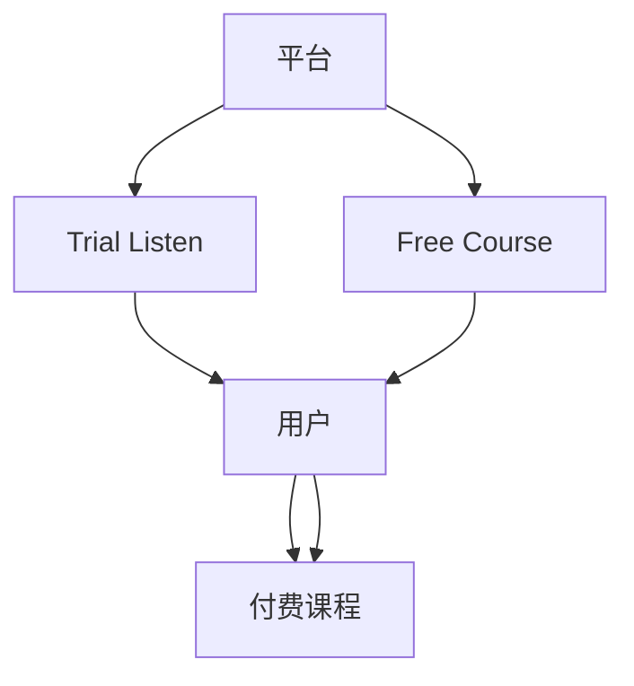

                 

# 知识付费赚钱的用户课程试听与免费课程策略

> 关键词：知识付费, 用户课程, 试听策略, 免费课程, 付费转化率, 用户留存率

## 1. 背景介绍

随着互联网技术的迅猛发展和人们知识需求的日益增长，知识付费逐渐成为学习的重要趋势。在线教育平台通过向用户提供优质的课程内容，满足了人们对知识获取的需求，实现了商业模式创新。然而，如何在吸引用户的同时实现盈利，是知识付费平台面临的重要挑战。

## 2. 核心概念与联系

### 2.1 核心概念概述

在知识付费领域，用户试听策略和免费课程成为提升用户付费转化率和留存率的重要手段。通过合理的试听和免费课程安排，平台可以更好地吸引用户、提升用户体验，最终实现商业价值。

- **用户试听（Trial Listen）**：用户在选择付费课程前，可以先免费试听部分内容，以便评估课程质量和自身兴趣，从而决定是否购买。
- **免费课程（Free Course）**：提供免费课程供用户学习，既能满足用户基础学习需求，又能通过部分免费内容引导用户深入学习并转化为付费用户。

### 2.2 核心概念原理和架构的 Mermaid 流程图



此流程图展示了平台、用户、试听、免费课程和付费课程之间的关系。平台通过提供试听和免费课程，吸引用户访问平台，并最终通过付费课程实现收入。

## 3. 核心算法原理 & 具体操作步骤

### 3.1 算法原理概述

用户试听和免费课程的策略设计，实质上是对用户行为分析及推荐算法的应用。通过分析用户行为数据，平台可以制定针对性的试听和免费课程推荐策略，提升用户付费转化率和留存率。

核心算法包括：

1. **用户行为分析**：分析用户在平台上的行为数据，如浏览、试听、购买行为等。
2. **推荐算法**：基于用户行为数据，推荐适合的试听和免费课程内容。
3. **付费转化率提升**：通过优化课程推荐，引导用户从免费向付费过渡。

### 3.2 算法步骤详解

#### 3.2.1 数据收集与处理

收集用户在平台上的行为数据，包括：

- **浏览记录**：用户浏览课程列表、课程页面等行为。
- **试听记录**：用户试听课程时长、试听次数等。
- **购买记录**：用户付费购买课程的行为。

对数据进行预处理，包括数据清洗、特征提取等。

#### 3.2.2 用户行为建模

使用机器学习模型对用户行为进行建模，例如：

- **协同过滤推荐**：根据用户相似度，推荐其他用户已试听或购买的课程。
- **内容相关性推荐**：基于课程内容相似度，推荐相关课程。
- **混合推荐**：结合协同过滤和内容相关性，提升推荐效果。

#### 3.2.3 试听与免费课程推荐

1. **试听课程推荐**：根据用户行为数据，推荐用户可能感兴趣的免费试听课程。
2. **免费课程推荐**：根据用户已试听课程及行为数据，推荐适合的免费课程，提升用户继续学习兴趣。

#### 3.2.4 付费转化率优化

1. **推荐付费课程**：在用户试听和免费课程之后，推荐适合的付费课程，实现从免费到付费的转化。
2. **个性化定价**：根据用户偏好及课程价值，动态调整课程价格，提升用户付费意愿。

### 3.3 算法优缺点

#### 3.3.1 优点

1. **提升用户粘性**：通过试听和免费课程，满足用户基础学习需求，提升用户留存率。
2. **提高转化率**：推荐合适课程，引导用户从免费到付费，提升付费转化率。
3. **数据驱动**：基于用户行为数据进行推荐，提升推荐准确度。

#### 3.3.2 缺点

1. **数据隐私问题**：需要收集大量用户行为数据，涉及用户隐私保护问题。
2. **算法复杂度**：推荐算法涉及协同过滤、内容相关性等多种技术，算法实现复杂。
3. **用户个性化差异**：不同用户偏好差异大，单一推荐策略可能无法覆盖所有用户需求。

### 3.4 算法应用领域

用户试听与免费课程策略在在线教育、知识付费、技能培训等领域广泛应用。例如：

- **在线教育平台**：如Coursera、Udemy、网易云课堂等，通过试听和免费课程，吸引用户注册并购买付费课程。
- **知识付费平台**：如得到、喜马拉雅、分答等，通过试听和免费课程，提升用户付费订阅率。
- **技能培训平台**：如网易云课堂、慕课网、腾讯课堂等，通过提供免费课程，吸引用户学习并转化为付费学员。

## 4. 数学模型和公式 & 详细讲解 & 举例说明

### 4.1 数学模型构建

假设用户总数为 $N$，课程总数为 $M$。设用户 $u$ 对课程 $i$ 的兴趣程度为 $r_{ui}$，用户 $u$ 的付费转化率为 $c_u$。根据用户行为数据，构建以下数学模型：

1. **协同过滤推荐模型**：
   $$
   r_{ui} = \sum_{v \in \mathcal{N}_u} \frac{r_{vi}}{1 + d(v, i)}
   $$
   其中 $\mathcal{N}_u$ 为与用户 $u$ 相似的其他用户集合，$d(v, i)$ 为相似度函数。

2. **内容相关性推荐模型**：
   $$
   r_{ui} = r_{ui}^{(1)} + \lambda r_{ui}^{(2)}
   $$
   其中 $r_{ui}^{(1)}$ 为课程与用户兴趣点相关性评分，$r_{ui}^{(2)}$ 为课程内容相似性评分。

### 4.2 公式推导过程

1. **协同过滤推荐模型推导**：
   $$
   r_{ui} = \sum_{v \in \mathcal{N}_u} \frac{r_{vi}}{1 + d(v, i)}
   $$
   上式中，$d(v, i)$ 可以使用余弦相似度、欧几里得距离等多种方法计算。

2. **内容相关性推荐模型推导**：
   $$
   r_{ui} = r_{ui}^{(1)} + \lambda r_{ui}^{(2)}
   $$
   其中 $r_{ui}^{(1)}$ 可以使用朴素贝叶斯、TF-IDF等方法计算，$r_{ui}^{(2)}$ 可以使用课程内容相似度方法计算。

### 4.3 案例分析与讲解

以Coursera平台为例，分析试听和免费课程策略的应用效果：

1. **试听课程推荐**：
   根据用户历史浏览、试听数据，推荐适合的试听课程。例如，用户 $u$ 浏览了计算机科学课程列表，系统推荐了相应课程的试听。

2. **免费课程推荐**：
   根据用户已试听课程，推荐适合的免费课程。例如，用户 $u$ 试听了机器学习基础课程，系统推荐了进阶的机器学习应用课程。

3. **付费课程推荐**：
   在用户完成试听和免费课程后，推荐适合的付费课程。例如，用户 $u$ 学习了机器学习基础和应用课程，系统推荐了深度学习算法课程。

## 5. 项目实践：代码实例和详细解释说明

### 5.1 开发环境搭建

在Python环境中安装必要的第三方库，如Scikit-learn、TensorFlow等。搭建开发环境的步骤如下：

1. 安装Python及环境管理工具，如Anaconda、Miniconda等。
2. 创建虚拟环境，安装Python基础库和第三方库。
3. 安装数据处理工具，如Pandas、NumPy等。
4. 安装机器学习库，如Scikit-learn、TensorFlow等。

### 5.2 源代码详细实现

以下是一个简单的Python代码示例，实现协同过滤推荐模型：

```python
import numpy as np
from sklearn.neighbors import NearestNeighbors

def similarity_matrix(X):
    distances = np.linalg.norm(X - X[:, np.newaxis], axis=2)
    return 1 / (1 + distances)

def user_similarity(u1, u2, X):
    return similarity_matrix(X[u1]) @ similarity_matrix(X[u2])[:, np.newaxis]

def predict_rui(u, i, X, k=10):
    nearest_users = NearestNeighbors(n_neighbors=k).fit(X)  # 查找与用户u最相似的k个用户
    distances, indices = nearest_users.kneighbors(X[u])
    return np.mean(user_similarity(indices, u, X), axis=0)

# 示例数据
X = np.array([[1, 2, 3], [4, 5, 6], [7, 8, 9], [10, 11, 12]])
user = 0

# 计算用户对课程的兴趣评分
r = np.zeros((X.shape[0], X.shape[0]))
for i in range(X.shape[0]):
    r[i, user] = predict_rui(i, user, X)

print(r[user])
```

### 5.3 代码解读与分析

1. **数据准备**：
   - `X` 为用户对课程的评分矩阵，每个用户有 $M$ 个课程评分。
   - `user` 为用户 $u$ 的编号。

2. **计算用户相似度**：
   - `similarity_matrix` 函数计算用户间相似度矩阵。
   - `user_similarity` 函数计算用户 $u$ 与其他用户 $v$ 的相似度。

3. **预测用户兴趣评分**：
   - `predict_rui` 函数通过查找与用户 $u$ 最相似的 $k$ 个用户，计算其兴趣评分，并取平均值作为预测结果。

4. **示例运行**：
   - `r[user]` 输出用户 $u$ 对所有课程的兴趣评分。

## 6. 实际应用场景

### 6.1 在线教育平台

在线教育平台如Coursera、Udemy、网易云课堂等，通过提供用户试听和免费课程，吸引用户注册并购买付费课程。例如：

1. **Coursera平台**：
   - 用户浏览课程列表后，平台推荐适合的试听课程。
   - 用户完成试听课程后，平台推荐相关的免费课程。
   - 用户完成免费课程后，平台推荐适合的付费课程。

2. **Udemy平台**：
   - 用户浏览课程后，平台推荐试听课程。
   - 用户完成试听后，平台推荐免费课程。
   - 用户完成免费课程后，平台推荐付费课程。

### 6.2 知识付费平台

知识付费平台如得到、喜马拉雅、分答等，通过试听和免费课程，提升用户付费订阅率。例如：

1. **得到平台**：
   - 用户浏览课程后，平台推荐试听内容。
   - 用户完成试听后，平台推荐免费课程。
   - 用户完成免费课程后，平台推荐付费订阅。

2. **喜马拉雅平台**：
   - 用户浏览课程后，平台推荐试听内容。
   - 用户完成试听后，平台推荐免费课程。
   - 用户完成免费课程后，平台推荐付费订阅。

### 6.3 技能培训平台

技能培训平台如网易云课堂、慕课网、腾讯课堂等，通过提供免费课程，吸引用户学习并转化为付费学员。例如：

1. **网易云课堂平台**：
   - 用户浏览课程后，平台推荐试听内容。
   - 用户完成试听后，平台推荐免费课程。
   - 用户完成免费课程后，平台推荐付费课程。

2. **慕课网平台**：
   - 用户浏览课程后，平台推荐试听内容。
   - 用户完成试听后，平台推荐免费课程。
   - 用户完成免费课程后，平台推荐付费课程。

## 7. 工具和资源推荐

### 7.1 学习资源推荐

1. **《机器学习》一书**：由Tom Mitchell著，介绍了机器学习的基本概念、算法和应用。
2. **Coursera平台**：提供丰富的在线课程，涵盖数据科学、机器学习、深度学习等多个领域。
3. **Kaggle平台**：提供大量数据集和比赛，用于学习和实践数据科学、机器学习等。

### 7.2 开发工具推荐

1. **Anaconda**：免费的环境管理工具，支持Python虚拟环境的创建和管理。
2. **PyTorch**：灵活的深度学习框架，支持GPU加速。
3. **TensorFlow**：广泛使用的深度学习框架，支持分布式训练和模型部署。

### 7.3 相关论文推荐

1. **《Recommender Systems Handbook》**：由Kowalski、Holzinger和Steiner著，全面介绍了推荐系统的发展历程和前沿技术。
2. **《Information Retrieval》**：由Christopher Manning等著，介绍了信息检索和推荐系统的基础原理。
3. **《Practical Recommender Systems》**：由Steve Smith等著，提供了推荐系统的实践指南和案例分析。

## 8. 总结：未来发展趋势与挑战

### 8.1 研究成果总结

用户试听与免费课程策略在知识付费领域已取得显著效果，提升了用户付费转化率和留存率。平台通过推荐适合的课程，满足用户基础学习需求，引导用户从免费向付费过渡，实现商业价值。

### 8.2 未来发展趋势

1. **个性化推荐**：利用更先进的推荐算法，实现更精准的用户个性化推荐。
2. **多渠道融合**：结合社交网络、移动应用等多种渠道，提升用户覆盖率。
3. **互动增强**：通过互动问答、社区讨论等方式，提升用户参与度和满意度。
4. **实时反馈优化**：根据用户实时反馈数据，不断优化课程推荐算法。

### 8.3 面临的挑战

1. **用户多样性**：不同用户需求和兴趣差异大，单一策略难以满足所有用户需求。
2. **数据隐私**：用户行为数据涉及隐私保护，需严格遵守法律法规。
3. **算法复杂性**：推荐算法复杂度高，需要高效计算和存储。

### 8.4 研究展望

1. **深度学习应用**：利用深度学习提升推荐算法效果。
2. **多模态融合**：结合用户行为数据和社交网络数据，提升推荐效果。
3. **跨平台协同**：跨平台协同推荐，提升用户覆盖率。

## 9. 附录：常见问题与解答

**Q1：如何进行用户行为数据分析？**

A: 通过收集和处理用户行为数据，建立用户行为特征向量，利用机器学习模型进行数据分析。例如，收集用户浏览、试听、购买行为，建立用户行为特征向量，利用协同过滤推荐模型进行分析。

**Q2：如何优化付费转化率？**

A: 通过个性化推荐和动态定价，提升用户付费意愿。例如，根据用户兴趣和行为数据，推荐适合的付费课程；根据用户价值和课程价值，动态调整课程价格。

**Q3：如何保护用户隐私？**

A: 对用户数据进行匿名化处理，严格遵守数据隐私法律法规。例如，对用户行为数据进行脱敏处理，不泄露用户身份信息。

**Q4：如何提升用户留存率？**

A: 通过提供多样化的课程内容和优质的用户体验，提升用户留存率。例如，提供丰富的课程选择，优化课程内容和呈现方式，提升用户体验。

**Q5：如何优化推荐算法？**

A: 通过持续优化算法模型和特征工程，提升推荐效果。例如，利用深度学习模型提升推荐效果；结合用户社交网络数据，提升推荐准确度。

---

作者：禅与计算机程序设计艺术 / Zen and the Art of Computer Programming

