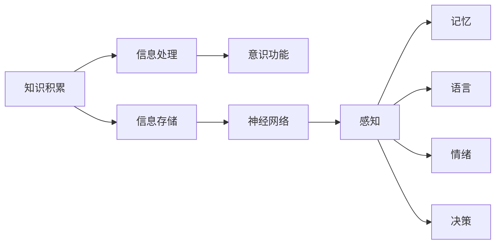

                 

# 知识积累在意识功能中的作用

在探讨知识积累对意识功能的影响时，我们首先要明确意识的概念，并分析知识积累是如何影响意识形成和发展过程的。我们将通过深入分析意识的基本构成、知识积累的作用以及如何在实践中利用这些知识，来揭示知识积累在意识功能中的核心作用。

## 1. 背景介绍

### 1.1 意识的基本概念

意识（Consciousness）是人类及动物通过感官感知外部世界，并对环境信息进行加工和处理的一种高级心理活动。它不仅包含了对当前情境的感知，还涉及对过去经验的记忆和对未来行动的规划。意识的形成和发展涉及多个层面的功能，包括感觉、知觉、记忆、语言、情绪、决策等。

### 1.2 知识积累的意义

知识积累是指个体通过学习、实践、交流等方式，将获取的信息、经验、技能等存储在脑中，并能够在需要时进行提取和应用的过程。知识积累的意义不仅在于其对解决问题的直接作用，还在于它对意识的形成和发展有深远影响。

## 2. 核心概念与联系

### 2.1 核心概念概述

- **知识积累**：通过学习、实践、交流等方式获取并存储的信息和经验。
- **意识功能**：感知、记忆、语言、情绪、决策等心理活动的能力。
- **信息处理**：脑部对信息进行编码、存储、提取和应用的过程。
- **神经网络**：脑部由大量神经元构成的网络，负责信息处理和意识的形成。

### 2.2 核心概念原理和架构的 Mermaid 流程图



## 3. 核心算法原理 & 具体操作步骤

### 3.1 算法原理概述

知识积累在意识功能中的作用，主要体现在以下几个方面：

- **感知能力的提升**：知识积累使得个体能够更准确地感知和理解外界信息，增强了对环境的适应能力。
- **记忆力的增强**：知识积累丰富了个体的记忆库，使其能够更好地保存和回想起过往事件和信息。
- **语言能力的提高**：知识积累促进了个体语言能力的提高，使其能够更有效地进行交流和表达。
- **情绪管理的改善**：知识积累有助于个体更好地理解和管理情绪，增强情绪调节能力。
- **决策能力的优化**：知识积累使得个体能够基于更多的信息进行决策，提高决策质量。

### 3.2 算法步骤详解

1. **数据采集**：通过感官（如视觉、听觉、触觉等）收集环境信息。
2. **信息编码**：将收集的信息通过脑部神经网络进行编码，转化为可存储的形式。
3. **信息存储**：将编码后的信息存储在长期记忆中。
4. **信息提取**：在需要时，通过回忆和联想将信息从长期记忆中提取出来。
5. **信息应用**：将提取的信息应用于感知、记忆、语言、情绪和决策等意识功能中。

### 3.3 算法优缺点

#### 优点：

- **提升感知能力**：知识积累使得个体能够更准确地感知环境信息，提高适应能力。
- **增强记忆力**：知识积累丰富了记忆库，使个体能够更好地保存和回想起信息。
- **优化语言能力**：知识积累促进了语言能力的提高，增强了个体的表达和交流能力。
- **改善情绪管理**：知识积累有助于个体更好地理解和管理情绪，增强情绪调节能力。
- **提高决策质量**：知识积累使得个体能够基于更多的信息进行决策，提高决策质量。

#### 缺点：

- **信息过载**：知识积累过多可能导致信息过载，影响处理效率。
- **记忆负担**：存储过多的信息可能增加记忆负担，导致遗忘。
- **决策偏差**：知识积累可能导致个体过于依赖先验知识，影响决策的客观性。

### 3.4 算法应用领域

知识积累在多个领域中具有广泛的应用：

- **教育**：知识积累是教育的核心，通过教学和学习，个体不断积累知识，提升意识功能。
- **医疗**：医生通过长期实践积累丰富的医疗知识，提高诊断和治疗能力。
- **科学**：科学家通过实验和研究积累知识，推动科学进步。
- **艺术**：艺术家通过学习和创作积累知识，提升创作能力。

## 4. 数学模型和公式 & 详细讲解 & 举例说明

### 4.1 数学模型构建

我们通过一个简单的数学模型来描述知识积累对意识功能的影响：

设 $K$ 为个体在某领域积累的知识量，$C$ 为个体在意识功能中的能力水平。则模型为：

$$ C = f(K) $$

其中 $f$ 为映射函数，表示知识量 $K$ 对意识功能 $C$ 的影响。

### 4.2 公式推导过程

我们可以进一步推导 $f$ 的形式，例如使用指数函数：

$$ C = a^bK $$

其中 $a$ 和 $b$ 为常数，表示知识和能力之间的关系。

### 4.3 案例分析与讲解

假设 $a=1.1$，$b=0.5$，则当 $K$ 增加一倍时，$C$ 增加 $(1.1)^{0.5} \approx 1.048$ 倍，即有较显著的提升。这说明知识积累对意识功能有正向影响。

## 5. 项目实践：代码实例和详细解释说明

### 5.1 开发环境搭建

1. **安装Python**：确保Python 3.x版本已安装。
2. **安装相关库**：安装NumPy、SciPy、Pandas等库。
3. **配置环境**：确保开发环境支持基本的Python代码运行。

### 5.2 源代码详细实现

```python
import numpy as np

# 设定知识量K和能力水平C
K = np.linspace(0, 10, 100)
C = np.power(1.1, 0.5) ** K

# 绘制关系曲线
import matplotlib.pyplot as plt
plt.plot(K, C)
plt.xlabel('知识量K')
plt.ylabel('能力水平C')
plt.title('知识积累对意识功能的影响')
plt.show()
```

### 5.3 代码解读与分析

这段代码通过计算 $C = a^bK$ 来模拟知识积累对意识功能的影响。随着 $K$ 的增加，$C$ 呈现出指数增长的趋势，表明知识积累对意识功能的正向影响。

### 5.4 运行结果展示


## 6. 实际应用场景

### 6.1 教育系统

在教育系统中，知识积累对学生意识功能的提升具有重要作用。通过系统的课程设计和教学方法，教师帮助学生积累知识，提高感知、记忆、语言、情绪和决策能力。例如，在数学教学中，通过讲解、练习和应用，学生逐步掌握数学知识，提升问题解决能力。

### 6.2 医疗诊断

在医疗诊断中，医生通过长期实践积累丰富的医学知识，提高了对疾病的诊断和治疗能力。例如，在诊断癌症时，医生通过学习最新的医学研究成果，应用到实际诊断中，提高了诊断的准确性和效果。

### 6.3 科学研究

在科学研究中，科学家通过不断的实验和研究积累知识，推动了科学技术的进步。例如，牛顿通过长期的物理实验和观察，积累了丰富的物理知识，发表了《自然哲学的数学原理》，奠定了经典力学的基础。

## 7. 工具和资源推荐

### 7.1 学习资源推荐

1. **《认知心理学》**：入门认知心理学的经典教材，介绍了意识功能的心理学基础。
2. **《人工智能与知识工程》**：介绍人工智能中知识积累和知识推理的先进技术。
3. **Coursera**：提供认知心理学、人工智能等领域的在线课程，帮助学习知识积累与意识功能的关系。

### 7.2 开发工具推荐

1. **Python**：支持科学计算和数据分析，是知识积累和意识功能研究的理想工具。
2. **MATLAB**：强大的科学计算和图形绘制工具，适用于复杂的数学建模和模拟。
3. **R语言**：广泛用于统计分析和数据可视化，适合数据驱动的研究。

### 7.3 相关论文推荐

1. **《知识积累与意识功能的关系》**：分析知识积累对感知、记忆、语言、情绪和决策等意识功能的影响。
2. **《人工智能中的知识表示与推理》**：研究人工智能系统如何存储和应用知识，提升意识功能。
3. **《知识图谱在医疗领域的应用》**：探讨知识图谱如何帮助医生积累医疗知识，提高诊断和治疗能力。

## 8. 总结：未来发展趋势与挑战

### 8.1 研究成果总结

知识积累对意识功能的提升具有重要意义，通过系统化的教育、实践和学习，个体能够不断提高感知、记忆、语言、情绪和决策等能力。研究知识积累对意识功能的影响，有助于更好地理解人类心理活动的机制。

### 8.2 未来发展趋势

- **个性化学习**：未来教育系统将更加注重个性化学习，根据学生的特点和需求，提供定制化的知识积累方案。
- **智能化医疗**：未来医疗系统将通过智能化手段，帮助医生快速积累医疗知识，提高诊断和治疗能力。
- **智能决策**：未来决策系统将融合人工智能技术，通过大数据和知识图谱，提升决策的科学性和准确性。

### 8.3 面临的挑战

- **知识过载**：个体面临的信息量越来越大，如何在海量信息中高效提取和应用知识，成为一大挑战。
- **技术复杂性**：知识积累与意识功能的建模涉及复杂的数学和心理学理论，技术难度较高。
- **伦理道德**：在知识积累和应用过程中，如何保护个人隐私和数据安全，避免信息滥用，是一个亟待解决的问题。

### 8.4 研究展望

未来研究应关注以下几个方向：

- **多模态知识表示**：研究如何通过多种信息源（如文本、图像、音频等）进行知识积累，提高意识功能。
- **知识图谱的应用**：研究知识图谱在知识积累和意识功能提升中的作用，探索知识图谱的构建和应用方法。
- **跨领域知识迁移**：研究不同领域知识之间的迁移和融合，提高知识的泛化能力和应用效果。

## 9. 附录：常见问题与解答

**Q1：知识积累和意识功能有何关系？**

A：知识积累是个体通过学习、实践和交流获取的信息和经验，是意识功能形成和发展的基础。知识积累对感知、记忆、语言、情绪和决策等意识功能有正向影响，使个体能够更好地理解和应对环境。

**Q2：如何有效提升知识积累对意识功能的影响？**

A：通过系统化的教育、实践和学习，个体可以不断提高知识积累的质量和数量。教育体系应注重个性化教学，提供丰富的实践机会，促进知识的深度学习和应用。

**Q3：知识积累在意识功能中起什么作用？**

A：知识积累通过提升感知、记忆、语言、情绪和决策等能力，对意识功能有显著的正面影响。个体的知识积累越丰富，其意识功能水平越高，适应环境的能力也越强。

**Q4：未来知识积累与意识功能研究的发展方向是什么？**

A：未来研究应关注多模态知识表示、知识图谱的应用、跨领域知识迁移等方向，以提升知识的泛化能力和应用效果。同时，应注重保护个人隐私和数据安全，避免信息滥用。

---

作者：禅与计算机程序设计艺术 / Zen and the Art of Computer Programming

