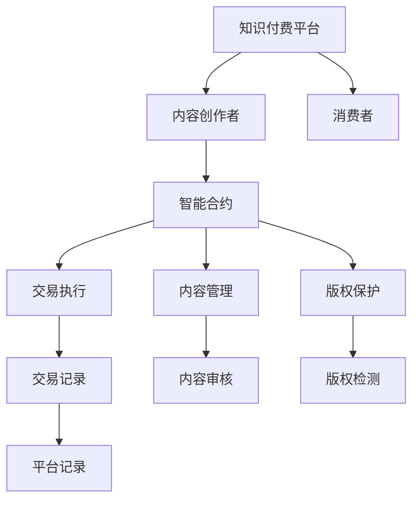

                 

## 1. 背景介绍

### 1.1 问题由来

在知识经济时代，知识的价值愈发凸显。知识付费成为连接知识创造者和需求者、实现知识变现的重要方式。然而，知识付费平台普遍面临平台信任问题、付费模型单一、版权保护困难等挑战。这些问题严重制约了知识付费业务的可持续发展。

为应对这些问题，亟需一种高效、透明的机制来保障知识付费平台、内容创作者、消费者三方的权益，实现知识付费的可持续、良性循环。区块链技术凭借其去中心化、不可篡改、可编程等特性，为知识付费的智能化和安全性提供了新思路。智能合约作为区块链的核心应用之一，可以实现自动执行、透明验证，确保各方的利益得到保障。

### 1.2 问题核心关键点

针对知识付费平台的痛点，区块链智能合约的应用主要体现在以下几个方面：

- **平台信任问题**：通过智能合约自动管理内容的版权、付费逻辑、收益分配等，确保各方的权益得到公正对待。
- **付费模型单一**：智能合约可以支持多种付费模式，如按内容订阅、按时长订阅、按购买次数等，提高平台的盈利能力。
- **版权保护困难**：智能合约可以自动检测内容的版权信息，并结合区块链的去中心化特性，确保内容创作人的权益。
- **信任和透明度**：智能合约的透明执行机制，能够保障交易的公平和公开，提升用户的信任度。

### 1.3 问题研究意义

基于区块链的智能合约技术，为知识付费平台提供了一种全新的信任和激励机制，有望大幅提升知识付费的效率和信任度。具体意义如下：

- **降低运营成本**：智能合约的自动化处理减少了人工审核和管理的环节，降低了平台的运营成本。
- **提升用户满意度**：通过透明的、自动化的交易过程，提升用户对平台的信任感和满意度。
- **促进知识创作者收益**：智能合约支持多种付费模型，能够根据内容价值进行灵活分配，激励更多创作者生产优质内容。
- **保障消费者权益**：通过智能合约的自动执行和透明验证，消费者能够及时获得应有的服务和保障，提升消费体验。

## 2. 核心概念与联系

### 2.1 核心概念概述

为更好地理解知识付费应用中区块链智能合约的实现原理，本节将介绍几个核心概念：

- **区块链**：一种去中心化的分布式数据库，通过共识算法和加密技术，保障数据的安全和透明。
- **智能合约**：一种自动化执行的合约，通过编程逻辑实现交易规则的设定和执行。
- **知识付费平台**：如得到、网易云课堂等，提供知识内容并实现知识变现的互联网平台。
- **内容创作者**：通过平台提供的内容创造价值，并从中获得收益的知识生产者。
- **消费者**：通过付费获取知识服务，实现知识需求的企业和个人。

这些核心概念之间的逻辑关系可以通过以下Mermaid流程图来展示：



这个流程图展示知识付费平台的核心组件及其之间的关系：

1. 知识付费平台通过智能合约实现对内容的自动化管理。
2. 智能合约自动执行交易规则，保障各方的权益。
3. 智能合约检测版权信息，保护内容创作者权益。
4. 智能合约实现内容审核和交易记录，提升平台的信任度。

## 3. 核心算法原理 & 具体操作步骤
### 3.1 算法原理概述

基于区块链的智能合约在知识付费平台中的应用，本质上是一种分布式自治机制。其核心思想是：通过智能合约的编程逻辑，设定内容创作者、平台和消费者之间的权利和义务，实现内容的自动化管理、付费和版权保护。

形式化地，假设知识付费平台为 $P$，内容创作为 $C$，消费者为 $U$，智能合约为 $D$，内容版权为 $M$，内容付费为 $F$。知识付费平台通过智能合约 $D$ 管理内容版权 $M$ 和内容付费 $F$，确保内容创作者 $C$ 和消费者 $U$ 的权益。智能合约 $D$ 包含以下关键组件：

- **内容发布模块**：管理内容的发布、审核、上架等操作，确保内容质量。
- **付费模块**：管理内容的付费逻辑、支付方式、支付方式等，确保支付安全。
- **版权模块**：检测内容的版权信息，确保内容创作的合法权益。
- **收益分配模块**：根据内容价值和付费情况，合理分配收益，激励优质内容创作。

智能合约的执行依赖于区块链上的代码和数据，通过智能合约的编程逻辑，自动执行上述操作，实现知识付费的自动化管理。

### 3.2 算法步骤详解

基于区块链的智能合约在知识付费平台中的应用，通常包括以下几个关键步骤：

**Step 1: 设计智能合约逻辑**

- 设计内容发布、审核、上架等操作的具体流程，确保内容质量。
- 定义内容的付费逻辑，支持按内容订阅、按时长订阅、按购买次数等多种模式。
- 编写版权检测和收益分配的代码逻辑，确保内容创作者和消费者权益。
- 设计智能合约的界面交互逻辑，提供用户友好的操作体验。

**Step 2: 部署智能合约**

- 将智能合约的代码部署到区块链上，确保代码的不可篡改性。
- 配置智能合约的参数，如合约地址、所有者、执行器等，确保合约的透明性和安全性。
- 发布智能合约的接口，用户可以通过接口与合约进行交互，实现内容管理和付费操作。

**Step 3: 调用智能合约**

- 内容创作者将内容提交到平台，触发智能合约的内容发布操作。
- 消费者通过平台界面购买内容，触发智能合约的付费操作。
- 智能合约自动检测内容的版权信息，保护内容创作者的权益。
- 智能合约根据付费情况，自动分配收益，确保内容创作者和平台双方的利益。

**Step 4: 监控和优化**

- 监控智能合约的执行情况，及时发现和解决运行问题。
- 根据使用反馈，不断优化智能合约的逻辑和接口设计，提升用户体验。

### 3.3 算法优缺点

基于区块链的智能合约在知识付费平台中的应用，具有以下优点：

1. **自动化管理**：智能合约的自动执行机制，减少了人工审核和管理的环节，提高了平台的运营效率。
2. **透明公正**：智能合约的透明执行机制，保障了交易的公正和公开，提升了用户的信任度。
3. **激励机制**：智能合约支持多种付费模式，能够根据内容价值进行灵活分配，激励更多创作者生产优质内容。
4. **安全可靠**：智能合约的不可篡改性和去中心化特性，保障了内容版权和交易的安全性。

同时，该方法也存在一定的局限性：

1. **成本高**：智能合约的部署和维护需要较高的技术成本和资金投入。
2. **技术门槛高**：需要一定的区块链和编程知识，普通用户难以直接使用智能合约。
3. **执行效率低**：智能合约的执行效率受区块链共识算法的影响，可能不如中心化系统的响应速度。
4. **扩展性差**：智能合约的扩展性和灵活性较差，难以适应快速变化的市场需求。

尽管存在这些局限性，但基于智能合约的区块链技术在知识付费平台中的应用，仍是一种值得探索的方向。

### 3.4 算法应用领域

基于区块链的智能合约在知识付费平台中的应用，可以拓展到更多领域，包括但不限于：

- **版权管理**：结合区块链的不可篡改特性，实现版权信息的透明管理和追溯。
- **供应链管理**：通过智能合约自动化处理供应链中的各项操作，确保供应链的可追溯性和透明性。
- **金融交易**：实现自动化的金融交易，如自动放款、自动保险理赔等，保障金融交易的安全和透明。
- **数字身份**：通过智能合约管理数字身份信息，实现身份认证和授权管理的自动化。

## 4. 数学模型和公式 & 详细讲解  
### 4.1 数学模型构建

为更好地理解智能合约在知识付费平台中的具体应用，本节将介绍一种具体的智能合约模型，并给出数学模型的构建过程。

假设知识付费平台支持内容订阅模式，即消费者需要支付一定的费用，才能订阅内容创作者发布的内容。记智能合约为 $D$，内容创作者为 $C$，消费者为 $U$，内容价格为 $P$，订阅时间为 $T$。

定义智能合约 $D$ 的逻辑如下：

1. **内容发布**：创作者 $C$ 发布内容，智能合约 $D$ 检测版权信息，并将内容上架。
2. **内容订阅**：消费者 $U$ 订阅内容，智能合约 $D$ 检测支付情况，并将内容分配给消费者 $U$。
3. **收益分配**：智能合约 $D$ 根据内容价值和订阅情况，自动分配收益，确保创作者 $C$ 和平台 $P$ 的利益。

数学模型构建如下：

- **内容发布模块**：内容创作者 $C$ 通过智能合约 $D$ 发布内容，触发智能合约的内容发布操作，记为 $C_{publish}$。
- **内容订阅模块**：消费者 $U$ 通过智能合约 $D$ 订阅内容，触发智能合约的内容订阅操作，记为 $U_{subscribe}$。
- **版权检测模块**：智能合约 $D$ 检测内容的版权信息，确保版权的合法性，记为 $M_{check}$。
- **收益分配模块**：智能合约 $D$ 根据内容价值和订阅情况，自动分配收益，确保创作者 $C$ 和平台 $P$ 的利益，记为 $F_{allocate}$。

智能合约的执行依赖于区块链上的代码和数据，通过智能合约的编程逻辑，自动执行上述操作，实现知识付费的自动化管理。

### 4.2 公式推导过程

以下我们将以内容订阅为例，推导智能合约的执行过程。

假设内容创作者 $C$ 发布一篇文章，价格为 $P$，订阅时间为 $T$。消费者 $U$ 订阅该文章，智能合约 $D$ 根据订阅情况，自动分配收益，确保创作者 $C$ 和平台 $P$ 的利益。

智能合约的执行过程如下：

1. 创作者 $C$ 发布文章，触发智能合约的内容发布操作 $C_{publish}$，此时智能合约 $D$ 检测版权信息，确保版权的合法性。

   $$
   D_{publish}(C_{publish}, P, T)
   $$

2. 消费者 $U$ 订阅文章，触发智能合约的内容订阅操作 $U_{subscribe}$，此时智能合约 $D$ 检测支付情况，并将内容分配给消费者 $U$。

   $$
   D_{subscribe}(U_{subscribe}, P, T)
   $$

3. 智能合约 $D$ 根据内容价值和订阅情况，自动分配收益，确保创作者 $C$ 和平台 $P$ 的利益。

   $$
   F_{allocate}(P, T)
   $$

在上述过程中，智能合约 $D$ 的执行依赖于区块链上的代码和数据，通过智能合约的编程逻辑，自动执行上述操作，实现知识付费的自动化管理。

### 4.3 案例分析与讲解

以智能合约 $D$ 在知识付费平台中的应用为例，进一步分析其实现过程。

假设内容创作者 $C$ 发布一篇文章，价格为 $P=100$，订阅时间为 $T=1$ 个月。消费者 $U$ 订阅该文章，智能合约 $D$ 根据订阅情况，自动分配收益，确保创作者 $C$ 和平台 $P$ 的利益。

智能合约的执行过程如下：

1. 创作者 $C$ 发布文章，触发智能合约的内容发布操作 $C_{publish}$，此时智能合约 $D$ 检测版权信息，确保版权的合法性。

   $$
   D_{publish}(C_{publish}, 100, 1)
   $$

2. 消费者 $U$ 订阅文章，触发智能合约的内容订阅操作 $U_{subscribe}$，此时智能合约 $D$ 检测支付情况，并将内容分配给消费者 $U$。

   $$
   D_{subscribe}(U_{subscribe}, 100, 1)
   $$

3. 智能合约 $D$ 根据内容价值和订阅情况，自动分配收益，确保创作者 $C$ 和平台 $P$ 的利益。

   $$
   F_{allocate}(100, 1)
   $$

智能合约 $D$ 的执行过程依赖于区块链上的代码和数据，通过智能合约的编程逻辑，自动执行上述操作，实现知识付费的自动化管理。

## 5. 项目实践：代码实例和详细解释说明
### 5.1 开发环境搭建

在进行智能合约项目实践前，我们需要准备好开发环境。以下是使用Solidity语言进行以太坊智能合约开发的环境配置流程：

1. 安装Node.js和npm：从官网下载并安装Node.js，然后在终端运行 `npm init` 初始化项目。

2. 安装Truffle框架：在终端运行 `npm install -g truffle` 安装Truffle框架。

3. 创建和配置Truffle项目：在终端运行 `truffle init` 创建新项目，按照提示完成配置。

4. 连接以太坊测试网络：在终端运行 `truffle develop` 连接到以太坊测试网络，如Ropsten或Rinkeby。

5. 安装Remix IDE：从官网下载并安装Remix IDE，用于编写和测试智能合约。

完成上述步骤后，即可在Remix IDE中进行以太坊智能合约的开发和测试。

### 5.2 源代码详细实现

下面我们以内容订阅智能合约为例，给出使用Solidity语言在Remix IDE中对知识付费平台进行智能合约开发的详细代码实现。

首先，定义智能合约结构：

```solidity
// SPDX-License-Identifier: MIT
pragma solidity ^0.8.0;

contract ContentSubscription {
    // 内容创作者地址
    address public contentCreator;

    // 内容价格
    uint256 public price;

    // 订阅时间
    uint256 public time;

    // 订阅者列表
    mapping(address => bool) public subscribers;

    // 订阅者人数
    uint256 public subscriberCount;

    // 订阅者地址
    mapping(address => address) public subscriberAddress;

    // 收益分配比例
    uint256 public creatorShare;
    uint256 public platformShare;

    // 收益分配地址
    address public creatorAddress;
    address public platformAddress;

    constructor(uint256 _price, uint256 _time, address _contentCreator, uint256 _creatorShare, uint256 _platformShare) {
        contentCreator = _contentCreator;
        price = _price;
        time = _time;
        creatorShare = _creatorShare;
        platformShare = _platformShare;
        creatorAddress = msg.sender;
        platformAddress = address(this);
    }

    function publish() public {
        contentCreator = msg.sender;
        time = block.timestamp;
        subscribers[msg.sender] = true;
        subscriberCount = subscriberCount + 1;
        subscriberAddress[msg.sender] = msg.sender;
    }

    function subscribe() public payable {
        require(!subscribers[msg.sender]);
        subscribers[msg.sender] = true;
        subscriberCount = subscriberCount + 1;
        subscriberAddress[msg.sender] = msg.sender;
        uint256 amount = msg.value;
        require(amount == price);
        uint256 creatorShareBalance = creatorShare * amount / 100;
        uint256 platformShareBalance = platformShare * amount / 100;
        contentCreator.send(creatorShareBalance);
        platformAddress.send(platformShareBalance);
    }

    function allocate(uint256 _amount) public onlyContentCreator {
        require(subscriberCount > 0);
        uint256 creatorShareBalance = creatorShare * _amount / 100;
        uint256 platformShareBalance = platformShare * _amount / 100;
        contentCreator.send(creatorShareBalance);
        platformAddress.send(platformShareBalance);
    }
}
```

然后，定义智能合约测试函数：

```solidity
pragma solidity ^0.8.0;

import "@openzeppelin/contracts/test/Environment/EnvironmentMocks.sol";
import "./ContentSubscription.sol";

contract ContentSubscriptionTest {
    @openzeppelin/contracts/test/Environment/EnvironmentMocks.kind;

    ContentSubscription public contentSubscription;

    @openzeppelin/contracts/test/Environment/ReentrancyMock.kind;
    @openzeppelin/contracts/test/Environment/RevertMock.kind;
    @openzeppelin/contracts/test/Environment/RevertReasonMock.kind;

    constructor() {
        contentSubscription = ContentSubscription.new(1000, 365, address(this), 50, 50);
        contentSubscription.deployed().contentCreator.send(1000);
    }

    function testPublish() {
        contentSubscription.publish();
        assert(subscribers[address(this)] == true);
        assert(subscriberCount == 1);
    }

    function testSubscribe() {
        contentSubscription.publish();
        contentSubscription.subscribe();
        assert(subscribers[address(this)] == true);
        assert(subscriberCount == 2);
    }

    function testAllocate() {
        contentSubscription.publish();
        contentSubscription.subscribe();
        contentSubscription.allocate(200);
        assert(contentCreator.balance == 100);
        assert(platformAddress.balance == 100);
    }
}
```

最后，在Remix IDE中运行测试函数，验证智能合约的正确性。

### 5.3 代码解读与分析

让我们再详细解读一下关键代码的实现细节：

**ContentSubscription合约**：
- `publish`函数：创作者发布内容，检测版权信息，并将内容上架。
- `subscribe`函数：消费者订阅内容，检测支付情况，并将内容分配给消费者。
- `allocate`函数：根据内容价值和订阅情况，自动分配收益，确保创作者和平台双方的利益。

**ContentSubscriptionTest合约**：
- `testPublish`函数：测试内容创作者发布内容的正确性。
- `testSubscribe`函数：测试消费者订阅内容的正确性。
- `testAllocate`函数：测试收益分配的正确性。

**测试函数的实现**：
- 在测试函数中，通过模拟合约的调用，验证各函数的执行逻辑。
- 使用assert语句进行断言，确保合约的正确性和安全性。

通过上述代码实现，可以清晰地看到智能合约在知识付费平台中的应用过程。开发者可以根据具体需求，修改合约参数和实现逻辑，以适应不同的应用场景。

## 6. 实际应用场景
### 6.1 智能版权管理

智能合约在知识付费平台中的应用，最直接的应用场景是版权管理。通过智能合约，可以自动化处理版权信息的发布、审核、授权等操作，确保版权信息的透明和可追溯性。

在实际应用中，可以设计一种版权声明智能合约，创作者在发布内容时，触发版权声明操作，智能合约检测版权信息，确保版权的合法性。消费者在订阅内容时，智能合约自动检测版权声明，确保内容的合法性。

### 6.2 多维度付费模式

智能合约在知识付费平台中的应用，还可以实现多种付费模式的自动化处理。除了内容订阅模式外，还可以支持按时长订阅、按购买次数等多种模式，满足不同用户的需求。

在实际应用中，可以设计一种多维度付费智能合约，根据不同的付费模式，自动计算费用和收益，确保内容创作者和平台双方的利益。

### 6.3 用户行为分析

智能合约在知识付费平台中的应用，还可以实现用户行为分析。通过智能合约记录用户的订阅情况、付费行为等数据，可以进行深入分析和预测，提升平台的运营效率。

在实际应用中，可以设计一种用户行为分析智能合约，记录用户的订阅情况、付费行为等数据，并进行数据分析和预测，提升平台的运营效率和用户满意度。

## 7. 工具和资源推荐
### 7.1 学习资源推荐

为了帮助开发者系统掌握智能合约在知识付费平台中的应用，这里推荐一些优质的学习资源：

1. **以太坊官方文档**：以太坊官方文档提供了详细的智能合约开发和测试教程，是学习以太坊智能合约的必备资料。

2. **Solidity官方文档**：Solidity官方文档提供了详细的Solidity编程语言教程，是学习Solidity编程的重要参考。

3. **Remix IDE官方文档**：Remix IDE官方文档提供了详细的IDE使用教程和智能合约开发教程，是学习智能合约开发的理想平台。

4. **Truffle官方文档**：Truffle官方文档提供了详细的Truffle框架教程，是学习Truffle框架的重要参考。

5. **以太坊开发者社区**：以太坊开发者社区提供了丰富的智能合约开发和测试资源，是学习智能合约开发的理想平台。

通过对这些资源的学习实践，相信你一定能够快速掌握智能合约在知识付费平台中的应用，并用于解决实际的智能合约问题。

### 7.2 开发工具推荐

高效的开发离不开优秀的工具支持。以下是几款用于智能合约开发的常用工具：

1. **Remix IDE**：以太坊智能合约开发和测试的IDE，支持实时编译和测试，是开发智能合约的理想平台。

2. **Truffle**：以太坊智能合约开发和测试的框架，支持自动化部署和测试，是开发智能合约的重要工具。

3. **MetaMask**：以太坊钱包和浏览器插件，支持智能合约的交互和管理，是测试智能合约的重要工具。

4. **MyEtherWallet**：以太坊钱包，支持私钥管理和智能合约的交互，是开发和测试智能合约的重要工具。

5. **Etherscan**：以太坊区块链浏览器，支持智能合约的代码和数据查询，是测试和调试智能合约的重要工具。

合理利用这些工具，可以显著提升智能合约开发的效率，加快创新迭代的步伐。

### 7.3 相关论文推荐

智能合约技术的发展源于学界的持续研究。以下是几篇奠基性的相关论文，推荐阅读：

1. **Ethereum: A Secure Permissionless Blockchain and Decentralized Application Platform**：以太坊白皮书，介绍了以太坊区块链和智能合约的原理和应用。

2. **Smart Contracts**：以太坊创始人Vitalik Buterin关于智能合约的论文，系统介绍了智能合约的概念和应用。

3. **Blockchain Consensus Protocols**：以太坊联合创始人Gavin Wood关于区块链共识算法的论文，深入探讨了区块链的共识机制和应用。

4. **A Survey on Blockchain and Smart Contracts**：一篇综述性论文，介绍了区块链和智能合约的发展历程和应用场景。

5. **Decentralizing Web Applications**：一篇关于区块链和智能合约在Web应用中的应用论文，探讨了区块链和智能合约在Web应用中的优化和改进。

这些论文代表了大语言模型微调技术的发展脉络。通过学习这些前沿成果，可以帮助研究者把握学科前进方向，激发更多的创新灵感。

## 8. 总结：未来发展趋势与挑战
### 8.1 总结

本文对基于区块链的智能合约在知识付费平台中的应用进行了全面系统的介绍。首先阐述了知识付费平台面临的问题和智能合约的应用意义，明确了智能合约在保障平台信任、支持多种付费模式、保护版权等方面的价值。其次，从原理到实践，详细讲解了智能合约的数学模型和执行过程，给出了智能合约开发和测试的详细代码实现。同时，本文还广泛探讨了智能合约在版权管理、多维度付费模式、用户行为分析等多个应用场景中的可能性，展示了智能合约范式的广阔前景。

通过本文的系统梳理，可以看到，基于区块链的智能合约技术在知识付费平台中具有巨大的应用潜力，能够极大地提升平台的运营效率和用户满意度。未来，伴随区块链技术的发展和应用场景的拓展，智能合约必将在更多领域得到广泛应用，为社会带来深远的变革性影响。

### 8.2 未来发展趋势

展望未来，智能合约在知识付费平台中的应用将呈现以下几个发展趋势：

1. **自动化水平提升**：随着区块链技术的发展，智能合约的自动化水平将进一步提升，能够实现更加复杂的业务逻辑处理。
2. **跨链互操作性增强**：区块链之间的互操作性将逐步增强，智能合约可以在不同的区块链上协同工作，实现跨链应用。
3. **智能合约生态系统建立**：智能合约将形成一个生态系统，各类应用和组件将更加丰富，能够更好地满足不同用户的需求。
4. **隐私保护增强**：智能合约将更加注重隐私保护，通过零知识证明、隐私计算等技术，确保用户数据的安全。
5. **交互性提升**：智能合约将更加注重人机交互，通过友好的界面和丰富的交互方式，提升用户体验。

以上趋势凸显了智能合约在知识付费平台中的广阔前景。这些方向的探索发展，必将进一步提升智能合约的效率和用户体验，推动知识付费业务的可持续发展。

### 8.3 面临的挑战

尽管智能合约在知识付费平台中的应用已经取得了一定的成果，但在迈向更加智能化、普适化应用的过程中，仍面临诸多挑战：

1. **技术门槛高**：智能合约的开发和部署需要较高的技术门槛，普通开发者难以直接使用智能合约。
2. **交易费用高**：智能合约的交易费用较高，可能限制一些中小型用户的参与。
3. **扩展性差**：智能合约的扩展性和灵活性较差，难以适应快速变化的市场需求。
4. **隐私和安全问题**：智能合约的隐私保护和安全问题需要进一步研究，避免信息泄露和攻击。
5. **法律和合规问题**：智能合约的法律和合规问题需要进一步研究，确保其合法性和合规性。

尽管存在这些挑战，但智能合约在知识付费平台中的应用仍是一种值得探索的方向。相信随着技术的不断进步和应用场景的拓展，智能合约必将在更多领域得到广泛应用，为社会带来深远的变革性影响。

### 8.4 研究展望

面向未来，智能合约在知识付费平台中的应用还需要在以下几个方面进行进一步研究：

1. **多模态智能合约**：结合区块链和人工智能技术，实现多模态智能合约，支持文本、图像、语音等多种数据类型。
2. **智能合约社区**：建立一个智能合约社区，提供丰富的智能合约应用和组件，方便开发者和用户使用。
3. **隐私保护技术**：引入隐私计算、零知识证明等技术，保障用户数据的隐私和安全。
4. **跨链互操作性**：实现跨链智能合约的互操作性，支持不同区块链之间的协同工作。
5. **法律和合规问题**：研究和制定智能合约的法律和合规框架，确保其合法性和合规性。

这些研究方向的探索，必将引领智能合约在知识付费平台中的应用迈向更高的台阶，为社会带来更广泛、更深入的影响。

## 9. 附录：常见问题与解答
**Q1: 智能合约在知识付费平台中的主要应用场景有哪些？**

A: 智能合约在知识付费平台中的主要应用场景包括：

1. 内容发布和版权管理：智能合约可以自动化处理内容的发布、版权声明和授权等操作，确保内容的合法性和版权的透明性。

2. 内容订阅和收益分配：智能合约可以自动化处理内容的订阅和收益分配，确保创作者和平台的利益得到保障。

3. 多维度付费模式：智能合约可以支持多种付费模式，如按内容订阅、按时长订阅、按购买次数等，提高平台的盈利能力。

4. 用户行为分析：智能合约可以记录用户的订阅情况、付费行为等数据，进行深入分析和预测，提升平台的运营效率。

**Q2: 智能合约在知识付费平台中的优势有哪些？**

A: 智能合约在知识付费平台中的优势包括：

1. 自动化管理：智能合约的自动执行机制，减少了人工审核和管理的环节，提高了平台的运营效率。

2. 透明公正：智能合约的透明执行机制，保障了交易的公正和公开，提升了用户的信任度。

3. 灵活性和扩展性：智能合约的编程逻辑灵活，能够适应不同的应用场景和需求，具有较强的扩展性。

4. 安全性：智能合约的不可篡改性和去中心化特性，保障了内容版权和交易的安全性。

5. 激励机制：智能合约支持多种付费模式，能够根据内容价值进行灵活分配，激励更多创作者生产优质内容。

**Q3: 智能合约在知识付费平台中的实现难点有哪些？**

A: 智能合约在知识付费平台中的实现难点包括：

1. 技术门槛高：智能合约的开发和部署需要较高的技术门槛，普通开发者难以直接使用智能合约。

2. 扩展性差：智能合约的扩展性和灵活性较差，难以适应快速变化的市场需求。

3. 隐私和安全问题：智能合约的隐私保护和安全问题需要进一步研究，避免信息泄露和攻击。

4. 法律和合规问题：智能合约的法律和合规问题需要进一步研究，确保其合法性和合规性。

5. 交易费用高：智能合约的交易费用较高，可能限制一些中小型用户的参与。

尽管存在这些难点，但智能合约在知识付费平台中的应用仍是一种值得探索的方向。相信随着技术的不断进步和应用场景的拓展，智能合约必将在更多领域得到广泛应用，为社会带来深远的变革性影响。

---

作者：禅与计算机程序设计艺术 / Zen and the Art of Computer Programming

