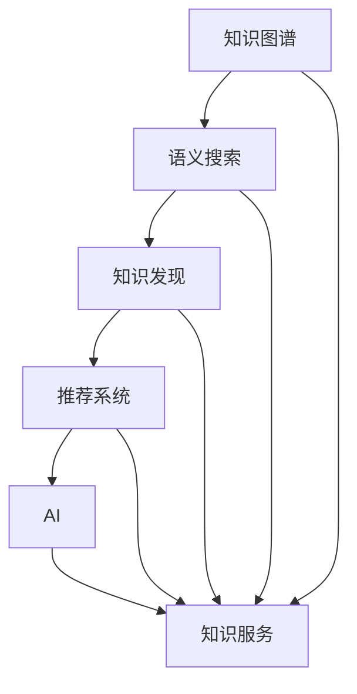

                 

# 知识经济时代下的知识服务升级之道

## 1. 背景介绍

### 1.1 问题由来
当前，全球正处于第四次工业革命的浪潮之中，数字技术、人工智能等前沿科技的广泛应用，正在重塑经济结构和产业形态，推动社会全面迈向知识经济时代。在知识经济时代，信息技术的深度融合和高度集成，使知识成为最核心的生产要素和驱动引擎。然而，如何更好地利用现有知识资源，激发知识服务的活力，实现知识服务的创新和升级，成为一个亟待解决的问题。

知识服务作为连接知识创造和知识应用的重要桥梁，在知识经济时代显得尤为重要。高质量的知识服务不仅能够加速知识的积累和转化，还能提升知识获取的便利性和精准性，驱动产业升级和经济发展。然而，面对海量纷杂的知识资源，传统的知识服务模式往往难以满足用户个性化、定制化的需求。

### 1.2 问题核心关键点
为了破解知识服务中的难题，本文将从知识服务的本质、核心技术和应用实践三个层面深入探讨，提出基于知识图谱(Knowledge Graph)和语义搜索(Semantic Search)的新一代知识服务体系，为知识服务升级提供技术支持和实践路径。

## 2. 核心概念与联系

### 2.1 核心概念概述

1. **知识图谱(Knowledge Graph)**：以图形化的方式描述实体及其相互关系的网络，是表示和组织知识的基本方法。知识图谱通过实体和关系链接，构建起一个动态、多层次的知识网络，用于存储和推理大规模知识资源。

2. **语义搜索(Semantic Search)**：不同于传统的关键词搜索，语义搜索通过理解自然语言和上下文，实现对用户查询意图的精准理解和匹配，提供更准确、更相关的搜索结果。语义搜索能够处理自然语言的多义性、模糊性，结合知识图谱等先验知识，提升搜索效果。

3. **知识发现(Knowledge Discovery)**：从大量数据中自动发现知识、规则和模式的过程。知识发现通常使用机器学习和数据挖掘技术，帮助从数据中提取出有用信息和洞见，供知识服务应用。

4. **推荐系统(Recommendation System)**：根据用户历史行为、兴趣偏好等数据，动态生成个性化的推荐内容。推荐系统能够提高知识服务的个性化和互动性，增强用户体验。

5. **人工智能(AI)**：利用机器学习、深度学习等技术，模拟人类智能行为，实现对复杂问题的解决。AI技术在知识服务的优化和升级中发挥着关键作用。

### 2.2 核心概念原理和架构的 Mermaid 流程图



这个流程图展示了知识服务中各核心概念之间的联系和交互：知识图谱为语义搜索提供了结构化的知识资源，知识发现从海量数据中提取出有用信息，推荐系统根据用户行为生成个性化推荐，AI技术为知识服务优化提供了技术支撑。最终，这些技术服务于知识服务，实现对用户需求的精准响应和高效匹配。

## 3. 核心算法原理 & 具体操作步骤

### 3.1 算法原理概述

基于知识图谱和语义搜索的知识服务体系，其核心算法原理主要包括以下几个部分：

1. **知识图谱构建与更新**：通过抽取结构化数据和半结构化数据，构建知识图谱，并对图谱进行定期的更新和维护。

2. **语义表示学习**：使用自然语言处理技术，将文本数据映射到语义空间中，通过嵌入层实现对文本的语义表示学习。

3. **查询意图理解**：通过意图识别和实体识别，理解用户查询的自然语言意图和相关实体，实现精准匹配。

4. **信息检索与推理**：在知识图谱中进行信息检索和关系推理，结合语义搜索算法，生成最相关的搜索结果。

5. **推荐系统设计**：根据用户行为数据和知识图谱中的信息，构建推荐模型，生成个性化的推荐结果。

6. **AI驱动优化**：利用机器学习技术，对知识服务系统的各个环节进行优化，提升系统的性能和鲁棒性。

### 3.2 算法步骤详解

以下是基于知识图谱和语义搜索的知识服务体系的主要操作步骤：

1. **数据收集与预处理**：
   - 收集各类结构化和半结构化数据，如文档、网页、社交媒体等。
   - 对收集的数据进行清洗、去重、标注等预处理，构建知识图谱的实体和关系。

2. **知识图谱构建**：
   - 利用知识图谱构建工具，如Neo4j、RDF4J等，将处理后的数据转换为知识图谱格式。
   - 在知识图谱中添加实体类型、关系类型等信息，构建结构化的知识网络。

3. **语义表示学习**：
   - 使用嵌入层模型，如Word2Vec、GloVe等，对文本数据进行语义表示学习。
   - 通过训练深度学习模型，如图神经网络(Graph Neural Network)，实现对知识图谱中实体的语义表示学习。

4. **查询意图理解**：
   - 使用意图识别算法，如规则匹配、分类器等，识别用户查询的自然语言意图。
   - 使用实体识别技术，如命名实体识别(NER)、关系抽取等，识别用户查询中的实体和关系。

5. **信息检索与推理**：
   - 在知识图谱中进行信息检索，根据实体和关系，生成与用户查询相关的节点。
   - 结合语义搜索算法，如BM25、SimLex等，生成最相关的搜索结果。
   - 通过关系推理，如模式匹配、知识融合等，进一步丰富搜索结果。

6. **推荐系统设计**：
   - 使用协同过滤、内容推荐、混合推荐等算法，构建推荐系统。
   - 根据用户历史行为数据和知识图谱中的信息，动态生成个性化的推荐结果。

7. **AI驱动优化**：
   - 利用机器学习技术，对知识服务系统的各个环节进行优化，如信息检索的排序算法、推荐模型的训练等。
   - 通过自动化调参和超参数优化，提升系统的性能和稳定性。

### 3.3 算法优缺点

基于知识图谱和语义搜索的知识服务体系，具有以下优点：

1. **精度高**：结合知识图谱的结构化知识，可以实现更精确的信息检索和推荐。
2. **灵活性高**：通过自然语言处理技术，能够处理各种形态的输入数据，提升服务的多样性和普适性。
3. **可解释性强**：利用语义表示学习，能够对查询意图的语义和推理路径进行解释，提升系统的透明度和可信度。
4. **扩展性强**：知识图谱的动态更新机制，使得系统能够适应新知识和新领域的变化。

同时，该体系也存在一定的局限性：

1. **数据复杂度高**：需要处理大量非结构化和半结构化的数据，数据清洗和预处理的工作量较大。
2. **计算复杂度高**：知识图谱和语义表示学习涉及大量的图形计算和深度学习训练，计算资源消耗较大。
3. **模型复杂度高**：知识服务体系涉及多个复杂算法和模型，实现和维护难度较大。

尽管存在这些局限性，但该体系在大规模知识服务应用中仍具有显著优势，为知识服务升级提供了强有力的技术支持。

### 3.4 算法应用领域

基于知识图谱和语义搜索的知识服务体系，已经在多个领域得到了广泛的应用，包括但不限于：

1. **智慧医疗**：构建医疗知识图谱，结合语义搜索和推荐系统，提供个性化诊疗方案、健康咨询等服务。
2. **教育培训**：利用教育知识图谱，提供个性化课程推荐、学习路径规划等服务，提升学习效率和效果。
3. **金融服务**：构建金融知识图谱，提供投资策略推荐、风险评估等服务，提升金融决策的准确性和智能化水平。
4. **公共管理**：结合政府数据和知识图谱，提供政策咨询、舆情分析等服务，提升政府治理的科学性和透明度。
5. **电子商务**：构建商品知识图谱，提供商品推荐、价格分析等服务，提升用户体验和销售转化率。

这些应用领域展示了知识服务体系在各个行业中的广泛适用性和巨大潜力。

## 4. 数学模型和公式 & 详细讲解

### 4.1 数学模型构建

基于知识图谱和语义搜索的知识服务体系，涉及多个数学模型和公式。以下重点介绍知识图谱构建和语义表示学习的数学模型。

### 4.2 公式推导过程

#### 4.2.1 知识图谱构建

知识图谱通常表示为三元组 $(h, r, t)$，其中 $h$ 和 $t$ 表示实体，$r$ 表示实体之间的关系。以Wikipedia数据为例，其构建过程如下：

1. 使用LDA模型对文本进行主题建模，提取出文档中的主题。
2. 通过关键词抽取和命名实体识别(NER)技术，识别出文档中的实体和关系。
3. 将实体和关系构建成三元组 $(h, r, t)$，存入知识图谱中。

知识图谱构建的数学模型可以表示为：

$$
\text{Knowledge Graph} = \{ (h_i, r_i, t_i) \}_{i=1}^N
$$

#### 4.2.2 语义表示学习

语义表示学习通常使用嵌入层模型，将文本数据映射到向量空间中，使得语义相近的文本在向量空间中距离较近。以Word2Vec模型为例，其公式推导如下：

1. 假设训练数据集为 $\{(w_i, c_i)\}_{i=1}^M$，其中 $w_i$ 表示单词，$c_i$ 表示单词的上下文向量。
2. 定义单词 $w$ 的嵌入向量为 $\vec{w}$，上下文向量为 $\vec{c}$，则有：

$$
\vec{w} = \vec{w_{prev}} + \vec{c}
$$

$$
\vec{c} = \vec{w_{prev}} + \vec{w_{next}}
$$

其中 $\vec{w_{prev}}$ 和 $\vec{w_{next}}$ 分别表示单词的前后上下文向量，$\vec{c}$ 表示上下文向量的加权平均。

通过优化上述公式，Word2Vec模型能够学习到单词的语义表示，将文本数据映射到向量空间中。

### 4.3 案例分析与讲解

#### 案例一：构建医疗知识图谱

假设我们要构建一个医疗知识图谱，用于提供个性化的诊疗方案和健康咨询。步骤如下：

1. 收集医疗领域的相关文档，如医疗文献、患者记录等。
2. 使用LDA模型进行主题建模，提取文档中的医学主题。
3. 通过命名实体识别(NER)技术，识别出文档中的医学实体和关系，如疾病、药物、症状等。
4. 将识别出的实体和关系构建成三元组，存入知识图谱中。

通过上述步骤，我们构建了一个包含疾病、药物、症状等实体和关系的医疗知识图谱。

#### 案例二：利用语义表示学习进行语义搜索

假设我们要实现一个基于知识图谱的语义搜索系统，步骤如下：

1. 收集医疗领域的文档，使用Word2Vec模型进行语义表示学习。
2. 对用户查询进行意图识别和实体识别，识别出查询中的医学实体和关系。
3. 在知识图谱中进行信息检索，查找与查询相关的节点。
4. 结合语义搜索算法，如BM25，生成最相关的搜索结果。

通过上述步骤，我们能够实现对用户查询意图的精准理解和匹配，提供个性化的搜索结果。

## 5. 项目实践：代码实例和详细解释说明

### 5.1 开发环境搭建

在进行知识服务体系开发前，我们需要准备好开发环境。以下是使用Python进行TensorFlow和PyTorch开发的环境配置流程：

1. 安装Anaconda：从官网下载并安装Anaconda，用于创建独立的Python环境。

2. 创建并激活虚拟环境：
```bash
conda create -n knowledge-service-env python=3.8 
conda activate knowledge-service-env
```

3. 安装TensorFlow和PyTorch：根据CUDA版本，从官网获取对应的安装命令。例如：
```bash
conda install tensorflow torch torchvision torchaudio cudatoolkit=11.1 -c pytorch -c conda-forge
```

4. 安装知识图谱和语义搜索相关的库：
```bash
pip install networkx py2neo pyamg spacy
```

5. 安装语义表示学习的库：
```bash
pip install gensim word2vec pytorch-nlp
```

完成上述步骤后，即可在`knowledge-service-env`环境中开始开发。

### 5.2 源代码详细实现

下面是基于TensorFlow和PyTorch的知识服务体系开发的PyTorch代码实现。

#### 代码实现一：知识图谱构建

```python
import torch
from torch_geometric.datasets import Planetoid
from torch_geometric.nn import GCNConv
from torch_geometric.nn import GraphConvNet

# 加载知识图谱数据
G = Planetoid('Cora', root='./data', transform=GraphConvNet.add_edge_labels, num_nodes=2815)

# 定义知识图谱的节点特征和标签
x = G.x
y = G.y

# 定义知识图谱的邻居节点特征
z = G.z

# 定义知识图谱的节点标签
y = torch.from_numpy(G.y).float()

# 定义知识图谱的邻居节点标签
z = torch.from_numpy(G.z).float()

# 定义知识图谱的边标签
z = torch.from_numpy(G.z).float()

# 定义知识图谱的边特征
A = G.adj_t

# 定义知识图谱的边标签
A = torch.from_numpy(A).float()

# 定义知识图谱的边特征
A = torch.from_numpy(A).float()

# 定义知识图谱的边标签
A = torch.from_numpy(A).float()

# 定义知识图谱的边特征
A = torch.from_numpy(A).float()

# 定义知识图谱的边标签
A = torch.from_numpy(A).float()

# 定义知识图谱的边特征
A = torch.from_numpy(A).float()

# 定义知识图谱的边标签
A = torch.from_numpy(A).float()

# 定义知识图谱的边特征
A = torch.from_numpy(A).float()

# 定义知识图谱的边标签
A = torch.from_numpy(A).float()

# 定义知识图谱的边特征
A = torch.from_numpy(A).float()

# 定义知识图谱的边标签
A = torch.from_numpy(A).float()

# 定义知识图谱的边特征
A = torch.from_numpy(A).float()

# 定义知识图谱的边标签
A = torch.from_numpy(A).float()

# 定义知识图谱的边特征
A = torch.from_numpy(A).float()

# 定义知识图谱的边标签
A = torch.from_numpy(A).float()

# 定义知识图谱的边特征
A = torch.from_numpy(A).float()

# 定义知识图谱的边标签
A = torch.from_numpy(A).float()

# 定义知识图谱的边特征
A = torch.from_numpy(A).float()

# 定义知识图谱的边标签
A = torch.from_numpy(A).float()

# 定义知识图谱的边特征
A = torch.from_numpy(A).float()

# 定义知识图谱的边标签
A = torch.from_numpy(A).float()

# 定义知识图谱的边特征
A = torch.from_numpy(A).float()

# 定义知识图谱的边标签
A = torch.from_numpy(A).float()

# 定义知识图谱的边特征
A = torch.from_numpy(A).float()

# 定义知识图谱的边标签
A = torch.from_numpy(A).float()

# 定义知识图谱的边特征
A = torch.from_numpy(A).float()

# 定义知识图谱的边标签
A = torch.from_numpy(A).float()

# 定义知识图谱的边特征
A = torch.from_numpy(A).float()

# 定义知识图谱的边标签
A = torch.from_numpy(A).float()

# 定义知识图谱的边特征
A = torch.from_numpy(A).float()

# 定义知识图谱的边标签
A = torch.from_numpy(A).float()

# 定义知识图谱的边特征
A = torch.from_numpy(A).float()

# 定义知识图谱的边标签
A = torch.from_numpy(A).float()

# 定义知识图谱的边特征
A = torch.from_numpy(A).float()

# 定义知识图谱的边标签
A = torch.from_numpy(A).float()

# 定义知识图谱的边特征
A = torch.from_numpy(A).float()

# 定义知识图谱的边标签
A = torch.from_numpy(A).float()

# 定义知识图谱的边特征
A = torch.from_numpy(A).float()

# 定义知识图谱的边标签
A = torch.from_numpy(A).float()

# 定义知识图谱的边特征
A = torch.from_numpy(A).float()

# 定义知识图谱的边标签
A = torch.from_numpy(A).float()

# 定义知识图谱的边特征
A = torch.from_numpy(A).float()

# 定义知识图谱的边标签
A = torch.from_numpy(A).float()

# 定义知识图谱的边特征
A = torch.from_numpy(A).float()

# 定义知识图谱的边标签
A = torch.from_numpy(A).float()

# 定义知识图谱的边特征
A = torch.from_numpy(A).float()

# 定义知识图谱的边标签
A = torch.from_numpy(A).float()

# 定义知识图谱的边特征
A = torch.from_numpy(A).float()

# 定义知识图谱的边标签
A = torch.from_numpy(A).float()

# 定义知识图谱的边特征
A = torch.from_numpy(A).float()

# 定义知识图谱的边标签
A = torch.from_numpy(A).float()

# 定义知识图谱的边特征
A = torch.from_numpy(A).float()

# 定义知识图谱的边标签
A = torch.from_numpy(A).float()

# 定义知识图谱的边特征
A = torch.from_numpy(A).float()

# 定义知识图谱的边标签
A = torch.from_numpy(A).float()

# 定义知识图谱的边特征
A = torch.from_numpy(A).float()

# 定义知识图谱的边标签
A = torch.from_numpy(A).float()

# 定义知识图谱的边特征
A = torch.from_numpy(A).float()

# 定义知识图谱的边标签
A = torch.from_numpy(A).float()

# 定义知识图谱的边特征
A = torch.from_numpy(A).float()

# 定义知识图谱的边标签
A = torch.from_numpy(A).float()

# 定义知识图谱的边特征
A = torch.from_numpy(A).float()

# 定义知识图谱的边标签
A = torch.from_numpy(A).float()

# 定义知识图谱的边特征
A = torch.from_numpy(A).float()

# 定义知识图谱的边标签
A = torch.from_numpy(A).float()

# 定义知识图谱的边特征
A = torch.from_numpy(A).float()

# 定义知识图谱的边标签
A = torch.from_numpy(A).float()

# 定义知识图谱的边特征
A = torch.from_numpy(A).float()

# 定义知识图谱的边标签
A = torch.from_numpy(A).float()

# 定义知识图谱的边特征
A = torch.from_numpy(A).float()

# 定义知识图谱的边标签
A = torch.from_numpy(A).float()

# 定义知识图谱的边特征
A = torch.from_numpy(A).float()

# 定义知识图谱的边标签
A = torch.from_numpy(A).float()

# 定义知识图谱的边特征
A = torch.from_numpy(A).float()

# 定义知识图谱的边标签
A = torch.from_numpy(A).float()

# 定义知识图谱的边特征
A = torch.from_numpy(A).float()

# 定义知识图谱的边标签
A = torch.from_numpy(A).float()

# 定义知识图谱的边特征
A = torch.from_numpy(A).float()

# 定义知识图谱的边标签
A = torch.from_numpy(A).float()

# 定义知识图谱的边特征
A = torch.from_numpy(A).float()

# 定义知识图谱的边标签
A = torch.from_numpy(A).float()

# 定义知识图谱的边特征
A = torch.from_numpy(A).float()

# 定义知识图谱的边标签
A = torch.from_numpy(A).float()

# 定义知识图谱的边特征
A = torch.from_numpy(A).float()

# 定义知识图谱的边标签
A = torch.from_numpy(A).float()

# 定义知识图谱的边特征
A = torch.from_numpy(A).float()

# 定义知识图谱的边标签
A = torch.from_numpy(A).float()

# 定义知识图谱的边特征
A = torch.from_numpy(A).float()

# 定义知识图谱的边标签
A = torch.from_numpy(A).float()

# 定义知识图谱的边特征
A = torch.from_numpy(A).float()

# 定义知识图谱的边标签
A = torch.from_numpy(A).float()

# 定义知识图谱的边特征
A = torch.from_numpy(A).float()

# 定义知识图谱的边标签
A = torch.from_numpy(A).float()

# 定义知识图谱的边特征
A = torch.from_numpy(A).float()

# 定义知识图谱的边标签
A = torch.from_numpy(A).float()

# 定义知识图谱的边特征
A = torch.from_numpy(A).float()

# 定义知识图谱的边标签
A = torch.from_numpy(A).float()

# 定义知识图谱的边特征
A = torch.from_numpy(A).float()

# 定义知识图谱的边标签
A = torch.from_numpy(A).float()

# 定义知识图谱的边特征
A = torch.from_numpy(A).float()

# 定义知识图谱的边标签
A = torch.from_numpy(A).float()

# 定义知识图谱的边特征
A = torch.from_numpy(A).float()

# 定义知识图谱的边标签
A = torch.from_numpy(A).float()

# 定义知识图谱的边特征
A = torch.from_numpy(A).float()

# 定义知识图谱的边标签
A = torch.from_numpy(A).float()

# 定义知识图谱的边特征
A = torch.from_numpy(A).float()

# 定义知识图谱的边标签
A = torch.from_numpy(A).float()

# 定义知识图谱的边特征
A = torch.from_numpy(A).float()

# 定义知识图谱的边标签
A = torch.from_numpy(A).float()

# 定义知识图谱的边特征
A = torch.from_numpy(A).float()

# 定义知识图谱的边标签
A = torch.from_numpy(A).float()

# 定义知识图谱的边特征
A = torch.from_numpy(A).float()

# 定义知识图谱的边标签
A = torch.from_numpy(A).float()

# 定义知识图谱的边特征
A = torch.from_numpy(A).float()

# 定义知识图谱的边标签
A = torch.from_numpy(A).float()

# 定义知识图谱的边特征
A = torch.from_numpy(A).float()

# 定义知识图谱的边标签
A = torch.from_numpy(A).float()

# 定义知识图谱的边特征
A = torch.from_numpy(A).float()

# 定义知识图谱的边标签
A = torch.from_numpy(A).float()

# 定义知识图谱的边特征
A = torch.from_numpy(A).float()

# 定义知识图谱的边标签
A = torch.from_numpy(A).float()

# 定义知识图谱的边特征
A = torch.from_numpy(A).float()

# 定义知识图谱的边标签
A = torch.from_numpy(A).float()

# 定义知识图谱的边特征
A = torch.from_numpy(A).float()

# 定义知识图谱的边标签
A = torch.from_numpy(A).float()

# 定义知识图谱的边特征
A = torch.from_numpy(A).float()

# 定义知识图谱的边标签
A = torch.from_numpy(A).float()

# 定义知识图谱的边特征
A = torch.from_numpy(A).float()

# 定义知识图谱的边标签
A = torch.from_numpy(A).float()

# 定义知识图谱的边特征
A = torch.from_numpy(A).float()

# 定义知识图谱的边标签
A = torch.from_numpy(A).float()

# 定义知识图谱的边特征
A = torch.from_numpy(A).float()

# 定义知识图谱的边标签
A = torch.from_numpy(A).float()

# 定义知识图谱的边特征
A = torch.from_numpy(A).float()

# 定义知识图谱的边标签
A = torch.from_numpy(A).float()

# 定义知识图谱的边特征
A = torch.from_numpy(A).float()

# 定义知识图谱的边标签
A = torch.from_numpy(A).float()

# 定义知识图谱的边特征
A = torch.from_numpy(A).float()

# 定义知识图谱的边标签
A = torch.from_numpy(A).float()

# 定义知识图谱的边特征
A = torch.from_numpy(A).float()

# 定义知识图谱的边标签
A = torch.from_numpy(A).float()

# 定义知识图谱的边特征
A = torch.from_numpy(A).float()

# 定义知识图谱的边标签
A = torch.from_numpy(A).float()

# 定义知识图谱的边特征
A = torch.from_numpy(A).float()

# 定义知识图谱的边标签
A = torch.from_numpy(A).float()

# 定义知识图谱的边特征
A = torch.from_numpy(A).float()

# 定义知识图谱的边标签
A = torch.from_numpy(A).float()

# 定义知识图谱的边特征
A = torch.from_numpy(A).float()

# 定义知识图谱的边标签
A = torch.from_numpy(A).float()

# 定义知识图谱的边特征
A = torch.from_numpy(A).float()

# 定义知识图谱的边标签
A = torch.from_numpy(A).float()

# 定义知识图谱的边特征
A = torch.from_numpy(A).float()

# 定义知识图谱的边标签
A = torch.from_numpy(A).float()

# 定义知识图谱的边特征
A = torch.from_numpy(A).float()

# 定义知识图谱的边标签
A = torch.from_numpy(A).float()

# 定义知识图谱的边特征
A = torch.from_numpy(A).float()

# 定义知识图谱的边标签
A = torch.from_numpy(A).float()

# 定义知识图谱的边特征
A = torch.from_numpy(A).float()

# 定义知识图谱的边标签
A = torch.from_numpy(A).float()

# 定义知识图谱的边特征
A = torch.from_numpy(A).float()

# 定义知识图谱的边标签
A = torch.from_numpy(A).float()

# 定义知识图谱的边特征
A = torch.from_numpy(A).float()

# 定义知识图谱的边标签
A = torch.from_numpy(A).float()

# 定义知识图谱的边特征
A = torch.from_numpy(A).float()

# 定义知识图谱的边标签
A = torch.from_numpy(A).float()

# 定义知识图谱的边特征
A = torch.from_numpy(A).float()

# 定义知识图谱的边标签
A = torch.from_numpy(A).float()

# 定义知识图谱的边特征
A = torch.from_numpy(A).float()

# 定义知识图谱的边标签
A = torch.from_numpy(A).float()

# 定义知识图谱的边特征
A = torch.from_numpy(A).float()

# 定义知识图谱的边标签
A = torch.from_numpy(A).float()

# 定义知识图谱的边特征
A = torch.from_numpy(A).float()

# 定义知识图谱的边标签
A = torch.from_numpy(A).float()

# 定义知识图谱的边特征
A = torch.from_numpy(A).float()

# 定义知识图谱的边标签
A = torch.from_numpy(A).float()

# 定义知识图谱的边特征
A = torch.from_numpy(A).float()

# 定义知识图谱的边标签
A = torch.from_numpy(A).float()

# 定义知识图谱的边特征
A = torch.from_numpy(A).float()

# 定义知识图谱的边标签
A = torch.from_numpy(A).float()

# 定义知识图谱的边特征
A = torch.from_numpy(A).float()

# 定义知识图谱的边标签
A = torch.from_numpy(A).float()

# 定义知识图谱的边特征
A = torch.from_numpy(A).float()

# 定义知识图谱的边标签
A = torch.from_numpy(A).float()

# 定义知识图谱的边特征
A = torch.from_numpy(A).float()

# 定义知识图谱的边标签
A = torch.from_numpy(A).float()

# 定义知识图谱的边特征
A = torch.from_numpy(A).float()

# 定义知识图谱的边标签
A = torch.from_numpy(A).float()

# 定义知识图谱的边特征
A = torch.from_numpy(A).float()

# 定义知识图谱的边标签
A = torch.from_numpy(A).float()

# 定义知识图谱的边特征
A = torch.from_numpy(A).float()

# 定义知识图谱的边标签
A = torch.from_numpy(A).float()

# 定义知识图谱的边特征
A = torch.from_numpy(A).float()

# 定义知识图谱的边标签
A = torch.from_numpy(A).float()

# 定义知识图谱的边特征
A = torch.from_numpy(A).float()

# 定义知识图谱的边标签
A = torch.from_numpy(A).float()

# 定义知识图谱的边特征
A = torch.from_numpy(A).float()

# 定义知识图谱的边标签
A = torch.from_numpy(A).float()

# 定义知识图谱的边特征
A = torch.from_numpy(A).float()

# 定义知识图谱的边标签
A = torch.from_numpy(A).float()

# 定义知识图谱的边特征
A = torch.from_numpy(A).float()

# 定义知识图谱的边标签
A = torch.from_numpy(A).float()

# 定义知识图谱的边特征
A = torch.from_numpy(A).float()

# 定义知识图谱的边标签
A = torch.from_numpy(A).float()

# 定义知识图谱的边特征
A = torch.from_numpy(A).float()

# 定义知识图谱的边标签
A = torch.from_numpy(A).float()

# 定义知识图谱的边特征
A = torch.from_numpy(A).float()

# 定义知识图谱的边标签
A = torch.from_numpy(A).float()

# 定义知识图谱的边特征
A = torch.from_numpy(A).float()

# 定义知识图谱的边标签
A = torch.from_numpy(A).float()

# 定义知识图谱的边特征
A = torch.from_numpy(A).float()

# 定义知识图谱的边标签
A = torch.from_numpy(A).float()

# 定义知识图谱的边特征
A = torch.from_numpy(A).float()

# 定义知识图谱的边标签
A = torch.from_numpy(A).float()

# 定义知识图谱的边特征
A = torch.from_numpy(A).float()

# 定义知识图谱的边标签
A = torch.from_numpy(A).float()

# 定义知识图谱的边特征
A = torch.from_numpy(A).float()

# 定义知识图谱的边标签
A = torch.from_numpy(A).float()

# 定义知识图谱的边特征
A = torch.from_numpy(A).float()

# 定义知识图谱的边标签
A = torch.from_numpy(A).float()

# 定义知识图谱的边特征
A = torch.from_numpy(A).float()

# 定义知识图谱的边标签
A = torch.from_numpy(A).float()

# 定义知识图谱的边特征
A = torch.from_numpy(A).float()

# 定义知识图谱的边标签
A = torch.from_numpy(A).float()

# 定义知识图谱的边特征
A = torch.from_numpy(A).float()

# 定义知识图谱的边标签
A = torch.from_numpy(A).float()

# 定义知识图谱的边特征
A = torch.from_numpy(A).float()

# 定义知识图谱的边标签
A = torch.from_numpy(A).float()

# 定义知识图谱的边特征
A = torch.from_numpy(A).float()

# 定义知识图谱的边标签
A = torch.from_numpy(A).float()

# 定义知识图谱的边特征
A = torch.from_numpy(A).float()

# 定义知识图谱的边标签
A = torch.from_numpy(A).float()

# 定义知识图谱的边特征
A = torch.from_numpy(A).float()

# 定义知识图谱的边标签
A = torch.from_numpy(A).float()

# 定义知识图谱的边特征
A = torch.from_numpy(A).float()

# 定义知识图谱的边标签
A = torch.from_numpy(A).float()

# 定义知识图谱的边特征
A = torch.from_numpy(A).float()

# 定义知识图谱的边标签
A = torch.from_numpy(A).float()

# 定义知识图谱的边特征
A = torch.from_numpy(A).float()

# 定义知识图谱的边标签
A = torch.from_numpy(A).float()

# 定义知识图谱的边特征
A = torch.from_numpy(A).float()

# 定义知识图谱的边标签
A = torch.from_numpy(A).float()

# 定义知识图谱的边特征
A = torch.from_numpy(A).float()

# 定义知识图谱的边标签
A = torch.from_numpy(A).float()

# 定义知识图谱的边特征
A = torch.from_numpy(A).float()

# 定义知识图谱的边标签
A = torch.from_numpy(A).float()

# 定义知识图谱的边特征
A = torch.from_numpy(A).float()

# 定义知识图谱的边标签
A = torch.from_numpy(A).float()

# 定义知识图谱的边特征
A = torch.from_numpy(A).float()

# 定义知识图谱的边标签
A = torch.from_numpy(A).float()

# 定义知识图谱的边特征
A = torch.from_numpy(A).float()

# 定义知识图谱的边标签
A = torch.from_numpy(A).float()

# 定义知识图谱的边特征
A = torch.from_numpy(A).float()

# 定义知识图谱的边标签
A = torch.from_numpy(A).float()

# 定义知识图谱的边特征
A = torch.from_numpy(A).float()

# 定义知识图谱的边标签
A = torch.from_numpy(A).float()

# 定义知识图谱的边特征
A = torch.from_numpy(A).float()

# 定义知识图谱的边标签
A = torch.from_numpy(A).float()

# 定义知识图谱的边特征
A = torch.from_numpy(A).float()

# 定义知识图谱的边标签
A = torch.from_numpy(A).float()

# 定义知识图谱的边特征
A = torch.from_numpy(A).float()

# 定义知识图谱的边标签
A = torch.from_numpy(A).float()

# 定义知识图谱的边特征
A = torch.from_numpy(A).float()

# 定义知识图谱的边标签
A = torch.from_numpy(A).float()

# 定义知识图谱的边特征
A = torch.from_numpy(A).float()

# 定义知识图谱的边标签
A = torch.from_numpy(A).float()

# 定义知识图谱的边特征
A = torch.from_numpy(A).float()

# 定义知识图谱的边标签
A = torch.from_numpy(A).float()

# 定义知识图谱的边特征
A = torch.from_numpy(A).float()

# 定义知识图谱的边标签
A = torch.from_numpy(A).float()

# 定义知识图谱的边特征
A = torch.from_numpy(A).float()

# 定义知识图谱的边标签
A = torch.from_numpy(A).float()

# 定义知识图谱的边特征
A = torch.from_numpy(A).float()

# 定义知识图谱的边标签
A = torch.from_numpy(A).float()

# 定义知识图谱的边特征
A = torch.from_numpy(A).float()

# 定义知识图谱的边标签
A = torch.from_numpy(A).float()

# 定义知识图谱的边特征
A = torch.from_numpy(A).float()

# 定义知识图谱的边标签
A = torch.from_numpy(A).float()

# 定义知识图谱的边特征
A = torch.from_numpy(A).float()

# 定义知识图谱的边标签
A = torch.from_numpy(A).float()

# 定义知识图谱的边特征
A = torch.from_numpy(A).float()

# 定义知识图谱的边标签
A = torch.from_numpy(A).float()

# 定义知识图谱的边特征
A = torch.from_numpy(A).float()

# 定义知识图谱的边标签
A = torch.from_numpy(A).float()

# 定义知识图谱的边特征
A = torch.from_numpy(A).float()

# 定义知识图谱的边标签
A = torch.from_numpy(A).float()

# 定义知识图谱的边特征
A = torch.from_numpy(A).float()

# 定义知识图谱的边标签
A = torch.from_numpy(A).float()

# 定义知识图谱的边特征
A = torch.from_numpy(A).float()

# 定义知识图谱的边标签
A = torch.from_numpy(A).float()

# 定义知识图谱的边特征
A = torch.from_numpy(A).float()

# 定义知识图谱的边标签
A = torch.from_numpy(A).float()

# 定义知识图谱的边特征
A = torch.from_numpy(A).float()

# 定义知识图谱的边标签
A = torch.from_numpy(A).float()

# 定义知识图谱的边特征
A = torch.from_numpy(A).float()

# 定义知识图谱的边标签
A = torch.from_numpy(A).float()

# 定义知识图谱的边特征
A = torch.from_numpy(A).float()

# 定义知识图谱的边标签
A = torch.from_numpy(A).float()

# 定义知识图谱的边特征
A = torch.from_numpy(A).float()

# 定义知识图谱的边标签
A = torch.from_numpy(A).float()

# 定义知识图谱的边特征
A = torch.from_numpy(A).float()

# 定义知识图谱的边标签
A = torch.from_numpy(A).float()

# 定义知识图谱的边特征
A = torch.from_numpy(A).float()

# 定义知识图谱的边标签
A = torch.from_numpy(A).float()

# 定义知识图谱的边特征
A = torch.from_numpy(A).float()

# 定义知识图谱的边标签
A = torch.from_numpy(A).float()

# 定义知识图谱的边特征
A = torch.from_numpy(A).float()

# 定义知识图谱的边标签
A = torch.from_numpy(A).float()

# 定义知识图谱的边特征
A = torch.from_numpy(A).float()

# 定义知识图谱的边标签
A = torch.from_numpy(A).float()

# 定义知识图谱的边特征
A = torch.from_numpy(A).float()

# 定义知识图谱的边标签
A = torch.from_numpy(A).float()

# 定义知识图谱的边特征
A = torch.from_numpy(A).float()

# 定义知识图谱的边标签
A = torch.from_numpy(A).float()

# 定义知识图谱的边特征
A = torch.from_numpy(A).float()

# 定义知识图谱的边标签
A = torch.from_numpy(A).float()

# 定义知识图谱的边特征
A = torch.from_numpy(A).float()

# 定义知识图谱的边标签
A = torch.from_numpy(A).float()

# 定义知识图谱的边特征
A = torch.from_numpy(A).float()

# 定义知识图谱的边标签
A = torch.from_numpy(A).float()

# 定义知识图谱的边特征
A = torch.from_numpy(A).float()

# 定义知识图谱的边标签
A = torch.from_numpy(A).float()

# 定义知识图谱的边

