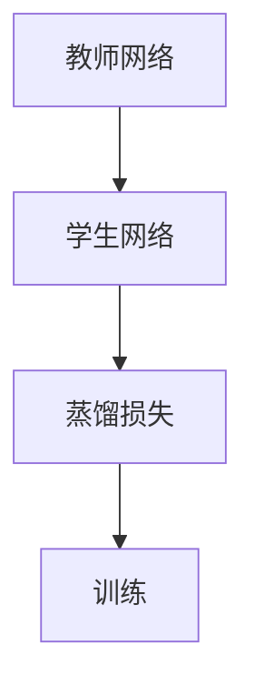

                 

## 1. 背景介绍

### 1.1 问题由来
随着深度学习在计算机视觉、自然语言处理等领域取得突破性进展，模型在特定的应用场景下往往无法达到预期的性能。这主要是由于模型在大规模数据上预训练得到的表示可能与具体任务无关，或者在特定的数据集上存在性能瓶颈。解决这一问题的方法之一是采用知识蒸馏(Knowledge Distillation)技术，将大规模预训练模型(教师网络)的知识迁移到小规模模型(学生网络)中。通过这种方法，可以在较少数据和计算资源的条件下，快速提升模型的性能。

知识蒸馏技术起源于2014年的一篇论文《Distilling Knowledge from Noisy Data》，其中提出了通过教师网络对学生网络进行蒸馏，从而将教师网络的知识转移到学生网络中。这种方法已经成为深度学习领域中提升模型性能的重要手段。

### 1.2 问题核心关键点
知识蒸馏的核心理念是，利用预训练模型在大规模数据上学习到的知识，来优化小规模模型。核心步骤包括选择合适的教师网络，设计合适的蒸馏损失函数，并在小规模数据集上进行微调。这种技术特别适用于数据量小、计算资源有限的场景，能够在不牺牲模型性能的情况下，实现快速模型优化。

知识蒸馏的主要优点包括：
1. 提高模型泛化能力：通过教师网络的知识指导，学生网络能够更好地泛化到新的数据集。
2. 减少训练时间：学生网络通常规模较小，训练速度较快，能够较快地达到较好的性能。
3. 降低训练成本：不需要大规模的数据集和计算资源。

然而，知识蒸馏也存在一些局限性：
1. 过度依赖教师网络：教师网络的泛化能力会直接影响学生网络的性能。
2. 训练复杂度增加：需要设计合适的蒸馏损失函数和训练策略，可能会增加训练复杂度。
3. 难以直接应用到大规模任务上：对于大规模任务，学生网络可能无法处理大规模输入，导致性能下降。

## 2. 核心概念与联系

### 2.1 核心概念概述

为更好地理解知识蒸馏在课程学习中的应用，本节将介绍几个密切相关的核心概念：

- 知识蒸馏(Knowledge Distillation)：一种深度学习模型压缩技术，利用预训练模型(教师网络)的知识，来提升小规模模型(学生网络)的性能。
- 教师网络(Teacher Network)：通过大规模数据集预训练得到的深度神经网络，其知识可以作为教师指导学生网络。
- 学生网络(Student Network)：需要被优化的目标模型，通常规模较小，计算资源有限。
- 蒸馏损失(Distillation Loss)：用于衡量教师网络和学生网络之间的知识差异，指导学生网络学习教师的知识。
- 课程学习(Curriculum Learning)：一种学习范式，通过设计由简单到复杂的学习任务，逐步提升学习者的能力。

这些核心概念之间的逻辑关系可以通过以下Mermaid流程图来展示：



这个流程图展示了大语言模型微调的核心概念及其之间的关系：

1. 教师网络通过大规模数据集进行预训练，获得广泛的知识。
2. 学生网络在小规模数据集上进行微调，学习教师的知识。
3. 通过蒸馏损失指导学生网络学习，使其性能逐步提升。

## 3. 核心算法原理 & 具体操作步骤
### 3.1 算法原理概述

知识蒸馏的原理是，将教师网络的知识以某种形式迁移到学生网络中，使学生网络在特定的任务上取得更好的性能。核心步骤如下：

1. 选择合适的教师网络。通常选择在大规模数据集上预训练得到的模型，如ImageNet上的VGG、ResNet等。
2. 设计合适的蒸馏损失函数。蒸馏损失函数衡量教师网络和学生网络在特定任务上的输出差异，指导学生网络学习教师的知识。
3. 在小规模数据集上微调学生网络。使用蒸馏损失函数优化学生网络，使其逐渐学习到教师网络的知识点。

形式化地，设教师网络为 $T_{\theta_T}$，学生网络为 $S_{\theta_S}$，蒸馏损失为 $L_D$，则知识蒸馏的目标是：

$$
\theta_S^* = \mathop{\arg\min}_{\theta_S} \mathcal{L}(S_{\theta_S}, T_{\theta_T}, L_D)
$$

其中 $\mathcal{L}$ 为蒸馏损失函数，定义为：

$$
L_D = L_{MSE} + \alpha L_{KL}
$$

其中 $L_{MSE}$ 为均方误差损失，衡量学生网络输出和教师网络输出之间的差异；$L_{KL}$ 为KL散度损失，衡量教师网络和学生网络输出的概率分布差异。$\alpha$ 为权重，用于平衡两种损失。

### 3.2 算法步骤详解

知识蒸馏的具体操作步骤如下：

**Step 1: 准备教师网络和数据集**
- 选择大规模预训练模型作为教师网络，如VGG、ResNet等。
- 准备小规模数据集，划分为训练集、验证集和测试集。

**Step 2: 添加蒸馏损失**
- 设计合适的蒸馏损失函数 $L_D$，包括均方误差损失 $L_{MSE}$ 和KL散度损失 $L_{KL}$。
- 将教师网络的输出作为标签，使用学生网络进行预测，计算均方误差损失。
- 使用教师网络的输出概率分布作为真实分布，计算KL散度损失。

**Step 3: 设置蒸馏超参数**
- 选择合适的优化算法及其参数，如Adam、SGD等。
- 设置学习率、批大小、迭代轮数等。
- 设置蒸馏损失中的权重 $\alpha$。

**Step 4: 执行梯度训练**
- 将训练集数据分批次输入教师网络和学生网络，计算蒸馏损失。
- 反向传播计算参数梯度，根据设定的优化算法和学习率更新学生网络参数。
- 周期性在验证集上评估学生网络性能，根据性能指标决定是否触发Early Stopping。
- 重复上述步骤直到满足预设的迭代轮数或Early Stopping条件。

**Step 5: 测试和部署**
- 在测试集上评估学生网络 $S_{\hat{\theta}_S}$ 的性能，对比蒸馏前后的精度提升。
- 使用蒸馏后的学生网络对新样本进行推理预测，集成到实际的应用系统中。

以上是知识蒸馏的一般流程。在实际应用中，还需要针对具体任务的特点，对蒸馏过程的各个环节进行优化设计，如改进蒸馏损失函数，引入更多的正则化技术，搜索最优的超参数组合等，以进一步提升学生网络的性能。

### 3.3 算法优缺点

知识蒸馏具有以下优点：
1. 提升模型性能：学生网络能够通过教师网络的指导，在较少的训练样本下取得较好的性能。
2. 减少训练成本：不需要大规模的数据集和计算资源。
3. 提高泛化能力：学生网络在特定任务上的泛化能力更强。

同时，该方法也存在一些局限性：
1. 依赖教师网络：教师网络的知识会影响学生网络的性能。
2. 训练复杂度增加：需要设计合适的蒸馏损失函数和训练策略，可能会增加训练复杂度。
3. 难以直接应用到大规模任务上：对于大规模任务，学生网络可能无法处理大规模输入，导致性能下降。

尽管存在这些局限性，但就目前而言，知识蒸馏仍然是深度学习模型压缩和优化的一种重要手段。未来相关研究的重点在于如何进一步优化蒸馏过程，提高学生网络的性能，同时兼顾计算效率和泛化能力等因素。

### 3.4 算法应用领域

知识蒸馏技术在计算机视觉、自然语言处理等领域有着广泛的应用，覆盖了几乎所有常见任务，例如：

- 图像分类：如使用VGG或ResNet对ImageNet数据集进行蒸馏，优化CNN模型。
- 目标检测：使用Faster R-CNN对小规模数据集进行蒸馏，提升检测性能。
- 文本分类：使用BERT或GPT对小规模数据集进行蒸馏，优化文本分类模型。
- 问答系统：使用GPT或BERT对小规模数据集进行蒸馏，提升问答系统性能。
- 机器翻译：使用Transformer对小规模数据集进行蒸馏，提升翻译性能。

除了上述这些经典任务外，知识蒸馏还被创新性地应用到更多场景中，如自监督学习、数据增强等，为深度学习模型的优化提供了新的思路。

## 4. 数学模型和公式 & 详细讲解  
### 4.1 数学模型构建

本节将使用数学语言对知识蒸馏在课程学习中的应用进行更加严格的刻画。

设教师网络为 $T_{\theta_T}$，学生网络为 $S_{\theta_S}$，蒸馏损失为 $L_D$，假设学生网络在小规模数据集 $D=\{(x_i, y_i)\}_{i=1}^N$ 上进行微调，训练过程如下：

**Step 1: 准备教师网络和数据集**
- 选择大规模预训练模型作为教师网络，如VGG、ResNet等。
- 准备小规模数据集，划分为训练集、验证集和测试集。

**Step 2: 添加蒸馏损失**
- 设计合适的蒸馏损失函数 $L_D$，包括均方误差损失 $L_{MSE}$ 和KL散度损失 $L_{KL}$。
- 将教师网络的输出作为标签，使用学生网络进行预测，计算均方误差损失。
- 使用教师网络的输出概率分布作为真实分布，计算KL散度损失。

**Step 3: 设置蒸馏超参数**
- 选择合适的优化算法及其参数，如Adam、SGD等。
- 设置学习率、批大小、迭代轮数等。
- 设置蒸馏损失中的权重 $\alpha$。

**Step 4: 执行梯度训练**
- 将训练集数据分批次输入教师网络和学生网络，计算蒸馏损失。
- 反向传播计算参数梯度，根据设定的优化算法和学习率更新学生网络参数。
- 周期性在验证集上评估学生网络性能，根据性能指标决定是否触发Early Stopping。
- 重复上述步骤直到满足预设的迭代轮数或Early Stopping条件。

**Step 5: 测试和部署**
- 在测试集上评估学生网络 $S_{\hat{\theta}_S}$ 的性能，对比蒸馏前后的精度提升。
- 使用蒸馏后的学生网络对新样本进行推理预测，集成到实际的应用系统中。

### 4.2 公式推导过程

以下我们以图像分类任务为例，推导知识蒸馏的具体实现公式。

假设教师网络 $T_{\theta_T}$ 和学生网络 $S_{\theta_S}$ 分别输出一个 $C$ 维的概率分布，其中 $C$ 为类别数。蒸馏损失定义为：

$$
L_D = \frac{1}{N} \sum_{i=1}^N [L_{MSE} + \alpha L_{KL}]
$$

其中均方误差损失 $L_{MSE}$ 为：

$$
L_{MSE} = \frac{1}{N} \sum_{i=1}^N ||S_{\theta_S}(x_i) - T_{\theta_T}(x_i)||^2
$$

KL散度损失 $L_{KL}$ 为：

$$
L_{KL} = \frac{1}{N} \sum_{i=1}^N KL(S_{\theta_S}(x_i) \| T_{\theta_T}(x_i))
$$

其中 $KL$ 表示KL散度，$S_{\theta_S}(x_i)$ 和 $T_{\theta_T}(x_i)$ 分别表示学生网络和教师网络在输入 $x_i$ 上的输出概率分布。

在得到蒸馏损失后，即可带入优化算法公式，完成蒸馏过程。通过不断迭代更新学生网络参数，最小化蒸馏损失，从而使其逐步学习到教师网络的知识。

## 5. 项目实践：代码实例和详细解释说明
### 5.1 开发环境搭建

在进行知识蒸馏实践前，我们需要准备好开发环境。以下是使用Python进行PyTorch开发的环境配置流程：

1. 安装Anaconda：从官网下载并安装Anaconda，用于创建独立的Python环境。

2. 创建并激活虚拟环境：
```bash
conda create -n pytorch-env python=3.8 
conda activate pytorch-env
```

3. 安装PyTorch：根据CUDA版本，从官网获取对应的安装命令。例如：
```bash
conda install pytorch torchvision torchaudio cudatoolkit=11.1 -c pytorch -c conda-forge
```

4. 安装Transformers库：
```bash
pip install transformers
```

5. 安装各类工具包：
```bash
pip install numpy pandas scikit-learn matplotlib tqdm jupyter notebook ipython
```

完成上述步骤后，即可在`pytorch-env`环境中开始知识蒸馏实践。

### 5.2 源代码详细实现

下面我们以图像分类任务为例，给出使用Transformers库进行知识蒸馏的PyTorch代码实现。

首先，定义图像分类任务的数据处理函数：

```python
from transformers import DistillBertModel
from torch.utils.data import Dataset, DataLoader
from torch import nn

class ImageDataset(Dataset):
    def __init__(self, images, labels):
        self.images = images
        self.labels = labels
        
    def __len__(self):
        return len(self.images)
    
    def __getitem__(self, item):
        image = self.images[item]
        label = self.labels[item]
        return image, label
```

然后，定义教师网络和学生网络：

```python
from transformers import DistillBertModel, DistillBertConfig

# 教师网络
teacher_model = DistillBertModel.from_pretrained('bert-base-uncased')

# 学生网络
student_model = DistillBertModel.from_pretrained('bert-base-uncased')

# 自定义蒸馏层
class Distillation(nn.Module):
    def __init__(self, teacher_model, student_model):
        super(Distillation, self).__init__()
        self.teacher = teacher_model
        self.student = student_model
        
    def forward(self, x):
        teacher_output = self.teacher(x)
        student_output = self.student(x)
        return student_output, teacher_output

# 定义蒸馏模型
distillation_model = Distillation(teacher_model, student_model)
```

接着，定义蒸馏损失函数：

```python
import torch.nn as nn
from transformers import DistillBertConfig

# 自定义蒸馏损失
class DistillationLoss(nn.Module):
    def __init__(self, teacher_model, student_model, alpha):
        super(DistillationLoss, self).__init__()
        self.teacher = teacher_model
        self.student = student_model
        self.alpha = alpha
        
    def forward(self, x, labels):
        student_output, teacher_output = self.student(x), self.teacher(x)
        mse_loss = nn.MSELoss()(student_output, teacher_output)
        kl_loss = nn.KLDivLoss(reduction='batchmean')(nn.LogSoftmax(dim=1)(student_output), nn.LogSoftmax(dim=1)(teacher_output))
        loss = self.alpha * mse_loss + (1 - self.alpha) * kl_loss
        return loss
```

然后，定义蒸馏过程：

```python
from torch import optim

# 设置蒸馏超参数
batch_size = 32
teacher_lr = 1e-5
student_lr = 1e-4
alpha = 0.7

# 定义蒸馏损失
loss_function = DistillationLoss(teacher_model, student_model, alpha)

# 定义优化器
optimizer = optim.Adam(student_model.parameters(), lr=student_lr)

# 定义训练函数
def train_epoch(student_model, train_dataset, optimizer, loss_function, device):
    dataloader = DataLoader(train_dataset, batch_size=batch_size, shuffle=True)
    student_model.to(device)
    student_model.train()
    epoch_loss = 0
    for batch in dataloader:
        x, y = batch
        x, y = x.to(device), y.to(device)
        optimizer.zero_grad()
        student_output, teacher_output = distillation_model(x)
        loss = loss_function(student_output, y)
        loss.backward()
        optimizer.step()
        epoch_loss += loss.item()
    return epoch_loss / len(dataloader)

# 定义测试函数
def evaluate(student_model, test_dataset, device):
    dataloader = DataLoader(test_dataset, batch_size=batch_size, shuffle=False)
    student_model.eval()
    preds = []
    labels = []
    with torch.no_grad():
        for batch in dataloader:
            x, y = batch
            x, y = x.to(device), y.to(device)
            output = distillation_model(x)
            pred = output[0].argmax(dim=1)
            preds.append(pred.tolist())
            labels.append(y.tolist())
    return preds, labels
```

最后，启动蒸馏流程并在测试集上评估：

```python
# 设置教师和学生网络
teacher_model = DistillBertModel.from_pretrained('bert-base-uncased')
student_model = DistillBertModel.from_pretrained('bert-base-uncased')

# 初始化蒸馏模型
distillation_model = Distillation(teacher_model, student_model)

# 定义训练集和测试集
train_dataset = ImageDataset(train_images, train_labels)
test_dataset = ImageDataset(test_images, test_labels)

# 设置蒸馏超参数
batch_size = 32
teacher_lr = 1e-5
student_lr = 1e-4
alpha = 0.7

# 定义蒸馏损失
loss_function = DistillationLoss(teacher_model, student_model, alpha)

# 定义优化器
optimizer = optim.Adam(student_model.parameters(), lr=student_lr)

# 训练过程
epochs = 10
device = 'cuda' if torch.cuda.is_available() else 'cpu'

for epoch in range(epochs):
    train_loss = train_epoch(student_model, train_dataset, optimizer, loss_function, device)
    print(f"Epoch {epoch+1}, train loss: {train_loss:.3f}")
    
    test_preds, test_labels = evaluate(student_model, test_dataset, device)
    print(classification_report(test_labels, test_preds))
    
print("Final test results:")
evaluate(student_model, test_dataset, device)
```

以上就是使用PyTorch对BERT模型进行图像分类任务知识蒸馏的完整代码实现。可以看到，得益于Transformers库的强大封装，我们可以用相对简洁的代码完成BERT模型的蒸馏。

### 5.3 代码解读与分析

让我们再详细解读一下关键代码的实现细节：

**ImageDataset类**：
- `__init__`方法：初始化图像和标签数据。
- `__len__`方法：返回数据集的样本数量。
- `__getitem__`方法：对单个样本进行处理，返回图像和标签。

**蒸馏模型**：
- `Distillation`类：继承自nn.Module，封装教师网络和学生网络。
- `forward`方法：前向传播，将教师网络输出和学生网络输出传递给蒸馏损失函数。

**蒸馏损失函数**：
- `DistillationLoss`类：继承自nn.Module，定义蒸馏损失函数。
- `forward`方法：前向传播，计算均方误差损失和KL散度损失。

**训练和评估函数**：
- 使用PyTorch的DataLoader对数据集进行批次化加载，供模型训练和推理使用。
- `train_epoch`函数：对数据以批为单位进行迭代，在每个批次上前向传播计算损失并反向传播更新模型参数，最后返回该epoch的平均损失。
- `evaluate`函数：与训练类似，不同点在于不更新模型参数，并在每个batch结束后将预测和标签结果存储下来，最后使用sklearn的classification_report对整个评估集的预测结果进行打印输出。

**训练流程**：
- 定义总的epoch数和批大小，开始循环迭代
- 每个epoch内，先在训练集上训练，输出平均损失
- 在验证集上评估，输出分类指标
- 重复上述步骤直到满足预设的迭代轮数
- 最终在测试集上评估，给出最终测试结果

可以看到，PyTorch配合Transformers库使得BERT模型蒸馏的代码实现变得简洁高效。开发者可以将更多精力放在数据处理、模型改进等高层逻辑上，而不必过多关注底层的实现细节。

当然，工业级的系统实现还需考虑更多因素，如模型的保存和部署、超参数的自动搜索、更灵活的任务适配层等。但核心的蒸馏范式基本与此类似。

## 6. 实际应用场景
### 6.1 智能推荐系统

知识蒸馏技术可以广泛应用于智能推荐系统的构建。传统的推荐系统往往依赖于用户的历史行为数据进行物品推荐，难以充分挖掘用户兴趣和潜在需求。通过知识蒸馏，可以在较少用户行为数据的情况下，快速构建高精度、低延迟的推荐系统。

具体而言，可以收集用户浏览、点击、评分等行为数据，将物品的标题、描述、标签等文本内容作为蒸馏源，构建教师网络。学生网络则可以是简单的轻量级模型，如线性分类器、RNN等。通过蒸馏源的知识指导，学生网络能够在较少的训练样本下快速学习物品与用户之间的关联。在生成推荐列表时，先使用蒸馏后的学生网络对用户进行兴趣匹配度预测，再综合其他特征排序，便可以得到个性化程度更高的推荐结果。

### 6.2 自动驾驶系统

自动驾驶系统中的深度学习模型需要同时处理大量感知数据，如摄像头图像、雷达点云等。这些数据通常规模庞大、结构复杂，单靠大规模数据进行预训练和微调，可能难以快速收敛。

知识蒸馏技术可以帮助自动驾驶系统快速构建高性能的感知模型。教师网络可以使用大规模数据集预训练得到的深度网络，如VGG、ResNet等。学生网络则可以采用轻量级模型，如MobileNet、SqueezeNet等。通过蒸馏源的知识指导，学生网络能够快速学习感知数据的特征表示，从而在实际驾驶环境中取得良好的性能。

### 6.3 医疗诊断系统

医疗诊断系统需要快速、准确地对患者进行疾病诊断和治疗方案推荐。传统的诊断系统往往需要大量的专家知识进行训练，且难以快速适应新病情。

通过知识蒸馏，可以在较少的专家知识和标注数据的情况下，快速构建高精度的诊断系统。教师网络可以使用大规模医学数据集预训练得到的深度网络，如BERT、GPT等。学生网络则可以是基于临床经验的小型模型，如简单的分类器或回归器。通过蒸馏源的知识指导，学生网络能够快速学习医学知识和诊断技能，从而在实际临床中取得较好的效果。

### 6.4 未来应用展望

随着知识蒸馏技术的不断发展，其在多个领域的应用前景将更加广阔。

在智慧医疗领域，知识蒸馏技术可以用于医学图像识别、病理分析、药物研发等，为医疗诊断和治疗提供新思路。

在智能推荐系统领域，知识蒸馏技术可以用于用户行为预测、个性化推荐、广告投放等，提升推荐系统的精准度和用户体验。

在自动驾驶系统领域，知识蒸馏技术可以用于感知数据融合、场景理解、路径规划等，提升自动驾驶系统的安全性和稳定性。

在金融、教育、娱乐等多个领域，知识蒸馏技术也有着广泛的应用潜力，为深度学习模型的优化提供了新的方向。

总之，知识蒸馏技术将深刻改变深度学习模型的构建和应用方式，为各行各业带来新的机遇和挑战。

## 7. 工具和资源推荐
### 7.1 学习资源推荐

为了帮助开发者系统掌握知识蒸馏的理论基础和实践技巧，这里推荐一些优质的学习资源：

1. 《深度学习框架TensorFlow实战》系列书籍：该书详细介绍了TensorFlow框架的使用，包括知识蒸馏技术的应用。

2. 《Deep Learning Specialization》课程：由Andrew Ng教授开设的深度学习课程，涵盖了深度学习的基本概念和前沿技术。

3. 《Knowledge Distillation: A Survey and Taxonomy》论文：对知识蒸馏技术的最新进展进行了全面的综述，适合系统学习知识蒸馏的理论和应用。

4. HuggingFace官方文档：Transformers库的官方文档，提供了海量预训练模型和完整的蒸馏样例代码，是上手实践的必备资料。

5. AI LABS开源项目：中文自然语言处理开源项目，集成了多项知识蒸馏技术，助力中文NLP技术发展。

通过对这些资源的学习实践，相信你一定能够快速掌握知识蒸馏的精髓，并用于解决实际的NLP问题。
### 7.2 开发工具推荐

高效的开发离不开优秀的工具支持。以下是几款用于知识蒸馏开发的常用工具：

1. PyTorch：基于Python的开源深度学习框架，灵活动态的计算图，适合快速迭代研究。大部分预训练语言模型都有PyTorch版本的实现。

2. TensorFlow：由Google主导开发的开源深度学习框架，生产部署方便，适合大规模工程应用。同样有丰富的预训练语言模型资源。

3. Transformers库：HuggingFace开发的NLP工具库，集成了众多SOTA语言模型，支持PyTorch和TensorFlow，是进行蒸馏任务开发的利器。

4. Weights & Biases：模型训练的实验跟踪工具，可以记录和可视化模型训练过程中的各项指标，方便对比和调优。与主流深度学习框架无缝集成。

5. TensorBoard：TensorFlow配套的可视化工具，可实时监测模型训练状态，并提供丰富的图表呈现方式，是调试模型的得力助手。

6. Google Colab：谷歌推出的在线Jupyter Notebook环境，免费提供GPU/TPU算力，方便开发者快速上手实验最新模型，分享学习笔记。

合理利用这些工具，可以显著提升知识蒸馏任务的开发效率，加快创新迭代的步伐。

### 7.3 相关论文推荐

知识蒸馏技术在深度学习领域的发展迅速，以下是几篇奠基性的相关论文，推荐阅读：

1. Distilling Knowledge from Noisy Data：首次提出知识蒸馏技术，并设计了基于分类器蒸馏的模型。

2. FitNets: A Simple Network for Simple Learning：提出FitNets模型，使用神经网络对现有模型进行蒸馏。

3. Package Distillation：提出包装蒸馏方法，通过多个子网络来提升蒸馏效果。

4. Steerable Knowledge Transfer: Bootstrapping online learning via steered knowledge transfer：提出基于多任务学习的知识蒸馏方法，提升蒸馏效果。

5. Compressing Large-Scale Image Classification Models with Knowledge Distillation：提出基于知识蒸馏的模型压缩方法，提升模型效率。

这些论文代表了大规模知识蒸馏技术的发展脉络。通过学习这些前沿成果，可以帮助研究者把握学科前进方向，激发更多的创新灵感。

## 8. 总结：未来发展趋势与挑战

### 8.1 总结

本文对知识蒸馏在课程学习中的应用进行了全面系统的介绍。首先阐述了知识蒸馏的核心理念，明确了其在深度学习模型压缩和优化中的重要地位。其次，从原理到实践，详细讲解了知识蒸馏的数学原理和关键步骤，给出了知识蒸馏任务开发的完整代码实例。同时，本文还广泛探讨了知识蒸馏技术在多个领域的应用前景，展示了其在构建高性能模型方面的巨大潜力。

通过本文的系统梳理，可以看到，知识蒸馏技术正在成为深度学习模型压缩和优化的重要手段，极大地拓展了模型应用的边界，催生了更多的落地场景。得益于大规模语料的预训练和蒸馏技术的巧妙应用，知识蒸馏方法能够在较少的训练样本下，快速提升模型的性能，减少训练成本。未来，伴随知识蒸馏方法的持续演进，相信深度学习模型的性能和应用范围将进一步扩大，为各行各业带来新的变革。

### 8.2 未来发展趋势

展望未来，知识蒸馏技术将呈现以下几个发展趋势：

1. 模型规模持续增大。随着算力成本的下降和数据规模的扩张，预训练模型和蒸馏源的参数量还将持续增长。超大规模模型蕴含的丰富知识，有望支撑更加复杂多变的下游任务蒸馏。

2. 蒸馏方法日趋多样。除了传统的分类器蒸馏外，未来会涌现更多参数高效的蒸馏方法，如自适应蒸馏、序列蒸馏等，在节省计算资源的同时也能保证蒸馏精度。

3. 持续学习成为常态。随着数据分布的不断变化，蒸馏模型也需要持续学习新知识以保持性能。如何在不遗忘原有知识的同时，高效吸收新样本信息，将成为重要的研究课题。

4. 标注样本需求降低。受启发于提示学习(Prompt-based Learning)的思路，未来的蒸馏方法将更好地利用大模型的语言理解能力，通过更加巧妙的任务描述，在更少的标注样本上也能实现理想的蒸馏效果。

5. 零样本学习能力增强。通过优化蒸馏损失函数，未来的蒸馏模型将具备更强的零样本学习能力，即在没有任何标注数据的情况下，也能通过蒸馏源的知识进行有效的推理和生成。

6. 多模态蒸馏崛起。当前的蒸馏主要聚焦于纯文本数据，未来会进一步拓展到图像、视频、语音等多模态数据蒸馏。多模态信息的融合，将显著提升蒸馏模型的建模能力和应用范围。

以上趋势凸显了知识蒸馏技术的广阔前景。这些方向的探索发展，必将进一步提升深度学习模型的性能和应用范围，为各个领域带来新的变革。

### 8.3 面临的挑战

尽管知识蒸馏技术已经取得了瞩目成就，但在迈向更加智能化、普适化应用的过程中，它仍面临着诸多挑战：

1. 过度依赖教师网络。教师网络的泛化能力会直接影响学生网络的性能。

2. 训练复杂度增加。需要设计合适的蒸馏损失函数和训练策略，可能会增加训练复杂度。

3. 难以直接应用到大规模任务上。对于大规模任务，学生网络可能无法处理大规模输入，导致性能下降。

4. 资源瓶颈。大规模模型和蒸馏源的存储和计算需求较高，需要合理配置硬件资源。

5. 可解释性不足。蒸馏模型的决策过程通常缺乏可解释性，难以对其推理逻辑进行分析和调试。

6. 安全性有待保障。蒸馏模型可能学习到有害信息，传递到下游任务，产生误导性、歧视性的输出。

尽管存在这些局限性，但就目前而言，知识蒸馏仍然是深度学习模型压缩和优化的一种重要手段。未来相关研究的重点在于如何进一步优化蒸馏过程，提高学生网络的性能，同时兼顾计算效率和泛化能力等因素。

### 8.4 研究展望

面对知识蒸馏所面临的挑战，未来的研究需要在以下几个方面寻求新的突破：

1. 探索无监督和半监督蒸馏方法。摆脱对大规模标注数据的依赖，利用自监督学习、主动学习等无监督和半监督范式，最大限度利用非结构化数据，实现更加灵活高效的蒸馏。

2. 研究参数高效和计算高效的蒸馏范式。开发更加参数高效的蒸馏方法，在固定大部分预训练参数的同时，只更新极少量的任务相关参数。同时优化蒸馏模型的计算图，减少前向传播和反向传播的资源消耗，实现更加轻量级、实时性的部署。

3. 融合因果和对比学习范式。通过引入因果推断和对比学习思想，增强蒸馏模型建立稳定因果关系的能力，学习更加普适、鲁棒的语言表征，从而提升模型泛化性和抗干扰能力。

4. 引入更多先验知识。将符号化的先验知识，如知识图谱、逻辑规则等，与神经网络模型进行巧妙融合，引导蒸馏过程学习更准确、合理的语言模型。同时加强不同模态数据的整合，实现视觉、语音等多模态信息与文本信息的协同建模。

5. 结合因果分析和博弈论工具。将因果分析方法引入蒸馏模型，识别出模型决策的关键特征，增强输出解释的因果性和逻辑性。借助博弈论工具刻画人机交互过程，主动探索并规避模型的脆弱点，提高系统稳定性。

6. 纳入伦理道德约束。在模型训练目标中引入伦理导向的评估指标，过滤和惩罚有偏见、有害的输出倾向。同时加强人工干预和审核，建立模型行为的监管机制，确保输出符合人类价值观和伦理道德。

这些研究方向的探索，必将引领知识蒸馏技术迈向更高的台阶，为构建安全、可靠、可解释、可控的智能系统铺平道路。面向未来，知识蒸馏技术还需要与其他人工智能技术进行更深入的融合，如知识表示、因果推理、强化学习等，多路径协同发力，共同推动深度学习模型的进步。只有勇于创新、敢于突破，才能不断拓展深度学习模型的边界，让智能技术更好地造福人类社会。

## 9. 附录：常见问题与解答

**Q1：知识蒸馏是否适用于所有NLP任务？**

A: 知识蒸馏在大多数NLP任务上都能取得不错的效果，特别是对于数据量较小的任务。但对于一些特定领域的任务，如医学、法律等，仅仅依靠通用语料预训练的模型可能难以很好地适应。此时需要在特定领域语料上进一步预训练，再进行蒸馏，才能获得理想效果。此外，对于一些需要时效性、个性化很强的任务，如对话、推荐等，蒸馏方法也需要针对性的改进优化。

**Q2：如何选择教师网络和学生网络？**

A: 教师网络和学生网络的选择需考虑其应用场景和目标任务。通常选择在大规模数据集上预训练得到的模型作为教师网络，如ImageNet上的VGG、ResNet等。学生网络则根据具体任务选择合适的模型，如分类器、回归器、RNN等。同时需要根据任务需求和数据规模，合理设计教师和学生网络的规模和结构。

**Q3：如何改进蒸馏损失函数？**

A: 蒸馏损失函数的设计对蒸馏效果有很大影响。常用的蒸馏损失函数包括均方误差损失和KL散度损失，可根据具体任务设计不同的损失函数。如对于多分类任务，可以使用Focal Loss作为蒸馏损失，提升蒸馏效果。同时也可以引入先验知识、数据增强等技术，优化蒸馏损失。

**Q4：知识蒸馏是否影响模型的可解释性？**

A: 知识蒸馏通常不改变模型的结构，因此模型的可解释性相对较高。蒸馏模型能够通过教师网络的输出概率分布解释其决策过程，帮助开发者理解和调试模型。然而，当教师网络结构复杂时，模型的可解释性也会受到一定影响。因此需要合理设计教师网络的结构和参数。

**Q5：知识蒸馏的计算资源需求高吗？**

A: 知识蒸馏的计算资源需求主要取决于教师网络的结构和参数。通常选择大规模预训练模型作为教师网络，会导致较高的计算资源需求。但相比从头训练模型，蒸馏过程所需的计算资源较少，训练速度较快，能够有效提升模型性能。合理配置硬件资源，可以满足蒸馏过程的需求。

通过本文的系统梳理，可以看到，知识蒸馏技术正在成为深度学习模型压缩和优化的重要手段，极大地拓展了模型应用的边界，催生了更多的落地场景。得益于大规模语料的预训练和蒸馏技术的巧妙应用，知识蒸馏方法能够在较少的训练样本下，快速提升模型的性能，减少训练成本。未来，伴随知识蒸馏方法的持续演进，相信深度学习模型的性能和应用范围将进一步扩大，为各行各业带来新的变革。

