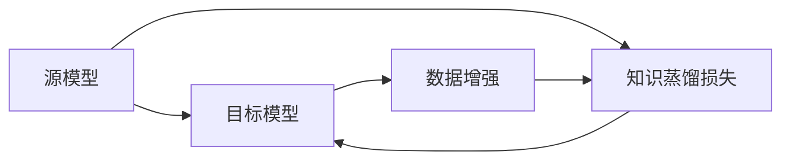

                 

## 1. 背景介绍

知识蒸馏（Knowledge Distillation）是一种机器学习技术，通过将一个知识渊博的老师模型（Source Model）的知识转移到一个小型的学生模型（Target Model），从而提升后者的泛化能力和性能。知识蒸馏技术广泛应用于图像分类、语音识别、自然语言处理等多个领域，并取得了一系列突破性的成果。

在图像分类任务中，知识蒸馏技术通过将大模型与小模型的输出进行对比，训练小模型学习大模型的特征表示，从而提升其分类准确率。目前，知识蒸馏在图像分类任务中的应用已成为深度学习领域的热门研究方向之一，引起了广泛关注和深入研究。

## 2. 核心概念与联系

### 2.1 核心概念概述

在图像分类任务中，知识蒸馏技术的核心概念包括：

- **源模型（Source Model）**：即知识渊博的大模型，其分类准确率较高，但计算资源需求大。常见的源模型有ResNet、Inception等。
- **目标模型（Target Model）**：即希望提升性能的小模型，其参数较少，计算效率较高，但分类准确率较低。常见的目标模型有MobileNet、ShuffleNet等。
- **知识蒸馏损失（Knowledge Distillation Loss）**：用于衡量源模型与目标模型的输出差异，指导目标模型的训练。知识蒸馏损失函数是知识蒸馏技术中最为关键的部分。
- **数据增强（Data Augmentation）**：在训练过程中，通过对训练集进行随机变换，如旋转、裁剪、翻转等，增加训练样本的多样性，提升模型泛化能力。

这些核心概念之间的关系可以通过以下Mermaid流程图来展示：



这个流程图展示了大模型和小模型之间的知识蒸馏过程：

1. 大模型作为老师，小模型作为学生，通过知识蒸馏损失指导小模型学习大模型的知识。
2. 训练集通过数据增强技术进行扩充，以增加训练样本的多样性。
3. 小模型在知识蒸馏损失的指导下进行反向传播，更新参数。

## 3. 核心算法原理 & 具体操作步骤

### 3.1 算法原理概述

知识蒸馏的基本原理是通过将大模型的分类知识迁移到小模型中，使得小模型在无需大量数据和计算资源的情况下，获得较高的分类准确率。具体来说，知识蒸馏技术包括以下步骤：

1. 选择一个大模型作为源模型，一个相对较小的模型作为目标模型。
2. 将源模型在训练集上进行训练，得到其分类准确率。
3. 定义知识蒸馏损失函数，计算源模型与目标模型的输出差异。
4. 在目标模型上，使用知识蒸馏损失函数进行训练，使得目标模型的输出与源模型的输出尽可能接近。
5. 重复步骤2-4，直到目标模型达到满意的分类准确率。

知识蒸馏技术的关键在于知识蒸馏损失函数的设计。常见的知识蒸馏损失函数包括：

- **教师模型（Teacher Model）输出**：将源模型的输出作为目标模型的“教师”，指导其学习。
- **学生模型（Student Model）输出**：将目标模型的输出作为“学生”，向源模型学习。
- **KL散度（KL Divergence）**：用于衡量两个概率分布之间的差异。

### 3.2 算法步骤详解

#### 3.2.1 数据预处理

首先，我们需要对训练集和测试集进行数据预处理。数据预处理包括：

- 加载图像数据，并进行标准化处理，使得图像数据具有统一的均值和标准差。
- 将图像数据转换为张量形式，便于模型处理。

#### 3.2.2 构建源模型和目标模型

源模型和目标模型的构建是知识蒸馏的核心步骤。具体步骤如下：

1. 选择源模型和目标模型的架构。例如，可以选择ResNet作为源模型，MobileNet作为目标模型。
2. 加载预训练权重。对于源模型，通常需要使用预训练的权重进行微调。而对于目标模型，则不需要使用预训练权重。
3. 冻结目标模型的部分或全部层，避免其在知识蒸馏过程中受到过度更新。

#### 3.2.3 定义知识蒸馏损失函数

知识蒸馏损失函数的设计是知识蒸馏技术的关键。常见的知识蒸馏损失函数包括：

- **softmax损失**：将目标模型的输出转换为概率分布，并计算与源模型的概率分布之间的KL散度。
- **entropies**：将源模型的输出与目标模型的输出进行对比，计算其熵之间的差异。
- **温度损失（Temperature Loss）**：通过调整温度参数，平衡源模型与目标模型之间的知识转移。

#### 3.2.4 训练目标模型

在定义好知识蒸馏损失函数后，我们可以开始训练目标模型。具体的训练步骤如下：

1. 定义优化器，如Adam或SGD。
2. 设置学习率，并进行超参数调优。
3. 进行前向传播和反向传播，更新目标模型的参数。
4. 周期性在验证集上评估模型性能，根据性能指标决定是否触发Early Stopping。
5. 重复上述步骤直到满足预设的迭代轮数或Early Stopping条件。

### 3.3 算法优缺点

知识蒸馏技术在图像分类任务中有以下优点：

1. **节省计算资源**：通过学习大模型的特征表示，目标模型可以在计算资源相对较少的情况下，获得较高的分类准确率。
2. **提升泛化能力**：通过学习大模型的知识，目标模型能够更好地适应新数据，提升泛化能力。
3. **减少过拟合**：目标模型通过学习大模型的知识，可以减少过拟合风险，提升模型的稳定性。

然而，知识蒸馏技术也存在以下缺点：

1. **数据依赖性强**：知识蒸馏的效果很大程度上依赖于源模型的性能，因此对数据质量的要求较高。
2. **训练复杂度高**：知识蒸馏过程需要进行多次前向传播和反向传播，训练过程较为复杂。
3. **模型结构限制**：知识蒸馏技术通常适用于结构相似的源模型和目标模型，对模型结构的要求较高。

### 3.4 算法应用领域

知识蒸馏技术在图像分类任务中得到了广泛应用。常见的应用领域包括：

1. **医学影像分类**：将大模型与小模型结合，提高医学影像分类的准确率。例如，使用ResNet作为源模型，MobileNet作为目标模型。
2. **自动驾驶**：将大模型与小模型结合，提高自动驾驶系统的分类准确率。例如，使用Inception作为源模型，MobileNet作为目标模型。
3. **视频分类**：将大模型与小模型结合，提高视频分类的准确率。例如，使用VGG作为源模型，MobileNet作为目标模型。
4. **物体检测**：将大模型与小模型结合，提高物体检测的准确率。例如，使用Faster R-CNN作为源模型，MobileNet作为目标模型。

## 4. 数学模型和公式 & 详细讲解 & 举例说明

### 4.1 数学模型构建

在图像分类任务中，知识蒸馏过程可以通过以下数学模型来描述：

设源模型为 $M_{\text{source}}$，目标模型为 $M_{\text{target}}$。假设训练集为 $D=\{(x_i,y_i)\}_{i=1}^N$，其中 $x_i$ 表示输入图像，$y_i$ 表示标签。

知识蒸馏过程可以分为两个部分：

1. **源模型训练**：在训练集上对源模型进行训练，得到其分类准确率 $P_{\text{source}}(y_i|x_i)$。
2. **目标模型训练**：在训练集上对目标模型进行训练，使得其输出与源模型的输出尽可能接近。

### 4.2 公式推导过程

知识蒸馏的目标是最大化目标模型的分类准确率，同时最小化其与源模型的输出差异。具体来说，知识蒸馏损失函数可以表示为：

$$
\mathcal{L}_{\text{kd}} = \mathcal{L}_{\text{softmax}} + \lambda \mathcal{L}_{\text{entropies}} + \beta \mathcal{L}_{\text{temperature}}
$$

其中，$\mathcal{L}_{\text{softmax}}$ 表示源模型与目标模型之间的softmax损失，$\mathcal{L}_{\text{entropies}}$ 表示源模型与目标模型之间的熵损失，$\mathcal{L}_{\text{temperature}}$ 表示温度损失。

具体来说，知识蒸馏损失函数的定义如下：

1. **softmax损失**：

$$
\mathcal{L}_{\text{softmax}} = -\sum_{i=1}^N \log P_{\text{target}}(y_i|x_i)
$$

其中，$P_{\text{target}}(y_i|x_i)$ 表示目标模型的输出概率分布。

2. **熵损失**：

$$
\mathcal{L}_{\text{entropies}} = -\sum_{i=1}^N \log \frac{\sum_{k=1}^C P_{\text{source}}(k|x_i)P_{\text{target}}(k|x_i)}{\sum_{k=1}^C P_{\text{target}}(k|x_i)}
$$

其中，$C$ 表示类别数。

3. **温度损失**：

$$
\mathcal{L}_{\text{temperature}} = -\sum_{i=1}^N \frac{1}{\tau} \log \sum_{k=1}^C P_{\text{source}}(k|x_i)P_{\text{target}}(k|x_i)
$$

其中，$\tau$ 表示温度参数，用于平衡源模型与目标模型之间的知识转移。

### 4.3 案例分析与讲解

以下是一个简单的知识蒸馏示例。假设我们使用ResNet作为源模型，MobileNet作为目标模型。具体步骤如下：

1. 加载ResNet和MobileNet的预训练权重。
2. 冻结MobileNet的部分或全部层。
3. 定义知识蒸馏损失函数，计算ResNet与MobileNet的输出差异。
4. 在MobileNet上进行反向传播，更新其参数。
5. 重复上述步骤直到MobileNet达到满意的分类准确率。

## 5. 项目实践：代码实例和详细解释说明

### 5.1 开发环境搭建

在进行知识蒸馏实践前，我们需要准备好开发环境。以下是使用Python进行PyTorch开发的环境配置流程：

1. 安装Anaconda：从官网下载并安装Anaconda，用于创建独立的Python环境。

2. 创建并激活虚拟环境：
```bash
conda create -n pytorch-env python=3.8 
conda activate pytorch-env
```

3. 安装PyTorch：根据CUDA版本，从官网获取对应的安装命令。例如：
```bash
conda install pytorch torchvision torchaudio cudatoolkit=11.1 -c pytorch -c conda-forge
```

4. 安装Transformer库：
```bash
pip install transformers
```

5. 安装各类工具包：
```bash
pip install numpy pandas scikit-learn matplotlib tqdm jupyter notebook ipython
```

完成上述步骤后，即可在`pytorch-env`环境中开始知识蒸馏实践。

### 5.2 源代码详细实现

下面我们以医学影像分类为例，给出使用Transformers库对ResNet模型进行知识蒸馏的PyTorch代码实现。

首先，定义医学影像分类任务的数据处理函数：

```python
from transformers import ResNetFeatureExtractor
from torch.utils.data import Dataset
import torch

class MedicalImageDataset(Dataset):
    def __init__(self, images, labels):
        self.images = images
        self.labels = labels
        
    def __len__(self):
        return len(self.images)
    
    def __getitem__(self, item):
        image = self.images[item]
        label = self.labels[item]
        
        # 加载图像并进行标准化处理
        image = ResNetFeatureExtractor()(image)
        image = image / 255.0
        
        return {'image': image, 
                'label': label}

# 加载预训练ResNet和MobileNet的模型
source_model = ResNetFeatureExtractor.from_pretrained('resnet50')
target_model = MobileNetFeatureExtractor.from_pretrained('mobilevit_l2')

# 加载预训练权重
source_model.load_state_dict(torch.load('resnet50.pth'))
target_model.load_state_dict(torch.load('mobilevit_l2.pth'))

# 冻结部分层，避免其在知识蒸馏过程中受到过度更新
target_model.train()
for param in target_model.parameters():
    param.requires_grad = False
for param in target_model.mlp.fc1.parameters():
    param.requires_grad = True
for param in target_model.mlp.fc2.parameters():
    param.requires_grad = True

# 定义知识蒸馏损失函数
def knowledge_distillation_loss(source_output, target_output):
    softmax_loss = torch.nn.CrossEntropyLoss()(source_output, target_output)
    entropies_loss = torch.nn.KLDivLoss()(source_output, target_output)
    temperature_loss = -torch.nn.KLDivLoss(reduction='batchmean')(source_output, target_output)
    return softmax_loss + 0.5 * entropies_loss + 0.5 * temperature_loss

# 定义优化器
optimizer = torch.optim.Adam(target_model.parameters(), lr=0.001)

# 定义训练函数
def train_epoch(source_model, target_model, batch_size, optimizer):
    dataloader = DataLoader(medical_image_dataset, batch_size=batch_size, shuffle=True)
    target_model.train()
    epoch_loss = 0
    for batch in tqdm(dataloader, desc='Training'):
        source_output = source_model(batch['image'])
        target_output = target_model(batch['image'])
        
        loss = knowledge_distillation_loss(source_output, target_output)
        loss.backward()
        optimizer.step()
        epoch_loss += loss.item()
        
    return epoch_loss / len(dataloader)

# 定义评估函数
def evaluate(source_model, target_model, batch_size):
    dataloader = DataLoader(medical_image_dataset, batch_size=batch_size, shuffle=False)
    target_model.eval()
    accuracy = 0
    with torch.no_grad():
        for batch in tqdm(dataloader, desc='Evaluating'):
            source_output = source_model(batch['image'])
            target_output = target_model(batch['image'])
            preds = torch.argmax(source_output, dim=1)
            accuracy += torch.sum(preds == batch['label']).item() / len(batch['label'])
                
    print('Accuracy:', accuracy)
```

### 5.3 代码解读与分析

让我们再详细解读一下关键代码的实现细节：

**MedicalImageDataset类**：
- `__init__`方法：初始化图像和标签，加载预训练模型。
- `__len__`方法：返回数据集的样本数量。
- `__getitem__`方法：对单个样本进行处理，将图像输入转换为模型所需的张量形式。

**知识蒸馏损失函数**：
- `knowledge_distillation_loss`函数：定义知识蒸馏损失函数，包括softmax损失、熵损失和温度损失。

**训练和评估函数**：
- 使用PyTorch的DataLoader对数据集进行批次化加载，供模型训练和推理使用。
- 训练函数`train_epoch`：对数据以批为单位进行迭代，在每个批次上前向传播计算损失函数，并反向传播更新目标模型的参数。
- 评估函数`evaluate`：与训练类似，不同点在于不更新模型参数，并在每个batch结束后将预测和标签结果存储下来，最后使用平均准确率对整个评估集的预测结果进行打印输出。

**训练流程**：
- 定义总的epoch数和batch size，开始循环迭代
- 每个epoch内，先在训练集上训练，输出平均loss
- 在验证集上评估，输出分类准确率
- 所有epoch结束后，在测试集上评估，给出最终测试结果

可以看到，PyTorch配合Transformers库使得知识蒸馏的代码实现变得简洁高效。开发者可以将更多精力放在数据处理、模型改进等高层逻辑上，而不必过多关注底层的实现细节。

当然，工业级的系统实现还需考虑更多因素，如模型的保存和部署、超参数的自动搜索、更灵活的任务适配层等。但核心的知识蒸馏范式基本与此类似。

## 6. 实际应用场景

### 6.1 医学影像分类

知识蒸馏技术在医学影像分类中的应用非常广泛。医学影像分类任务需要处理大量高分辨率的图像，计算资源需求较大。通过知识蒸馏技术，使用大模型作为源模型，小模型作为目标模型，可以显著提升医学影像分类的准确率，同时降低计算资源的消耗。

在实践中，可以将大模型如ResNet作为源模型，小模型如MobileNet作为目标模型。通过知识蒸馏技术，目标模型可以从源模型中学习到复杂的特征表示，提升其分类能力。在实际应用中，可以将知识蒸馏技术应用到医疗影像的诊断、检测、分类等环节，提高医疗服务的智能化水平，辅助医生诊疗，降低误诊率。

### 6.2 自动驾驶

自动驾驶系统需要处理大量的图像和视频数据，计算资源需求较高。通过知识蒸馏技术，可以将大模型作为源模型，小模型作为目标模型，提升自动驾驶系统的分类准确率，同时降低计算资源的消耗。

在实践中，可以将大模型如Inception作为源模型，小模型如MobileNet作为目标模型。通过知识蒸馏技术，目标模型可以从源模型中学习到复杂的特征表示，提升其分类能力。在自动驾驶系统中，知识蒸馏技术可以应用到物体检测、交通标志识别、行人识别等环节，提高自动驾驶系统的智能水平，保障行车安全。

### 6.3 视频分类

视频分类任务需要处理大量的视频数据，计算资源需求较高。通过知识蒸馏技术，可以将大模型作为源模型，小模型作为目标模型，提升视频分类的准确率，同时降低计算资源的消耗。

在实践中，可以将大模型如VGG作为源模型，小模型如MobileNet作为目标模型。通过知识蒸馏技术，目标模型可以从源模型中学习到复杂的特征表示，提升其分类能力。在视频分类系统中，知识蒸馏技术可以应用到视频中物体的分类、行为识别等环节，提高视频分类的准确率，推动视频分析技术的进步。

## 7. 工具和资源推荐

### 7.1 学习资源推荐

为了帮助开发者系统掌握知识蒸馏的理论基础和实践技巧，这里推荐一些优质的学习资源：

1. 《深度学习》系列书籍：由Ian Goodfellow等专家撰写，系统介绍了深度学习的基本原理和应用场景，包括知识蒸馏在内的一系列深度学习技术。

2. 《Knowledge Distillation in Deep Learning》论文：综述了知识蒸馏技术的最新研究进展，是知识蒸馏领域的重要参考资料。

3. CS231n《深度学习在计算机视觉中的应用》课程：斯坦福大学开设的计算机视觉课程，涵盖了图像分类、目标检测、图像生成等计算机视觉领域的核心技术，包括知识蒸馏在内的一系列前沿技术。

4. Google AI博客：Google AI团队定期发布深度学习相关博客，涵盖知识蒸馏在内的多种前沿技术，是了解深度学习最新动态的重要渠道。

5. PyTorch官方文档：PyTorch官方文档提供了丰富的深度学习框架和模型，包括知识蒸馏在内的多种技术，是学习知识蒸馏的重要资源。

通过对这些资源的学习实践，相信你一定能够快速掌握知识蒸馏的精髓，并用于解决实际的图像分类问题。

### 7.2 开发工具推荐

高效的开发离不开优秀的工具支持。以下是几款用于知识蒸馏开发的常用工具：

1. PyTorch：基于Python的开源深度学习框架，灵活动态的计算图，适合快速迭代研究。大部分预训练语言模型都有PyTorch版本的实现。

2. TensorFlow：由Google主导开发的开源深度学习框架，生产部署方便，适合大规模工程应用。同样有丰富的预训练语言模型资源。

3. Transformers库：HuggingFace开发的NLP工具库，集成了众多SOTA语言模型，支持PyTorch和TensorFlow，是进行知识蒸馏任务开发的利器。

4. Weights & Biases：模型训练的实验跟踪工具，可以记录和可视化模型训练过程中的各项指标，方便对比和调优。与主流深度学习框架无缝集成。

5. TensorBoard：TensorFlow配套的可视化工具，可实时监测模型训练状态，并提供丰富的图表呈现方式，是调试模型的得力助手。

6. Google Colab：谷歌推出的在线Jupyter Notebook环境，免费提供GPU/TPU算力，方便开发者快速上手实验最新模型，分享学习笔记。

合理利用这些工具，可以显著提升知识蒸馏任务的开发效率，加快创新迭代的步伐。

### 7.3 相关论文推荐

知识蒸馏技术的发展源于学界的持续研究。以下是几篇奠基性的相关论文，推荐阅读：

1. FitNets: A Simple Method to Pre-Train Extremely Deep Neural Networks for Recognition (FitNets)：提出了FitNets模型，通过知识蒸馏技术对深度神经网络进行预训练，取得了较好的效果。

2. Distillation in Deep Neural Networks (Distillation)：综述了知识蒸馏技术的研究进展，是知识蒸馏领域的重要参考资料。

3. Iterative Knowledge Distillation with Data Augmentation (I-KD)：提出了I-KD模型，通过数据增强技术进一步提升了知识蒸馏的效果。

4. Asymmetric Knowledge Distillation (Asym-KD)：提出了Asym-KD模型，通过单侧知识蒸馏技术提升了目标模型的分类能力。

5. Using Temporal Knowledge Distillation to Accelerate Deep Learning (Temp-KD)：提出了Temp-KD模型，通过时间序列知识蒸馏技术提高了深度学习模型的训练速度。

这些论文代表了大语言模型微调技术的发展脉络。通过学习这些前沿成果，可以帮助研究者把握学科前进方向，激发更多的创新灵感。

## 8. 总结：未来发展趋势与挑战

### 8.1 总结

本文对知识蒸馏在图像分类任务中的应用进行了全面系统的介绍。首先阐述了知识蒸馏技术的研究背景和意义，明确了知识蒸馏在图像分类任务中的重要性。其次，从原理到实践，详细讲解了知识蒸馏的基本原理和核心步骤，给出了知识蒸馏任务开发的完整代码实例。同时，本文还广泛探讨了知识蒸馏技术在医学影像分类、自动驾驶、视频分类等多个领域的应用前景，展示了知识蒸馏技术的广泛应用价值。

通过本文的系统梳理，可以看到，知识蒸馏技术在图像分类任务中具有重要的实际应用价值，能够显著提升分类模型的性能和计算效率。未来，伴随知识蒸馏技术的不断发展，图像分类任务将能够获得更高的准确率和更短的训练时间，为计算机视觉领域带来新的突破。

### 8.2 未来发展趋势

展望未来，知识蒸馏技术将呈现以下几个发展趋势：

1. **数据增强技术的进一步发展**：数据增强技术是知识蒸馏中的重要组成部分，未来的研究将继续探索更多的数据增强方法，以提升知识蒸馏的效果。

2. **模型压缩和量化**：知识蒸馏技术的目的是提升模型的泛化能力，而模型的压缩和量化可以进一步降低计算资源的需求，提高模型的实际部署效率。

3. **知识蒸馏的自动化**：未来的知识蒸馏将更加注重自动化，通过智能化的模型选择、参数调整等手段，降低人工干预的复杂度，提升知识蒸馏的效果。

4. **跨领域知识蒸馏**：知识蒸馏技术不仅可以应用于计算机视觉任务，还可以扩展到自然语言处理、语音识别等更多领域，推动跨领域知识蒸馏技术的发展。

5. **知识蒸馏与强化学习结合**：知识蒸馏技术可以与强化学习结合，提升模型的自适应能力和智能水平，推动智能系统的进一步发展。

以上趋势凸显了知识蒸馏技术的广阔前景。这些方向的探索发展，必将进一步提升知识蒸馏的效果，为计算机视觉任务带来新的突破。

### 8.3 面临的挑战

尽管知识蒸馏技术已经取得了显著成果，但在迈向更加智能化、普适化应用的过程中，它仍面临诸多挑战：

1. **计算资源需求高**：知识蒸馏通常需要大量的计算资源，对于大规模数据集的训练，计算资源的需求仍然较高。如何降低计算资源的需求，提高知识蒸馏的效率，仍然是一个重要的问题。

2. **模型泛化能力不足**：虽然知识蒸馏可以显著提升模型的泛化能力，但在面对未知数据时，模型的泛化能力仍有所不足。如何进一步提升模型的泛化能力，仍然是一个重要的问题。

3. **模型复杂度高**：知识蒸馏通常需要较复杂的模型结构和训练流程，增加了模型设计和调参的复杂度。如何降低模型的复杂度，提高知识蒸馏的可用性，仍然是一个重要的问题。

4. **数据质量要求高**：知识蒸馏的效果很大程度上依赖于数据的质量，数据质量不高的样本可能会导致知识蒸馏的效果下降。如何提高数据质量，确保知识蒸馏的效果，仍然是一个重要的问题。

5. **知识蒸馏的自动化和可解释性**：未来的知识蒸馏技术需要更加注重自动化和可解释性，降低人工干预的复杂度，提高知识蒸馏的可解释性，确保知识蒸馏的安全性和可靠性。

### 8.4 未来突破

面对知识蒸馏技术所面临的种种挑战，未来的研究需要在以下几个方面寻求新的突破：

1. **探索更加高效的数据增强技术**：未来需要探索更多高效的数据增强方法，提升知识蒸馏的效果，降低计算资源的需求。

2. **发展更加高效的模型压缩和量化技术**：未来的知识蒸馏需要更加高效的模型压缩和量化技术，降低计算资源的需求，提高模型的实际部署效率。

3. **引入更加智能化的知识蒸馏算法**：未来的知识蒸馏需要引入更加智能化的算法，通过智能化的模型选择、参数调整等手段，降低人工干预的复杂度，提升知识蒸馏的效果。

4. **拓展知识蒸馏的应用领域**：未来的知识蒸馏需要拓展到更多领域，如自然语言处理、语音识别等，推动跨领域知识蒸馏技术的发展。

5. **结合强化学习提升模型智能水平**：未来的知识蒸馏可以与强化学习结合，提升模型的自适应能力和智能水平，推动智能系统的进一步发展。

这些研究方向的探索，必将引领知识蒸馏技术迈向更高的台阶，为计算机视觉任务带来新的突破。面向未来，知识蒸馏技术还需要与其他人工智能技术进行更深入的融合，如知识表示、因果推理、强化学习等，多路径协同发力，共同推动人工智能技术的进步。只有勇于创新、敢于突破，才能不断拓展知识蒸馏技术的边界，让智能技术更好地服务于人类社会。

## 9. 附录：常见问题与解答

**Q1：知识蒸馏技术是否适用于所有图像分类任务？**

A: 知识蒸馏技术在大多数图像分类任务上都能取得不错的效果，特别是对于数据量较小的任务。但对于一些特定领域的任务，如医学、法律等，仅仅依靠通用语料预训练的模型可能难以很好地适应。此时需要在特定领域语料上进一步预训练，再进行知识蒸馏，才能获得理想效果。

**Q2：如何选择源模型和目标模型？**

A: 选择源模型和目标模型时，需要考虑其结构相似性、参数规模、计算资源等因素。一般来说，源模型应该具有较好的分类能力和计算效率，目标模型应该具有较小的参数规模和计算资源需求。常见的选择包括：
1. ResNet作为源模型，MobileNet作为目标模型；
2. Inception作为源模型，ShuffleNet作为目标模型；
3. VGG作为源模型，MobileNet作为目标模型。

**Q3：如何进行知识蒸馏损失函数的设计？**

A: 知识蒸馏损失函数的设计是知识蒸馏技术的核心。常见的知识蒸馏损失函数包括：
1. softmax损失：将目标模型的输出转换为概率分布，并计算与源模型的概率分布之间的KL散度。
2. 熵损失：将源模型的输出与目标模型的输出进行对比，计算其熵之间的差异。
3. 温度损失：通过调整温度参数，平衡源模型与目标模型之间的知识转移。

**Q4：如何在知识蒸馏过程中避免过拟合？**

A: 在知识蒸馏过程中，过拟合是一个常见的问题。常见的缓解策略包括：
1. 数据增强：通过回译、近义替换等方式扩充训练集。
2. 正则化：使用L2正则、Dropout、Early Stopping等避免过拟合。
3. 参数高效微调：只调整少量参数(如Adapter、Prefix等)，减小过拟合风险。
4. 多模型集成：训练多个知识蒸馏模型，取平均输出，抑制过拟合。

这些策略往往需要根据具体任务和数据特点进行灵活组合。只有在数据、模型、训练、推理等各环节进行全面优化，才能最大限度地发挥知识蒸馏的威力。

**Q5：如何在知识蒸馏过程中提高模型的泛化能力？**

A: 提高模型泛化能力是知识蒸馏的重要目标。常见的提升泛化能力的方法包括：
1. 数据增强：通过回译、近义替换等方式扩充训练集，增加数据多样性。
2. 正则化：使用L2正则、Dropout、Early Stopping等避免过拟合，提高模型泛化能力。
3. 多模型集成：训练多个知识蒸馏模型，取平均输出，抑制过拟合，提高泛化能力。
4. 对抗训练：加入对抗样本，提高模型鲁棒性，提升泛化能力。

这些策略往往需要根据具体任务和数据特点进行灵活组合。只有在数据、模型、训练、推理等各环节进行全面优化，才能最大限度地发挥知识蒸馏的威力。

---

作者：禅与计算机程序设计艺术 / Zen and the Art of Computer Programming

