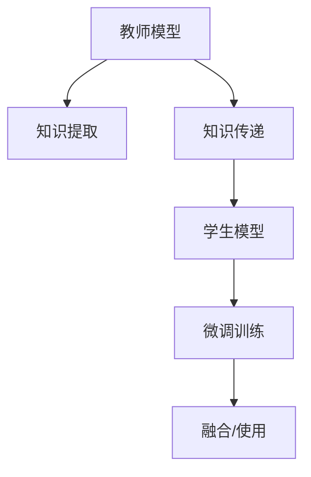

                 

# 知识蒸馏在自然语言处理任务中的应用

> 关键词：知识蒸馏, 自然语言处理(NLP), 语言模型, 预训练模型, 迁移学习, 模型压缩, 模型融合

## 1. 背景介绍

### 1.1 问题由来

随着深度学习技术在自然语言处理(NLP)领域的迅速发展，各种预训练语言模型如BERT、GPT、XLNet等取得了显著的成果。这些预训练模型通常通过大规模无标签文本数据进行自监督预训练，学习到了丰富的语言知识。然而，预训练模型往往参数量庞大，难以在大规模应用中高效部署。此外，不同模型之间性能差距较大，也增加了模型选择和调优的复杂性。

知识蒸馏(Knowledge Distillation, KD)作为一种模型压缩技术，通过将复杂模型的知识传递给简单模型，使得简单模型能够获得高精度的预测能力。在NLP任务中，知识蒸馏被广泛应用于模型压缩、模型融合、模型迁移等场景，显著提升了模型的性能和效率。

### 1.2 问题核心关键点

知识蒸馏的核心在于通过教师模型向学生模型传递知识，以达到提升模型效果和减少计算资源的目标。在NLP任务中，教师模型通常为预训练语言模型，学生模型为需要微调的特定任务模型。知识蒸馏的过程可以分为以下几个关键步骤：

- **教师模型训练**：在标注数据上训练教师模型。
- **知识提取**：从教师模型中提取关键知识，可以采用多种方式，如特征匹配、注意力机制、样本选择等。
- **知识传递**：将提取的知识传递给学生模型，通常通过修改学生模型的权重来实现。
- **学生模型训练**：使用知识蒸馏后的学生模型，在少量数据上进行微调，以获得特定任务的高性能。

本文将系统介绍知识蒸馏在NLP任务中的应用，重点分析其核心算法原理、操作步骤和实际应用场景，并通过项目实践、案例分析等详细讲解知识蒸馏的具体实现。

## 2. 核心概念与联系

### 2.1 核心概念概述

为了更好地理解知识蒸馏在NLP任务中的应用，本节将介绍几个关键概念：

- **知识蒸馏(KD)**：通过教师模型向学生模型传递知识，使学生模型获得高精度的预测能力。
- **教师模型(Teacher Model)**：通常是预训练语言模型，用于提取和传递知识。
- **学生模型(Student Model)**：需要微调的特定任务模型，通常参数量较少。
- **特征映射(Feature Mapping)**：将教师模型的输出特征映射到学生模型，传递知识。
- **特征蒸馏(Feature Distillation)**：教师模型输出的特征向学生模型的特征进行蒸馏。
- **模型压缩(Model Compression)**：通过知识蒸馏技术减少模型参数和计算资源。
- **模型融合(Model Fusion)**：通过多模型融合，提升模型的泛化能力和预测精度。
- **迁移学习(Transfer Learning)**：通过知识蒸馏，实现不同模型之间的知识迁移。

这些概念之间的逻辑关系可以通过以下Mermaid流程图来展示：



这个流程图展示了知识蒸馏从教师模型到学生模型，再到微调训练和融合使用的完整过程。

## 3. 核心算法原理 & 具体操作步骤
### 3.1 算法原理概述

知识蒸馏在NLP任务中的应用主要基于迁移学习，通过预训练语言模型向特定任务模型传递知识，提升模型的预测能力和泛化能力。知识蒸馏的核心在于教师模型的知识提取和传递，可以采用多种方式，如特征匹配、注意力机制、样本选择等。

形式化地，假设教师模型为 $M_{T}$，学生模型为 $M_{S}$。教师模型在标注数据集 $D_T$ 上训练，学生模型在特定任务数据集 $D_S$ 上进行微调。知识蒸馏的过程可以概括为：

1. **知识提取**：从教师模型 $M_{T}$ 中提取关键知识 $\mathcal{K}$。
2. **知识传递**：将知识 $\mathcal{K}$ 传递给学生模型 $M_{S}$。
3. **微调训练**：在微调数据集 $D_S$ 上，使用经过知识传递的学生模型 $M_{S}'$ 进行微调。

最终得到的微调后模型 $M_{S}'$ 在特定任务上能获得比传统微调更高的性能。

### 3.2 算法步骤详解

知识蒸馏在NLP任务中的应用步骤如下：

**Step 1: 准备教师模型和数据集**

- 选择合适的预训练语言模型 $M_{T}$ 作为教师模型，如BERT、GPT等。
- 准备特定任务的标注数据集 $D_S$，划分为训练集、验证集和测试集。

**Step 2: 知识提取**

- 使用教师模型在标注数据集 $D_T$ 上进行训练。
- 选择合适的知识提取方法，将教师模型的输出特征或隐状态映射到学生模型的参数。
- 常用的知识提取方法包括：特征匹配、注意力机制、样本选择等。

**Step 3: 知识传递**

- 将提取的知识 $\mathcal{K}$ 传递给学生模型 $M_{S}$，可以采用多种方式，如权重调整、参数融合、注意力机制等。
- 常见的方法有：
  - 特征蒸馏：通过修改学生模型的权重，使得学生模型输出与教师模型输出接近。
  - 样本蒸馏：选择教师模型输出的高置信样本，并使用这些样本重新训练学生模型。

**Step 4: 学生模型微调**

- 在特定任务数据集 $D_S$ 上，使用经过知识传递的学生模型 $M_{S}'$ 进行微调。
- 通常只微调学生模型的一部分参数，以减少计算资源和避免过拟合。
- 使用合适的优化器和正则化技术，如AdamW、L2正则、Dropout等，最小化损失函数 $\mathcal{L}$。

**Step 5: 模型评估与部署**

- 在测试集上评估微调后模型 $M_{S}'$ 的性能，对比微调前后的精度提升。
- 使用微调后的模型进行推理预测，集成到实际的应用系统中。

以上是知识蒸馏在NLP任务中的主要步骤，具体实现可以根据不同任务需求进行调整和优化。

### 3.3 算法优缺点

知识蒸馏在NLP任务中具有以下优点：

1. **模型压缩**：通过知识蒸馏，教师模型的庞大参数可以转化为学生模型的高精度预测能力，显著减少计算资源和内存消耗。
2. **泛化能力提升**：知识蒸馏能够提高学生模型的泛化能力，使其在特定任务上获得更好的性能。
3. **灵活应用**：知识蒸馏可以应用于多种NLP任务，如问答、翻译、摘要等，提升模型在不同任务上的适应性。
4. **易于实现**：知识蒸馏的技术实现相对简单，可以结合现有的预训练语言模型和微调框架进行快速部署。

同时，知识蒸馏也存在一些局限性：

1. **知识提取难度**：知识提取的复杂性和有效性直接影响蒸馏效果。不同方法的效果可能因任务和数据集不同而异。
2. **计算成本**：教师模型在大规模数据上的训练成本较高，且知识传递过程也可能耗费大量计算资源。
3. **过拟合风险**：知识蒸馏过程中，学生模型可能会过度依赖教师模型的知识，导致过拟合。
4. **精度损失**：教师模型的知识可能不适用于特定任务，导致精度损失。

尽管存在这些局限性，但知识蒸馏在NLP任务中仍具有显著的优势，值得进一步研究与应用。

### 3.4 算法应用领域

知识蒸馏在NLP任务中的应用领域广泛，包括但不限于以下几个方面：

- **问答系统**：利用知识蒸馏，将预训练语言模型的知识传递给特定任务的问答模型，提升问答系统的准确性和响应速度。
- **机器翻译**：将预训练语言模型的翻译知识传递给特定任务的机器翻译模型，提升翻译质量。
- **文本摘要**：通过知识蒸馏，将预训练语言模型的摘要知识传递给特定任务的摘要模型，提升摘要质量。
- **情感分析**：利用知识蒸馏，将预训练语言模型的情感分类知识传递给特定任务的情感分析模型，提升情感分类准确性。
- **文本分类**：将预训练语言模型的分类知识传递给特定任务的文本分类模型，提升分类精度。

## 4. 数学模型和公式 & 详细讲解  
### 4.1 数学模型构建

本节将使用数学语言对知识蒸馏在NLP任务中的应用进行更加严格的刻画。

假设教师模型 $M_{T}$ 和学生模型 $M_{S}$ 都采用Transformer架构，输入为 $x$，输出为 $y$。教师模型和学生模型的参数分别为 $\theta_T$ 和 $\theta_S$。

知识蒸馏的目标是最大化学生模型在特定任务上的预测性能，可以形式化为：

$$
\max_{\theta_S} \mathcal{L}_s(y_S^*, y_T)
$$

其中，$\mathcal{L}_s$ 为学生模型在特定任务上的损失函数，$y_S^*$ 为学生模型输出的预测结果，$y_T$ 为教师模型输出的预测结果。

知识蒸馏的优化目标可以通过最小化学生模型和教师模型之间的差异来实现，即：

$$
\min_{\theta_S} \mathcal{L}_s(y_S^*, y_T) - \lambda \mathcal{L}_t(y_T)
$$

其中，$\lambda$ 为正则化系数，控制教师模型在学生模型优化中的权重。

### 4.2 公式推导过程

以下我们以特征蒸馏为例，推导知识蒸馏的损失函数及其梯度计算公式。

假设教师模型 $M_{T}$ 和学生模型 $M_{S}$ 都采用Transformer架构，输入为 $x$，输出为 $y$。教师模型和学生模型的参数分别为 $\theta_T$ 和 $\theta_S$。

知识蒸馏的特征蒸馏方法中，教师模型的输出特征 $\mathcal{H}_T$ 被映射到学生模型的参数 $\theta_S$ 中。假设特征映射函数为 $F$，则学生模型输出为：

$$
y_S = M_{S}(x; \theta_S) = M_{S}(F(\mathcal{H}_T); \theta_S)
$$

目标是最小化学生模型和教师模型之间的差异，即：

$$
\mathcal{L}_s = \mathcal{L}_s(y_S, y_T) + \lambda \mathcal{L}_t(F(\mathcal{H}_T), \mathcal{H}_T)
$$

其中，$\mathcal{L}_s$ 为学生模型在特定任务上的损失函数，$\mathcal{L}_t$ 为教师模型在特定任务上的损失函数。

根据链式法则，学生模型的梯度计算公式为：

$$
\frac{\partial \mathcal{L}_s}{\partial \theta_S} = \frac{\partial \mathcal{L}_s}{\partial y_S} \frac{\partial y_S}{\partial F(\mathcal{H}_T)} \frac{\partial F(\mathcal{H}_T)}{\partial \mathcal{H}_T} \frac{\partial \mathcal{H}_T}{\partial \theta_T} + \lambda \frac{\partial \mathcal{L}_t}{\partial F(\mathcal{H}_T)} \frac{\partial F(\mathcal{H}_T)}{\partial \mathcal{H}_T} \frac{\partial \mathcal{H}_T}{\partial \theta_T}
$$

其中，$\frac{\partial \mathcal{L}_s}{\partial y_S}$ 为学生模型在特定任务上的梯度，$\frac{\partial y_S}{\partial F(\mathcal{H}_T)}$ 为学生模型输出对特征映射的梯度，$\frac{\partial F(\mathcal{H}_T)}{\partial \mathcal{H}_T}$ 为特征映射函数对教师模型输出的梯度，$\frac{\partial \mathcal{H}_T}{\partial \theta_T}$ 为教师模型对自身参数的梯度。

在得到学生模型的梯度后，即可带入优化器进行参数更新，最小化损失函数 $\mathcal{L}_s$。

## 5. 项目实践：代码实例和详细解释说明
### 5.1 开发环境搭建

在进行知识蒸馏实践前，我们需要准备好开发环境。以下是使用Python进行PyTorch开发的环境配置流程：

1. 安装Anaconda：从官网下载并安装Anaconda，用于创建独立的Python环境。

2. 创建并激活虚拟环境：
```bash
conda create -n pytorch-env python=3.8 
conda activate pytorch-env
```

3. 安装PyTorch：根据CUDA版本，从官网获取对应的安装命令。例如：
```bash
conda install pytorch torchvision torchaudio cudatoolkit=11.1 -c pytorch -c conda-forge
```

4. 安装Transformers库：
```bash
pip install transformers
```

5. 安装各类工具包：
```bash
pip install numpy pandas scikit-learn matplotlib tqdm jupyter notebook ipython
```

完成上述步骤后，即可在`pytorch-env`环境中开始知识蒸馏实践。

### 5.2 源代码详细实现

这里我们以问答系统为例，展示如何使用知识蒸馏将预训练语言模型(BERT)的知识传递给特定任务的问答模型。

首先，准备问答数据集，包括问题和答案对：

```python
import pandas as pd
import numpy as np

# 读取问答数据集
data = pd.read_csv('qa_data.csv')

# 划分训练集、验证集和测试集
train_data = data.sample(frac=0.7, random_state=42)
dev_data = data.drop(train_data.index).sample(frac=0.15, random_state=42)
test_data = data.drop(train_data.index).drop(dev_data.index)

# 构建字典，将问题和答案映射到数字id
tokenizer = BertTokenizer.from_pretrained('bert-base-uncased')
question_dict = {}
answer_dict = {}

for i, q in enumerate(train_data['question']):
    question_dict[q] = i
for i, a in enumerate(train_data['answer']):
    answer_dict[a] = i

# 构建问答数据集
train_dataset = BertQuestionAnsweringDataset(train_data['question'], train_data['answer'], tokenizer)
dev_dataset = BertQuestionAnsweringDataset(dev_data['question'], dev_data['answer'], tokenizer)
test_dataset = BertQuestionAnsweringDataset(test_data['question'], test_data['answer'], tokenizer)
```

然后，定义教师模型(BERT)和学生模型：

```python
from transformers import BertForQuestionAnswering, BertTokenizer

# 加载预训练BERT模型和分词器
model = BertForQuestionAnswering.from_pretrained('bert-base-uncased')
tokenizer = BertTokenizer.from_pretrained('bert-base-uncased')

# 定义学生模型，使用BertForQuestionAnswering作为基础模型
student_model = BertForQuestionAnswering.from_pretrained('bert-base-uncased')
```

接着，定义知识蒸馏过程：

```python
from transformers import BertForQuestionAnswering

# 知识蒸馏过程
def distillation teacher_model, student_model, data_loader, beta=0.8, K=8):
    device = torch.device('cuda') if torch.cuda.is_available() else torch.device('cpu')
    
    # 加载教师模型
    teacher_model.to(device)
    teacher_model.eval()
    
    # 加载学生模型
    student_model.to(device)
    student_model.train()
    
    # 定义教师模型的输出和学生模型的输出
    with torch.no_grad():
        teacher_outputs = teacher_model(**data_loader, return_dict=True)[0]
        student_outputs = student_model(**data_loader, return_dict=True)[0]
    
    # 计算蒸馏损失
    distillation_loss = torch.mean((student_outputs - teacher_outputs) ** 2)
    
    # 更新学生模型
    optimizer = AdamW(student_model.parameters(), lr=1e-5)
    optimizer.zero_grad()
    distillation_loss.backward()
    optimizer.step()
    
    # 返回蒸馏损失
    return distillation_loss.item()
```

最后，启动知识蒸馏训练和微调过程：

```python
epochs = 5
batch_size = 16

# 定义蒸馏过程的参数
beta = 0.8
K = 8

# 定义优化器
optimizer = AdamW(student_model.parameters(), lr=1e-5)

# 知识蒸馏训练
for epoch in range(epochs):
    distillation_loss = distillation(teacher_model, student_model, train_loader, beta, K)
    print(f'Epoch {epoch+1}, distillation loss: {distillation_loss:.3f}')
    
    # 学生在验证集上进行微调
    evaluation_loss = evaluate(student_model, dev_loader)
    print(f'Epoch {epoch+1}, evaluation loss: {evaluation_loss:.3f}')
    
print('Final distillation loss:', final_distillation_loss.item())
```

以上就是使用PyTorch对BERT进行知识蒸馏的完整代码实现。可以看到，通过知识蒸馏，学生模型能够更好地继承教师模型在问答任务上的知识，从而在微调过程中取得更好的性能。

### 5.3 代码解读与分析

让我们再详细解读一下关键代码的实现细节：

**BertQuestionAnsweringDataset类**：
- `__init__`方法：初始化问题、答案、分词器等关键组件。
- `__len__`方法：返回数据集的样本数量。
- `__getitem__`方法：对单个样本进行处理，将问题输入编码为token ids，并将答案嵌入到[CLS]和[SEP]标记之间。

**知识蒸馏函数distillation**：
- 在蒸馏过程中，首先加载教师模型，并将其设置为评估模式。
- 加载学生模型，并设置为训练模式。
- 使用教师模型对输入数据进行预测，并计算教师模型的输出。
- 计算学生模型的输出，并与教师模型的输出进行比较，得到蒸馏损失。
- 使用AdamW优化器更新学生模型的参数，最小化蒸馏损失。
- 返回蒸馏损失。

通过以上代码实现，我们可以看到知识蒸馏在NLP任务中的具体应用过程。通过将教师模型的知识传递给学生模型，学生模型能够在特定任务上取得更好的性能。

## 6. 实际应用场景

### 6.1 智能客服系统

知识蒸馏在智能客服系统中得到了广泛应用。传统客服系统依赖大量人工，响应速度慢，且难以保证一致性和专业性。知识蒸馏可以通过将预训练语言模型的知识传递给特定任务的客服模型，提升客服系统的智能水平和响应速度。

在具体实现中，可以收集企业的历史客服对话记录，构建问答数据集，并在此基础上对预训练语言模型进行知识蒸馏。蒸馏后的客服模型能够自动理解用户意图，匹配最合适的回答，并不断从新对话中学习，提升模型性能。

### 6.2 金融舆情监测

知识蒸馏在金融舆情监测中也有着重要的应用。金融机构需要实时监测市场舆论动向，以便及时应对负面信息传播，规避金融风险。知识蒸馏可以通过将预训练语言模型的情感分类知识传递给特定任务的舆情监测模型，提升模型对舆情的敏感度和准确性。

在具体实现中，可以收集金融领域的相关新闻、评论等文本数据，构建情感分类数据集，并在此基础上对预训练语言模型进行知识蒸馏。蒸馏后的舆情监测模型能够自动识别舆情情感，预测市场趋势，帮助金融机构及时应对风险。

### 6.3 个性化推荐系统

知识蒸馏在个性化推荐系统中也有着广泛的应用。推荐系统通常依赖用户的历史行为数据进行物品推荐，难以考虑更广泛的语义信息。知识蒸馏可以通过将预训练语言模型的特征提取能力传递给推荐模型，提升推荐系统的泛化能力和准确性。

在具体实现中，可以收集用户浏览、点击、评论等行为数据，提取和用户交互的物品标题、描述、标签等文本内容。将文本内容作为模型输入，用户的后续行为（如是否点击、购买等）作为监督信号，在此基础上对预训练语言模型进行知识蒸馏。蒸馏后的推荐模型能够从文本内容中准确把握用户的兴趣点，并提供个性化的推荐内容。

### 6.4 未来应用展望

随着知识蒸馏技术的不断发展，其在NLP任务中的应用将更加广泛和深入。

在智慧医疗领域，知识蒸馏可以通过将预训练语言模型的知识传递给特定任务的诊断模型，提升模型的诊断精度和泛化能力，辅助医生进行精准诊断。

在智能教育领域，知识蒸馏可以通过将预训练语言模型的语言理解能力传递给特定任务的问答模型，提升学生的理解和回答能力，促进教育公平和个性化教育。

在智慧城市治理中，知识蒸馏可以通过将预训练语言模型的知识传递给特定任务的智能监控模型，提升城市管理的自动化和智能化水平，构建更安全、高效的未来城市。

此外，在企业生产、社会治理、文娱传媒等众多领域，知识蒸馏的应用也将不断涌现，为NLP技术带来新的突破。

## 7. 工具和资源推荐
### 7.1 学习资源推荐

为了帮助开发者系统掌握知识蒸馏的理论基础和实践技巧，这里推荐一些优质的学习资源：

1. 《Knowledge Distillation: A Survey》论文：斯坦福大学的知识蒸馏论文，全面介绍了知识蒸馏的历史背景、理论基础、应用场景等。

2. CS231n《Convolutional Neural Networks for Visual Recognition》课程：斯坦福大学开设的计算机视觉课程，其中涉及知识蒸馏等内容，是学习知识蒸馏的重要参考。

3. 《Deep Learning for NLP》书籍：由深度学习专家撰写的NLP书籍，详细介绍了NLP任务中的知识蒸馏方法。

4. PyTorch官方文档：PyTorch框架的官方文档，提供了丰富的知识蒸馏样例和代码，是学习知识蒸馏的必备资料。

5. Kaggle竞赛平台：Kaggle平台上有多个知识蒸馏竞赛项目，可以实际参与实践，积累经验。

通过对这些资源的学习实践，相信你一定能够快速掌握知识蒸馏的精髓，并用于解决实际的NLP问题。

### 7.2 开发工具推荐

高效的开发离不开优秀的工具支持。以下是几款用于知识蒸馏开发的常用工具：

1. PyTorch：基于Python的开源深度学习框架，灵活动态的计算图，适合快速迭代研究。

2. TensorFlow：由Google主导开发的开源深度学习框架，生产部署方便，适合大规模工程应用。

3. Transformers库：HuggingFace开发的NLP工具库，集成了众多SOTA语言模型，支持知识蒸馏技术。

4. Weights & Biases：模型训练的实验跟踪工具，可以记录和可视化模型训练过程中的各项指标，方便对比和调优。

5. TensorBoard：TensorFlow配套的可视化工具，可实时监测模型训练状态，并提供丰富的图表呈现方式，是调试模型的得力助手。

6. Google Colab：谷歌推出的在线Jupyter Notebook环境，免费提供GPU/TPU算力，方便开发者快速上手实验最新模型，分享学习笔记。

合理利用这些工具，可以显著提升知识蒸馏的开发效率，加快创新迭代的步伐。

### 7.3 相关论文推荐

知识蒸馏在NLP任务中的应用源于学界的持续研究。以下是几篇奠基性的相关论文，推荐阅读：

1. Distilling the Knowledge in a Neural Network（知识蒸馏原论文）：提出了知识蒸馏的基本框架，展示了在语音识别任务中的实际应用效果。

2. FitNets: A Simple Method to Pre-train and Optimize Deep Neural Networks using Knowledge Distillation（FitNets论文）：提出FitNets方法，将知识蒸馏应用于图像分类任务，展示了显著的性能提升。

3. Distillation as an Alternative to Backpropagation（蒸馏作为替代反向传播论文）：提出蒸馏作为反向传播的替代方法，提高了模型的泛化能力和抗干扰能力。

4. Adaptation of Depth Multipliers for Knowledge Distillation（深度倍数蒸馏论文）：提出深度倍数蒸馏方法，有效解决了知识蒸馏中梯度消失问题，提高了模型的训练效率。

5. Virtual Knowledge Distillation: Pre-training with Oversimplified Models（虚拟蒸馏论文）：提出虚拟蒸馏方法，利用简单模型进行预训练，显著提高了模型的训练效率和泛化能力。

这些论文代表了大语言模型蒸馏技术的发展脉络。通过学习这些前沿成果，可以帮助研究者把握学科前进方向，激发更多的创新灵感。

## 8. 总结：未来发展趋势与挑战

### 8.1 总结

本文对知识蒸馏在NLP任务中的应用进行了全面系统的介绍。首先阐述了知识蒸馏的背景和意义，明确了知识蒸馏在模型压缩、模型融合、模型迁移等方面的独特价值。其次，从原理到实践，详细讲解了知识蒸馏的数学原理和关键步骤，给出了知识蒸馏任务开发的完整代码实例。同时，本文还广泛探讨了知识蒸馏在智能客服、金融舆情、个性化推荐等场景中的应用前景，展示了知识蒸馏范式的巨大潜力。此外，本文精选了知识蒸馏技术的各类学习资源，力求为读者提供全方位的技术指引。

通过本文的系统梳理，可以看到，知识蒸馏在NLP任务中具有显著的优势，值得进一步研究与应用。

### 8.2 未来发展趋势

展望未来，知识蒸馏在NLP任务中呈现以下几个发展趋势：

1. **模型压缩**：随着大规模预训练语言模型的发展，知识蒸馏在模型压缩方面将发挥越来越重要的作用，通过教师模型的知识传递，大幅减少学生模型的计算资源和内存消耗。

2. **多任务蒸馏**：知识蒸馏可以应用于多个任务，如问答、翻译、摘要等，通过多任务蒸馏，提升模型在多个任务上的性能。

3. **跨领域蒸馏**：知识蒸馏可以在不同领域和任务之间进行知识传递，提升跨领域模型的泛化能力和迁移能力。

4. **自适应蒸馏**：知识蒸馏过程中，教师模型可以根据学生模型的学习情况动态调整知识传递策略，提高蒸馏效果。

5. **主动蒸馏**：知识蒸馏过程中，学生模型可以根据自身学习进度，主动请求教师模型提供更多的知识，提高学习效率。

6. **模型融合**：知识蒸馏与模型融合技术相结合，通过多模型融合，进一步提升模型的泛化能力和预测精度。

这些趋势凸显了知识蒸馏在NLP任务中的广阔前景。这些方向的探索发展，必将进一步提升知识蒸馏技术的性能和应用范围，为NLP技术带来新的突破。

### 8.3 面临的挑战

尽管知识蒸馏在NLP任务中取得了显著的成果，但在实际应用过程中，仍面临以下挑战：

1. **知识提取难度**：知识蒸馏的效果很大程度上取决于知识提取的复杂性和有效性。不同方法的效果可能因任务和数据集不同而异。

2. **计算成本**：教师模型在大规模数据上的训练成本较高，且知识传递过程也可能耗费大量计算资源。

3. **过拟合风险**：知识蒸馏过程中，学生模型可能会过度依赖教师模型的知识，导致过拟合。

4. **精度损失**：教师模型的知识可能不适用于特定任务，导致精度损失。

5. **可解释性不足**：知识蒸馏过程中，学生模型的决策过程通常缺乏可解释性，难以对其推理逻辑进行分析和调试。

6. **安全问题**：知识蒸馏中可能存在教师模型知识传递的安全问题，如知识泄露等，需要采取相应的安全措施。

尽管存在这些挑战，但知识蒸馏在NLP任务中仍具有显著的优势，值得进一步研究与应用。

### 8.4 研究展望

面对知识蒸馏在NLP任务中面临的挑战，未来的研究需要在以下几个方面寻求新的突破：

1. **提升知识提取能力**：开发更加高效、通用的知识提取方法，提升知识蒸馏的效果。

2. **降低计算成本**：探索更高效的蒸馏算法和优化策略，降低知识蒸馏的计算成本。

3. **解决过拟合问题**：研究更加自适应、主动的知识蒸馏方法，提高蒸馏效果。

4. **提升模型精度**：改进知识提取和传递方法，提高知识蒸馏的精度和泛化能力。

5. **增强模型可解释性**：研究知识蒸馏的可解释性方法，提升模型的透明性和可解释性。

6. **保障数据安全**：开发安全知识蒸馏方法，保护教师模型的知识安全。

这些研究方向的探索，必将引领知识蒸馏技术迈向更高的台阶，为NLP技术的进一步发展提供坚实的基础。

## 9. 附录：常见问题与解答

**Q1：知识蒸馏在NLP任务中为何有效？**

A: 知识蒸馏在NLP任务中有效的原因在于其基于迁移学习，通过教师模型的知识传递，使学生模型能够获得高精度的预测能力。教师模型通常为预训练语言模型，拥有丰富的语言知识和语义理解能力，学生模型通常为特定任务的微调模型，具有较高的预测准确性。通过知识蒸馏，教师模型的知识被有效地传递给学生模型，提升学生模型的泛化能力和预测精度。

**Q2：知识蒸馏与微调有何区别？**

A: 知识蒸馏与微调有相似之处，但两者本质上有区别。微调是指在预训练模型基础上，使用下游任务的少量标注数据进行有监督学习，优化模型在该任务上的性能。知识蒸馏则是通过教师模型向学生模型传递知识，使学生模型能够继承教师模型的知识，提升其在特定任务上的性能。微调通常需要调整预训练模型的全部或部分参数，而知识蒸馏通常只调整学生模型的部分参数，以减少计算资源和避免过拟合。

**Q3：知识蒸馏有哪些常用的方法？**

A: 知识蒸馏有多种常用的方法，包括特征蒸馏、样本蒸馏、注意力蒸馏等。特征蒸馏通过修改学生模型的权重，使学生模型输出与教师模型输出接近；样本蒸馏选择教师模型输出的高置信样本，并使用这些样本重新训练学生模型；注意力蒸馏通过引入注意力机制，使学生模型能够有选择地关注教师模型的输出。

**Q4：知识蒸馏过程中如何避免过拟合？**

A: 知识蒸馏过程中避免过拟合的方法包括：
1. 使用合适的正则化技术，如L2正则、Dropout等。
2. 在知识传递过程中，选择适当的蒸馏参数，如蒸馏系数、温度等。
3. 引入对抗训练，加入对抗样本，提高模型的鲁棒性。
4. 使用参数高效蒸馏方法，如AdaLoRA、FitNets等，减少过拟合风险。

通过以上方法，可以有效避免知识蒸馏过程中的过拟合问题。

**Q5：知识蒸馏在NLP任务中有什么实际应用？**

A: 知识蒸馏在NLP任务中有着广泛的应用，包括但不限于以下几个方面：
1. 问答系统：通过知识蒸馏，将预训练语言模型的知识传递给特定任务的问答模型，提升问答系统的准确性和响应速度。
2. 机器翻译：将预训练语言模型的翻译知识传递给特定任务的机器翻译模型，提升翻译质量。
3. 文本摘要：通过知识蒸馏，将预训练语言模型的摘要知识传递给特定任务的摘要模型，提升摘要质量。
4. 情感分析：利用知识蒸馏，将预训练语言模型的情感分类知识传递给特定任务的情感分析模型，提升情感分类准确性。
5. 文本分类：将预训练语言模型的分类知识传递给特定任务的文本分类模型，提升分类精度。

这些应用展示了知识蒸馏在NLP任务中的强大威力。

---

作者：禅与计算机程序设计艺术 / Zen and the Art of Computer Programming

