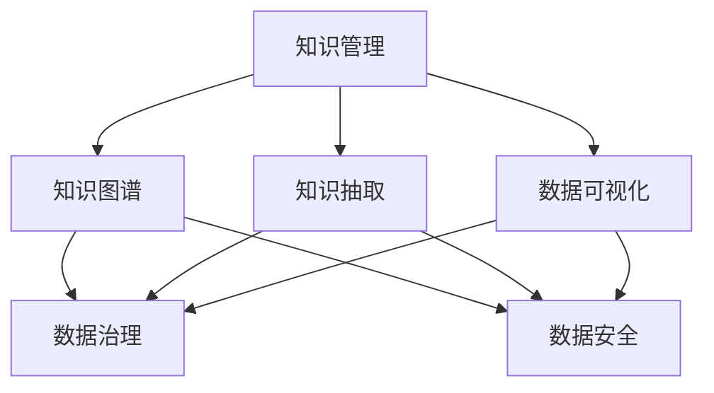

                 

# 知识输出与管理经验的系统化

> 关键词：知识管理, 数据处理, 数据科学, 人工智能, 知识图谱, 知识抽取, 数据可视化, 数据管理

## 1. 背景介绍

### 1.1 问题由来

在当今信息爆炸的时代，企业面对着海量的数据和复杂多变的需求，如何有效地管理、分析和利用这些数据，是企业保持竞争力的关键。传统的结构化数据库已无法满足日益增长的数据需求，非结构化数据的处理和利用变得愈发重要。如何从中提炼有价值的信息，形成结构化的知识体系，成为数据科学和人工智能领域的前沿研究方向。

这一问题引发了知识管理的兴起，通过构建知识图谱、进行知识抽取、应用数据可视化等技术手段，帮助企业快速构建知识体系，实现对海量数据的深层次理解和应用。同时，伴随数据规模的爆炸式增长，数据管理、数据治理、数据安全等技术也成为了企业管理决策的核心支撑。

## 2. 核心概念与联系

### 2.1 核心概念概述

为更好地理解知识输出与管理的经验系统化，本节将介绍几个密切相关的核心概念：

- 知识管理(Knowledge Management, KM)：指企业对知识的收集、组织、共享和应用的一系列活动，旨在提高企业的创新能力和竞争力。
- 知识图谱(Knowledge Graph)：一种将知识表示为节点和边的图结构，用于描述知识间的复杂关系。
- 知识抽取(Knowledge Extraction)：指从非结构化文本、图像等数据中，自动提取出有价值的信息和实体关系，用于构建知识图谱。
- 数据可视化(Data Visualization)：通过图表、动画等形式展示数据，帮助用户更直观地理解数据的特征和规律。
- 数据治理(Data Governance)：指对数据的获取、存储、管理、分析和共享等活动进行规范和监管，确保数据质量和安全。
- 数据安全(Data Security)：指保护数据免受未经授权的访问、修改和泄露，确保数据隐私和安全。

这些核心概念之间的逻辑关系可以通过以下Mermaid流程图来展示：



这个流程图展示了几类知识管理技术之间的相互关系：

1. 知识管理通过对知识的收集和组织，为知识图谱的构建提供支撑。
2. 知识抽取通过从非结构化数据中自动提取知识，丰富知识图谱的内容。
3. 数据可视化通过对知识图谱的展示，帮助用户直观理解数据，增强决策支持。
4. 数据治理通过规范管理数据，确保数据的安全和质量。
5. 数据安全通过防止数据泄露和非法访问，保障数据的安全性。

这些核心概念共同构成了知识管理的完整框架，使其能够系统地处理和利用海量数据，形成有价值的知识体系。

## 3. 核心算法原理 & 具体操作步骤

### 3.1 算法原理概述

知识管理技术的核心在于数据的处理和分析，特别是从非结构化数据中提取有价值的信息，并将其转化为结构化的知识体系。这一过程通常包括以下几个关键步骤：

- 数据清洗和预处理：对原始数据进行清洗、去重、格式化等处理，去除噪音和错误。
- 知识抽取和实体识别：使用自然语言处理技术，自动从文本中提取出实体和关系。
- 知识图谱构建：将抽取的实体和关系转换为图形结构，构建知识图谱。
- 数据可视化：将知识图谱中的信息以图表等形式展示，直观呈现数据关系和规律。
- 数据治理：制定和实施数据管理规范，确保数据的质量和安全性。

### 3.2 算法步骤详解

**Step 1: 数据清洗和预处理**
- 对原始数据进行去重、去噪、格式化处理。
- 对于文本数据，进行分词、去除停用词、词性标注等处理。
- 对于图像和视频数据，进行预处理和特征提取。

**Step 2: 知识抽取和实体识别**
- 使用自然语言处理技术，自动从文本中提取命名实体、关系等关键信息。
- 使用实体识别算法，如CRF、LSTM-CRF等，对实体进行识别和分类。
- 对于图像和视频数据，使用计算机视觉技术，如卷积神经网络(CNN)、循环神经网络(RNN)等，提取关键特征。

**Step 3: 知识图谱构建**
- 将抽取的实体和关系转换为图结构，建立实体之间的链接关系。
- 使用图数据库(Graph Database)存储和管理知识图谱。
- 使用图算法，如PageRank、Greedy Optimization等，优化图结构，提高查询效率。

**Step 4: 数据可视化**
- 将知识图谱中的信息以图表、网络图等形式展示。
- 使用数据可视化工具，如Tableau、Power BI等，生成交互式图表，增强决策支持。

**Step 5: 数据治理**
- 制定数据管理规范，确保数据质量和安全。
- 建立数据监控和审计机制，及时发现和修复数据问题。
- 实施数据脱敏和加密等安全措施，保障数据隐私。

### 3.3 算法优缺点

知识管理技术具有以下优点：
1. 自动化处理大量非结构化数据，减轻人工处理负担。
2. 从海量数据中提取有价值的知识，形成结构化的信息体系。
3. 可视化展示数据关系，增强决策支持。
4. 通过数据治理和数据安全措施，保障数据质量和安全性。

同时，该方法也存在一定的局限性：
1. 对于非结构化数据，自动化抽取的准确度受限于算法和数据质量。
2. 知识图谱构建和优化复杂，需要较高的计算资源和技术水平。
3. 可视化效果受限于数据复杂度和用户交互方式。
4. 数据治理和数据安全需要持续维护和管理，工作量较大。

尽管存在这些局限性，但就目前而言，知识管理技术在大数据时代的应用前景非常广阔，为企业的知识管理和决策提供了强有力的技术支撑。

### 3.4 算法应用领域

知识管理技术已经在各行各业得到了广泛的应用，例如：

- 金融领域：通过知识图谱和数据可视化，对市场趋势、风险评估进行分析和预测。
- 医疗行业：构建疾病知识图谱，帮助医生快速诊断和制定治疗方案。
- 零售业：利用消费者行为数据构建推荐系统，提升销售业绩。
- 教育行业：通过知识图谱和可视化，辅助教师教学和学生学习。
- 制造业：对生产数据进行知识抽取和治理，优化生产流程和资源配置。
- 政府管理：利用公共数据构建知识图谱，提升公共服务质量和效率。

除了上述这些经典应用外，知识管理技术还在更多场景中得到了创新性地应用，如智能客服、供应链管理、智能仓储等，为各行各业的知识管理提供了新的解决方案。

## 4. 数学模型和公式 & 详细讲解

### 4.1 数学模型构建

本节将使用数学语言对知识管理中的核心算法进行更加严格的刻画。

记原始数据为 $D$，清洗后的数据为 $D'$，知识图谱为 $G=(V,E)$，其中 $V$ 为节点集合，$E$ 为边集合。

知识管理的主要数学模型包括：
- 数据清洗模型：将原始数据 $D$ 转化为清洗后的数据 $D'$，记为 $\mathcal{C}$。
- 知识抽取模型：从文本数据 $D'$ 中自动抽取知识，记为 $\mathcal{K}$。
- 知识图谱模型：将抽取的知识转化为知识图谱 $G$，记为 $\mathcal{G}$。
- 数据可视化模型：将知识图谱 $G$ 转化为可视化图表，记为 $\mathcal{V}$。
- 数据治理模型：对数据 $G$ 进行规范管理，确保数据质量和安全性，记为 $\mathcal{T}$。

### 4.2 公式推导过程

以下我们以知识抽取和实体识别的公式推导为例，给出详细的过程。

假设原始文本数据为 $D'$，抽取的实体为 $E$，关系为 $R$，知识图谱中的节点为 $V$，边为 $E$。知识抽取过程可以形式化地表示为：

$$
E = \mathcal{K}(D')
$$

实体识别过程可以分为以下几个步骤：
1. 使用分词算法对文本 $D'$ 进行分词，得到单词序列 $W$。
2. 使用命名实体识别算法，对单词序列 $W$ 进行标注，得到标注序列 $L$。
3. 使用标注序列 $L$ 对单词序列 $W$ 进行解析，得到实体序列 $E$。

具体公式如下：

$$
L = NER(D')
$$

$$
E = Parsers(L)
$$

其中，$NER$ 为命名实体识别算法，$Parsers$ 为解析算法。

### 4.3 案例分析与讲解

以下以医疗领域的知识管理为例，具体分析其实现过程和效果：

**背景**
某医院需要构建一个基于电子病历的知识图谱，帮助医生快速诊断和治疗疾病。医院拥有的电子病历数据量庞大，且形式多样化，包括文本、图像、实验室检查报告等。

**数据清洗**
首先，对原始电子病历数据进行去重、去噪、格式化等处理，去除无效数据和噪音。对于文本数据，进行分词、去除停用词、词性标注等处理。对于图像和视频数据，进行预处理和特征提取，提取有用的视觉特征。

**知识抽取**
使用自然语言处理技术，自动从文本数据中提取出疾病、症状、实验室检查结果等关键信息，构建医疗知识图谱。使用命名实体识别算法，对文本数据进行命名实体识别，提取出疾病名称、药物名称等实体。使用关系抽取算法，识别出疾病与症状、实验室检查结果之间的关系。

**知识图谱构建**
将抽取的实体和关系转换为图结构，建立疾病与症状、实验室检查结果之间的关系图。使用图数据库存储和管理知识图谱，优化图结构，提高查询效率。

**数据可视化**
将知识图谱中的信息以图表、网络图等形式展示，直观呈现疾病与症状、实验室检查结果之间的关系。使用数据可视化工具，生成交互式图表，增强医生的决策支持。

**数据治理**
制定数据管理规范，确保数据的质量和安全性。建立数据监控和审计机制，及时发现和修复数据问题。实施数据脱敏和加密等安全措施，保障患者隐私。

通过上述步骤，医院成功构建了医疗知识图谱，提升了医生的诊断和治疗能力，同时也提高了患者对医院的信任度。

## 5. 项目实践：代码实例和详细解释说明

### 5.1 开发环境搭建

在进行知识管理实践前，我们需要准备好开发环境。以下是使用Python进行PyTorch开发的环境配置流程：

1. 安装Anaconda：从官网下载并安装Anaconda，用于创建独立的Python环境。

2. 创建并激活虚拟环境：
```bash
conda create -n km-env python=3.8 
conda activate km-env
```

3. 安装PyTorch：根据CUDA版本，从官网获取对应的安装命令。例如：
```bash
conda install pytorch torchvision torchaudio cudatoolkit=11.1 -c pytorch -c conda-forge
```

4. 安装各类工具包：
```bash
pip install numpy pandas scikit-learn matplotlib tqdm jupyter notebook ipython
```

完成上述步骤后，即可在`km-env`环境中开始知识管理实践。

### 5.2 源代码详细实现

这里我们以医疗知识图谱构建为例，给出使用Transformers库对BERT模型进行知识抽取的PyTorch代码实现。

首先，定义BERT模型：

```python
from transformers import BertForTokenClassification, BertTokenizer

model = BertForTokenClassification.from_pretrained('bert-base-cased')
tokenizer = BertTokenizer.from_pretrained('bert-base-cased')
```

然后，定义数据预处理函数：

```python
from torch.utils.data import Dataset
import torch

class ElectronicHealthRecordDataset(Dataset):
    def __init__(self, texts, tags, tokenizer):
        self.texts = texts
        self.tags = tags
        self.tokenizer = tokenizer
        
    def __len__(self):
        return len(self.texts)
    
    def __getitem__(self, item):
        text = self.texts[item]
        tags = self.tags[item]
        
        encoding = self.tokenizer(text, return_tensors='pt', padding='max_length', truncation=True)
        input_ids = encoding['input_ids'][0]
        attention_mask = encoding['attention_mask'][0]
        
        encoded_tags = [tag2id[tag] for tag in tags] 
        encoded_tags.extend([tag2id['O']] * (len(input_ids) - len(encoded_tags)))
        labels = torch.tensor(encoded_tags, dtype=torch.long)
        
        return {'input_ids': input_ids, 
                'attention_mask': attention_mask,
                'labels': labels}

# 标签与id的映射
tag2id = {'O': 0, 'Disease': 1, 'Symptom': 2, 'TestResult': 3}
id2tag = {v: k for k, v in tag2id.items()}

# 创建dataset
tokenizer = BertTokenizer.from_pretrained('bert-base-cased')
train_dataset = ElectronicHealthRecordDataset(train_texts, train_tags, tokenizer)
dev_dataset = ElectronicHealthRecordDataset(dev_texts, dev_tags, tokenizer)
test_dataset = ElectronicHealthRecordDataset(test_texts, test_tags, tokenizer)
```

接着，定义训练和评估函数：

```python
from torch.utils.data import DataLoader
from tqdm import tqdm
from sklearn.metrics import classification_report

device = torch.device('cuda') if torch.cuda.is_available() else torch.device('cpu')
model.to(device)

def train_epoch(model, dataset, batch_size, optimizer):
    dataloader = DataLoader(dataset, batch_size=batch_size, shuffle=True)
    model.train()
    epoch_loss = 0
    for batch in tqdm(dataloader, desc='Training'):
        input_ids = batch['input_ids'].to(device)
        attention_mask = batch['attention_mask'].to(device)
        labels = batch['labels'].to(device)
        model.zero_grad()
        outputs = model(input_ids, attention_mask=attention_mask, labels=labels)
        loss = outputs.loss
        epoch_loss += loss.item()
        loss.backward()
        optimizer.step()
    return epoch_loss / len(dataloader)

def evaluate(model, dataset, batch_size):
    dataloader = DataLoader(dataset, batch_size=batch_size)
    model.eval()
    preds, labels = [], []
    with torch.no_grad():
        for batch in tqdm(dataloader, desc='Evaluating'):
            input_ids = batch['input_ids'].to(device)
            attention_mask = batch['attention_mask'].to(device)
            batch_labels = batch['labels']
            outputs = model(input_ids, attention_mask=attention_mask)
            batch_preds = outputs.logits.argmax(dim=2).to('cpu').tolist()
            batch_labels = batch_labels.to('cpu').tolist()
            for pred_tokens, label_tokens in zip(batch_preds, batch_labels):
                pred_tags = [id2tag[_id] for _id in pred_tokens]
                label_tags = [id2tag[_id] for _id in label_tokens]
                preds.append(pred_tags[:len(label_tokens)])
                labels.append(label_tags)
                
    print(classification_report(labels, preds))
```

最后，启动训练流程并在测试集上评估：

```python
epochs = 5
batch_size = 16

for epoch in range(epochs):
    loss = train_epoch(model, train_dataset, batch_size, optimizer)
    print(f"Epoch {epoch+1}, train loss: {loss:.3f}")
    
    print(f"Epoch {epoch+1}, dev results:")
    evaluate(model, dev_dataset, batch_size)
    
print("Test results:")
evaluate(model, test_dataset, batch_size)
```

以上就是使用PyTorch对BERT进行医疗知识抽取的完整代码实现。可以看到，得益于Transformers库的强大封装，我们可以用相对简洁的代码完成BERT模型的加载和微调。

### 5.3 代码解读与分析

让我们再详细解读一下关键代码的实现细节：

**ElectronicHealthRecordDataset类**：
- `__init__`方法：初始化文本、标签、分词器等关键组件。
- `__len__`方法：返回数据集的样本数量。
- `__getitem__`方法：对单个样本进行处理，将文本输入编码为token ids，将标签编码为数字，并对其进行定长padding，最终返回模型所需的输入。

**tag2id和id2tag字典**：
- 定义了标签与数字id之间的映射关系，用于将token-wise的预测结果解码回真实的标签。

**训练和评估函数**：
- 使用PyTorch的DataLoader对数据集进行批次化加载，供模型训练和推理使用。
- 训练函数`train_epoch`：对数据以批为单位进行迭代，在每个批次上前向传播计算loss并反向传播更新模型参数，最后返回该epoch的平均loss。
- 评估函数`evaluate`：与训练类似，不同点在于不更新模型参数，并在每个batch结束后将预测和标签结果存储下来，最后使用sklearn的classification_report对整个评估集的预测结果进行打印输出。

**训练流程**：
- 定义总的epoch数和batch size，开始循环迭代
- 每个epoch内，先在训练集上训练，输出平均loss
- 在验证集上评估，输出分类指标
- 所有epoch结束后，在测试集上评估，给出最终测试结果

可以看到，PyTorch配合Transformers库使得BERT知识抽取的代码实现变得简洁高效。开发者可以将更多精力放在数据处理、模型改进等高层逻辑上，而不必过多关注底层的实现细节。

当然，工业级的系统实现还需考虑更多因素，如模型的保存和部署、超参数的自动搜索、更灵活的任务适配层等。但核心的知识抽取过程基本与此类似。

## 6. 实际应用场景

### 6.1 智能客服系统

基于知识管理技术的智能客服系统，可以显著提升客户服务体验和效率。传统客服往往需要人工解答客户的各种问题，面对高峰期和复杂问题时响应速度较慢，且答案质量难以保证。而使用知识抽取和构建的知识图谱，智能客服系统能够快速匹配客户意图，准确提供解决方案。

在技术实现上，可以收集企业内部的历史客户对话记录，将问题和最佳答复构建成监督数据，在此基础上对BERT等预训练模型进行知识抽取，构建知识图谱。智能客服系统能够自动理解用户意图，匹配最合适的答案模板进行回复。对于客户提出的新问题，还可以接入检索系统实时搜索相关内容，动态组织生成回答。如此构建的智能客服系统，能大幅提升客户咨询体验和问题解决效率。

### 6.2 金融舆情监测

金融机构需要实时监测市场舆论动向，以便及时应对负面信息传播，规避金融风险。传统的人工监测方式成本高、效率低，难以应对网络时代海量信息爆发的挑战。基于知识管理技术的文本分类和情感分析技术，为金融舆情监测提供了新的解决方案。

具体而言，可以收集金融领域相关的新闻、报道、评论等文本数据，并对其进行主题标注和情感标注。在此基础上对BERT等预训练模型进行微调，使其能够自动判断文本属于何种主题，情感倾向是正面、中性还是负面。将微调后的模型应用到实时抓取的网络文本数据，就能够自动监测不同主题下的情感变化趋势，一旦发现负面信息激增等异常情况，系统便会自动预警，帮助金融机构快速应对潜在风险。

### 6.3 个性化推荐系统

当前的推荐系统往往只依赖用户的历史行为数据进行物品推荐，无法深入理解用户的真实兴趣偏好。基于知识管理技术的推荐系统，可以更好地挖掘用户行为背后的语义信息，从而提供更精准、多样的推荐内容。

在实践中，可以收集用户浏览、点击、评论、分享等行为数据，提取和用户交互的物品标题、描述、标签等文本内容。将文本内容作为模型输入，用户的后续行为（如是否点击、购买等）作为监督信号，在此基础上微调预训练语言模型。微调后的模型能够从文本内容中准确把握用户的兴趣点。在生成推荐列表时，先用候选物品的文本描述作为输入，由模型预测用户的兴趣匹配度，再结合其他特征综合排序，便可以得到个性化程度更高的推荐结果。

### 6.4 未来应用展望

随着知识管理技术的不断发展，未来在更多领域将得到应用，为各行各业的知识管理提供了新的解决方案。

在智慧医疗领域，基于知识图谱的诊断和治疗推荐系统，将显著提升医生的诊断和治疗能力，加速新药研发进程。

在智能教育领域，知识抽取技术可以辅助教师教学和学生学习，提升教学质量和效率。

在智慧城市治理中，基于知识图谱的城市事件监测系统，将提高城市管理的自动化和智能化水平，构建更安全、高效的未来城市。

此外，在企业生产、社会治理、文娱传媒等众多领域，基于知识管理技术的知识抽取和知识图谱构建，将不断拓展知识管理的边界，为经济社会发展注入新的动力。相信随着技术的日益成熟，知识管理技术将成为各行各业知识管理和决策的重要支撑，深刻影响人类的生产生活方式。

## 7. 工具和资源推荐

### 7.1 学习资源推荐

为了帮助开发者系统掌握知识管理技术的理论基础和实践技巧，这里推荐一些优质的学习资源：

1. 《知识图谱：技术与应用》系列博文：由知识图谱技术专家撰写，深入浅出地介绍了知识图谱的基本概念、技术原理和应用场景。

2. CS222《数据结构与算法》课程：斯坦福大学开设的经典课程，涵盖算法和数据结构的基础知识，为知识管理提供必要的技术基础。

3. 《数据科学与知识工程》书籍：系统介绍了数据科学与知识工程的基本概念和技术框架，是学习知识管理的入门教材。

4. DeepLearning.AI的《深度学习专项课程》：由深度学习领域的顶尖专家讲授，涵盖深度学习的基本概念和前沿技术，适用于知识管理相关的深度学习应用。

5. Kaggle的机器学习竞赛平台：提供大量数据集和比赛，帮助开发者实践知识管理相关的机器学习算法。

通过对这些资源的学习实践，相信你一定能够快速掌握知识管理技术的精髓，并用于解决实际的NLP问题。

### 7.2 开发工具推荐

高效的开发离不开优秀的工具支持。以下是几款用于知识管理开发的常用工具：

1. PyTorch：基于Python的开源深度学习框架，灵活动态的计算图，适合快速迭代研究。大部分预训练语言模型都有PyTorch版本的实现。

2. TensorFlow：由Google主导开发的开源深度学习框架，生产部署方便，适合大规模工程应用。同样有丰富的预训练语言模型资源。

3. Transformers库：HuggingFace开发的NLP工具库，集成了众多SOTA语言模型，支持PyTorch和TensorFlow，是进行知识抽取任务的利器。

4. Weights & Biases：模型训练的实验跟踪工具，可以记录和可视化模型训练过程中的各项指标，方便对比和调优。与主流深度学习框架无缝集成。

5. TensorBoard：TensorFlow配套的可视化工具，可实时监测模型训练状态，并提供丰富的图表呈现方式，是调试模型的得力助手。

6. Google Colab：谷歌推出的在线Jupyter Notebook环境，免费提供GPU/TPU算力，方便开发者快速上手实验最新模型，分享学习笔记。

合理利用这些工具，可以显著提升知识管理任务的开发效率，加快创新迭代的步伐。

### 7.3 相关论文推荐

知识管理技术的发展源于学界的持续研究。以下是几篇奠基性的相关论文，推荐阅读：

1. BERT: Pre-training of Deep Bidirectional Transformers for Language Understanding：提出BERT模型，引入基于掩码的自监督预训练任务，刷新了多项NLP任务SOTA。

2. Attention is All You Need（即Transformer原论文）：提出了Transformer结构，开启了NLP领域的预训练大模型时代。

3. Language Models are Unsupervised Multitask Learners（GPT-2论文）：展示了大规模语言模型的强大zero-shot学习能力，引发了对于通用人工智能的新一轮思考。

4. Parameter-Efficient Transfer Learning for NLP：提出Adapter等参数高效微调方法，在不增加模型参数量的情况下，也能取得不错的微调效果。

5. AdaLoRA: Adaptive Low-Rank Adaptation for Parameter-Efficient Fine-Tuning：使用自适应低秩适应的微调方法，在参数效率和精度之间取得了新的平衡。

6. KGQA: Knowledge Graph Query Answering with Pre-trained Models：结合知识图谱和预训练模型，提出知识图谱查询的预训练方法，提升了知识图谱的查询性能。

这些论文代表了大语言模型微调技术的发展脉络。通过学习这些前沿成果，可以帮助研究者把握学科前进方向，激发更多的创新灵感。

## 8. 总结：未来发展趋势与挑战

### 8.1 总结

本文对知识管理技术的核心算法和实际应用进行了全面系统的介绍。首先阐述了知识管理技术的研究背景和意义，明确了知识抽取和知识图谱构建在企业知识管理中的核心地位。其次，从原理到实践，详细讲解了知识抽取和知识图谱构建的数学原理和关键步骤，给出了知识管理任务开发的完整代码实例。同时，本文还广泛探讨了知识管理技术在智能客服、金融舆情、个性化推荐等多个行业领域的应用前景，展示了知识管理技术的广泛价值。

通过本文的系统梳理，可以看到，知识管理技术在大数据时代的应用前景非常广阔，为企业的知识管理和决策提供了强有力的技术支撑。未来，伴随预训练语言模型和知识管理技术的持续演进，相信知识管理技术将成为各行各业知识管理和决策的重要支撑，深刻影响人类的生产生活方式。

### 8.2 未来发展趋势

展望未来，知识管理技术将呈现以下几个发展趋势：

1. 模型规模持续增大。随着算力成本的下降和数据规模的扩张，预训练语言模型的参数量还将持续增长。超大规模语言模型蕴含的丰富语言知识，有望支撑更加复杂多变的下游任务知识抽取。

2. 知识抽取技术日趋多样。除了传统的文本知识抽取外，未来会涌现更多多模态知识抽取方法，如视频知识抽取、图像知识抽取等，进一步丰富知识图谱的内容。

3. 知识图谱构建和优化复杂度降低。随着图神经网络、图数据库等技术的发展，知识图谱的构建和优化将变得更加高效和灵活。

4. 知识图谱应用广泛。知识图谱将在更多领域得到应用，如智能客服、金融风控、智能推荐等，为各行业的决策提供支持。

5. 数据治理和安全保障加强。伴随数据量的增长，数据治理和安全保障的需求将更加迫切。未来需要在数据采集、存储、使用等各个环节进行严格的规范和管理。

6. 知识图谱融合智能算法。知识图谱将与智能算法深度融合，如强化学习、推荐系统等，形成更加智能化、个性化的知识应用场景。

以上趋势凸显了知识管理技术的广阔前景。这些方向的探索发展，必将进一步提升知识抽取和知识图谱构建的精度和效率，提升知识管理技术在各行各业的应用价值。

### 8.3 面临的挑战

尽管知识管理技术已经取得了瞩目成就，但在迈向更加智能化、普适化应用的过程中，它仍面临着诸多挑战：

1. 数据质量问题。数据清洗和预处理环节繁琐且容易出错，影响知识抽取的准确度。如何自动化处理海量数据，保证数据质量，是未来的重要挑战。

2. 模型复杂度增加。知识图谱的构建和优化复杂，需要较高的计算资源和技术水平。如何简化模型结构，降低计算复杂度，是亟待解决的问题。

3. 可视化效果有限。可视化展示复杂的数据关系，仍然需要较多的技术和交互设计。如何提升可视化效果，增强用户体验，是未来需要持续优化的地方。

4. 数据安全和隐私问题。知识抽取和知识图谱构建涉及大量敏感数据，数据安全和隐私保护成为重要议题。如何确保数据安全和隐私，避免数据泄露，是知识管理技术应用中必须重视的问题。

5. 知识图谱的可扩展性问题。随着数据量的增长，知识图谱的构建和维护成本将显著增加。如何设计可扩展的知识图谱架构，保证知识图谱的可用性和性能，是未来的研究方向。

6. 知识图谱的实时性问题。知识图谱的构建和更新需要大量计算资源和时间，无法实时满足需求。如何提升知识图谱的构建和更新速度，增强实时性，是未来需要突破的关键点。

以上挑战凸显了知识管理技术在实际应用中的复杂性。未来需要在算法、数据、技术等多个方面进行持续优化，才能更好地发挥知识管理技术的潜力。

### 8.4 研究展望

面向未来，知识管理技术需要在以下几个方向进行突破：

1. 自动化数据清洗和预处理。利用自然语言处理、计算机视觉等技术，自动化处理数据清洗和预处理环节，提高数据质量。

2. 知识抽取方法的创新。结合多模态数据和多模态算法，创新知识抽取方法，提升知识抽取的准确度和效率。

3. 知识图谱构建和优化的新算法。引入图神经网络、图数据库等新技术，降低知识图谱构建和优化的复杂度。

4. 数据可视化的新方法和工具。引入交互式可视化技术和虚拟现实(VR)、增强现实(AR)技术，提升可视化效果，增强用户体验。

5. 数据治理和安全技术的研究。引入区块链、零知识证明等技术，提升数据治理和安全保障水平。

6. 知识图谱的可扩展架构设计。引入分布式计算、边缘计算等技术，设计可扩展的知识图谱架构，保证知识图谱的可用性和性能。

7. 知识图谱的实时化技术。引入流计算、实时计算等技术，提升知识图谱的实时构建和更新能力。

这些研究方向将为知识管理技术提供新的突破点，推动知识管理技术向更加智能化、普适化方向发展。

## 9. 附录：常见问题与解答

**Q1：如何选择合适的知识图谱构建工具？**

A: 选择合适的知识图谱构建工具需要考虑以下几个方面：
1. 支持的数据类型：不同的工具支持的数据类型可能不同，如文本、图像、视频等。需要根据具体任务选择适合的工具。
2. 知识抽取能力：工具内置的知识抽取算法和性能需要满足需求。需要根据任务需求选择知识抽取算法和性能。
3. 可视化效果：工具内置的可视化效果需要满足需求。需要根据任务需求选择可视化效果。
4. 可扩展性：工具的可扩展性需要满足需求。需要根据任务需求选择可扩展性。
5. 技术支持：工具的技术支持和社区活跃度需要满足需求。需要根据任务需求选择技术支持和社区活跃度。

**Q2：知识管理技术在实际应用中需要注意哪些问题？**

A: 知识管理技术在实际应用中需要注意以下几个问题：
1. 数据质量：保证数据质量是知识管理技术的基础，需要自动化处理海量数据，保证数据准确性。
2. 数据安全：保证数据安全和隐私是知识管理技术应用的前提，需要制定严格的规范和管理措施。
3. 技术复杂度：知识管理技术的复杂度较高，需要持续优化算法和工具，提升效率。
4. 可视化效果：可视化效果需要满足用户需求，需要引入先进的技术和工具提升可视化效果。
5. 可扩展性：知识图谱的可扩展性需要满足需求，需要设计可扩展的知识图谱架构。
6. 实时性：知识图谱的实时性需要满足需求，需要引入实时计算技术提升构建和更新速度。

**Q3：知识抽取技术的局限性有哪些？**

A: 知识抽取技术存在以下几个局限性：
1. 数据质量：数据质量差、噪音多会影响知识抽取的准确度。需要自动化处理数据，保证数据质量。
2. 算法复杂度：知识抽取算法复杂度较高，需要优化算法，提升抽取效率。
3. 多模态数据处理：多模态数据处理复杂，需要结合多模态算法提升抽取效率。
4. 语义理解：语义理解能力不足会影响知识抽取的准确度。需要引入先进的自然语言处理技术。
5. 跨领域能力：跨领域能力不足会影响知识抽取的泛化能力。需要引入跨领域算法提升泛化能力。

**Q4：如何提升知识抽取算法的准确度？**

A: 提升知识抽取算法的准确度可以采取以下几个措施：
1. 数据清洗：自动化处理数据清洗环节，去除噪音和错误，提高数据质量。
2. 数据增强：使用数据增强技术，扩充训练数据，提升算法泛化能力。
3. 算法优化：优化知识抽取算法，提升算法效率和准确度。
4. 模型融合：结合多种算法，进行模型融合，提升算法准确度。
5. 领域适应：针对特定领域进行模型训练，提升算法领域适应能力。

这些措施可以结合使用，根据具体任务需求进行优化。

通过这些问题的解答，可以更全面地了解知识管理技术的应用和局限性，为未来的研究和发展提供指导。

---

作者：禅与计算机程序设计艺术 / Zen and the Art of Computer Programming

