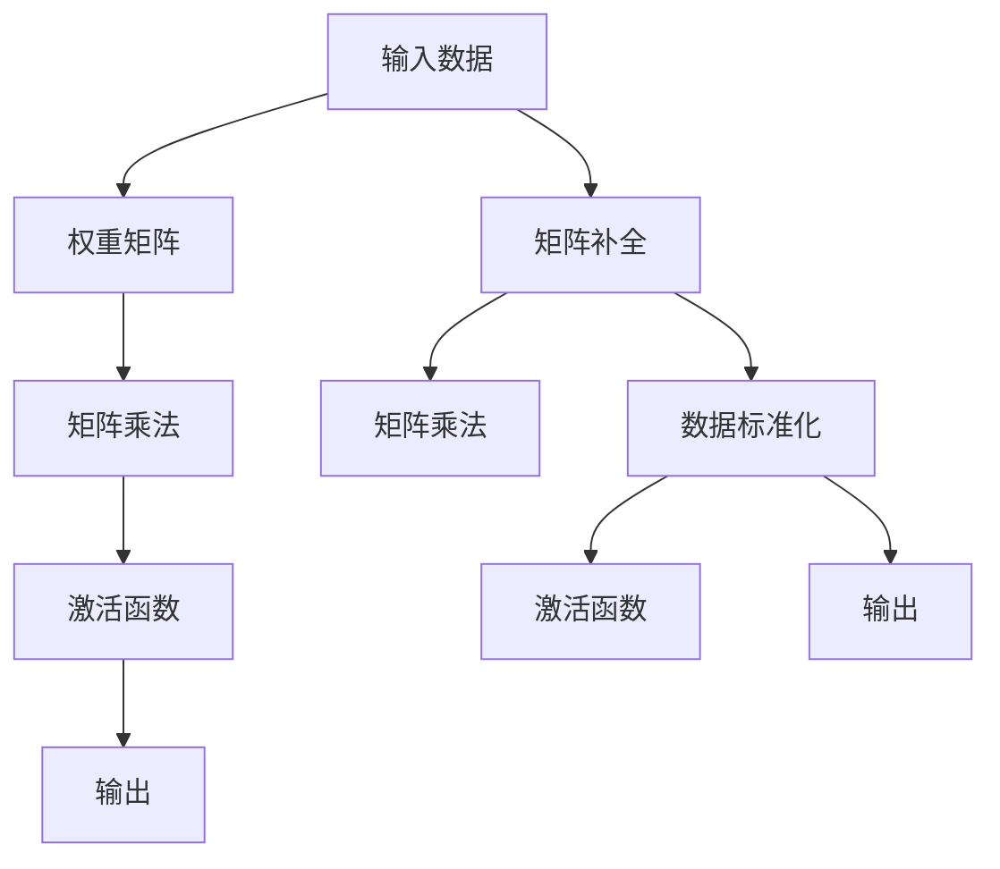

                 

# 矩阵乘法与ReLU：构建神经网络的基石

> 关键词：矩阵乘法, ReLU, 神经网络, 深度学习, 线性代数, 激活函数, 前向传播, 反向传播, 优化器

## 1. 背景介绍

### 1.1 问题由来

在深度学习领域，神经网络是一种常见的模型架构，它由多个神经元层级组成，能够对复杂的数据进行高效的特征提取和建模。而构建神经网络的两个核心操作是矩阵乘法和激活函数，它们是实现神经网络前向传播和反向传播的基础。

### 1.2 问题核心关键点

神经网络的构建依赖于矩阵乘法和激活函数，这两个概念缺一不可。矩阵乘法用于计算前向传播的权重矩阵和输入数据的组合，而激活函数用于引入非线性变换，使得网络可以拟合更加复杂的非线性关系。

本文将详细探讨矩阵乘法与ReLU激活函数的原理和应用，并举例说明它们在神经网络中的作用和影响。同时，我们还将讨论如何通过优化算法和超参数选择，来提高神经网络的性能和训练效率。

## 2. 核心概念与联系

### 2.1 核心概念概述

#### 2.1.1 矩阵乘法

矩阵乘法是一种数学运算，用于计算两个矩阵的乘积。在神经网络中，矩阵乘法通常用于计算权重矩阵与输入数据的组合，从而实现数据的非线性变换。

#### 2.1.2 ReLU激活函数

ReLU（Rectified Linear Unit）是一种常用的激活函数，它将负数输入映射为0，正数输入保持不变。ReLU激活函数引入非线性变换，使得神经网络可以拟合更加复杂的非线性关系，同时避免梯度消失问题。

### 2.2 核心概念原理和架构的 Mermaid 流程图



这个流程图展示了矩阵乘法与ReLU激活函数在神经网络中的作用。输入数据通过权重矩阵进行变换，然后经过ReLU激活函数引入非线性关系，最终输出结果。

## 3. 核心算法原理 & 具体操作步骤

### 3.1 算法原理概述

神经网络的前向传播过程可以分为两个主要步骤：

1. **矩阵乘法**：计算输入数据与权重矩阵的组合，得到加权和。
2. **激活函数**：对加权和进行非线性变换，引入非线性关系。

这两个步骤构成了神经网络前向传播的核心，使得神经网络能够拟合复杂的数据分布。

### 3.2 算法步骤详解

#### 3.2.1 矩阵乘法

矩阵乘法的计算公式如下：

$$
C = AB
$$

其中 $A$ 是输入数据矩阵，$B$ 是权重矩阵，$C$ 是输出矩阵。对于二维矩阵 $A$ 和 $B$，其乘积矩阵 $C$ 的大小为 $m \times n$，其中 $m$ 是输入矩阵的列数，$n$ 是权重矩阵的行数。

在神经网络中，输入数据矩阵通常是 $n \times d$，权重矩阵是 $d \times m$，输出矩阵是 $n \times m$。通过矩阵乘法，神经网络能够将输入数据转换为高维空间中的新数据。

#### 3.2.2 激活函数

激活函数用于对加权和进行非线性变换。在神经网络中，常用的激活函数包括Sigmoid、Tanh、ReLU等。ReLU激活函数定义为：

$$
f(x) = \max(0,x)
$$

当输入 $x \geq 0$ 时，输出为 $x$；当输入 $x < 0$ 时，输出为 $0$。

ReLU激活函数具有以下优点：

1. **计算速度快**：ReLU计算简单，适合大规模并行计算。
2. **避免梯度消失**：ReLU在正数区间的导数恒为1，避免了梯度消失问题。
3. **非线性变换**：ReLU引入了非线性变换，使得神经网络能够拟合更加复杂的非线性关系。

### 3.3 算法优缺点

#### 3.3.1 矩阵乘法

优点：

- **数据处理能力强**：矩阵乘法能够处理高维数据，适合大规模数据集。
- **计算效率高**：矩阵乘法可以利用GPU加速，计算效率高。

缺点：

- **参数量大**：权重矩阵的参数量与输入数据的维度成正比，需要大量存储空间。
- **依赖训练数据**：矩阵乘法依赖训练数据的质量和数量，需要大量标注数据。

#### 3.3.2 ReLU激活函数

优点：

- **计算简单**：ReLU的计算非常快速，适合大规模并行计算。
- **避免梯度消失**：ReLU在正数区间的导数恒为1，避免了梯度消失问题。
- **非线性变换**：ReLU引入了非线性变换，使得神经网络能够拟合更加复杂的非线性关系。

缺点：

- **负数部分不更新**：ReLU在负数部分梯度为0，导致一部分神经元无法更新，产生“神经元死亡”现象。

### 3.4 算法应用领域

矩阵乘法和ReLU激活函数广泛应用于深度学习领域，特别是神经网络的前向传播和反向传播过程中。它们在图像识别、自然语言处理、语音识别、推荐系统等众多领域都有广泛应用。

## 4. 数学模型和公式 & 详细讲解 & 举例说明

### 4.1 数学模型构建

在神经网络中，前向传播和反向传播的计算可以表示为如下公式：

$$
\begin{aligned}
&\text{前向传播：}\\
&y = \sigma(Wx + b) \\
&\text{反向传播：}\\
&\frac{\partial y}{\partial x} = W^T \sigma'(Wx + b)
\end{aligned}
$$

其中 $\sigma$ 表示激活函数，$W$ 表示权重矩阵，$b$ 表示偏置项，$x$ 表示输入数据，$y$ 表示输出数据，$\sigma'$ 表示激活函数的导数。

### 4.2 公式推导过程

以ReLU激活函数为例，推导其导数：

当 $x > 0$ 时，$ReLU'(x) = 1$；当 $x < 0$ 时，$ReLU'(x) = 0$。

因此，ReLU激活函数的导数可以表示为：

$$
ReLU'(x) = \begin{cases}
1, & x > 0 \\
0, & x \leq 0
\end{cases}
$$

将上述导数代入反向传播公式中，得到：

$$
\frac{\partial y}{\partial x} = W^T \begin{cases}
1, & Wx + b > 0 \\
0, & Wx + b \leq 0
\end{cases}
$$

这个公式表示，当权重矩阵的加权和大于0时，神经元输出为1，其导数为1；当权重矩阵的加权和小于等于0时，神经元输出为0，其导数为0。

### 4.3 案例分析与讲解

#### 4.3.1 案例：手写数字识别

手写数字识别是一个典型的神经网络应用。我们通过卷积层提取图像特征，然后将其输入到全连接层中进行分类。在这个过程中，矩阵乘法和ReLU激活函数起着至关重要的作用。

#### 4.3.2 案例：自然语言处理

自然语言处理中，文本数据的表示通常为词向量形式，可以通过矩阵乘法将其转化为高维空间中的向量。然后，通过ReLU激活函数引入非线性变换，使得神经网络能够拟合更加复杂的语言关系。

## 5. 项目实践：代码实例和详细解释说明

### 5.1 开发环境搭建

在进行神经网络开发时，我们需要搭建相应的开发环境。以下是使用Python进行TensorFlow开发的环境配置流程：

1. 安装Anaconda：从官网下载并安装Anaconda，用于创建独立的Python环境。

2. 创建并激活虚拟环境：
```bash
conda create -n tf-env python=3.8 
conda activate tf-env
```

3. 安装TensorFlow：根据CUDA版本，从官网获取对应的安装命令。例如：
```bash
conda install tensorflow -c tf
```

4. 安装TensorBoard：
```bash
pip install tensorboard
```

完成上述步骤后，即可在`tf-env`环境中开始神经网络开发。

### 5.2 源代码详细实现

以下是一个使用TensorFlow实现手写数字识别的代码示例：

```python
import tensorflow as tf
from tensorflow.keras import layers, models

# 定义模型
model = models.Sequential()
model.add(layers.Conv2D(32, (3, 3), activation='relu', input_shape=(28, 28, 1)))
model.add(layers.MaxPooling2D((2, 2)))
model.add(layers.Flatten())
model.add(layers.Dense(10, activation='softmax'))

# 编译模型
model.compile(optimizer='adam',
              loss='sparse_categorical_crossentropy',
              metrics=['accuracy'])

# 加载数据
(x_train, y_train), (x_test, y_test) = tf.keras.datasets.mnist.load_data()
x_train = x_train.reshape((60000, 28, 28, 1)) / 255.0
x_test = x_test.reshape((10000, 28, 28, 1)) / 255.0

# 训练模型
model.fit(x_train, y_train, epochs=5, batch_size=64, validation_data=(x_test, y_test))

# 评估模型
model.evaluate(x_test, y_test)
```

### 5.3 代码解读与分析

让我们再详细解读一下关键代码的实现细节：

- `Sequential`：定义了一个线性堆叠的神经网络模型，包括卷积层、池化层、全连接层等。
- `Conv2D`：定义了卷积层，使用32个3x3的卷积核进行特征提取。
- `MaxPooling2D`：定义了最大池化层，对卷积层的输出进行降维处理。
- `Dense`：定义了全连接层，用于分类输出。
- `softmax`：定义了softmax激活函数，用于将输出转化为概率分布。

- `compile`：编译模型，指定了优化器、损失函数和评估指标。
- `fit`：训练模型，指定了训练数据、训练轮数和批次大小。
- `evaluate`：评估模型，输出模型在测试集上的损失和准确率。

可以看到，TensorFlow提供了非常简洁易用的API，可以快速搭建和训练神经网络模型。开发者可以灵活调整模型结构和超参数，以获得最佳的性能表现。

## 6. 实际应用场景

### 6.1 图像识别

图像识别是深度学习的一个重要应用领域，通过卷积神经网络可以高效地提取图像特征，实现图像分类、物体检测等任务。矩阵乘法和ReLU激活函数是卷积神经网络的核心组成部分，使得模型能够自动提取并学习图像的特征表示。

### 6.2 自然语言处理

自然语言处理中，文本数据的表示通常为词向量形式，可以通过矩阵乘法将其转化为高维空间中的向量。然后，通过ReLU激活函数引入非线性变换，使得神经网络能够拟合更加复杂的语言关系。

### 6.3 语音识别

语音识别中，声音信号通常被表示为频谱图，可以通过卷积神经网络进行特征提取和分类。矩阵乘法和ReLU激活函数是卷积神经网络的核心组成部分，使得模型能够自动提取并学习声音信号的特征表示。

### 6.4 未来应用展望

随着深度学习技术的不断发展，神经网络的应用场景将不断拓展，矩阵乘法和ReLU激活函数也将发挥更加重要的作用。未来，神经网络有望在自动驾驶、机器人控制、医学诊断等领域得到广泛应用，为人类社会带来深远影响。

## 7. 工具和资源推荐

### 7.1 学习资源推荐

为了帮助开发者系统掌握神经网络的构建原理和实践技巧，这里推荐一些优质的学习资源：

1. 《深度学习》系列书籍：由多位深度学习专家合著，系统介绍了深度学习的理论基础和实践方法，包括神经网络的构建、优化算法等。
2. CS231n《卷积神经网络》课程：斯坦福大学开设的计算机视觉课程，有Lecture视频和配套作业，带你深入理解卷积神经网络的原理和实现。
3. 《TensorFlow实战Google深度学习框架》书籍：TensorFlow官方文档，详细介绍了TensorFlow的API和使用方法，是学习TensorFlow的必备资料。
4. PyTorch官方文档：PyTorch官方文档，提供了丰富的示例和API，是学习PyTorch的必备资料。

通过对这些资源的学习实践，相信你一定能够快速掌握神经网络的构建原理和实践技巧，并用于解决实际的NLP问题。

### 7.2 开发工具推荐

高效的开发离不开优秀的工具支持。以下是几款用于神经网络开发的常用工具：

1. TensorFlow：由Google主导开发的深度学习框架，生产部署方便，适合大规模工程应用。
2. PyTorch：由Facebook主导开发的深度学习框架，灵活易用，适合研究和原型开发。
3. Keras：高层次的深度学习API，可以运行在TensorFlow、Theano、CNTK等后端框架上，易于上手。
4. Jupyter Notebook：开源的交互式笔记本，支持Python、R等多种语言，适合快速迭代开发和分享学习笔记。

合理利用这些工具，可以显著提升神经网络开发效率，加快创新迭代的步伐。

### 7.3 相关论文推荐

神经网络技术的发展源于学界的持续研究。以下是几篇奠基性的相关论文，推荐阅读：

1. ImageNet Classification with Deep Convolutional Neural Networks（AlexNet论文）：提出卷积神经网络，展示了其在图像识别任务上的巨大潜力。
2. Alex Krizhevsky, Ilya Sutskever, and Geoffrey Hinton. 2012. ImageNet Classification with Deep Convolutional Neural Networks. In Proceedings of the 25th International Conference on Neural Information Processing Systems (NIPS 2012).
3. Deep Residual Learning for Image Recognition（ResNet论文）：提出残差网络，解决了深度网络中的梯度消失问题，取得了更好的性能。
4. Kaiming He, Xiangyu Zhang, Shaoqing Ren, and Jian Sun. 2015. Deep Residual Learning for Image Recognition. In Proceedings of the IEEE Conference on Computer Vision and Pattern Recognition (CVPR 2015).
5. Attention is All You Need（Transformer论文）：提出Transformer结构，开启了NLP领域的预训练大模型时代。
6. Ashish Vaswani, Noam Shazeer, Niki Parmar, Jakob Uszkoreit, Llion Jones, Aidan N. Gomez, Lukasz Kaiser, and Illia Polosukhin. 2017. Attention is All You Need. In Advances in Neural Information Processing Systems (NeurIPS 2017).

这些论文代表了大语言模型微调技术的发展脉络。通过学习这些前沿成果，可以帮助研究者把握学科前进方向，激发更多的创新灵感。

## 8. 总结：未来发展趋势与挑战

### 8.1 研究成果总结

本文对矩阵乘法与ReLU激活函数在神经网络中的作用进行了全面系统的介绍。首先阐述了神经网络的构建依赖于矩阵乘法和激活函数，这两个概念缺一不可。其次，详细讲解了矩阵乘法和ReLU激活函数的原理和应用，并举例说明它们在神经网络中的作用和影响。同时，本文还讨论了如何通过优化算法和超参数选择，来提高神经网络的性能和训练效率。

通过本文的系统梳理，可以看到，矩阵乘法和ReLU激活函数是构建神经网络的两个基石，它们使得神经网络能够高效地进行特征提取和建模。未来，随着深度学习技术的不断发展，神经网络的应用场景将不断拓展，矩阵乘法和ReLU激活函数也将发挥更加重要的作用。

### 8.2 未来发展趋势

展望未来，神经网络的发展将呈现以下几个趋势：

1. 模型规模持续增大。随着算力成本的下降和数据规模的扩张，神经网络的参数量还将持续增长。超大规模神经网络蕴含的丰富特征表示，有望支撑更加复杂多变的任务。
2. 模型性能不断提升。随着模型的不断训练和优化，神经网络的性能将不断提升，实现更加精确和鲁棒的预测。
3. 模型迁移能力增强。神经网络的迁移能力将不断提升，使得模型能够更好地适应不同的应用场景和数据分布。
4. 模型可解释性增强。神经网络的可解释性将不断增强，使得模型的决策过程更加透明和可信。
5. 模型安全性提升。神经网络的安全性将不断提升，使得模型能够更好地抵御攻击和恶意输入。

以上趋势凸显了神经网络技术的广阔前景。这些方向的探索发展，必将进一步提升神经网络的性能和应用范围，为人类社会带来深远影响。

### 8.3 面临的挑战

尽管神经网络技术已经取得了瞩目成就，但在迈向更加智能化、普适化应用的过程中，它仍面临着诸多挑战：

1. 数据需求量大。神经网络的训练需要大量的标注数据，获取高质量标注数据的成本较高，限制了神经网络的应用范围。
2. 模型复杂度高。神经网络的模型结构复杂，训练和推理的计算量较大，需要高效的计算资源和优化算法。
3. 模型过拟合风险高。神经网络容易过拟合，特别是在训练数据不足的情况下，模型性能可能受到影响。
4. 模型可解释性不足。神经网络的决策过程缺乏可解释性，难以对其推理逻辑进行分析和调试。
5. 模型安全性有待提升。神经网络可能学习到有害信息，传递到下游任务中，产生误导性输出，造成安全风险。

正视神经网络面临的这些挑战，积极应对并寻求突破，将是大语言模型微调走向成熟的必由之路。相信随着学界和产业界的共同努力，这些挑战终将一一被克服，神经网络必将在构建人机协同的智能时代中扮演越来越重要的角色。

### 8.4 研究展望

面向未来，神经网络的研究需要在以下几个方面寻求新的突破：

1. 探索无监督和半监督学习范式。摆脱对大规模标注数据的依赖，利用自监督学习、主动学习等无监督和半监督范式，最大限度利用非结构化数据，实现更加灵活高效的神经网络。
2. 研究参数高效和计算高效的神经网络范式。开发更加参数高效的神经网络，在固定大部分网络参数的情况下，只更新极少量的任务相关参数。同时优化神经网络的计算图，减少前向传播和反向传播的资源消耗，实现更加轻量级、实时性的部署。
3. 引入更多先验知识。将符号化的先验知识，如知识图谱、逻辑规则等，与神经网络模型进行巧妙融合，引导神经网络学习更准确、合理的特征表示。同时加强不同模态数据的整合，实现视觉、语音等多模态信息与文本信息的协同建模。
4. 结合因果分析和博弈论工具。将因果分析方法引入神经网络，识别出网络决策的关键特征，增强输出解释的因果性和逻辑性。借助博弈论工具刻画人机交互过程，主动探索并规避模型的脆弱点，提高系统稳定性。
5. 纳入伦理道德约束。在神经网络训练目标中引入伦理导向的评估指标，过滤和惩罚有害的输出倾向。同时加强人工干预和审核，建立神经网络行为的监管机制，确保输出符合人类价值观和伦理道德。

这些研究方向将引领神经网络技术迈向更高的台阶，为构建安全、可靠、可解释、可控的智能系统铺平道路。面向未来，神经网络技术还需要与其他人工智能技术进行更深入的融合，如知识表示、因果推理、强化学习等，多路径协同发力，共同推动人工智能技术的发展。

## 9. 附录：常见问题与解答

**Q1: 什么是矩阵乘法？**

A: 矩阵乘法是一种数学运算，用于计算两个矩阵的乘积。在神经网络中，矩阵乘法通常用于计算输入数据与权重矩阵的组合，从而实现数据的非线性变换。

**Q2: 什么是ReLU激活函数？**

A: ReLU（Rectified Linear Unit）是一种常用的激活函数，它将负数输入映射为0，正数输入保持不变。ReLU激活函数引入非线性变换，使得神经网络可以拟合更加复杂的非线性关系，同时避免梯度消失问题。

**Q3: 为什么神经网络使用矩阵乘法和ReLU激活函数？**

A: 神经网络使用矩阵乘法和ReLU激活函数，是因为它们能够高效地进行数据的非线性变换，引入非线性关系。矩阵乘法使得神经网络能够自动提取并学习数据的特征表示，ReLU激活函数则避免了梯度消失问题，使得神经网络能够拟合更加复杂的非线性关系。

**Q4: 如何优化神经网络？**

A: 神经网络的优化可以通过多种方法实现，包括调整模型结构、选择合适的优化算法、调整超参数等。常见的优化算法包括Adam、SGD等，常见的超参数包括学习率、批次大小、训练轮数等。同时，可以通过数据增强、正则化等技术，提高神经网络的泛化性能。

**Q5: 神经网络有哪些应用？**

A: 神经网络在图像识别、自然语言处理、语音识别、推荐系统等领域得到了广泛应用。通过卷积神经网络可以高效地提取图像特征，通过循环神经网络可以实现文本生成和情感分析，通过深度学习模型可以推荐商品和新闻等。

通过本文的系统梳理，可以看到，矩阵乘法和ReLU激活函数是构建神经网络的两个基石，它们使得神经网络能够高效地进行特征提取和建模。未来，随着深度学习技术的不断发展，神经网络的应用场景将不断拓展，矩阵乘法和ReLU激活函数也将发挥更加重要的作用。

