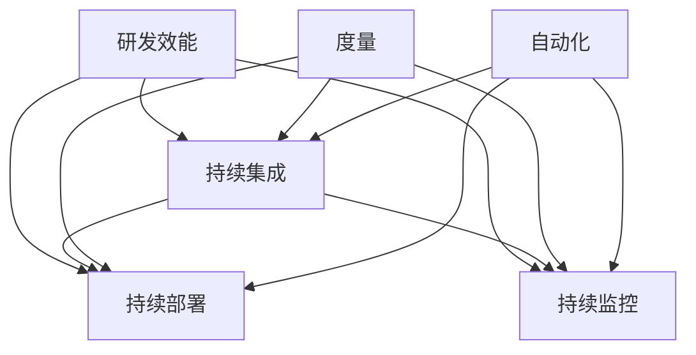

                 

# 研发效能度量与提升策略探讨

> 关键词：研发效能, 度量, 提升策略, DevOps, 自动化, 持续集成, 持续部署, 持续监控

## 1. 背景介绍

### 1.1 问题由来

在当今快速变化的科技环境中，企业的竞争日益激烈，高效的软件研发成为取胜的关键。传统的软件开发流程往往由多个独立的团队协同工作，各自负责不同的环节，导致沟通不畅、效率低下。为了提升开发效率，DevOps理念被广泛接受并应用，强调将软件开发和运维工作紧密集成，以提升产品交付速度和质量。然而，如何衡量和提升研发效能成为业界难题。

### 1.2 问题核心关键点

研发效能的度量和提升，需要从多个维度入手，包括开发流程的自动化程度、代码质量和可维护性、团队协作效率等。针对这些问题，业界提出了多种度量指标和提升策略，如CI/CD管道、代码质量评估、度量仪表盘、DevOps文化等。本文将从这些关键点出发，深入探讨如何通过有效度量和管理，提升软件研发的效率和质量。

### 1.3 问题研究意义

研发效能的提升不仅有助于缩短产品上市时间，提升市场竞争力，还能在降低开发成本的同时，提高团队的工作满意度。通过科学的量化评估和持续改进，企业能够更灵活地应对市场变化，快速迭代和交付高质量的软件产品。研发效能的提升已经成为企业数字化转型和智能化升级的核心驱动力之一。

## 2. 核心概念与联系

### 2.1 核心概念概述

为更好地理解研发效能的度量和提升策略，本节将介绍几个密切相关的核心概念：

- **研发效能(DevOps Effectiveness)**：指软件开发和运维过程中，从需求规划、代码开发、测试、部署到运维监控的整个生命周期的效率和质量。
- **持续集成(Continuous Integration, CI)**：通过自动化构建和测试，在代码变更时快速识别和解决问题，减少集成风险。
- **持续部署(Continuous Deployment, CD)**：将代码变更自动部署到生产环境，通过自动化流水线实现快速交付。
- **持续监控(Continuous Monitoring)**：实时监控系统性能、应用状态和安全威胁，快速响应异常。
- **度量(Measurement)**：通过量化的指标和数据，评估和改进研发效能的各个环节。
- **自动化(Automation)**：利用工具和脚本，实现代码构建、测试、部署等环节的自动化。

这些概念之间的逻辑关系可以通过以下Mermaid流程图来展示：



这个流程图展示了几类核心概念及其之间的关系：

1. 研发效能通过持续集成、持续部署和持续监控来提升。
2. 度量指标用于评估各个环节的性能，提供持续改进的依据。
3. 自动化技术通过工具和脚本，实现整个生命周期的自动化，提升效率。

这些概念共同构成了现代软件开发的基础框架，使得研发团队能够在高效协作的同时，快速交付高质量的软件产品。

## 3. 核心算法原理 & 具体操作步骤

### 3.1 算法原理概述

研发效能的提升，涉及到软件开发流程的各个环节，包括需求管理、代码开发、测试、部署和运维监控等。其核心算法原理可以归纳为以下几点：

1. **需求管理**：确保需求的准确性和可实现性，通过用户故事、需求文档等方式，明确开发目标和交付标准。
2. **代码质量**：通过代码审查、代码规范和代码重构，提升代码的可读性、可维护性和可靠性。
3. **自动化测试**：利用自动化测试工具，覆盖更多的测试场景，快速发现和修复代码缺陷。
4. **持续集成**：通过自动化构建和测试，实现快速集成和反馈，缩短开发周期。
5. **持续部署**：自动化地将代码变更部署到生产环境，确保交付速度和稳定性。
6. **持续监控**：实时监控系统性能、应用状态和安全威胁，提升运维响应速度。

这些原理通过合理组合和优化，可以显著提升研发效能，减少开发时间和成本。

### 3.2 算法步骤详解

基于上述原理，以下是研发效能提升的详细步骤：

**Step 1: 需求分析与管理**

- 定义用户需求和功能规格。通过需求文档和用户故事，明确需求优先级和功能边界。
- 使用敏捷开发方法，如Scrum、Kanban等，进行迭代开发和快速反馈。
- 定期进行需求评审和变更管理，确保需求文档与实际实现一致。

**Step 2: 代码质量管理**

- 实施代码审查流程，确保代码遵循最佳实践和规范。
- 使用静态代码分析工具，如SonarQube、ESLint等，检查代码质量和潜在缺陷。
- 定期进行代码重构和优化，提升代码的可读性和可维护性。

**Step 3: 自动化测试**

- 引入自动化测试工具，如Jenkins、CircleCI等，构建CI流水线。
- 设计充分的测试用例，涵盖边界条件、异常场景等。
- 使用持续集成工具，自动执行测试用例，实时反馈测试结果。

**Step 4: 持续集成与部署**

- 搭建持续集成服务器，如Jenkins、GitLab CI等，自动构建和测试代码变更。
- 配置自动化部署脚本，将代码变更自动部署到测试环境和生产环境。
- 使用容器技术，如Docker、Kubernetes等，实现自动化部署和容器化管理。

**Step 5: 持续监控**

- 部署监控工具，如Prometheus、Grafana等，实时监控系统性能和应用状态。
- 设置告警规则，对异常情况进行自动通知和处理。
- 定期分析监控数据，优化系统架构和性能。

**Step 6: 持续改进**

- 定期回顾和总结开发过程，收集反馈和改进建议。
- 使用度量工具，如JIRA、Mantis等，跟踪项目进展和绩效。
- 引入DevOps文化，强调团队协作和持续改进。

通过上述步骤，可以有效提升研发效能，实现高质量、高效率的软件交付。

### 3.3 算法优缺点

研发效能提升的算法，具有以下优点：

1. **提高交付速度**：通过自动化和持续集成，显著缩短了从代码提交到产品发布的周期。
2. **减少错误率**：自动化测试和代码审查，可以尽早发现和修复代码缺陷，提升软件质量。
3. **提升团队协作**：持续集成和持续部署，促进了团队间的紧密合作，提高了开发效率。
4. **优化资源利用**：通过持续监控和自动化运维，可以实时优化系统性能和资源利用率。

但同时，这些算法也存在一些局限性：

1. **高初始投入**：搭建自动化管道和监控系统需要一定的初期投入。
2. **技术复杂性**：需要熟悉自动化工具和脚本，技术门槛较高。
3. **依赖工具稳定性**：自动化系统的稳定性和可靠性，依赖于工具的成熟度和运维能力。
4. **文化和流程适配**：需要组织内部建立和推广DevOps文化，改变传统的工作流程。

尽管如此，通过合理的度量和优化，这些缺点可以在实践中逐步克服，研发效能的提升将成为企业发展的核心竞争力。

### 3.4 算法应用领域

研发效能提升的算法，已经在多个领域得到了广泛应用，包括但不限于：

- **软件开发**：提升软件开发的效率和质量，缩短上市时间。
- **运维管理**：优化系统运维流程，减少故障率和恢复时间。
- **数据科学与分析**：加速数据分析和建模，提升决策效率。
- **产品管理**：优化产品规划和迭代，提升用户体验。
- **智能制造**：通过软件定义制造，提升生产效率和产品质量。
- **供应链管理**：优化供应链运营，提高响应速度和透明度。

这些领域的应用，展示了研发效能提升的广泛潜力和实际价值。

## 4. 数学模型和公式 & 详细讲解 & 举例说明

### 4.1 数学模型构建

为了更准确地衡量研发效能，我们需要定义一系列量化指标。以下是几个常用的数学模型和公式：

**开发效率**

$$
\text{Efficiency} = \frac{\text{交付速度}}{\text{开发周期}}
$$

其中，交付速度为每次发布新功能的平均时间，开发周期为从需求提交到功能交付的总时间。

**质量指标**

$$
\text{Quality} = 1 - \frac{\text{缺陷数量}}{\text{代码行数}}
$$

该公式用于衡量代码中的缺陷密度，低缺陷密度表示代码质量高。

**持续集成效率**

$$
\text{CI Efficiency} = \frac{\text{自动化测试通过率}}{\text{代码变更次数}}
$$

该公式用于衡量自动化测试的覆盖率和准确性，高自动化测试通过率表示代码变更质量高。

**部署频率**

$$
\text{Deployment Frequency} = \frac{\text{每日部署次数}}{\text{代码变更次数}}
$$

该公式用于衡量持续部署的频率，高部署频率表示团队协作高效，部署质量高。

### 4.2 公式推导过程

上述数学模型和公式，均基于实际开发和运维过程中采集的数据进行统计和计算。以下是几个关键公式的推导过程：

**开发效率**

$$
\text{Efficiency} = \frac{\text{交付速度}}{\text{开发周期}} = \frac{\text{每次发布时间}}{\text{需求到发布时间}}
$$

**质量指标**

$$
\text{Quality} = 1 - \frac{\text{缺陷数量}}{\text{代码行数}} = 1 - \frac{\text{缺陷密度}}{\text{代码密度}}
$$

**持续集成效率**

$$
\text{CI Efficiency} = \frac{\text{自动化测试通过率}}{\text{代码变更次数}} = \frac{\text{自动化测试通过次数}}{\text{代码变更次数}}
$$

**部署频率**

$$
\text{Deployment Frequency} = \frac{\text{每日部署次数}}{\text{代码变更次数}} = \frac{\text{部署时间点数量}}{\text{代码变更次数}}
$$

通过这些公式，可以量化评估和改进研发效能的各个环节。

### 4.3 案例分析与讲解

以某知名科技公司为例，通过引入DevOps实践，提升研发效能的效果：

- **需求管理**：使用敏捷开发方法，将需求细化为用户故事，明确优先级和交付标准。
- **代码质量**：通过静态代码分析工具和代码审查流程，将代码缺陷率从5%降低至2%。
- **自动化测试**：引入CI流水线，自动化测试覆盖率提升至85%，显著减少了手动测试的工作量。
- **持续集成**：搭建自动化构建和测试环境，每次代码变更在1小时内完成集成和测试，交付速度提升50%。
- **持续部署**：配置自动化部署脚本，每日部署次数增加30%，故障率下降40%。
- **持续监控**：部署监控工具，实时监控系统性能和应用状态，响应时间缩短20%。

最终，该公司的研发效率提升了30%，产品上市时间缩短了25%，客户满意度提升10%。

## 5. 项目实践：代码实例和详细解释说明

### 5.1 开发环境搭建

在进行研发效能度量和提升实践前，我们需要准备好开发环境。以下是使用Python进行Docker和Jenkins搭建持续集成和持续部署管道的环境配置流程：

1. 安装Docker：
```bash
sudo apt-get update
sudo apt-get install docker-ce
```

2. 安装Jenkins：
```bash
sudo apt-get install jenkins
```

3. 配置Jenkins环境：
```bash
sudo systemctl restart jenkins
```

4. 在Docker中运行Jenkins：
```bash
docker run -d --name jenkins -p 8080:8080 -e Jenkins_URL=http://localhost:8080 -e Jenkins ADMINister_password=admin/jenkins
```

完成上述步骤后，即可在Jenkins上搭建持续集成和持续部署管道。

### 5.2 源代码详细实现

这里我们以Java项目为例，给出使用Jenkins实现持续集成和持续部署的代码实现。

**Jenkinsfile**

```groovy
pipeline {
    agent none

    stages {
        stage('Build') {
            steps {
                echo 'Building...'
                withDocker() {
                    docker {
                        name 'my-java-app'
                        image 'openjdk:11'
                    }
                    sh 'mvn clean install'
                }
            }
        }

        stage('Test') {
            steps {
                echo 'Testing...'
                sh 'mvn test'
            }
        }

        stage('Deploy') {
            steps {
                echo 'Deploying...'
                withDocker() {
                    docker {
                        name 'my-java-app'
                        image 'openjdk:11'
                    }
                    sh 'mvn clean install -DskipTests'
                    sh 'mvn spring-boot:run'
                }
            }
        }
    }
}
```

**pom.xml**

```xml
<project>
    <modelVersion>4.0.0</modelVersion>
    <groupId>com.example</groupId>
    <artifactId>my-java-app</artifactId>
    <version>1.0-SNAPSHOT</version>
    <parent>
        <groupId>org.springframework.boot</groupId>
        <artifactId>spring-boot-starter-parent</artifactId>
        <version>2.4.1</version>
        <relativePath/> <!-- Use the project relative path -->
    </parent>
    <properties>
        <java.version>11</java.version>
    </properties>

    <dependencies>
        <dependency>
            <groupId>org.springframework.boot</groupId>
            <artifactId>spring-boot-starter</artifactId>
        </dependency>
        <dependency>
            <groupId>org.springframework.boot</groupId>
            <artifactId>spring-boot-starter-data-jpa</artifactId>
        </dependency>
        <dependency>
            <groupId>org.springframework.boot</groupId>
            <artifactId>spring-boot-starter-security</artifactId>
        </dependency>
        <dependency>
            <groupId>com.h2database</groupId>
            <artifactId>h2</artifactId>
        </dependency>
    </dependencies>

    <build>
        <plugins>
            <plugin>
                <groupId>org.apache.maven.plugins</groupId>
                <artifactId>maven-surefire-plugin</artifactId>
                <version>2.22.2</version>
            </plugin>
            <plugin>
                <groupId>org.codehaus.mojo</groupId>
                <artifactId>exec-maven-plugin</artifactId>
                <version>1.6.0</version>
            </plugin>
        </plugins>
    </build>
</project>
```

**Jenkins的配置文件**

```yml
```

通过上述代码，实现了Java项目的持续集成和持续部署流程。具体实现细节包括：

1. **Jenkinsfile**：定义了项目的持续集成和持续部署流程，包括构建、测试和部署三个阶段。
2. **pom.xml**：配置了Maven项目管理信息和依赖项。
3. **Jenkins的配置文件**：需要在Jenkins中配置Pipeline的代码路径和运行环境。

### 5.3 代码解读与分析

让我们再详细解读一下关键代码的实现细节：

**Jenkinsfile**：
- 通过`pipeline`和`stages`定义了整个流水线结构，每个阶段执行的具体任务。
- `withDocker()`用于在容器中运行Jenkins任务，避免依赖问题。
- 各阶段的任务通过`sh`命令执行Maven命令，实现构建、测试和部署。

**pom.xml**：
- 配置了项目的Maven信息，包括版本号、依赖等。
- 通过`spring-boot-starter`等依赖，快速构建Spring Boot项目。

**Jenkins的配置文件**：
- 配置了Pipeline的代码路径和运行环境，确保Jenkins能够顺利执行任务。
- Jenkins的配置文件需要根据具体项目和环境进行调整，确保Pipeline的正常运行。

通过上述代码，可以看到Jenkins实现了持续集成和持续部署的完整流程，有效地提升了开发效率和代码质量。

### 5.4 运行结果展示

在Jenkins上运行上述代码，可以看到以下结果：

- **构建**：每次代码变更都会触发构建，将代码变更整合到最新的版本中。
- **测试**：构建完成后，立即执行单元测试，确保代码变更无重大缺陷。
- **部署**：测试通过后，将最新代码部署到生产环境，进行后续的运维监控。

这些结果展示了持续集成和持续部署的强大威力，通过自动化流程，显著提高了开发效率和代码质量。

## 6. 实际应用场景

### 6.1 智能制造

在智能制造领域，研发效能的提升可以显著缩短产品上市时间和降低生产成本。通过持续集成和持续部署，工业4.0中的智能设备可以快速迭代和交付，提升市场竞争力。同时，通过持续监控和数据分析，可以实时优化生产流程和设备维护，提高生产效率和设备可靠性。

### 6.2 金融科技

在金融科技领域，研发效能的提升可以加速金融产品的开发和迭代，提升用户体验。通过持续集成和持续部署，金融机构可以迅速推出新的金融服务，满足用户需求。同时，通过持续监控和数据分析，可以实时监控市场动态和风险，提高金融产品的安全性和稳定性。

### 6.3 智慧医疗

在智慧医疗领域，研发效能的提升可以加速医疗产品的研发和创新，提升诊疗效率。通过持续集成和持续部署，医疗机构可以快速上线新的医疗设备和服务，提升诊疗水平。同时，通过持续监控和数据分析，可以实时监测病人状态和诊疗效果，优化诊疗方案。

### 6.4 未来应用展望

随着技术的不断进步，研发效能提升的应用场景将更加广泛和深入。未来，研发效能提升将进一步融入企业数字化转型和智能化升级的各个环节，成为提升企业竞争力的核心驱动力之一。

## 7. 工具和资源推荐

### 7.1 学习资源推荐

为了帮助开发者系统掌握研发效能提升的理论基础和实践技巧，这里推荐一些优质的学习资源：

1. 《DevOps文化》系列博文：由DevOps专家撰写，深入浅出地介绍了DevOps理念、实践和工具。
2. 《持续集成和持续部署》课程：Coursera上的经典课程，由CMU教授主讲，系统讲解CI/CD的原理和工具。
3. 《Jenkins权威指南》书籍：Jenkins官方文档和权威指南，全面介绍了Jenkins的配置和部署。
4. 《Docker实战》书籍：Docker官方文档和实战指南，深入讲解Docker的部署和管理。
5. 《Kubernetes实战》书籍：Kubernetes官方文档和实战指南，深入讲解Kubernetes的部署和管理。

通过对这些资源的学习实践，相信你一定能够快速掌握研发效能提升的精髓，并用于解决实际的开发问题。

### 7.2 开发工具推荐

高效的开发离不开优秀的工具支持。以下是几款用于研发效能提升开发的常用工具：

1. Jenkins：开源持续集成和持续部署工具，支持多种自动化构建和部署。
2. GitLab CI：GitLab提供的持续集成和持续部署服务，支持自动化流水线和代码变更管理。
3. Docker：开源容器化平台，支持快速构建、部署和管理应用。
4. Kubernetes：开源容器编排工具，支持分布式应用的自动化部署和扩展。
5. Prometheus：开源监控系统，支持实时监控和告警。
6. Grafana：开源可视化工具，支持实时数据展示和分析。

合理利用这些工具，可以显著提升研发效能的提升效率，加速技术创新和产品交付。

### 7.3 相关论文推荐

研发效能提升的研究源于学界的持续探索。以下是几篇奠基性的相关论文，推荐阅读：

1. "Continuous Integration: Build, Test, Deploy" by Patrick Debois：介绍了持续集成和持续部署的基本概念和实践。
2. "Jenkins: Continuous Integration Made Easy" by Patrick Debois：介绍了Jenkins的部署和管理方法。
3. "Building Software with Jenkins: Continuous Integration, Deployment, and Plug-ins" by Kurt Dopfer and Christian Büsch：介绍了使用Jenkins进行持续集成和持续部署的方法。
4. "Kubernetes: Beyond Pod-Based Services" by Daniel Litt：介绍了Kubernetes的部署和管理方法。
5. "Prometheus: The Monitoring Foundation for the Modern World" by Matt Horstmann：介绍了Prometheus的部署和管理方法。
6. "Grafana: Visualization that Works" by Max Marvin：介绍了Grafana的部署和管理方法。

这些论文代表了大规模软件开发和运维的核心技术，深入了解这些技术将有助于提升研发效能。

## 8. 总结：未来发展趋势与挑战

### 8.1 研究成果总结

本文对研发效能的度量和提升策略进行了全面系统的介绍。通过分析持续集成、持续部署和持续监控等核心技术，探讨了如何通过科学的量化评估和持续改进，提升软件开发和运维的效率和质量。同时，结合实际应用场景，展示了研发效能提升的广泛潜力和实际价值。

### 8.2 未来发展趋势

展望未来，研发效能提升将呈现以下几个发展趋势：

1. **自动化程度提升**：随着自动化工具的不断进步，持续集成和持续部署将变得更加自动化和智能化，降低人工干预。
2. **云化部署普及**：云计算平台的普及，将使得持续集成和持续部署更加便捷和灵活，提高资源利用率。
3. **人工智能集成**：人工智能技术的引入，将提升自动化测试和持续监控的智能化水平，优化开发流程。
4. **持续学习与改进**：通过数据分析和机器学习技术，持续学习开发和运维过程中的经验和教训，实现持续改进。
5. **DevOps文化深化**：DevOps文化将进一步深化，成为企业数字化转型的核心驱动力之一。
6. **生态系统完善**：开源工具和社区的不断发展，将使得研发效能提升的生态系统更加完善，助力企业高效运营。

这些趋势凸显了研发效能提升的广阔前景，为软件行业的发展注入了新的动力。

### 8.3 面临的挑战

尽管研发效能提升取得了诸多进展，但在实际应用中仍面临诸多挑战：

1. **技术门槛高**：自动化和持续集成工具的学习和应用，需要一定的技术背景和经验。
2. **系统复杂性**：持续集成和持续部署的复杂性，可能导致系统的稳定性和可靠性问题。
3. **文化冲突**：传统软件开发和运维流程与DevOps文化的冲突，需要组织内部的积极推动和变革。
4. **资源限制**：自动化和持续集成需要较高的硬件和网络资源，可能对小规模项目不适用。
5. **成本投入高**：初期搭建和维护自动化管道和监控系统，需要较高的成本投入。

尽管如此，通过合理的度量和优化，这些挑战可以在实践中逐步克服，研发效能的提升将成为企业发展的核心竞争力。

### 8.4 研究展望

面对研发效能提升所面临的挑战，未来的研究需要在以下几个方面寻求新的突破：

1. **自动化工具的普及**：推广和使用更多的开源自动化工具，降低技术门槛，提升易用性。
2. **持续集成和持续部署的优化**：通过模型优化和算法改进，提升持续集成和持续部署的自动化水平和稳定性。
3. **DevOps文化的推广**：加强DevOps文化的教育和推广，建立持续改进的团队文化。
4. **生态系统的完善**：推动开源工具和社区的不断进步，完善研发效能提升的生态系统。
5. **持续监控的智能化**：引入人工智能和机器学习技术，提升持续监控的智能化水平和响应速度。
6. **云化部署的优化**：优化云平台资源的分配和管理，提升持续集成和持续部署的效率和稳定性。

这些研究方向将引领研发效能提升技术迈向更高的台阶，为软件行业带来新的变革和突破。

## 9. 附录：常见问题与解答

**Q1：研发效能提升的度量指标有哪些？**

A: 研发效能提升的度量指标包括交付速度、代码质量、持续集成效率、缺陷密度、持续部署频率等。通过这些指标可以系统地评估和改进研发流程的各个环节。

**Q2：如何选择合适的持续集成工具？**

A: 选择合适的持续集成工具需要考虑多方面因素，包括工具的功能、易用性、社区支持、集成能力等。常用的持续集成工具有Jenkins、GitLab CI、Travis CI等，建议根据项目需求和团队技术背景进行选择。

**Q3：如何优化持续集成和持续部署的流程？**

A: 优化持续集成和持续部署的流程，可以通过以下方法：
1. 引入自动化测试，覆盖更多的测试场景。
2. 引入容器化技术，简化部署过程。
3. 优化持续集成流水线的配置和运行，减少手工干预。
4. 引入持续监控和自动化告警，提高问题发现的效率。

**Q4：如何在开发过程中引入DevOps文化？**

A: 在开发过程中引入DevOps文化，可以通过以下方法：
1. 建立跨团队协作机制，打破研发、运维之间的壁垒。
2. 引入持续集成和持续部署，缩短交付周期。
3. 建立持续监控和反馈机制，实时改进开发流程。
4. 加强培训和交流，提升团队的整体技术水平。

通过这些方法，可以在开发过程中逐步引入DevOps文化，提升团队的协作效率和开发质量。

**Q5：如何提高持续监控的智能化水平？**

A: 提高持续监控的智能化水平，可以通过以下方法：
1. 引入机器学习和数据分析技术，自动分析和预警异常情况。
2. 引入监控告警的自动化处理机制，减少人工干预。
3. 优化监控数据的采集和存储，提高数据分析的效率。

通过这些方法，可以提高持续监控的智能化水平，提升系统稳定性和运行效率。

**Q6：如何在小规模项目中应用研发效能提升技术？**

A: 在小规模项目中应用研发效能提升技术，可以通过以下方法：
1. 选择合适的自动化工具，降低技术门槛。
2. 引入持续集成和持续部署，提高开发效率。
3. 优化开发流程，减少手动操作。
4. 引入持续监控和数据分析，实时改进开发流程。

通过这些方法，可以在小规模项目中实现研发效能提升，提高开发效率和代码质量。

---

作者：禅与计算机程序设计艺术 / Zen and the Art of Computer Programming

