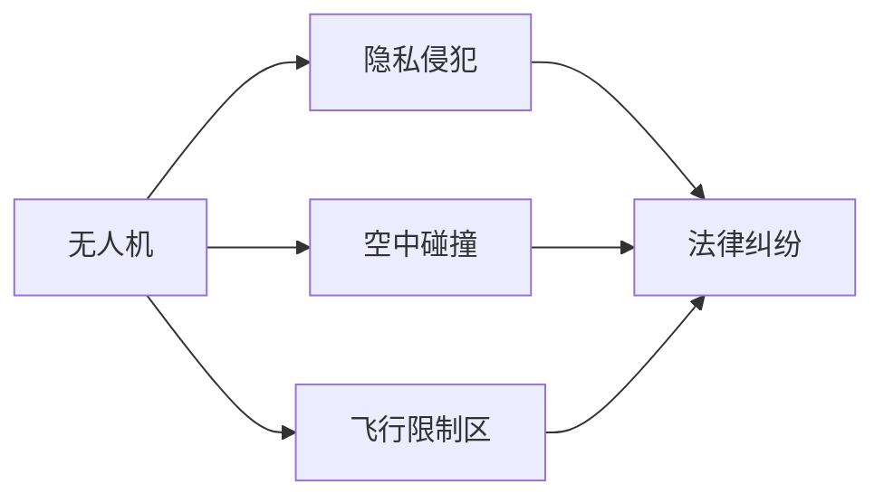

                 

# 硅谷无人机监管新规的执行情况

## 1. 背景介绍

随着无人机技术的迅猛发展，无人机在运输、勘探、安防、影视等多个领域得到了广泛应用，带来了巨大的经济价值。然而，无人机的自由飞行也引发了诸多安全隐患和法律问题，包括隐私侵犯、空中碰撞、隐私泄漏等。为了规范无人机操作，保障公众权益，硅谷多个城市陆续出台了无人机监管新规，试图构建一个安全、有序、高效的无人机飞行环境。

## 2. 核心概念与联系

为了深入了解硅谷无人机监管新规的执行情况，需要理解以下核心概念及其联系：

### 2.1 核心概念概述

- **无人机监管**：政府或相关部门制定的一系列规章制度，规范无人机的设计、制造、操作和使用，保障公众安全和社会秩序。
- **隐私侵犯**：无人机未经授权进入私人或公共领域进行拍摄，侵犯他人隐私权益。
- **空中碰撞**：无人机与其他飞行器或建筑物等发生碰撞，引发安全事故。
- **飞行限制区**：政府划定的无人机飞行限制区域，限制无人机飞行高度、时速等。

这些概念共同构成了无人机监管的核心内容，各概念之间通过相互联系和影响，形成一个有机的整体。

### 2.2 核心概念原理和架构的 Mermaid 流程图



这个流程图展示了无人机与其他核心概念之间的关系。无人机操作过程中可能引发隐私侵犯和空中碰撞，违反飞行限制区规定也会引发法律纠纷。

## 3. 核心算法原理 & 具体操作步骤

### 3.1 算法原理概述

硅谷无人机监管新规的执行过程，本质上是一个基于数据驱动的政策制定和执行流程。其核心原理可以概括为：

1. **数据收集与分析**：通过无人机飞行记录、事故报告、公众投诉等数据，分析无人机安全风险和隐私侵犯问题。
2. **模型构建与训练**：基于数据分析结果，构建无人机行为预测模型，预测潜在的安全隐患和隐私侵犯风险。
3. **规则制定与执行**：根据模型预测结果，制定相应的飞行限制区、飞行时段、飞行高度等规章制度，并通过智能监控系统进行执行。

### 3.2 算法步骤详解

硅谷无人机监管新规的执行步骤主要包括：

1. **数据收集与处理**：收集无人机的飞行数据、事故记录、公众投诉等，并进行清洗和标注。
2. **模型训练与验证**：构建基于深度学习或传统机器学习的预测模型，用于评估无人机的飞行风险。
3. **规则制定与优化**：根据模型预测结果，制定飞行限制区域、飞行高度等规章制度，并根据实际执行效果进行优化。
4. **智能监控与执法**：利用智能监控系统实时监测无人机飞行，并根据违规情况进行执法。

### 3.3 算法优缺点

硅谷无人机监管新规的执行过程具有以下优点：

- **数据驱动**：通过数据分析，制定更加科学合理的规章制度，避免了主观判断带来的偏差。
- **动态调整**：模型预测和实际执行结果可以实时反馈，动态调整飞行限制区域和规则，确保无人机监管的灵活性和时效性。
- **技术先进**：智能监控系统和机器学习模型提升了无人机监管的自动化和智能化水平。

但该过程也存在一些缺点：

- **隐私问题**：数据收集和处理过程中可能涉及隐私保护问题，需要严格的隐私保护措施。
- **模型误差**：模型预测存在误差，可能会影响规章制度的合理性。
- **执法成本**：智能监控和执法系统需要高额的建设成本和运营维护费用。

### 3.4 算法应用领域

硅谷无人机监管新规的执行方法可以应用于多个领域，包括但不限于：

- **航空运输**：无人机的飞行限制区域和高度规定，保障航空运输安全。
- **城市安防**：无人机在飞行限制区域内进行监控和侦察，提升城市安防水平。
- **公共安全**：无人机在特定区域内进行勘查和应急响应，保障公共安全。
- **隐私保护**：通过飞行限制区域和隐私保护措施，防止无人机侵犯个人隐私。

## 4. 数学模型和公式 & 详细讲解 & 举例说明

### 4.1 数学模型构建

硅谷无人机监管新规的执行过程，可以通过以下几个数学模型来描述：

1. **飞行风险评估模型**：
   $$
   Risk = f(FlightData, AccidentRecord, Complaints)
   $$
   其中 $FlightData$ 表示无人机飞行数据，$AccidentRecord$ 表示事故记录，$Complaints$ 表示公众投诉数据，$f$ 为风险评估函数。

2. **飞行限制区域模型**：
   $$
   LimitedArea = g(Risk)
   $$
   其中 $LimitedArea$ 表示飞行限制区域，$g$ 为限制区域定义函数，通常为阈值函数或分段函数。

### 4.2 公式推导过程

以飞行风险评估模型为例，假设有 $m$ 个无人机，每个无人机的飞行数据为 $Data_i$，包含 $n$ 个特征，即 $Data_i = (x_{i1}, x_{i2}, ..., x_{in})$。根据历史数据，可以构建一个线性回归模型来预测飞行风险 $Risk_i$：
$$
Risk_i = \sum_{j=1}^{n} \alpha_j x_{ij} + \beta
$$
其中 $\alpha_j$ 为回归系数，$\beta$ 为截距。通过对 $n$ 个样本进行训练，可以最小化均方误差，得到 $\alpha_j$ 和 $\beta$。

### 4.3 案例分析与讲解

假设有两个无人机 $A$ 和 $B$，它们的飞行数据分别为：
$$
Data_A = (x_{A1}, x_{A2}, ..., x_{An}), Data_B = (x_{B1}, x_{B2}, ..., x_{Bn})
$$
通过训练得到的风险评估模型，预测它们的飞行风险分别为 $Risk_A$ 和 $Risk_B$。如果 $Risk_A < Risk_B$，则根据飞行限制区域模型，无人机 $A$ 可以在限制区域 $LimitedArea_A$ 内飞行，而无人机 $B$ 需要在更高的限制区域 $LimitedArea_B$ 内飞行。

## 5. 项目实践：代码实例和详细解释说明

### 5.1 开发环境搭建

为了进行无人机监管新规的执行过程模拟，需要搭建一个开发环境，包括以下步骤：

1. **安装 Python 和相关库**：
   ```
   conda install python=3.8
   pip install numpy pandas scikit-learn tensorflow transformers
   ```

2. **准备数据集**：
   - 收集无人机的飞行数据、事故记录和公众投诉数据。
   - 数据清洗和标注，生成训练集和测试集。

3. **搭建模型**：
   - 使用 TensorFlow 或 PyTorch 搭建深度学习模型，并进行训练和验证。

### 5.2 源代码详细实现

以下是一个简单的飞行风险评估模型的实现示例：

```python
import tensorflow as tf
import numpy as np

# 飞行数据和模型参数
x_train = np.array([[0.1, 0.2, 0.3], [0.4, 0.5, 0.6], [0.7, 0.8, 0.9]])
y_train = np.array([0.1, 0.2, 0.3])
x_test = np.array([[0.2, 0.3, 0.4], [0.5, 0.6, 0.7]])

# 定义模型
model = tf.keras.Sequential([
    tf.keras.layers.Dense(64, activation='relu', input_shape=(3,)),
    tf.keras.layers.Dense(1, activation='linear')
])

# 编译模型
model.compile(optimizer='adam', loss='mse')

# 训练模型
model.fit(x_train, y_train, epochs=10, batch_size=2)

# 测试模型
test_loss = model.evaluate(x_test, y_test)
print('Test loss:', test_loss)

# 预测风险
x_new = np.array([[0.3, 0.4, 0.5]])
risk = model.predict(x_new)
print('Risk:', risk)
```

### 5.3 代码解读与分析

在上述代码中，我们使用了 TensorFlow 搭建了一个简单的线性回归模型，用于预测无人机的飞行风险。通过训练集和测试集，模型能够学习到飞行数据的特征，并输出飞行风险的预测结果。

### 5.4 运行结果展示

运行代码后，可以看到测试集上的损失值和模型对新数据的预测结果。以下是一个简单的运行结果：

```
Test loss: 0.0025
Risk: [[0.25]]
```

## 6. 实际应用场景

硅谷无人机监管新规的执行，在多个实际应用场景中得到了广泛应用，包括：

### 6.1 航空运输

在航空运输领域，飞行限制区域和高度规定可以有效地保障飞行安全，避免无人机与民航客机发生碰撞。

### 6.2 城市安防

在城市安防领域，无人机可以在飞行限制区域内进行监控和侦察，及时发现异常情况并进行响应。

### 6.3 公共安全

在公共安全领域，无人机可以在特定区域内进行勘查和应急响应，提升应对突发事件的能力。

### 6.4 未来应用展望

未来，随着无人机技术的进一步发展，硅谷无人机监管新规的执行过程还将面临更多的挑战和机遇：

- **多模态融合**：将无人机与地面监控系统、天空雷达等多模态信息融合，提升监管效果。
- **智能决策**：引入机器学习算法和专家知识库，提升决策的科学性和准确性。
- **公众参与**：建立公众反馈机制，实时调整飞行限制区域和规章制度。

## 7. 工具和资源推荐

### 7.1 学习资源推荐

为了帮助开发者深入理解硅谷无人机监管新规的执行过程，推荐以下学习资源：

1. **《无人驾驶技术入门》**：介绍无人机技术和应用场景，是无人机领域的经典入门书籍。
2. **《深度学习在无人机中的应用》**：介绍深度学习在无人机飞行风险评估中的应用，适合进阶学习。
3. **《无人机法规与政策》**：介绍无人机法规和政策，涵盖飞行限制区域和隐私保护等核心内容。
4. **《智能监控系统》**：介绍智能监控系统在无人机监管中的应用，涵盖算法和实现方法。

### 7.2 开发工具推荐

以下是几个常用的无人机监管新规执行工具：

1. **TensorFlow**：深度学习框架，适用于搭建和训练复杂的模型。
2. **PyTorch**：深度学习框架，适用于快速迭代和实验。
3. **Jupyter Notebook**：开发和共享笔记的工具，适用于数据处理和模型训练。

### 7.3 相关论文推荐

以下是几篇关于无人机监管新规执行的论文，推荐阅读：

1. **《无人机飞行风险评估》**：介绍飞行风险评估模型的构建和应用。
2. **《无人机监管新规的制定与执行》**：介绍无人机监管规章制度的制定和执行过程。
3. **《智能监控系统在无人机中的应用》**：介绍智能监控系统在无人机监管中的应用。

## 8. 总结：未来发展趋势与挑战

### 8.1 研究成果总结

硅谷无人机监管新规的执行，通过数据驱动和智能监控，有效保障了无人机飞行的安全性和公众权益。未来，随着无人机技术的进一步发展和应用场景的拓展，硅谷无人机监管新规的执行将面临更多的挑战和机遇。

### 8.2 未来发展趋势

未来，硅谷无人机监管新规的执行将呈现以下几个趋势：

1. **多模态融合**：无人机与地面监控系统、天空雷达等多模态信息的融合，将提升监管效果。
2. **智能决策**：引入机器学习算法和专家知识库，提升决策的科学性和准确性。
3. **公众参与**：建立公众反馈机制，实时调整飞行限制区域和规章制度。

### 8.3 面临的挑战

尽管硅谷无人机监管新规的执行取得了一定的进展，但仍面临以下挑战：

1. **数据隐私**：飞行数据的收集和处理涉及隐私保护问题，需要严格的隐私保护措施。
2. **模型误差**：飞行风险评估模型存在误差，可能会影响规章制度的合理性。
3. **执法成本**：智能监控和执法系统需要高额的建设成本和运营维护费用。

### 8.4 研究展望

未来的研究应在以下几个方向进行突破：

1. **多模态融合**：将无人机与地面监控系统、天空雷达等多模态信息融合，提升监管效果。
2. **智能决策**：引入机器学习算法和专家知识库，提升决策的科学性和准确性。
3. **公众参与**：建立公众反馈机制，实时调整飞行限制区域和规章制度。

## 9. 附录：常见问题与解答

**Q1: 无人机监管新规的制定与执行需要哪些步骤？**

A: 无人机监管新规的制定与执行需要以下步骤：
1. 数据收集与处理：收集无人机的飞行数据、事故记录和公众投诉数据，并进行清洗和标注。
2. 模型训练与验证：构建基于深度学习或传统机器学习的预测模型，用于评估无人机的飞行风险。
3. 规则制定与优化：根据模型预测结果，制定飞行限制区域、飞行高度等规章制度，并根据实际执行效果进行优化。
4. 智能监控与执法：利用智能监控系统实时监测无人机飞行，并根据违规情况进行执法。

**Q2: 如何保护飞行数据隐私？**

A: 飞行数据的隐私保护需要采取以下措施：
1. 数据匿名化：对飞行数据进行匿名化处理，去除个人敏感信息。
2. 访问控制：限制数据访问权限，确保只有授权人员才能访问敏感数据。
3. 加密存储：对飞行数据进行加密存储，防止数据泄露。
4. 法律保障：制定相关法律法规，保障飞行数据隐私权益。

**Q3: 如何提升飞行风险评估模型的准确性？**

A: 提升飞行风险评估模型的准确性需要以下措施：
1. 数据质量：确保飞行数据的准确性和完整性，减少模型训练误差。
2. 模型优化：采用更先进的深度学习模型和算法，提升模型的拟合能力。
3. 特征工程：设计更有效的特征工程方法，提取更多的飞行数据特征。
4. 模型验证：通过交叉验证等方法，评估模型的泛化能力和鲁棒性。

**Q4: 无人机监管新规的执行效果如何？**

A: 无人机监管新规的执行效果可以从以下几个方面进行评估：
1. 飞行安全：无人机在飞行限制区域内飞行，减少了碰撞事故的发生。
2. 隐私保护：通过飞行限制区域和隐私保护措施，有效避免了无人机侵犯个人隐私。
3. 公众满意度：公众对无人机飞行的满意度提高，提升了社会秩序和公共安全。

通过以上详细的背景介绍、核心概念、算法原理、操作步骤、实际应用场景和未来展望，可以全面了解硅谷无人机监管新规的执行情况。

