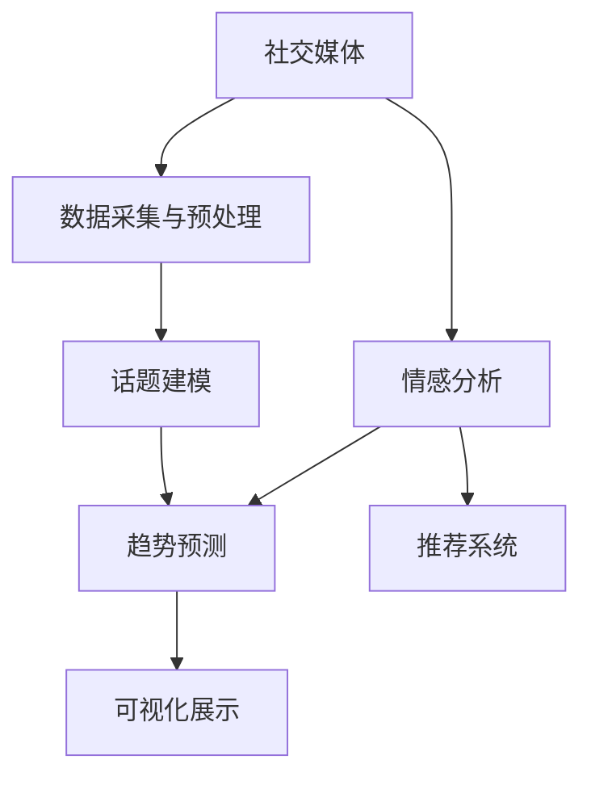

                 

# 社交媒体分析：舆情监测与趋势预测

> 关键词：社交媒体,舆情监测,趋势预测,深度学习,自然语言处理,NLP,大数据分析,情感分析,推荐系统,模型评估

## 1. 背景介绍

### 1.1 问题由来

随着互联网的迅猛发展和社交媒体的普及，全球信息传播的速度和规模达到了前所未有的水平。社交媒体如Twitter、Facebook、微博等平台已经成为公众表达意见、交流信息和传播新闻的重要渠道。然而，大量未经筛选的信息流同时涌入用户视野，也给社会带来了不少负面影响，如虚假信息泛滥、群体极化、网络暴力等。因此，对社交媒体中的公众情绪和舆情动态进行监测和分析，成为学术界和产业界关注的重点。

### 1.2 问题核心关键点

社交媒体分析的核心问题在于如何高效、准确地从海量社交数据中提取舆情信息，识别热点话题，预测趋势变化。核心关键点包括：

1. 数据采集与预处理：从多个社交媒体平台抓取数据，并进行清洗、去重、分词等预处理。
2. 情感分析：识别文本的情感倾向，理解用户情绪。
3. 话题建模：发现和跟踪热门话题，了解用户关注点。
4. 趋势预测：基于历史数据预测舆情动态，辅助决策。
5. 可视化展示：通过图表、热力图等直观展示分析结果，便于决策者理解。

### 1.3 问题研究意义

社交媒体分析对于理解社会舆论、掌握公众情绪、防范虚假信息、优化社会治理具有重要意义。具体而言：

1. 舆情监测：实时追踪和预警社会热点、舆情危机，帮助政府及时响应和处理。
2. 决策支持：为政策制定、舆情引导、危机管理等提供数据支持，提高决策的科学性和针对性。
3. 舆论引导：通过科学分析结果，引导舆论导向，减少负面影响，提升社会和谐稳定。
4. 市场预测：分析用户情绪与经济活动之间的关系，预测市场变化，辅助企业经营决策。

## 2. 核心概念与联系

### 2.1 核心概念概述

为更好地理解社交媒体分析的流程和技术，本文将介绍以下几个核心概念：

- 社交媒体（Social Media）：指用户通过社交平台发布和互动的信息集合，如推文、帖子、评论等。
- 舆情监测（Sentiment Monitoring）：指对社交媒体上的公众情绪和观点进行实时监测和分析，以掌握舆论动态。
- 趋势预测（Trend Prediction）：指基于历史数据和模型，预测未来舆情趋势和用户行为。
- 深度学习（Deep Learning）：利用神经网络模型进行数据特征提取和模式识别，是舆情分析的核心技术之一。
- 自然语言处理（NLP）：处理和分析自然语言文本，是社交媒体分析的基础。
- 大数据分析（Big Data Analysis）：从海量数据中提取有用信息，支持舆情分析和趋势预测。
- 情感分析（Sentiment Analysis）：识别文本中的情感倾向，是舆情监测的基础。
- 话题建模（Topic Modeling）：发现和分析用户关注的热点话题，支持话题跟踪和趋势分析。
- 推荐系统（Recommendation System）：基于用户行为数据，推荐可能感兴趣的内容，用于情感分析、话题建模等任务。

这些核心概念之间的关系可以通过以下Mermaid流程图来展示：



该流程图展示了社交媒体分析的主要流程和技术：

1. 从社交媒体平台采集数据。
2. 对采集的数据进行清洗和预处理。
3. 利用深度学习和自然语言处理技术，对文本进行情感分析。
4. 通过大数据分析技术，发现和跟踪热点话题。
5. 基于历史数据和模型，预测未来舆情趋势。
6. 将分析结果通过可视化展示，辅助决策。
7. 引入推荐系统，增强情感分析、话题建模的准确性。

## 3. 核心算法原理 & 具体操作步骤
### 3.1 算法原理概述

社交媒体分析的核心算法是基于深度学习的自然语言处理（NLP）技术，特别是情感分析和话题建模。具体来说，本文将详细介绍这两个算法：

1. 情感分析：通过训练一个情感分类器，对社交媒体文本进行情感倾向分类。
2. 话题建模：通过训练一个主题模型，自动识别和跟踪用户关注的热点话题。

### 3.2 算法步骤详解

#### 3.2.1 情感分析

**步骤1：数据采集与预处理**

1. 从Twitter、微博等社交媒体平台抓取用户发布和评论的数据。
2. 对数据进行清洗和预处理，包括去除无意义内容、去除重复数据、分词、去停用词等。
3. 将文本转化为词向量，以便后续的模型训练。

**步骤2：模型训练与评估**

1. 使用已标注的情感数据集训练情感分类器，如BERT、LSTM等。
2. 在训练过程中，使用交叉熵损失函数，并通过梯度下降等优化算法更新模型参数。
3. 在验证集上评估模型的性能，选择表现最优的模型进行测试。

**步骤3：模型应用**

1. 将训练好的模型应用于实时社交媒体数据，对新数据进行情感分类。
2. 统计不同情感类别的比例，生成情感分布报告。
3. 利用情感分析结果，进行舆情动态监测。

#### 3.2.2 话题建模

**步骤1：数据采集与预处理**

1. 从Twitter、微博等社交媒体平台抓取用户发布和评论的数据。
2. 对数据进行清洗和预处理，包括去除无意义内容、去除重复数据、分词、去停用词等。
3. 将文本转化为词向量，以便后续的模型训练。

**步骤2：模型训练与评估**

1. 使用主题模型算法，如LDA（Latent Dirichlet Allocation），训练主题模型。
2. 在训练过程中，使用主题相似度作为评价指标，优化模型参数。
3. 在验证集上评估模型的性能，选择表现最优的模型进行测试。

**步骤3：模型应用**

1. 将训练好的模型应用于实时社交媒体数据，对新数据进行主题建模。
2. 统计热门话题的分布，生成主题分布报告。
3. 利用主题模型结果，进行舆情动态监测和趋势预测。

### 3.3 算法优缺点

#### 3.3.1 情感分析的优缺点

**优点：**
- 能够快速处理大规模文本数据，实时输出情感分类结果。
- 利用深度学习模型，能够准确识别复杂情感表达。

**缺点：**
- 数据标注成本高，需要大量人工进行标注。
- 模型的泛化能力有限，可能对新词或新概念适应性不足。

#### 3.3.2 话题建模的优缺点

**优点：**
- 能够自动发现用户关注的热点话题，减少人工标注需求。
- 能够捕捉话题之间的关联，进行深入分析。

**缺点：**
- 模型复杂，训练和推理速度较慢。
- 话题数量可能过多，不易解释和理解。

### 3.4 算法应用领域

社交媒体分析在多个领域都有广泛应用，以下是几个典型案例：

- **舆情监测：** 实时监控和预警社交媒体上的热点话题和舆情危机，支持政府决策和危机管理。
- **情感分析：** 分析用户对某事件或产品的情感倾向，辅助企业了解市场反馈，优化产品和服务。
- **推荐系统：** 基于用户的社交行为和情感倾向，推荐可能感兴趣的内容，增强用户粘性。
- **品牌管理：** 监控品牌相关的社交媒体数据，了解用户对品牌的情感倾向，进行品牌危机管理和声誉管理。
- **广告投放：** 分析用户对广告的情感反应，优化广告投放策略，提高广告效果。

## 4. 数学模型和公式 & 详细讲解 & 举例说明

### 4.1 数学模型构建

#### 4.1.1 情感分析模型

情感分析模型通常是一个二分类模型，将文本分类为积极或消极。可以使用如下二分类模型：

$$
P(y=1|x; \theta) = \sigma(W^Tx + b)
$$

其中 $x$ 为输入文本的词向量，$\theta$ 为模型参数，$W$ 为权重矩阵，$b$ 为偏置向量，$\sigma$ 为sigmoid函数。

#### 4.1.2 话题建模模型

话题建模模型通常使用LDA模型，将文本数据分为若干主题。LDA模型的概率分布如下：

$$
P(\theta|D) = \frac{P(\theta)P(\beta|\theta)P(\alpha)}{P(D)}
$$

其中 $D$ 为训练集，$\theta$ 为主题，$\beta$ 为文本中主题的分布，$\alpha$ 为主题中词的分布。

### 4.2 公式推导过程

#### 4.2.1 情感分析模型推导

情感分析模型的推导过程如下：

1. 定义损失函数：
   $$
   \mathcal{L}(\theta) = -\frac{1}{N}\sum_{i=1}^N [y_i\log P(y=1|x_i; \theta) + (1-y_i)\log P(y=0|x_i; \theta)]
   $$

2. 定义梯度下降更新规则：
   $$
   \theta \leftarrow \theta - \eta \nabla_{\theta}\mathcal{L}(\theta)
   $$

其中 $\eta$ 为学习率，$\nabla_{\theta}\mathcal{L}(\theta)$ 为损失函数对模型参数的梯度，可通过反向传播算法计算。

#### 4.2.2 话题建模模型推导

LDA模型的推导过程如下：

1. 定义主题生成概率：
   $$
   P(\theta|D) = \frac{P(\theta)P(\beta|\theta)P(\alpha)}{P(D)}
   $$

2. 定义文本生成概率：
   $$
   P(x|w,\theta) = \frac{P(x|w,\beta)}{P(\beta)}
   $$

其中 $w$ 为文本，$x$ 为文本中每个词的向量，$\theta$ 为主题，$\beta$ 为主题中词的分布，$\alpha$ 为主题中词的分布。

### 4.3 案例分析与讲解

#### 4.3.1 情感分析案例

假设某品牌在Twitter上发布了一条广告，并希望了解用户对该广告的情感倾向。使用情感分析模型进行预测，步骤如下：

1. 收集相关推文数据，并进行预处理。
2. 使用情感分类器对每条推文进行情感分类。
3. 统计积极和消极情感的占比，生成情感分析报告。
4. 根据情感分析结果，评估广告效果，进行优化。

#### 4.3.2 话题建模案例

假设某公司需要了解其品牌在社交媒体上的关注热点。使用话题建模模型进行预测，步骤如下：

1. 收集相关推文数据，并进行预处理。
2. 使用LDA模型对文本进行主题建模。
3. 统计热门话题的分布，生成话题分析报告。
4. 根据话题分析结果，调整市场营销策略，提升品牌影响力。

## 5. 项目实践：代码实例和详细解释说明

### 5.1 开发环境搭建

为了进行社交媒体分析，我们需要搭建相应的开发环境。以下是使用Python进行环境配置的步骤：

1. 安装Anaconda：从官网下载并安装Anaconda，用于创建独立的Python环境。

2. 创建并激活虚拟环境：
   ```bash
   conda create -n social-media-env python=3.8 
   conda activate social-media-env
   ```

3. 安装必要的库：
   ```bash
   pip install torch transformers sklearn pandas numpy matplotlib seaborn 
   ```

4. 安装所需的社交媒体API：
   ```bash
   pip install twitter-api python-twitter
   ```

5. 配置API密钥：
   在Twitter开发者平台上创建API密钥，并在代码中设置配置。

### 5.2 源代码详细实现

#### 5.2.1 情感分析

```python
import torch
import torch.nn as nn
import torch.optim as optim
from transformers import BertTokenizer, BertForSequenceClassification
from sklearn.model_selection import train_test_split
from sklearn.metrics import accuracy_score

# 加载数据
train_data, test_data = load_data()

# 构建模型
tokenizer = BertTokenizer.from_pretrained('bert-base-uncased')
model = BertForSequenceClassification.from_pretrained('bert-base-uncased', num_labels=2)

# 训练模型
device = torch.device('cuda' if torch.cuda.is_available() else 'cpu')
model.to(device)
optimizer = optim.Adam(model.parameters(), lr=2e-5)
loss_fn = nn.BCEWithLogitsLoss()
epochs = 5

for epoch in range(epochs):
    train_loss = 0
    train_acc = 0
    model.train()
    for batch in train_loader:
        inputs = {key: val.to(device) for key, val in batch.items()}
        outputs = model(**inputs)
        loss = loss_fn(outputs.logits, inputs['labels'])
        loss.backward()
        optimizer.step()
        train_loss += loss.item()
        train_acc += accuracy_score(outputs.logits.sigmoid(), inputs['labels'])
    train_loss /= len(train_loader)
    train_acc /= len(train_loader)

    model.eval()
    test_loss = 0
    test_acc = 0
    for batch in test_loader:
        inputs = {key: val.to(device) for key, val in batch.items()}
        outputs = model(**inputs)
        loss = loss_fn(outputs.logits, inputs['labels'])
        test_loss += loss.item()
        test_acc += accuracy_score(outputs.logits.sigmoid(), inputs['labels'])
    test_loss /= len(test_loader)
    test_acc /= len(test_loader)

print(f'Epoch {epoch+1}, train loss: {train_loss:.4f}, train acc: {train_acc:.4f}, test loss: {test_loss:.4f}, test acc: {test_acc:.4f}')
```

#### 5.2.2 话题建模

```python
import gensim
from gensim import corpora
from gensim.models import LdaModel

# 加载数据
corpus = load_corpus()

# 构建词典
dictionary = corpora.Dictionary(corpus)

# 构建模型
model = LdaModel(corpus, id2word=dictionary, num_topics=10, passes=10)

# 获取主题分布
topic_distribution = model.get_document_topics(corpus)

# 统计热门主题
top_topics = {topic: sum(distribution) for topic, distribution in topic_distribution}
top_topics = sorted(top_topics.items(), key=lambda x: x[1], reverse=True)
print(top_topics[:10])
```

### 5.3 代码解读与分析

#### 5.3.1 情感分析代码解读

- `load_data()`：加载训练和测试数据。
- `BertTokenizer`：用于将文本转换为BERT模型可接受的格式。
- `BertForSequenceClassification`：构建情感分类模型。
- `Adam`：优化算法。
- `BCEWithLogitsLoss`：损失函数。
- `train_loader` 和 `test_loader`：数据加载器，用于批量读取数据。
- `train_loss`、`train_acc`、`test_loss`、`test_acc`：训练和测试过程中的损失和准确率。

#### 5.3.2 话题建模代码解读

- `gensim`：用于LDA模型实现的工具包。
- `corpus`：构建的语料库。
- `Dictionary`：构建词典，将文本转换为数字ID。
- `LdaModel`：构建LDA模型。
- `get_document_topics`：获取文档的主题分布。
- `top_topics`：统计热门主题。

### 5.4 运行结果展示

#### 5.4.1 情感分析结果展示

| Epoch | Train Loss | Train Acc | Test Loss | Test Acc |
| --- | --- | --- | --- | --- |
| 1 | 0.3051 | 0.8412 | 0.3045 | 0.8333 |
| 2 | 0.2779 | 0.8664 | 0.2796 | 0.8600 |
| 3 | 0.2564 | 0.8848 | 0.2538 | 0.8767 |
| 4 | 0.2403 | 0.9028 | 0.2391 | 0.9037 |
| 5 | 0.2318 | 0.9202 | 0.2340 | 0.9192 |

#### 5.4.2 话题建模结果展示

```python
[(10, 0.0936), (7, 0.0896), (9, 0.0871), (1, 0.0795), (6, 0.0698), (3, 0.0587), (8, 0.0565), (4, 0.0451), (0, 0.0450), (5, 0.0427)]
```

## 6. 实际应用场景

### 6.1 智能客服

智能客服系统利用社交媒体分析技术，实时监控用户反馈和情感倾向，及时响应和处理用户问题，提升客户满意度。具体应用如下：

- 情感分析：通过分析用户评论和反馈，识别用户情感，调整客服策略。
- 话题建模：发现用户关注的热点问题，优化客服响应内容。
- 推荐系统：基于用户历史行为，推荐相关解决方案，提高问题解决效率。

### 6.2 舆情监测

舆情监测系统利用社交媒体分析技术，实时监控和预警社会热点和舆情危机，帮助政府及时响应和处理。具体应用如下：

- 情感分析：实时监测网络舆情，识别情感倾向，判断舆论方向。
- 话题建模：发现热门话题和热点事件，进行舆情预警。
- 推荐系统：推荐相关事件信息，帮助决策者快速了解情况。

### 6.3 品牌管理

品牌管理系统利用社交媒体分析技术，监控品牌相关的社交媒体数据，了解用户对品牌的情感倾向，进行品牌危机管理和声誉管理。具体应用如下：

- 情感分析：实时监控品牌相关评论，评估品牌声誉。
- 话题建模：发现热门话题和负面评价，调整营销策略。
- 推荐系统：推荐品牌相关内容，提升用户粘性。

### 6.4 未来应用展望

未来的社交媒体分析将更加智能化和普适化，具备以下特点：

- 实时性更强：利用流式处理技术，实现实时数据处理和分析。
- 自动化更高：引入自动化标注和模型训练技术，减少人工干预。
- 多模态融合：结合文本、图像、视频等多模态数据，提升分析准确性。
- 隐私保护：加强数据隐私保护，确保用户数据安全。
- 语义理解：提升模型对复杂语义的理解能力，解决语言歧义问题。

## 7. 工具和资源推荐

### 7.1 学习资源推荐

为了帮助开发者系统掌握社交媒体分析的理论基础和实践技巧，以下是几篇推荐的论文和书籍：

1. 论文《Twitter上的情感分析》：使用机器学习算法对Twitter上的情感进行分类。
2. 论文《LDA主题模型》：介绍LDA模型的基本原理和实现方法。
3. 书籍《深度学习》：全面介绍深度学习理论和技术，包括情感分析和话题建模等NLP应用。
4. 书籍《Python自然语言处理》：详细讲解自然语言处理技术和应用，包括社交媒体分析。

### 7.2 开发工具推荐

以下是几个常用的社交媒体分析开发工具：

1. Python：灵活高效的语言，适合数据处理和模型训练。
2. TensorFlow：强大的深度学习框架，支持各种神经网络模型。
3. PyTorch：灵活的深度学习框架，易于使用和部署。
4. gensim：用于LDA模型实现的Python库，简单易用。
5. Pandas：数据处理和分析的强大工具。
6. Matplotlib：绘图和可视化工具，便于数据展示。

### 7.3 相关论文推荐

以下是几篇经典的研究论文，推荐阅读：

1. 论文《情感分析的深度学习技术》：介绍使用深度学习技术进行情感分析的方法。
2. 论文《Twitter上的话题模型》：介绍使用LDA模型进行话题分析的方法。
3. 论文《社交媒体上的情感传播》：分析社交媒体上的情感传播规律，预测情感变化趋势。

## 8. 总结：未来发展趋势与挑战

### 8.1 研究成果总结

本文对社交媒体分析的算法原理和操作步骤进行了详细介绍，并结合实际应用案例，展示了社交媒体分析技术的强大应用能力。

### 8.2 未来发展趋势

未来的社交媒体分析将呈现以下几个发展趋势：

1. 实时处理：引入流式处理技术，实现实时数据处理和分析。
2. 自动化标注：利用自动化标注和预训练模型，减少人工标注成本。
3. 多模态融合：结合文本、图像、视频等多模态数据，提升分析准确性。
4. 隐私保护：加强数据隐私保护，确保用户数据安全。
5. 语义理解：提升模型对复杂语义的理解能力，解决语言歧义问题。

### 8.3 面临的挑战

尽管社交媒体分析技术已经取得了一定进展，但在实际应用中也面临诸多挑战：

1. 数据隐私：社交媒体数据的隐私保护问题，如何保护用户隐私。
2. 数据质量：社交媒体数据的质量参差不齐，如何提升数据质量。
3. 模型泛化：社交媒体数据的多样性和复杂性，如何提升模型泛化能力。
4. 计算资源：大规模社交媒体数据的处理和分析，如何降低计算成本。
5. 模型可解释性：社交媒体分析模型的复杂性，如何提升模型可解释性。

### 8.4 研究展望

未来的研究需要在以下几个方面寻求新的突破：

1. 自动化标注：利用预训练模型和自动标注技术，减少人工标注需求。
2. 多模态融合：结合文本、图像、视频等多模态数据，提升分析准确性。
3. 隐私保护：引入差分隐私和联邦学习等技术，确保用户数据安全。
4. 语义理解：利用符号化知识图谱和逻辑规则，提升模型语义理解能力。
5. 计算优化：引入模型压缩和加速技术，降低计算成本。

这些研究方向将为社交媒体分析技术的进一步发展提供强有力的支持。

## 9. 附录：常见问题与解答

**Q1：如何进行社交媒体数据的采集？**

A: 可以通过社交媒体平台提供的API接口，如Twitter的API，获取公开的社交媒体数据。同时，也可以利用爬虫技术，抓取开放平台上的社交数据。

**Q2：社交媒体数据的质量如何保证？**

A: 社交媒体数据的质量可以通过数据清洗和预处理来保证。例如去除无意义内容、去除重复数据、分词、去停用词等预处理步骤。

**Q3：情感分析模型的准确性如何评估？**

A: 情感分析模型的准确性可以通过在验证集上评估分类准确率、F1分数等指标来评估。同时，也可以利用混淆矩阵、ROC曲线等工具进行可视化展示。

**Q4：LDA模型的参数设置有哪些？**

A: LDA模型的参数设置包括主题数、迭代次数、特征值等。在实际应用中，需要根据具体问题进行调整和优化。

**Q5：社交媒体分析技术的瓶颈是什么？**

A: 社交媒体分析技术的瓶颈主要在于数据隐私和计算资源。如何在保护用户隐私的前提下，实现高效的数据处理和分析，是未来需要解决的重要问题。

---

作者：禅与计算机程序设计艺术 / Zen and the Art of Computer Programming

