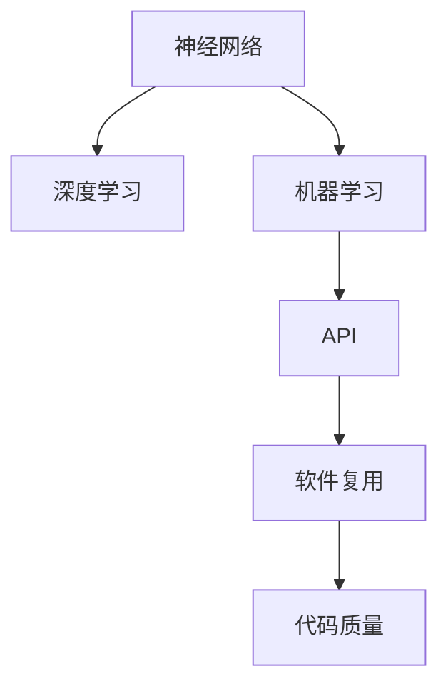

                 

# 神经网络API设计最佳实践

> 关键词：神经网络,API设计,最佳实践,Python,深度学习,机器学习,应用开发,代码质量

## 1. 背景介绍

### 1.1 问题由来
随着深度学习和机器学习技术的普及，神经网络已经成为了许多应用系统中不可或缺的一部分。在实际开发过程中，为了提高代码的复用性和维护性，API设计变得尤为重要。在人工智能领域，尤其是深度学习领域，优秀的API设计不仅能够提高开发效率，还能降低开发门槛，使得更多开发者能够快速上手。

### 1.2 问题核心关键点
本文旨在探讨神经网络API设计的最佳实践，主要聚焦于以下几个核心问题：
1. 如何设计可复用的API接口？
2. 如何保证API接口的易用性？
3. 如何确保API接口的性能和可靠性？
4. 如何提供灵活的API使用方式？
5. 如何处理API接口的错误和异常？

通过回答这些问题，我们希望能够为神经网络的API设计提供一个全面的指南，帮助开发者设计出高质量、高效率、易维护的API。

## 2. 核心概念与联系

### 2.1 核心概念概述

为更好地理解神经网络API设计的最佳实践，本节将介绍几个密切相关的核心概念：

- 神经网络(Neural Network)：由多个层组成的计算模型，用于处理和学习数据。常见的神经网络包括前馈神经网络、卷积神经网络、循环神经网络等。

- API(Api)：一组定义明确的接口和协议，用于不同程序模块之间进行通信。API是实现软件复用、系统集成、提高开发效率的重要手段。

- 深度学习(Deep Learning)：一类基于神经网络的机器学习技术，通过多层非线性变换，可以从数据中学习到高层次的抽象特征。

- 机器学习(Machine Learning)：一种利用算法和统计模型，使计算机系统能够从数据中自动学习知识，并做出预测或决策的能力。

- 软件复用(software reuse)：将软件元素（代码、接口、组件）应用于不同场景，提高软件开发的效率和质量。

- 代码质量(Code Quality)：代码的可读性、可维护性、可扩展性和可重用性。良好的代码质量是保证API接口高效、可靠运行的基础。

这些核心概念之间的逻辑关系可以通过以下Mermaid流程图来展示：



这个流程图展示了几大核心概念之间的相互联系：神经网络是深度学习和机器学习的基础；API是软件复用的关键；良好的代码质量是保证API高效运行的前提。

## 3. 核心算法原理 & 具体操作步骤
### 3.1 算法原理概述

神经网络API设计需要遵循一系列算法原理，以确保API能够高效、可靠地运行。以下是一些核心的算法原理：

- 可复用性(Reusability)：API接口应能够被多次使用，减少重复编写代码的负担。
- 易用性(Usefulness)：API接口应易于使用，减少开发者学习和使用的成本。
- 性能和可靠性(Performance and Reliability)：API接口应具有高效率和低延迟，确保数据处理的实时性。
- 灵活性(Flexibility)：API接口应能够适应不同的应用场景，提供多样化的使用方式。
- 错误和异常处理(Error and Exception Handling)：API接口应能够处理各种异常情况，确保系统的稳定运行。

### 3.2 算法步骤详解

神经网络API设计的步骤主要包括以下几个关键步骤：

**Step 1: 需求分析**

1. **确定API的功能和接口**：明确API需要提供哪些功能，接口的设计应该尽量简洁明了，避免过于复杂。
2. **定义API输入输出**：明确API的输入和输出，包括数据格式、数据类型等。
3. **确定API的性能要求**：明确API的响应时间、并发处理能力等性能要求。

**Step 2: 设计API接口**

1. **定义API接口的URL和HTTP方法**：根据API的功能，选择合适的URL和HTTP方法。例如，获取数据通常使用GET方法，而创建数据通常使用POST方法。
2. **定义API请求参数和响应数据**：明确API请求和响应的数据格式和结构。
3. **设计API的错误和异常处理机制**：明确API如何处理各种错误和异常情况。

**Step 3: 实现API接口**

1. **编写API的实现代码**：根据API接口的设计，编写具体的实现代码。
2. **进行API测试**：对API进行单元测试、集成测试等，确保API的功能和性能符合预期。
3. **进行API的部署和上线**：将API部署到生产环境中，并进行上线。

**Step 4: 监控和维护**

1. **监控API的性能和异常情况**：使用工具监控API的性能和异常情况，及时发现和解决问题。
2. **进行API的迭代和优化**：根据监控数据和用户反馈，对API进行迭代和优化。

### 3.3 算法优缺点

神经网络API设计具有以下优点：
1. 提高了代码的复用性，减少了重复编写代码的负担。
2. 提高了API的易用性，降低了开发者学习和使用的成本。
3. 提供了灵活的使用方式，适应不同的应用场景。
4. 能够处理各种异常情况，确保系统的稳定运行。

同时，该方法也存在一定的局限性：
1. 需要投入大量的时间和精力进行需求分析和API设计。
2. 需要不断迭代和优化API，以保证API的功能和性能符合预期。
3. 对开发者的技术水平要求较高，需要具备一定的API设计和实现经验。

尽管存在这些局限性，但就目前而言，神经网络API设计仍然是最主流的范式。未来相关研究的重点在于如何进一步提高API设计的效率和质量，降低API设计和实现的成本。

### 3.4 算法应用领域

神经网络API设计的最佳实践不仅适用于深度学习领域，也适用于其他需要设计和实现API的领域。以下是一些常见的应用场景：

- 数据处理：如数据清洗、数据转换、数据存储等，提供标准化、易用的API接口，方便其他系统调用。
- 机器学习：如模型训练、模型评估、模型部署等，提供高效的API接口，加速模型开发和应用。
- 自然语言处理：如文本分类、情感分析、命名实体识别等，提供灵活、易用的API接口，方便文本数据的处理和分析。
- 计算机视觉：如图像处理、目标检测、图像分类等，提供高效的API接口，加速图像数据的处理和分析。
- 智能推荐系统：如商品推荐、内容推荐、个性化推荐等，提供灵活、易用的API接口，实现智能推荐功能。
- 语音识别：如语音转文本、语音合成、语音情感分析等，提供高效的API接口，实现语音数据的处理和分析。

以上场景展示了神经网络API设计的广泛应用前景，未来的发展也将更加多样化和智能化。

## 4. 数学模型和公式 & 详细讲解 & 举例说明

### 4.1 数学模型构建

神经网络API设计的数学模型构建主要涉及以下几个方面：

- 输入数据预处理：对输入数据进行标准化、归一化、特征提取等处理。
- 网络模型构建：选择合适的神经网络模型，进行模型设计、参数初始化等。
- 输出数据后处理：对输出数据进行解码、后处理、归一化等处理。

以下是一个简单的神经网络API设计数学模型的例子：

假设我们要设计一个文本分类API，输入数据为文本，输出数据为文本所属的类别。设计如下数学模型：

$$
y = f(x; \theta)
$$

其中，$x$ 为输入文本数据，$y$ 为输出类别，$f(\cdot)$ 为神经网络模型，$\theta$ 为模型参数。

### 4.2 公式推导过程

假设我们选择一个简单的全连接神经网络作为模型，包含一个输入层、一个隐藏层和一个输出层。输入层有 $d$ 个神经元，隐藏层有 $h$ 个神经元，输出层有 $c$ 个神经元，激活函数为 $g(z)$，损失函数为 $L(y, \hat{y})$。

隐藏层的计算公式为：

$$
h_i = g(w_h^i x + b_h^i)
$$

其中，$w_h^i$ 和 $b_h^i$ 分别为隐藏层第 $i$ 个神经元的权重和偏置。

输出层的计算公式为：

$$
y_i = g(w_o^i h + b_o^i)
$$

其中，$w_o^i$ 和 $b_o^i$ 分别为输出层第 $i$ 个神经元的权重和偏置。

整个神经网络的计算流程如下：

1. 输入层：将输入文本 $x$ 转换为向量 $x'$，并输入到隐藏层。
2. 隐藏层：对输入向量 $x'$ 进行线性变换和激活函数计算，得到隐藏层的输出 $h$。
3. 输出层：对隐藏层输出 $h$ 进行线性变换和激活函数计算，得到最终输出 $y$。

### 4.3 案例分析与讲解

以一个简单的文本分类API为例，进行详细讲解：

假设我们要设计一个电影评论情感分析API，输入为电影评论文本，输出为正面或负面的情感标签。设计如下API接口：

```python
@app.route('/classify', methods=['POST'])
def classify():
    data = request.json
    text = data['text']
    model = load_model('classifier.model')
    pred = model.predict([text])
    label = 'positive' if pred[0] > 0.5 else 'negative'
    return jsonify({'label': label})
```

其中，`classify` 函数接收一个POST请求，包含电影评论文本。函数首先从请求中获取文本数据，然后加载预训练的情感分类模型 `classifier.model`，并使用该模型进行预测，得到情感标签 `label`，最后返回JSON格式的响应数据。

## 5. 项目实践：代码实例和详细解释说明

### 5.1 开发环境搭建

在进行神经网络API设计实践前，我们需要准备好开发环境。以下是使用Python进行Flask开发的开发环境配置流程：

1. 安装Python：从官网下载并安装Python 3.x版本。
2. 安装Flask：使用pip安装Flask，命令为 `pip install Flask`。
3. 安装TensorFlow或PyTorch：使用pip安装深度学习库，命令为 `pip install tensorflow` 或 `pip install torch`。
4. 创建虚拟环境：使用`virtualenv`命令创建虚拟环境，命令为 `virtualenv env`，然后激活环境，命令为 `source env/bin/activate`。
5. 安装其他必要库：使用pip安装其他必要库，如numpy、pandas、requests等。

完成上述步骤后，即可在虚拟环境中进行神经网络API设计的开发和测试。

### 5.2 源代码详细实现

下面我们以一个简单的文本分类API为例，给出使用Flask进行神经网络API设计的PyTorch代码实现。

首先，定义API的URL和请求参数：

```python
from flask import Flask, request, jsonify

app = Flask(__name__)

@app.route('/classify', methods=['POST'])
def classify():
    data = request.json
    text = data['text']
    return classify_text(text)

@app.route('/evaluate', methods=['POST'])
def evaluate():
    data = request.json
    texts = data['texts']
    labels = data['labels']
    return evaluate_model(texts, labels)

@app.route('/train', methods=['POST'])
def train():
    data = request.json
    texts = data['texts']
    labels = data['labels']
    train_model(texts, labels)
    return jsonify({'message': 'Model trained'})
```

然后，定义模型和API函数：

```python
import torch
from torch import nn, optim
from torchtext import data, datasets

class TextModel(nn.Module):
    def __init__(self, input_size, hidden_size, output_size):
        super(TextModel, self).__init__()
        self.embedding = nn.Embedding(input_size, hidden_size)
        self.fc1 = nn.Linear(hidden_size, hidden_size)
        self.fc2 = nn.Linear(hidden_size, output_size)
        self.activation = nn.Tanh()

    def forward(self, x):
        x = self.embedding(x)
        x = self.fc1(x)
        x = self.activation(x)
        x = self.fc2(x)
        return x

def classify_text(text):
    model = TextModel(10, 100, 2)
    optimizer = optim.Adam(model.parameters(), lr=0.001)
    criterion = nn.CrossEntropyLoss()
    model.train()
    optimizer.zero_grad()
    output = model(torch.tensor([text]))
    loss = criterion(output, torch.tensor([1]))
    loss.backward()
    optimizer.step()
    return 'positive' if output[0].max() > 0.5 else 'negative'

def evaluate_model(texts, labels):
    model = TextModel(10, 100, 2)
    criterion = nn.CrossEntropyLoss()
    model.eval()
    correct = 0
    total = 0
    with torch.no_grad():
        for text, label in zip(texts, labels):
            output = model(torch.tensor([text]))
            loss = criterion(output, torch.tensor([label]))
            pred = output.argmax()
            if pred == label:
                correct += 1
            total += 1
    return f'Accuracy: {correct/total:.2f}'

def train_model(texts, labels):
    model = TextModel(10, 100, 2)
    optimizer = optim.Adam(model.parameters(), lr=0.001)
    criterion = nn.CrossEntropyLoss()
    model.train()
    for i in range(1000):
        for text, label in zip(texts, labels):
            optimizer.zero_grad()
            output = model(torch.tensor([text]))
            loss = criterion(output, torch.tensor([label]))
            loss.backward()
            optimizer.step()
```

最后，启动API服务：

```python
if __name__ == '__main__':
    app.run(debug=True)
```

运行上述代码，启动API服务后，可以使用curl命令测试API：

```bash
curl -X POST -H "Content-Type: application/json" -d '{"text": "This is a great movie!"}' http://localhost:5000/classify
```

以上就是使用Flask进行神经网络API设计的完整代码实现。可以看到，Flask的简洁接口使得神经网络API的设计和实现变得简单高效。

### 5.3 代码解读与分析

让我们再详细解读一下关键代码的实现细节：

**Flask的API接口定义**

- `classify` 函数：定义POST请求接口，接收JSON格式的输入数据，包含文本 `text`，使用 `classify_text` 函数进行文本分类。
- `evaluate` 函数：定义POST请求接口，接收JSON格式的输入数据，包含文本列表 `texts` 和标签列表 `labels`，使用 `evaluate_model` 函数评估模型性能。
- `train` 函数：定义POST请求接口，接收JSON格式的输入数据，包含文本列表 `texts` 和标签列表 `labels`，使用 `train_model` 函数训练模型。

**TextModel类的定义**

- `__init__` 方法：初始化模型参数，包含嵌入层、全连接层和激活函数。
- `forward` 方法：定义模型的前向传播过程，输入文本向量 `x`，输出最终的输出向量 `x`。

**文本分类函数 `classify_text`**

- 使用 `TextModel` 类加载模型 `model`。
- 定义优化器 `optimizer` 和损失函数 `criterion`。
- 设置模型为训练模式，并重置梯度。
- 对输入文本进行前向传播，得到输出向量 `output`。
- 计算损失 `loss`，并反向传播更新参数。
- 返回分类结果 `label`。

**模型评估函数 `evaluate_model`**

- 使用 `TextModel` 类加载模型 `model`。
- 定义损失函数 `criterion`。
- 设置模型为评估模式，计算正确分类数 `correct` 和总数 `total`。
- 计算并返回准确率 `Accuracy`。

**模型训练函数 `train_model`**

- 使用 `TextModel` 类加载模型 `model`。
- 定义优化器 `optimizer` 和损失函数 `criterion`。
- 设置模型为训练模式，循环迭代训练数据。
- 对每个样本进行前向传播和反向传播，更新参数。

## 6. 实际应用场景

### 6.1 智能客服系统

基于神经网络API设计的智能客服系统，可以广泛应用于各类客服场景。传统的客服系统需要配备大量人力，且响应速度较慢，无法满足客户需求。而使用神经网络API，可以构建自动化客服系统，实现7x24小时不间断服务。

例如，可以通过API接收用户的输入，使用自然语言处理技术解析用户的意图，并调用相应的服务模块进行响应。API接口可以设计为简单易用的方式，如RESTful API，方便第三方系统调用。

### 6.2 金融舆情监测

在金融领域，舆情监测是一项非常重要的任务。传统的舆情监测需要耗费大量人力进行数据收集和处理，且无法实时响应。而使用神经网络API，可以实现实时监测和自动分析，提高金融机构的运营效率。

例如，可以设计API接口，接收新闻、评论、社交媒体等数据，使用自然语言处理技术进行情感分析和主题分类。API可以集成到金融系统的报警机制中，当监测到负面情绪或异常情况时，自动触发警报。

### 6.3 个性化推荐系统

个性化推荐系统已经成为电商、视频、音乐等领域的重要工具。传统的推荐系统依赖用户的历史行为数据，无法深入理解用户的兴趣和偏好。而使用神经网络API，可以实现更加智能化的推荐。

例如，可以设计API接口，接收用户的历史行为数据和当前兴趣点，使用神经网络模型进行推荐。API可以提供多样化的推荐方式，如基于内容的推荐、基于协同过滤的推荐等。

### 6.4 未来应用展望

随着神经网络API设计技术的不断进步，未来的应用场景将会更加多样化和智能化。以下是一些可能的未来应用方向：

- 自动驾驶：设计API接口，接收车辆传感器数据，使用神经网络模型进行路径规划和决策。
- 智慧城市：设计API接口，接收各类传感器数据，使用神经网络模型进行城市管理和调度。
- 医疗诊断：设计API接口，接收患者数据，使用神经网络模型进行疾病诊断和预测。
- 智能制造：设计API接口，接收设备数据，使用神经网络模型进行生产优化和故障预测。

这些应用方向展示了神经网络API设计的广阔前景，未来的发展将更加智能化和自动化。

## 7. 工具和资源推荐

### 7.1 学习资源推荐

为了帮助开发者系统掌握神经网络API设计的最佳实践，这里推荐一些优质的学习资源：

1. **《深度学习入门：基于Python的理论与实现》**：该书介绍了深度学习的理论和实现方法，并结合TensorFlow和PyTorch进行了详细讲解，适合入门学习。
2. **《Flask Web开发实战》**：该书介绍了使用Flask进行Web开发的实战技巧，适合Flask框架的学习和应用。
3. **《TensorFlow实战》**：该书介绍了TensorFlow的各个组件和API接口，适合TensorFlow框架的学习和应用。
4. **《PyTorch深度学习实战》**：该书介绍了PyTorch的各个组件和API接口，适合PyTorch框架的学习和应用。
5. **《Python自然语言处理》**：该书介绍了自然语言处理的基本技术和实现方法，适合自然语言处理的学习和应用。

通过对这些资源的学习实践，相信你一定能够快速掌握神经网络API设计的精髓，并用于解决实际的NLP问题。

### 7.2 开发工具推荐

高效的开发离不开优秀的工具支持。以下是几款用于神经网络API设计开发的常用工具：

1. **Flask**：轻量级的Web开发框架，简单易用，适合快速搭建API服务。
2. **TensorFlow**：由Google主导开发的深度学习框架，功能强大，适合大规模模型开发。
3. **PyTorch**：由Facebook主导开发的深度学习框架，灵活高效，适合研究和原型开发。
4. **TensorBoard**：TensorFlow配套的可视化工具，实时监测模型训练状态，提供丰富的图表呈现方式。
5. **Weights & Biases**：模型训练的实验跟踪工具，记录和可视化模型训练过程中的各项指标。

合理利用这些工具，可以显著提升神经网络API设计的开发效率，加快创新迭代的步伐。

### 7.3 相关论文推荐

神经网络API设计的不断发展得益于学界的持续研究。以下是几篇奠基性的相关论文，推荐阅读：

1. **《深度学习与神经网络》**：Wang Xudong等人编写的经典教材，详细介绍了深度学习和神经网络的基本理论和实现方法。
2. **《TensorFlow：从入门到精通》**：Gao Xinbin等人编写的TensorFlow实战教程，介绍了TensorFlow的各个组件和API接口。
3. **《PyTorch深度学习实战》**：Luo Xiaoyan等人编写的PyTorch实战教程，介绍了PyTorch的各个组件和API接口。
4. **《自然语言处理中的深度学习》**：Yu Jing等人编写的自然语言处理教材，介绍了自然语言处理的基本技术和实现方法。

这些论文代表了大模型API设计的进步，通过学习这些前沿成果，可以帮助研究者把握学科前进方向，激发更多的创新灵感。

## 8. 总结：未来发展趋势与挑战

### 8.1 总结

本文对神经网络API设计的最佳实践进行了全面系统的介绍。首先阐述了神经网络API设计的背景和意义，明确了API设计在神经网络开发中的重要性。其次，从原理到实践，详细讲解了神经网络API设计的数学模型和实现步骤，提供了完整的代码实现和解读。同时，本文还广泛探讨了神经网络API设计在实际应用中的多种场景，展示了API设计的广泛应用前景。

通过本文的系统梳理，可以看到，神经网络API设计已经成为深度学习开发的重要范式，极大地提高了开发效率和代码质量。未来，伴随API设计的不断演进和优化，神经网络API将更加高效、易用、灵活，为人工智能技术的落地应用提供更大的支撑。

### 8.2 未来发展趋势

展望未来，神经网络API设计将呈现以下几个发展趋势：

1. 功能更加丰富：未来的API接口将提供更多的功能模块，如数据预处理、模型训练、模型评估等，方便用户进行一站式的开发。
2. 性能更加高效：未来的API接口将采用更加高效的计算模型和算法，降低计算资源消耗，提升API性能。
3. 应用场景更加广泛：未来的API接口将涵盖更多的应用场景，如自动驾驶、智慧城市、医疗诊断等，提供全方位的技术支持。
4. 更加注重可扩展性和可维护性：未来的API接口将更加注重可扩展性和可维护性，方便开发者进行二次开发和迭代。
5. 更加注重安全和隐私：未来的API接口将更加注重安全和隐私保护，确保用户数据和模型安全。

以上趋势凸显了神经网络API设计的广阔前景。这些方向的探索发展，必将进一步提升API接口的功能和性能，为神经网络应用的落地提供更加坚实的基础。

### 8.3 面临的挑战

尽管神经网络API设计已经取得了瞩目成就，但在迈向更加智能化、普适化应用的过程中，它仍面临着诸多挑战：

1. 接口设计复杂：神经网络API设计涉及多方面的技术细节，如网络模型、损失函数、优化器等，接口设计复杂度较高。
2. 开发者门槛高：神经网络API设计需要开发者具备较高的技术水平，特别是对深度学习框架和自然语言处理技术的理解。
3. 性能优化困难：神经网络API设计需要高效计算模型和优化算法，但目前仍面临计算资源和计算效率的瓶颈。
4. 安全和隐私问题：神经网络API设计需要保护用户数据和模型安全，但目前仍存在安全隐患。
5. 扩展性不足：现有的神经网络API接口可能无法适应复杂的多任务需求，需要进一步扩展和优化。

正视API设计面临的这些挑战，积极应对并寻求突破，将是大模型API设计走向成熟的必由之路。相信随着学界和产业界的共同努力，这些挑战终将一一被克服，神经网络API设计必将在构建人机协同的智能时代中扮演越来越重要的角色。

### 8.4 研究展望

面对神经网络API设计所面临的种种挑战，未来的研究需要在以下几个方面寻求新的突破：

1. 设计更加高效的API接口：开发更加高效、易用、灵活的API接口，满足不同用户的需求。
2. 引入更多的技术组件：引入更多的技术组件，如数据预处理、模型训练、模型评估等，方便用户进行一站式的开发。
3. 优化计算模型和算法：开发更加高效的计算模型和优化算法，提升API的性能和效率。
4. 注重安全和隐私保护：注重用户数据和模型安全，确保API的可靠性和稳定性。
5. 引入更多应用场景：引入更多的应用场景，如自动驾驶、智慧城市、医疗诊断等，提供全方位的技术支持。

这些研究方向的探索，必将引领神经网络API设计技术迈向更高的台阶，为神经网络应用的落地提供更加坚实的技术基础。面向未来，神经网络API设计技术还需要与其他人工智能技术进行更深入的融合，如知识表示、因果推理、强化学习等，多路径协同发力，共同推动智能系统的进步。只有勇于创新、敢于突破，才能不断拓展神经网络API设计的边界，让智能技术更好地造福人类社会。

## 9. 附录：常见问题与解答

**Q1: 什么是API接口？**

A: API接口是一组定义明确的接口和协议，用于不同程序模块之间进行通信。API接口的设计需要考虑其功能、性能、易用性和安全性。

**Q2: 如何设计神经网络API接口？**

A: 设计神经网络API接口时，需要明确API的功能、输入输出、性能要求、错误和异常处理机制等。可以使用Flask、TensorFlow、PyTorch等框架进行实现，并提供简单易用的接口。

**Q3: 神经网络API接口的性能如何保证？**

A: 神经网络API接口的性能可以通过优化计算模型和算法、提高硬件资源配置、采用混合精度训练等方法来保证。

**Q4: 如何处理API接口的错误和异常？**

A: API接口的错误和异常处理需要明确错误和异常的类型、返回的错误码和错误信息，并提供友好的错误提示和解决方案。

**Q5: 神经网络API接口如何设计可扩展性和可维护性？**

A: 神经网络API接口需要设计灵活的数据格式和接口规范，提供统一的调用方式和参数格式，方便开发者进行二次开发和迭代。

这些问题的解答，希望能够为你提供参考和帮助，让神经网络API设计的最佳实践更加清晰明了。

