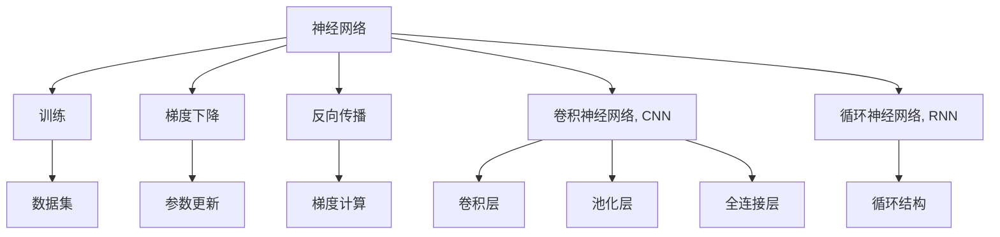

                 

# 神经网络代表软件开发方式的根本性转变

## 1. 背景介绍

### 1.1 问题由来
在过去的几十年里，软件开发方式经历了巨大的变革。从面向过程编程（Procedure-Oriented Programming）到面向对象编程（Object-Oriented Programming），再到函数式编程（Functional Programming），开发者们不断地探索和创新，力求找到更高效、更灵活、更易维护的编程范式。但直到深度学习技术兴起，特别是神经网络（Neural Networks）的广泛应用，软件开发方式再次迎来了一次革命性的转变。

神经网络不仅在图像识别、自然语言处理、语音识别等领域大放异彩，更重要的是，它们为软件开发提供了全新的思维范式。这不仅仅是技术上的突破，更是对传统软件开发方式的一次深刻颠覆。本文旨在探讨神经网络如何代表了一次软件开发方式的根本性转变，并分析这种转变所带来的深远影响。

## 2. 核心概念与联系

### 2.1 核心概念概述

神经网络是一种由大量的人工神经元相互连接组成的计算模型，通过学习数据集中的模式和规律，实现对复杂问题的求解。神经网络的核心思想是对数据进行逐层抽象，最终提取高层次的特征表示。这种特征提取方式与传统编程范式有着显著的差异，对软件开发方式带来了深远的影响。

以下是几个关键概念的介绍及其相互联系：

- **神经网络**：由多个神经元（Neurons）组成的计算模型，能够通过学习自动提取数据的特征表示。
- **训练（Training）**：神经网络通过大量的数据集进行训练，学习如何准确地映射输入和输出。
- **梯度下降（Gradient Descent）**：一种优化算法，通过计算损失函数的梯度来更新神经网络的参数，使得网络输出尽可能接近真实值。
- **反向传播（Backpropagation）**：一种计算过程，用于计算损失函数对网络参数的梯度，进而更新参数。
- **卷积神经网络（Convolutional Neural Networks, CNN）**：适用于处理图像和视频数据的神经网络，具有卷积层、池化层、全连接层等结构。
- **循环神经网络（Recurrent Neural Networks, RNN）**：适用于处理序列数据的神经网络，具有循环结构，能够处理变长的输入序列。

这些概念之间的逻辑关系可以通过以下Mermaid流程图来展示：



这个流程图展示了神经网络训练的过程及其核心组件：

1. 神经网络从数据集中学习，通过梯度下降和反向传播不断调整网络参数。
2. 神经网络可以采用卷积神经网络（CNN）或循环神经网络（RNN）等特定架构，针对不同类型的数据进行建模。
3. 数据集是神经网络训练的基础，通常由大量标注数据组成。
4. 参数更新和梯度计算是训练过程中的关键步骤，用于优化神经网络的表现。

## 3. 核心算法原理 & 具体操作步骤
### 3.1 算法原理概述

神经网络的工作原理可以概括为以下几个步骤：

1. **数据准备**：收集和处理训练数据集，进行预处理和标注。
2. **模型初始化**：定义神经网络的结构，初始化网络参数。
3. **前向传播**：将输入数据输入神经网络，通过前向传播计算输出结果。
4. **损失计算**：计算模型的预测输出与真实标签之间的损失函数，通常是均方误差或交叉熵等。
5. **反向传播**：通过反向传播计算损失函数对网络参数的梯度，用于更新参数。
6. **参数更新**：使用梯度下降等优化算法，根据计算出的梯度更新网络参数，迭代优化模型。

### 3.2 算法步骤详解

以下是神经网络训练的一般流程，以CNN为例：

1. **数据准备**：将图像数据转换为神经网络可处理的格式，如将像素值归一化到0到1之间，并进行标准化处理。

2. **模型初始化**：定义CNN模型，包括卷积层、池化层、全连接层等。初始化网络权重和偏置，通常使用随机初始化或预训练的权重。

3. **前向传播**：将输入图像通过卷积层和池化层进行特征提取，将提取的特征通过全连接层进行分类，输出预测结果。

4. **损失计算**：计算预测结果与真实标签之间的交叉熵损失，衡量模型的预测精度。

5. **反向传播**：从输出层开始，通过链式法则计算每个参数的梯度，将梯度传播回输入层，用于后续的参数更新。

6. **参数更新**：使用梯度下降算法，根据计算出的梯度更新网络参数，不断迭代优化模型。

### 3.3 算法优缺点

神经网络作为一种先进的计算模型，具有以下优点：

- **自适应能力**：神经网络能够自动学习数据的特征表示，无需手动提取特征，适用于复杂的数据处理任务。
- **高效性**：通过深度学习的方式，神经网络能够高效地处理大规模数据集，提高计算效率。
- **泛化能力**：神经网络经过充分训练后，能够泛化到新的数据集上，进行准确的预测和分类。

同时，神经网络也存在一些局限性：

- **资源需求高**：神经网络需要大量的计算资源进行训练和推理，硬件要求较高。
- **难以解释**：神经网络通常被视为一个"黑盒"模型，难以解释其内部的推理逻辑，缺乏可解释性。
- **过拟合风险**：神经网络容易在训练过程中过拟合，需要大量的数据进行训练，且需要防止过拟合。
- **数据依赖性强**：神经网络的效果高度依赖于训练数据的质量和数量，需要大量的标注数据。

### 3.4 算法应用领域

神经网络在多个领域中得到了广泛应用，以下是几个典型的应用场景：

- **计算机视觉**：用于图像分类、目标检测、图像生成等任务。通过卷积神经网络（CNN）等架构，能够高效地处理图像数据。
- **自然语言处理**：用于文本分类、语言建模、机器翻译等任务。通过循环神经网络（RNN）和Transformer等架构，能够处理序列数据。
- **语音识别**：用于语音识别、说话人识别、语音合成等任务。通过递归神经网络（RNN）和长短期记忆网络（LSTM）等架构，能够处理语音信号。
- **推荐系统**：用于商品推荐、内容推荐等任务。通过神经网络能够捕捉用户行为和商品特征之间的关系，进行精准推荐。
- **金融分析**：用于股票预测、信用评估等任务。通过神经网络能够处理复杂的金融数据，进行智能分析和预测。

## 4. 数学模型和公式 & 详细讲解 & 举例说明

### 4.1 数学模型构建

神经网络通常由多个神经元组成，每个神经元接收输入信号，进行加权和，并通过激活函数产生输出。一个典型的神经元结构如下：

$$
z_i = w_i^T x + b_i
$$

$$
a_i = f(z_i)
$$

其中，$z_i$ 为输入信号，$w_i$ 为权重向量，$b_i$ 为偏置项，$f(z_i)$ 为激活函数。神经网络的数学模型可以表示为：

$$
y = h(x; \theta)
$$

其中，$x$ 为输入向量，$y$ 为输出向量，$\theta$ 为网络参数。神经网络的训练目标是使得模型输出尽可能接近真实标签。

### 4.2 公式推导过程

以二分类问题为例，假设有一个二分类任务，输入数据为 $x$，输出为 $y$（$y \in \{0,1\}$），模型输出为 $h(x)$。模型输出与真实标签之间的损失函数通常为交叉熵损失，表示为：

$$
L(h(x), y) = -[y \log h(x) + (1-y) \log (1-h(x))]
$$

神经网络的训练过程可以看作是求解损失函数 $L(h(x), y)$ 的最小值问题，通常使用梯度下降等优化算法进行求解。梯度下降的更新公式为：

$$
\theta \leftarrow \theta - \eta \nabla_{\theta} L(h(x), y)
$$

其中，$\eta$ 为学习率，$\nabla_{\theta} L(h(x), y)$ 为损失函数对网络参数的梯度。

### 4.3 案例分析与讲解

以MNIST手写数字识别任务为例，说明如何使用神经网络进行图像分类。首先，将手写数字图像转换为神经网络可处理的格式，然后定义一个简单的神经网络模型，包括卷积层、池化层和全连接层。训练过程中，使用交叉熵损失函数进行损失计算，并使用梯度下降算法更新网络参数。最终，通过测试集进行验证，评估模型的分类准确率。

## 5. 项目实践：代码实例和详细解释说明

### 5.1 开发环境搭建

在开始神经网络项目之前，需要搭建好开发环境。以下是使用Python进行TensorFlow开发的详细步骤：

1. 安装Anaconda：从官网下载并安装Anaconda，用于创建独立的Python环境。

2. 创建并激活虚拟环境：
```bash
conda create -n tf-env python=3.8
conda activate tf-env
```

3. 安装TensorFlow：根据CUDA版本，从官网获取对应的安装命令。例如：
```bash
conda install tensorflow -c conda-forge -c pypi
```

4. 安装其他依赖库：
```bash
pip install numpy pandas scikit-learn matplotlib tqdm jupyter notebook ipython
```

完成上述步骤后，即可在`tf-env`环境中开始神经网络项目的开发。

### 5.2 源代码详细实现

下面以手写数字识别任务为例，给出使用TensorFlow进行神经网络训练的Python代码实现。

```python
import tensorflow as tf
from tensorflow.keras import layers, models
import numpy as np

# 加载MNIST数据集
mnist = tf.keras.datasets.mnist
(x_train, y_train), (x_test, y_test) = mnist.load_data()

# 数据预处理
x_train = x_train.reshape(-1, 28*28) / 255.0
x_test = x_test.reshape(-1, 28*28) / 255.0
y_train = tf.keras.utils.to_categorical(y_train, 10)
y_test = tf.keras.utils.to_categorical(y_test, 10)

# 定义神经网络模型
model = models.Sequential([
    layers.Dense(256, activation='relu', input_shape=(28*28,)),
    layers.Dense(10, activation='softmax')
])

# 编译模型
model.compile(optimizer='adam',
              loss='categorical_crossentropy',
              metrics=['accuracy'])

# 训练模型
model.fit(x_train, y_train, epochs=5, batch_size=32, validation_data=(x_test, y_test))

# 评估模型
model.evaluate(x_test, y_test, batch_size=32)
```

### 5.3 代码解读与分析

让我们再详细解读一下关键代码的实现细节：

**数据预处理**：
- 将图像数据转换为向量形式，并进行归一化处理。
- 使用`to_categorical`函数将标签转换为独热编码形式，便于模型训练。

**模型定义**：
- 使用`Sequential`模型定义一个简单的神经网络，包括一个全连接层和一个输出层。
- 使用`relu`激活函数作为隐藏层的激活函数，`softmax`激活函数作为输出层的激活函数。

**模型编译**：
- 使用`adam`优化器进行模型训练，`categorical_crossentropy`损失函数用于计算分类任务损失，`accuracy`指标用于评估模型准确率。

**模型训练**：
- 使用`fit`函数对模型进行训练，设置训练轮数为5轮，批量大小为32。
- 使用测试集进行验证，评估模型性能。

**模型评估**：
- 使用`evaluate`函数对模型进行评估，输出测试集上的准确率。

可以看到，使用TensorFlow进行神经网络开发，代码实现相对简洁高效，可以方便地进行模型定义、编译、训练和评估。

## 6. 实际应用场景

### 6.1 图像识别与分类

神经网络在图像识别和分类任务中表现出色。通过对大规模图像数据集进行训练，神经网络能够自动学习到图像的特征表示，进行高效的图像分类和目标检测。在实际应用中，神经网络可以用于人脸识别、物体检测、医学影像分析等领域，为图像处理和计算机视觉带来了新的突破。

### 6.2 自然语言处理

神经网络在自然语言处理（NLP）领域同样大放异彩。通过深度学习的方式，神经网络能够处理复杂的文本数据，进行文本分类、情感分析、机器翻译等任务。在实际应用中，神经网络可以用于智能客服、智能翻译、情感分析等场景，提升了NLP技术的实用性和智能化水平。

### 6.3 语音识别与合成

神经网络在语音识别和合成领域也取得了显著的进展。通过对大量语音数据进行训练，神经网络能够自动学习到语音信号的特征表示，进行语音识别和语音合成。在实际应用中，神经网络可以用于智能语音助手、自动语音识别、语音转换等场景，为语音处理带来了新的可能性。

### 6.4 推荐系统

神经网络在推荐系统中也得到了广泛应用。通过深度学习的方式，神经网络能够捕捉用户行为和商品特征之间的关系，进行精准推荐。在实际应用中，神经网络可以用于电商推荐、音乐推荐、视频推荐等场景，提升了用户体验和平台收益。

### 6.5 金融分析

神经网络在金融分析领域也有着广泛的应用。通过对大量的金融数据进行训练，神经网络能够自动学习到金融市场的特征表示，进行股票预测、信用评估等任务。在实际应用中，神经网络可以用于金融投资、风险评估、财务分析等场景，为金融行业带来了新的决策支持工具。

## 7. 工具和资源推荐

### 7.1 学习资源推荐

为了帮助开发者系统掌握神经网络的基本概念和应用技术，以下是一些优质的学习资源：

1. 《深度学习》系列书籍：由Ian Goodfellow、Yoshua Bengio、Aaron Courville等人合著，全面介绍了深度学习的基本概念和算法，是深度学习领域的经典教材。

2. 《神经网络与深度学习》课程：由Andrew Ng教授在Coursera上开设的深度学习课程，涵盖了神经网络和深度学习的基本概念和算法。

3. TensorFlow官方文档：TensorFlow的官方文档，提供了丰富的教程和样例代码，是TensorFlow学习的重要资源。

4. PyTorch官方文档：PyTorch的官方文档，提供了全面的API和教程，是PyTorch学习的重要资源。

5. Kaggle竞赛平台：Kaggle是一个数据科学竞赛平台，提供了大量公开的数据集和模型，是深度学习实践的重要资源。

通过对这些资源的学习，相信你一定能够快速掌握神经网络的基本原理和应用技术，并用于解决实际问题。

### 7.2 开发工具推荐

高效的开发离不开优秀的工具支持。以下是几款用于神经网络开发的常用工具：

1. TensorFlow：由Google主导开发的深度学习框架，支持多种神经网络模型和优化算法，适合大规模工程应用。

2. PyTorch：由Facebook开发的深度学习框架，灵活性和易用性高，适合研究开发。

3. Keras：Keras是一个高级深度学习框架，基于TensorFlow和Theano实现，提供了简单易用的API，适合快速原型开发。

4. Jupyter Notebook：一个交互式编程环境，支持Python、R等语言，适合数据科学和深度学习开发。

5. Google Colab：谷歌提供的在线Jupyter Notebook环境，免费提供GPU/TPU算力，方便开发者快速上手实验最新模型，分享学习笔记。

合理利用这些工具，可以显著提升神经网络开发的效率，加快创新迭代的步伐。

### 7.3 相关论文推荐

神经网络的发展离不开学界的持续研究。以下是几篇奠基性的相关论文，推荐阅读：

1. "ImageNet Classification with Deep Convolutional Neural Networks"（AlexNet论文）：提出了深度卷积神经网络（CNN），标志着深度学习时代的到来。

2. "Long Short-Term Memory"（LSTM论文）：提出了长短期记忆网络（LSTM），用于处理序列数据，提高了序列建模的准确性。

3. "Attention Is All You Need"（Transformer论文）：提出了Transformer结构，进一步提升了神经网络在自然语言处理领域的表现。

4. "Parameter-Efficient Transfer Learning for Neural Networks"：提出Adapter等参数高效微调方法，在不增加模型参数量的情况下，也能取得不错的微调效果。

5. "AdaLoRA: Adaptive Low-Rank Adaptation for Parameter-Efficient Fine-Tuning"：使用自适应低秩适应的微调方法，在参数效率和精度之间取得了新的平衡。

这些论文代表了大神经网络的发展脉络。通过学习这些前沿成果，可以帮助研究者把握学科前进方向，激发更多的创新灵感。

## 8. 总结：未来发展趋势与挑战

### 8.1 总结

本文对神经网络在软件开发中的应用进行了全面系统的介绍。首先阐述了神经网络在软件开发中的地位和作用，明确了神经网络对传统软件开发方式的深刻影响。其次，从原理到实践，详细讲解了神经网络的数学模型和训练流程，给出了神经网络项目开发的完整代码实例。同时，本文还探讨了神经网络在多个领域的应用前景，展示了神经网络技术的广阔应用空间。

通过本文的系统梳理，可以看到，神经网络不仅在技术上带来了革命性的突破，更在软件开发方式上引发了根本性的转变。这种转变不仅提升了数据处理的效率和准确性，还带来了新的思维范式和应用场景。未来，随着神经网络技术的进一步发展和应用，软件开发方式将迎来更多变革和创新。

### 8.2 未来发展趋势

展望未来，神经网络的发展将呈现以下几个趋势：

1. **模型规模持续增大**：随着算力成本的下降和数据规模的扩张，神经网络的参数量还将持续增长。超大规模神经网络蕴含的丰富特征表示，将进一步提升数据处理的效率和准确性。

2. **模型结构不断优化**：神经网络的架构将不断优化，引入更多的模型结构，如残差网络（ResNet）、卷积神经网络（CNN）、循环神经网络（RNN）、Transformer等，提升模型的表现和可解释性。

3. **算法优化不断突破**：神经网络的优化算法将不断优化，引入更多的算法模型，如自适应优化算法、分布式优化算法等，提升模型的训练效率和效果。

4. **模型应用更加广泛**：神经网络将在更多领域得到应用，如医疗、金融、制造、交通等，带来新的应用场景和商业机会。

5. **跨领域融合不断深化**：神经网络将与其他人工智能技术进行更深层次的融合，如知识表示、因果推理、强化学习等，形成更加全面、高效的应用模型。

以上趋势凸显了神经网络技术的强大潜力和广阔前景。这些方向的探索发展，必将进一步推动神经网络技术的创新和应用，为人工智能技术的进步注入新的动力。

### 8.3 面临的挑战

尽管神经网络在多个领域中取得了显著的成果，但在其发展和应用过程中，仍然面临诸多挑战：

1. **数据依赖性强**：神经网络的效果高度依赖于训练数据的质量和数量，需要大量的标注数据。获取高质量的数据集是神经网络应用的重要瓶颈。

2. **计算资源需求高**：神经网络需要大量的计算资源进行训练和推理，硬件要求较高。如何降低计算成本，提升计算效率，是神经网络应用的难点之一。

3. **模型复杂度高**：神经网络的模型结构复杂，难以解释其内部的推理逻辑，缺乏可解释性。如何在保证性能的同时，提升模型的可解释性，是神经网络应用的重要课题。

4. **过拟合风险高**：神经网络容易在训练过程中过拟合，需要大量的数据进行训练，且需要防止过拟合。如何避免过拟合，提升模型的泛化能力，是神经网络应用的重要挑战。

5. **伦理和安全问题**：神经网络模型在训练过程中可能学习到有害信息，甚至出现偏见，带来伦理和安全问题。如何保证模型的公平性、透明性和安全性，是神经网络应用的重要任务。

6. **跨领域适应性差**：神经网络模型在特定领域中的表现往往优于通用模型，但跨领域适应性较差。如何提升模型的跨领域泛化能力，是神经网络应用的重要课题。

这些挑战凸显了神经网络技术在实际应用中的复杂性和难度，但正是这些挑战推动了神经网络技术的不断进步和完善。未来，随着技术的不断进步和应用的不断深入，神经网络技术将更加成熟，应用场景也将更加广泛。

### 8.4 研究展望

未来，神经网络技术的研究将从以下几个方向进行：

1. **无监督和半监督学习**：探索无监督和半监督学习方法，摆脱对大规模标注数据的依赖，利用自监督学习、主动学习等技术，最大限度利用非结构化数据，实现更加灵活高效的神经网络训练。

2. **自适应学习和转移学习**：研究自适应学习和转移学习方法，提升神经网络模型的泛化能力和跨领域适应性，实现更加通用的模型训练。

3. **多模态学习**：研究多模态学习方法，将神经网络与其他模态的数据（如视觉、语音、文本）进行融合，提升模型的多模态处理能力。

4. **模型压缩和加速**：研究模型压缩和加速技术，降低神经网络模型的计算成本，提升模型的推理速度和实时性。

5. **模型可解释性**：研究模型可解释性方法，提升神经网络模型的可解释性和透明度，增强模型的信任度和可控性。

6. **跨领域知识整合**：研究跨领域知识整合方法，将符号化的先验知识与神经网络模型进行融合，提升模型的知识整合能力和泛化能力。

这些研究方向将进一步推动神经网络技术的创新和发展，为人工智能技术的进步注入新的动力。相信随着研究的不断深入和应用的不断拓展，神经网络技术将更加成熟，带来更多创新和突破。

## 9. 附录：常见问题与解答

**Q1：神经网络是否可以用于处理非结构化数据？**

A: 神经网络可以用于处理非结构化数据，如文本、图像、音频等。通过适当的预处理和特征提取，神经网络能够自动学习数据的特征表示，进行高效的建模和预测。但需要注意的是，非结构化数据的特征提取和预处理需要根据具体任务进行设计，确保数据质量和一致性。

**Q2：神经网络是否适用于所有类型的任务？**

A: 神经网络适用于大多数类型的任务，特别是那些需要复杂特征提取和模式识别的问题。但对于一些简单的任务，如数据清洗、数据验证等，传统的算法可能更加高效。需要根据具体任务的特点和需求，选择合适的算法和模型。

**Q3：神经网络如何避免过拟合？**

A: 神经网络可以通过以下方法避免过拟合：
1. 数据增强：通过数据增强技术，扩充训练集，增加数据多样性。
2. 正则化：使用L2正则化、Dropout等技术，限制模型的复杂度。
3. 早期停止：在验证集上监控模型性能，一旦性能不再提升，停止训练。
4. 模型集成：使用多个模型的预测结果进行集成，提高模型的泛化能力。

这些方法需要根据具体任务和数据集进行灵活组合，以最大化模型的泛化能力。

**Q4：神经网络如何提升模型的可解释性？**

A: 提升神经网络模型的可解释性是当前研究的热点之一。以下是一些常见的方法：
1. 可视化技术：使用可视化技术，如热力图、激活图等，展示模型在不同输入下的特征提取和推理过程。
2. 模型压缩：使用模型压缩技术，降低模型的复杂度，提高模型的可解释性。
3. 模型解释器：使用模型解释器，如LIME、SHAP等，解释模型的决策过程。

这些方法可以相互结合使用，提升神经网络模型的可解释性。

**Q5：神经网络如何应对数据分布变化？**

A: 神经网络可以通过以下方法应对数据分布变化：
1. 模型更新：定期使用新数据对模型进行重新训练，更新模型参数。
2. 在线学习：使用在线学习技术，实时更新模型参数，适应数据分布的变化。
3. 自适应学习：研究自适应学习方法，使模型能够自适应数据分布的变化。

这些方法需要根据具体任务和数据集进行灵活选择，以最大化模型的稳定性和泛化能力。

---

作者：禅与计算机程序设计艺术 / Zen and the Art of Computer Programming

