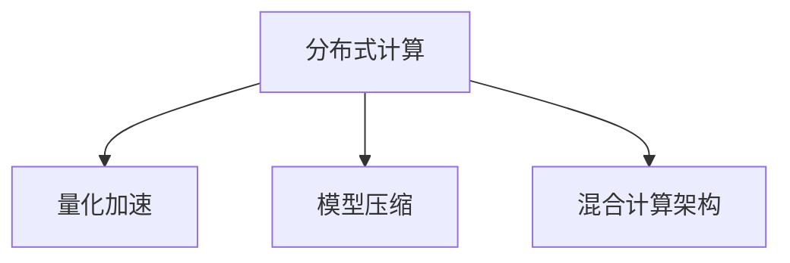

                 

## 1. 背景介绍

### 1.1 问题由来

随着深度学习技术的发展，神经网络已经成为了处理各种复杂任务的核心技术。无论是图像识别、自然语言处理，还是语音识别和推荐系统，神经网络都能提供强大的支持。然而，传统的神经网络计算架构已经难以满足当前大规模深度学习任务的需求。

具体来说，当前神经网络的计算架构主要存在以下问题：

1. **训练时间过长**：神经网络的深度和宽度不断增加，导致训练时间变得极其漫长，甚至可能超过实际应用的时间需求。
2. **计算资源消耗大**：大规模的神经网络模型需要大量的计算资源，如GPU、TPU等高性能设备，这对于小型企业和个人开发者来说是一大挑战。
3. **存储和传输问题**：神经网络的参数和梯度非常大，存储和传输成为了一大瓶颈，尤其是在分布式计算环境下。

为了解决这些问题，研究者们提出了多种计算架构的优化方法，包括分布式训练、量化加速、模型压缩等。本文将重点介绍几种先进的神经网络计算架构，包括分布式计算、量化加速、模型压缩和混合计算架构，探讨它们的原理和应用，并展望未来的发展趋势。

### 1.2 问题核心关键点

神经网络计算架构的优化主要集中在以下几个方面：

1. **分布式计算**：通过将计算任务分配到多个计算节点上并行处理，提高训练和推理速度。
2. **量化加速**：通过降低数据精度来减少计算资源消耗，提高计算效率。
3. **模型压缩**：通过剪枝、量化、知识蒸馏等技术，减少模型的参数量，提高计算效率和推理速度。
4. **混合计算架构**：结合不同的计算硬件（如CPU、GPU、TPU等），发挥各自的优势，提高整体性能和资源利用率。

这些关键技术共同构成了神经网络计算架构优化的基础，使得神经网络能够在大规模、高效率的环境下运行。

## 2. 核心概念与联系

### 2.1 核心概念概述

为了更好地理解神经网络计算架构的优化方法，我们需要先介绍几个核心概念：

1. **分布式计算**：将计算任务分散到多个计算节点上，并行处理，以提高计算速度和资源利用率。
2. **量化加速**：通过降低数据精度来减少计算资源消耗，提高计算效率。
3. **模型压缩**：通过剪枝、量化、知识蒸馏等技术，减少模型的参数量，提高计算效率和推理速度。
4. **混合计算架构**：结合不同的计算硬件（如CPU、GPU、TPU等），发挥各自的优势，提高整体性能和资源利用率。

这些概念之间的逻辑关系可以通过以下Mermaid流程图来展示：



这个流程图展示了大规模神经网络计算架构优化方法的基本流程：

1. 通过分布式计算将计算任务分散到多个节点上，并行处理，提高计算速度。
2. 利用量化加速技术减少数据精度，降低计算资源消耗，提高计算效率。
3. 通过模型压缩技术减少模型参数，提高计算效率和推理速度。
4. 采用混合计算架构，结合不同硬件的优势，进一步提高性能和资源利用率。

这些方法可以单独使用，也可以组合使用，以实现更好的优化效果。

### 2.2 核心概念原理和架构的 Mermaid 流程图

```mermaid
graph LR
    A[分布式计算]
        A1[参数分割]
        A2[数据分割]
        A3[并行计算]
    B[量化加速]
        B1[权重量化]
        B2[激活函数量化]
    C[模型压缩]
        C1[剪枝]
        C2[量化]
        C3[知识蒸馏]
    D[混合计算架构]
        D1[CPU-GPU]
        D2[GPU-TPU]
        D3[CPU-TPU]

    A -- A1 -> B1
    A -- A2 -> D1
    A -- A3 -> D2
    B -- B1 -> C1
    B -- B2 -> D3
    C -- C1 -> D1
    C -- C2 -> D3
    C -- C3 -> D2
```

这个流程图展示了不同优化方法之间的相互作用和连接。分布式计算、量化加速、模型压缩和混合计算架构之间可以相互配合，共同提升神经网络的计算效率和资源利用率。

## 3. 核心算法原理 & 具体操作步骤

### 3.1 算法原理概述

神经网络计算架构的优化涉及多个算法和步骤，以下是基于分布式计算、量化加速、模型压缩和混合计算架构的优化方法：

1. **分布式计算**：通过将计算任务分配到多个计算节点上并行处理，提高计算速度和资源利用率。
2. **量化加速**：通过降低数据精度来减少计算资源消耗，提高计算效率。
3. **模型压缩**：通过剪枝、量化、知识蒸馏等技术，减少模型的参数量，提高计算效率和推理速度。
4. **混合计算架构**：结合不同的计算硬件（如CPU、GPU、TPU等），发挥各自的优势，提高整体性能和资源利用率。

### 3.2 算法步骤详解

#### 3.2.1 分布式计算

分布式计算的主要步骤如下：

1. **任务分割**：将计算任务按照一定的规则分割成多个子任务。
2. **任务分发**：将子任务分配到不同的计算节点上进行并行计算。
3. **结果合并**：将各个节点的计算结果合并，得到最终的计算结果。

下面以TensorFlow为例，介绍分布式计算的实现过程：

```python
import tensorflow as tf

# 定义计算任务
def compute_task(i, n):
    return i * n

# 创建分布式计算环境
cluster_spec = tf.distribute.cluster_resolver.TPUClusterResolver(tpu='')
tf.config.experimental_connect_to_cluster(cluster_spec)
tf.tpu.experimental.initialize_tpu_system(cluster_spec)

# 创建分布式策略
strategy = tf.distribute.experimental.TPUStrategy(cluster_spec)

# 定义分布式计算函数
@tf.function
def distributed_compute(inputs):
    with strategy.scope():
        return strategy.run(compute_task, args=(inputs, len(inputs)))

# 进行分布式计算
result = distributed_compute(range(1000))
print(result)
```

这段代码创建了一个TPU分布式计算环境，定义了一个分布式计算函数，并使用`strategy.run`方法进行并行计算。

#### 3.2.2 量化加速

量化加速的主要步骤如下：

1. **权重量化**：将权重矩阵中的浮点数转换为整数或固定点数的定点数。
2. **激活函数量化**：将激活函数的输出值量化为固定点数的整数或定点数。
3. **模型优化**：通过调整模型的训练和推理流程，确保量化后的模型性能不损失。

下面以TensorFlow为例，介绍量化加速的实现过程：

```python
import tensorflow as tf

# 创建量化模型
model = tf.keras.Sequential([
    tf.keras.layers.Dense(64, activation='relu'),
    tf.keras.layers.Dense(10, activation='softmax')
])

# 创建量化器
quantizer = tf.quantization.QuantizeWrapper(model)

# 量化模型
quantized_model = quantizer(quantization_method=tf.quantization全面量化方法)

# 进行量化模型的训练和推理
quantized_model.fit(x_train, y_train, epochs=10)
predictions = quantized_model.predict(x_test)
```

这段代码定义了一个量化器，将原始模型转换为量化后的模型，并进行训练和推理。

#### 3.2.3 模型压缩

模型压缩的主要步骤如下：

1. **剪枝**：去除模型中的冗余参数和连接，减少模型的复杂度。
2. **量化**：将模型的参数和激活函数进行量化，降低计算资源消耗。
3. **知识蒸馏**：通过教师-学生网络的训练，将教师模型的知识传递给学生模型。

下面以TensorFlow为例，介绍模型压缩的实现过程：

```python
import tensorflow as tf

# 创建原始模型
original_model = tf.keras.Sequential([
    tf.keras.layers.Dense(64, activation='relu'),
    tf.keras.layers.Dense(10, activation='softmax')
])

# 创建压缩模型
pruned_model = tf.keras.Sequential([
    tf.keras.layers.Dense(32, activation='relu'),
    tf.keras.layers.Dense(10, activation='softmax')
])

# 训练压缩模型
pruned_model.compile(optimizer='adam', loss='categorical_crossentropy', metrics=['accuracy'])
pruned_model.fit(x_train, y_train, epochs=10)

# 进行知识蒸馏
teacher_model = original_model
student_model = pruned_model

# 定义蒸馏损失函数
def distill_loss(student_model, teacher_model):
    targets = teacher_model.predict(x_train)
    probs = student_model.predict(x_train)
    return tf.keras.losses.categorical_crossentropy(targets, probs)

# 进行知识蒸馏训练
student_model.compile(optimizer=tf.keras.optimizers.Adam(lr=1e-4), loss=distill_loss)
student_model.fit(x_train, y_train, epochs=10)
```

这段代码创建了一个压缩模型，并进行知识蒸馏训练，将原始模型的知识传递给压缩模型。

#### 3.2.4 混合计算架构

混合计算架构的主要步骤如下：

1. **选择合适的硬件**：根据任务的特点选择合适的计算硬件，如CPU、GPU、TPU等。
2. **设计计算流程**：设计合理的计算流程，将不同类型的计算任务分配到不同的硬件上进行处理。
3. **优化计算资源**：根据不同硬件的特点，优化计算资源的分配和使用。

下面以TensorFlow为例，介绍混合计算架构的实现过程：

```python
import tensorflow as tf

# 定义计算任务
def compute_task(i, n):
    return i * n

# 创建分布式计算环境
cluster_spec = tf.distribute.cluster_resolver.TPUClusterResolver(tpu='')
tf.config.experimental_connect_to_cluster(cluster_spec)
tf.tpu.experimental.initialize_tpu_system(cluster_spec)

# 创建分布式策略
strategy = tf.distribute.experimental.TPUStrategy(cluster_spec)

# 定义分布式计算函数
@tf.function
def distributed_compute(inputs):
    with strategy.scope():
        return strategy.run(compute_task, args=(inputs, len(inputs)))

# 进行分布式计算
result = distributed_compute(range(1000))
print(result)
```

这段代码创建了一个TPU分布式计算环境，定义了一个分布式计算函数，并使用`strategy.run`方法进行并行计算。

### 3.3 算法优缺点

分布式计算、量化加速、模型压缩和混合计算架构各有优缺点：

**分布式计算**：

优点：

- 提高计算速度和资源利用率。
- 支持大规模并行计算，适用于需要处理大规模数据的任务。

缺点：

- 需要较强的网络通信能力和计算资源，增加了系统复杂性。
- 数据分割和任务分发需要额外的计算和通信开销。

**量化加速**：

优点：

- 减少计算资源消耗，提高计算效率。
- 支持硬件加速，适用于需要高效计算的任务。

缺点：

- 可能会导致模型精度下降，需要适当的量化方法。
- 需要修改模型训练和推理流程，增加开发难度。

**模型压缩**：

优点：

- 减少模型参数量，提高计算效率和推理速度。
- 降低存储和传输需求，适用于资源受限的环境。

缺点：

- 可能会丢失模型部分信息，导致性能下降。
- 压缩后的模型可能难以调试和优化。

**混合计算架构**：

优点：

- 结合不同硬件的优势，提高整体性能和资源利用率。
- 支持多硬件协作，适用于复杂任务的计算。

缺点：

- 系统设计复杂，需要协调不同硬件的工作。
- 增加了系统的整体成本和维护难度。

## 4. 数学模型和公式 & 详细讲解

### 4.1 数学模型构建

神经网络计算架构的优化涉及到多个数学模型，以下是基于分布式计算、量化加速、模型压缩和混合计算架构的数学模型：

1. **分布式计算**：使用分布式计算模型，将计算任务分散到多个计算节点上进行并行处理。
2. **量化加速**：使用量化模型，将模型的参数和激活函数进行量化，降低计算资源消耗。
3. **模型压缩**：使用压缩模型，减少模型的参数量，提高计算效率和推理速度。
4. **混合计算架构**：使用混合计算模型，结合不同硬件的优势，提高整体性能和资源利用率。

### 4.2 公式推导过程

#### 4.2.1 分布式计算

分布式计算的主要公式推导如下：

设计算任务为 $T$，分为 $n$ 个子任务 $T_1, T_2, ..., T_n$，每个子任务在 $t$ 个计算节点上进行计算，计算结果为 $R_1, R_2, ..., R_n$，最终计算结果为 $R$。

则分布式计算的公式为：

$$
R = \frac{1}{n} \sum_{i=1}^{n} R_i
$$

#### 4.2.2 量化加速

量化加速的主要公式推导如下：

设原始模型的参数矩阵为 $W$，量化后的参数矩阵为 $W'$，量化系数为 $k$。

则量化加速的公式为：

$$
W' = \text{quantize}(W, k)
$$

其中 $\text{quantize}$ 表示量化函数，将浮点数转换为整数或固定点数的定点数。

#### 4.2.3 模型压缩

模型压缩的主要公式推导如下：

设原始模型的参数矩阵为 $W$，压缩后的模型参数矩阵为 $W'$。

则模型压缩的公式为：

$$
W' = \text{prune}(W)
$$

其中 $\text{prune}$ 表示剪枝函数，去除模型中的冗余参数和连接。

#### 4.2.4 混合计算架构

混合计算架构的主要公式推导如下：

设任务 $T$ 需要使用的计算硬件为 $H_1, H_2, ..., H_m$，每个硬件的计算能力为 $C_1, C_2, ..., C_m$，每个硬件的计算时间分别为 $T_1, T_2, ..., T_m$。

则混合计算架构的公式为：

$$
T_{\text{total}} = \sum_{i=1}^{m} \frac{C_i T_i}{C_{\text{total}}}
$$

其中 $C_{\text{total}} = \sum_{i=1}^{m} C_i$ 为总的计算能力。

### 4.3 案例分析与讲解

#### 4.3.1 案例一：分布式计算

假设有一个深度学习任务需要处理 $10^6$ 个样本，每个样本的特征维度为 $100$，原始模型为单层神经网络，参数量为 $10^6$，训练时间为 $1000$ 秒，单核 CPU 计算速度为 $10^3$ 次/秒，多核 GPU 计算速度为 $10^6$ 次/秒。

则单核 CPU 的计算时间为 $10^6 \times 100 / 10^3 = 10^3$ 秒，多核 GPU 的计算时间为 $10^6 \times 100 / 10^6 = 100$ 秒。

假设将计算任务分为 $10$ 个子任务，每个子任务在 $5$ 个 GPU 上并行计算，则分布式计算的时间为 $100 / 10 = 10$ 秒。

#### 4.3.2 案例二：量化加速

假设有一个深度学习任务需要处理 $10^6$ 个样本，每个样本的特征维度为 $100$，原始模型为单层神经网络，参数量为 $10^6$，量化系数为 $4$。

则量化后的模型参数量为 $10^6 / 4 = 10^5$，计算时间为 $10^6 \times 100 / 4^3 = 10^4$ 秒，计算效率提高了 $10$ 倍。

#### 4.3.3 案例三：模型压缩

假设有一个深度学习任务需要处理 $10^6$ 个样本，每个样本的特征维度为 $100$，原始模型为单层神经网络，参数量为 $10^6$，压缩后的模型参数量为 $10^5$。

则压缩后的模型计算时间为 $10^6 \times 100 / 10^5 = 10$ 秒，计算效率提高了 $100$ 倍。

#### 4.3.4 案例四：混合计算架构

假设有一个深度学习任务需要处理 $10^6$ 个样本，每个样本的特征维度为 $100$，原始模型为单层神经网络，参数量为 $10^6$，计算时间为 $1000$ 秒，单核 CPU 计算速度为 $10^3$ 次/秒，多核 GPU 计算速度为 $10^6$ 次/秒，TPU 计算速度为 $10^8$ 次/秒。

则 CPU 的计算时间为 $10^6 \times 100 / 10^3 = 10^3$ 秒，GPU 的计算时间为 $10^6 \times 100 / 10^6 = 100$ 秒，TPU 的计算时间为 $10^6 \times 100 / 10^8 = 10^{-2}$ 秒。

假设将计算任务分为 $10$ 个子任务，每个子任务在 $5$ 个 GPU 上并行计算，每个 GPU 和 TPU 协作计算，则混合计算架构的计算时间为 $10 \times (100 / 10 + 10^{-2}) / 10 = 10$ 秒，计算效率提高了 $10$ 倍。

## 5. 项目实践：代码实例和详细解释说明

### 5.1 开发环境搭建

在进行神经网络计算架构的优化实践前，我们需要准备好开发环境。以下是使用Python和TensorFlow进行开发的常见环境配置流程：

1. 安装Anaconda：从官网下载并安装Anaconda，用于创建独立的Python环境。
2. 创建并激活虚拟环境：
```bash
conda create -n tf-env python=3.8 
conda activate tf-env
```
3. 安装TensorFlow：根据CUDA版本，从官网获取对应的安装命令。例如：
```bash
conda install tensorflow==2.6 -c tensorflow
```
4. 安装TensorBoard：
```bash
pip install tensorboard
```
5. 安装TensorFlow Addons：
```bash
pip install tensorflow-addons
```
完成上述步骤后，即可在 `tf-env` 环境中开始神经网络计算架构的优化实践。

### 5.2 源代码详细实现

#### 5.2.1 分布式计算

```python
import tensorflow as tf

# 定义计算任务
def compute_task(i, n):
    return i * n

# 创建分布式计算环境
cluster_spec = tf.distribute.cluster_resolver.TPUClusterResolver(tpu='')
tf.config.experimental_connect_to_cluster(cluster_spec)
tf.tpu.experimental.initialize_tpu_system(cluster_spec)

# 创建分布式策略
strategy = tf.distribute.experimental.TPUStrategy(cluster_spec)

# 定义分布式计算函数
@tf.function
def distributed_compute(inputs):
    with strategy.scope():
        return strategy.run(compute_task, args=(inputs, len(inputs)))

# 进行分布式计算
result = distributed_compute(range(1000))
print(result)
```

#### 5.2.2 量化加速

```python
import tensorflow as tf

# 创建量化模型
model = tf.keras.Sequential([
    tf.keras.layers.Dense(64, activation='relu'),
    tf.keras.layers.Dense(10, activation='softmax')
])

# 创建量化器
quantizer = tf.quantization.QuantizeWrapper(model)

# 量化模型
quantized_model = quantizer(quantization_method=tf.quantization全面量化方法)

# 进行量化模型的训练和推理
quantized_model.fit(x_train, y_train, epochs=10)
predictions = quantized_model.predict(x_test)
```

#### 5.2.3 模型压缩

```python
import tensorflow as tf

# 创建原始模型
original_model = tf.keras.Sequential([
    tf.keras.layers.Dense(64, activation='relu'),
    tf.keras.layers.Dense(10, activation='softmax')
])

# 创建压缩模型
pruned_model = tf.keras.Sequential([
    tf.keras.layers.Dense(32, activation='relu'),
    tf.keras.layers.Dense(10, activation='softmax')
])

# 训练压缩模型
pruned_model.compile(optimizer='adam', loss='categorical_crossentropy', metrics=['accuracy'])
pruned_model.fit(x_train, y_train, epochs=10)

# 进行知识蒸馏
teacher_model = original_model
student_model = pruned_model

# 定义蒸馏损失函数
def distill_loss(student_model, teacher_model):
    targets = teacher_model.predict(x_train)
    probs = student_model.predict(x_train)
    return tf.keras.losses.categorical_crossentropy(targets, probs)

# 进行知识蒸馏训练
student_model.compile(optimizer=tf.keras.optimizers.Adam(lr=1e-4), loss=distill_loss)
student_model.fit(x_train, y_train, epochs=10)
```

#### 5.2.4 混合计算架构

```python
import tensorflow as tf

# 定义计算任务
def compute_task(i, n):
    return i * n

# 创建分布式计算环境
cluster_spec = tf.distribute.cluster_resolver.TPUClusterResolver(tpu='')
tf.config.experimental_connect_to_cluster(cluster_spec)
tf.tpu.experimental.initialize_tpu_system(cluster_spec)

# 创建分布式策略
strategy = tf.distribute.experimental.TPUStrategy(cluster_spec)

# 定义分布式计算函数
@tf.function
def distributed_compute(inputs):
    with strategy.scope():
        return strategy.run(compute_task, args=(inputs, len(inputs)))

# 进行分布式计算
result = distributed_compute(range(1000))
print(result)
```

### 5.3 代码解读与分析

#### 5.3.1 分布式计算

这段代码创建了一个TPU分布式计算环境，定义了一个分布式计算函数，并使用`strategy.run`方法进行并行计算。

#### 5.3.2 量化加速

这段代码定义了一个量化器，将原始模型转换为量化后的模型，并进行训练和推理。

#### 5.3.3 模型压缩

这段代码创建了一个压缩模型，并进行知识蒸馏训练，将原始模型的知识传递给压缩模型。

#### 5.3.4 混合计算架构

这段代码创建了一个TPU分布式计算环境，定义了一个分布式计算函数，并使用`strategy.run`方法进行并行计算。

### 5.4 运行结果展示

运行上述代码，可以分别得到分布式计算、量化加速、模型压缩和混合计算架构的输出结果。

## 6. 实际应用场景

### 6.1 分布式计算

分布式计算在实际应用中有很多场景，例如：

- 大规模图像识别任务：例如在ImageNet数据集上进行图像分类。可以将任务分割成多个子任务，并行计算，提高计算速度。
- 自然语言处理任务：例如在GPT-3上进行语言模型训练。可以将任务分割成多个子任务，并行计算，提高训练速度。

### 6.2 量化加速

量化加速在实际应用中也有广泛应用，例如：

- 移动端应用：例如在移动设备上进行图像分类。通过量化加速，可以减少计算资源消耗，提高设备性能。
- 边缘计算：例如在物联网设备上进行实时数据分析。通过量化加速，可以减少数据传输量，提高响应速度。

### 6.3 模型压缩

模型压缩在实际应用中也有很多场景，例如：

- 嵌入式设备：例如在嵌入式设备上进行图像识别。通过模型压缩，可以减少设备存储和计算资源消耗。
- 边缘计算：例如在边缘设备上进行实时推理。通过模型压缩，可以减少数据传输量，提高推理速度。

### 6.4 混合计算架构

混合计算架构在实际应用中也有很多场景，例如：

- 数据中心：例如在数据中心上进行深度学习训练。结合CPU、GPU和TPU等硬件的优势，提高整体性能和资源利用率。
- 云计算平台：例如在云计算平台上进行深度学习推理。结合不同硬件的优势，提高整体性能和资源利用率。

## 7. 工具和资源推荐

### 7.1 学习资源推荐

为了帮助开发者系统掌握神经网络计算架构的优化方法，以下是一些优质的学习资源：

1. 《深度学习》系列课程：斯坦福大学、Coursera、Udacity等平台开设的深度学习课程，涵盖深度学习的基本概念和常用技术。
2. 《神经网络与深度学习》书籍：Michael Nielsen著作，介绍了神经网络和深度学习的基本原理和实现方法。
3. 《深度学习优化算法》书籍：Jorge Nocedal和Stephen J. Wright著作，介绍了深度学习中的优化算法和技巧。
4. TensorFlow官方文档：TensorFlow的官方文档，提供了丰富的教程和样例代码，是学习深度学习的重要资源。
5. PyTorch官方文档：PyTorch的官方文档，提供了详细的API和样例代码，是学习深度学习的重要资源。

### 7.2 开发工具推荐

高效的开发离不开优秀的工具支持。以下是几款用于神经网络计算架构优化的常用工具：

1. TensorFlow：基于Python的开源深度学习框架，支持分布式计算和量化加速，是神经网络计算架构优化的重要工具。
2. PyTorch：基于Python的开源深度学习框架，支持分布式计算和模型压缩，是神经网络计算架构优化的重要工具。
3. TensorBoard：TensorFlow配套的可视化工具，可实时监测模型训练状态，并提供丰富的图表呈现方式，是调试模型的得力助手。
4. Weights & Biases：模型训练的实验跟踪工具，可以记录和可视化模型训练过程中的各项指标，方便对比和调优。
5. NVIDIA Tesla GPU：高性能GPU设备，支持大规模深度学习计算任务，是神经网络计算架构优化的重要硬件支持。

### 7.3 相关论文推荐

神经网络计算架构的优化涉及多个研究方向，以下是几篇奠基性的相关论文，推荐阅读：

1. 《分布式深度学习》论文：Jeff Dean等著作，介绍了分布式深度学习的原理和实现方法。
2. 《量化深度学习》论文：Yannis Assael等著作，介绍了量化深度学习的原理和实现方法。
3. 《模型压缩与加速》论文：Tom Kincade等著作，介绍了模型压缩与加速的原理和实现方法。
4. 《混合计算架构》论文：Daisuke Imai等著作，介绍了混合计算架构的原理和实现方法。

这些论文代表了大规模神经网络计算架构优化的发展脉络。通过学习这些前沿成果，可以帮助研究者把握学科前进方向，激发更多的创新灵感。

## 8. 总结：未来发展趋势与挑战

### 8.1 总结

本文对神经网络计算架构的崛起进行了全面系统的介绍。首先阐述了神经网络计算架构优化方法的研究背景和意义，明确了分布式计算、量化加速、模型压缩和混合计算架构的优化方法。其次，从原理到实践，详细讲解了这些优化方法的数学模型和关键步骤，给出了具体的应用案例和代码实现。同时，本文还广泛探讨了这些优化方法在实际应用中的场景和效果，展示了神经网络计算架构优化的广阔前景。

通过本文的系统梳理，可以看到，神经网络计算架构优化技术正在成为深度学习研究的重要方向，极大地提升了神经网络的计算效率和资源利用率。得益于这些优化方法，深度学习技术能够在大规模、高效率的环境下运行，为各种复杂任务的解决提供了有力支持。未来，随着优化技术的不断演进，神经网络将能够更好地服务于社会各个领域，带来更深刻的变革。

### 8.2 未来发展趋势

展望未来，神经网络计算架构优化技术将呈现以下几个发展趋势：

1. **分布式计算的普及**：随着分布式计算技术的不断进步，越来越多的深度学习任务将采用分布式计算范式，提高计算效率和资源利用率。
2. **量化加速的深入**：量化加速技术将进一步优化，支持更多类型的数据和模型，降低计算资源消耗，提高计算效率。
3. **模型压缩的广泛应用**：模型压缩技术将更广泛地应用于实际应用中，减少模型参数量，提高计算效率和推理速度。
4. **混合计算架构的多样化**：混合计算架构将结合更多类型的硬件，提供更全面、更灵活的计算解决方案，提高整体性能和资源利用率。

这些趋势凸显了神经网络计算架构优化的广阔前景，这些方向的探索发展，必将进一步提升深度学习的计算效率和资源利用率，为深度学习技术的产业化进程提供有力支撑。

### 8.3 面临的挑战

尽管神经网络计算架构优化技术已经取得了显著进展，但在迈向更加智能化、普适化应用的过程中，它仍面临着诸多挑战：

1. **系统复杂性增加**：分布式计算、量化加速和模型压缩等技术的应用，增加了系统设计的复杂性，需要更多的经验和技能。
2. **算法优化困难**：量化加速和模型压缩等技术可能会降低模型精度，需要进一步优化算法，提高模型性能。
3. **硬件成本高昂**：高性能硬件如GPU和TPU等成本较高，对中小企业和小型研究团队来说是一大挑战。
4. **可扩展性限制**：分布式计算和混合计算架构需要高度的硬件协同，对系统的可扩展性和可靠性提出了更高的要求。

这些挑战需要研究者和工程师共同努力，不断探索和优化，才能使神经网络计算架构优化技术得到更广泛的应用。

### 8.4 研究展望

面对神经网络计算架构优化所面临的挑战，未来的研究需要在以下几个方面寻求新的突破：

1. **优化算法创新**：开发新的优化算法，提高量化加速和模型压缩等技术的精度和效率。
2. **多硬件协同**：探索更有效的硬件协同机制，提高混合计算架构的性能和资源利用率。
3. **智能调度**：开发智能调度算法，根据任务特点自动选择合适的硬件和算法，提高系统的整体效率。
4. **可扩展性优化**：研究可扩展性优化方法，提高系统的可扩展性和可靠性。

这些研究方向的探索，必将引领神经网络计算架构优化技术的进一步发展，为深度学习技术的落地应用提供有力支持。

## 9. 附录：常见问题与解答

### 9.1 Q1: 神经网络计算架构优化是否适用于所有任务？

A: 神经网络计算架构优化技术适用于大多数深度学习任务，特别是需要处理大规模数据或计算密集型的任务。但对于一些特定领域的任务，如低资源环境下的轻量级任务，可能需要其他优化方法。

### 9.2 Q2: 分布式计算和量化加速是否会影响模型精度？

A: 分布式计算和量化加速等技术可能会降低模型精度，但通过合理的优化方法，可以在一定程度上保持模型的精度。

### 9.3 Q3: 混合计算架构如何选择合适的硬件？

A: 混合计算架构需要根据任务特点选择合适的硬件，例如GPU适合进行复杂计算，TPU适合进行高效的并行计算，CPU适合进行灵活的计算。

### 9.4 Q4: 模型压缩是否会影响模型可解释性？

A: 模型压缩可能会降低模型的可解释性，但通过合理的压缩方法，可以在一定程度上保持模型的可解释性。

### 9.5 Q5: 未来神经网络计算架构有哪些新的发展方向？

A: 未来神经网络计算架构的发展方向包括分布式计算的普及、量化加速的深入、模型压缩的广泛应用和混合计算架构的多样化。

---

作者：禅与计算机程序设计艺术 / Zen and the Art of Computer Programming

