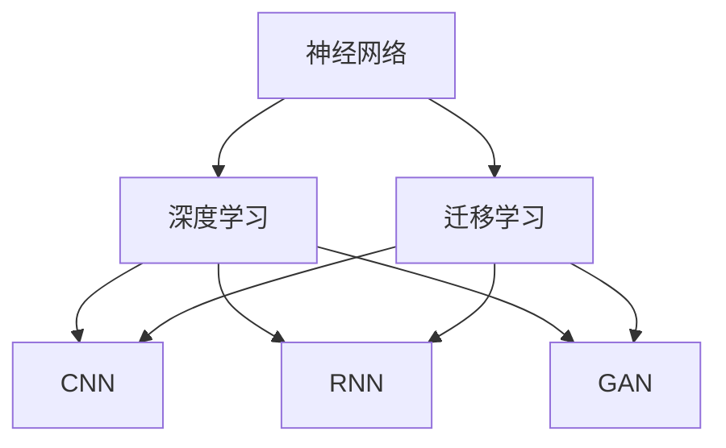

                 

## 1. 背景介绍

在科技快速发展的今天，人类与机器的共存已然成为现实。神经网络，作为人工智能的核心技术，正在引领这场变革。它不仅在图像识别、语音识别等领域大放异彩，还在医疗、金融等传统行业内产生了深远影响。但神经网络的崛起也带来了一系列问题，如数据隐私、算法伦理等，需要人类社会共同面对。本文将系统探讨神经网络的基本原理与核心算法，帮助读者理解人类与机器共存的现状与未来。

## 2. 核心概念与联系

### 2.1 核心概念概述

- **神经网络**：一种受生物神经元结构启发的人工智能模型，通过输入数据的加权和线性组合，经过非线性激活函数进行传递，从而实现对输入数据的映射和预测。
- **深度学习**：一种基于神经网络的机器学习方法，通过多层神经网络的级联结构，可以从大量数据中自动学习特征，提取高层次的抽象表示。
- **迁移学习**：一种机器学习范式，通过在预训练模型上微调，将在新任务上的训练数据量要求降低，提升模型的泛化能力。
- **卷积神经网络（CNN）**：一种特殊形式的神经网络，擅长处理网格状数据，常用于图像识别、语音识别等领域。
- **循环神经网络（RNN）**：一种能够处理序列数据的神经网络，常用于文本生成、机器翻译等领域。
- **生成对抗网络（GAN）**：一种由生成器和判别器构成的对抗模型，能够在无监督条件下生成高质量的图像、视频等。

### 2.2 核心概念原理和架构的 Mermaid 流程图



此图展示了神经网络与其他核心概念之间的关系：深度学习是神经网络的核心实现形式，迁移学习通过在预训练模型上微调，提升了模型的泛化能力。而CNN、RNN、GAN等都是神经网络的不同变种，适用于不同的应用场景。

## 3. 核心算法原理 & 具体操作步骤

### 3.1 算法原理概述

神经网络的核心原理是通过模拟生物神经元的工作机制，实现数据的自动特征提取和模式识别。其基本流程包括前向传播和反向传播两个阶段：

- **前向传播**：将输入数据通过网络逐层传递，生成预测输出。
- **反向传播**：通过比较预测输出与真实标签，反向计算误差梯度，更新模型参数，使得预测输出更加接近真实标签。

深度学习的关键在于通过多层的级联结构，不断提取数据的抽象表示，提升模型的表达能力。常用的深度学习算法包括卷积神经网络（CNN）和循环神经网络（RNN）。

CNN擅长处理网格状数据，常用于图像识别、语音识别等领域。其核心思想是通过卷积层和池化层提取图像的局部特征，通过全连接层进行分类。

RNN能够处理序列数据，常用于自然语言处理、时间序列预测等领域。其核心思想是通过循环层逐个处理序列数据，利用记忆单元（LSTM、GRU等）实现长时记忆。

### 3.2 算法步骤详解

深度学习的训练流程一般包括以下几个关键步骤：

**Step 1: 数据准备**

- 收集标注数据，分为训练集、验证集和测试集。
- 将数据转换为模型所需格式，如将图像数据转换为张量，将文本数据转换为序列。

**Step 2: 模型构建**

- 选择合适的深度学习模型，如CNN、RNN、GAN等。
- 定义模型的超参数，如层数、节点数、激活函数等。

**Step 3: 模型训练**

- 使用训练集进行模型训练，优化损失函数。
- 设置学习率、批大小等训练参数，选择合适的优化器。

**Step 4: 模型评估**

- 在验证集上评估模型性能，调整超参数。
- 在测试集上最终评估模型性能，得到准确率、精度、召回率等指标。

**Step 5: 模型部署**

- 将训练好的模型保存，用于实际应用。
- 集成到应用系统中，进行实时推理预测。

### 3.3 算法优缺点

深度学习的优点包括：

- **自适应学习**：能够自动学习数据中的特征，不需要手工设计特征。
- **泛化能力强**：能够处理大规模数据，提升模型的泛化能力。
- **模型可解释性**：可以通过可视化工具展示中间特征，帮助理解模型的决策过程。

深度学习的缺点包括：

- **模型复杂度高**：需要大量的计算资源和存储空间。
- **训练时间长**：需要长时间训练，对数据集要求高。
- **可解释性差**：“黑盒”模型难以解释决策过程。

### 3.4 算法应用领域

深度学习在多个领域内得到了广泛应用，包括但不限于：

- **计算机视觉**：图像识别、物体检测、人脸识别、自动驾驶等。
- **自然语言处理**：机器翻译、文本分类、情感分析、问答系统等。
- **语音识别**：语音转文本、语音识别、情感识别等。
- **医疗健康**：医学影像分析、疾病预测、基因分析等。
- **金融领域**：信用评分、风险评估、欺诈检测等。
- **交通出行**：智能交通系统、路径规划、交通预测等。

## 4. 数学模型和公式 & 详细讲解 & 举例说明

### 4.1 数学模型构建

以CNN为例，其数学模型可以表示为：

$$
y = W^T\sigma(Z)
$$

其中：
- $Z$ 为输入数据与卷积核的卷积结果。
- $W$ 为卷积核矩阵。
- $\sigma$ 为激活函数，如ReLU。

### 4.2 公式推导过程

以CNN的卷积层为例，其核心推导过程如下：

$$
Z = X * W
$$

其中：
- $X$ 为输入数据张量。
- $W$ 为卷积核张量。
- $*$ 为卷积运算。

通过逐层卷积和激活，CNN能够自动提取输入数据的局部特征，生成中间特征图。

### 4.3 案例分析与讲解

以图像分类为例，CNN可以自动提取图像的局部特征，如边缘、纹理、颜色等。通过多层的级联结构，CNN能够逐步提取出高层次的抽象特征，如物体的轮廓、形状等。最终通过全连接层进行分类，得到图像的标签。

## 5. 项目实践：代码实例和详细解释说明

### 5.1 开发环境搭建

为了便于深度学习模型的开发和实验，可以使用Python的深度学习框架，如TensorFlow、PyTorch等。具体步骤如下：

1. 安装Python和相关依赖。
2. 安装深度学习框架和库，如TensorFlow、Keras等。
3. 准备数据集，分为训练集、验证集和测试集。

### 5.2 源代码详细实现

以图像分类为例，使用TensorFlow实现CNN模型的代码如下：

```python
import tensorflow as tf
from tensorflow.keras import layers

# 构建CNN模型
model = tf.keras.Sequential([
    layers.Conv2D(32, (3,3), activation='relu', input_shape=(28,28,1)),
    layers.MaxPooling2D((2,2)),
    layers.Conv2D(64, (3,3), activation='relu'),
    layers.MaxPooling2D((2,2)),
    layers.Flatten(),
    layers.Dense(64, activation='relu'),
    layers.Dense(10)
])

# 编译模型
model.compile(optimizer='adam',
              loss=tf.keras.losses.SparseCategoricalCrossentropy(from_logits=True),
              metrics=['accuracy'])

# 训练模型
model.fit(train_images, train_labels, epochs=10,
          validation_data=(test_images, test_labels))

# 评估模型
model.evaluate(test_images, test_labels)
```

### 5.3 代码解读与分析

上述代码实现了CNN模型，包括卷积层、池化层、全连接层等。在训练过程中，使用Adam优化器进行模型参数优化，使用交叉熵损失函数计算误差。在测试过程中，使用准确率评估模型性能。

## 6. 实际应用场景

### 6.1 智能交通

深度学习在智能交通领域有着广泛的应用，如智能红绿灯、智能导航等。通过深度学习算法，可以实现对交通数据的自动分析，提升交通管理的智能化水平。

以智能红绿灯为例，通过摄像头拍摄到的交通视频，深度学习模型能够自动分析交通流量，优化红绿灯的放行策略，提升交通效率，减少拥堵。

### 6.2 医疗健康

深度学习在医疗健康领域也有着广泛的应用，如医学影像分析、疾病预测、基因分析等。通过深度学习算法，可以从海量的医疗数据中自动提取特征，提升诊断和治疗的准确性。

以医学影像分析为例，深度学习模型能够自动分析医学影像，如X光片、CT片等，识别出病变区域，辅助医生诊断疾病。

### 6.3 金融风险控制

深度学习在金融领域也有着广泛的应用，如信用评分、风险评估、欺诈检测等。通过深度学习算法，可以从海量的金融数据中自动提取特征，提升风险控制和欺诈检测的准确性。

以信用评分为例，深度学习模型能够自动分析客户的消费行为、信用记录等数据，预测客户的信用风险，辅助银行决策。

### 6.4 未来应用展望

深度学习技术在不断演进，未来有望在更多领域内得到应用，如：

- **智能制造**：通过深度学习算法，可以实现对生产数据的自动分析，提升生产效率，降低成本。
- **智慧农业**：通过深度学习算法，可以实现对农业数据的自动分析，提升农业生产的智能化水平。
- **智能家居**：通过深度学习算法，可以实现对家庭数据的自动分析，提升家居的智能化水平。
- **自动驾驶**：通过深度学习算法，可以实现对交通数据的自动分析，提升自动驾驶的安全性和准确性。

## 7. 工具和资源推荐

### 7.1 学习资源推荐

为了帮助读者系统掌握深度学习技术，推荐以下学习资源：

1. **《深度学习》书籍**：由Ian Goodfellow、Yoshua Bengio、Aaron Courville合著，涵盖了深度学习的基本概念和算法，是深度学习领域的经典教材。
2. **《TensorFlow官方文档》**：由Google开发，提供了TensorFlow的全面介绍和应用示例，是学习TensorFlow的必备资源。
3. **《PyTorch官方文档》**：由Facebook开发，提供了PyTorch的全面介绍和应用示例，是学习PyTorch的必备资源。
4. **Coursera深度学习课程**：由Andrew Ng主讲，系统介绍了深度学习的基本概念和算法，适合初学者入门。
5. **Kaggle数据科学竞赛平台**：提供了大量的深度学习竞赛项目，适合实战训练。

### 7.2 开发工具推荐

为了便于深度学习模型的开发和实验，推荐以下开发工具：

1. **TensorFlow**：由Google开发，支持多种深度学习算法，是深度学习领域的标准工具。
2. **PyTorch**：由Facebook开发，支持动态计算图，易于调试和优化。
3. **Keras**：基于TensorFlow和Theano，提供高层次的API接口，易于使用。
4. **Jupyter Notebook**：提供交互式的编程环境，方便调试和分享代码。
5. **GitHub**：提供代码托管服务，方便版本控制和协作开发。

### 7.3 相关论文推荐

深度学习技术在不断演进，以下是几篇奠基性的相关论文，推荐阅读：

1. **《ImageNet Classification with Deep Convolutional Neural Networks》**：提出卷积神经网络（CNN），开启了图像识别的新时代。
2. **《A Tutorial on Deep Learning》**：由Ian Goodfellow等合著，介绍了深度学习的基本概念和算法。
3. **《Generative Adversarial Nets》**：提出生成对抗网络（GAN），开启了生成模型的研究。
4. **《Long Short-Term Memory》**：提出长短期记忆网络（LSTM），解决了RNN的长期依赖问题。
5. **《Attention is All You Need》**：提出Transformer模型，提升了自然语言处理的效果。

## 8. 总结：未来发展趋势与挑战

### 8.1 研究成果总结

深度学习技术在多个领域内取得了显著成果，提升了模型的表达能力和泛化能力，推动了人工智能技术的普及应用。

### 8.2 未来发展趋势

深度学习技术的未来发展趋势包括：

- **模型规模不断增大**：深度学习模型将继续扩大规模，提升模型的表达能力。
- **模型结构不断优化**：深度学习模型将继续优化，提升模型的计算效率和推理速度。
- **跨领域融合不断深入**：深度学习技术将继续与多种领域进行融合，提升应用场景的智能化水平。
- **跨模态数据处理不断提升**：深度学习技术将继续提升对多模态数据的处理能力，实现视觉、语音、文本等多种数据的协同建模。
- **可解释性不断增强**：深度学习技术将继续提升模型的可解释性，增强模型的透明度和可信度。

### 8.3 面临的挑战

深度学习技术在不断演进，但也面临诸多挑战，包括：

- **数据隐私保护**：深度学习模型需要大量的数据进行训练，如何保护数据隐私是重要的挑战。
- **算法伦理问题**：深度学习模型容易出现偏见和歧视，如何确保算法的公正性和伦理性是重要的挑战。
- **模型可解释性不足**：深度学习模型通常是“黑盒”模型，难以解释模型的决策过程。
- **计算资源消耗高**：深度学习模型需要大量的计算资源和存储空间，如何降低计算成本是重要的挑战。
- **对抗攻击问题**：深度学习模型容易被对抗样本攻击，如何提升模型的鲁棒性是重要的挑战。

### 8.4 研究展望

未来深度学习技术的研究方向包括：

- **数据隐私保护**：开发隐私保护算法，确保深度学习模型在数据隐私保护方面的安全性和可靠性。
- **算法伦理问题**：开发伦理导向的算法，确保深度学习模型的公正性和透明性。
- **模型可解释性**：开发可解释性模型，增强深度学习模型的透明度和可信度。
- **计算资源优化**：优化深度学习模型的计算图和存储方式，降低计算成本和存储空间。
- **对抗攻击防御**：开发对抗攻击防御算法，提升深度学习模型的鲁棒性和安全性。

## 9. 附录：常见问题与解答

### Q1：深度学习模型与传统机器学习模型的区别是什么？

A: 深度学习模型与传统机器学习模型最大的区别在于模型的复杂度。深度学习模型通过多层级联结构，自动提取数据的高层次特征，而传统机器学习模型需要手工设计特征。深度学习模型具有更好的表达能力和泛化能力，但需要更多的计算资源和存储空间。

### Q2：如何提升深度学习模型的可解释性？

A: 提升深度学习模型的可解释性可以从以下几个方面入手：
- **可视化中间特征**：通过可视化中间特征，帮助理解模型的决策过程。
- **开发可解释性模型**：开发可解释性模型，如决策树、规则模型等，增强模型的透明度。
- **使用对抗样本**：使用对抗样本攻击模型，发现模型的脆弱点和决策过程，提升模型的鲁棒性。
- **集成多种模型**：集成多种模型，通过投票等方式提高模型的透明度和可信度。

### Q3：深度学习模型在实际应用中需要注意哪些问题？

A: 深度学习模型在实际应用中需要注意以下几个问题：
- **数据隐私保护**：确保深度学习模型在数据隐私保护方面的安全性和可靠性。
- **算法伦理问题**：确保深度学习模型的公正性和透明性，避免偏见和歧视。
- **模型可解释性**：提升深度学习模型的透明度和可信度，增强用户信任。
- **计算资源优化**：优化深度学习模型的计算图和存储方式，降低计算成本和存储空间。
- **对抗攻击防御**：开发对抗攻击防御算法，提升深度学习模型的鲁棒性和安全性。

### Q4：深度学习模型与生成对抗网络（GAN）的区别是什么？

A: 深度学习模型与生成对抗网络（GAN）的区别在于模型的应用目标和训练方式。深度学习模型通常用于分类、回归等任务，通过反向传播算法进行训练，而GAN是一种生成模型，用于生成高质量的图像、视频等，通过生成器和判别器的对抗训练进行训练。GAN在生成高质量样本方面表现优异，但训练过程较为复杂，需要大量的计算资源和存储空间。

### Q5：深度学习模型与传统人工智能模型的区别是什么？

A: 深度学习模型与传统人工智能模型的区别在于模型的结构和训练方式。传统人工智能模型通常使用手工设计的特征，需要人工干预和调试，而深度学习模型能够自动提取数据的高层次特征，需要大量数据进行训练。深度学习模型具有更好的表达能力和泛化能力，但需要更多的计算资源和存储空间。

通过本文的系统梳理，可以看到，深度学习技术正在引领人类与机器的共存，带来新的生产力和价值。未来，深度学习技术将继续在更多领域内得到应用，推动人工智能技术的普及和智能化水平的提升。

