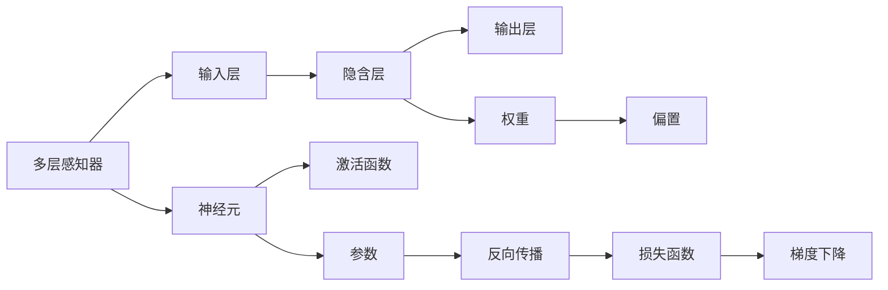

                 

# 神经网络：人类智慧的延伸

> 关键词：神经网络,深度学习,人工智能,机器学习,反向传播,梯度下降,计算图,梯度累积,模型压缩,计算性能优化

## 1. 背景介绍

### 1.1 问题由来
随着人工智能技术的迅猛发展，神经网络（Neural Network, NN）和深度学习（Deep Learning, DL）正逐步成为人工智能的核心技术。无论是在计算机视觉、自然语言处理、语音识别等传统领域，还是在无人驾驶、金融风控、医疗诊断等前沿领域，神经网络和深度学习都展现出强大的应用前景和潜在的革命性影响。然而，目前神经网络的理论和实践仍面临着诸多挑战和瓶颈。为了更好地理解神经网络及其应用，本文将从基本概念、核心算法、项目实践、实际应用等多个维度对神经网络进行深入探讨，揭示其在人工智能领域的深层价值和巨大潜力。

## 2. 核心概念与联系

### 2.1 核心概念概述

神经网络（Neural Network, NN）是一类模拟生物神经系统的计算模型，由大量人工神经元组成，用于处理和学习复杂的数据模式。与传统的人工智能方法不同，神经网络通过自动学习数据特征，无需手动提取特征，可适应多变的输入数据，并具有良好的泛化能力。神经网络的典型结构包括多层感知器（Multi-Layer Perceptron, MLP）、卷积神经网络（Convolutional Neural Network, CNN）、循环神经网络（Recurrent Neural Network, RNN）、变分自编码器（Variational Autoencoder, VAE）等。

深度学习（Deep Learning, DL）是神经网络的一种高级形式，通过多层次的抽象表示和复杂的非线性关系，可以处理更复杂、更抽象的高级特征，如图像、语音、自然语言等。深度学习通过训练大量的数据，使得神经网络可以学习到特征表示，从而在图像识别、自然语言处理、语音识别等领域取得显著的进步。

### 2.2 核心概念原理和架构的 Mermaid 流程图



这个流程图展示了多层感知器（MLP）的基本结构和工作原理。其中：
- 输入层接收数据，通过权重矩阵和偏置向量传递到隐含层。
- 隐含层执行非线性变换，输出结果进入输出层。
- 激活函数用于引入非线性关系，提升模型表达能力。
- 反向传播算法计算损失函数的梯度，并用于更新模型参数。
- 梯度下降优化算法更新模型权重，最小化损失函数。

## 3. 核心算法原理 & 具体操作步骤

### 3.1 算法原理概述

神经网络的基本工作原理是通过反向传播算法和梯度下降算法更新模型参数，最小化损失函数，从而实现数据的预测或分类。反向传播算法是一种前向传播和反向传播相结合的算法，用于计算损失函数对模型参数的梯度，并将其回传给网络中的每一层，更新参数。梯度下降算法则通过不断调整模型参数，逐步降低损失函数，最终得到最优模型。

### 3.2 算法步骤详解

神经网络的具体训练步骤包括：
1. 数据准备：收集训练集、验证集和测试集，并进行预处理。
2. 搭建模型：选择适当的神经网络架构和激活函数，设置初始参数。
3. 前向传播：将训练数据输入模型，计算输出结果。
4. 计算损失：根据实际输出与真实标签之间的差距，计算损失函数。
5. 反向传播：计算损失函数对模型参数的梯度，并反向传播更新参数。
6. 更新权重：根据梯度下降算法调整模型参数，更新权重矩阵和偏置向量。
7. 验证集评估：在验证集上评估模型性能，调整超参数。
8. 测试集评估：在测试集上评估最终模型性能，确定模型效果。

### 3.3 算法优缺点

神经网络的优点包括：
- 强大的非线性表达能力，可以适应各种复杂的输入数据。
- 自动学习特征，无需手动提取，减少特征工程的工作量。
- 适用于大规模数据训练，可以通过并行计算加速训练过程。

然而，神经网络也存在一些局限：
- 训练数据需求量大，需要大量标注数据。
- 参数量庞大，模型复杂度较高，难以解释和调试。
- 过拟合风险高，特别是面对复杂数据和深层网络时，容易出现过拟合。
- 需要高性能计算资源，如GPU、TPU等，才能高效训练。

### 3.4 算法应用领域

神经网络的应用领域广泛，包括但不限于：
- 计算机视觉：如图像识别、物体检测、人脸识别等。
- 自然语言处理：如文本分类、机器翻译、语音识别等。
- 语音识别：如语音合成、语音识别、情感分析等。
- 生物信息学：如基因序列分析、蛋白质结构预测等。
- 金融科技：如风险评估、信用评分、智能投顾等。
- 医疗健康：如疾病诊断、医学影像分析、智能问诊等。

## 4. 数学模型和公式 & 详细讲解 & 举例说明

### 4.1 数学模型构建

神经网络的数学模型可以表示为：
$$
f(x; \theta) = \sigma(W^{(L)} \sigma(W^{(L-1)} \cdots \sigma(W^{(1)}x + b^{(1)}))
$$

其中，$x$ 为输入向量，$W$ 为权重矩阵，$b$ 为偏置向量，$\sigma$ 为激活函数，$L$ 为网络层数，$\theta$ 为模型参数。

### 4.2 公式推导过程

以简单的二分类问题为例，神经网络的结构可以表示为：
- 输入层：$x \in R^n$，其中 $n$ 为输入特征数量。
- 隐含层：$h_1 = \sigma(W_1x + b_1)$，其中 $\sigma$ 为激活函数，如ReLU、Sigmoid等。
- 输出层：$y = \sigma(W_2h_1 + b_2)$，其中 $\sigma$ 为激活函数。

通过链式法则，计算损失函数 $L$ 对权重 $W_1$ 和 $W_2$ 的梯度：
$$
\frac{\partial L}{\partial W_1} = \frac{\partial L}{\partial h_1} \frac{\partial h_1}{\partial W_1} + \frac{\partial L}{\partial W_2} \frac{\partial y}{\partial h_1} \frac{\partial h_1}{\partial W_1}
$$
$$
\frac{\partial L}{\partial W_2} = \frac{\partial L}{\partial y} \frac{\partial y}{\partial h_1} \frac{\partial h_1}{\partial W_2}
$$

其中，$\frac{\partial y}{\partial h_1} = \sigma'(W_2h_1 + b_2)h_1$，$\frac{\partial h_1}{\partial W_1} = x\sigma'(W_1x + b_1)$，$\frac{\partial h_1}{\partial W_2} = \sigma'(W_1x + b_1)h_1$。

### 4.3 案例分析与讲解

以手写数字识别为例，我们可以使用多层感知器（MLP）进行训练。数据集可以来源于MNIST，每个样本包含一个28x28的灰度图像和对应的数字标签。模型的输入层包含784个节点（28x28），输出层包含10个节点（0-9数字）。在训练过程中，通过反向传播算法和梯度下降算法不断调整模型参数，使得模型输出接近真实标签，最终实现手写数字识别。

## 5. 项目实践：代码实例和详细解释说明

### 5.1 开发环境搭建

项目实践需要搭建一个深度学习开发环境。以下是一个简单的环境配置示例：

1. 安装Anaconda：
   ```
   conda create -n deep-learning python=3.7
   conda activate deep-learning
   ```

2. 安装深度学习库：
   ```
   conda install torch torchvision torchaudio
   pip install numpy scipy pandas matplotlib scikit-learn pytorch-lightning
   ```

3. 安装TensorBoard和Weights & Biases：
   ```
   pip install tensorboard wandb
   ```

### 5.2 源代码详细实现

以下是一个简单的MNIST手写数字识别项目，使用PyTorch实现：

```python
import torch
import torch.nn as nn
import torch.optim as optim
import torchvision.transforms as transforms
import torchvision.datasets as datasets
import torchvision.models as models
import torch.utils.data as data
from torch.autograd import Variable
import torch.nn.functional as F
import numpy as np
import matplotlib.pyplot as plt

class Net(nn.Module):
    def __init__(self):
        super(Net, self).__init__()
        self.conv1 = nn.Conv2d(1, 10, kernel_size=5)
        self.conv2 = nn.Conv2d(10, 20, kernel_size=5)
        self.fc1 = nn.Linear(320, 50)
        self.fc2 = nn.Linear(50, 10)

    def forward(self, x):
        x = F.relu(F.max_pool2d(self.conv1(x), 2))
        x = F.relu(F.max_pool2d(self.conv2(x), 2))
        x = x.view(-1, 320)
        x = F.relu(self.fc1(x))
        x = self.fc2(x)
        return F.log_softmax(x, dim=1)

net = Net()

criterion = nn.NLLLoss()
optimizer = optim.SGD(net.parameters(), lr=0.01, momentum=0.5)

train_loader = data.DataLoader(datasets.MNIST(root='./data', train=True, download=True, transform=transforms.ToTensor()), batch_size=64, shuffle=True)
test_loader = data.DataLoader(datasets.MNIST(root='./data', train=False, transform=transforms.ToTensor()), batch_size=64, shuffle=False)

for epoch in range(10):
    running_loss = 0.0
    for i, data in enumerate(train_loader, 0):
        inputs, labels = data
        optimizer.zero_grad()
        outputs = net(Variable(inputs))
        loss = criterion(outputs, Variable(labels))
        loss.backward()
        optimizer.step()
        running_loss += loss.item()
        if i % 2000 == 1999:
            print('[%d, %5d] loss: %.3f' % (epoch + 1, i + 1, running_loss / 2000))
            running_loss = 0.0

print('Finished Training')

correct = 0
total = 0
with torch.no_grad():
    for data in test_loader:
        images, labels = data
        outputs = net(Variable(images))
        _, predicted = torch.max(outputs.data, 1)
        total += labels.size(0)
        correct += (predicted == labels).sum().item()

print('Accuracy of the network on the 10000 test images: %d %%' % (100 * correct / total))
```

### 5.3 代码解读与分析

**Net类**：定义神经网络的结构，包含两个卷积层和两个全连接层。

**train_loader和test_loader**：使用PyTorch的DataLoader对训练集和测试集进行批处理，方便模型训练和评估。

**forward方法**：前向传播，计算模型输出。

**criterion和optimizer**：定义损失函数和优化器，使用交叉熵损失和随机梯度下降（SGD）优化算法。

**训练循环**：通过前向传播和反向传播，不断更新模型参数，最终输出训练损失和测试准确率。

## 6. 实际应用场景

### 6.1 智能客服系统

智能客服系统通过深度学习技术，实现自然语言处理和对话生成，提升客服效率和用户满意度。系统可以分析用户历史对话记录，识别常见问题，并提供自动回复。在实际应用中，可以部署多台服务器，并使用GPU加速训练和推理，实现高效的服务体验。

### 6.2 医疗影像分析

深度学习在医疗影像分析中得到广泛应用，如图像分割、病灶检测、病理切片分析等。例如，卷积神经网络（CNN）可以用于医疗影像的像素级别分类，生成高精度的医学图像。在实际应用中，需要部署在云端或边缘服务器上，提供实时诊断服务。

### 6.3 金融风险评估

金融领域可以利用深度学习模型进行风险评估和欺诈检测。例如，RNN可以用于时间序列分析，预测股票价格和市场趋势。在实际应用中，需要结合多个深度学习模型进行联合预测，并使用GPU进行并行计算。

### 6.4 未来应用展望

未来深度学习的应用将更加广泛和深入，涵盖更多的垂直领域和实际场景。以下是一些潜在的应用领域：

1. 无人驾驶：深度学习用于图像和视频分析，提高自动驾驶系统的安全性。
2. 工业制造：深度学习用于预测和预防故障，提高生产效率和设备寿命。
3. 金融科技：深度学习用于量化交易和风险管理，提升金融决策的准确性。
4. 教育培训：深度学习用于个性化学习，提供智能化的教学辅助。
5. 农业科技：深度学习用于农作物病害识别和精准农业，提升农业生产效率。

## 7. 工具和资源推荐

### 7.1 学习资源推荐

以下是一些深度学习相关的学习资源：

1. 《深度学习》（Ian Goodfellow等著）：深度学习领域的经典教材，涵盖理论和实践。
2. CS231n《卷积神经网络》（斯坦福大学）：深度学习的入门课程，介绍CNN的基本概念和应用。
3. CS224n《序列建模与自然语言处理》（斯坦福大学）：自然语言处理领域的深度学习课程，介绍RNN、LSTM等模型。
4. DeepLearning.AI（吴恩达等）：深度学习领域的在线课程平台，提供丰富的学习资源和实战案例。
5. TensorFlow官方文档：TensorFlow的官方文档，详细介绍了深度学习库的使用方法。

### 7.2 开发工具推荐

以下是一些常用的深度学习开发工具：

1. PyTorch：基于Python的开源深度学习框架，支持动态图和静态图计算图。
2. TensorFlow：谷歌开发的深度学习框架，支持分布式计算和GPU加速。
3. Keras：高级神经网络API，基于TensorFlow等后端，提供简单易用的API接口。
4. JAX：谷歌开发的自动微分库，支持Python和Numpy，用于高效计算和优化。
5. MindSpore：华为开源的深度学习框架，支持CPU和GPU计算。

### 7.3 相关论文推荐

以下是一些深度学习领域的经典论文：

1. 《ImageNet Classification with Deep Convolutional Neural Networks》（AlexNet）：介绍CNN在图像分类中的应用。
2. 《Long Short-Term Memory》（LSTM）：介绍LSTM在序列建模中的应用。
3. 《Attention is All You Need》：介绍Transformer在自然语言处理中的应用。
4. 《Generative Adversarial Networks》（GAN）：介绍生成对抗网络在图像生成中的应用。
5. 《A Survey on Deep Learning-Based Speech Recognition》：介绍深度学习在语音识别中的应用。

## 8. 总结：未来发展趋势与挑战

### 8.1 研究成果总结

深度学习在人工智能领域取得了显著的进展，尤其在计算机视觉、自然语言处理、语音识别等领域取得了重大的突破。深度学习通过多层抽象和复杂非线性关系，能够学习到复杂的特征表示，适应多变的输入数据，并具有良好的泛化能力。

### 8.2 未来发展趋势

未来深度学习的发展将呈现以下趋势：

1. 深度学习模型的规模将继续扩大，参数量将进一步增加，模型复杂度将进一步提升。
2. 深度学习模型的训练和推理将更加高效，采用分布式计算和优化算法，提升训练速度和推理速度。
3. 深度学习模型的应用将更加广泛，涵盖更多垂直领域和实际场景，提升各行业的智能化水平。
4. 深度学习模型的可解释性将得到进一步提升，利用可视化工具和技术，增强模型的透明度和可信度。
5. 深度学习模型的安全性将得到更加重视，采用数据脱敏和加密技术，保障模型的隐私和安全。

### 8.3 面临的挑战

尽管深度学习在人工智能领域取得了显著的进展，但仍面临以下挑战：

1. 数据需求量大，获取高质量标注数据成本高，数据分布不均衡。
2. 模型复杂度高，训练和推理计算资源需求高，训练和推理速度慢。
3. 模型存在过拟合风险，泛化能力不足，难以应对复杂数据和深层网络。
4. 模型可解释性不足，难以理解模型的内部工作机制和决策逻辑。
5. 模型安全性有待提升，存在被攻击和滥用的风险。

### 8.4 研究展望

未来深度学习的研究方向包括：

1. 数据增强和迁移学习：通过数据增强和迁移学习，缓解深度学习模型对大量标注数据的依赖，提升模型的泛化能力。
2. 可解释性和透明化：通过可视化工具和技术，提升深度学习模型的可解释性，增强模型的可信度和透明度。
3. 模型压缩和优化：通过模型压缩和优化技术，减小深度学习模型的计算资源需求，提升模型的训练和推理速度。
4. 安全性和隐私保护：通过数据加密和隐私保护技术，提升深度学习模型的安全性，保障模型的隐私和可信度。

## 9. 附录：常见问题与解答

**Q1：深度学习模型如何避免过拟合？**

A: 深度学习模型避免过拟合的方法包括：
1. 数据增强：通过数据扩充、随机裁剪等技术，增加训练数据的多样性。
2. 正则化：使用L2正则化、Dropout等技术，控制模型复杂度，防止过拟合。
3. 提前停止：在验证集上监控模型性能，一旦性能不再提升，提前停止训练。
4. 模型集成：通过模型集成技术，如Bagging、Boosting等，提升模型的泛化能力。

**Q2：深度学习模型的训练和推理速度如何提升？**

A: 深度学习模型的训练和推理速度可以通过以下方法提升：
1. 使用GPU和TPU等高性能计算资源，加速计算。
2. 使用分布式计算和并行计算，提升训练和推理速度。
3. 使用模型压缩和优化技术，减小模型的计算资源需求。
4. 使用高效的模型架构和算法，如Transformer、ResNet等。

**Q3：深度学习模型的可解释性如何提升？**

A: 深度学习模型的可解释性可以通过以下方法提升：
1. 使用可视化工具，如TensorBoard、WandB等，可视化模型的训练过程和结果。
2. 使用模型压缩和解释技术，如Pruning、Quantization等，减小模型的复杂度。
3. 使用符号化的解释方法，如Attention、LIME等，解释模型的决策过程。
4. 使用知识图谱和规则库，结合符号化推理，提升模型的解释性。

**Q4：深度学习模型的安全性如何保障？**

A: 深度学习模型的安全性可以通过以下方法保障：
1. 数据加密和隐私保护技术，保障数据的隐私和安全性。
2. 模型审计和审查，发现和修复模型的漏洞和安全隐患。
3. 模型鲁棒性测试，检测模型的鲁棒性和抗攻击能力。
4. 模型集成和协同学习，提升模型的鲁棒性和安全性。

---

作者：禅与计算机程序设计艺术 / Zen and the Art of Computer Programming

